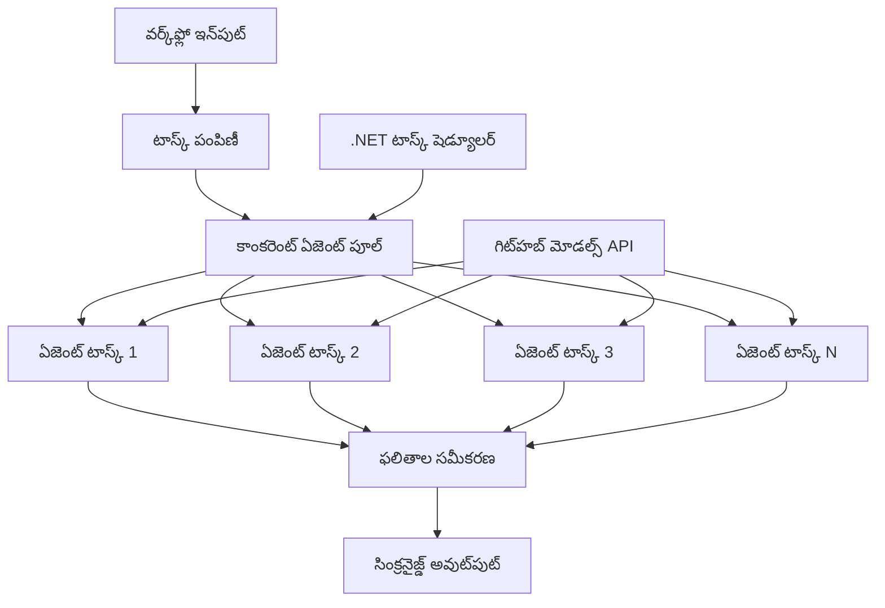

<!--
CO_OP_TRANSLATOR_METADATA:
{
  "original_hash": "b9c6e32c9b5f2fed20b6916984440d88",
  "translation_date": "2025-12-03T16:24:49+00:00",
  "source_file": "08-multi-agent/code_samples/workflows-agent-framework/dotNET/03.dotnet-agent-framework-workflow-ghmodel-concurrent.md",
  "language_code": "te"
}
-->
# ⚡ GitHub మోడల్స్‌తో సమాంతర ఏజెంట్ వర్క్‌ఫ్లోలు (.NET)

## 📋 అధిక-నిర్వహణ సామర్థ్యంతో సమాంతర ప్రాసెసింగ్ ట్యుటోరియల్

ఈ నోట్‌బుక్ Microsoft Agent Framework కోసం .NET మరియు GitHub మోడల్స్ ఉపయోగించి **సమాంతర వర్క్‌ఫ్లో ప్యాటర్న్‌లను** ప్రదర్శిస్తుంది. మీరు అనేక AI ఏజెంట్లను ఒకేసారి అమలు చేయడం ద్వారా గరిష్ట ఉత్పాదకతను సాధించేటట్లు అధిక-నిర్వహణ సామర్థ్యంతో సమాంతర ప్రాసెసింగ్ వర్క్‌ఫ్లోలను ఎలా నిర్మించాలో నేర్చుకుంటారు, అదే సమయంలో సమన్వయం మరియు డేటా స్థిరత్వాన్ని నిర్వహిస్తారు.

## 🎯 నేర్చుకునే లక్ష్యాలు

### 🚀 **సమాంతర ప్రాసెసింగ్ ప్రాథమికాలు**
- **సమాంతర ఏజెంట్ అమలు**: గరిష్ట పనితీరు కోసం అనేక AI ఏజెంట్లను ఒకేసారి అమలు చేయండి
- **Async/Await ప్యాటర్న్‌లు**: సమర్థవంతమైన సమాంతరత కోసం .NET యొక్క async ప్రోగ్రామింగ్ మోడల్‌ను ఉపయోగించండి
- **GitHub మోడల్స్ ఇంటిగ్రేషన్**: GitHub యొక్క AI మోడల్ ఇన్ఫరెన్స్ సర్వీస్‌కు అనేక సమాంతర కాల్స్‌ను సమన్వయం చేయండి
- **వనరుల నిర్వహణ**: సమాంతర ఆపరేషన్లలో AI మోడల్ వనరులను సమర్థవంతంగా నిర్వహించండి

### 🏗️ **అధునాతన సమాంతర ఆర్కిటెక్చర్**
- **Task-Based Parallelism**: సమర్థవంతమైన సమాంతర అమలుకు .NET Task Parallel Libraryని ఉపయోగించండి
- **సమన్వయ ప్యాటర్న్‌లు**: రేస్ కండిషన్‌లను నివారించేటట్లు సమాంతర ఏజెంట్లను సమన్వయం చేయండి
- **లోడ్ బ్యాలెన్సింగ్**: అందుబాటులో ఉన్న సమాంతర ప్రాసెసింగ్ సామర్థ్యాన్ని సమర్థవంతంగా పంపిణీ చేయండి
- **ఫాల్ట్ టాలరెన్స్**: మొత్తం వర్క్‌ఫ్లో ఆగకుండా వ్యక్తిగత ఏజెంట్ వైఫల్యాలను నిర్వహించండి

### 🏢 **ఎంటర్‌ప్రైజ్ సమాంతర అప్లికేషన్లు**
- **అధిక-వాల్యూమ్ డాక్యుమెంట్ ప్రాసెసింగ్**: అనేక డాక్యుమెంట్‌లను ఒకేసారి ప్రాసెస్ చేయండి
- **రియల్-టైమ్ కంటెంట్ విశ్లేషణ**: వచ్చే డేటా స్ట్రీమ్‌లను సమాంతరంగా విశ్లేషించండి
- **బ్యాచ్ ప్రాసెసింగ్ ఆప్టిమైజేషన్**: పెద్ద-స్థాయి డేటా ప్రాసెసింగ్ ఆపరేషన్ల కోసం గరిష్ట ఉత్పాదకతను సాధించండి
- **మల్టీ-మోడల్ విశ్లేషణ**: వివిధ కంటెంట్ రకాల మరియు ఫార్మాట్‌లను సమాంతరంగా ప్రాసెస్ చేయండి

## ⚙️ అవసరమైనవి & సెటప్

### 📦 **అవసరమైన NuGet ప్యాకేజీలు**

అధిక-నిర్వహణ సామర్థ్యంతో సమాంతర వర్క్‌ఫ్లోల కోసం అవసరమైన ప్యాకేజీలు:

```xml
<!-- Core AI Framework with Async Support -->
<PackageReference Include="Microsoft.Extensions.AI" Version="9.9.0" />

<!-- Client Model Abstractions for API Communication -->
<PackageReference Include="System.ClientModel" Version="1.6.1.0" />

<!-- Azure Identity and Async LINQ for Advanced Operations -->
<PackageReference Include="Azure.Identity" Version="1.15.0" />
<PackageReference Include="System.Linq.Async" Version="6.0.3" />

<!-- Local Agent Framework References -->
<!-- Microsoft.Agents.AI.dll - Core agent abstractions with async support -->
<!-- Microsoft.Agents.AI.OpenAI.dll - GitHub Models integration with concurrency -->
```

### 🔑 **GitHub మోడల్స్ కాన్ఫిగరేషన్**

**పర్యావరణ సెటప్ (.env ఫైల్):**
```env
GITHUB_TOKEN=your_github_personal_access_token
GITHUB_ENDPOINT=https://models.inference.ai.azure.com
GITHUB_MODEL_ID=gpt-4o-mini
```

**సమాంతర ప్రాసెసింగ్ అంశాలు:**
```csharp
// Configure for concurrent operations
var clientOptions = new OpenAIClientOptions()
{
    Endpoint = new Uri(githubEndpoint),
    // Configure connection pooling for concurrent requests
    NetworkTimeout = TimeSpan.FromMinutes(5)
};
```

### 🏗️ **సమాంతర వర్క్‌ఫ్లో ఆర్కిటెక్చర్**


**ముఖ్యమైన భాగాలు:**
- **Task Parallel Library**: సమాంతర ఆపరేషన్ల కోసం .NET లోని బిల్ట్-ఇన్ సపోర్ట్
- **Agent Pool**: సమాంతర ప్రాసెసింగ్ కోసం అనేక ఏజెంట్ ఇన్‌స్టాన్స్‌లు
- **ఫలితాల సమీకరణ**: సమాంతర ఏజెంట్ ఫలితాల సమన్వయం మరియు విలీనం
- **సమన్వయ పాయింట్లు**: సమాంతర ఆపరేషన్లలో డేటా స్థిరత్వాన్ని నిర్ధారించండి

## 🎨 **సమాంతర వర్క్‌ఫ్లో డిజైన్ ప్యాటర్న్‌లు**

### 🔍 **సమాంతర పరిశోధన & విశ్లేషణ**
```
Research Topic → Concurrent Research Agents → Result Synthesis → Final Report
```

### 📊 **మల్టీ-సోర్స్ డేటా ప్రాసెసింగ్**
```
Data Sources → Parallel Processing Agents → Data Integration → Unified Output
```

### 🎭 **కంటెంట్ జనరేషన్ పైప్‌లైన్**
```
Content Requirements → Concurrent Content Generators → Quality Review → Final Content
```

### 🔄 **Fan-Out/Fan-In ప్రాసెసింగ్**
```
Single Input → Multiple Concurrent Processors → Result Aggregation → Single Output
```

## 🏢 **ఎంటర్‌ప్రైజ్ పనితీరు ప్రయోజనాలు**

### ⚡ **ఉత్పాదకత & స్కేలబిలిటీ**
- **లీనియర్ పనితీరు స్కేలింగ్**: ఉత్పాదకతను పెంచడానికి మరిన్ని సమాంతర ఏజెంట్లను జోడించండి
- **వనరుల వినియోగం**: అందుబాటులో ఉన్న AI మోడల్ సామర్థ్యాన్ని గరిష్టంగా వినియోగించుకోండి
- **తగ్గిన ప్రాసెసింగ్ సమయం**: సమాంతర అమలుతో గణనీయమైన సమయ తగ్గింపు
- **ఎలాస్టిక్ స్కేలింగ్**: వర్క్‌లోడ్ ఆధారంగా సమాంతర ఏజెంట్ సంఖ్యను డైనమిక్‌గా సర్దుబాటు చేయండి

### 🛡️ **నమ్మకదర్త & రిజిలియన్స్**
- **ఫాల్ట్ ఐసోలేషన్**: వ్యక్తిగత ఏజెంట్ వైఫల్యాలు ఇతర సమాంతర ఆపరేషన్లను ప్రభావితం చేయవు
- **గ్రేస్‌ఫుల్ డీగ్రడేషన్**: తగ్గిన ఏజెంట్ సామర్థ్యంతో వ్యవస్థ కొనసాగుతుంది
- **ఎర్రర్ రికవరీ**: విఫలమైన సమాంతర ఆపరేషన్ల కోసం ఆటోమేటిక్ రీట్రై మెకానిజం
- **లోడ్ డిస్ట్రిబ్యూషన్**: అందుబాటులో ఉన్న ఏజెంట్లలో పని సమానంగా పంపిణీ చేయడం

### 📊 **పనితీరు మానిటరింగ్**
- **సమాంతర అమలు మెట్రిక్స్**: అన్ని సమాంతర ఆపరేషన్ల పనితీరును ట్రాక్ చేయండి
- **వనరుల వినియోగ విశ్లేషణ**: CPU, మెమరీ, మరియు నెట్‌వర్క్ వినియోగాన్ని మానిటర్ చేయండి
- **ఉత్పాదకత విశ్లేషణ**: సమాంతర ప్రాసెసింగ్ ద్వారా పొందిన సామర్థ్య లాభాలను కొలవండి
- **బాటిల్‌నెక్ డిటెక్షన్**: పనితీరు పరిమితులను గుర్తించి పరిష్కరించండి

### 🔧 **డెవలప్‌మెంట్ & ఆపరేషన్లు**
- **Async ప్రోగ్రామింగ్ మోడల్**: .NET యొక్క పటిష్టమైన async/await ప్యాటర్న్‌లను ఉపయోగించండి
- **టాస్క్ సమన్వయం**: బిల్ట్-ఇన్ టాస్క్ నిర్వహణ మరియు సమన్వయ సామర్థ్యాలు
- **ఎక్సెప్షన్ హ్యాండ్లింగ్**: సమాంతర ఆపరేషన్ల కోసం సమగ్ర ఎర్రర్ హ్యాండ్లింగ్
- **డీబగింగ్ సపోర్ట్**: సమాంతర వర్క్‌ఫ్లోల కోసం Visual Studio డీబగింగ్ టూల్స్

.NETతో అధిక-నిర్వహణ సామర్థ్యంతో సమాంతర AI వర్క్‌ఫ్లోలను నిర్మిద్దాం! 🚀

## 💻 కోడ్ అమలు

పూర్తి అమలు `03.dotnet-agent-framework-workflow-ghmodel-concurrent.cs` లో అందుబాటులో ఉంది. ఈ ఫైల్ ట్రావెల్ ప్లానింగ్ కోసం **Fan-Out/Fan-In సమాంతర వర్క్‌ఫ్లో**ను ప్రదర్శిస్తుంది:

### 🏗️ **వర్క్‌ఫ్లో ఆర్కిటెక్చర్**

```
User Request → ConcurrentStartExecutor → [Researcher Agent || Planner Agent] → ConcurrentAggregationExecutor → Final Output
```

**ముఖ్యమైన భాగాలు:**

1. **ConcurrentStartExecutor**: వినియోగదారు అభ్యర్థనను ఒకేసారి అన్ని ఏజెంట్లకు ప్రసారం చేస్తుంది
2. **Researcher Agent**: గమ్యస్థానాలు మరియు ఆకర్షణలను సమాంతరంగా విశ్లేషిస్తుంది
3. **Planner Agent**: సమాంతరంగా వివరణాత్మక ట్రావెల్ ప్లాన్‌లను సృష్టిస్తుంది
4. **ConcurrentAggregationExecutor**: రెండు ఏజెంట్ల నుండి ఫలితాలను సేకరించి విలీనం చేస్తుంది

### 🎯 **Fan-Out/Fan-In ప్యాటర్న్**

ఈ వర్క్‌ఫ్లో క్లాసిక్ **Fan-Out/Fan-In** ప్యాటర్న్‌ను ప్రదర్శిస్తుంది:
- **Fan-Out**: ఒక ఇన్‌పుట్ సందేశం అనేక ఏజెంట్లకు ఒకేసారి ప్రసారం చేయబడుతుంది
- **సమాంతర ప్రాసెసింగ్**: అనేక ఏజెంట్లు ఒకే పనిపై సమాంతరంగా పనిచేస్తాయి
- **Fan-In**: అన్ని ఏజెంట్ల ఫలితాలను సేకరించి ఒకే అవుట్‌పుట్‌గా విలీనం చేస్తుంది

### 🚀 ఉదాహరణ అమలు

```bash
# స్క్రిప్ట్‌ను అమలు చేయగలిగేలా చేయండి (యూనిక్స్/లినక్స్/మ్యాక్‌ఓఎస్)
chmod +x 03.dotnet-agent-framework-workflow-ghmodel-concurrent.cs

# సమకాలీన వర్క్‌ఫ్లోను అమలు చేయండి
./03.dotnet-agent-framework-workflow-ghmodel-concurrent.cs
```

లేదా Windowsలో:
```powershell
dotnet run 03.dotnet-agent-framework-workflow-ghmodel-concurrent.cs
```

### 📝 ఆశించిన అవుట్‌పుట్

వర్క్‌ఫ్లో:
1. **అభ్యర్థన ప్రసారం**: "డిసెంబర్‌లో సియాటిల్‌కు ట్రిప్ ప్లాన్ చేయండి" అనే సందేశాన్ని రెండు ఏజెంట్లకు పంపుతుంది
2. **సమాంతర ప్రాసెసింగ్**: రెండు ఏజెంట్లు ఒకేసారి పనిచేస్తాయి:
   - రీసెర్చర్ ఆకర్షణలు మరియు వివరాలను గుర్తిస్తుంది
   - ప్లానర్ షెడ్యూల్ మరియు లాజిస్టిక్స్‌ను సృష్టిస్తుంది
3. **విలీనం**: రెండు ప్రతిస్పందనలను సమగ్ర అవుట్‌పుట్‌గా విలీనం చేస్తుంది
4. **ఫలితాలను ప్రదర్శించు**: అన్ని సమాచారంతో కూడిన విలీన ట్రావెల్ ప్లాన్‌ను చూపిస్తుంది

### 🔧 అనుకూలీకరణ ఎంపికలు

**మరిన్ని సమాంతర ఏజెంట్లను జోడించండి:**
```csharp
// Create additional specialized agents
AIAgent budgetAgent = openAIClient.GetChatClient(github_model_id).CreateAIAgent(
    name: "Budget-Agent", instructions: "Calculate travel costs...");

// Add to fan-out
var workflow = new WorkflowBuilder(startExecutor)
    .AddFanOutEdge(startExecutor, targets: [researcherAgent, plannerAgent, budgetAgent])
    .AddFanInEdge(aggregationExecutor, sources: [researcherAgent, plannerAgent, budgetAgent])
    .WithOutputFrom(aggregationExecutor)
    .Build();

// Update aggregation count
if (this._messages.Count == 3) { ... }
```

**ఏజెంట్ సూచనలను మార్చండి:**
```csharp
const string ResearcherAgentInstructions = "Your custom instructions for research...";
const string PlanAgentInstructions = "Your custom instructions for planning...";
```

**పనిని మార్చండి:**
```csharp
StreamingRun run = await InProcessExecution.StreamAsync(
    workflow, 
    "Plan a European vacation for 2 weeks in summer"
);
```

### 🎯 వాస్తవ ప్రపంచ అప్లికేషన్లు

ఈ సమాంతర ప్యాటర్న్ అనువైనది:
- **కంటెంట్ క్రియేషన్**: అనేక రచయితలు వివిధ విభాగాలను ఒకేసారి సృష్టించడం
- **కోడ్ రివ్యూ**: అనేక సమీక్షకులు వివిధ కోణాల నుండి కోడ్‌ను విశ్లేషించడం
- **మార్కెట్ రీసెర్చ్**: వివిధ మార్కెట్ విభాగాల సమాంతర విశ్లేషణ
- **డాక్యుమెంట్ ప్రాసెసింగ్**: సమాంతరంగా డాక్యుమెంట్‌లను వెలికితీసి, విశ్లేషించి, ధృవీకరించడం
- **మల్టీ-పర్స్పెక్టివ్ విశ్లేషణ**: ఒకే ఇన్‌పుట్‌పై విభిన్న దృక్కోణాలను పొందడం

### 🔍 కస్టమ్ ఎగ్జిక్యూటర్‌లను అర్థం చేసుకోవడం

**ConcurrentStartExecutor:**
- `IMessageHandler<string>`ను అమలు చేస్తుంది, ఇది స్ట్రింగ్ ఇన్‌పుట్‌ను అంగీకరిస్తుంది
- సందేశాలను అన్ని కనెక్ట్ అయిన ఏజెంట్లకు ప్రసారం చేస్తుంది
- సమాంతర ప్రాసెసింగ్‌ను ప్రారంభించడానికి `TurnToken`ను పంపుతుంది

**ConcurrentAggregationExecutor:**
- `IMessageHandler<ChatMessage>`ను అమలు చేస్తుంది, ఇది ఏజెంట్ ప్రతిస్పందనలను స్వీకరిస్తుంది
- థ్రెడ్-సేఫ్ పద్ధతిలో సందేశాలను సేకరిస్తుంది
- అన్ని ఆశించిన ప్రతిస్పందనలు వచ్చినప్పుడు విలీనం చేస్తుంది
- `context.YieldOutputAsync()` ఉపయోగించి తుది అవుట్‌పుట్‌ను అందిస్తుంది

### ⚡ పనితీరు ప్రయోజనాలు

**సమాంతర vs సీక్వెన్షియల్:**
- సీక్వెన్షియల్: Agent1 (30s) → Agent2 (30s) = **మొత్తం 60 సెకన్లు**
- సమాంతర: Agent1 (30s) || Agent2 (30s) = **మొత్తం 30 సెకన్లు**

**ఉత్పాదకత మెరుగుదల**: N సమాంతర ఏజెంట్లకు N× వేగంగా (వర్క్‌లోడ్ మరియు వనరులపై ఆధారపడి ఉంటుంది)

### 🛡️ ఎర్రర్ హ్యాండ్లింగ్

వర్క్‌ఫ్లో వ్యక్తిగత ఏజెంట్ వైఫల్యాలను సులభంగా నిర్వహిస్తుంది:
- ఒక ఏజెంట్ విఫలమైతే, ఇతరులు ప్రాసెసింగ్ కొనసాగిస్తారు
- అగ్రిగేటర్ టైమ్‌ఔట్ లాజిక్‌ను అమలు చేయవచ్చు
- అవసరమైతే పాక్షిక ఫలితాలను తిరిగి ఇవ్వవచ్చు

### 📊 అధునాతన లక్షణాలు

**డైనమిక్ ఏజెంట్ సంఖ్య:**
వేరియబుల్ ఏజెంట్ కౌంట్లకు మద్దతు ఇవ్వడానికి అగ్రిగేషన్ లాజిక్‌ను సవరించండి:

```csharp
private int _expectedAgentCount;
private readonly List<ChatMessage> _messages = [];

public async ValueTask HandleAsync(ChatMessage message, IWorkflowContext context)
{
    this._messages.Add(message);
    if (this._messages.Count == _expectedAgentCount)
    {
        // Process aggregation
    }
}
```

ఈ సమాంతర వర్క్‌ఫ్లో ప్యాటర్న్ అధిక-నిర్వహణ సామర్థ్యంతో, స్కేలబుల్ AI ఏజెంట్ వ్యవస్థలను నిర్మించడానికి చాలా అవసరం!

---

<!-- CO-OP TRANSLATOR DISCLAIMER START -->
**అస్వీకరణ**:  
ఈ పత్రాన్ని AI అనువాద సేవ [Co-op Translator](https://github.com/Azure/co-op-translator) ఉపయోగించి అనువదించారు. మేము ఖచ్చితత్వానికి ప్రయత్నిస్తున్నప్పటికీ, ఆటోమేటెడ్ అనువాదాలు తప్పులు లేదా అసమగ్రతలను కలిగి ఉండవచ్చు. దాని స్వదేశ భాషలో ఉన్న అసలు పత్రాన్ని అధికారం కలిగిన మూలంగా పరిగణించాలి. కీలకమైన సమాచారం కోసం, ప్రొఫెషనల్ మానవ అనువాదాన్ని సిఫారసు చేస్తాము. ఈ అనువాదాన్ని ఉపయోగించడం వల్ల కలిగే ఏవైనా అపార్థాలు లేదా తప్పుదారులు కోసం మేము బాధ్యత వహించము.
<!-- CO-OP TRANSLATOR DISCLAIMER END -->