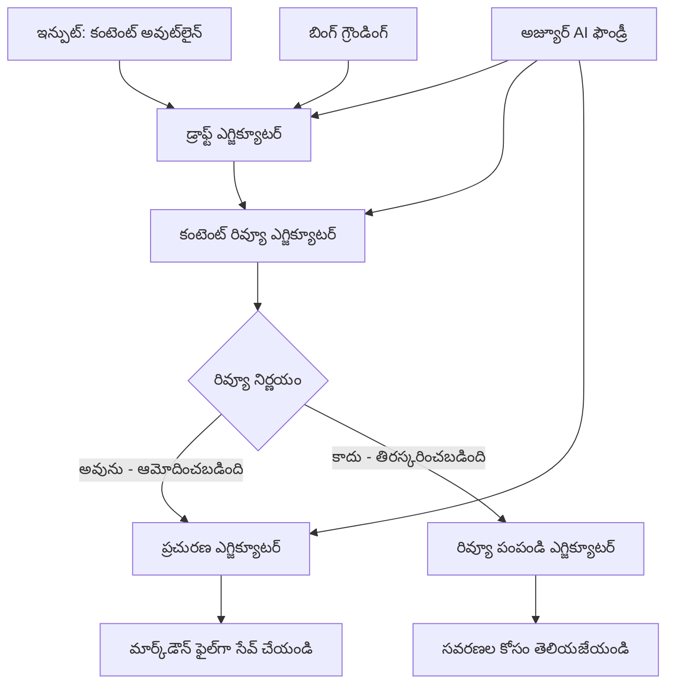

<!--
CO_OP_TRANSLATOR_METADATA:
{
  "original_hash": "8abd335151cee553293b637ee3d80d10",
  "translation_date": "2025-12-03T16:19:58+00:00",
  "source_file": "08-multi-agent/code_samples/workflows-agent-framework/dotNET/04.dotnet-agent-framework-workflow-aifoundry-condition.md",
  "language_code": "te"
}
-->
# 🔀 Azure AI Foundry (.NET) తో షరతుల ఆధారంగా ఏజెంట్ వర్క్‌ఫ్లోలు

## 📋 తెలివైన నిర్ణయాల ఆధారిత వర్క్‌ఫ్లో ట్యుటోరియల్

ఈ నోట్‌బుక్ **షరతుల ఆధారిత వర్క్‌ఫ్లో నమూనాలను** Azure AI Foundry మరియు Microsoft Agent Framework కోసం .NET ఉపయోగించి ఎలా నిర్మించాలో చూపిస్తుంది. AI విశ్లేషణ, వ్యాపార నియమాలు, మరియు డైనమిక్ షరతుల ఆధారంగా ప్రాసెసింగ్‌ను తెలివిగా మార్గం చూపించే అధునాతన, నిర్ణయ-ఆధారిత వర్క్‌ఫ్లోలను నిర్మించడం నేర్చుకుంటారు.

## 🎯 నేర్చుకునే లక్ష్యాలు

### 🧠 **తెలివైన నిర్ణయాల నిర్మాణం**
- **షరతుల లాజిక్ అమలు**: అనేక బ్రాంచింగ్ పాయింట్లతో క్లిష్టమైన నిర్ణయాల చెట్లను నిర్మించండి
- **AI ఆధారిత మార్గం**: Azure AI Foundry మోడల్స్ ఉపయోగించి తెలివైన మార్గం నిర్ణయాలు తీసుకోండి
- **డైనమిక్ వర్క్‌ఫ్లో అనుకూలత**: రన్‌టైమ్ విశ్లేషణ మరియు షరతుల ఆధారంగా వర్క్‌ఫ్లో ప్రవర్తనను మార్చండి
- **ఎంటర్‌ప్రైజ్ నియమాల సమీకరణ**: వ్యాపార లాజిక్ మరియు అనుగుణత అవసరాలను వర్క్‌ఫ్లోలలో చేర్చండి

### 🔀 **అధునాతన షరతుల నమూనాలు**
- **బహుళ-నియమాల నిర్ణయాలు**: మార్గం నిర్ణయాల కోసం అనేక అంశాలను అంచనా వేయండి
- **సందర్భం-ఆధారిత ప్రాసెసింగ్**: వర్క్‌ఫ్లో కంటెక్స్ట్ మరియు చరిత్ర ఆధారంగా నిర్ణయాలు తీసుకోండి
- **అనుకూల వర్క్‌ఫ్లో మార్పు**: రియల్-టైమ్ షరతుల ఆధారంగా ప్రాసెసింగ్ మార్గాలను డైనమిక్‌గా సర్దుబాటు చేయండి
- **నియమాల ఇంజిన్ సమీకరణ**: వర్క్‌ఫ్లోలలో క్లిష్టమైన వ్యాపార నియమాల ఇంజిన్లను అమలు చేయండి

### 🏢 **ఎంటర్‌ప్రైజ్ షరతుల అప్లికేషన్లు**
- **డాక్యుమెంట్ వర్గీకరణ మరియు మార్గం**: డాక్యుమెంట్లను సరైన వర్క్‌ఫ్లోలకు ఆటోమేటిక్‌గా వర్గీకరించి మార్గం చూపండి
- **కస్టమర్ సర్వీస్ ట్రయాజ్**: కస్టమర్ ప్రశ్నలను ప్రత్యేక హ్యాండ్లింగ్ టీమ్‌లకు తెలివిగా మార్గం చూపండి
- **అనుగుణత మరియు రిస్క్ ప్రాసెసింగ్**: రిస్క్ అంచనా ఆధారంగా వివిధ ధృవీకరణ మరియు సమీక్ష ప్రక్రియలను వర్తింపజేయండి
- **క్వాలిటీ అష్యూరెన్స్ వర్క్‌ఫ్లోలు**: క్వాలిటీ మెట్రిక్స్ ఆధారంగా సరైన సమీక్ష ప్రక్రియల ద్వారా కంటెంట్‌ను మార్గం చూపండి

## ⚙️ అవసరాలు మరియు సెటప్

### 📦 **అవసరమైన NuGet ప్యాకేజీలు**

షరతుల ఆధారిత వర్క్‌ఫ్లో ప్రాసెసింగ్ కోసం అధునాతన ప్యాకేజీలు:

```xml
<!-- Core AI Framework -->
<PackageReference Include="Microsoft.Extensions.AI" Version="9.9.0" />

<!-- Azure AI Agents with Persistent State -->
<PackageReference Include="Azure.AI.Agents.Persistent" Version="1.2.0-beta.5" />

<!-- Azure Identity and Utilities -->
<PackageReference Include="Azure.Identity" Version="1.15.0" />
<PackageReference Include="System.Linq.Async" Version="6.0.3" />
<PackageReference Include="DotNetEnv" Version="3.1.1" />

<!-- Local Workflow Framework References -->
<!-- Microsoft.Agents.Workflows.dll - Advanced workflow orchestration -->
<!-- Microsoft.Agents.AI.AzureAI.dll - Azure AI Foundry integration -->
<!-- Microsoft.Agents.AI.dll - Core agent abstractions -->
```

### 🔑 **Azure AI Foundry కాన్ఫిగరేషన్**

**అవసరమైన Azure వనరులు:**
- షరతుల ప్రాసెసింగ్ మోడల్స్‌తో Azure AI Foundry వర్క్‌స్పేస్
- సరైన కంప్యూట్ కోటాలు మరియు అనుమతులతో Azure సబ్‌స్క్రిప్షన్
- నిర్ణయాలు మరియు కంటెంట్ విశ్లేషణ కోసం మోడల్స్‌ను డిప్లాయ్ చేయడం
- (ఐచ్ఛికం) Bing Search API కనెక్షన్ గ్రౌండింగ్ సామర్థ్యాల కోసం

**పర్యావరణం కాన్ఫిగరేషన్ (.env ఫైల్):**
```env
# Azure AI Foundry Configuration
AZURE_AI_PROJECT_ENDPOINT=https://your-project.cognitiveservices.azure.com/
BING_CONNECTION_ID=your-bing-connection-id
```

**ఆథెంటికేషన్ సెటప్:**
```csharp
// Azure CLI or Managed Identity authentication
using Azure.Identity;
var credential = new AzureCliCredential();

// Load environment configuration
DotNetEnv.Env.Load("../../../.env");
```

### 🏗️ **షరతుల వర్క్‌ఫ్లో నిర్మాణం**


**ముఖ్యమైన భాగాలు:**
- **Draft Executor**: అవుట్‌లైన్‌ల నుండి ప్రారంభ కంటెంట్ డ్రాఫ్ట్‌లను సృష్టించే AI ఏజెంట్
- **Content Review Executor**: డ్రాఫ్ట్ క్వాలిటీ మరియు అనుగుణతను అంచనా వేయడం
- **Conditional Routing**: సమీక్ష ఫలితాల ఆధారంగా మార్గం నిర్ణయాల లాజిక్
- **Publish/Review Paths**: ఆమోదించబడిన మరియు తిరస్కరించబడిన కంటెంట్ కోసం వేర్వేరు ప్రాసెసింగ్ మార్గాలు
- **State Management**: వర్క్‌ఫ్లో మొత్తం కంటెంట్ మరియు సమీక్ష కంటెక్స్ట్‌ను నిర్వహించడం

## 🎨 **షరతుల వర్క్‌ఫ్లో డిజైన్ నమూనాలు**

### 📋 **క్వాలిటీ గేట్స్‌తో కంటెంట్ ఉత్పత్తి**
```
Outline → Draft Creation → Quality Review → {Approve: Publish | Reject: Revise}
```

### 🎯 **రిస్క్ ఆధారిత డాక్యుమెంట్ ప్రాసెసింగ్**
```
Document → Risk Assessment → {Low: Standard | High: Enhanced Review}
```

### 🔍 **తెలివైన కస్టమర్ సర్వీస్ మార్గం**
```
Customer Query → Analysis → {Simple: FAQ Bot | Complex: Human Agent}
```

### 💼 **అనుగుణత-ఆధారిత వర్క్‌ఫ్లోలు**
```
Content → Compliance Check → {Pass: Publish | Fail: Legal Review}
```

## 🏢 **ఎంటర్‌ప్రైజ్ షరతుల ప్రయోజనాలు**

### 🎯 **తెలివైన ఆటోమేషన్**
- **స్మార్ట్ నిర్ణయాలు**: కంటెంట్ విశ్లేషణ మరియు కంటెక్స్ట్ ఆధారంగా AI-ఆధారిత మార్గం నిర్ణయాలు
- **అనుకూల ప్రాసెసింగ్**: మారుతున్న షరతుల ఆధారంగా ఆటోమేటిక్‌గా సర్దుబాటు అయ్యే వర్క్‌ఫ్లోలు
- **వ్యాపార నియమాల అమలు**: క్లిష్టమైన వ్యాపార లాజిక్ మరియు విధానాల ఆటోమేటిక్ అమలు
- **కంటెక్స్ట్-ఆధారిత మార్గం**: పూర్తి వర్క్‌ఫ్లో చరిత్ర మరియు సేకరించిన కంటెక్స్ట్ ఆధారంగా నిర్ణయాలు

### 📈 **ఆపరేషనల్ ఎక్సలెన్స్**
- **ఆప్టిమైజ్డ్ వనరుల కేటాయింపు**: అత్యంత అనుకూలమైన నిపుణులు మరియు ప్రక్రియలకు పని మార్గం
- **తక్కువ మానవ జోక్యం**: ఆటోమేటిక్ నిర్ణయాలు మానవ మార్గం అవసరాన్ని తగ్గిస్తాయి
- **త్వరిత పరిష్కార సమయాలు**: సరైన నైపుణ్యం మరియు ప్రాసెసింగ్ సామర్థ్యాలకు నేరుగా మార్గం
- **సమానమైన అమలు**: వ్యాపార నియమాలు మరియు నిర్ణయ ప్రమాణాల సమానమైన అమలు

### 🛡️ **రిస్క్ మేనేజ్‌మెంట్ & అనుగుణత**
- **ఆటోమేటిక్ రిస్క్ అంచనా**: కంటెంట్ మరియు పరిస్థితి రిస్క్ స్థాయిల AI-ఆధారిత అంచనా
- **అనుగుణత అమలు**: అవసరమైన నియంత్రణ ప్రక్రియల ద్వారా ఆటోమేటిక్ మార్గం
- **సెక్యూరిటీ ప్రోటోకాల్ అప్లికేషన్**: రిస్క్ అంచనా ఆధారంగా మెరుగైన భద్రతా చర్యలు
- **ఆడిట్ ట్రైల్ నిర్వహణ**: మార్గం నిర్ణయాలు మరియు కారణాల పూర్తి డాక్యుమెంటేషన్

### 📊 **విశ్లేషణ & నిరంతర మెరుగుదల**
- **నిర్ణయ విశ్లేషణ**: మార్గం నిర్ణయాల ప్రభావం మరియు ఖచ్చితత్వాన్ని ట్రాక్ చేయండి
- **నమూనా గుర్తింపు**: మార్గం నిర్ణయాలలో కాలక్రమేణా ట్రెండ్‌లు మరియు నమూనాలను గుర్తించండి
- **పర్ఫార్మెన్స్ ఆప్టిమైజేషన్**: నిర్ణయ ప్రమాణాలు మరియు మార్గం సామర్థ్యాన్ని నిరంతరం మెరుగుపరచడం
- **బిజినెస్ ఇంటెలిజెన్స్**: కంటెంట్ లక్షణాలు మరియు ప్రాసెసింగ్ అవసరాలపై అంతర్దృష్టులు

### 🔧 **టెక్నికల్ ఎక్సలెన్స్**
- **స్థిరమైన స్టేట్ మేనేజ్‌మెంట్**: వర్క్‌ఫ్లో అమలులో క్లిష్టమైన స్థితిని నిర్వహించండి
- **స్కేలబుల్ ఆర్కిటెక్చర్**: అధిక-వాల్యూమ్ షరతుల ప్రాసెసింగ్ అవసరాలను నిర్వహించండి
- **ఇంటిగ్రేషన్ సామర్థ్యాలు**: ఉన్న వ్యాపార వ్యవస్థలు మరియు ప్రక్రియలతో సులభమైన సమీకరణ
- **మానిటరింగ్ & ఆబ్జర్వబిలిటీ**: వర్క్‌ఫ్లో పనితీరు మరియు నిర్ణయాల సమగ్ర ట్రాకింగ్

.NET తో తెలివైన, నిర్ణయ-ఆధారిత ఎంటర్‌ప్రైజ్ వర్క్‌ఫ్లోలను నిర్మిద్దాం! 🚀

## 💻 కోడ్ అమలు

పూర్తి అమలు `04.dotnet-agent-framework-workflow-aifoundry-condition.cs` లో అందుబాటులో ఉంది. ఇది **క్వాలిటీ గేట్స్‌తో కంటెంట్ ఉత్పత్తి వర్క్‌ఫ్లో**ను చూపిస్తుంది:

### 🏗️ **వర్క్‌ఫ్లో నిర్మాణం**

```
Content Outline → Draft Creation → Quality Review → Conditional Routing:
                                                      ├─ Approved (>200 words) → Publish
                                                      └─ Rejected (<200 words) → Review Notification
```

**వర్క్‌ఫ్లోలోని ఏజెంట్లు:**
1. **Evangelist Agent**: Bing గ్రౌండింగ్‌తో అవుట్‌లైన్‌ల నుండి ట్యుటోరియల్ డ్రాఫ్ట్‌లను సృష్టిస్తుంది
2. **Content Reviewer Agent**: డ్రాఫ్ట్ క్వాలిటీని అంచనా వేస్తుంది (పదాల సంఖ్య, పూర్తి స్థాయి)
3. **Publisher Agent**: ఆమోదించబడిన కంటెంట్‌ను టైమ్‌స్టాంప్ చేసిన Markdown ఫైళ్లుగా సేవ్ చేస్తుంది

**కస్టమ్ ఎగ్జిక్యూటర్లు:**
1. **DraftExecutor**: డ్రాఫ్ట్ సృష్టిని సమన్వయం చేస్తుంది
2. **ContentReviewExecutor**: క్వాలిటీ అంచనా వేస్తుంది
3. **PublishExecutor**: ఆమోదించబడిన కంటెంట్ ప్రచురణను నిర్వహిస్తుంది
4. **SendReviewExecutor**: తిరస్కరించబడిన కంటెంట్ నోటిఫికేషన్‌లను నిర్వహిస్తుంది

### 🚀 ఉదాహరణ అమలు

**అవసరాలు:**
- Azure AI Foundry వర్క్‌స్పేస్ కాన్ఫిగర్ చేయబడింది
- Azure CLI ఆథెంటికేషన్ (`az login`)
- (ఐచ్ఛికం) Bing Search కనెక్షన్ గ్రౌండింగ్ కోసం

```bash
# స్క్రిప్ట్‌ను అమలు చేయగలిగేలా చేయండి (యూనిక్స్/లినక్స్/మ్యాక్‌ఓఎస్)
chmod +x 04.dotnet-agent-framework-workflow-aifoundry-condition.cs

# షరతుల ప్రకారం వర్క్‌ఫ్లోను అమలు చేయండి
./04.dotnet-agent-framework-workflow-aifoundry-condition.cs
```

Windows లో:
```powershell
dotnet run 04.dotnet-agent-framework-workflow-aifoundry-condition.cs
```

### 📝 ఆశించిన అవుట్‌పుట్

వర్క్‌ఫ్లో:
1. **ఏజెంట్లను సృష్టిస్తుంది**: మూడు ప్రత్యేక Azure AI Foundry ఏజెంట్లను ప్రారంభిస్తుంది
2. **డ్రాఫ్ట్ సృష్టిస్తుంది**: Evangelist ఏజెంట్ అవుట్‌లైన్ నుండి ట్యుటోరియల్ డ్రాఫ్ట్‌ను సృష్టిస్తుంది
3. **కంటెంట్ సమీక్షిస్తుంది**: Content Reviewer డ్రాఫ్ట్ క్వాలిటీని అంచనా వేస్తుంది
4. **షరతుల మార్గం**:
   - **ఆమోదించబడితే (>200 పదాలు)**: PublishExecutor Markdown ఫైల్‌గా సేవ్ చేస్తుంది
   - **తిరస్కరించబడితే (<200 పదాలు)**: సమీక్ష నోటిఫికేషన్ పంపుతుంది
5. **ఫలితాలను ప్రదర్శిస్తుంది**: తుది వర్క్‌ఫ్లో ఫలితాన్ని చూపిస్తుంది

### 🔧 అనుకూలీకరణ ఎంపికలు

**సమీక్ష ప్రమాణాలను మార్చండి:**
```csharp
const string ContentReviewerInstructions = @"
You are a content reviewer...
1. Check if content is more than 500 words (instead of 200)
2. Verify technical accuracy
3. Ensure proper formatting
...";
```

**మరిన్ని షరతుల మార్గాలను చేర్చండి:**
```csharp
var workflow = new WorkflowBuilder(draftExecutor)
    .AddEdge(draftExecutor, contentReviewerExecutor)
    .AddEdge(contentReviewerExecutor, publishExecutor, condition: GetCondition("Excellent"))
    .AddEdge(contentReviewerExecutor, editExecutor, condition: GetCondition("Good"))
    .AddEdge(contentReviewerExecutor, sendReviewerExecutor, condition: GetCondition("Poor"))
    .Build();
```

**కంటెంట్ అవసరాలను మార్చండి:**
```csharp
string OUTLINE_Content = @"
# Your Custom Topic
## Section 1
https://your-reference-url
## Section 2
...
";
```

### 🎯 వాస్తవ ప్రపంచ అప్లికేషన్లు

ఈ షరతుల వర్క్‌ఫ్లో నమూనా అనుకూలంగా ఉంటుంది:
- **కంటెంట్ మేనేజ్‌మెంట్ సిస్టమ్స్**: క్వాలిటీ గేట్స్‌తో ఆటోమేటిక్ ఎడిటోరియల్ వర్క్‌ఫ్లోలు
- **డాక్యుమెంట్ ప్రాసెసింగ్**: వర్గీకరణ మరియు అనుగుణత ఆధారంగా డాక్యుమెంట్ల మార్గం
- **కస్టమర్ సపోర్ట్**: క్లిష్టత మరియు అత్యవసరత ఆధారంగా తెలివైన టికెట్ మార్గం
- **లీగల్ సమీక్ష**: రిస్క్ అంచనా మరియు విలువ ఆధారంగా ఒప్పందాల మార్గం
- **HR ప్రక్రియలు**: సరైన స్క్రీనింగ్ వర్క్‌ఫ్లోల ద్వారా అప్లికేషన్ల మార్గం

### 🔍 షరతుల లాజిక్‌ను అర్థం చేసుకోవడం

**షరతుల ఫంక్షన్:**
```csharp
public Func<object?, bool> GetCondition(string expectedResult) =>
    reviewResult => reviewResult is ReviewResult review && review.Result == expectedResult;
```

ఈ ఫంక్షన్ ఒక ప్రిడికేట్‌ను సృష్టిస్తుంది:
1. ఫలితం `ReviewResult` రకానికి చెందినదా అని తనిఖీ చేస్తుంది
2. `Result` ప్రాపర్టీని ఆశించిన విలువతో పోల్చుతుంది
3. మార్గం నిర్ణయించడానికి true/false ను తిరిగి ఇస్తుంది

**షరతులతో వర్క్‌ఫ్లో ఎడ్జ్‌లు:**
```csharp
.AddEdge(contentReviewerExecutor, publishExecutor, condition: GetCondition("Yes"))
.AddEdge(contentReviewerExecutor, sendReviewerExecutor, condition: GetCondition("No"))
```

### 📊 అధునాతన లక్షణాలు

**JSON Schema ధృవీకరణ:**
వర్క్‌ఫ్లో నిర్మిత ప్రతిస్పందనలను నిర్ధారించడానికి JSON schemas ఉపయోగిస్తుంది:

```csharp
// Define response structure
public class ReviewResult
{
    [JsonPropertyName("review_result")]
    public string Result { get; set; } = string.Empty;
    
    [JsonPropertyName("reason")]
    public string Reason { get; set; } = string.Empty;
    
    [JsonPropertyName("draft_content")]
    public string DraftContent { get; set; } = string.Empty;
}

// Apply to agent
ResponseFormat = ChatResponseFormat.ForJsonSchema(
    AIJsonUtilities.CreateJsonSchema(typeof(ReviewResult)), 
    "ReviewResult", 
    "Review Result From DraftContent"
)
```

**Bing Grounding సమీకరణ:**
Evangelist ఏజెంట్ Bing గ్రౌండింగ్‌ను ఉపయోగించి రియల్-టైమ్ సమాచారం పొందుతుంది:

```csharp
var bingGroundingConfig = new BingGroundingSearchConfiguration(bing_conn_id);
BingGroundingToolDefinition bingGroundingTool = new(
    new BingGroundingSearchToolParameters([bingGroundingConfig])
);
```

ఇది ఏజెంట్‌ను అవుట్‌లైన్‌లోని URLలను అనుసరించి ప్రస్తుత సమాచారాన్ని సేకరించడానికి అనుమతిస్తుంది.

### 🛡️ ఎర్రర్ హ్యాండ్లింగ్

వర్క్‌ఫ్లో తిరస్కరించబడిన కంటెంట్ కోసం బలమైన ఎర్రర్ హ్యాండ్లింగ్‌ను కలిగి ఉంది:
- సమీక్ష వైఫల్యాలు ప్రత్యామ్నాయ మార్గాన్ని ప్రారంభిస్తాయి
- నోటిఫికేషన్‌లు స్పష్టమైన తిరస్కరణ కారణాలను అందిస్తాయి
- కంటెంట్ పునఃసమీక్ష కోసం నిల్వ చేయబడుతుంది

### 🔄 వర్క్‌ఫ్లోను విస్తరించడం

**పునఃసమీక్ష లూప్‌ను చేర్చండి:**
కంటెంట్‌ను ఆటోమేటిక్‌గా పునఃడ్రాఫ్ట్ చేసే ఫీడ్‌బ్యాక్ లూప్‌ను సృష్టించండి:

```csharp
.AddEdge(contentReviewerExecutor, publishExecutor, condition: GetCondition("Yes"))
.AddEdge(contentReviewerExecutor, draftExecutor, condition: GetCondition("No")) // Loop back
```

**బహుళ-స్థాయి సమీక్షను అమలు చేయండి:**
వివిధ ప్రమాణాలతో అనేక సమీక్ష దశలను చేర్చండి:

```csharp
.AddEdge(draftExecutor, technicalReviewer)
.AddEdge(technicalReviewer, editorialReviewer, condition: GetCondition("TechPass"))
.AddEdge(editorialReviewer, publishExecutor, condition: GetCondition("EditPass"))
```

ఈ షరతుల వర్క్‌ఫ్లో నమూనా క్లిష్టమైన, తెలివైన ఎంటర్‌ప్రైజ్ ఆటోమేషన్ సిస్టమ్స్‌ను నిర్మించడానికి పునాది అందిస్తుంది! 🚀

---

<!-- CO-OP TRANSLATOR DISCLAIMER START -->
**అస్వీకరణ**:  
ఈ పత్రం AI అనువాద సేవ [Co-op Translator](https://github.com/Azure/co-op-translator) ఉపయోగించి అనువదించబడింది. మేము ఖచ్చితత్వానికి ప్రయత్నిస్తున్నప్పటికీ, ఆటోమేటెడ్ అనువాదాలు తప్పులు లేదా అసమగ్రతలను కలిగి ఉండవచ్చు. దయచేసి, దాని స్వదేశ భాషలోని అసలు పత్రాన్ని అధికారం కలిగిన మూలంగా పరిగణించండి. కీలకమైన సమాచారం కోసం, ప్రొఫెషనల్ మానవ అనువాదాన్ని సిఫారసు చేస్తాము. ఈ అనువాదాన్ని ఉపయోగించడం వల్ల కలిగే ఏవైనా అపార్థాలు లేదా తప్పుదారులు కోసం మేము బాధ్యత వహించము.
<!-- CO-OP TRANSLATOR DISCLAIMER END -->