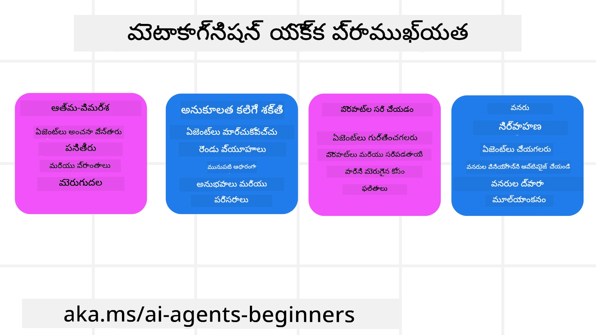
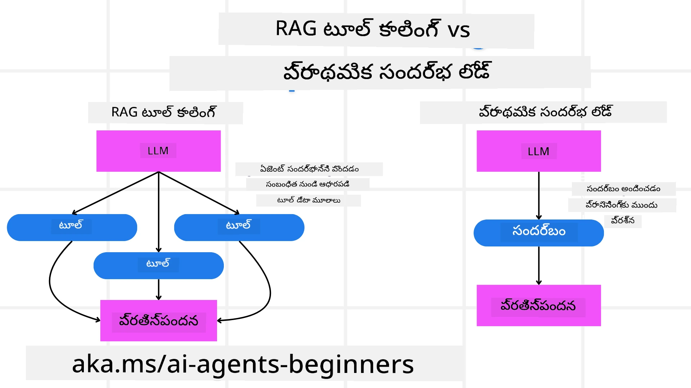

<!--
CO_OP_TRANSLATOR_METADATA:
{
  "original_hash": "5f0deef171fc3a68d5d3d770a8bfb03d",
  "translation_date": "2025-12-03T15:33:54+00:00",
  "source_file": "09-metacognition/README.md",
  "language_code": "te"
}
-->
[](https://youtu.be/His9R6gw6Ec?si=3_RMb8VprNvdLRhX)

> _(ఈ పాఠం వీడియోను చూడటానికి పై చిత్రంపై క్లిక్ చేయండి)_
# AI ఏజెంట్లలో మెటాకాగ్నిషన్

## పరిచయం

AI ఏజెంట్లలో మెటాకాగ్నిషన్ గురించి పాఠానికి స్వాగతం! ఈ అధ్యాయం AI ఏజెంట్లు తమ ఆలోచనా ప్రక్రియల గురించి ఎలా ఆలోచిస్తాయో తెలుసుకోవాలనుకునే ప్రారంభికుల కోసం రూపొందించబడింది. ఈ పాఠం చివరికి, మీరు ముఖ్యమైన భావాలను అర్థం చేసుకుని, AI ఏజెంట్ డిజైన్‌లో మెటాకాగ్నిషన్‌ను అన్వయించడానికి ప్రాక్టికల్ ఉదాహరణలతో సిద్ధంగా ఉంటారు.

## నేర్చుకునే లక్ష్యాలు

ఈ పాఠాన్ని పూర్తి చేసిన తర్వాత, మీరు:

1. ఏజెంట్ నిర్వచనాల్లో రీజనింగ్ లూప్‌ల ప్రభావాలను అర్థం చేసుకోగలరు.
2. స్వీయ-సరిదిద్దుకునే ఏజెంట్లకు ప్లానింగ్ మరియు మూల్యాంకన సాంకేతికతలను ఉపయోగించగలరు.
3. పనులను పూర్తి చేయడానికి కోడ్‌ను మేనేజ్ చేయగల ఏజెంట్లను సృష్టించగలరు.

## మెటాకాగ్నిషన్ పరిచయం

మెటాకాగ్నిషన్ అనేది ఒకరి ఆలోచనల గురించి ఆలోచించే ఉన్నత స్థాయి జ్ఞాన ప్రక్రియ. AI ఏజెంట్లకు, ఇది స్వీయ-జ్ఞానం మరియు గత అనుభవాల ఆధారంగా తమ చర్యలను మూల్యాంకనం చేసి సర్దుబాటు చేసుకోవడం. "ఆలోచన గురించి ఆలోచించడం" అనే ఈ భావన ఏజెంటిక్ AI వ్యవస్థల అభివృద్ధిలో ముఖ్యమైనది. ఇది AI వ్యవస్థలు తమ అంతర్గత ప్రక్రియల గురించి అవగాహన కలిగి ఉండటానికి, తమ ప్రవర్తనను పర్యవేక్షించడానికి, నియంత్రించడానికి మరియు అనుకూలం చేసుకోవడానికి సహాయపడుతుంది. మనం ఒక సమస్యను అర్థం చేసుకోవడానికి లేదా పరిసరాలను గమనించడానికి చేసే విధంగా ఇది పనిచేస్తుంది. ఈ స్వీయ-జ్ఞానం AI వ్యవస్థలు మెరుగైన నిర్ణయాలు తీసుకోవడంలో, పొరపాట్లను గుర్తించడంలో మరియు సమయానుకూలంగా తమ పనితీరును మెరుగుపరచడంలో సహాయపడుతుంది - ఇది ట్యూరింగ్ టెస్ట్ మరియు AI భవిష్యత్తు గురించి చర్చకు మళ్లీ అనుసంధానమవుతుంది.

ఏజెంటిక్ AI వ్యవస్థల సందర్భంలో, మెటాకాగ్నిషన్ అనేక సవాళ్లను పరిష్కరించడంలో సహాయపడుతుంది, ఉదాహరణకు:
- పారదర్శకత: AI వ్యవస్థలు తమ తర్కం మరియు నిర్ణయాలను వివరించగలగడం.
- తర్కం: AI వ్యవస్థల సమాచారాన్ని సమన్వయపరచడం మరియు సరైన నిర్ణయాలు తీసుకోవడం.
- అనుకూలత: కొత్త పరిసరాలు మరియు మారుతున్న పరిస్థితులకు AI వ్యవస్థలు సర్దుబాటు చేసుకోవడం.
- అవగాహన: AI వ్యవస్థలు తమ పరిసరాల నుండి డేటాను గుర్తించడం మరియు అర్థం చేసుకోవడంలో ఖచ్చితత్వాన్ని మెరుగుపరచడం.

### మెటాకాగ్నిషన్ అంటే ఏమిటి?

మెటాకాగ్నిషన్, లేదా "ఆలోచన గురించి ఆలోచించడం," అనేది ఒకరి జ్ఞాన ప్రక్రియల స్వీయ-జ్ఞానం మరియు స్వీయ-నియంత్రణను కలిగి ఉండే ఉన్నత స్థాయి జ్ఞాన ప్రక్రియ. AI రంగంలో, మెటాకాగ్నిషన్ ఏజెంట్లకు తమ వ్యూహాలు మరియు చర్యలను మూల్యాంకనం చేసి సర్దుబాటు చేసుకునే శక్తిని ఇస్తుంది, తద్వారా సమస్యల పరిష్కారం మరియు నిర్ణయాల సామర్థ్యాలను మెరుగుపరుస్తుంది. మెటాకాగ్నిషన్‌ను అర్థం చేసుకోవడం ద్వారా, మీరు మరింత తెలివైన, అనుకూలమైన మరియు సమర్థవంతమైన AI ఏజెంట్లను డిజైన్ చేయవచ్చు. నిజమైన మెటాకాగ్నిషన్‌లో, మీరు AI తన స్వంత తర్కం గురించి స్పష్టంగా ఆలోచించడం చూస్తారు.

ఉదాహరణ: “నేను చౌకైన విమానాలను ప్రాధాన్యతనిచ్చాను ఎందుకంటే... నేను నేరుగా వెళ్లే విమానాలను మిస్ అవుతున్నానేమో, కాబట్టి మళ్లీ చెక్ చేస్తాను.”
తన నిర్ణయాలను ఎలా తీసుకుందో లేదా ఎందుకు తీసుకుందో ట్రాక్ చేయడం.
- గతంలో వినియోగదారుల అభిరుచులపై ఎక్కువగా ఆధారపడటం వల్ల పొరపాట్లు చేశానని గుర్తించడం, కాబట్టి తన నిర్ణయ ప్రక్రియను మార్చడం.
- "వినియోగదారు 'చాలా రద్దీగా ఉంది' అని చెప్పినప్పుడు, నేను కొన్ని ఆకర్షణలను తొలగించడమే కాకుండా, నా 'టాప్ ఆకర్షణలు' ఎంచుకునే పద్ధతి తప్పు అని కూడా అర్థం చేసుకోవాలి" వంటి నమూనాలను గుర్తించడం.

### AI ఏజెంట్లలో మెటాకాగ్నిషన్ ప్రాముఖ్యత

మెటాకాగ్నిషన్ AI ఏజెంట్ డిజైన్‌లో అనేక కారణాల వల్ల కీలక పాత్ర పోషిస్తుంది:



- స్వీయ-పరిశీలన: ఏజెంట్లు తమ పనితీరును అంచనా వేసి మెరుగుపరచాల్సిన ప్రాంతాలను గుర్తించగలవు.
- అనుకూలత: ఏజెంట్లు గత అనుభవాలు మరియు మారుతున్న పరిసరాల ఆధారంగా తమ వ్యూహాలను సర్దుబాటు చేసుకోవచ్చు.
- పొరపాట్ల సవరణ: ఏజెంట్లు స్వయంగా పొరపాట్లను గుర్తించి సరిదిద్దగలవు, తద్వారా ఖచ్చితమైన ఫలితాలు వస్తాయి.
- వనరుల నిర్వహణ: ఏజెంట్లు తమ చర్యలను ప్రణాళికాబద్ధంగా రూపొందించి, సమయం మరియు కంప్యూటేషనల్ శక్తి వంటి వనరులను ఆప్టిమైజ్ చేయగలవు.

## AI ఏజెంట్ యొక్క భాగాలు

మెటాకాగ్నిటివ్ ప్రక్రియలలోకి వెళ్లే ముందు, AI ఏజెంట్ యొక్క ప్రాథమిక భాగాలను అర్థం చేసుకోవడం అవసరం. సాధారణంగా AI ఏజెంట్‌లో ఉంటాయి:

- వ్యక్తిత్వం: ఏజెంట్ వినియోగదారులతో ఎలా పరస్పర చర్య చేస్తుందో నిర్వచించే వ్యక్తిత్వం మరియు లక్షణాలు.
- సాధనాలు: ఏజెంట్ చేయగల సామర్థ్యాలు మరియు ఫంక్షన్లు.
- నైపుణ్యాలు: ఏజెంట్ కలిగి ఉన్న జ్ఞానం మరియు నైపుణ్యాలు.

ఈ భాగాలు కలిసి నిర్దిష్ట పనులను నిర్వహించగల "నిపుణత యూనిట్"ను సృష్టిస్తాయి.

**ఉదాహరణ**:
ఒక ట్రావెల్ ఏజెంట్‌ను పరిగణించండి, ఇది మీ సెలవులను ప్రణాళిక చేయడమే కాకుండా, రియల్-టైమ్ డేటా మరియు గత వినియోగదారుల అనుభవాల ఆధారంగా తన మార్గాన్ని సర్దుబాటు చేస్తుంది.

### ఉదాహరణ: ట్రావెల్ ఏజెంట్ సేవలో మెటాకాగ్నిషన్

మీరు AI ఆధారిత ట్రావెల్ ఏజెంట్ సేవను డిజైన్ చేస్తున్నారని ఊహించుకోండి. ఈ ఏజెంట్, "ట్రావెల్ ఏజెంట్," వినియోగదారులకు వారి సెలవులను ప్రణాళిక చేయడంలో సహాయపడుతుంది. మెటాకాగ్నిషన్‌ను చేర్చడానికి, ట్రావెల్ ఏజెంట్ తన చర్యలను స్వీయ-జ్ఞానం మరియు గత అనుభవాల ఆధారంగా మూల్యాంకనం చేసి సర్దుబాటు చేసుకోవాలి. ఇక్కడ మెటాకాగ్నిషన్ ఎలా పాత్ర పోషిస్తుందో చూడండి:

#### ప్రస్తుత పని

ప్రస్తుత పని వినియోగదారుని పారిస్ ట్రిప్ ప్రణాళికలో సహాయపడడం.

#### పనిని పూర్తి చేయడానికి దశలు

1. **వినియోగదారు అభిరుచులను సేకరించండి**: వినియోగదారుని ప్రయాణ తేదీలు, బడ్జెట్, ఆసక్తులు (ఉదా: మ్యూజియంలు, వంటకాలు, షాపింగ్) మరియు ఏవైనా ప్రత్యేక అవసరాలను అడగండి.
2. **సమాచారాన్ని పొందండి**: వినియోగదారు అభిరుచులకు సరిపోయే విమాన ఎంపికలు, వసతి, ఆకర్షణలు మరియు రెస్టారెంట్ల కోసం శోధించండి.
3. **సిఫార్సులను రూపొందించండి**: విమాన వివరాలు, హోటల్ రిజర్వేషన్లు మరియు సూచించిన కార్యకలాపాలతో వ్యక్తిగతీకరించిన ప్రణాళికను అందించండి.
4. **ఫీడ్‌బ్యాక్ ఆధారంగా సర్దుబాటు చేయండి**: సిఫార్సులపై వినియోగదారు ఫీడ్‌బ్యాక్‌ను అడిగి, అవసరమైన సర్దుబాట్లు చేయండి.

#### అవసరమైన వనరులు

- విమానాలు మరియు హోటల్ బుకింగ్ డేటాబేస్‌లకు యాక్సెస్.
- పారిస్ ఆకర్షణలు మరియు రెస్టారెంట్లపై సమాచారం.
- గత పరస్పర చర్యల నుండి వినియోగదారు ఫీడ్‌బ్యాక్ డేటా.

#### అనుభవం మరియు స్వీయ-పరిశీలన

ట్రావెల్ ఏజెంట్ తన పనితీరును మూల్యాంకనం చేసి గత అనుభవాల నుండి నేర్చుకోవడానికి మెటాకాగ్నిషన్‌ను ఉపయోగిస్తుంది. ఉదాహరణకు:

1. **వినియోగదారు ఫీడ్‌బ్యాక్‌ను విశ్లేషించడం**: ట్రావెల్ ఏజెంట్ వినియోగదారు ఫీడ్‌బ్యాక్‌ను సమీక్షించి, ఏ సిఫార్సులు బాగా స్వీకరించబడ్డాయో మరియు ఏవి స్వీకరించబడలేదో నిర్ణయిస్తుంది. భవిష్యత్ సూచనలను అనుగుణంగా సర్దుబాటు చేస్తుంది.
2. **అనుకూలత**: ఒక వినియోగదారు రద్దీ ప్రదేశాలను ఇష్టపడనని గతంలో పేర్కొంటే, ట్రావెల్ ఏజెంట్ భవిష్యత్‌లో పీక్ అవర్స్‌లో ప్రసిద్ధ పర్యాటక ప్రదేశాలను సిఫార్సు చేయకుండా ఉంటుంది.
3. **పొరపాట్ల సవరణ**: గత బుకింగ్‌లో పొరపాటు జరిగితే, ఉదా: పూర్తిగా బుక్ అయిన హోటల్‌ను సిఫార్సు చేయడం, ట్రావెల్ ఏజెంట్ భవిష్యత్ సిఫార్సుల ముందు అందుబాటును మరింత కఠినంగా తనిఖీ చేయడం నేర్చుకుంటుంది.

#### ప్రాక్టికల్ డెవలపర్ ఉదాహరణ

ఇక్కడ ట్రావెల్ ఏజెంట్ కోడ్ ఎలా ఉంటుందో ఒక సరళమైన ఉదాహరణ:

```python
class Travel_Agent:
    def __init__(self):
        self.user_preferences = {}
        self.experience_data = []

    def gather_preferences(self, preferences):
        self.user_preferences = preferences

    def retrieve_information(self):
        # ప్రాధాన్యతల ఆధారంగా విమానాలు, హోటళ్లు, మరియు ఆకర్షణలను శోధించండి
        flights = search_flights(self.user_preferences)
        hotels = search_hotels(self.user_preferences)
        attractions = search_attractions(self.user_preferences)
        return flights, hotels, attractions

    def generate_recommendations(self):
        flights, hotels, attractions = self.retrieve_information()
        itinerary = create_itinerary(flights, hotels, attractions)
        return itinerary

    def adjust_based_on_feedback(self, feedback):
        self.experience_data.append(feedback)
        # అభిప్రాయాన్ని విశ్లేషించి భవిష్యత్ సిఫారసులను సర్దుబాటు చేయండి
        self.user_preferences = adjust_preferences(self.user_preferences, feedback)

# ఉదాహరణ వినియోగం
travel_agent = Travel_Agent()
preferences = {
    "destination": "Paris",
    "dates": "2025-04-01 to 2025-04-10",
    "budget": "moderate",
    "interests": ["museums", "cuisine"]
}
travel_agent.gather_preferences(preferences)
itinerary = travel_agent.generate_recommendations()
print("Suggested Itinerary:", itinerary)
feedback = {"liked": ["Louvre Museum"], "disliked": ["Eiffel Tower (too crowded)"]}
travel_agent.adjust_based_on_feedback(feedback)
```

#### మెటాకాగ్నిషన్ ఎందుకు ముఖ్యం

- **స్వీయ-పరిశీలన**: ఏజెంట్లు తమ పనితీరును విశ్లేషించి మెరుగుపరచాల్సిన ప్రాంతాలను గుర్తించగలవు.
- **అనుకూలత**: ఏజెంట్లు ఫీడ్‌బ్యాక్ మరియు మారుతున్న పరిస్థితుల ఆధారంగా వ్యూహాలను సర్దుబాటు చేసుకోవచ్చు.
- **పొరపాట్ల సవరణ**: ఏజెంట్లు స్వయంగా పొరపాట్లను గుర్తించి సరిదిద్దగలవు.
- **వనరుల నిర్వహణ**: ఏజెంట్లు సమయం మరియు కంప్యూటేషనల్ శక్తి వంటి వనరుల వినియోగాన్ని ఆప్టిమైజ్ చేయగలవు.

మెటాకాగ్నిషన్‌ను చేర్చడం ద్వారా, ట్రావెల్ ఏజెంట్ మరింత వ్యక్తిగతీకరించిన మరియు ఖచ్చితమైన ప్రయాణ సిఫార్సులను అందించగలదు, తద్వారా మొత్తం వినియోగదారు అనుభవాన్ని మెరుగుపరుస్తుంది.

---

## 2. ఏజెంట్లలో ప్రణాళిక

ప్రణాళిక అనేది AI ఏజెంట్ ప్రవర్తనలో కీలకమైన భాగం. ఇది ప్రస్తుత స్థితి, వనరులు మరియు సాధ్యమైన అడ్డంకులను పరిగణనలోకి తీసుకుని లక్ష్యాన్ని సాధించడానికి అవసరమైన దశలను రూపకల్పన చేయడాన్ని కలిగి ఉంటుంది.

### ప్రణాళిక అంశాలు

- **ప్రస్తుత పని**: పనిని స్పష్టంగా నిర్వచించండి.
- **పనిని పూర్తి చేయడానికి దశలు**: పనిని నిర్వహించగల దశలుగా విభజించండి.
- **అవసరమైన వనరులు**: అవసరమైన వనరులను గుర్తించండి.
- **అనుభవం**: ప్రణాళికలో గత అనుభవాలను ఉపయోగించండి.

**ఉదాహరణ**:
ఇక్కడ ట్రావెల్ ఏజెంట్ వినియోగదారుని ప్రయాణ ప్రణాళికలో సహాయపడటానికి తీసుకోవలసిన దశలు ఉన్నాయి:

### ట్రావెల్ ఏజెంట్ కోసం దశలు

1. **వినియోగదారు అభిరుచులను సేకరించండి**
   - వినియోగదారుని ప్రయాణ తేదీలు, బడ్జెట్, ఆసక్తులు మరియు ఏవైనా ప్రత్యేక అవసరాలను అడగండి.
   - ఉదాహరణలు: "మీరు ఎప్పుడు ప్రయాణించాలనుకుంటున్నారు?" "మీ బడ్జెట్ పరిధి ఏమిటి?" "మీరు సెలవుల్లో ఏ కార్యకలాపాలను ఆస్వాదిస్తారు?"

2. **సమాచారాన్ని పొందండి**
   - వినియోగదారు అభిరుచుల ఆధారంగా సంబంధిత ప్రయాణ ఎంపికల కోసం శోధించండి.
   - **విమానాలు**: వినియోగదారు బడ్జెట్ మరియు ప్రయాణ తేదీలకు సరిపోయే విమానాలను చూడండి.
   - **వసతి**: వినియోగదారు ప్రాధాన్యతలకు సరిపోయే హోటళ్లు లేదా అద్దె గృహాలను కనుగొనండి.
   - **ఆకర్షణలు మరియు రెస్టారెంట్లు**: వినియోగదారు ఆసక్తులకు అనుగుణంగా ప్రసిద్ధ ఆకర్షణలు, కార్యకలాపాలు మరియు భోజన ఎంపికలను గుర్తించండి.

3. **సిఫార్సులను రూపొందించండి**
   - పొందిన సమాచారాన్ని వ్యక్తిగతీకరించిన ప్రణాళికగా సంకలనం చేయండి.
   - వినియోగదారు అభిరుచులకు అనుగుణంగా సిఫార్సులను రూపొందించండి.

4. **వినియోగదారునికి ప్రణాళికను అందించండి**
   - ప్రతిపాదిత ప్రణాళికను వినియోగదారునికి సమీక్ష కోసం షేర్ చేయండి.
   - ఉదాహరణ: "ఇదిగో మీ పారిస్ ట్రిప్ కోసం ప్రతిపాదిత ప్రణాళిక. ఇందులో విమాన వివరాలు, హోటల్ బుకింగ్‌లు మరియు సూచించిన కార్యకలాపాలు ఉన్నాయి. మీ అభిప్రాయాలను తెలియజేయండి!"

5. **ఫీడ్‌బ్యాక్ సేకరించండి**
   - ప్రతిపాదిత ప్రణాళికపై వినియోగదారుని అభిప్రాయాలను అడగండి.
   - ఉదాహరణలు: "విమాన ఎంపికలు మీకు నచ్చాయా?" "హోటల్ మీ అవసరాలకు అనుగుణంగా ఉందా?" "మీరు ఏవైనా కార్యకలాపాలను జోడించాలనుకుంటున్నారా లేదా తొలగించాలనుకుంటున్నారా?"

6. **ఫీడ్‌బ్యాక్ ఆధారంగా సర్దుబాటు చేయండి**
   - వినియోగదారుని ఫీడ్‌బ్యాక్ ఆధారంగా ప్రణాళికను సవరించండి.
   - వినియోగదారుని అభిరుచులకు మరింత సరిపోయేలా సిఫార్సులను మార్చండి.

7. **చివరి నిర్ధారణ**
   - సవరించిన ప్రణాళికను వినియోగదారునికి చివరి నిర్ధారణ కోసం అందించండి.
   - ఉదాహరణ: "మీ ఫీడ్‌బ్యాక్ ఆధారంగా నేను సర్దుబాట్లు చేశాను. ఇది సవరించిన ప్రణాళిక. మీకు అన్నీ బాగున్నాయా?"

8. **బుకింగ్‌లు మరియు నిర్ధారణలు చేయండి**
   - వినియోగదారు ప్రణాళికను ఆమోదించిన తర్వాత, విమానాలు, వసతి మరియు ఏవైనా ముందుగా ప్రణాళిక చేసిన కార్యకలాపాలను బుక్ చేయండి.
   - నిర్ధారణ వివరాలను వినియోగదారునికి పంపండి.

9. **మరింత సహాయం అందించండి**
   - ప్రయాణానికి ముందు మరియు ప్రయాణ సమయంలో వినియోగదారుని ఏవైనా మార్పులు లేదా అదనపు అభ్యర్థనలతో సహాయపడటానికి అందుబాటులో ఉండండి.
   - ఉదాహరణ: "మీ ప్రయాణ సమయంలో మీకు మరింత సహాయం అవసరమైతే, ఎప్పుడైనా నన్ను సంప్రదించండి!"

### ఉదాహరణ పరస్పర చర్య

```python
class Travel_Agent:
    def __init__(self):
        self.user_preferences = {}
        self.experience_data = []

    def gather_preferences(self, preferences):
        self.user_preferences = preferences

    def retrieve_information(self):
        flights = search_flights(self.user_preferences)
        hotels = search_hotels(self.user_preferences)
        attractions = search_attractions(self.user_preferences)
        return flights, hotels, attractions

    def generate_recommendations(self):
        flights, hotels, attractions = self.retrieve_information()
        itinerary = create_itinerary(flights, hotels, attractions)
        return itinerary

    def adjust_based_on_feedback(self, feedback):
        self.experience_data.append(feedback)
        self.user_preferences = adjust_preferences(self.user_preferences, feedback)

# బూయింగ్ అభ్యర్థనలో ఉదాహరణ వినియోగం
travel_agent = Travel_Agent()
preferences = {
    "destination": "Paris",
    "dates": "2025-04-01 to 2025-04-10",
    "budget": "moderate",
    "interests": ["museums", "cuisine"]
}
travel_agent.gather_preferences(preferences)
itinerary = travel_agent.generate_recommendations()
print("Suggested Itinerary:", itinerary)
feedback = {"liked": ["Louvre Museum"], "disliked": ["Eiffel Tower (too crowded)"]}
travel_agent.adjust_based_on_feedback(feedback)
```

## 3. సరిదిద్దే RAG వ్యవస్థ

ముందుగా RAG టూల్ మరియు ప్రీ-ఎంప్టివ్ కాంటెక్స్ట్ లోడ్ మధ్య తేడాను అర్థం చేసుకుందాం.



### రిట్రీవల్-ఆగ్మెంటెడ్ జనరేషన్ (RAG)

RAG అనేది రిట్రీవల్ వ్యవస్థను జనరేటివ్ మోడల్‌తో కలిపినది. ఒక ప్రశ్న అడిగినప్పుడు, రిట్రీవల్ వ్యవస్థ బాహ్య మూలం నుండి సంబంధిత పత్రాలు లేదా డేటాను పొందుతుంది, మరియు ఈ పొందిన సమాచారం జనరేటివ్ మోడల్‌కు ఇన్‌పుట్‌గా ఉపయోగించబడుతుంది. ఇది మోడల్ మర
ప్రారంభ కాంటెక్స్ట్ లోడ్ అనేది మోడల్ ఒక ప్రశ్నను ప్రాసెస్ చేయడానికి ముందు సంబంధిత కాంటెక్స్ట్ లేదా నేపథ్య సమాచారాన్ని లోడ్ చేయడం. దీని అర్థం, మోడల్ ప్రారంభం నుంచే ఈ సమాచారాన్ని యాక్సెస్ చేయగలదు, ఇది ప్రాసెస్ సమయంలో అదనపు డేటాను పొందాల్సిన అవసరం లేకుండా మరింత సమాచారం ఉన్న ప్రతిస్పందనలను రూపొందించడంలో సహాయపడుతుంది.

ఇక్కడ ట్రావెల్ ఏజెంట్ అప్లికేషన్ కోసం ప్రీ-ఎంప్టివ్ కాంటెక్స్ట్ లోడ్ ఎలా ఉంటుందో ఒక సరళమైన ఉదాహరణ:

```python
class TravelAgent:
    def __init__(self):
        # ప్రముఖ గమ్యస్థానాలు మరియు వాటి సమాచారాన్ని ముందుగా లోడ్ చేయండి
        self.context = {
            "Paris": {"country": "France", "currency": "Euro", "language": "French", "attractions": ["Eiffel Tower", "Louvre Museum"]},
            "Tokyo": {"country": "Japan", "currency": "Yen", "language": "Japanese", "attractions": ["Tokyo Tower", "Shibuya Crossing"]},
            "New York": {"country": "USA", "currency": "Dollar", "language": "English", "attractions": ["Statue of Liberty", "Times Square"]},
            "Sydney": {"country": "Australia", "currency": "Dollar", "language": "English", "attractions": ["Sydney Opera House", "Bondi Beach"]}
        }

    def get_destination_info(self, destination):
        # ముందుగా లోడ్ చేసిన కాంటెక్స్ట్ నుండి గమ్యస్థాన సమాచారాన్ని పొందండి
        info = self.context.get(destination)
        if info:
            return f"{destination}:\nCountry: {info['country']}\nCurrency: {info['currency']}\nLanguage: {info['language']}\nAttractions: {', '.join(info['attractions'])}"
        else:
            return f"Sorry, we don't have information on {destination}."

# ఉదాహరణ వినియోగం
travel_agent = TravelAgent()
print(travel_agent.get_destination_info("Paris"))
print(travel_agent.get_destination_info("Tokyo"))
```

#### వివరణ

1. **ప్రారంభం (`__init__` పద్ధతి)**: `TravelAgent` క్లాస్ పాపులర్ డెస్టినేషన్ల గురించి సమాచారం కలిగిన డిక్షనరీని ముందుగానే లోడ్ చేస్తుంది, ఉదాహరణకు పారిస్, టోక్యో, న్యూయార్క్, మరియు సిడ్నీ. ఈ డిక్షనరీలో ప్రతి గమ్యం కోసం దేశం, కరెన్సీ, భాష, మరియు ప్రధాన ఆకర్షణల వంటి వివరాలు ఉంటాయి.

2. **సమాచారాన్ని పొందడం (`get_destination_info` పద్ధతి)**: ఒక వినియోగదారు నిర్దిష్ట గమ్యం గురించి ప్రశ్నించినప్పుడు, `get_destination_info` పద్ధతి ముందుగా లోడ్ చేసిన కాంటెక్స్ట్ డిక్షనరీ నుండి సంబంధిత సమాచారాన్ని పొందుతుంది.

కాంటెక్స్ట్‌ను ముందుగానే లోడ్ చేయడం ద్వారా, ట్రావెల్ ఏజెంట్ అప్లికేషన్ రియల్-టైమ్‌లో ఈ సమాచారాన్ని బాహ్య మూలం నుండి పొందాల్సిన అవసరం లేకుండా వినియోగదారుల ప్రశ్నలకు త్వరగా స్పందించగలదు. ఇది అప్లికేషన్‌ను మరింత సమర్థవంతంగా మరియు స్పందనాత్మకంగా చేస్తుంది.

### ప్రణాళికను పునాదిగా పెట్టడం: గమ్యాన్ని ముందుగా నిర్వచించడం

ప్రణాళికను పునాదిగా పెట్టడం అంటే స్పష్టమైన లక్ష్యాన్ని లేదా టార్గెట్ ఫలితాన్ని ముందుగానే నిర్వచించడం. ఈ లక్ష్యాన్ని ముందుగానే నిర్వచించడం ద్వారా, మోడల్ దాన్ని పునరావృత ప్రక్రియలో మార్గదర్శక సూత్రంగా ఉపయోగించగలదు. ఇది ప్రతి పునరావృతం కోరుకున్న ఫలితాన్ని సాధించడానికి దగ్గరగా కదలడానికి సహాయపడుతుంది, ప్రక్రియను మరింత సమర్థవంతంగా మరియు కేంద్రీకృతంగా చేస్తుంది.

ఇక్కడ ట్రావెల్ ఏజెంట్ కోసం ప్రణాళికను పునాదిగా పెట్టడం ఎలా ఉంటుందో ఒక ఉదాహరణ:

### పరిస్థితి

ఒక ట్రావెల్ ఏజెంట్ క్లయింట్ కోసం అనుకూలమైన సెలవు ప్రణాళికను రూపొందించాలనుకుంటున్నారు. లక్ష్యం క్లయింట్ యొక్క అభిరుచులు మరియు బడ్జెట్ ఆధారంగా ట్రావెల్ షెడ్యూల్‌ను రూపొందించడం.

### దశలు

1. క్లయింట్ యొక్క అభిరుచులు మరియు బడ్జెట్‌ను నిర్వచించండి.
2. ఈ అభిరుచుల ఆధారంగా ప్రారంభ ప్రణాళికను రూపొందించండి.
3. ప్రణాళికను మెరుగుపరచడానికి పునరావృతం చేయండి, క్లయింట్ యొక్క సంతృప్తిని గరిష్టం చేయడం.

#### Python కోడ్

```python
class TravelAgent:
    def __init__(self, destinations):
        self.destinations = destinations

    def bootstrap_plan(self, preferences, budget):
        plan = []
        total_cost = 0

        for destination in self.destinations:
            if total_cost + destination['cost'] <= budget and self.match_preferences(destination, preferences):
                plan.append(destination)
                total_cost += destination['cost']

        return plan

    def match_preferences(self, destination, preferences):
        for key, value in preferences.items():
            if destination.get(key) != value:
                return False
        return True

    def iterate_plan(self, plan, preferences, budget):
        for i in range(len(plan)):
            for destination in self.destinations:
                if destination not in plan and self.match_preferences(destination, preferences) and self.calculate_cost(plan, destination) <= budget:
                    plan[i] = destination
                    break
        return plan

    def calculate_cost(self, plan, new_destination):
        return sum(destination['cost'] for destination in plan) + new_destination['cost']

# ఉదాహరణ వినియోగం
destinations = [
    {"name": "Paris", "cost": 1000, "activity": "sightseeing"},
    {"name": "Tokyo", "cost": 1200, "activity": "shopping"},
    {"name": "New York", "cost": 900, "activity": "sightseeing"},
    {"name": "Sydney", "cost": 1100, "activity": "beach"},
]

preferences = {"activity": "sightseeing"}
budget = 2000

travel_agent = TravelAgent(destinations)
initial_plan = travel_agent.bootstrap_plan(preferences, budget)
print("Initial Plan:", initial_plan)

refined_plan = travel_agent.iterate_plan(initial_plan, preferences, budget)
print("Refined Plan:", refined_plan)
```

#### కోడ్ వివరణ

1. **ప్రారంభం (`__init__` పద్ధతి)**: `TravelAgent` క్లాస్ అనేక గమ్యస్థానాల జాబితాతో ప్రారంభించబడుతుంది, ప్రతి గమ్యం పేరు, ఖర్చు, మరియు కార్యకలాపాల రకం వంటి లక్షణాలను కలిగి ఉంటుంది.

2. **ప్రణాళికను పునాదిగా పెట్టడం (`bootstrap_plan` పద్ధతి)**: ఈ పద్ధతి క్లయింట్ యొక్క అభిరుచులు మరియు బడ్జెట్ ఆధారంగా ప్రారంభ ట్రావెల్ ప్రణాళికను రూపొందిస్తుంది. ఇది గమ్యస్థానాల జాబితాను పరిశీలించి, క్లయింట్ యొక్క అభిరుచులకు సరిపోతే మరియు బడ్జెట్‌లో సరిపోతే వాటిని ప్రణాళికలో చేర్చుతుంది.

3. **అభిరుచులను సరిపోల్చడం (`match_preferences` పద్ధతి)**: ఈ పద్ధతి గమ్యం క్లయింట్ యొక్క అభిరుచులకు సరిపోతుందా అని తనిఖీ చేస్తుంది.

4. **ప్రణాళికను పునరావృతం చేయడం (`iterate_plan` పద్ధతి)**: ఈ పద్ధతి ప్రారంభ ప్రణాళికను మెరుగుపరచడానికి ప్రయత్నిస్తుంది, క్లయింట్ యొక్క అభిరుచులు మరియు బడ్జెట్ పరిమితులను పరిగణనలోకి తీసుకుని ప్రణాళికలోని ప్రతి గమ్యాన్ని మెరుగైన గమ్యంతో మార్చడానికి ప్రయత్నిస్తుంది.

5. **ఖర్చును లెక్కించడం (`calculate_cost` పద్ధతి)**: ఈ పద్ధతి ప్రస్తుత ప్రణాళిక యొక్క మొత్తం ఖర్చును లెక్కిస్తుంది, కొత్త గమ్యాన్ని చేర్చడం కూడా పరిగణనలోకి తీసుకుంటుంది.

#### ఉదాహరణ ఉపయోగం

- **ప్రారంభ ప్రణాళిక**: ట్రావెల్ ఏజెంట్ క్లయింట్ యొక్క సైట్‌సీయింగ్ అభిరుచులు మరియు $2000 బడ్జెట్ ఆధారంగా ప్రారంభ ప్రణాళికను రూపొందిస్తారు.
- **మెరుగైన ప్రణాళిక**: ట్రావెల్ ఏజెంట్ ప్రణాళికను పునరావృతం చేస్తారు, క్లయింట్ యొక్క అభిరుచులు మరియు బడ్జెట్‌ను గరిష్టం చేయడం.

లక్ష్యాన్ని స్పష్టంగా పునాదిగా పెట్టడం (ఉదా: క్లయింట్ సంతృప్తిని గరిష్టం చేయడం) మరియు ప్రణాళికను మెరుగుపరచడానికి పునరావృతం చేయడం ద్వారా, ట్రావెల్ ఏజెంట్ క్లయింట్ కోసం అనుకూలమైన మరియు మెరుగైన ట్రావెల్ షెడ్యూల్‌ను రూపొందించగలరు. ఈ విధానం ట్రావెల్ ప్రణాళిక క్లయింట్ యొక్క అభిరుచులు మరియు బడ్జెట్‌కు ప్రారంభం నుంచే సరిపోతుందని మరియు ప్రతి పునరావృతంతో మెరుగుపడుతుందని నిర్ధారిస్తుంది.

### LLM ఉపయోగించి రీ-ర్యాంకింగ్ మరియు స్కోరింగ్

లార్జ్ లాంగ్వేజ్ మోడల్స్ (LLMs) రీ-ర్యాంకింగ్ మరియు స్కోరింగ్ కోసం ఉపయోగించవచ్చు, ఇది పొందిన డాక్యుమెంట్లు లేదా రూపొందించిన ప్రతిస్పందనల ప్రాసంగికత మరియు నాణ్యతను అంచనా వేస్తుంది. ఇది ఎలా పనిచేస్తుందో ఇక్కడ ఉంది:

**రిట్రీవల్:** ప్రారంభ రిట్రీవల్ దశ ప్రశ్న ఆధారంగా అభ్యర్థి డాక్యుమెంట్లు లేదా ప్రతిస్పందనల సమితిని పొందుతుంది.

**రీ-ర్యాంకింగ్:** LLM ఈ అభ్యర్థులను అంచనా వేసి వాటిని ప్రాసంగికత మరియు నాణ్యత ఆధారంగా రీ-ర్యాంక్ చేస్తుంది. ఈ దశ అత్యంత ప్రాసంగిక మరియు అధిక నాణ్యత గల సమాచారాన్ని మొదట ప్రదర్శించడాన్ని నిర్ధారిస్తుంది.

**స్కోరింగ్:** LLM ప్రతి అభ్యర్థికి స్కోర్లు కేటాయిస్తుంది, వాటి ప్రాసంగికత మరియు నాణ్యతను ప్రతిబింబిస్తుంది. ఇది వినియోగదారుని కోసం ఉత్తమ ప్రతిస్పందన లేదా డాక్యుమెంట్‌ను ఎంపిక చేయడంలో సహాయపడుతుంది.

LLMs ను రీ-ర్యాంకింగ్ మరియు స్కోరింగ్ కోసం ఉపయోగించడం ద్వారా, వ్యవస్థ మరింత ఖచ్చితమైన మరియు ప్రాసంగికంగా సంబంధిత సమాచారాన్ని అందించగలదు, మొత్తం వినియోగదారు అనుభవాన్ని మెరుగుపరుస్తుంది.

ఇక్కడ ట్రావెల్ ఏజెంట్ వినియోగదారుని అభిరుచుల ఆధారంగా ట్రావెల్ గమ్యస్థానాలను రీ-ర్యాంక్ చేయడానికి మరియు స్కోర్ చేయడానికి LLM ను ఎలా ఉపయోగించవచ్చో ఒక ఉదాహరణ:

#### పరిస్థితి - అభిరుచుల ఆధారంగా ట్రావెల్

ఒక ట్రావెల్ ఏజెంట్ క్లయింట్‌కు ఉత్తమ ట్రావెల్ గమ్యస్థానాలను సిఫారసు చేయాలనుకుంటున్నారు. LLM గమ్యస్థానాలను రీ-ర్యాంక్ చేసి స్కోర్ చేయడంలో సహాయపడుతుంది, అత్యంత ప్రాసంగిక ఎంపికలు ప్రదర్శించబడేలా చూసుకుంటుంది.

#### దశలు:

1. వినియోగదారు అభిరుచులను సేకరించండి.
2. సాధ్యమైన ట్రావెల్ గమ్యస్థానాల జాబితాను పొందండి.
3. వినియోగదారు అభిరుచుల ఆధారంగా గమ్యస్థానాలను రీ-ర్యాంక్ చేయడానికి మరియు స్కోర్ చేయడానికి LLM ను ఉపయోగించండి.

Azure OpenAI Services ఉపయోగించి గత ఉదాహరణను ఎలా నవీకరించవచ్చో ఇక్కడ ఉంది:

#### అవసరాలు

1. మీకు Azure సబ్‌స్క్రిప్షన్ అవసరం.
2. Azure OpenAI రిసోర్స్‌ను సృష్టించి మీ API కీ పొందండి.

#### Python కోడ్ ఉదాహరణ

```python
import requests
import json

class TravelAgent:
    def __init__(self, destinations):
        self.destinations = destinations

    def get_recommendations(self, preferences, api_key, endpoint):
        # Azure OpenAI కోసం ఒక ప్రాంప్ట్ రూపొందించండి
        prompt = self.generate_prompt(preferences)
        
        # అభ్యర్థన కోసం హెడ్డర్లు మరియు పేలోడ్‌ను నిర్వచించండి
        headers = {
            'Content-Type': 'application/json',
            'Authorization': f'Bearer {api_key}'
        }
        payload = {
            "prompt": prompt,
            "max_tokens": 150,
            "temperature": 0.7
        }
        
        # రీ-ర్యాంక్ చేయబడిన మరియు స్కోర్ చేయబడిన గమ్యస్థానాలను పొందడానికి Azure OpenAI APIని కాల్ చేయండి
        response = requests.post(endpoint, headers=headers, json=payload)
        response_data = response.json()
        
        # సిఫారసులను తీసి తిరిగి ఇవ్వండి
        recommendations = response_data['choices'][0]['text'].strip().split('\n')
        return recommendations

    def generate_prompt(self, preferences):
        prompt = "Here are the travel destinations ranked and scored based on the following user preferences:\n"
        for key, value in preferences.items():
            prompt += f"{key}: {value}\n"
        prompt += "\nDestinations:\n"
        for destination in self.destinations:
            prompt += f"- {destination['name']}: {destination['description']}\n"
        return prompt

# ఉదాహరణ వినియోగం
destinations = [
    {"name": "Paris", "description": "City of lights, known for its art, fashion, and culture."},
    {"name": "Tokyo", "description": "Vibrant city, famous for its modernity and traditional temples."},
    {"name": "New York", "description": "The city that never sleeps, with iconic landmarks and diverse culture."},
    {"name": "Sydney", "description": "Beautiful harbour city, known for its opera house and stunning beaches."},
]

preferences = {"activity": "sightseeing", "culture": "diverse"}
api_key = 'your_azure_openai_api_key'
endpoint = 'https://your-endpoint.com/openai/deployments/your-deployment-name/completions?api-version=2022-12-01'

travel_agent = TravelAgent(destinations)
recommendations = travel_agent.get_recommendations(preferences, api_key, endpoint)
print("Recommended Destinations:")
for rec in recommendations:
    print(rec)
```

#### కోడ్ వివరణ - ప్రిఫరెన్స్ బుకర్

1. **ప్రారంభం**: `TravelAgent` క్లాస్ సాధ్యమైన ట్రావెల్ గమ్యస్థానాల జాబితాతో ప్రారంభించబడుతుంది, ప్రతి గమ్యం పేరు మరియు వివరణ వంటి లక్షణాలను కలిగి ఉంటుంది.

2. **సిఫారసులను పొందడం (`get_recommendations` పద్ధతి)**: ఈ పద్ధతి వినియోగదారు అభిరుచుల ఆధారంగా Azure OpenAI సేవ కోసం ప్రాంప్ట్‌ను రూపొందించి, Azure OpenAI APIకి HTTP POST అభ్యర్థనను పంపుతుంది, రీ-ర్యాంక్ చేయబడిన మరియు స్కోర్ చేయబడిన గమ్యస్థానాలను పొందడానికి.

3. **ప్రాంప్ట్ రూపొందించడం (`generate_prompt` పద్ధతి)**: ఈ పద్ధతి వినియోగదారు అభిరుచులు మరియు గమ్యస్థానాల జాబితాను కలిగి Azure OpenAI కోసం ప్రాంప్ట్‌ను నిర్మిస్తుంది. ఈ ప్రాంప్ట్ మోడల్‌ను గమ్యస్థానాలను రీ-ర్యాంక్ చేయడానికి మరియు స్కోర్ చేయడానికి మార్గనిర్దేశం చేస్తుంది.

4. **API కాల్**: Azure OpenAI API ఎండ్‌పాయింట్‌కు HTTP POST అభ్యర్థన చేయడానికి `requests` లైబ్రరీ ఉపయోగించబడుతుంది. ప్రతిస్పందనలో రీ-ర్యాంక్ చేయబడిన మరియు స్కోర్ చేయబడిన గమ్యస్థానాలు ఉంటాయి.

5. **ఉదాహరణ ఉపయోగం**: ట్రావెల్ ఏజెంట్ వినియోగదారు అభిరుచులను సేకరిస్తారు (ఉదా: సైట్‌సీయింగ్ మరియు వైవిధ్యమైన సంస్కృతిలో ఆసక్తి) మరియు Azure OpenAI సేవను ఉపయోగించి ట్రావెల్ గమ్యస్థానాల కోసం రీ-ర్యాంక్ చేయబడిన మరియు స్కోర్ చేయబడిన సిఫారసులను పొందుతారు.

`your_azure_openai_api_key` ను మీ అసలు Azure OpenAI API కీతో మరియు `https://your-endpoint.com/...` ను మీ Azure OpenAI డిప్లాయ్‌మెంట్ యొక్క అసలు ఎండ్‌పాయింట్ URLతో మార్చడం ఖచ్చితంగా చేయండి.

LLM ను రీ-ర్యాంకింగ్ మరియు స్కోరింగ్ కోసం ఉపయోగించడం ద్వారా, ట్రావెల్ ఏజెంట్ క్లయింట్లకు మరింత వ్యక్తిగతీకరించిన మరియు సంబంధిత ట్రావెల్ సిఫారసులను అందించగలరు, వారి మొత్తం అనుభవాన్ని మెరుగుపరుస్తుంది.

### RAG: ప్రాంప్టింగ్ టెక్నిక్ vs టూల్

రిట్రీవల్-ఆగ్మెంటెడ్ జనరేషన్ (RAG) ప్రాంప్టింగ్ టెక్నిక్ మరియు టూల్ రెండుగా ఉండవచ్చు. RAG ను మీ ప్రాజెక్టుల్లో మరింత సమర్థవంతంగా ఉపయోగించుకోవడానికి ఈ రెండు మధ్య తేడాను అర్థం చేసుకోవడం సహాయపడుతుంది.

#### RAG ప్రాంప్టింగ్ టెక్నిక్‌గా

**ఇది ఏమిటి?**

- ప్రాంప్టింగ్ టెక్నిక్‌గా, RAG పెద్ద కార్పస్ లేదా డేటాబేస్ నుండి సంబంధిత సమాచారాన్ని పొందడానికి నిర్దిష్ట ప్రశ్నలు లేదా ప్రాంప్ట్‌లను రూపొందించడం. ఈ సమాచారాన్ని ప్రతిస్పందనలు లేదా చర్యలను రూపొందించడానికి ఉపయోగిస్తారు.

**ఇది ఎలా పనిచేస్తుంది:**

1. **ప్రాంప్ట్‌లను రూపొందించండి**: పని లేదా వినియోగదారు ఇన్‌పుట్ ఆధారంగా బాగా నిర్మించబడిన ప్రాంప్ట్‌లు లేదా ప్రశ్నలను రూపొందించండి.
2. **సమాచారాన్ని పొందండి**: ప్రాంప్ట్‌లను ఉపయోగించి ప్రీ-ఎగ్జిస్టింగ్ నాలెడ్జ్ బేస్ లేదా డేటాసెట్ నుండి సంబంధిత డేటాను శోధించండి.
3. **ప్రతిస్పందనను రూపొందించండి**: పొందిన సమాచారాన్ని జనరేటివ్ AI మోడల్స్‌తో కలిపి సమగ్ర మరియు సుసంగతమైన ప్రతిస్పందనను ఉత్పత్తి చేయండి.

**ట్రావెల్ ఏజెంట్‌లో ఉదాహరణ**:

- వినియోగదారు ఇన్‌పుట్: "నేను పారిస్‌లో మ్యూజియంలను సందర్శించాలనుకుంటున్నాను."
- ప్రాంప్ట్: "పారిస్‌లోని టాప్ మ్యూజియంలను కనుగొనండి."
- పొందిన సమాచారం: లూవ్ర్ మ్యూజియం, మ్యూజీ డి'ఆర్సే మొదలైన వివరాలు.
- రూపొందించిన ప్రతిస్పందన: "ఇవి పారిస్‌లోని కొన్ని టాప్ మ్యూజియంలు: లూవ్ర్ మ్యూజియం, మ్యూజీ డి'ఆర్సే, మరియు సెంటర్ పోంపిడౌ."

#### RAG టూల్‌గా

**ఇది ఏమిటి?**

- టూల్‌గా, RAG అనేది సమగ్ర వ్యవస్థ, ఇది ప్రతి ప్రశ్న కోసం ప్రాంప్ట్‌లను మానవీయంగా రూపొందించాల్సిన అవసరం లేకుండా సంక్లిష్ట AI ఫంక్షనాలిటీలను అమలు చేయడం సులభం చేస్తుంది.

**ఇది ఎలా పనిచేస్తుంది:**

1. **ఇంటిగ్రేషన్**: RAG ను AI ఏజెంట్ యొక్క ఆర్కిటెక్చర్‌లో ఎంబెడ్ చేయండి, ఇది స్వయంచాలకంగా రిట్రీవల్ మరియు జనరేషన్ పనులను నిర్వహించగలదు.
2. **ఆటోమేషన్**: టూల్ మొత్తం ప్రక్రియను నిర్వహిస్తుంది, వినియోగదారు ఇన్‌పుట్‌ను స్వీకరించడం నుండి తుది ప్రతిస్పందనను రూపొందించడం వరకు, ప్రతి దశకు స్పష్టమైన ప్రాంప్ట్‌ల అవసరం లేకుండా.
3. **సమర్థత**: రిట్రీవల్ మరియు జనరేషన్ ప్రక్రియను సులభతరం చేయడం ద్వారా ఏజెంట్ యొక్క పనితీరును మెరుగుపరుస్తుంది, వేగంగా మరియు మరింత ఖచ్చితమైన ప్రతిస్పందనలను సాధించగలదు.

**ట్రావెల్ ఏజెంట్‌లో ఉదాహరణ**:

- వినియోగదారు ఇన్‌పుట్: "నేను పారిస్‌లో మ్యూజియంలను సందర్శించాలనుకుంటున్నాను."
- RAG టూల్: స్వయంచాలకంగా మ్యూజియంల గురించి సమాచారాన్ని పొందుతుంది మరియు ప్రతిస్పందనను రూపొందిస్తుంది.
- రూపొందించిన ప్రతిస్పందన: "ఇవి పారిస్‌లోని కొన్ని టాప్ మ్యూజియంలు: లూవ్ర్ మ్యూజియం, మ్యూజీ డి'ఆర్సే, మరియు సెంటర్ పోంపిడౌ."

### తేడా

| అంశం                 | ప్రాంప్టింగ్ టెక్నిక్                                        | టూల్                                                  |
|------------------------|-------------------------------------------------------------|-------------------------------------------------------|
| **మానవీయ vs ఆటోమేటిక్**| ప్రతి ప్రశ్నకు ప్రాంప్ట్‌లను మానవీయంగా రూపొందించడం.               | రిట్రీవల్ మరియు జనరేషన్ కోసం ఆటోమేటిక్ ప్రక్రియ.       |
| **నియంత్రణ**            | రిట్రీవల్ ప్రక్రియపై మరింత నియంత్రణను అందిస్తుంది.             | రిట్రీవల్ మరియు జనరేషన్‌ను సులభతరం చేసి ఆటోమేటిక్ చేస్తుంది.|
| **అనుకూలత**        | నిర్దిష్ట అవసరాల ఆధారంగా అనుకూలమైన ప్రాంప్ట్‌లను రూపొందించడానికి అనుమతిస్తుంది.      | పెద్ద-స్థాయి అమలుల కోసం మరింత సమర్థవంతమైనది.       |
| **సంక్లిష్టత**         | ప్రాంప్ట్‌లను రూపొందించడం మరియు సర్దుబాటు చేయడం అవసరం.                  | AI ఏజెంట్ యొక్క ఆర్కిటెక్చర్‌లో సులభంగా ఇంటిగ్రేట్ చేయవచ్చు. |

### ప్రాక్టికల్ ఉదాహరణలు

**ప్రాంప్టింగ్ టెక్నిక్ ఉదాహరణ:**

```python
def search_museums_in_paris():
    prompt = "Find top museums in Paris"
    search_results = search_web(prompt)
    return search_results

museums = search_museums_in_paris()
print("Top Museums in Paris:", museums)
```

**టూల్ ఉదాహరణ:**

```python
class Travel_Agent:
    def __init__(self):
        self.rag_tool = RAGTool()

    def get_museums_in_paris(self):
        user_input = "I want to visit museums in Paris."
        response = self.rag_tool.retrieve_and_generate(user_input)
        return response

travel_agent = Travel_Agent()
museums = travel_agent.get_museums_in_paris()
print("Top Museums in Paris:", museums)
```

### ప్రాసంగికతను అంచనా వేయడం

ప్రాసంగికతను అంచనా వేయడం AI ఏజెంట్ పనితీరులో కీలకమైన అంశం. ఇది ఏజెంట్ పొందిన మరియు రూపొందించిన సమాచారం వినియోగదారుని కోసం సరైనది, ఖచ్చితమైనది, మరియు ఉపయోగకరమైనదిగా ఉండేలా చూసుకుంటుంది. AI ఏజెంట్లలో ప్రాసంగికతను అంచనా వేయడం ఎలా చేయాలో, ప్రాక్టికల్ ఉదాహరణలు మరియు టెక్నిక్స్‌ను అన్వేషిద్దాం.

#### ప్రాసంగికతను అంచనా వేయడంలో కీలకమైన భావనలు

1. **కాంటెక్స్ట్ అవగాహన**:
   - వినియోగదారుని ప్రశ్న యొక్క కాంటెక్స్ట్‌ను
1. **వినియోగదారుల అభిరుచులను సేకరించడం**

   ```python
   class Travel_Agent:
       def __init__(self):
           self.user_preferences = {}

       def gather_preferences(self, preferences):
           self.user_preferences = preferences
   ```

2. **వినియోగదారుల ఉద్దేశాన్ని అర్థం చేసుకోవడం**

   ```python
   def identify_intent(query):
       if "book" in query or "purchase" in query:
           return "transactional"
       elif "website" in query or "official" in query:
           return "navigational"
       else:
           return "informational"
   ```

3. **సందర్భం అవగాహన**

   ```python
   def analyze_context(query, user_history):
       # ప్రస్తుత ప్రశ్నను వినియోగదారుని చరిత్రతో కలిపి సందర్భాన్ని అర్థం చేసుకోండి
       context = {
           "current_query": query,
           "user_history": user_history
       }
       return context
   ```

4. **శోధన మరియు ఫలితాలను వ్యక్తిగతీకరించడం**

   ```python
   def search_with_intent(query, preferences, user_history):
       intent = identify_intent(query)
       context = analyze_context(query, user_history)
       if intent == "informational":
           search_results = search_information(query, preferences)
       elif intent == "navigational":
           search_results = search_navigation(query)
       elif intent == "transactional":
           search_results = search_transaction(query, preferences)
       personalized_results = personalize_results(search_results, user_history)
       return personalized_results

   def search_information(query, preferences):
       # సమాచార ఉద్దేశ్యానికి ఉదాహరణ శోధన లాజిక్
       results = search_web(f"best {preferences['interests']} in {preferences['destination']}")
       return results

   def search_navigation(query):
       # నావిగేషనల్ ఉద్దేశ్యానికి ఉదాహరణ శోధన లాజిక్
       results = search_web(query)
       return results

   def search_transaction(query, preferences):
       # లావాదేవీ ఉద్దేశ్యానికి ఉదాహరణ శోధన లాజిక్
       results = search_web(f"book {query} to {preferences['destination']}")
       return results

   def personalize_results(results, user_history):
       # వ్యక్తిగతీకరణ లాజిక్ ఉదాహరణ
       personalized = [result for result in results if result not in user_history]
       return personalized[:10]  # టాప్ 10 వ్యక్తిగతీకరించిన ఫలితాలను తిరిగి ఇవ్వండి
   ```

5. **ఉదాహరణ వాడకం**

   ```python
   travel_agent = Travel_Agent()
   preferences = {
       "destination": "Paris",
       "interests": ["museums", "cuisine"]
   }
   travel_agent.gather_preferences(preferences)
   user_history = ["Louvre Museum website", "Book flight to Paris"]
   query = "best museums in Paris"
   results = search_with_intent(query, preferences, user_history)
   print("Search Results:", results)
   ```

---

## 4. సాధనంగా కోడ్ రూపొందించడం

కోడ్ రూపొందించే ఏజెంట్లు AI మోడళ్లను ఉపయోగించి కోడ్ రాయడం మరియు అమలు చేయడం ద్వారా క్లిష్టమైన సమస్యలను పరిష్కరించి, పనులను ఆటోమేట్ చేస్తాయి.

### కోడ్ రూపొందించే ఏజెంట్లు

కోడ్ రూపొందించే ఏజెంట్లు జనరేటివ్ AI మోడళ్లను ఉపయోగించి కోడ్ రాస్తాయి మరియు అమలు చేస్తాయి. ఈ ఏజెంట్లు క్లిష్టమైన సమస్యలను పరిష్కరించగలవు, పనులను ఆటోమేట్ చేయగలవు, మరియు వివిధ ప్రోగ్రామింగ్ భాషలలో కోడ్ రూపొందించి అమలు చేయడం ద్వారా విలువైన అవగాహనలను అందించగలవు.

#### ప్రాక్టికల్ అప్లికేషన్లు

1. **ఆటోమేటెడ్ కోడ్ జనరేషన్**: డేటా విశ్లేషణ, వెబ్ స్క్రాపింగ్ లేదా మెషిన్ లెర్నింగ్ వంటి నిర్దిష్ట పనుల కోసం కోడ్ స్నిప్పెట్లను రూపొందించడం.
2. **SQL as a RAG**: డేటాబేస్‌ల నుండి డేటాను పొందడానికి మరియు మానిప్యులేట్ చేయడానికి SQL క్వెరీలను ఉపయోగించడం.
3. **సమస్య పరిష్కారం**: అల్గారిథమ్‌లను ఆప్టిమైజ్ చేయడం లేదా డేటాను విశ్లేషించడం వంటి నిర్దిష్ట సమస్యలను పరిష్కరించడానికి కోడ్ రూపొందించి అమలు చేయడం.

#### ఉదాహరణ: డేటా విశ్లేషణ కోసం కోడ్ రూపొందించే ఏజెంట్

మీరు ఒక కోడ్ రూపొందించే ఏజెంట్‌ను డిజైన్ చేస్తున్నారని ఊహించుకోండి. ఇది ఎలా పనిచేస్తుందో ఇక్కడ ఉంది:

1. **టాస్క్**: ట్రెండ్‌లు మరియు నమూనాలను గుర్తించడానికి డేటాసెట్‌ను విశ్లేషించడం.
2. **స్టెప్స్**:
   - డేటాసెట్‌ను డేటా విశ్లేషణ సాధనంలో లోడ్ చేయండి.
   - డేటాను ఫిల్టర్ చేయడానికి మరియు సమగ్రీకరించడానికి SQL క్వెరీలను రూపొందించండి.
   - క్వెరీలను అమలు చేసి ఫలితాలను పొందండి.
   - ఫలితాలను ఉపయోగించి విజువలైజేషన్లు మరియు అవగాహనలను రూపొందించండి.
3. **అవసరమైన వనరులు**: డేటాసెట్ యాక్సెస్, డేటా విశ్లేషణ సాధనాలు, మరియు SQL సామర్థ్యాలు.
4. **అనుభవం**: భవిష్యత్తు విశ్లేషణల ఖచ్చితత్వం మరియు సంబంధితతను మెరుగుపరచడానికి గత విశ్లేషణ ఫలితాలను ఉపయోగించండి.

### ఉదాహరణ: ట్రావెల్ ఏజెంట్ కోసం కోడ్ రూపొందించే ఏజెంట్

ఈ ఉదాహరణలో, ట్రావెల్ ప్లాన్ చేయడంలో వినియోగదారులను సహాయపడటానికి కోడ్ రూపొందించి అమలు చేసే ట్రావెల్ ఏజెంట్‌ను డిజైన్ చేస్తాము. ఈ ఏజెంట్ విమానాల ఎంపిక, ఫలితాలను ఫిల్టర్ చేయడం, మరియు జనరేటివ్ AI ఉపయోగించి ఒక ఐటినరరీని రూపొందించడం వంటి పనులను నిర్వహించగలదు.

#### కోడ్ రూపొందించే ఏజెంట్ యొక్క అవలోకనం

1. **వినియోగదారుల అభిరుచులను సేకరించడం**: గమ్యం, ప్రయాణ తేదీలు, బడ్జెట్, మరియు ఆసక్తులు వంటి వినియోగదారుల ఇన్‌పుట్‌ను సేకరించడం.
2. **డేటాను పొందడానికి కోడ్ రూపొందించడం**: విమానాలు, హోటళ్లు, మరియు ఆకర్షణల గురించి డేటాను పొందడానికి కోడ్ స్నిప్పెట్లను రూపొందించడం.
3. **రూపొందించిన కోడ్‌ను అమలు చేయడం**: రియల్-టైమ్ సమాచారం పొందడానికి రూపొందించిన కోడ్‌ను అమలు చేయడం.
4. **ఐటినరరీని రూపొందించడం**: పొందిన డేటాను వ్యక్తిగతీకరించిన ప్రయాణ ప్రణాళికగా సంకలనం చేయడం.
5. **ఫీడ్‌బ్యాక్ ఆధారంగా సర్దుబాటు చేయడం**: వినియోగదారుల ఫీడ్‌బ్యాక్‌ను స్వీకరించి, ఫలితాలను మెరుగుపరచడానికి అవసరమైతే కోడ్‌ను మళ్లీ రూపొందించడం.

#### స్టెప్-బై-స్టెప్ అమలు

1. **వినియోగదారుల అభిరుచులను సేకరించడం**

   ```python
   class Travel_Agent:
       def __init__(self):
           self.user_preferences = {}

       def gather_preferences(self, preferences):
           self.user_preferences = preferences
   ```

2. **డేటాను పొందడానికి కోడ్ రూపొందించడం**

   ```python
   def generate_code_to_fetch_data(preferences):
       # ఉదాహరణ: వినియోగదారుల అభిరుచుల ఆధారంగా విమానాలను శోధించడానికి కోడ్‌ను రూపొందించండి
       code = f"""
       def search_flights():
           import requests
           response = requests.get('https://api.example.com/flights', params={preferences})
           return response.json()
       """
       return code

   def generate_code_to_fetch_hotels(preferences):
       # ఉదాహరణ: హోటళ్లను శోధించడానికి కోడ్‌ను రూపొందించండి
       code = f"""
       def search_hotels():
           import requests
           response = requests.get('https://api.example.com/hotels', params={preferences})
           return response.json()
       """
       return code
   ```

3. **రూపొందించిన కోడ్‌ను అమలు చేయడం**

   ```python
   def execute_code(code):
       # రూపొందించిన కోడ్‌ను exec ఉపయోగించి అమలు చేయండి
       exec(code)
       result = locals()
       return result

   travel_agent = Travel_Agent()
   preferences = {
       "destination": "Paris",
       "dates": "2025-04-01 to 2025-04-10",
       "budget": "moderate",
       "interests": ["museums", "cuisine"]
   }
   travel_agent.gather_preferences(preferences)
   
   flight_code = generate_code_to_fetch_data(preferences)
   hotel_code = generate_code_to_fetch_hotels(preferences)
   
   flights = execute_code(flight_code)
   hotels = execute_code(hotel_code)

   print("Flight Options:", flights)
   print("Hotel Options:", hotels)
   ```

4. **ఐటినరరీని రూపొందించడం**

   ```python
   def generate_itinerary(flights, hotels, attractions):
       itinerary = {
           "flights": flights,
           "hotels": hotels,
           "attractions": attractions
       }
       return itinerary

   attractions = search_attractions(preferences)
   itinerary = generate_itinerary(flights, hotels, attractions)
   print("Suggested Itinerary:", itinerary)
   ```

5. **ఫీడ్‌బ్యాక్ ఆధారంగా సర్దుబాటు చేయడం**

   ```python
   def adjust_based_on_feedback(feedback, preferences):
       # వినియోగదారుల అభిప్రాయంపై ఆధారపడి ప్రాధాన్యతలను సర్దుబాటు చేయండి
       if "liked" in feedback:
           preferences["favorites"] = feedback["liked"]
       if "disliked" in feedback:
           preferences["avoid"] = feedback["disliked"]
       return preferences

   feedback = {"liked": ["Louvre Museum"], "disliked": ["Eiffel Tower (too crowded)"]}
   updated_preferences = adjust_based_on_feedback(feedback, preferences)
   
   # నవీకరించిన ప్రాధాన్యతలతో కోడ్‌ను మళ్లీ సృష్టించి అమలు చేయండి
   updated_flight_code = generate_code_to_fetch_data(updated_preferences)
   updated_hotel_code = generate_code_to_fetch_hotels(updated_preferences)
   
   updated_flights = execute_code(updated_flight_code)
   updated_hotels = execute_code(updated_hotel_code)
   
   updated_itinerary = generate_itinerary(updated_flights, updated_hotels, attractions)
   print("Updated Itinerary:", updated_itinerary)
   ```

### పర్యావరణ అవగాహన మరియు తర్కాన్ని ఉపయోగించడం

టేబుల్ స్కీమా ఆధారంగా క్వెరీ జనరేషన్ ప్రక్రియను పర్యావరణ అవగాహన మరియు తర్కాన్ని ఉపయోగించడం ద్వారా మెరుగుపరచవచ్చు.

ఇది ఎలా చేయవచ్చో ఒక ఉదాహరణ ఇక్కడ ఉంది:

1. **స్కీమాను అర్థం చేసుకోవడం**: టేబుల్ యొక్క స్కీమాను సిస్టమ్ అర్థం చేసుకుని, క్వెరీ జనరేషన్‌ను ఈ సమాచారం ఆధారంగా గ్రౌండ్ చేస్తుంది.
2. **ఫీడ్‌బ్యాక్ ఆధారంగా సర్దుబాటు చేయడం**: సిస్టమ్ వినియోగదారుల అభిరుచులను ఫీడ్‌బ్యాక్ ఆధారంగా సర్దుబాటు చేసి, స్కీమాలో ఏ ఫీల్డ్‌లను అప్‌డేట్ చేయాలో తర్కం చేస్తుంది.
3. **క్వెరీలను రూపొందించి అమలు చేయడం**: సిస్టమ్ కొత్త అభిరుచుల ఆధారంగా అప్‌డేట్ చేసిన విమానాలు మరియు హోటల్ డేటాను పొందడానికి క్వెరీలను రూపొందించి అమలు చేస్తుంది.

ఇక్కడ ఈ కాన్సెప్ట్‌లను కలిపిన ఒక అప్‌డేట్ చేసిన Python కోడ్ ఉదాహరణ ఉంది:

```python
def adjust_based_on_feedback(feedback, preferences, schema):
    # వినియోగదారుల అభిప్రాయంపై ఆధారపడి ప్రాధాన్యతలను సర్దుబాటు చేయండి
    if "liked" in feedback:
        preferences["favorites"] = feedback["liked"]
    if "disliked" in feedback:
        preferences["avoid"] = feedback["disliked"]
    # ఇతర సంబంధిత ప్రాధాన్యతలను సర్దుబాటు చేయడానికి స్కీమాపై ఆధారపడి తర్కం
    for field in schema:
        if field in preferences:
            preferences[field] = adjust_based_on_environment(feedback, field, schema)
    return preferences

def adjust_based_on_environment(feedback, field, schema):
    # స్కీమా మరియు అభిప్రాయంపై ఆధారపడి ప్రాధాన్యతలను సర్దుబాటు చేయడానికి అనుకూల లాజిక్
    if field in feedback["liked"]:
        return schema[field]["positive_adjustment"]
    elif field in feedback["disliked"]:
        return schema[field]["negative_adjustment"]
    return schema[field]["default"]

def generate_code_to_fetch_data(preferences):
    # నవీకరించిన ప్రాధాన్యతల ఆధారంగా విమాన డేటాను పొందడానికి కోడ్‌ను ఉత్పత్తి చేయండి
    return f"fetch_flights(preferences={preferences})"

def generate_code_to_fetch_hotels(preferences):
    # నవీకరించిన ప్రాధాన్యతల ఆధారంగా హోటల్ డేటాను పొందడానికి కోడ్‌ను ఉత్పత్తి చేయండి
    return f"fetch_hotels(preferences={preferences})"

def execute_code(code):
    # కోడ్ అమలును అనుకరించండి మరియు మాక్ డేటాను తిరిగి ఇవ్వండి
    return {"data": f"Executed: {code}"}

def generate_itinerary(flights, hotels, attractions):
    # విమానాలు, హోటల్స్, మరియు ఆకర్షణల ఆధారంగా పర్యటన ప్రణాళికను ఉత్పత్తి చేయండి
    return {"flights": flights, "hotels": hotels, "attractions": attractions}

# ఉదాహరణ స్కీమా
schema = {
    "favorites": {"positive_adjustment": "increase", "negative_adjustment": "decrease", "default": "neutral"},
    "avoid": {"positive_adjustment": "decrease", "negative_adjustment": "increase", "default": "neutral"}
}

# ఉదాహరణ వినియోగం
preferences = {"favorites": "sightseeing", "avoid": "crowded places"}
feedback = {"liked": ["Louvre Museum"], "disliked": ["Eiffel Tower (too crowded)"]}
updated_preferences = adjust_based_on_feedback(feedback, preferences, schema)

# నవీకరించిన ప్రాధాన్యతలతో కోడ్‌ను మళ్లీ ఉత్పత్తి చేసి అమలు చేయండి
updated_flight_code = generate_code_to_fetch_data(updated_preferences)
updated_hotel_code = generate_code_to_fetch_hotels(updated_preferences)

updated_flights = execute_code(updated_flight_code)
updated_hotels = execute_code(updated_hotel_code)

updated_itinerary = generate_itinerary(updated_flights, updated_hotels, feedback["liked"])
print("Updated Itinerary:", updated_itinerary)
```

#### వివరణ - ఫీడ్‌బ్యాక్ ఆధారంగా బుకింగ్

1. **స్కీమా అవగాహన**: `schema` డిక్షనరీ ఫీడ్‌బ్యాక్ ఆధారంగా అభిరుచులను ఎలా సర్దుబాటు చేయాలో నిర్వచిస్తుంది. ఇది `favorites` మరియు `avoid` వంటి ఫీల్డ్‌లను, వాటికి సంబంధించిన సర్దుబాట్లను కలిగి ఉంటుంది.
2. **అభిరుచులను సర్దుబాటు చేయడం (`adjust_based_on_feedback` పద్ధతి)**: ఈ పద్ధతి వినియోగదారుల ఫీడ్‌బ్యాక్ మరియు స్కీమా ఆధారంగా అభిరుచులను సర్దుబాటు చేస్తుంది.
3. **పర్యావరణ ఆధారిత సర్దుబాట్లు (`adjust_based_on_environment` పద్ధతి)**: ఈ పద్ధతి స్కీమా మరియు ఫీడ్‌బ్యాక్ ఆధారంగా సర్దుబాట్లను అనుకూలీకరిస్తుంది.
4. **క్వెరీలను రూపొందించి అమలు చేయడం**: సిస్టమ్ సర్దుబాటు చేసిన అభిరుచుల ఆధారంగా అప్‌డేట్ చేసిన విమానాలు మరియు హోటల్ డేటాను పొందడానికి కోడ్‌ను రూపొందించి అమలు చేస్తుంది.
5. **ఐటినరరీని రూపొందించడం**: సిస్టమ్ కొత్త విమానం, హోటల్, మరియు ఆకర్షణల డేటా ఆధారంగా అప్‌డేట్ చేసిన ఐటినరరీని రూపొందిస్తుంది.

సిస్టమ్‌ను పర్యావరణ-అవగాహనతో తయారు చేసి, స్కీమా ఆధారంగా తర్కం చేయడం ద్వారా, ఇది మరింత ఖచ్చితమైన మరియు సంబంధిత క్వెరీలను రూపొందించగలదు, ఇది మెరుగైన ప్రయాణ సిఫారసులు మరియు మరింత వ్యక్తిగతీకరించిన వినియోగదారు అనుభవానికి దారితీస్తుంది.

### Retrieval-Augmented Generation (RAG) పద్ధతిగా SQL ఉపయోగించడం

SQL (Structured Query Language) డేటాబేస్‌లతో ఇంటరాక్ట్ చేయడానికి శక్తివంతమైన సాధనం. Retrieval-Augmented Generation (RAG) పద్ధతిలో భాగంగా SQL ఉపయోగించినప్పుడు, SQL డేటాబేస్‌ల నుండి సంబంధిత డేటాను పొందడానికి మరియు AI ఏజెంట్లలో ప్రతిస్పందనలు లేదా చర్యలను రూపొందించడానికి ఉపయోగించవచ్చు. Travel Agent సందర్భంలో SQL RAG పద్ధతిగా ఎలా ఉపయోగించవచ్చో చూద్దాం.

#### ముఖ్యమైన కాన్సెప్ట్‌లు

1. **డేటాబేస్ ఇంటరాక్షన్**:
   - SQL డేటాబేస్‌లను క్వెరీ చేయడానికి, సంబంధిత సమాచారాన్ని పొందడానికి, మరియు డేటాను మానిప్యులేట్ చేయడానికి ఉపయోగించబడుతుంది.
   - ఉదాహరణ: ట్రావెల్ డేటాబేస్ నుండి విమాన వివరాలు, హోటల్ సమాచారం, మరియు ఆకర్షణలను పొందడం.

2. **RAGతో ఇంటిగ్రేషన్**:
   - SQL క్వెరీలు వినియోగదారుల ఇన్‌పుట్ మరియు అభిరుచుల ఆధారంగా రూపొందించబడతాయి.
   - పొందిన డేటాను వ్యక్తిగతీకరించిన సిఫారసులు లేదా చర్యలను రూపొందించడానికి ఉపయోగిస్తారు.

3. **డైనమిక్ క్వెరీ జనరేషన్**:
   - AI ఏజెంట్ సందర్భం మరియు వినియోగదారుల అవసరాల ఆధారంగా డైనమిక్ SQL క్వెరీలను రూపొందిస్తుంది.
   - ఉదాహరణ: బడ్జెట్, తేదీలు, మరియు ఆసక్తుల ఆధారంగా ఫలితాలను ఫిల్టర్ చేయడానికి SQL క్వెరీలను అనుకూలీకరించడం.

#### అప్లికేషన్లు

- **ఆటోమేటెడ్ కోడ్ జనరేషన్**: నిర్దిష్ట పనుల కోసం కోడ్ స్నిప్పెట్లను రూపొందించడం.
- **SQL as a RAG**: SQL క్వెరీలను ఉపయోగించి డేటాను మానిప్యులేట్ చేయడం.
- **సమస్య పరిష్కారం**: సమస్యలను పరిష్కరించడానికి కోడ్ రూపొందించి అమలు చేయడం.

**ఉదాహరణ**:
ఒక డేటా విశ్లేషణ ఏజెంట్:

1. **టాస్క్**: ట్రెండ్‌లను కనుగొనడానికి డేటాసెట్‌ను విశ్లేషించడం.
2. **స్టెప్స్**:
   - డేటాసెట్‌ను లోడ్ చేయడం.
   - డేటాను ఫిల్టర్ చేయడానికి SQL క్వెరీలను రూపొందించడం.
   - క్వెరీలను అమలు చేసి ఫలితాలను పొందడం.
   - విజువలైజేషన్లు మరియు అవగాహనలను రూపొందించడం.
3. **వనరులు**: డేటాసెట్ యాక్సెస్, SQL సామర్థ్యాలు.
4. **అనుభవం**: గత ఫలితాలను ఉపయోగించి భవిష్యత్తు విశ్లేషణలను మెరుగుపరచడం.

#### ప్రాక్టికల్ ఉదాహరణ: Travel Agentలో SQL ఉపయోగించడం

1. **వినియోగదారుల అభిరుచులను సేకరించడం**

   ```python
   class Travel_Agent:
       def __init__(self):
           self.user_preferences = {}

       def gather_preferences(self, preferences):
           self.user_preferences = preferences
   ```

2. **SQL క్వెరీలను రూపొందించడం**

   ```python
   def generate_sql_query(table, preferences):
       query = f"SELECT * FROM {table} WHERE "
       conditions = []
       for key, value in preferences.items():
           conditions.append(f"{key}='{value}'")
       query += " AND ".join(conditions)
       return query
   ```

3. **SQL క్వెరీలను అమలు చేయడం**

   ```python
   import sqlite3

   def execute_sql_query(query, database="travel.db"):
       connection = sqlite3.connect(database)
       cursor = connection.cursor()
       cursor.execute(query)
       results = cursor.fetchall()
       connection.close()
       return results
   ```

4. **సిఫారసులను రూపొందించడం**

   ```python
   def generate_recommendations(preferences):
       flight_query = generate_sql_query("flights", preferences)
       hotel_query = generate_sql_query("hotels", preferences)
       attraction_query = generate_sql_query("attractions", preferences)
       
       flights = execute_sql_query(flight_query)
       hotels = execute_sql_query(hotel_query)
       attractions = execute_sql_query(attraction_query)
       
       itinerary = {
           "flights": flights,
           "hotels": hotels,
           "attractions": attractions
       }
       return itinerary

   travel_agent = Travel_Agent()
   preferences = {
       "destination": "Paris",
       "dates": "2025-04-01 to 2025-04-10",
       "budget": "moderate",
       "interests": ["museums", "cuisine"]
   }
   travel_agent.gather_preferences(preferences)
   itinerary = generate_recommendations(preferences)
   print("Suggested Itinerary:", itinerary)
   ```

#### SQL క్వెరీల ఉదాహరణలు

1. **విమాన క్వెరీ**

   ```sql
   SELECT * FROM flights WHERE destination='Paris' AND dates='2025-04-01 to 2025-04-10' AND budget='moderate';
   ```

2. **హోటల్ క్వెరీ**

   ```sql
   SELECT * FROM hotels WHERE destination='Paris' AND budget='moderate';
   ```

3. **ఆకర్షణ క్వెరీ**

   ```sql
   SELECT * FROM attractions WHERE destination='Paris' AND interests='museums, cuisine';
   ```

SQLను Retrieval-Augmented Generation (RAG) పద్ధతిలో భాగంగా ఉపయోగించడం ద్వారా, Travel Agent వంటి AI ఏజెంట్లు సంబంధిత డేటాను డైనమిక్‌గా పొందగలవు మరియు ఖచ్చితమైన, వ్యక్తిగతీకరించిన సిఫారసులను అందించగలవు.

### మెటాకాగ్నిషన్ యొక్క ఉదాహరణ

మెటాకాగ్నిషన్ అమలును ప్రదర్శించడానికి, ఒక సమస్యను పరిష్కరించే సమయంలో *తన నిర్ణయ ప్రక్రియను ప్రతిబింబించే* ఒక సింపుల్ ఏజెంట్‌ను రూపొందిద్దాం. ఈ ఉదాహరణలో, ఏజెంట్ హోటల్ ఎంపికను ఆప్టిమైజ్ చేయడానికి ప్రయత్నిస్తుంది, కానీ తప్పులు లేదా సబాప్టిమల్ ఎంపికలు చేసినప్పుడు తన స్వంత తర్కాన్ని మళ్లీ సమీక్షించి తన వ్యూహాన్ని సర్దుబాటు చేస్తుంది.

ఇది ఒక ప్రాథమిక ఉదాహరణ, ఏజెంట్ ధర మరియు నాణ్యత కలయిక ఆధారంగా హోటళ్లను ఎంచుకుంటుంది, కానీ "తన నిర్ణయాలను ప్రతిబింబించి" తగిన మార్పులు చేస్తుంది.

#### ఇది మెటాకాగ్నిషన్‌ను ఎలా ప్రదర్శిస్తుంది:

1. **ప్రారంభ నిర్ణయం**: ఏజెంట్ నాణ్యత ప్రభావాన్ని అర్థం చేసుకోకుండా, చౌకైన హోటల్‌ను ఎంచుకుంటుంది.
2. **ప్రతిబింబం మరియు మూల్యాంకనం**: ప్రారంభ ఎంపిక తర్వాత, ఏజెంట్ హోటల్ "చెడు" ఎంపిక అని వినియోగదారుల ఫీడ్‌బ్యాక్ ద్వారా తన నిర్ణయాన్ని సమీక్షిస్తుంది. హోటల్ నాణ్యత తక్కువగా ఉందని కనుగొంటే, తన తర్కాన్ని ప్రతిబింబిస్తుంది.
3. **వ్యూహాన్ని సర్దుబాటు చేయడం**: ఏజెంట్ తన వ్యూహాన్ని సర్దుబాటు చేసి, "చౌకైనది" నుండి "అత్యుత్తమ నాణ్యత" వైపు మారుతుంది, తద్వారా భవిష్యత్తు నిర్ణయ ప్రక్రియను మెరుగుపరుస్తుంది.

ఇదిగో ఒక ఉదాహరణ:

```python
class HotelRecommendationAgent:
    def __init__(self):
        self.previous_choices = []  # గతంలో ఎంచుకున్న హోటల్స్‌ను నిల్వ చేస్తుంది
        self.corrected_choices = []  # సరిదిద్దిన ఎంపికలను నిల్వ చేస్తుంది
        self.recommendation_strategies = ['cheapest', 'highest_quality']  # అందుబాటులో ఉన్న వ్యూహాలు

    def recommend_hotel(self, hotels, strategy):
        """
        Recommend a hotel based on the chosen strategy.
        The strategy can either be 'cheapest' or 'highest_quality'.
        """
        if strategy == 'cheapest':
            recommended = min(hotels, key=lambda x: x['price'])
        elif strategy == 'highest_quality':
            recommended = max(hotels, key=lambda x: x['quality'])
        else:
            recommended = None
        self.previous_choices.append((strategy, recommended))
        return recommended

    def reflect_on_choice(self):
        """
        Reflect on the last choice made and decide if the agent should adjust its strategy.
        The agent considers if the previous choice led to a poor outcome.
        """
        if not self.previous_choices:
            return "No choices made yet."

        last_choice_strategy, last_choice = self.previous_choices[-1]
        # చివరి ఎంపిక మంచిదా కాదా అనే విషయాన్ని చెప్పే యూజర్ ఫీడ్‌బ్యాక్ ఉందని అనుకుందాం
        user_feedback = self.get_user_feedback(last_choice)

        if user_feedback == "bad":
            # గత ఎంపిక అసంతృప్తికరంగా ఉంటే వ్యూహాన్ని సర్దుబాటు చేయండి
            new_strategy = 'highest_quality' if last_choice_strategy == 'cheapest' else 'cheapest'
            self.corrected_choices.append((new_strategy, last_choice))
            return f"Reflecting on choice. Adjusting strategy to {new_strategy}."
        else:
            return "The choice was good. No need to adjust."

    def get_user_feedback(self, hotel):
        """
        Simulate user feedback based on hotel attributes.
        For simplicity, assume if the hotel is too cheap, the feedback is "bad".
        If the hotel has quality less than 7, feedback is "bad".
        """
        if hotel['price'] < 100 or hotel['quality'] < 7:
            return "bad"
        return "good"

# హోటల్స్ జాబితాను (ధర మరియు నాణ్యత) అనుకరించండి
hotels = [
    {'name': 'Budget Inn', 'price': 80, 'quality': 6},
    {'name': 'Comfort Suites', 'price': 120, 'quality': 8},
    {'name': 'Luxury Stay', 'price': 200, 'quality': 9}
]

# ఏజెంట్‌ను సృష్టించండి
agent = HotelRecommendationAgent()

# దశ 1: "తక్కువ ధర" వ్యూహాన్ని ఉపయోగించి ఏజెంట్ హోటల్‌ను సిఫారసు చేస్తుంది
recommended_hotel = agent.recommend_hotel(hotels, 'cheapest')
print(f"Recommended hotel (cheapest): {recommended_hotel['name']}")

# దశ 2: ఏజెంట్ ఎంపికపై ఆలోచించి అవసరమైతే వ్యూహాన్ని సర్దుబాటు చేస్తుంది
reflection_result = agent.reflect_on_choice()
print(reflection_result)

# దశ 3: ఈసారి సర్దుబాటు చేసిన వ్యూహాన్ని ఉపయోగించి ఏజెంట్ మళ్లీ సిఫారసు చేస్తుంది
adjusted_recommendation = agent.recommend_hotel(hotels, 'highest_quality')
print(f"Adjusted hotel recommendation (highest_quality): {adjusted_recommendation['name']}")
```

#### ఏజెంట్ల మెటాకాగ్నిషన్ సామర్థ్యాలు

ఇక్కడ ముఖ్యమైనది ఏజెంట్ యొక్క సామర్థ్యం:
- తన గత ఎంపికలను మరియు నిర్ణయ ప్రక్రియను మూల్యాంకనం చేయడం.
- ఆ ప్రతిబింబం ఆధారంగా తన వ్యూహాన్ని సర్దుబాటు చేయడం, అంటే, మెటాకాగ్నిషన్ అమలులో ఉంది.

ఇది ఒక సింపుల్ మెటాకాగ్నిషన్ రూపం, సిస్టమ్ అంతర్గత ఫీడ్‌బ్యాక్ ఆధారంగా తన తర్క ప్రక్రియను సర్దుబాటు చేయగల సామర్థ్యాన్ని కలిగి ఉంటుంది.

### ముగింపు

మెటాకాగ్నిషన్ AI ఏజెంట్ల సామర్థ్యాలను గణనీయంగా మెరుగుపరచగల శక్తివంతమైన సాధనం. మెటాకాగ్నిటివ్ ప్రక్రియలను కలిపి, మీరు మరింత తెలివైన, అనుకూలమైన, మరియు సమర్థవంతమైన ఏజెంట్లను డిజైన్ చేయవచ్చు. AI ఏజెంట్లలో మెటాకాగ్నిషన్ యొక్క ఆసక్తికరమైన ప్రపంచాన్ని మరింత అన్వేషించడానికి అదనపు వనరులను ఉపయోగించండి.

### మెటాకాగ్నిషన్ డిజైన్ ప్యాటర్న్ గురించి మరింత ప్రశ్నలున్నాయా?

[Azure AI Foundry Discord](https://aka.ms/ai-agents/discord)లో చేరి ఇతర విద్యార్థులతో కలవండి, ఆఫీస్ అవర్స్‌లో పాల్గొనండి మరియు మీ AI ఏజెంట్ల ప్రశ్నలకు సమాధానాలు పొందండి.

## గత పాఠం

[మల్టీ-ఏజెంట్ డిజైన్ ప్యాటర్న్](../08-multi-agent/README.md)

## తదుపరి పాఠం

[ప్రొడక్షన్‌లో AI ఏజెంట్లు](../10-ai-agents-production/README.md)

---

<!-- CO-OP TRANSLATOR DISCLAIMER START -->
**విమర్శ**:  
ఈ పత్రాన్ని AI అనువాద సేవ [Co-op Translator](https://github.com/Azure/co-op-translator) ఉపయోగించి అనువదించారు. మేము ఖచ్చితత్వానికి ప్రయత్నిస్తున్నప్పటికీ, ఆటోమేటెడ్ అనువాదాలలో తప్పులు లేదా అసమానతలు ఉండవచ్చు. దాని స్వదేశీ భాషలోని అసలు పత్రాన్ని అధికారం కలిగిన మూలంగా పరిగణించాలి. కీలకమైన సమాచారం కోసం, ప్రొఫెషనల్ మానవ అనువాదాన్ని సిఫారసు చేస్తాము. ఈ అనువాదాన్ని ఉపయోగించడం వల్ల కలిగే ఏవైనా అపార్థాలు లేదా తప్పుదారులు కోసం మేము బాధ్యత వహించము.
<!-- CO-OP TRANSLATOR DISCLAIMER END -->