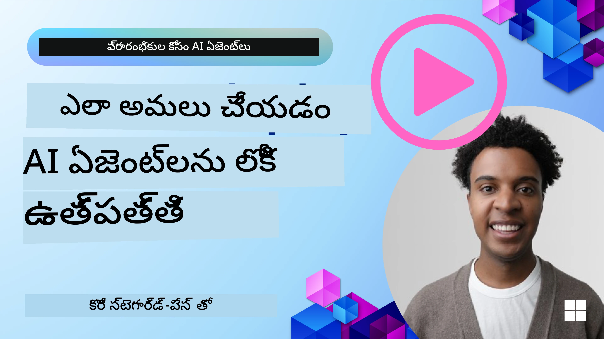

<!--
CO_OP_TRANSLATOR_METADATA:
{
  "original_hash": "cdfd0acc8592c1af14f8637833450375",
  "translation_date": "2025-12-03T16:43:40+00:00",
  "source_file": "10-ai-agents-production/README.md",
  "language_code": "te"
}
-->
# ఉత్పత్తిలో AI ఏజెంట్లు: గమనించగలిగే సామర్థ్యం & మూల్యాంకనం

[](https://youtu.be/l4TP6IyJxmQ?si=reGOyeqjxFevyDq9)

AI ఏజెంట్లు ప్రయోగాత్మక నమూనాల నుండి వాస్తవ ప్రపంచ అనువర్తనాలకు మారుతున్నప్పుడు, వాటి ప్రవర్తనను అర్థం చేసుకోవడం, పనితీరును పర్యవేక్షించడం, మరియు అవుట్‌పుట్‌లను పద్ధతిగా మూల్యాంకనం చేయడం చాలా ముఖ్యమవుతుంది.

## అభ్యాస లక్ష్యాలు

ఈ పాఠాన్ని పూర్తి చేసిన తర్వాత, మీరు తెలుసుకుంటారు/అర్థం చేసుకుంటారు:
- ఏజెంట్ గమనించగలిగే సామర్థ్యం మరియు మూల్యాంకనానికి సంబంధించిన ముఖ్యమైన భావనలు
- ఏజెంట్ల పనితీరు, ఖర్చులు, మరియు ప్రభావాన్ని మెరుగుపరచడానికి పద్ధతులు
- మీ AI ఏజెంట్లను పద్ధతిగా ఎలా మరియు ఏమి మూల్యాంకనం చేయాలో
- AI ఏజెంట్లను ఉత్పత్తిలో అమలు చేయేటప్పుడు ఖర్చులను ఎలా నియంత్రించాలో
- AutoGen తో నిర్మించిన ఏజెంట్లను ఎలా ఇన్‌స్ట్రుమెంట్ చేయాలో

లక్ష్యం మీ "బ్లాక్ బాక్స్" ఏజెంట్లను పారదర్శక, నిర్వహించగలిగే, మరియు నమ్మదగిన వ్యవస్థలుగా మార్చడానికి అవసరమైన జ్ఞానాన్ని అందించడమే.

_**గమనిక:** సురక్షితమైన మరియు నమ్మదగిన AI ఏజెంట్లను అమలు చేయడం చాలా ముఖ్యం. [నమ్మదగిన AI ఏజెంట్లను నిర్మించడం](./06-building-trustworthy-agents/README.md) పాఠాన్ని చూడండి._

## ట్రేస్‌లు మరియు స్పాన్‌లు

[Langfuse](https://langfuse.com/) లేదా [Azure AI Foundry](https://learn.microsoft.com/en-us/azure/ai-foundry/what-is-azure-ai-foundry) వంటి గమనించగలిగే సాధనాలు సాధారణంగా ఏజెంట్ రన్‌లను ట్రేస్‌లు మరియు స్పాన్‌లుగా ప్రాతినిధ్యం చేస్తాయి.

- **ట్రేస్** ఒక పూర్తి ఏజెంట్ పనిని ప్రారంభం నుండి ముగింపు వరకు ప్రాతినిధ్యం చేస్తుంది (ఉదాహరణకు, వినియోగదారు ప్రశ్నను నిర్వహించడం).
- **స్పాన్‌లు** ట్రేస్‌లోని వ్యక్తిగత దశలు (ఉదాహరణకు, భాషా మోడల్‌ను కాల్ చేయడం లేదా డేటాను పొందడం).


గమనించగలిగే సామర్థ్యం లేకుండా, AI ఏజెంట్ "బ్లాక్ బాక్స్" లాగా అనిపిస్తుంది - దాని అంతర్గత స్థితి మరియు తర్కం స్పష్టంగా ఉండదు, సమస్యలను నిర్ధారించడం లేదా పనితీరును ఆప్టిమైజ్ చేయడం కష్టం. గమనించగలిగే సామర్థ్యంతో, ఏజెంట్లు "గ్లాస్ బాక్స్" లుగా మారతాయి, ఇది నమ్మకాన్ని నిర్మించడానికి మరియు అవి ఉద్దేశించిన విధంగా పనిచేస్తున్నాయని నిర్ధారించడానికి చాలా అవసరం.

## ఉత్పత్తి వాతావరణాల్లో గమనించగలిగే సామర్థ్యం ఎందుకు ముఖ్యం

AI ఏజెంట్లను ఉత్పత్తి వాతావరణాలకు మార్చడం కొత్త సవాళ్లు మరియు అవసరాలను పరిచయం చేస్తుంది. గమనించగలిగే సామర్థ్యం "అందంగా ఉండే" అంశం కాదు, ఇది కీలక సామర్థ్యం:

*   **డీబగ్గింగ్ మరియు మూలకారణ విశ్లేషణ:** ఏజెంట్ విఫలమైతే లేదా అనూహ్య అవుట్‌పుట్‌ను ఉత్పత్తి చేస్తే, గమనించగలిగే సాధనాలు పొరపాటును గుర్తించడానికి అవసరమైన ట్రేస్‌లను అందిస్తాయి. ఇది అనేక LLM కాల్స్, టూల్ ఇంటరాక్షన్‌లు, మరియు షరతు లాజిక్‌ను కలిగి ఉండే సంక్లిష్ట ఏజెంట్లలో ముఖ్యంగా అవసరం.
*   **లేటెన్సీ మరియు ఖర్చు నిర్వహణ:** AI ఏజెంట్లు తరచుగా LLMలు మరియు ఇతర బాహ్య APIలపై ఆధారపడతాయి, ఇవి టోకెన్ లేదా కాల్‌కు బిల్లింగ్ చేయబడతాయి. గమనించగలిగే సామర్థ్యం ఈ కాల్స్‌ను ఖచ్చితంగా ట్రాక్ చేయడానికి అనుమతిస్తుంది, ఇవి అధికంగా నెమ్మదిగా లేదా ఖరీదైన ఆపరేషన్లను గుర్తించడంలో సహాయపడుతుంది. ఇది టీమ్‌లకు ప్రాంప్ట్‌లను ఆప్టిమైజ్ చేయడానికి, మరింత సమర్థవంతమైన మోడళ్లను ఎంచుకోవడానికి, లేదా ఆపరేషనల్ ఖర్చులను నిర్వహించడానికి మరియు మంచి వినియోగదారు అనుభవాన్ని నిర్ధారించడానికి వర్క్‌ఫ్లోలను మళ్లీ డిజైన్ చేయడానికి వీలు కల్పిస్తుంది.
*   **నమ్మకం, భద్రత, మరియు అనుగుణత:** అనేక అనువర్తనాల్లో, ఏజెంట్లు సురక్షితంగా మరియు నైతికంగా ప్రవర్తించడం చాలా ముఖ్యం. గమనించగలిగే సామర్థ్యం ఏజెంట్ చర్యలు మరియు నిర్ణయాల ఆడిట్ ట్రైల్‌ను అందిస్తుంది. ఇది ప్రాంప్ట్ ఇంజెక్షన్, హానికరమైన కంటెంట్ ఉత్పత్తి, లేదా వ్యక్తిగతంగా గుర్తించగలిగే సమాచారం (PII) యొక్క తప్పుగా నిర్వహించడం వంటి సమస్యలను గుర్తించడానికి మరియు తగ్గించడానికి ఉపయోగించవచ్చు. ఉదాహరణకు, ఏజెంట్ ఒక నిర్దిష్ట ప్రతిస్పందనను ఎందుకు అందించిందో లేదా ఒక నిర్దిష్ట సాధనాన్ని ఎందుకు ఉపయోగించిందో అర్థం చేసుకోవడానికి ట్రేస్‌లను సమీక్షించవచ్చు.
*   **నిరంతర మెరుగుదల చక్రాలు:** గమనించగలిగే డేటా పునరావృత అభివృద్ధి ప్రక్రియకు పునాది. ఏజెంట్లు వాస్తవ ప్రపంచంలో ఎలా ప్రదర్శిస్తున్నాయో పర్యవేక్షించడం ద్వారా, టీమ్‌లు మెరుగుదల కోసం ప్రాంతాలను గుర్తించవచ్చు, మోడళ్లను ఫైన్-ట్యూన్ చేయడానికి డేటాను సేకరించవచ్చు, మరియు మార్పుల ప్రభావాన్ని ధృవీకరించవచ్చు. ఇది ఉత్పత్తి లోపల ఆన్‌లైన్ మూల్యాంకన నుండి పొందిన అంతర్దృష్టులు ఆఫ్‌లైన్ ప్రయోగం మరియు శుద్ధీకరణను తెలియజేసే ఫీడ్‌బ్యాక్ లూప్‌ను సృష్టిస్తుంది, ఇది క్రమంగా మెరుగైన ఏజెంట్ పనితీరుకు దారితీస్తుంది.

## ట్రాక్ చేయాల్సిన ముఖ్యమైన మెట్రిక్స్

ఏజెంట్ ప్రవర్తనను పర్యవేక్షించడానికి మరియు అర్థం చేసుకోవడానికి, అనేక మెట్రిక్స్ మరియు సంకేతాలను ట్రాక్ చేయాలి. ఏజెంట్ యొక్క ఉద్దేశ్యంపై ఆధారపడి ప్రత్యేకమైన మెట్రిక్స్ మారవచ్చు, కానీ కొన్ని సాధారణంగా ముఖ్యమైనవి.

ఇక్కడ గమనించగలిగే సాధనాలు పర్యవేక్షించే సాధారణ మెట్రిక్స్ ఉన్నాయి:

**లేటెన్సీ:** ఏజెంట్ ఎంత త్వరగా స్పందిస్తుంది? ఎక్కువ వేచి ఉండే సమయాలు వినియోగదారు అనుభవాన్ని ప్రతికూలంగా ప్రభావితం చేస్తాయి. ఏజెంట్ రన్‌లను ట్రేస్ చేయడం ద్వారా పనుల మరియు వ్యక్తిగత దశల కోసం లేటెన్సీని కొలవాలి. ఉదాహరణకు, అన్ని మోడల్ కాల్స్ కోసం 20 సెకన్లు తీసుకునే ఏజెంట్‌ను వేగవంతమైన మోడల్‌ను ఉపయోగించడం లేదా మోడల్ కాల్స్‌ను సమాంతరంగా నడపడం ద్వారా వేగవంతం చేయవచ్చు.

**ఖర్చులు:** ఏజెంట్ రన్‌కు ఖర్చు ఎంత? AI ఏజెంట్లు టోకెన్‌కు బిల్లింగ్ చేయబడే LLM కాల్స్ లేదా బాహ్య APIలపై ఆధారపడతాయి. తరచుగా టూల్ వినియోగం లేదా అనేక ప్రాంప్ట్‌లు ఖర్చులను వేగంగా పెంచవచ్చు. ఉదాహరణకు, ఒక ఏజెంట్ LLMను ఐదు సార్లు కాల్ చేస్తే, తక్కువ ఖర్చుతో కూడిన మోడల్‌ను ఉపయోగించడం ద్వారా కాల్స్ సంఖ్యను తగ్గించవచ్చు లేదా ఖర్చు సమర్థవంతమా అని అంచనా వేయాలి. రియల్-టైమ్ పర్యవేక్షణ అనూహ్యమైన స్పైక్‌లను గుర్తించడంలో కూడా సహాయపడుతుంది (ఉదాహరణకు, అధిక API లూప్‌లకు కారణమైన బగ్‌లు).

**అభ్యర్థన లోపాలు:** ఏజెంట్ విఫలమైన అభ్యర్థనల సంఖ్య ఎంత? ఇది API లోపాలు లేదా విఫలమైన టూల్ కాల్స్‌ను కలిగి ఉండవచ్చు. ఉత్పత్తిలో వీటికి వ్యతిరేకంగా మీ ఏజెంట్‌ను మరింత బలంగా చేయడానికి, మీరు ఫాల్బ్యాక్‌లు లేదా రీట్రైలను సెటప్ చేయవచ్చు. ఉదాహరణకు, LLM ప్రొవైడర్ A డౌన్ అయితే, మీరు బ్యాకప్‌గా LLM ప్రొవైడర్ Bకి మారవచ్చు.

**వినియోగదారు ఫీడ్‌బ్యాక్:** ప్రత్యక్ష వినియోగదారు మూల్యాంకనాలను అమలు చేయడం విలువైన అంతర్దృష్టులను అందిస్తుంది. ఇది స్పష్టమైన రేటింగ్‌లు (👍thumbs-up/👎down, ⭐1-5 stars) లేదా టెక్స్టువల్ వ్యాఖ్యలను కలిగి ఉండవచ్చు. స్థిరమైన ప్రతికూల ఫీడ్‌బ్యాక్ ఏజెంట్ ఆశించిన విధంగా పనిచేయడం లేదని సూచించే సంకేతంగా ఉండాలి.

**అనుమానిత వినియోగదారు ఫీడ్‌బ్యాక్:** వినియోగదారు ప్రవర్తనలు స్పష్టమైన రేటింగ్‌లు లేకుండా కూడా పరోక్ష ఫీడ్‌బ్యాక్‌ను అందిస్తాయి. ఇది తక్షణ ప్రశ్న పునరావృతం, పునరావృత ప్రశ్నలు లేదా రీట్రై బటన్ క్లిక్ చేయడం వంటి వాటిని కలిగి ఉండవచ్చు. ఉదాహరణకు, వినియోగదారులు అదే ప్రశ్నను పునరావృతంగా అడుగుతున్నారని మీరు చూస్తే, ఇది ఏజెంట్ ఆశించిన విధంగా పనిచేయడం లేదని సంకేతం.

**ఖచ్చితత్వం:** ఏజెంట్ సరైన లేదా కోరుకున్న అవుట్‌పుట్‌లను ఎంత తరచుగా ఉత్పత్తి చేస్తుంది? ఖచ్చితత్వం నిర్వచనాలు మారవచ్చు (ఉదాహరణకు, సమస్య పరిష్కార ఖచ్చితత్వం, సమాచారం పొందడం ఖచ్చితత్వం, వినియోగదారు సంతృప్తి). మీ ఏజెంట్ కోసం విజయాన్ని ఎలా నిర్వచించాలో మొదటి దశ. మీరు ఆటోమేటెడ్ చెక్‌లు, మూల్యాంకన స్కోర్‌లు, లేదా టాస్క్ పూర్తి లేబుల్‌ల ద్వారా ఖచ్చితత్వాన్ని ట్రాక్ చేయవచ్చు. ఉదాహరణకు, ట్రేస్‌లను "సక్సీడ్" లేదా "ఫెయిల్"గా గుర్తించడం.

**ఆటోమేటెడ్ మూల్యాంకన మెట్రిక్స్:** మీరు ఆటోమేటెడ్ మూల్యాంకనాలను కూడా సెటప్ చేయవచ్చు. ఉదాహరణకు, ఏజెంట్ అవుట్‌పుట్ సహాయకరమైనదా, ఖచ్చితమైనదా లేదా కాదా అని స్కోర్ చేయడానికి LLMను ఉపయోగించవచ్చు. ఏజెంట్ యొక్క వివిధ అంశాలను స్కోర్ చేయడంలో సహాయపడే అనేక ఓపెన్ సోర్స్ లైబ్రరీలు కూడా ఉన్నాయి. ఉదాహరణకు, RAG ఏజెంట్ల కోసం [RAGAS](https://docs.ragas.io/) లేదా హానికరమైన భాష లేదా ప్రాంప్ట్ ఇంజెక్షన్‌ను గుర్తించడానికి [LLM Guard](https://llm-guard.com/).

ఆచరణలో, ఈ మెట్రిక్స్ కలయిక AI ఏజెంట్ యొక్క ఆరోగ్యానికి ఉత్తమ కవరేజ్‌ను అందిస్తుంది. ఈ అధ్యాయంలోని [ఉదాహరణ నోట్బుక్](./code_samples/10_autogen_evaluation.ipynb)లో, ఈ మెట్రిక్స్ వాస్తవ ఉదాహరణల్లో ఎలా కనిపిస్తాయో చూపిస్తాము, కానీ ముందుగా, సాధారణ మూల్యాంకన వర్క్‌ఫ్లో ఎలా ఉంటుందో నేర్చుకుందాం.

## మీ ఏజెంట్‌ను ఇన్‌స్ట్రుమెంట్ చేయండి

ట్రేసింగ్ డేటాను సేకరించడానికి, మీరు మీ కోడ్‌ను ఇన్‌స్ట్రుమెంట్ చేయాలి. లక్ష్యం ఏజెంట్ కోడ్‌ను ఇన్‌స్ట్రుమెంట్ చేయడం, ట్రేస్‌లు మరియు మెట్రిక్స్‌ను ఉత్పత్తి చేయడం, ప్రాసెస్ చేయడం, మరియు గమనించగలిగే ప్లాట్‌ఫారమ్ ద్వారా విజువలైజ్ చేయడం.

**ఓపెన్‌టెలిమెట్రీ (OTel):** [ఓపెన్‌టెలిమెట్రీ](https://opentelemetry.io/) LLM గమనించగలిగే సామర్థ్యానికి పరిశ్రమ ప్రమాణంగా ఎదిగింది. ఇది టెలిమెట్రీ డేటాను ఉత్పత్తి చేయడానికి, సేకరించడానికి, మరియు ఎగుమతి చేయడానికి APIలు, SDKలు, మరియు సాధనాల సమితిని అందిస్తుంది.

ఇన్‌స్ట్రుమెంట్ లైబ్రరీలు ఉన్న ఏజెంట్ ఫ్రేమ్‌వర్క్‌లను ర్యాప్ చేసి, ఓపెన్‌టెలిమెట్రీ స్పాన్‌లను గమనించగలిగే సాధనానికి ఎగుమతి చేయడం సులభం చేస్తాయి. [OpenLit ఇన్‌స్ట్రుమెంట్ లైబ్రరీ](https://github.com/openlit/openlit)తో AutoGen ఏజెంట్‌ను ఇన్‌స్ట్రుమెంట్ చేయడంపై ఉదాహరణ:

```python
import openlit

openlit.init(tracer = langfuse._otel_tracer, disable_batch = True)
```

ఈ అధ్యాయంలోని [ఉదాహరణ నోట్బుక్](./code_samples/10_autogen_evaluation.ipynb)లో మీ AutoGen ఏజెంట్‌ను ఎలా ఇన్‌స్ట్రుమెంట్ చేయాలో చూపిస్తాము.

**మానవీయ స్పాన్ సృష్టి:** ఇన్‌స్ట్రుమెంట్ లైబ్రరీలు మంచి బేస్‌లైన్‌ను అందిస్తాయి, కానీ తరచుగా మరింత వివరణాత్మక లేదా అనుకూల సమాచారం అవసరం ఉండవచ్చు. మీరు అనుకూల అప్లికేషన్ లాజిక్‌ను జోడించడానికి స్పాన్‌లను మానవీయంగా సృష్టించవచ్చు. ముఖ్యంగా, అవి ఆటోమేటిక్ లేదా మానవీయంగా సృష్టించిన స్పాన్‌లను అనుకూల లక్షణాలతో (ట్యాగ్‌లు లేదా మెటాడేటాగా కూడా పిలుస్తారు) సమృద్ధిగా చేయవచ్చు. ఈ లక్షణాలు వ్యాపార-సంబంధిత డేటా, మధ్యంతర గణనాలు, లేదా డీబగ్గింగ్ లేదా విశ్లేషణకు ఉపయోగకరమైన ఏదైనా సందర్భాన్ని కలిగి ఉండవచ్చు, ఉదాహరణకు `user_id`, `session_id`, లేదా `model_version`.

[Langfuse Python SDK](https://langfuse.com/docs/sdk/python/sdk-v3)తో ట్రేస్‌లు మరియు స్పాన్‌లను మానవీయంగా సృష్టించడంపై ఉదాహరణ:

```python
from langfuse import get_client
 
langfuse = get_client()
 
span = langfuse.start_span(name="my-span")
 
span.end()
```

## ఏజెంట్ మూల్యాంకనం

గమనించగలిగే సామర్థ్యం మాకు మెట్రిక్స్‌ను అందిస్తుంది, కానీ మూల్యాంకనం అనేది ఆ డేటాను విశ్లేషించడం (మరియు పరీక్షలు నిర్వహించడం) ద్వారా AI ఏజెంట్ ఎంత బాగా పనిచేస్తుందో మరియు దాన్ని ఎలా మెరుగుపరచాలో నిర్ణయించడమే. అంటే, మీరు ఆ ట్రేస్‌లు మరియు మెట్రిక్స్‌ను పొందిన తర్వాత, ఏజెంట్‌ను ఎలా తీర్పు చేయాలో మరియు నిర్ణయాలు తీసుకోవాలో.

నియమిత మూల్యాంకనం ముఖ్యం ఎందుకంటే AI ఏజెంట్లు తరచుగా నిర్దిష్టతను కలిగి ఉండవు మరియు అభివృద్ధి చెందుతాయి (అప్‌డేట్‌లు లేదా మోడల్ ప్రవర్తన మార్పు ద్వారా) – మూల్యాంకనం లేకుండా, మీ "స్మార్ట్ ఏజెంట్" నిజంగా తన పని బాగా చేస్తున్నదా లేదా వెనుకడగు వేసిందా అని మీరు తెలుసుకోలేరు.

AI ఏజెంట్లకు రెండు రకాల మూల్యాంకనలు ఉన్నాయి: **ఆఫ్‌లైన్ మూల్యాంకనం** మరియు **ఆన్‌లైన్ మూల్యాంకనం**. రెండూ విలువైనవి, మరియు అవి ఒకదానిని మరొకదాన్ని पूరించగలవు. మేము సాధారణంగా ఆఫ్‌లైన్ మూల్యాంకనంతో ప్రారంభిస్తాము, ఎందుకంటే ఇది ఏ ఏజెంట్‌ను అమలు చేయడానికి ముందు కనీసం అవసరమైన దశ.

### ఆఫ్‌లైన్ మూల్యాంకనం


ఇది సాధారణంగా పరీక్ష డేటాసెట్‌లను ఉపయోగించి, ప్రత్యక్ష వినియోగదారు ప్రశ్నలను కాకుండా, నియంత్రిత వాతావరణంలో ఏజెంట్‌ను మూల్యాంకనం చేయడం. మీరు ఆశించిన అవుట్‌పుట్ లేదా సరైన ప్రవర్తన ఏమిటో మీకు తెలుసు, మరియు ఆ డేటాసెట్‌లపై మీ ఏజెంట్‌ను నడుపుతారు.

ఉదాహరణకు, మీరు గణిత పద సమస్య ఏజెంట్‌ను నిర్మిస్తే, మీరు 100 సమస్యలతో [పరీక్ష డేటాసెట్](https://huggingface.co/datasets/gsm8k)ను కలిగి ఉండవచ్చు, వీటి సమాధానాలు తెలిసినవి. ఆఫ్‌లైన్ మూల్యాంకనం తరచుగా అభివృద్ధి సమయంలో (మరియు CI/CD పైప్‌లైన్‌లలో భాగంగా ఉండవచ్చు) మెరుగుదలలను తనిఖీ చేయడానికి లేదా వెనుకడగు వేసే ప్రమాదాలను నిర
AI ఏజెంట్లను ప్రొడక్షన్‌లో డిప్లాయ్ చేయడంలో ఖర్చులను నిర్వహించడానికి కొన్ని వ్యూహాలు ఇక్కడ ఉన్నాయి:

**చిన్న మోడళ్లను ఉపయోగించడం:** చిన్న లాంగ్వేజ్ మోడళ్లు (SLMs) కొన్ని ఏజెంటిక్ ఉపయోగాలపై బాగా పనిచేస్తాయి మరియు ఖర్చులను గణనీయంగా తగ్గిస్తాయి. ముందుగా చెప్పినట్లుగా, పనితీరు మరియు పెద్ద మోడళ్లతో పోల్చి అంచనా వేయడానికి ఒక మూల్యాంకన వ్యవస్థను నిర్మించడం మీ ఉపయోగానికి SLM ఎంత బాగా పనిచేస్తుందో అర్థం చేసుకోవడానికి ఉత్తమ మార్గం. ఉద్దేశం వర్గీకరణ లేదా పారామీటర్ ఎక్స్‌ట్రాక్షన్ వంటి సులభమైన పనుల కోసం SLMలను ఉపయోగించడం పరిగణించండి, అయితే క్లిష్టమైన తర్కానికి పెద్ద మోడళ్లను రిజర్వ్ చేయండి.

**రౌటర్ మోడల్‌ను ఉపయోగించడం:** ఇలాంటి వ్యూహం అనేక మోడళ్లను మరియు వాటి పరిమాణాలను ఉపయోగించడం. మీరు LLM/SLM లేదా సర్వర్‌లెస్ ఫంక్షన్‌ను ఉపయోగించి అభ్యర్థనలను క్లిష్టత ఆధారంగా సరైన మోడళ్లకు రూట్ చేయవచ్చు. ఇది ఖర్చులను తగ్గించడంలో సహాయపడుతుంది మరియు సరైన పనులపై పనితీరును నిర్ధారిస్తుంది. ఉదాహరణకు, చిన్న, వేగవంతమైన మోడళ్లకు సులభమైన ప్రశ్నలను రూట్ చేయండి, మరియు క్లిష్టమైన తర్క పనుల కోసం ఖరీదైన పెద్ద మోడళ్లను మాత్రమే ఉపయోగించండి.

**ప్రతిస్పందనలను క్యాష్ చేయడం:** సాధారణ అభ్యర్థనలు మరియు పనులను గుర్తించి, మీ ఏజెంటిక్ వ్యవస్థకు వెళ్లే ముందు ప్రతిస్పందనలను అందించడం అనేది సమానమైన అభ్యర్థనల వాల్యూమ్‌ను తగ్గించడానికి మంచి మార్గం. మీరు మీ క్యాష్ చేసిన అభ్యర్థనలకు అభ్యర్థన ఎంత సమానంగా ఉందో గుర్తించడానికి మరింత ప్రాథమిక AI మోడళ్లను ఉపయోగించి ఒక ఫ్లోను అమలు చేయవచ్చు. ఈ వ్యూహం తరచుగా అడిగే ప్రశ్నలు లేదా సాధారణ వర్క్‌ఫ్లోల కోసం ఖర్చులను గణనీయంగా తగ్గించగలదు.

## ఇది ప్రాక్టీస్‌లో ఎలా పనిచేస్తుందో చూద్దాం

ఈ విభాగం యొక్క [ఉదాహరణ నోట్‌బుక్](./code_samples/10_autogen_evaluation.ipynb)లో, ఏజెంట్‌ను పర్యవేక్షించడానికి మరియు మూల్యాంకనం చేయడానికి ఎలా ఆబ్జర్వబిలిటీ టూల్స్‌ను ఉపయోగించగలమో ఉదాహరణలు చూస్తాము.

### ప్రొడక్షన్‌లో AI ఏజెంట్ల గురించి మరిన్ని ప్రశ్నలున్నాయా?

మరింత నేర్చుకునేందుకు, ఆఫీస్ అవర్స్‌లో పాల్గొనడానికి మరియు మీ AI ఏజెంట్ల ప్రశ్నలకు సమాధానం పొందడానికి [Azure AI Foundry Discord](https://aka.ms/ai-agents/discord)లో చేరండి.

## గత పాఠం

[మెటాకాగ్నిషన్ డిజైన్ ప్యాటర్న్](../09-metacognition/README.md)

## తదుపరి పాఠం

[ఏజెంటిక్ ప్రోటోకాల్‌లు](../11-agentic-protocols/README.md)

---

<!-- CO-OP TRANSLATOR DISCLAIMER START -->
**విమర్శ**:  
ఈ పత్రాన్ని AI అనువాద సేవ [Co-op Translator](https://github.com/Azure/co-op-translator) ఉపయోగించి అనువదించారు. మేము ఖచ్చితత్వానికి ప్రయత్నిస్తున్నప్పటికీ, ఆటోమేటెడ్ అనువాదాలలో తప్పులు లేదా అసమానతలు ఉండవచ్చు. దయచేసి, మూల భాషలో ఉన్న అసలు పత్రాన్ని అధికారం కలిగిన మూలంగా పరిగణించండి. ముఖ్యమైన సమాచారం కోసం, ప్రొఫెషనల్ మానవ అనువాదాన్ని సిఫారసు చేస్తాము. ఈ అనువాదాన్ని ఉపయోగించడం వల్ల కలిగే ఏవైనా అపార్థాలు లేదా తప్పుదారులు కోసం మేము బాధ్యత వహించము.
<!-- CO-OP TRANSLATOR DISCLAIMER END -->