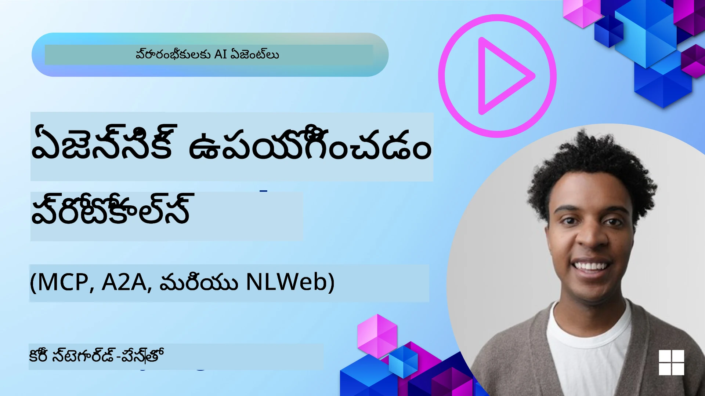
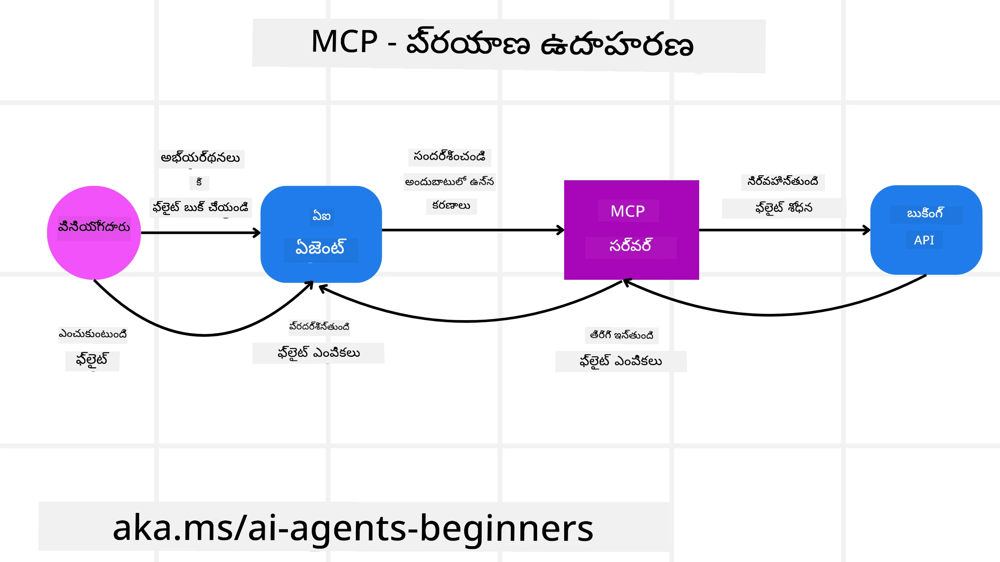

<!--
CO_OP_TRANSLATOR_METADATA:
{
  "original_hash": "aff92c6f019b4627ca9399c6e3882e17",
  "translation_date": "2025-12-03T17:30:06+00:00",
  "source_file": "11-agentic-protocols/README.md",
  "language_code": "te"
}
-->
# ఏజెంటిక్ ప్రోటోకాల్‌లను ఉపయోగించడం (MCP, A2A మరియు NLWeb)

> _(ఈ పాఠం వీడియోను చూడటానికి పై చిత్రంపై క్లిక్ చేయండి)_

AI ఏజెంట్ల వినియోగం పెరుగుతున్న కొద్దీ, ప్రమాణీకరణ, భద్రత మరియు ఓపెన్ ఇన్నోవేషన్‌కు మద్దతు ఇచ్చే ప్రోటోకాల్‌ల అవసరం కూడా పెరుగుతోంది. ఈ పాఠంలో, ఈ అవసరాన్ని తీర్చడానికి ప్రయత్నిస్తున్న మూడు ప్రోటోకాల్‌లను - మోడల్ కాంటెక్స్ట్ ప్రోటోకాల్ (MCP), ఏజెంట్ టు ఏజెంట్ (A2A) మరియు నేచురల్ లాంగ్వేజ్ వెబ్ (NLWeb) గురించి చర్చిస్తాము.

## పరిచయం

ఈ పాఠంలో, మేము కవర్ చేస్తాము:

• **MCP** ఎలా AI ఏజెంట్లకు బాహ్య టూల్స్ మరియు డేటాను యాక్సెస్ చేయడానికి మరియు వినియోగదారుల పనులను పూర్తి చేయడానికి అనుమతిస్తుంది.

• **A2A** ఎలా వివిధ AI ఏజెంట్ల మధ్య కమ్యూనికేషన్ మరియు సహకారాన్ని సాధ్యమవుతుంది.

• **NLWeb** ఎలా ఏదైనా వెబ్‌సైట్‌కు నేచురల్ లాంగ్వేజ్ ఇంటర్‌ఫేస్‌లను తీసుకువస్తుంది, AI ఏజెంట్లకు కంటెంట్‌ను కనుగొనడం మరియు ఇంటరాక్ట్ చేయడం సాధ్యమవుతుంది.

## అభ్యాస లక్ష్యాలు

• AI ఏజెంట్ల సందర్భంలో MCP, A2A మరియు NLWeb యొక్క ప్రధాన ప్రయోజనాలను **గుర్తించండి**.

• ప్రతి ప్రోటోకాల్ ఎలా LLMs, టూల్స్ మరియు ఇతర ఏజెంట్ల మధ్య కమ్యూనికేషన్ మరియు ఇంటరాక్షన్‌ను సులభతరం చేస్తుందో **వివరించండి**.

• సంక్లిష్టమైన ఏజెంటిక్ సిస్టమ్‌లను నిర్మించడంలో ప్రతి ప్రోటోకాల్ యొక్క ప్రత్యేక పాత్రలను **గుర్తించండి**.

## మోడల్ కాంటెక్స్ట్ ప్రోటోకాల్

**మోడల్ కాంటెక్స్ట్ ప్రోటోకాల్ (MCP)** అనేది ఓపెన్ స్టాండర్డ్, ఇది LLMs కు కాంటెక్స్ట్ మరియు టూల్స్‌ను అందించడానికి అనువైన మార్గాన్ని అందిస్తుంది. ఇది AI ఏజెంట్లు కనెక్ట్ చేయగలిగే వివిధ డేటా సోర్స్‌లు మరియు టూల్స్‌కు "యూనివర్సల్ అడాప్టర్"ను అందిస్తుంది.

MCP యొక్క భాగాలు, డైరెక్ట్ API వినియోగంతో పోల్చిన ప్రయోజనాలు మరియు AI ఏజెంట్లు MCP సర్వర్‌ను ఎలా ఉపయోగించవచ్చో ఉదాహరణను చూద్దాం.

### MCP ప్రధాన భాగాలు

MCP **క్లయింట్-సర్వర్ ఆర్కిటెక్చర్** పై పనిచేస్తుంది మరియు ప్రధాన భాగాలు ఇవి:

• **హోస్ట్స్**: LLM అప్లికేషన్లు (ఉదాహరణకు VSCode వంటి కోడ్ ఎడిటర్) ఇవి MCP సర్వర్‌కు కనెక్షన్లను ప్రారంభిస్తాయి.

• **క్లయింట్స్**: హోస్ట్ అప్లికేషన్‌లోని భాగాలు, ఇవి సర్వర్‌లతో ఒకటి-ఒకటి కనెక్షన్లను నిర్వహిస్తాయి.

• **సర్వర్‌లు**: నిర్దిష్ట సామర్థ్యాలను అందించే తేలికపాటి ప్రోగ్రామ్‌లు.

MCP సర్వర్ యొక్క సామర్థ్యాలను సూచించే మూడు ప్రధాన ప్రిమిటివ్‌లు ప్రోటోకాల్‌లో ఉన్నాయి:

• **టూల్స్**: ఇవి AI ఏజెంట్ ఒక చర్యను చేయడానికి కాల్ చేయగలిగే ప్రత్యేక చర్యలు లేదా ఫంక్షన్‌లు. ఉదాహరణకు, వాతావరణ సేవ "వెదర్ పొందండి" టూల్‌ను అందించవచ్చు లేదా ఈ-కామర్స్ సర్వర్ "ఉత్పత్తిని కొనుగోలు చేయండి" టూల్‌ను అందించవచ్చు. MCP సర్వర్‌లు ప్రతి టూల్ పేరు, వివరణ మరియు ఇన్‌పుట్/అవుట్‌పుట్ స్కీమాను వారి సామర్థ్యాల జాబితాలో ప్రకటన చేస్తాయి.

• **రీసోర్సెస్**: ఇవి చదవగలిగే డేటా అంశాలు లేదా డాక్యుమెంట్‌లు, ఇవి MCP సర్వర్ అందించగలదు మరియు క్లయింట్లు వాటిని డిమాండ్‌పై పొందగలవు. ఉదాహరణలు: ఫైల్ కంటెంట్, డేటాబేస్ రికార్డులు లేదా లాగ్ ఫైల్‌లు. రీసోర్సెస్ టెక్స్ట్ (కోడ్ లేదా JSON వంటి) లేదా బైనరీ (చిత్రాలు లేదా PDFs వంటి) కావచ్చు.

• **ప్రాంప్ట్‌లు**: ఇవి సూచించిన ప్రాంప్ట్‌లను అందించే ప్రీడిఫైన్డ్ టెంప్లేట్‌లు, ఇవి మరింత సంక్లిష్టమైన వర్క్‌ఫ్లోలను అనుమతిస్తాయి.

### MCP ప్రయోజనాలు

MCP AI ఏజెంట్లకు ముఖ్యమైన ప్రయోజనాలను అందిస్తుంది:

• **డైనమిక్ టూల్ డిస్కవరీ**: ఏజెంట్లు సర్వర్ నుండి అందుబాటులో ఉన్న టూల్స్ జాబితాను మరియు అవి ఏమి చేస్తాయో వివరణలను డైనమిక్‌గా పొందగలవు. ఇది సంప్రదాయ APIలతో పోలిస్తే, ఇవి తరచుగా ఇంటిగ్రేషన్ కోసం స్థిరమైన కోడింగ్‌ను అవసరం చేస్తాయి, అంటే ఏ API మార్పు కోడ్ నవీకరణలను అవసరం చేస్తుంది. MCP "ఒకసారి ఇంటిగ్రేట్ చేయండి" విధానాన్ని అందిస్తుంది, ఇది మరింత అనుకూలతను కలిగిస్తుంది.

• **LLMs మధ్య ఇంటరాపరబిలిటీ**: MCP వివిధ LLMs అంతటా పనిచేస్తుంది, మెరుగైన పనితీరును అంచనా వేయడానికి ప్రధాన మోడల్‌లను మార్చడానికి అనువుగా ఉంటుంది.

• **ప్రామాణీకరించిన భద్రత**: MCP ఒక ప్రామాణిక ఆథెంటికేషన్ పద్ధతిని కలిగి ఉంది, ఇది అదనపు MCP సర్వర్‌లకు యాక్సెస్‌ను జోడించేటప్పుడు స్కేలబిలిటీని మెరుగుపరుస్తుంది. ఇది వివిధ సంప్రదాయ APIల కోసం వివిధ కీలు మరియు ఆథెంటికేషన్ రకాల నిర్వహణ కంటే సులభం.

### MCP ఉదాహరణ

ఒక వినియోగదారు MCP ద్వారా శక్తివంతమైన AI అసిస్టెంట్‌ను ఉపయోగించి విమానాన్ని బుక్ చేయాలని కోరుకుంటున్నట్లు ఊహించుకోండి.

1. **కనెక్షన్**: AI అసిస్టెంట్ (MCP క్లయింట్) ఎయిర్‌లైన్ అందించిన MCP సర్వర్‌కు కనెక్ట్ అవుతుంది.

2. **టూల్ డిస్కవరీ**: క్లయింట్ ఎయిర్‌లైన్ యొక్క MCP సర్వర్‌ను అడుగుతుంది, "మీకు అందుబాటులో ఉన్న టూల్స్ ఏమిటి?" సర్వర్ "విమానాలను శోధించండి" మరియు "విమానాలను బుక్ చేయండి" వంటి టూల్స్‌ను అందిస్తుంది.

3. **టూల్ ఇన్వోకేషన్**: మీరు AI అసిస్టెంట్‌ను అడుగుతారు, "పోర్ట్‌లాండ్ నుండి హోనోలులు వరకు విమానాన్ని శోధించండి." AI అసిస్టెంట్, దాని LLM ఉపయోగించి, "విమానాలను శోధించండి" టూల్‌ను కాల్ చేయాల్సిన అవసరం ఉందని గుర్తిస్తుంది మరియు సంబంధిత పారామీటర్లను (మూలం, గమ్యం) MCP సర్వర్‌కు పంపుతుంది.

4. **ఎగ్జిక్యూషన్ మరియు రెస్పాన్స్**: MCP సర్వర్, రాపర్‌గా పనిచేస్తూ, ఎయిర్‌లైన్ యొక్క అంతర్గత బుకింగ్ APIకి అసలు కాల్ చేస్తుంది. ఇది విమాన సమాచారం (ఉదాహరణకు, JSON డేటా) పొందుతుంది మరియు AI అసిస్టెంట్‌కు తిరిగి పంపుతుంది.

5. **మరింత ఇంటరాక్షన్**: AI అసిస్టెంట్ విమాన ఎంపికలను అందిస్తుంది. మీరు ఒక విమానాన్ని ఎంచుకున్న తర్వాత, అసిస్టెంట్ అదే MCP సర్వర్‌లో "విమానాన్ని బుక్ చేయండి" టూల్‌ను కాల్ చేయవచ్చు, బుకింగ్‌ను పూర్తి చేస్తుంది.

## ఏజెంట్-టు-ఏజెంట్ ప్రోటోకాల్ (A2A)

MCP LLMs ను టూల్స్‌కు కనెక్ట్ చేయడంపై దృష్టి పెట్టగా, **ఏజెంట్-టు-ఏజెంట్ (A2A) ప్రోటోకాల్** మరింత ముందుకు తీసుకువెళ్తుంది, వివిధ AI ఏజెంట్ల మధ్య కమ్యూనికేషన్ మరియు సహకారాన్ని సాధ్యమవుతుంది. A2A వివిధ సంస్థలు, వాతావరణాలు మరియు టెక్ స్టాక్‌లలో AI ఏజెంట్లను కనెక్ట్ చేస్తుంది, ఒక భాగస్వామ్య పనిని పూర్తి చేయడానికి.

A2A యొక్క భాగాలు మరియు ప్రయోజనాలను, అలాగే మా ట్రావెల్ అప్లికేషన్‌లో ఇది ఎలా వర్తించవచ్చో ఉదాహరణను పరిశీలిస్తాము.

### A2A ప్రధాన భాగాలు

A2A ఏజెంట్ల మధ్య కమ్యూనికేషన్‌ను సాధ్యమవుతుంది మరియు వినియోగదారు యొక్క ఉపపనిని పూర్తి చేయడానికి వాటిని కలిసి పనిచేయడానికి అనుమతిస్తుంది. ప్రోటోకాల్ యొక్క ప్రతి భాగం దీనికి సహకరిస్తుంది:

#### ఏజెంట్ కార్డ్

MCP సర్వర్ టూల్స్ జాబితాను షేర్ చేసిన విధంగా, ఏజెంట్ కార్డ్ కలిగి ఉంటుంది:
- ఏజెంట్ పేరు.
- **సాధారణ పనుల వివరణ** ఇది పూర్తి చేస్తుంది.
- **ప్రత్యేక నైపుణ్యాల జాబితా** వివరణలతో, ఇతర ఏజెంట్లు (లేదా మానవ వినియోగదారులు కూడా) ఆ ఏజెంట్‌ను ఎప్పుడు మరియు ఎందుకు కాల్ చేయాలనుకుంటారో అర్థం చేసుకోవడానికి సహాయపడుతుంది.
- ఏజెంట్ యొక్క **ప్రస్తుత ఎండ్‌పాయింట్ URL**.
- **వెర్షన్** మరియు **సామర్థ్యాలు** (స్ట్రీమింగ్ రెస్పాన్స్‌లు మరియు పుష్ నోటిఫికేషన్‌లు వంటి).

#### ఏజెంట్ ఎగ్జిక్యూటర్

ఏజెంట్ ఎగ్జిక్యూటర్ **వినియోగదారు చాట్ యొక్క కాంటెక్స్ట్‌ను రిమోట్ ఏజెంట్‌కు పంపడానికి** బాధ్యత వహిస్తుంది, రిమోట్ ఏజెంట్ దీనిని పూర్తి చేయాల్సిన పనిని అర్థం చేసుకోవడానికి అవసరం. A2A సర్వర్‌లో, ఏజెంట్ తన స్వంత LLMను ఉపయోగించి వచ్చే అభ్యర్థనలను విశ్లేషిస్తుంది మరియు తన అంతర్గత టూల్స్‌ను ఉపయోగించి పనులను అమలు చేస్తుంది.

#### ఆర్టిఫాక్ట్

రిమోట్ ఏజెంట్ అభ్యర్థించిన పనిని పూర్తి చేసిన తర్వాత, దాని పని ఉత్పత్తి ఆర్టిఫాక్ట్‌గా రూపొందించబడుతుంది. ఆర్టిఫాక్ట్ **ఏజెంట్ చేసిన పనిని ఫలితంగా కలిగి ఉంటుంది**, **ఏం పూర్తి చేయబడిందో వివరణ**, మరియు **ప్రోటోకాల్ ద్వారా పంపబడిన టెక్స్ట్ కాంటెక్స్ట్**. ఆర్టిఫాక్ట్ పంపిన తర్వాత, రిమోట్ ఏజెంట్‌తో కనెక్షన్ అవసరం వరకు మూసివేయబడుతుంది.

#### ఈవెంట్ క్యూయూ

ఈ భాగం **అప్‌డేట్‌లను నిర్వహించడం మరియు సందేశాలను పంపడం** కోసం ఉపయోగించబడుతుంది. ఇది ఏజెంటిక్ సిస్టమ్‌లలో ఉత్పత్తిలో ముఖ్యమైనది, ముఖ్యంగా పనిని పూర్తి చేయడానికి ఎక్కువ సమయం పడుతుంటే, ఏజెంట్ల మధ్య కనెక్షన్ మూసివేయబడకుండా ఉండటానికి.

### A2A ప్రయోజనాలు

• **మరింత సహకారం**: ఇది వివిధ విక్రేతలు మరియు ప్లాట్‌ఫారమ్‌ల నుండి ఏజెంట్లను ఇంటరాక్ట్ చేయడానికి, కాంటెక్స్ట్‌ను షేర్ చేయడానికి మరియు కలిసి పనిచేయడానికి అనుమతిస్తుంది, సంప్రదాయంగా కనెక్ట్ చేయని సిస్టమ్‌లలో సులభమైన ఆటోమేషన్‌ను సులభతరం చేస్తుంది.

• **మోడల్ ఎంపిక అనువైనత**: ప్రతి A2A ఏజెంట్ తన అభ్యర్థనలను సర్వీస్ చేయడానికి ఏ LLM ఉపయోగించాలో నిర్ణయించుకోవచ్చు, ఏజెంట్‌కు అనుకూలమైన లేదా ఫైన్-ట్యూన్ చేసిన మోడల్‌లను అనుమతిస్తుంది, కొన్ని MCP సందర్భాల్లో ఒకే LLM కనెక్షన్‌తో పోలిస్తే.

• **ఇంటిగ్రేటెడ్ ఆథెంటికేషన్**: ఆథెంటికేషన్ A2A ప్రోటోకాల్‌లో నేరుగా సమీకరించబడింది, ఏజెంట్ ఇంటరాక్షన్‌లకు రాబస్ట్ భద్రతా ఫ్రేమ్‌వర్క్‌ను అందిస్తుంది.

### A2A ఉదాహరణ

మా ట్రావెల్ బుకింగ్ సన్నివేశాన్ని విస్తరించుకుందాం, కానీ ఈసారి A2A ఉపయోగించి.

1. **వినియోగదారు అభ్యర్థన మల్టీ-ఏజెంట్‌కు**: ఒక వినియోగదారు "ట్రావెల్ ఏజెంట్" A2A క్లయింట్/ఏజెంట్‌తో ఇంటరాక్ట్ చేస్తాడు, "దయచేసి వచ్చే వారం హోనోలులు ట్రిప్ మొత్తం బుక్ చేయండి, విమానాలు, హోటల్ మరియు రెంటల్ కార్ సహా" అని చెప్పి.

2. **ట్రావెల్ ఏజెంట్ ద్వారా ఆర్కెస్ట్రేషన్**: ట్రావెల్ ఏజెంట్ ఈ సంక్లిష్టమైన అభ్యర్థనను అందుకుంటుంది. ఇది పనిని గురించి ఆలోచించడానికి మరియు ఇతర ప్రత్యేక ఏజెంట్లతో ఇంటరాక్ట్ చేయాల్సిన అవసరం ఉందని నిర్ణయించడానికి దాని LLMను ఉపయోగిస్తుంది.

3. **ఇంటర్-ఏజెంట్ కమ్యూనికేషన్**: ట్రావెల్ ఏజెంట్ "ఎయిర్‌లైన్ ఏజెంట్," "హోటల్ ఏజెంట్," మరియు "కార్ రెంటల్ ఏజెంట్" వంటి డౌన్‌స్ట్రీమ్ ఏజెంట్లతో కనెక్ట్ చేయడానికి A2A ప్రోటోకాల్‌ను ఉపయోగిస్తుంది, ఇవి వివిధ కంపెనీల ద్వారా రూపొందించబడతాయి.

4. **డెలిగేటెడ్ టాస్క్ ఎగ్జిక్యూషన్**: ట్రావెల్ ఏజెంట్ ఈ ప్రత్యేక ఏజెంట్లకు ప్రత్యేక పనులను పంపుతుంది (ఉదాహరణకు, "హోనోలులు విమానాలను కనుగొనండి," "హోటల్ బుక్ చేయండి," "కారు అద్దెకు తీసుకోండి"). ఈ ప్రత్యేక ఏజెంట్లు, తమ స్వంత LLMలను నడుపుతూ మరియు తమ స్వంత టూల్స్‌ను ఉపయోగిస్తూ (ఇవి MCP సర్వర్‌లు కూడా కావచ్చు), బుకింగ్ యొక్క ప్రత్యేక భాగాన్ని అమలు చేస్తాయి.

5. **కన్సాలిడేటెడ్ రెస్పాన్స్**: అన్ని డౌన్‌స్ట్రీమ్ ఏజెంట్లు తమ పనులను పూర్తి చేసిన తర్వాత, ట్రావెల్ ఏజెంట్ ఫలితాలను (విమాన వివరాలు, హోటల్ నిర్ధారణ, కార్ రెంటల్ బుకింగ్) సంకలనం చేస్తుంది మరియు వినియోగదారుకు సమగ్ర, చాట్-స్టైల్ రెస్పాన్స్‌ను పంపుతుంది.

## నేచురల్ లాంగ్వేజ్ వెబ్ (NLWeb)

వెబ్‌సైట్‌లు చాలా కాలంగా ఇంటర్నెట్ అంతటా వినియోగదారులు సమాచారం మరియు డేటాను యాక్సెస్ చేయడానికి ప్రాథమిక మార్గంగా ఉన్నాయి.

మా NLWeb ఎలా పనిచేస్తుందో మా ట్రావెల్ అప్లికేషన్‌ను చూసి NLWeb యొక్క వివిధ భాగాలు, NLWeb యొక్క ప్రయోజనాలు మరియు ఉదాహరణను చూద్దాం.

### NLWeb భాగాలు

- **NLWeb అప్లికేషన్ (కోర్ సర్వీస్ కోడ్)**: నేచురల్ లాంగ్వేజ్ ప్రశ్నలను ప్రాసెస్ చేసే సిస్టమ్. ఇది ప్లాట్‌ఫారమ్ యొక్క వివిధ భాగాలను కనెక్ట్ చేసి రెస్పాన్స్‌లను సృష్టిస్తుంది. మీరు దీన్ని వెబ్‌సైట్ యొక్క నేచురల్ లాంగ్వేజ్ ఫీచర్‌లను శక్తివంతం చేసే **ఇంజిన్**గా భావించవచ్చు.

- **NLWeb ప్రోటోకాల్**: ఇది వెబ్‌సైట్‌తో నేచురల్ లాంగ్వేజ్ ఇంటరాక్షన్ కోసం **మూల నియమాల సమితి**. ఇది JSON ఫార్మాట్‌లో రెస్పాన్స్‌లను పంపుతుంది (తరచుగా Schema.org ఉపయోగించి). దీని ఉద్దేశం "AI వెబ్" కోసం ఒక సులభమైన ఫౌండేషన్‌ను సృష్టించడం, HTML ఎలా ఆన్‌లైన్‌లో డాక్యుమెంట్‌లను షేర్ చేయడం సాధ్యమవుతుందో అదే విధంగా.

- **MCP సర్వర్ (మోడల్ కాంటెక్స్ట్ ప్రోటోకాల్ ఎండ్‌పాయింట్)**: ప్రతి NLWeb సెటప్ కూడా **MCP సర్వర్**గా పనిచేస్తుంది. దీని అర్థం, ఇది **టూల్స్ (ఉదాహరణకు "అడగండి" పద్ధతి) మరియు డేటాను** ఇతర AI సిస్టమ్‌లతో షేర్ చేయగలదు. ప్రాక్టికల్‌గా, ఇది వెబ్‌సైట్ యొక్క కంటెంట్ మరియు సామర్థ్యాలను AI ఏజెంట్ల ద్వారా ఉపయోగించగలిగేలా చేస్తుంది, వెబ్‌సైట్‌ను విస్తృత "ఏజెంట్ ఎకోసిస్టమ్"లో భాగంగా మారుస్తుంది.

- **ఎంబెడింగ్ మోడల్‌లు**: ఈ మోడల్‌లు వెబ్‌సైట్ కంటెంట్‌ను **సంఖ్యాత్మక ప్రాతినిధ్యాలుగా (ఎంబెడింగ్‌లు) మార్చడానికి** ఉపయోగించబడతాయి. ఈ ఎంబెడింగ్‌లు కంప్యూటర్‌లు పోల్చి శోధించగలిగే విధంగా

---

<!-- CO-OP TRANSLATOR DISCLAIMER START -->
**విమర్శ**:  
ఈ పత్రాన్ని AI అనువాద సేవ [Co-op Translator](https://github.com/Azure/co-op-translator) ఉపయోగించి అనువదించారు. మేము ఖచ్చితత్వానికి ప్రయత్నిస్తున్నప్పటికీ, ఆటోమేటెడ్ అనువాదాలలో తప్పులు లేదా అసమానతలు ఉండవచ్చు. దయచేసి, మూల భాషలోని అసలు పత్రాన్ని అధికారం కలిగిన మూలంగా పరిగణించండి. కీలకమైన సమాచారం కోసం, ప్రొఫెషనల్ మానవ అనువాదాన్ని సిఫారసు చేస్తాము. ఈ అనువాదాన్ని ఉపయోగించడం వల్ల కలిగే ఏవైనా అపార్థాలు లేదా తప్పుదారులు కోసం మేము బాధ్యత వహించము.
<!-- CO-OP TRANSLATOR DISCLAIMER END -->