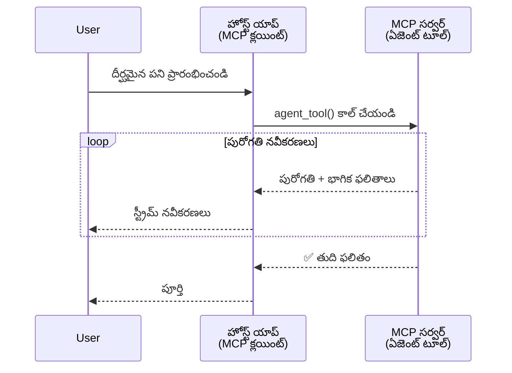
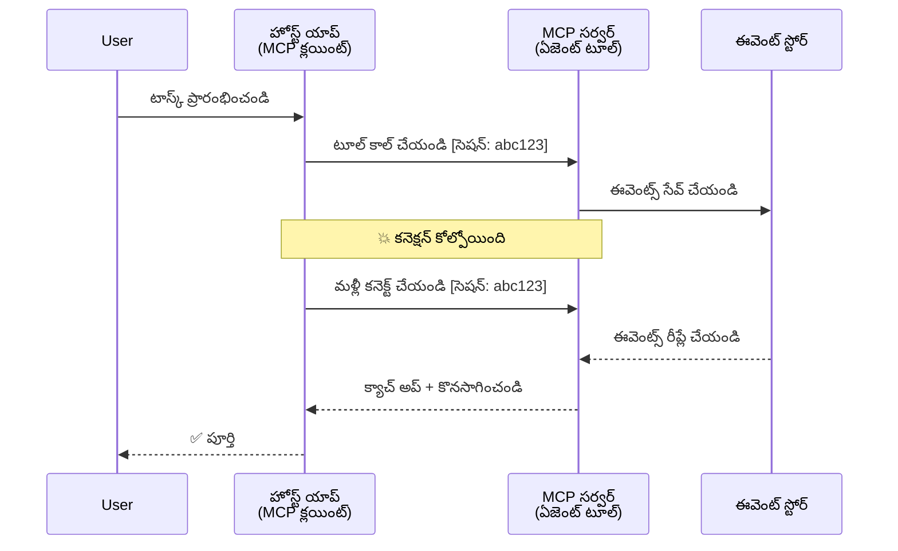
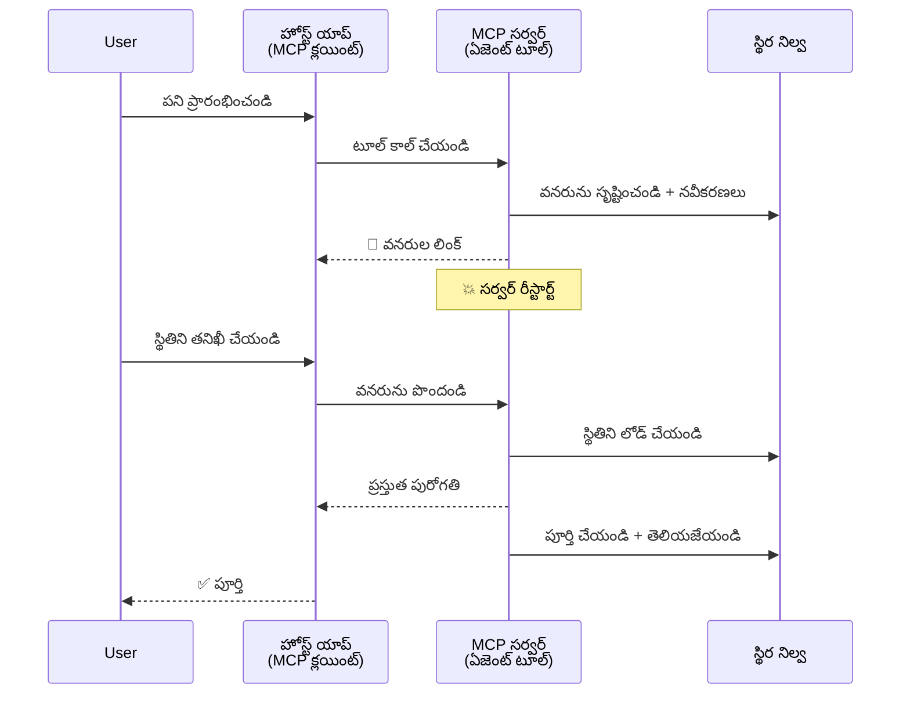
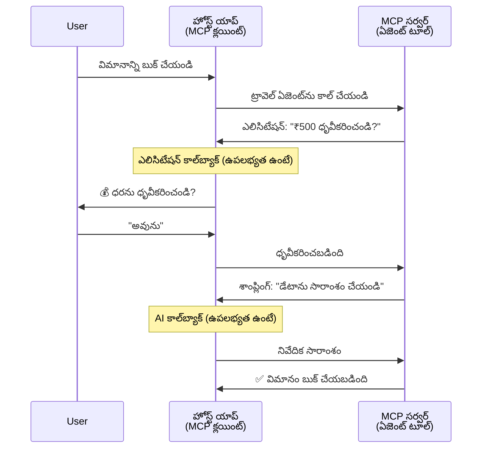

<!--
CO_OP_TRANSLATOR_METADATA:
{
  "original_hash": "5cc6836626047aa055e8960c8484a7d0",
  "translation_date": "2025-12-03T17:42:08+00:00",
  "source_file": "11-agentic-protocols/code_samples/mcp-agents/README.md",
  "language_code": "te"
}
-->
# MCP తో ఏజెంట్-టు-ఏజెంట్ కమ్యూనికేషన్ సిస్టమ్స్ నిర్మించడం

> TL;DR - మీరు MCP పై Agent2Agent కమ్యూనికేషన్ నిర్మించగలరా? అవును!

MCP తన మొదటి లక్ష్యం "LLMs కు కాంటెక్స్ట్ అందించడం" కంటే చాలా ముందుకు అభివృద్ధి చెందింది. [రీస్యూమబుల్ స్ట్రీమ్స్](https://modelcontextprotocol.io/docs/concepts/transports#resumability-and-redelivery), [ఎలిసిటేషన్](https://modelcontextprotocol.io/specification/2025-06-18/client/elicitation), [సాంప్లింగ్](https://modelcontextprotocol.io/specification/2025-06-18/client/sampling), మరియు నోటిఫికేషన్లు ([ప్రోగ్రెస్](https://modelcontextprotocol.io/specification/2025-06-18/basic/utilities/progress) మరియు [రిసోర్సెస్](https://modelcontextprotocol.io/specification/2025-06-18/schema#resourceupdatednotification)) వంటి తాజా మెరుగుదలలతో, MCP ఇప్పుడు క్లిష్టమైన ఏజెంట్-టు-ఏజెంట్ కమ్యూనికేషన్ సిస్టమ్స్ నిర్మించడానికి బలమైన పునాది అందిస్తుంది.

## ఏజెంట్/టూల్ అపోహ

ఏజెంటిక్ ప్రవర్తనలతో (దీర్ఘకాలం నడుస్తాయి, అమలులో మధ్యలో అదనపు ఇన్‌పుట్ అవసరం కావచ్చు, మొదలైనవి) టూల్స్‌ను అన్వేషించే డెవలపర్లు పెరుగుతున్న కొద్దీ, MCP అనర్హమైనదని భావించే సాధారణ అపోహ ఉంది, ముఖ్యంగా దాని టూల్స్ ప్రిమిటివ్ యొక్క ప్రారంభ ఉదాహరణలు సింపుల్ రిక్వెస్ట్-రెస్పాన్స్ ప్యాటర్న్స్‌పై దృష్టి పెట్టినందున.

ఈ భావన పాతది. గత కొన్ని నెలల్లో MCP స్పెసిఫికేషన్ గణనీయంగా మెరుగుపరచబడింది, దీర్ఘకాలం నడిచే ఏజెంటిక్ ప్రవర్తనను నిర్మించడానికి అవసరమైన సామర్థ్యాలను కలిగి ఉంది:

- **స్ట్రీమింగ్ & పార్టియల్ రిజల్ట్స్**: అమలులో రియల్-టైమ్ ప్రోగ్రెస్ అప్‌డేట్స్
- **రీస్యూమబిలిటీ**: డిస్కనెక్షన్ తర్వాత క్లయింట్లు మళ్లీ కనెక్ట్ అవ్వగలవు
- **డ్యూరబిలిటీ**: ఫలితాలు సర్వర్ రీస్టార్ట్‌లను తట్టుకుంటాయి (ఉదా: రిసోర్స్ లింక్‌ల ద్వారా)
- **మల్టీ-టర్న్**: అమలులో మధ్యలో ఇంటరాక్టివ్ ఇన్‌పుట్ ఎలిసిటేషన్ మరియు సాంప్లింగ్ ద్వారా

ఈ ఫీచర్లు క్లిష్టమైన ఏజెంటిక్ మరియు మల్టీ-ఏజెంట్ అప్లికేషన్లను సాధించడానికి కూర్చవచ్చు, ఇవన్నీ MCP ప్రోటోకాల్‌పై అమలు చేయబడతాయి.

సూచన కోసం, మేము ఏజెంట్‌ను MCP సర్వర్‌లో అందుబాటులో ఉన్న "టూల్"గా సూచిస్తాము. ఇది MCP క్లయింట్‌ను అమలు చేసే హోస్ట్ అప్లికేషన్ యొక్క ఉనికిని సూచిస్తుంది, ఇది MCP సర్వర్‌తో సెషన్‌ను స్థాపించి ఏజెంట్‌ను కాల్ చేయగలదు.

## MCP టూల్ "ఏజెంటిక్"గా ఉండటానికి ఏమి అవసరం?

అమలులోకి వెళ్లే ముందు, దీర్ఘకాలం నడిచే ఏజెంట్లకు మద్దతు ఇవ్వడానికి అవసరమైన మౌలిక సదుపాయాల సామర్థ్యాలను స్థాపిద్దాం.

> మేము ఏజెంట్‌ను దీర్ఘకాలం స్వతంత్రంగా పనిచేయగల, బహుళ ఇంటరాక్షన్లు లేదా రియల్-టైమ్ ఫీడ్‌బ్యాక్ ఆధారంగా సర్దుబాటు అవసరమయ్యే క్లిష్టమైన పనులను నిర్వహించగల సత్తా ఉన్న ఎంటిటీగా నిర్వచిస్తాము.

### 1. స్ట్రీమింగ్ & పార్టియల్ రిజల్ట్స్

సాంప్రదాయ రిక్వెస్ట్-రెస్పాన్స్ ప్యాటర్న్స్ దీర్ఘకాలం నడిచే పనులకు పనిచేయవు. ఏజెంట్లు అందించాలి:

- రియల్-టైమ్ ప్రోగ్రెస్ అప్‌డేట్స్
- మధ్యంతర ఫలితాలు

**MCP మద్దతు**: రిసోర్స్ అప్‌డేట్ నోటిఫికేషన్లు పార్టియల్ రిజల్ట్స్ స్ట్రీమింగ్‌ను సాధ్యం చేస్తాయి, అయితే ఇది JSON-RPC యొక్క 1:1 రిక్వెస్ట్/రెస్పాన్స్ మోడల్‌తో ఘర్షణలు నివారించడానికి జాగ్రత్తగా డిజైన్ చేయాలి.

| ఫీచర్                     | ఉపయోగం                                                                                                                                                                       | MCP మద్దతు                                                                                |
| -------------------------- | ------------------------------------------------------------------------------------------------------------------------------------------------------------------------------ | ------------------------------------------------------------------------------------------ |
| రియల్-టైమ్ ప్రోగ్రెస్ అప్‌డేట్స్ | యూజర్ కోడ్‌బేస్ మైగ్రేషన్ టాస్క్‌ను అభ్యర్థిస్తాడు. ఏజెంట్ ప్రోగ్రెస్‌ను స్ట్రీమ్ చేస్తుంది: "10% - డిపెండెన్సీలను విశ్లేషిస్తోంది... 25% - టైప్‌స్క్రిప్ట్ ఫైళ్లను మార్చుతోంది... 50% - ఇంపోర్ట్‌లను అప్‌డేట్ చేస్తోంది..."          | ✅ ప్రోగ్రెస్ నోటిఫికేషన్లు                                                                  |
| పార్టియల్ రిజల్ట్స్            | "బుక్‌ను రూపొందించండి" టాస్క్ పార్టియల్ రిజల్ట్స్‌ను స్ట్రీమ్ చేస్తుంది, ఉదా, 1) స్టోరీ ఆర్క్ అవుట్‌లైన్, 2) చాప్టర్ లిస్ట్, 3) పూర్తయిన ప్రతి చాప్టర్. హోస్ట్ తనిఖీ చేయవచ్చు, రద్దు చేయవచ్చు లేదా ఏ దశలోనైనా మళ్లించవచ్చు. | ✅ నోటిఫికేషన్లు "పార్టియల్ రిజల్ట్స్"ను కలిగి ఉండేలా "విస్తరించబడవచ్చు" PR 383, 776 ప్రతిపాదనలను చూడండి |

<div align="center" style="font-style: italic; font-size: 0.95em; margin-bottom: 0.5em;">
<strong>ఫిగర్ 1:</strong> ఈ డయాగ్రామ్ MCP ఏజెంట్ రియల్-టైమ్ ప్రోగ్రెస్ అప్‌డేట్స్ మరియు పార్టియల్ రిజల్ట్స్‌ను హోస్ట్ అప్లికేషన్‌కు స్ట్రీమ్ చేస్తూ, యూజర్‌ను అమలులో రియల్ టైమ్‌లో పర్యవేక్షించడానికి ఎలా అనుమతిస్తుందో చూపిస్తుంది.
</div>


### 2. రీస్యూమబిలిటీ

ఏజెంట్లు నెట్‌వర్క్ అంతరాయాలను సులభంగా నిర్వహించగలవు:

- (క్లయింట్) డిస్కనెక్షన్ తర్వాత మళ్లీ కనెక్ట్ అవ్వండి
- వారు ఆగిన చోట నుండి కొనసాగించండి (మెసేజ్ రీడెలివరీ)

**MCP మద్దతు**: MCP StreamableHTTP ట్రాన్స్‌పోర్ట్ నేడు సెషన్ పునరుద్ధరణ మరియు మెసేజ్ రీడెలివరీకి సెషన్ IDలు మరియు చివరి ఈవెంట్ IDలతో మద్దతు ఇస్తుంది. ఇక్కడ ముఖ్యమైన విషయం ఏమిటంటే, సర్వర్ క్లయింట్ రీకనెక్షన్‌పై ఈవెంట్ రీప్లేలను సాధించడానికి EventStoreని అమలు చేయాలి.  
ఇక్కడ ట్రాన్స్‌పోర్ట్-అగ్నోస్టిక్ రీస్యూమబుల్ స్ట్రీమ్స్‌ను అన్వేషించే కమ్యూనిటీ ప్రతిపాదన (PR #975) ఉంది.

| ఫీచర్      | ఉపయోగం                                                                                                                                                   | MCP మద్దతు                                                                |
| ------------ | ---------------------------------------------------------------------------------------------------------------------------------------------------------- | -------------------------------------------------------------------------- |
| రీస్యూమబిలిటీ | క్లయింట్ దీర్ఘకాలం నడిచే టాస్క్ సమయంలో డిస్కనెక్ట్ అవుతుంది. మళ్లీ కనెక్ట్ అయినప్పుడు, సెషన్ మిస్ అయిన ఈవెంట్‌లతో పునరుద్ధరించబడుతుంది, ఎక్కడ ఆగిందో అక్కడి నుండి నిరంతరంగా కొనసాగుతుంది. | ✅ StreamableHTTP ట్రాన్స్‌పోర్ట్ సెషన్ IDలు, ఈవెంట్ రీప్లే, మరియు EventStoreతో |

<div align="center" style="font-style: italic; font-size: 0.95em; margin-bottom: 0.5em;">
<strong>ఫిగర్ 2:</strong> ఈ డయాగ్రామ్ MCP యొక్క StreamableHTTP ట్రాన్స్‌పోర్ట్ మరియు ఈవెంట్ స్టోర్ ఎలా నిరంతర సెషన్ పునరుద్ధరణను సాధ్యం చేస్తాయో చూపిస్తుంది: క్లయింట్ డిస్కనెక్ట్ అయితే, అది మళ్లీ కనెక్ట్ అవ్వగలదు మరియు మిస్ అయిన ఈవెంట్‌లను రీప్లే చేయగలదు, టాస్క్‌ను ప్రోగ్రెస్ నష్టంలేకుండా కొనసాగిస్తుంది.
</div>


### 3. డ్యూరబిలిటీ

దీర్ఘకాలం నడిచే ఏజెంట్లకు స్థిరమైన స్థితి అవసరం:

- ఫలితాలు సర్వర్ రీస్టార్ట్‌లను తట్టుకుంటాయి
- స్టేటస్‌ను అవుట్-ఆఫ్-బ్యాండ్‌గా రీట్రీవ్ చేయవచ్చు
- సెషన్‌లలో ప్రోగ్రెస్ ట్రాకింగ్

**MCP మద్దతు**: MCP ఇప్పుడు టూల్ కాల్స్ కోసం రిసోర్స్ లింక్ రిటర్న్ టైప్‌కు మద్దతు ఇస్తుంది. నేడు, సాధ్యమైన ప్యాటర్న్ ఒక రిసోర్స్‌ను సృష్టించే టూల్‌ను డిజైన్ చేయడం మరియు వెంటనే రిసోర్స్ లింక్‌ను రిటర్న్ చేయడం. టూల్ బ్యాక్‌గ్రౌండ్‌లో టాస్క్‌ను కొనసాగించగలదు మరియు రిసోర్స్‌ను అప్‌డేట్ చేయగలదు. దానికి బదులుగా, క్లయింట్ ఈ రిసోర్స్ యొక్క స్థితిని పాక్షిక లేదా పూర్తి ఫలితాలను పొందడానికి (సర్వర్ అందించే రిసోర్స్ అప్‌డేట్‌ల ఆధారంగా) లేదా అప్‌డేట్ నోటిఫికేషన్ల కోసం రిసోర్స్‌కు సబ్‌స్క్రైబ్ చేయవచ్చు.

ఇక్కడ ఒక పరిమితి ఏమిటంటే, రిసోర్స్‌లను పోలింగ్ చేయడం లేదా అప్‌డేట్‌ల కోసం సబ్‌స్క్రైబ్ చేయడం స్కేల్‌లో ప్రభావాలతో వనరులను వినియోగించగలదు. క్లయింట్/హోస్ట్ అప్లికేషన్‌కు అప్‌డేట్‌లను తెలియజేయడానికి సర్వర్ కాల్ చేయగల వెబ్‌హుక్‌లు లేదా ట్రిగ్గర్‌లను కలిగి ఉండే అవకాశాన్ని అన్వేషించే ఓపెన్ కమ్యూనిటీ ప్రతిపాదన (#992) ఉంది.

| ఫీచర్    | ఉపయోగం                                                                                                                                        | MCP మద్దతు                                                        |
| ---------- | ----------------------------------------------------------------------------------------------------------------------------------------------- | ------------------------------------------------------------------ |
| డ్యూరబిలిటీ | డేటా మైగ్రేషన్ టాస్క్ సమయంలో సర్వర్ క్రాష్ అవుతుంది. ఫలితాలు మరియు ప్రోగ్రెస్ రీస్టార్ట్‌ను తట్టుకుంటాయి, క్లయింట్ స్థితిని తనిఖీ చేయగలదు మరియు స్థిరమైన రిసోర్స్ నుండి కొనసాగించగలదు. | ✅ రిసోర్స్ లింక్‌లు స్థిరమైన నిల్వ మరియు స్థితి నోటిఫికేషన్లతో |

నేడు, సాధారణ ప్యాటర్న్ ఒక రిసోర్స్‌ను సృష్టించే టూల్‌ను డిజైన్ చేయడం మరియు వెంటనే రిసోర్స్ లింక్‌ను రిటర్న్ చేయడం. టూల్ బ్యాక్‌గ్రౌండ్‌లో టాస్క్‌ను కొనసాగించగలదు, ప్రోగ్రెస్ అప్‌డేట్‌లుగా పనిచేసే రిసోర్స్ నోటిఫికేషన్లను జారీ చేయగలదు లేదా పాక్షిక ఫలితాలను కలిగి ఉండగలదు మరియు అవసరమైనప్పుడు రిసోర్స్‌లో కంటెంట్‌ను అప్‌డేట్ చేయగలదు.

<div align="center" style="font-style: italic; font-size: 0.95em; margin-bottom: 0.5em;">
<strong>ఫిగర్ 3:</strong> ఈ డయాగ్రామ్ MCP ఏజెంట్లు స్థిరమైన రిసోర్స్‌లు మరియు స్థితి నోటిఫికేషన్లను ఉపయోగించి దీర్ఘకాలం నడిచే టాస్క్‌లు సర్వర్ రీస్టార్ట్‌లను తట్టుకునేలా ఎలా నిర్ధారిస్తాయో చూపిస్తుంది, క్లయింట్లు ప్రోగ్రెస్‌ను తనిఖీ చేయడానికి మరియు వైఫల్యాల తర్వాత కూడా ఫలితాలను పొందడానికి అనుమతిస్తుంది.
</div>


### 4. మల్టీ-టర్న్ ఇంటరాక్షన్స్

ఏజెంట్లు అమలులో మధ్యలో అదనపు ఇన్‌పుట్ అవసరం కావచ్చు:

- మానవ స్పష్టీకరణ లేదా ఆమోదం
- క్లిష్టమైన నిర్ణయాలకు AI సహాయం
- డైనమిక్ పరామితి సర్దుబాటు

**MCP మద్దతు**: సాంప్లింగ్ (AI ఇన్‌పుట్ కోసం) మరియు ఎలిసిటేషన్ (మానవ ఇన్‌పుట్ కోసం) ద్వారా పూర్తిగా మద్దతు ఉంది.

| ఫీచర్                 | ఉపయోగం                                                                                                                                     | MCP మద్దతు                                           |
| ----------------------- | -------------------------------------------------------------------------------------------------------------------------------------------- | ----------------------------------------------------- |
| మల్టీ-టర్న్ ఇంటరాక్షన్స్ | ట్రావెల్ బుకింగ్ ఏజెంట్ యూజర్ నుండి ధర నిర్ధారణను అభ్యర్థిస్తుంది, ఆపై ట్రావెల్ డేటాను సారాంశం చేయడానికి AIని అభ్యర్థిస్తుంది, బుకింగ్ లావాదేవీని పూర్తి చేయడానికి ముందు. | ✅ మానవ ఇన్‌పుట్ కోసం ఎలిసిటేషన్, AI ఇన్‌పుట్ కోసం సాంప్లింగ్ |

<div align="center" style="font-style: italic; font-size: 0.95em; margin-bottom: 0.5em;">
<strong>ఫిగర్ 4:</strong> ఈ డయాగ్రామ్ MCP ఏజెంట్లు అమలులో మధ్యలో మానవ ఇన్‌పుట్‌ను ఇంటరాక్టివ్‌గా ఎలిసిట్ చేయగలవు లేదా AI సహాయాన్ని అభ్యర్థించగలవు, నిర్ధారణలు మరియు డైనమిక్ నిర్ణయాల వంటి క్లిష్టమైన, మల్టీ-టర్న్ వర్క్‌ఫ్లోలకు మద్దతు ఇస్తుంది.
</div>


## MCP పై దీర్ఘకాలం నడిచే ఏజెంట్లను అమలు చేయడం - కోడ్ అవలోకనం

ఈ ఆర్టికల్‌లో భాగంగా, మేము [కోడ్ రిపోజిటరీ](https://github.com/victordibia/ai-tutorials/tree/main/MCP%20Agents)ని అందిస్తున్నాము, ఇది StreamableHTTP ట్రాన్స్‌పోర్ట్‌తో సెషన్ పునరుద్ధరణ మరియు మెసేజ్ రీడెలివరీ కోసం MCP Python SDKని ఉపయోగించి దీర్ఘకాలం నడిచే ఏజెంట్ల పూర్తి అమలును కలిగి ఉంటుంది. ఈ అమలు MCP సామర్థ్యాలను క్లిష్టమైన ఏజెంట్-లాగా ప్రవర్తనలను సాధించడానికి ఎలా కూర్చవచ్చో చూపిస్తుంది.

ముఖ్యంగా, మేము రెండు ప్రాథమిక ఏజెంట్ టూల్‌లతో సర్వర్‌ను అమలు చేస్తాము:

- **ట్రావెల్ ఏజెంట్** - ఎలిసిటేషన్ ద్వారా ధర నిర్ధారణతో ట్రావెల్ బుకింగ్ సేవను అనుకరిస్తుంది
- **రిసెర్చ్ ఏజెంట్** - సాంప్లింగ్ ద్వారా AI-సహాయ సారాంశాలతో పరిశోధన పనులను నిర్వహిస్తుంది

ఈ రెండు ఏజెంట్లు రియల్-టైమ్ ప్రోగ్రెస్ అప్‌డేట్స్, ఇంటరాక్టివ్ నిర్ధారణలు, మరియు పూర్తి సెషన్ పునరుద్ధరణ సామర్థ్యాలను ప్రదర్శిస్తాయి.

### ముఖ్యమైన అమలు భావనలు

ప్రతి సామర్థ్యానికి సర్వర్-సైడ్ ఏజెంట్ అమలు మరియు క్లయింట్-సైడ్ హోస్ట్ హ్యాండ్లింగ్‌ను చూపించే క్రింది విభాగాలు:

#### స్ట్రీమింగ్ & ప్రోగ్రెస్ అప్‌డేట్స్ - రియల్-టైమ్ టాస్క్ స్టేటస్

స్ట్రీమింగ్ ఏజెంట్లను దీర్ఘకాలం నడిచే పనుల సమయంలో రియల్-టైమ్ ప్రోగ్రెస్ అప్‌డేట్స్ అందించడానికి అనుమతిస్తుంది, యూజర్‌లకు టాస్క్ స్థితి మరియు మధ్యంతర ఫలితాల గురించి సమాచారం అందిస్తుంది.

**సర్వర్ అమలు (ఏజెంట్ ప్రోగ్రెస్ నోటిఫికేషన్లను పంపుతుంది):**

```python
# సర్వర్/సర్వర్.py నుండి - ప్రయాణ ఏజెంట్ పురోగతి నవీకరణలను పంపడం
for i, step in enumerate(steps):
    await ctx.session.send_progress_notification(
        progress_token=ctx.request_id,
        progress=i * 25,
        total=100,
        message=step,
        related_request_id=str(ctx.request_id)
    )
    await anyio.sleep(2)  # పని అనుకరణ

# ప్రత్యామ్నాయం: వివరణాత్మక దశల వారీ నవీకరణల కోసం లాగ్ సందేశాలు
await ctx.session.send_log_message(
    level="info",
    data=f"Processing step {current_step}/{steps} ({progress_percent}%)",
    logger="long_running_agent",
    related_request_id=ctx.request_id,
)
```

**క్లయింట్ అమలు (హోస్ట్ ప్రోగ్రెస్ అప్‌డేట్స్‌ను స్వీకరిస్తుంది):**

```python
# క్లయింట్/క్లయింట్.py నుండి - రియల్-టైమ్ నోటిఫికేషన్లను నిర్వహించే క్లయింట్
async def message_handler(message) -> None:
    if isinstance(message, types.ServerNotification):
        if isinstance(message.root, types.LoggingMessageNotification):
            console.print(f"📡 [dim]{message.root.params.data}[/dim]")
        elif isinstance(message.root, types.ProgressNotification):
            progress = message.root.params
            console.print(f"🔄 [yellow]{progress.message} ({progress.progress}/{progress.total})[/yellow]")

# సెషన్ సృష్టించినప్పుడు సందేశ హ్యాండ్లర్‌ను నమోదు చేయండి
async with ClientSession(
    read_stream, write_stream,
    message_handler=message_handler
) as session:
```

#### ఎలిసిటేషన్ - యూజర్ ఇన్‌పుట్‌ను అభ్యర్థించడం

ఎలిసిటేషన్ ఏజెంట్లను అమలులో మధ్యలో యూజర్ ఇన్‌పుట్‌ను అభ్యర్థించడానికి అనుమతిస్తుంది. ఇది దీర్ఘకాలం నడిచే పనుల సమయంలో నిర్ధారణలు, స్పష్టీకరణలు, లేదా ఆమోదాలకు అవసరం.

**సర్వర్ అమలు (ఏజెంట్ నిర్ధారణను అభ్యర్థిస్తుంది):**

```python
# సర్వర్/సర్వర్.py నుండి - ప్రయాణ ఏజెంట్ ధర నిర్ధారణను అభ్యర్థిస్తున్నాడు
elicit_result = await ctx.session.elicit(
    message=f"Please confirm the estimated price of $1200 for your trip to {destination}",
    requestedSchema=PriceConfirmationSchema.model_json_schema(),
    related_request_id=ctx.request_id,
)

if elicit_result and elicit_result.action == "accept":
    # బుకింగ్‌తో కొనసాగించండి
    logger.info(f"User confirmed price: {elicit_result.content}")
elif elicit_result and elicit_result.action == "decline":
    # బుకింగ్‌ను రద్దు చేయండి
    booking_cancelled = True
```

**క్లయింట్ అమలు (హోస్ట్ ఎలిసిటేషన్ కాల్‌బ్యాక్‌ను అందిస్తుంది):**

```python
# క్లయింట్/క్లయింట్.py నుండి - క్లయింట్ నిర్వహణ అభ్యర్థనలను ప్రేరేపించడం
async def elicitation_callback(context, params):
    console.print(f"💬 Server is asking for confirmation:")
    console.print(f"   {params.message}")

    response = console.input("Do you accept? (y/n): ").strip().lower()

    if response in ['y', 'yes']:
        return types.ElicitResult(
            action="accept",
            content={"confirm": True, "notes": "Confirmed by user"}
        )
    else:
        return types.ElicitResult(
            action="decline",
            content={"confirm": False, "notes": "Declined by user"}
        )

# సెషన్ సృష్టించినప్పుడు కాల్‌బ్యాక్‌ను నమోదు చేయండి
async with ClientSession(
    read_stream, write_stream,
    elicitation_callback=elicitation_callback
) as session:
```

#### సాంప్లింగ్ - AI సహాయాన్ని అభ్యర్థించడం

సాంప్లింగ్ ఏజెంట్లను అమలులో క్లిష్టమైన నిర్ణయాలు లేదా కంటెంట్ జనరేషన్ కోసం LLM సహాయాన్ని అభ్యర్థించడానికి అనుమతిస్తుంది. ఇది హైబ్రిడ్ మానవ-AI వర్క్‌ఫ్లోలను సాధ్యం చేస్తుంది.

**సర్వర్ అమలు (ఏ
మొత్తం, MCP ప్రోటోకాల్ స్పెసిఫికేషన్ వేగంగా అభివృద్ధి చెందుతోంది; తాజా నవీకరణల కోసం పాఠకుడు అధికారిక డాక్యుమెంటేషన్ వెబ్‌సైట్‌ను సమీక్షించడానికి ప్రోత్సహించబడతారు - https://modelcontextprotocol.io/introduction

---

<!-- CO-OP TRANSLATOR DISCLAIMER START -->
**విమర్శ**:  
ఈ పత్రాన్ని AI అనువాద సేవ [Co-op Translator](https://github.com/Azure/co-op-translator) ఉపయోగించి అనువదించారు. మేము ఖచ్చితత్వానికి ప్రయత్నిస్తున్నప్పటికీ, ఆటోమేటెడ్ అనువాదాలలో తప్పులు లేదా అసమానతలు ఉండవచ్చు. దయచేసి, మూల భాషలోని అసలు పత్రాన్ని అధికారం కలిగిన మూలంగా పరిగణించండి. కీలకమైన సమాచారం కోసం, ప్రొఫెషనల్ మానవ అనువాదాన్ని సిఫారసు చేస్తాము. ఈ అనువాదాన్ని ఉపయోగించడం వల్ల కలిగే ఏవైనా అపార్థాలు లేదా తప్పుదారులు కోసం మేము బాధ్యత వహించము.
<!-- CO-OP TRANSLATOR DISCLAIMER END -->