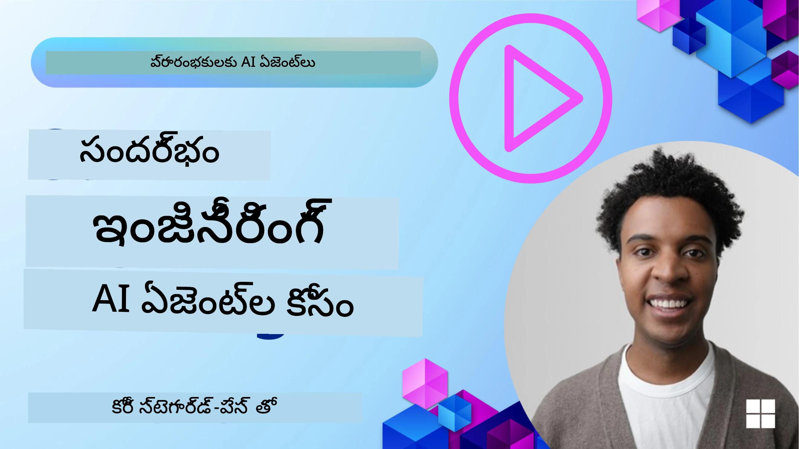
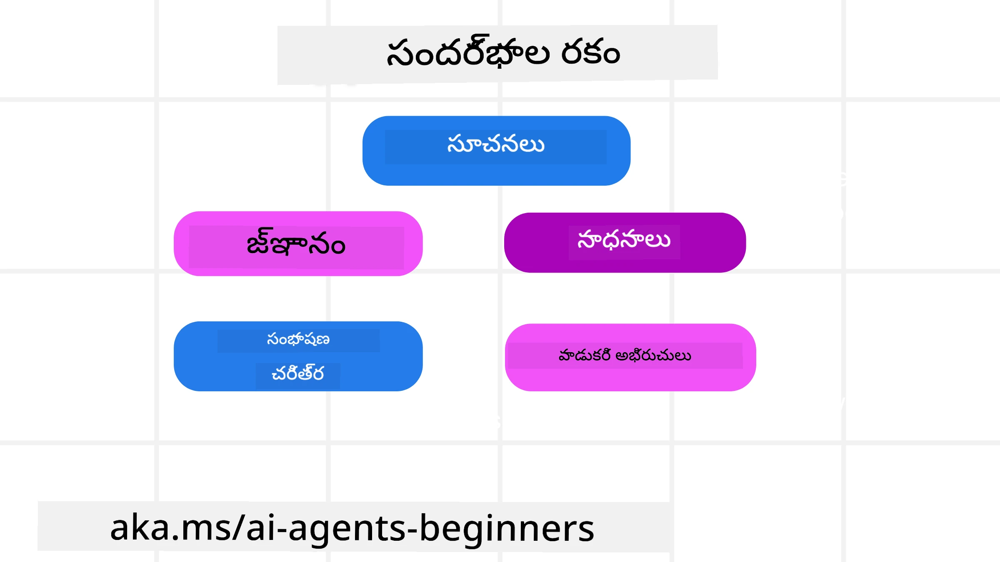
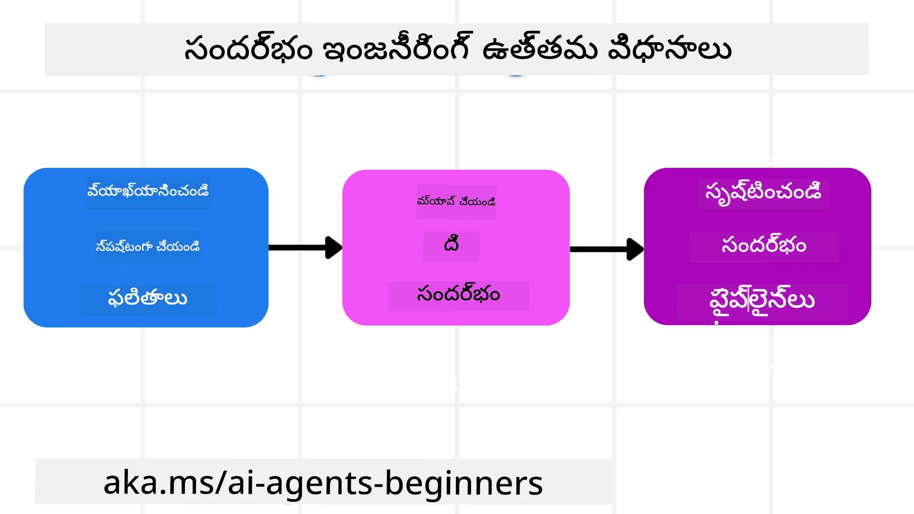

<!--
CO_OP_TRANSLATOR_METADATA:
{
  "original_hash": "cb7e50f471905ce6fdb92a30269a7a98",
  "translation_date": "2025-12-03T17:15:44+00:00",
  "source_file": "12-context-engineering/README.md",
  "language_code": "te"
}
-->
# AI ఏజెంట్ల కోసం కాంటెక్స్ట్ ఇంజినీరింగ్

> _(ఈ పాఠానికి సంబంధించిన వీడియోను చూడటానికి పై చిత్రంపై క్లిక్ చేయండి)_

మీరు AI ఏజెంట్ కోసం నిర్మిస్తున్న అప్లికేషన్ యొక్క సంక్లిష్టతను అర్థం చేసుకోవడం, విశ్వసనీయమైన ఏజెంట్‌ను రూపొందించడంలో ముఖ్యమైనది. ప్రాంప్ట్ ఇంజినీరింగ్‌ను మించి సంక్లిష్ట అవసరాలను తీర్చడానికి సమాచారాన్ని సమర్థవంతంగా నిర్వహించే AI ఏజెంట్లను మేము నిర్మించాలి.

ఈ పాఠంలో, కాంటెక్స్ట్ ఇంజినీరింగ్ అంటే ఏమిటి మరియు AI ఏజెంట్లను నిర్మించడంలో దాని పాత్ర ఏమిటి అనే విషయాలను పరిశీలిస్తాము.

## పరిచయం

ఈ పాఠం కవర్ చేస్తుంది:

• **కాంటెక్స్ట్ ఇంజినీరింగ్ అంటే ఏమిటి** మరియు ఇది ప్రాంప్ట్ ఇంజినీరింగ్‌తో ఎలా భిన్నంగా ఉంటుంది.

• **సమర్థవంతమైన కాంటెక్స్ట్ ఇంజినీరింగ్ కోసం వ్యూహాలు**, అందులో రాయడం, ఎంపిక చేయడం, కుదించడం మరియు సమాచారాన్ని వేరుచేయడం ఎలా చేయాలో.

• **సాధారణ కాంటెక్స్ట్ వైఫల్యాలు** ఇవి మీ AI ఏజెంట్‌ను తప్పుదోవ పట్టించగలవు మరియు వాటిని ఎలా పరిష్కరించాలో.

## నేర్చుకునే లక్ష్యాలు

ఈ పాఠాన్ని పూర్తి చేసిన తర్వాత, మీరు ఈ విషయాలను అర్థం చేసుకుంటారు:

• **కాంటెక్స్ట్ ఇంజినీరింగ్‌ను నిర్వచించండి** మరియు దాన్ని ప్రాంప్ట్ ఇంజినీరింగ్‌తో ఎలా భేదించాలో తెలుసుకోండి.

• **LLM అప్లికేషన్లలో కాంటెక్స్ట్ యొక్క కీలక భాగాలను గుర్తించండి.**

• **కాంటెక్స్ట్‌ను రాయడం, ఎంపిక చేయడం, కుదించడం మరియు వేరుచేయడం కోసం వ్యూహాలను అన్వయించండి** తద్వారా ఏజెంట్ పనితీరును మెరుగుపరచండి.

• **పాయిజనింగ్, డిస్ట్రాక్షన్, కన్ఫ్యూజన్ మరియు క్లాష్ వంటి సాధారణ కాంటెక్స్ట్ వైఫల్యాలను గుర్తించండి** మరియు వాటిని నివారించడానికి వ్యూహాలను అమలు చేయండి.

## కాంటెక్స్ట్ ఇంజినీరింగ్ అంటే ఏమిటి?

AI ఏజెంట్లకు, కాంటెక్స్ట్ అనేది ఏజెంట్‌ను నిర్దిష్ట చర్యలు తీసుకోవడానికి ప్రణాళిక చేయించే అంశం. కాంటెక్స్ట్ ఇంజినీరింగ్ అనేది AI ఏజెంట్‌కు తదుపరి పనిని పూర్తి చేయడానికి సరైన సమాచారం ఉందని నిర్ధారించడమే. కాంటెక్స్ట్ విండో పరిమిత పరిమాణంలో ఉంటుంది, కాబట్టి ఏజెంట్ బిల్డర్లుగా మేము కాంటెక్స్ట్ విండోలో సమాచారాన్ని జోడించడం, తొలగించడం మరియు కుదించడం నిర్వహించడానికి వ్యవస్థలు మరియు ప్రక్రియలను నిర్మించాలి.

### ప్రాంప్ట్ ఇంజినీరింగ్ vs కాంటెక్స్ట్ ఇంజినీరింగ్

ప్రాంప్ట్ ఇంజినీరింగ్ అనేది AI ఏజెంట్లను నియంత్రించడానికి ఒక స్థిరమైన నియమాల సమితిపై దృష్టి పెడుతుంది. కాంటెక్స్ట్ ఇంజినీరింగ్ అనేది డైనమిక్ సమాచార సమితిని నిర్వహించడం, ప్రారంభ ప్రాంప్ట్‌ను కూడా కలిగి ఉండటం, AI ఏజెంట్‌కు అవసరమైన సమాచారాన్ని సమయానుసారం అందించడమే. కాంటెక్స్ట్ ఇంజినీరింగ్ చుట్టూ ప్రధాన ఆలోచన ఈ ప్రక్రియను పునరావృతం చేయగలిగే మరియు విశ్వసనీయంగా చేయడమే.

### కాంటెక్స్ట్ రకాలు

కాంటెక్స్ట్ అనేది ఒకే విషయం కాదని గుర్తుంచుకోవడం ముఖ్యం. AI ఏజెంట్‌కు అవసరమైన సమాచారం వివిధ వనరుల నుండి రావచ్చు మరియు ఈ వనరులకు ఏజెంట్‌కు ప్రాప్యత ఉందని నిర్ధారించడం మన బాధ్యత.

AI ఏజెంట్ నిర్వహించవలసిన కాంటెక్స్ట్ రకాలు:

• **సూచనలు:** ఇవి ఏజెంట్ యొక్క "నియమాలు" లాంటివి – ప్రాంప్ట్‌లు, సిస్టమ్ సందేశాలు, ఫ్యూ-షాట్ ఉదాహరణలు (AIకి ఏదైనా చేయడం ఎలా అనేది చూపించడం), మరియు అది ఉపయోగించగల సాధనాల వివరణలు. ఇది ప్రాంప్ట్ ఇంజినీరింగ్ కాంటెక్స్ట్ ఇంజినీరింగ్‌తో కలిసే ప్రదేశం.

• **జ్ఞానం:** ఇది వాస్తవాలు, డేటాబేస్‌ల నుండి పొందిన సమాచారం లేదా ఏజెంట్ సేకరించిన దీర్ఘకాలిక జ్ఞాపకాలను కవర్ చేస్తుంది. ఇది RAG సిస్టమ్‌ను ఏజెంట్‌కు వివిధ జ్ఞాన నిల్వలు మరియు డేటాబేస్‌లకు ప్రాప్యత అవసరమైతే సమీకరించడాన్ని కూడా కలిగి ఉంటుంది.

• **సాధనాలు:** ఇవి బాహ్య ఫంక్షన్లు, APIలు మరియు MCP సర్వర్‌ల నిర్వచనాలు, అలాగే వాటి నుండి పొందిన ఫలితాలు.

• **సంభాషణ చరిత్ర:** వినియోగదారుడితో జరుగుతున్న సంభాషణ. కాలక్రమేణా, ఈ సంభాషణలు పొడవుగా మరియు సంక్లిష్టంగా మారుతాయి, అంటే అవి కాంటెక్స్ట్ విండోలో స్థలాన్ని ఆక్రమిస్తాయి.

• **వినియోగదారు అభిరుచులు:** వినియోగదారుడి ఇష్టాలు లేదా ఇష్టపడని విషయాల గురించి కాలక్రమేణా నేర్చుకున్న సమాచారం. ఇవి కీలక నిర్ణయాలు తీసుకునేటప్పుడు వినియోగదారుడికి సహాయపడటానికి నిల్వ చేయబడతాయి మరియు పిలవబడతాయి.

## సమర్థవంతమైన కాంటెక్స్ట్ ఇంజినీరింగ్ కోసం వ్యూహాలు

### ప్రణాళికా వ్యూహాలు

మంచి కాంటెక్స్ట్ ఇంజినీరింగ్ మంచి ప్రణాళికతో ప్రారంభమవుతుంది. కాంటెక్స్ట్ ఇంజినీరింగ్ భావనను ఎలా వర్తింపజేయాలో ఆలోచించడం ప్రారంభించడానికి ఇది ఒక దృక్పథం:

1. **స్పష్టమైన ఫలితాలను నిర్వచించండి** - AI ఏజెంట్లకు అప్పగించబడే పనుల ఫలితాలు స్పష్టంగా నిర్వచించబడాలి. ఈ ప్రశ్నకు సమాధానం ఇవ్వండి - "AI ఏజెంట్ తన పని పూర్తి చేసినప్పుడు ప్రపంచం ఎలా కనిపిస్తుంది?" అంటే, వినియోగదారుడు AI ఏజెంట్‌తో పరస్పర చర్య తర్వాత ఏ మార్పు, సమాచారం లేదా ప్రతిస్పందనను కలిగి ఉండాలి.

2. **కాంటెక్స్ట్‌ను మ్యాప్ చేయండి** - AI ఏజెంట్ యొక్క ఫలితాలను నిర్వచించిన తర్వాత, "ఈ పనిని పూర్తి చేయడానికి AI ఏజెంట్‌కు ఏ సమాచారం అవసరం?" అనే ప్రశ్నకు సమాధానం ఇవ్వాలి. ఈ విధంగా మీరు ఆ సమాచారాన్ని ఎక్కడ పొందవచ్చో కాంటెక్స్ట్‌ను మ్యాప్ చేయడం ప్రారంభించవచ్చు.

3. **కాంటెక్స్ట్ పైప్‌లైన్‌లను సృష్టించండి** - ఇప్పుడు మీరు ఆ సమాచారం ఎక్కడ ఉందో తెలుసుకున్న తర్వాత, "ఏజెంట్ ఈ సమాచారాన్ని ఎలా పొందుతుంది?" అనే ప్రశ్నకు సమాధానం ఇవ్వాలి. ఇది RAG, MCP సర్వర్‌ల వినియోగం మరియు ఇతర సాధనాల ద్వారా చేయవచ్చు.

### ప్రాక్టికల్ వ్యూహాలు

ప్రణాళిక ముఖ్యం కానీ ఒకసారి సమాచారం మా ఏజెంట్ యొక్క కాంటెక్స్ట్ విండోలో ప్రవహించడం ప్రారంభించిన తర్వాత, దాన్ని నిర్వహించడానికి ప్రాక్టికల్ వ్యూహాలు అవసరం:

#### కాంటెక్స్ట్ నిర్వహణ

కొన్ని సమాచారం కాంటెక్స్ట్ విండోలో ఆటోమేటిక్‌గా జోడించబడుతుంది, కానీ కాంటెక్స్ట్ ఇంజినీరింగ్ అనేది ఈ సమాచారాన్ని మరింత చురుకైన పాత్రలో నిర్వహించడం, ఇది కొన్ని వ్యూహాల ద్వారా చేయవచ్చు:

1. **ఏజెంట్ స్క్రాచ్‌ప్యాడ్**  
ఏజెంట్ ప్రస్తుత పనులు మరియు వినియోగదారుల పరస్పర చర్యల గురించి సంబంధిత సమాచారాన్ని ఒక సెషన్‌లో నోట్స్ తీసుకోవడానికి ఇది అనుమతిస్తుంది. ఇది కాంటెక్స్ట్ విండో వెలుపల ఫైల్ లేదా రన్‌టైమ్ ఆబ్జెక్ట్‌లో ఉండాలి, తద్వారా అవసరమైతే ఏజెంట్ దాన్ని తిరిగి పొందగలదు.

2. **జ్ఞాపకాలు**  
స్క్రాచ్‌ప్యాడ్‌లు ఒకే సెషన్ కాంటెక్స్ట్ విండో వెలుపల సమాచారాన్ని నిర్వహించడానికి మంచివి. జ్ఞాపకాలు ఏజెంట్లకు బహుళ సెషన్‌లలో సంబంధిత సమాచారాన్ని నిల్వ చేయడానికి మరియు తిరిగి పొందడానికి వీలు కల్పిస్తాయి. ఇందులో సారాంశాలు, వినియోగదారు అభిరుచులు మరియు భవిష్యత్తులో మెరుగుదలల కోసం అభిప్రాయాలు ఉండవచ్చు.

3. **కాంటెక్స్ట్‌ను కుదించడం**  
కాంటెక్స్ట్ విండో పెరిగి దాని పరిమితికి చేరుకున్నప్పుడు, సారాంశం మరియు ట్రిమ్మింగ్ వంటి పద్ధతులను ఉపయోగించవచ్చు. ఇందులో అత్యంత సంబంధిత సమాచారాన్ని మాత్రమే ఉంచడం లేదా పాత సందేశాలను తొలగించడం ఉంటుంది.

4. **మల్టీ-ఏజెంట్ సిస్టమ్‌లు**  
మల్టీ-ఏజెంట్ సిస్టమ్‌ను అభివృద్ధి చేయడం కూడా కాంటెక్స్ట్ ఇంజినీరింగ్‌లో భాగమే, ఎందుకంటే ప్రతి ఏజెంట్‌కు తన స్వంత కాంటెక్స్ట్ విండో ఉంటుంది. ఈ కాంటెక్స్ట్‌ను ఎలా పంచుకోవాలి మరియు వివిధ ఏజెంట్లకు ఎలా పంపించాలి అనేది ఈ వ్యవస్థలను నిర్మించేటప్పుడు ప్రణాళిక చేయవలసిన మరో విషయం.

5. **సాండ్‌బాక్స్ ఎన్విరాన్‌మెంట్‌లు**  
ఏజెంట్ కొంత కోడ్‌ను నడపడం లేదా డాక్యుమెంట్‌లో పెద్ద మొత్తంలో సమాచారాన్ని ప్రాసెస్ చేయడం అవసరమైతే, ఫలితాలను ప్రాసెస్ చేయడానికి ఇది పెద్ద మొత్తంలో టోకెన్లను తీసుకుంటుంది. ఇది మొత్తం కాంటెక్స్ట్ విండోలో నిల్వ చేయబడకుండా, ఏజెంట్ ఈ కోడ్‌ను నడపగల సాండ్‌బాక్స్ ఎన్విరాన్‌మెంట్‌ను ఉపయోగించవచ్చు మరియు ఫలితాలు మరియు ఇతర సంబంధిత సమాచారాన్ని మాత్రమే చదవగలదు.

6. **రన్‌టైమ్ స్టేట్ ఆబ్జెక్ట్‌లు**  
ఏజెంట్‌కు నిర్దిష్ట సమాచారానికి ప్రాప్యత అవసరమైనప్పుడు పరిస్థితులను నిర్వహించడానికి సమాచార కంటైనర్‌లను సృష్టించడం ద్వారా ఇది చేయబడుతుంది. సంక్లిష్టమైన పనికి, ఇది ఏజెంట్‌కు ప్రతి ఉపపని యొక్క ఫలితాలను దశలవారీగా నిల్వ చేయడానికి వీలు కల్పిస్తుంది, కాంటెక్స్ట్‌ను ఆ నిర్దిష్ట ఉపపనికి మాత్రమే అనుసంధానంగా ఉంచుతుంది.

### కాంటెక్స్ట్ ఇంజినీరింగ్ ఉదాహరణ

ఒక AI ఏజెంట్‌ను **"నాకు పారిస్‌కు ట్రిప్ బుక్ చేయండి."** అని అడుగుతున్నామని అనుకుందాం.

• కేవలం ప్రాంప్ట్ ఇంజినీరింగ్‌ను ఉపయోగించే సింపుల్ ఏజెంట్ ఇలా స్పందించవచ్చు: **"సరే, మీరు ఎప్పుడు పారిస్‌కు వెళ్లాలని అనుకుంటున్నారు?"**. ఇది వినియోగదారు అడిగిన సమయంలో మీ నేరుగా అడిగిన ప్రశ్నను మాత్రమే ప్రాసెస్ చేసింది.

• కాంటెక్స్ట్ ఇంజినీరింగ్ వ్యూహాలను ఉపయోగించే ఏజెంట్ మరింత చేస్తుంది. స్పందించడానికి ముందు, దాని వ్యవస్థ ఇలా చేయవచ్చు:

  ◦ **మీ క్యాలెండర్‌ను తనిఖీ చేయండి** అందుబాటులో ఉన్న తేదీల కోసం (రియల్-టైమ్ డేటాను పొందడం).

 ◦ **గత ప్రయాణ అభిరుచులను గుర్తుంచుకోండి** (దీర్ఘకాలిక జ్ఞాపకం నుండి) మీకు ఇష్టమైన ఎయిర్‌లైన్, బడ్జెట్ లేదా మీరు డైరెక్ట్ ఫ్లైట్స్‌ను ఇష్టపడతారా అనే విషయాలను.

 ◦ **అందుబాటులో ఉన్న సాధనాలను గుర్తించండి** ఫ్లైట్ మరియు హోటల్ బుకింగ్ కోసం.

- ఆపై, ఒక ఉదాహరణ స్పందన ఇలా ఉండవచ్చు: "హే [మీ పేరు]! మీరు అక్టోబర్ మొదటి వారంలో ఖాళీగా ఉన్నారని నేను చూస్తున్నాను. [ఇష్టమైన ఎయిర్‌లైన్]లో డైరెక్ట్ ఫ్లైట్స్ కోసం మీ సాధారణ బడ్జెట్ [బడ్జెట్]లో చూడమంటారా?". ఈ సమృద్ధిగా, కాంటెక్స్ట్-అవేర్ స్పందన కాంటెక్స్ట్ ఇంజినీరింగ్ శక్తిని ప్రదర్శిస్తుంది.

## సాధారణ కాంటెక్స్ట్ వైఫల్యాలు

### కాంటెక్స్ట్ పాయిజనింగ్

**ఇది ఏమిటి:** LLM ద్వారా ఉత్పత్తి చేయబడిన తప్పుడు సమాచారం లేదా లోపం కాంటెక్స్ట్‌లోకి ప్రవేశించి, ఏజెంట్ అసాధ్యమైన లక్ష్యాలను అనుసరించడానికి లేదా అర్థంలేని వ్యూహాలను అభివృద్ధి చేయడానికి కారణమవుతుంది.

**ఏం చేయాలి:** **కాంటెక్స్ట్ ధృవీకరణ** మరియు **క్వారంటైన్** అమలు చేయండి. దీర్ఘకాలిక జ్ఞాపకంలోకి జోడించబడే సమాచారాన్ని ధృవీకరించండి. పాయిజనింగ్ సంభావ్యతను గుర్తిస్తే, చెడు సమాచారం వ్యాప్తి చెందకుండా కొత్త కాంటెక్స్ట్ థ్రెడ్‌లను ప్రారంభించండి.

**ప్రయాణ బుకింగ్ ఉదాహరణ:** మీ ఏజెంట్ ఒక **చిన్న స్థానిక విమానాశ్రయం నుండి దూరమైన అంతర్జాతీయ నగరానికి డైరెక్ట్ ఫ్లైట్** ఉందని హల్యూసినేట్ చేస్తుంది, కానీ ఆ విమానాశ్రయం అంతర్జాతీయ విమానాలను అందించదు. ఈ లేనిపోని విమాన వివరాలు కాంటెక్స్ట్‌లో సేవ్ చేయబడతాయి. తరువాత, మీరు ఏజెంట్‌ను బుక్ చేయమని అడిగినప్పుడు, ఇది ఈ అసాధ్యమైన మార్గానికి టిక్కెట్లను కనుగొనడానికి ప్రయత్నిస్తూనే ఉంటుంది, పునరావృతమైన లోపాలకు దారితీస్తుంది.

**పరిష్కారం:** విమానాల ఉనికి మరియు మార్గాలను **రియల్-టైమ్ API**తో ధృవీకరించే దశను అమలు చేయండి _ముందు_ విమాన వివరాలను ఏజెంట్ వర్కింగ్ కాంటెక్స్ట్‌లో జోడించడానికి. ధృవీకరణ విఫలమైతే, తప్పు సమాచారం "క్వారంటైన్" చేయబడుతుంది మరియు ఇకపై ఉపయోగించబడదు.

### కాంటెక్స్ట్ డిస్ట్రాక్షన్

**ఇది ఏమిటి:** కాంటెక్స్ట్ చాలా పెద్దదిగా మారినప్పుడు, మోడల్ శిక్షణ సమయంలో నేర్చుకున్నదానిని ఉపయోగించడానికి బదులుగా సేకరించిన చరిత్రపై ఎక్కువగా దృష్టి పెడుతుంది, ఇది పునరావృతమైన లేదా ఉపయోగించలేని చర్యలకు దారితీస్తుంది. కాంటెక్స్ట్ విండో పూర్తవ్వకముందే మోడల్ తప్పులు చేయడం ప్రారంభించవచ్చు.

**ఏం చేయాలి:** **కాంటెక్స్ట్ సారాంశం** ఉపయోగించండి. సేకరించిన సమాచారాన్ని పునరావృత చరిత్రను తొలగించి ముఖ్యమైన వివరాలను ఉంచుతూ చిన్న సారాంశాలలోకి పునరావృతంగా కుదించండి. ఇది "ఫోకస్‌ను రీసెట్" చేయడంలో సహాయపడుతుంది.

**ప్రయాణ బుకింగ్ ఉదాహరణ:** మీరు వివిధ కలల ప్రయాణ గమ్యస్థానాల గురించి చాలా కాలంగా చర్చిస్తున్నారు, అందులో రెండు సంవత్సరాల క్రితం మీ బ్యాక్‌ప్యాకింగ్ ట్రిప్ యొక్క వివరమైన వివరాలు ఉన్నాయి. మీరు చివరికి **"నాకు వచ్చే నెలకు చౌకైన విమానాన్ని కనుగొనండి"** అని అడిగినప్పుడు, ఏజెంట్ పాత, సంబంధం లేని వివరాల్లో చిక్కుకుపోతుంది మరియు మీ బ్యాక్‌ప్యాకింగ్ గేర్ లేదా గత ప్రయాణాల గురించి అడుగుతూనే ఉంటుంది, మీ ప్రస్తుత అభ్యర్థనను నిర్లక్ష్యం చేస్తుంది.

**పరిష్కారం:** కొన్ని టర్న్‌ల తర్వాత లేదా కాంటెక్స్ట్ చాలా పెద్దదిగా పెరిగినప్పుడు, ఏజెంట్ **సంభాషణ యొక్క అత్యంత తాజా మరియు సంబంధిత భాగాలను సారాంశం చేయాలి** – మీ ప్రస్తుత ప్రయాణ తేదీలు మరియు గమ్యస్థానంపై దృష్టి పెట్టాలి – మరియు తదుపరి LLM కాల్ కోసం ఆ కుదించిన సారాంశాన్ని ఉపయోగించాలి, తక్కువ సంబంధిత చారిత్రక చాట్‌ను విస్మరించాలి.

### కాంటెక్స్ట్ కన్ఫ్యూజన్

**ఇది ఏమిటి:** అవసరంలేని కాంటెక్స్ట్, తరచుగా చాలా ఎక్కువ సాధనాలు అందుబాటులో ఉండటం, మోడల్ చెడు ప్రతిస్పందనలను ఉత్పత్తి చేయడానికి లేదా సంబంధం లేని సాధనాలను పిలవడానికి కారణమవుతుంది. చిన్న మోడల్‌లు దీనికి ప్రత్యేక

---

<!-- CO-OP TRANSLATOR DISCLAIMER START -->
**విమర్శ**:  
ఈ పత్రాన్ని AI అనువాద సేవ [Co-op Translator](https://github.com/Azure/co-op-translator) ఉపయోగించి అనువదించారు. మేము ఖచ్చితత్వానికి ప్రయత్నిస్తున్నప్పటికీ, ఆటోమేటెడ్ అనువాదాలలో తప్పులు లేదా అసమానతలు ఉండవచ్చు. దయచేసి, మూల భాషలోని అసలు పత్రాన్ని అధికారం కలిగిన మూలంగా పరిగణించండి. కీలకమైన సమాచారం కోసం, ప్రొఫెషనల్ మానవ అనువాదాన్ని సిఫారసు చేస్తాము. ఈ అనువాదాన్ని ఉపయోగించడం వల్ల కలిగే ఏవైనా అపార్థాలు లేదా తప్పుదారులు కోసం మేము బాధ్యత వహించము.
<!-- CO-OP TRANSLATOR DISCLAIMER END -->