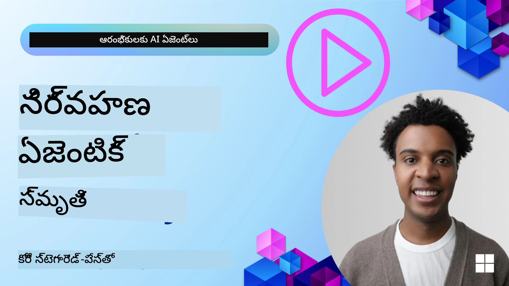

<!--
CO_OP_TRANSLATOR_METADATA:
{
  "original_hash": "a1d90991499ad697c4ad24decaf36968",
  "translation_date": "2025-12-09T13:06:05+00:00",
  "source_file": "13-agent-memory/README.md",
  "language_code": "te"
}
-->
# AI ఏజెంట్లకు మెమరీ 

AI ఏజెంట్లను రూపొందించడంలో ప్రత్యేకమైన ప్రయోజనాలను చర్చించినప్పుడు, ప్రధానంగా రెండు విషయాలు ప్రస్తావించబడతాయి: పనులను పూర్తి చేయడానికి టూల్స్‌ను పిలిచే సామర్థ్యం మరియు కాలక్రమేణా మెరుగుపడే సామర్థ్యం. మెమరీ అనేది స్వీయ-మెరుగుదల గల ఏజెంట్‌ను రూపొందించడంలో పునాది, ఇది మన వినియోగదారులకు మెరుగైన అనుభవాలను సృష్టించగలదు.

ఈ పాఠంలో, AI ఏజెంట్లకు మెమరీ అంటే ఏమిటి, దాన్ని ఎలా నిర్వహించాలి మరియు మన అప్లికేషన్లకు ఎలా ఉపయోగించుకోవాలో తెలుసుకుంటాము.

## పరిచయం

ఈ పాఠంలో మీరు నేర్చుకునే విషయాలు:

• **AI ఏజెంట్ మెమరీని అర్థం చేసుకోవడం**: మెమరీ అంటే ఏమిటి, మరియు ఏజెంట్లకు ఇది ఎందుకు అవసరం.

• **మెమరీని అమలు చేయడం మరియు నిల్వ చేయడం**: షార్ట్-టర్మ్ మరియు లాంగ్-టర్మ్ మెమరీలపై దృష్టి సారించి, మీ AI ఏజెంట్లకు మెమరీ సామర్థ్యాలను జోడించడానికి ప్రాక్టికల్ పద్ధతులు.

• **AI ఏజెంట్లను స్వీయ-మెరుగుదల గలవిగా మార్చడం**: గత పరస్పర చర్యల నుండి నేర్చుకోవడం మరియు కాలక్రమేణా మెరుగుపడటానికి మెమరీ ఎలా సహాయపడుతుంది.

## అందుబాటులో ఉన్న అమలు పద్ధతులు

ఈ పాఠంలో రెండు సమగ్ర నోట్‌బుక్ ట్యుటోరియల్స్ ఉన్నాయి:

• **[13-agent-memory.ipynb](./13-agent-memory.ipynb)**: మెమరీని Mem0 మరియు Azure AI Searchతో Semantic Kernel ఫ్రేమ్‌వర్క్ ఉపయోగించి అమలు చేస్తుంది.

• **[13-agent-memory-cognee.ipynb](./13-agent-memory-cognee.ipynb)**: Cognee ఉపయోగించి నిర్మిత మెమరీని అమలు చేస్తుంది, ఇది ఎంబెడ్డింగ్స్‌తో మద్దతు ఉన్న నాలెడ్జ్ గ్రాఫ్‌ను ఆటోమేటిక్‌గా నిర్మించడం, గ్రాఫ్‌ను విజువలైజ్ చేయడం, మరియు తెలివైన రిట్రీవల్.

## నేర్చుకునే లక్ష్యాలు

ఈ పాఠం పూర్తయ్యాక, మీరు తెలుసుకుంటారు:

• **AI ఏజెంట్ మెమరీ వివిధ రకాల మధ్య తేడాలను గుర్తించడం**, వర్కింగ్, షార్ట్-టర్మ్, లాంగ్-టర్మ్ మెమరీలతో పాటు పర్సోనా మరియు ఎపిసోడిక్ మెమరీ వంటి ప్రత్యేక రూపాలను.

• **Semantic Kernel ఫ్రేమ్‌వర్క్ ఉపయోగించి షార్ట్-టర్మ్ మరియు లాంగ్-టర్మ్ మెమరీని అమలు చేయడం మరియు నిర్వహించడం**, Mem0, Cognee, Whiteboard మెమరీ వంటి టూల్స్‌ను ఉపయోగించడం, మరియు Azure AI Searchతో ఇంటిగ్రేట్ చేయడం.

• **స్వీయ-మెరుగుదల గల AI ఏజెంట్ల వెనుక ఉన్న సూత్రాలను అర్థం చేసుకోవడం** మరియు నిరంతర అభ్యాసం మరియు అనుకూలతకు మెరుగైన మెమరీ నిర్వహణ వ్యవస్థలు ఎలా సహాయపడతాయో తెలుసుకోవడం.

## AI ఏజెంట్ మెమరీని అర్థం చేసుకోవడం

ప్రధానంగా, **AI ఏజెంట్లకు మెమరీ అంటే వారు సమాచారాన్ని నిల్వ చేయడం మరియు గుర్తు చేసుకోవడం సాధ్యమయ్యే విధానాలు**. ఈ సమాచారం సంభాషణలోని ప్రత్యేక వివరాలు, వినియోగదారుల అభిరుచులు, గత చర్యలు లేదా నేర్చుకున్న నమూనాలు కావచ్చు.

మెమరీ లేకుండా, AI అప్లికేషన్లు తరచుగా స్టేట్‌లెస్‌గా ఉంటాయి, అంటే ప్రతి పరస్పర చర్య కొత్తగా ప్రారంభమవుతుంది. ఇది ఏజెంట్ గత కాంటెక్స్ట్ లేదా అభిరుచులను "మర్చిపోతుంది" అనే పునరావృత మరియు నిరుత్సాహకరమైన వినియోగదారు అనుభవానికి దారితీస్తుంది.

### మెమరీ ఎందుకు ముఖ్యమైనది?

ఏజెంట్ యొక్క మేధస్సు గత సమాచారాన్ని గుర్తు చేసుకోవడం మరియు ఉపయోగించడం సామర్థ్యంతో బలంగా అనుసంధానించబడి ఉంటుంది. మెమరీ ఏజెంట్లను ఈ విధంగా మారుస్తుంది:

• **రిఫ్లెక్టివ్**: గత చర్యలు మరియు ఫలితాల నుండి నేర్చుకోవడం.

• **ఇంటరాక్టివ్**: కొనసాగుతున్న సంభాషణలో కాంటెక్స్ట్‌ను నిర్వహించడం.

• **ప్రోయాక్టివ్ మరియు రియాక్టివ్**: చరిత్రాత్మక డేటా ఆధారంగా అవసరాలను ముందుగా ఊహించడం లేదా తగిన విధంగా స్పందించడం.

• **ఆటోనమస్**: నిల్వ చేసిన జ్ఞానాన్ని ఉపయోగించి మరింత స్వతంత్రంగా పనిచేయడం.

మెమరీని అమలు చేయడం లక్ష్యం ఏజెంట్లను మరింత **నమ్మదగిన మరియు సామర్థ్యవంతమైనవిగా** చేయడం.

### మెమరీ రకాలు

#### వర్కింగ్ మెమరీ

ఇది ఏజెంట్ ఒకే పనిని లేదా ఆలోచన ప్రక్రియను కొనసాగించేటప్పుడు ఉపయోగించే తాత్కాలిక సమాచారం. ఇది తదుపరి దశను లెక్కించడానికి అవసరమైన తక్షణ సమాచారాన్ని కలిగి ఉంటుంది.

AI ఏజెంట్లకు, వర్కింగ్ మెమరీ తరచుగా ఒక పెద్ద చాట్ చరిత్ర నుండి అత్యంత సంబంధిత సమాచారాన్ని అందిస్తుంది. ఇది అవసరాలు, ప్రతిపాదనలు, నిర్ణయాలు, మరియు చర్యల వంటి కీలక అంశాలను తీసుకుంటుంది.

**వర్కింగ్ మెమరీ ఉదాహరణ**

ఒక ట్రావెల్ బుకింగ్ ఏజెంట్‌లో, వర్కింగ్ మెమరీ వినియోగదారుడి ప్రస్తుత అభ్యర్థనను, ఉదాహరణకు "నాకు పారిస్‌కు ట్రిప్ బుక్ చేయాలి" అని గుర్తుంచుకుంటుంది. ఈ ప్రత్యేక అవసరం ప్రస్తుత పరస్పర చర్యను మార్గనిర్దేశం చేయడానికి ఏజెంట్ యొక్క తక్షణ కాంటెక్స్ట్‌లో ఉంటుంది.

#### షార్ట్ టర్మ్ మెమరీ

ఈ రకమైన మెమరీ ఒకే సంభాషణ లేదా సెషన్ వ్యవధి కోసం సమాచారాన్ని నిల్వ చేస్తుంది. ఇది ప్రస్తుత చాట్ యొక్క కాంటెక్స్ట్, ఏజెంట్ డైలాగ్‌లోని గత టర్న్‌లను సూచించడానికి అనుమతిస్తుంది.

**షార్ట్ టర్మ్ మెమరీ ఉదాహరణ**

ఒక వినియోగదారు "పారిస్‌కు ఫ్లైట్ ఖర్చు ఎంత?" అని అడిగి, ఆపై "అక్కడ వసతి గురించి ఏమిటి?" అని అడిగితే, షార్ట్ టర్మ్ మెమరీ "అక్కడ" అంటే "పారిస్" అని తెలుసుకుంటుంది.

#### లాంగ్ టర్మ్ మెమరీ

ఇది అనేక సంభాషణలు లేదా సెషన్‌లలో కొనసాగే సమాచారం. ఇది వినియోగదారుల అభిరుచులు, చారిత్రక పరస్పర చర్యలు లేదా సాధారణ జ్ఞానాన్ని దీర్ఘకాలం పాటు గుర్తుంచుకోవడానికి ఏజెంట్లకు అనుమతిస్తుంది. ఇది వ్యక్తిగతీకరణకు ముఖ్యమైనది.

**లాంగ్ టర్మ్ మెమరీ ఉదాహరణ**

లాంగ్ టర్మ్ మెమరీ "బెన్ స్కీయింగ్ మరియు అవుట్‌డోర్ యాక్టివిటీస్‌ను ఇష్టపడతాడు, మౌంటైన్ వ్యూ ఉన్న కాఫీని ఇష్టపడతాడు, మరియు గత గాయం కారణంగా అడ్వాన్స్‌డ్ స్కీ స్లోప్స్‌ను నివారించాలనుకుంటున్నాడు" అనే సమాచారాన్ని నిల్వ చేస్తుంది. గత పరస్పర చర్యల నుండి నేర్చుకున్న ఈ సమాచారం భవిష్యత్తు ట్రావెల్ ప్లానింగ్ సెషన్‌లలో సిఫార్సులను అత్యంత వ్యక్తిగతీకరించడానికి ప్రభావితం చేస్తుంది.

#### పర్సోనా మెమరీ

ఈ ప్రత్యేకమైన మెమరీ రకం ఏజెంట్ ఒక స్థిరమైన "వ్యక్తిత్వం" లేదా "పర్సోనా"ని అభివృద్ధి చేయడంలో సహాయపడుతుంది. ఇది ఏజెంట్ తన గురించి లేదా తన ఉద్దేశించిన పాత్ర గురించి వివరాలను గుర్తుంచుకోవడానికి అనుమతిస్తుంది, తద్వారా పరస్పర చర్యలు మరింత సులభంగా మరియు కేంద్రీకృతంగా ఉంటాయి.

**పర్సోనా మెమరీ ఉదాహరణ**

ఒక ట్రావెల్ ఏజెంట్ "ఎక్స్‌పర్ట్ స్కీ ప్లానర్"గా రూపొందించబడితే, పర్సోనా మెమరీ ఈ పాత్రను బలపరుస్తుంది, మరియు ఇది ఒక నిపుణుడి టోన్ మరియు జ్ఞానంతో సమాధానాలను ప్రభావితం చేస్తుంది.

#### వర్క్‌ఫ్లో/ఎపిసోడిక్ మెమరీ

ఈ మెమరీ ఏజెంట్ ఒక సంక్లిష్టమైన పనిని నిర్వహించే సమయంలో తీసుకున్న చర్యల క్రమాన్ని, విజయాలు మరియు వైఫల్యాలను నిల్వ చేస్తుంది. ఇది గత "ఎపిసోడ్స్" లేదా అనుభవాలను గుర్తుంచుకోవడం ద్వారా నేర్చుకోవడంలా ఉంటుంది.

**ఎపిసోడిక్ మెమరీ ఉదాహరణ**

ఏజెంట్ ఒక ప్రత్యేకమైన ఫ్లైట్‌ను బుక్ చేయడానికి ప్రయత్నించి, అది అందుబాటులో లేకపోవడం వల్ల విఫలమైతే, ఎపిసోడిక్ మెమరీ ఈ వైఫల్యాన్ని రికార్డ్ చేస్తుంది, తద్వారా ఏజెంట్ ప్రత్యామ్నాయ ఫ్లైట్‌లను ప్రయత్నించగలదు లేదా తదుపరి ప్రయత్నంలో వినియోగదారుడికి సమస్య గురించి మరింత సమాచారం ఇవ్వగలదు.

#### ఎంటిటీ మెమరీ

ఇది సంభాషణల నుండి వ్యక్తులు, ప్రదేశాలు లేదా వస్తువులు వంటి ప్రత్యేకమైన ఎంటిటీలు మరియు ఈవెంట్‌లను గుర్తించి, గుర్తుంచుకోవడాన్ని కలిగి ఉంటుంది. ఇది చర్చించిన కీలక అంశాల యొక్క నిర్మితమైన అవగాహనను ఏజెంట్‌కు అందిస్తుంది.

**ఎంటిటీ మెమరీ ఉదాహరణ**

ఒక గత ట్రిప్ గురించి సంభాషణ నుండి, ఏజెంట్ "పారిస్," "ఎఫిల్ టవర్," మరియు "Le Chat Noir రెస్టారెంట్‌లో డిన్నర్" వంటి ఎంటిటీలను గుర్తించవచ్చు. భవిష్యత్తు పరస్పర చర్యలో, ఏజెంట్ "Le Chat Noir"ని గుర్తుంచుకుని, అక్కడ కొత్త రిజర్వేషన్ చేయడానికి ఆఫర్ చేయవచ్చు.

#### స్ట్రక్చర్డ్ RAG (రిట్రీవల్ ఆగ్మెంటెడ్ జనరేషన్)

RAG ఒక విస్తృతమైన సాంకేతికత అయినప్పటికీ, "స్ట్రక్చర్డ్ RAG" ఒక శక్తివంతమైన మెమరీ టెక్నాలజీగా హైలైట్ చేయబడింది. ఇది వివిధ మూలాల నుండి (సంభాషణలు, ఇమెయిల్స్, ఇమేజ్‌లు) సాంద్ర, నిర్మిత సమాచారాన్ని తీసుకుని, ప్రతిస్పందనలలో ఖచ్చితత్వం, రికాల్, మరియు వేగాన్ని మెరుగుపరుస్తుంది. క్లాసిక్ RAG కేవలం సెమాంటిక్ సిమిలారిటీపై ఆధారపడగా, స్ట్రక్చర్డ్ RAG సమాచార నిర్మాణంతో పనిచేస్తుంది.

**స్ట్రక్చర్డ్ RAG ఉదాహరణ**

కీవర్డ్‌లను సరిపోల్చడం మాత్రమే కాకుండా, స్ట్రక్చర్డ్ RAG ఇమెయిల్ నుండి ఫ్లైట్ వివరాలను (గమ్యం, తేదీ, సమయం, ఎయిర్‌లైన్) పార్స్ చేసి, నిర్మితంగా నిల్వ చేయగలదు. ఇది "నేను మంగళవారం పారిస్‌కు ఏ ఫ్లైట్ బుక్ చేసుకున్నాను?" వంటి ఖచ్చితమైన ప్రశ్నలకు సమాధానాలు అందించగలదు.

## మెమరీని అమలు చేయడం మరియు నిల్వ చేయడం

AI ఏజెంట్లకు మెమరీని అమలు చేయడం **మెమరీ నిర్వహణ** అనే వ్యవస్థీకృత ప్రక్రియను కలిగి ఉంటుంది, ఇందులో సమాచారాన్ని ఉత్పత్తి చేయడం, నిల్వ చేయడం, రిట్రీవ్ చేయడం, సమగ్రపరచడం, నవీకరించడం, మరియు "మర్చిపోవడం" (లేదా తొలగించడం) కూడా ఉంటుంది. రిట్రీవల్ ఒక ముఖ్యమైన అంశం.

### ప్రత్యేకమైన మెమరీ టూల్స్

#### Mem0

ఏజెంట్ మెమరీని నిల్వ చేయడం మరియు నిర్వహించడానికి Mem0 వంటి ప్రత్యేకమైన టూల్స్‌ను ఉపయోగించడం ఒక మార్గం. Mem0 ఒక పర్సిస్టెంట్ మెమరీ లేయర్‌గా పనిచేస్తుంది, ఇది ఏజెంట్లకు సంబంధిత పరస్పర చర్యలను గుర్తు చేసుకోవడానికి, వినియోగదారుల అభిరుచులు మరియు వాస్తవ కాంటెక్స్ట్‌ను నిల్వ చేయడానికి, మరియు కాలక్రమేణా విజయాలు మరియు వైఫల్యాల నుండి నేర్చుకోవడానికి అనుమతిస్తుంది. 

#### Cognee

Cognee అనేది **ఓపెన్ సోర్స్ సెమాంటిక్ మెమరీ** టూల్, ఇది నిర్మిత మరియు నిర్మిత లేని డేటాను క్వెరీ చేయగల నాలెడ్జ్ గ్రాఫ్‌లుగా మార్చుతుంది. 

### RAGతో మెమరీ నిల్వ చేయడం

Azure AI Search వంటి శక్తివంతమైన సెర్చ్ సర్వీసులను ఉపయోగించి మెమరీలను నిల్వ చేయడం మరియు రిట్రీవ్ చేయడం సాధ్యమవుతుంది.

## AI ఏజెంట్లను స్వీయ-మెరుగుదల గలవిగా మార్చడం

స్వీయ-మెరుగుదల గల ఏజెంట్ల కోసం సాధారణ నమూనా **"నాలెడ్జ్ ఏజెంట్"**ను పరిచయం చేయడం. 

### మెమరీ కోసం ఆప్టిమైజేషన్లు

• **లేటెన్సీ నిర్వహణ**: వినియోగదారుల పరస్పర చర్యలను నెమ్మదింపకుండా ఉండటానికి, తక్కువ ఖర్చుతో కూడిన, వేగవంతమైన మోడల్‌ను ప్రారంభంగా ఉపయోగించవచ్చు. 

## ఏజెంట్ మెమరీ గురించి మరిన్ని ప్రశ్నలున్నాయా?

[Azure AI Foundry Discord](https://aka.ms/ai-agents/discord)లో చేరండి, ఇతర విద్యార్థులతో కలవండి, ఆఫీస్ అవర్స్‌లో పాల్గొనండి, మరియు మీ AI ఏజెంట్లకు సంబంధించిన ప్రశ్నలకు సమాధానాలు పొందండి.

---

<!-- CO-OP TRANSLATOR DISCLAIMER START -->
**విమర్శ**:  
ఈ పత్రాన్ని AI అనువాద సేవ [Co-op Translator](https://github.com/Azure/co-op-translator) ఉపయోగించి అనువదించారు. మేము ఖచ్చితత్వానికి ప్రయత్నిస్తున్నప్పటికీ, ఆటోమేటెడ్ అనువాదాలలో తప్పులు లేదా అసమానతలు ఉండవచ్చు. దయచేసి, మూల పత్రాన్ని దాని స్వదేశీ భాషలో అధికారం కలిగిన మూలంగా పరిగణించండి. కీలకమైన సమాచారం కోసం, ప్రొఫెషనల్ మానవ అనువాదాన్ని సిఫారసు చేస్తాము. ఈ అనువాదాన్ని ఉపయోగించడం వల్ల కలిగే ఏవైనా అపార్థాలు లేదా తప్పుదారులు కోసం మేము బాధ్యత వహించము.
<!-- CO-OP TRANSLATOR DISCLAIMER END -->