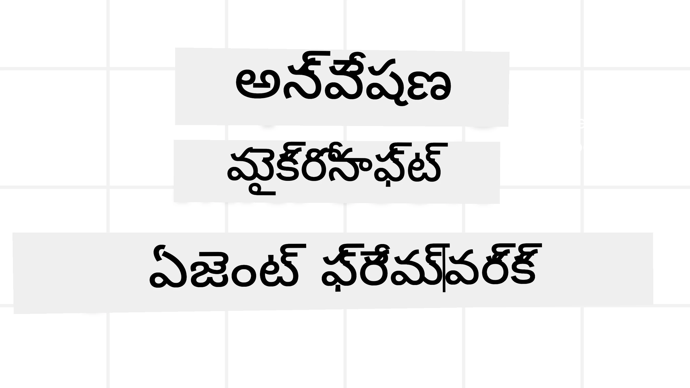
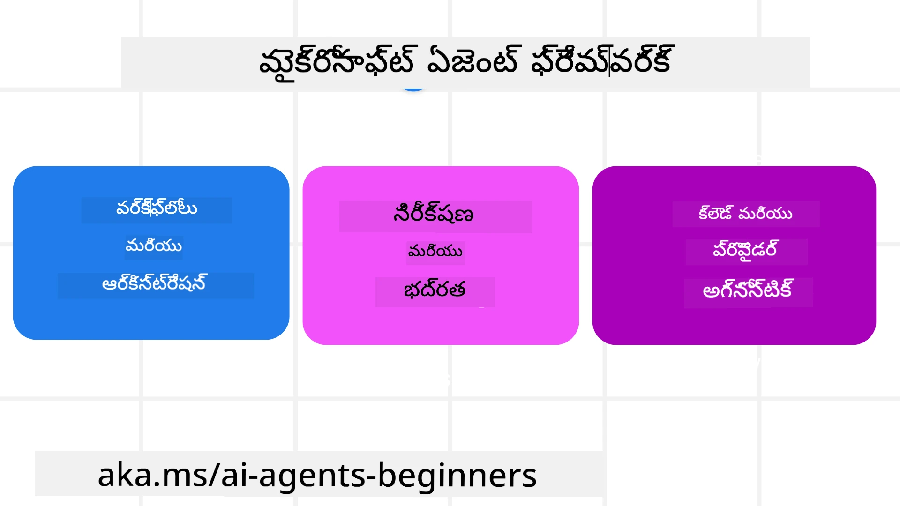
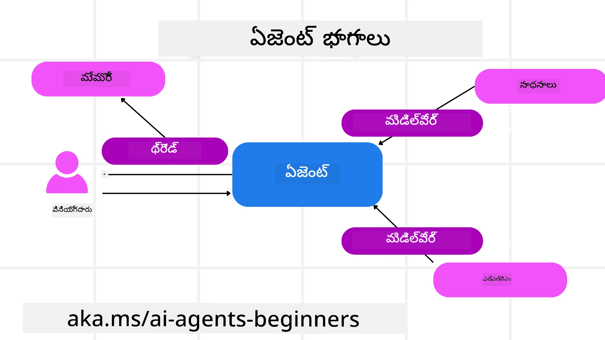

<!--
CO_OP_TRANSLATOR_METADATA:
{
  "original_hash": "19c4dab375acbc733855cc7f2f04edbc",
  "translation_date": "2025-12-03T16:29:49+00:00",
  "source_file": "14-microsoft-agent-framework/README.md",
  "language_code": "te"
}
-->
# మైక్రోసాఫ్ట్ ఏజెంట్ ఫ్రేమ్‌వర్క్ అన్వేషణ



### పరిచయం

ఈ పాఠంలో మీరు తెలుసుకుంటారు:

- మైక్రోసాఫ్ట్ ఏజెంట్ ఫ్రేమ్‌వర్క్ గురించి అవగాహన: ముఖ్యమైన లక్షణాలు మరియు విలువ  
- మైక్రోసాఫ్ట్ ఏజెంట్ ఫ్రేమ్‌వర్క్ యొక్క ముఖ్యమైన భావనలను అన్వేషించడం  
- MAF ను సెమాంటిక్ కర్నెల్ మరియు AutoGen తో పోల్చడం: మైగ్రేషన్ గైడ్  

## అభ్యాస లక్ష్యాలు

ఈ పాఠాన్ని పూర్తి చేసిన తర్వాత, మీరు తెలుసుకుంటారు:

- మైక్రోసాఫ్ట్ ఏజెంట్ ఫ్రేమ్‌వర్క్ ఉపయోగించి ప్రొడక్షన్ రెడీ AI ఏజెంట్లను నిర్మించడం  
- మీ ఏజెంటిక్ యూజ్ కేసులకు మైక్రోసాఫ్ట్ ఏజెంట్ ఫ్రేమ్‌వర్క్ యొక్క ప్రధాన లక్షణాలను వర్తింపజేయడం  
- ఉన్న ఏజెంటిక్ ఫ్రేమ్‌వర్క్‌లు మరియు టూల్స్‌ను మైగ్రేట్ చేయడం మరియు సమీకరించడం  

## కోడ్ నమూనాలు

[మైక్రోసాఫ్ట్ ఏజెంట్ ఫ్రేమ్‌వర్క్ (MAF)](https://aka.ms/ai-agents-beginners/agent-framewrok) కోసం కోడ్ నమూనాలు ఈ రిపోజిటరీలో `xx-python-agent-framework` మరియు `xx-dotnet-agent-framework` ఫైళ్లలో అందుబాటులో ఉన్నాయి.

## మైక్రోసాఫ్ట్ ఏజెంట్ ఫ్రేమ్‌వర్క్ గురించి అవగాహన



[మైక్రోసాఫ్ట్ ఏజెంట్ ఫ్రేమ్‌వర్క్ (MAF)](https://aka.ms/ai-agents-beginners/agent-framewrok) సెమాంటిక్ కర్నెల్ మరియు AutoGen నుండి వచ్చిన అనుభవం మరియు నేర్చుకున్న విషయాలపై ఆధారపడి ఉంటుంది. ఇది ప్రొడక్షన్ మరియు పరిశోధనా వాతావరణాల్లో కనిపించే విస్తృతమైన ఏజెంటిక్ యూజ్ కేసులను పరిష్కరించడానికి అనువైనతను అందిస్తుంది:

- **సీక్వెన్షియల్ ఏజెంట్ ఆర్కెస్ట్రేషన్** - దశలవారీ వర్క్‌ఫ్లో అవసరమైన సందర్భాల్లో.  
- **కన్కరెంట్ ఆర్కెస్ట్రేషన్** - ఏజెంట్లు ఒకేసారి పనులను పూర్తి చేయాల్సిన సందర్భాల్లో.  
- **గ్రూప్ చాట్ ఆర్కెస్ట్రేషన్** - ఏజెంట్లు ఒకే పనిపై కలిసి పనిచేసే సందర్భాల్లో.  
- **హ్యాండాఫ్ ఆర్కెస్ట్రేషన్** - ఏజెంట్లు ఒకరి పనిని మరొకరికి అప్పగించే సందర్భాల్లో.  
- **మాగ్నెటిక్ ఆర్కెస్ట్రేషన్** - మేనేజర్ ఏజెంట్ పనుల జాబితాను సృష్టించి, సబ్ ఏజెంట్ల సమన్వయాన్ని నిర్వహించే సందర్భాల్లో.  

ప్రొడక్షన్‌లో AI ఏజెంట్లను అందించడానికి, MAF ఈ లక్షణాలను కూడా కలిగి ఉంది:

- **ఆబ్జర్వబిలిటీ** - OpenTelemetry ఉపయోగించి, Azure AI Foundry డాష్‌బోర్డ్ల ద్వారా పనితీరు మానిటరింగ్, టూల్ ఇన్వోకేషన్, ఆర్కెస్ట్రేషన్ దశలు, రీజనింగ్ ఫ్లోలను ట్రాక్ చేయడం.  
- **సెక్యూరిటీ** - Azure AI Foundry లో ఏజెంట్లను హోస్ట్ చేయడం ద్వారా రోల్-బేస్డ్ యాక్సెస్, ప్రైవేట్ డేటా హ్యాండ్లింగ్ మరియు బిల్ట్-ఇన్ కంటెంట్ సేఫ్టీ వంటి భద్రతా నియంత్రణలు అందించడం.  
- **డ్యూరబిలిటీ** - ఏజెంట్ థ్రెడ్లు మరియు వర్క్‌ఫ్లోలు పాజ్, రిజ్యూమ్ మరియు ఎర్రర్స్ నుండి రికవర్ చేయగలవు, దీని వల్ల దీర్ఘకాలిక ప్రక్రియలు సాధ్యమవుతాయి.  
- **కంట్రోల్** - హ్యూమన్ ఇన్ ది లూప్ వర్క్‌ఫ్లోలు మద్దతు ఇస్తాయి, వీటిలో పనులు మానవ అనుమతి అవసరమని గుర్తించబడతాయి.  

మైక్రోసాఫ్ట్ ఏజెంట్ ఫ్రేమ్‌వర్క్ కూడా ఈ లక్షణాలను కలిగి ఉంటుంది:

- **క్లౌడ్-అగ్నోస్టిక్** - ఏజెంట్లు కంటైనర్లు, ఆన్-ప్రెమైసెస్ మరియు వివిధ క్లౌడ్‌లలో నడుస్తాయి.  
- **ప్రొవైడర్-అగ్నోస్టిక్** - ఏజెంట్లు మీకు ఇష్టమైన SDK ద్వారా సృష్టించవచ్చు, అందులో Azure OpenAI మరియు OpenAI ఉన్నాయి.  
- **ఓపెన్ స్టాండర్డ్స్ సమీకరణ** - ఏజెంట్లు ఇతర ఏజెంట్లు మరియు టూల్స్‌ను కనుగొనడానికి మరియు ఉపయోగించడానికి Agent-to-Agent(A2A) మరియు Model Context Protocol (MCP) వంటి ప్రోటోకాల్‌లను ఉపయోగించవచ్చు.  
- **ప్లగిన్లు మరియు కనెక్టర్లు** - Microsoft Fabric, SharePoint, Pinecone మరియు Qdrant వంటి డేటా మరియు మెమరీ సేవలకు కనెక్షన్లు చేయవచ్చు.  

ఇప్పుడు మైక్రోసాఫ్ట్ ఏజెంట్ ఫ్రేమ్‌వర్క్ యొక్క కొన్ని ముఖ్యమైన భావనలకు ఈ లక్షణాలు ఎలా వర్తిస్తాయో చూద్దాం.

## మైక్రోసాఫ్ట్ ఏజెంట్ ఫ్రేమ్‌వర్క్ యొక్క ముఖ్యమైన భావనలు

### ఏజెంట్లు



**ఏజెంట్లను సృష్టించడం**

ఏజెంట్ సృష్టి LLM ప్రొవైడర్ (ఇన్ఫరెన్స్ సర్వీస్), AI ఏజెంట్ అనుసరించాల్సిన సూచనల సమితి మరియు `name` ను నిర్వచించడం ద్వారా జరుగుతుంది:

```python
agent = AzureOpenAIChatClient(credential=AzureCliCredential()).create_agent( instructions="You are good at recommending trips to customers based on their preferences.", name="TripRecommender" )
```

పై కోడ్‌లో `Azure OpenAI` ఉపయోగించబడింది, కానీ ఏజెంట్లు `Azure AI Foundry Agent Service` సహా వివిధ సేవలను ఉపయోగించి సృష్టించవచ్చు:

```python
AzureAIAgentClient(async_credential=credential).create_agent( name="HelperAgent", instructions="You are a helpful assistant." ) as agent
```

OpenAI `Responses`, `ChatCompletion` APIs

```python
agent = OpenAIResponsesClient().create_agent( name="WeatherBot", instructions="You are a helpful weather assistant.", )
```

```python
agent = OpenAIChatClient().create_agent( name="HelpfulAssistant", instructions="You are a helpful assistant.", )
```

లేదా A2A ప్రోటోకాల్ ఉపయోగించి రిమోట్ ఏజెంట్లు:

```python
agent = A2AAgent( name=agent_card.name, description=agent_card.description, agent_card=agent_card, url="https://your-a2a-agent-host" )
```

**ఏజెంట్లను నడపడం**

ఏజెంట్లు `.run` లేదా `.run_stream` పద్ధతులను ఉపయోగించి నడపబడతాయి, ఇది నాన్-స్ట్రీమింగ్ లేదా స్ట్రీమింగ్ రెస్పాన్స్‌ల కోసం ఉపయోగించబడుతుంది.

```python
result = await agent.run("What are good places to visit in Amsterdam?")
print(result.text)
```

```python
async for update in agent.run_stream("What are the good places to visit in Amsterdam?"):
    if update.text:
        print(update.text, end="", flush=True)

```

ప్రతి ఏజెంట్ రన్‌లో `max_tokens`, ఏజెంట్ కాల్ చేయగల టూల్స్, మరియు ఏజెంట్ ఉపయోగించే `model` వంటి పారామీటర్లను అనుకూలీకరించడానికి ఎంపికలు ఉంటాయి.

ఇది వినియోగదారుడి పనిని పూర్తి చేయడానికి ప్రత్యేకమైన మోడల్స్ లేదా టూల్స్ అవసరమైన సందర్భాల్లో ఉపయోగకరంగా ఉంటుంది.

**టూల్స్**

టూల్స్ ఏజెంట్ నిర్వచన సమయంలో నిర్వచించవచ్చు:

```python
def get_attractions( location: Annotated[str, Field(description="The location to get the top tourist attractions for")], ) -> str: """Get the top tourist attractions for a given location.""" return f"The top attractions for {location} are." 


# చాట్ ఏజెంట్‌ను నేరుగా సృష్టించినప్పుడు

agent = ChatAgent( chat_client=OpenAIChatClient(), instructions="You are a helpful assistant", tools=[get_attractions]

```

మరియు ఏజెంట్ నడపడం సమయంలో కూడా:

```python

result1 = await agent.run( "What's the best place to visit in Seattle?", tools=[get_attractions] # ఈ రన్ కోసం మాత్రమే సాధనం అందించబడింది )
```

**ఏజెంట్ థ్రెడ్లు**

ఏజెంట్ థ్రెడ్లు మల్టీ-టర్న్ సంభాషణలను నిర్వహించడానికి ఉపయోగించబడతాయి. థ్రెడ్లు క్రింది విధంగా సృష్టించవచ్చు:

- `get_new_thread()` ఉపయోగించి, ఇది థ్రెడ్‌ను కాలక్రమేణా సేవ్ చేయడానికి అనుమతిస్తుంది.  
- ఏజెంట్ నడపడం సమయంలో ఆటోమేటిక్‌గా థ్రెడ్‌ను సృష్టించడం, మరియు ప్రస్తుత రన్ సమయంలో మాత్రమే థ్రెడ్‌ను ఉంచడం.  

థ్రెడ్‌ను సృష్టించడానికి కోడ్ ఇలా ఉంటుంది:

```python
# కొత్త థ్రెడ్‌ను సృష్టించండి.
thread = agent.get_new_thread() # థ్రెడ్‌తో ఏజెంట్‌ను నడపండి.
response = await agent.run("Hello, I am here to help you book travel. Where would you like to go?", thread=thread)

```

తర్వాత థ్రెడ్‌ను భవిష్యత్తులో ఉపయోగించడానికి నిల్వ చేయవచ్చు:

```python
# కొత్త థ్రెడ్‌ను సృష్టించండి.
thread = agent.get_new_thread() 

# థ్రెడ్‌తో ఏజెంట్‌ను నడపండి.

response = await agent.run("Hello, how are you?", thread=thread) 

# నిల్వ కోసం థ్రెడ్‌ను సీరియలైజ్ చేయండి.

serialized_thread = await thread.serialize() 

# నిల్వ నుండి లోడ్ చేసిన తర్వాత థ్రెడ్ స్థితిని డీసీరియలైజ్ చేయండి.

resumed_thread = await agent.deserialize_thread(serialized_thread)
```

**ఏజెంట్ మిడిల్‌వేర్**

ఏజెంట్లు టూల్స్ మరియు LLMs తో ఇంటరాక్ట్ చేస్తాయి. కొన్ని సందర్భాల్లో, ఈ ఇంటరాక్షన్ మధ్యలో ట్రాక్ చేయడం లేదా అమలు చేయడం అవసరం. ఏజెంట్ మిడిల్‌వేర్ ద్వారా ఇది సాధ్యమవుతుంది:

*ఫంక్షన్ మిడిల్‌వేర్*

ఈ మిడిల్‌వేర్ ఏజెంట్ మరియు అది కాల్ చేయబోయే ఫంక్షన్/టూల్ మధ్య చర్యను అమలు చేయడానికి అనుమతిస్తుంది. ఉదాహరణకు, మీరు ఫంక్షన్ కాల్‌పై లాగింగ్ చేయాలనుకుంటే ఇది ఉపయోగపడుతుంది.

```python
async def logging_function_middleware(
    context: FunctionInvocationContext,
    next: Callable[[FunctionInvocationContext], Awaitable[None]],
) -> None:
    """Function middleware that logs function execution."""
    # ప్రీ-ప్రాసెసింగ్: ఫంక్షన్ అమలుకు ముందు లాగ్ చేయండి
    print(f"[Function] Calling {context.function.name}")

    # తదుపరి మిడిల్‌వేర్ లేదా ఫంక్షన్ అమలుకు కొనసాగించండి
    await next(context)

    # పోస్ట్-ప్రాసెసింగ్: ఫంక్షన్ అమలుకు తర్వాత లాగ్ చేయండి
    print(f"[Function] {context.function.name} completed")
```

*చాట్ మిడిల్‌వేర్*

ఈ మిడిల్‌వేర్ ఏజెంట్ మరియు LLM మధ్య అభ్యర్థనలపై చర్యను అమలు చేయడానికి లేదా లాగ్ చేయడానికి అనుమతిస్తుంది.

```python
async def logging_chat_middleware(
    context: ChatContext,
    next: Callable[[ChatContext], Awaitable[None]],
) -> None:
    """Chat middleware that logs AI interactions."""
    # ప్రీ-ప్రాసెసింగ్: AI కాల్ ముందు లాగ్ చేయండి
    print(f"[Chat] Sending {len(context.messages)} messages to AI")

    # తదుపరి మిడిల్‌వేర్ లేదా AI సేవకు కొనసాగించండి
    await next(context)

    # పోస్ట్-ప్రాసెసింగ్: AI ప్రతిస్పందన తర్వాత లాగ్ చేయండి
    print("[Chat] AI response received")

```

**ఏజెంట్ మెమరీ**

`Agentic Memory` పాఠంలో కవర్ చేసినట్లుగా, మెమరీ ఏజెంట్ వివిధ సందర్భాల్లో పనిచేయడానికి ముఖ్యమైన అంశం. MAF వివిధ రకాల మెమరీలను అందిస్తుంది:

*ఇన్-మెమరీ స్టోరేజ్*

అప్లికేషన్ రన్‌టైమ్ సమయంలో థ్రెడ్లలో నిల్వ చేయబడిన మెమరీ.

```python
# కొత్త థ్రెడ్‌ను సృష్టించండి.
thread = agent.get_new_thread() # థ్రెడ్‌తో ఏజెంట్‌ను నడపండి.
response = await agent.run("Hello, I am here to help you book travel. Where would you like to go?", thread=thread)
```

*పర్సిస్టెంట్ మెసేజ్‌లు*

వివిధ సెషన్లలో సంభాషణ చరిత్రను నిల్వ చేయడానికి ఈ మెమరీ ఉపయోగించబడుతుంది. ఇది `chat_message_store_factory` ఉపయోగించి నిర్వచించబడుతుంది:

```python
from agent_framework import ChatMessageStore

# కస్టమ్ మెసేజ్ స్టోర్ సృష్టించండి
def create_message_store():
    return ChatMessageStore()

agent = ChatAgent(
    chat_client=OpenAIChatClient(),
    instructions="You are a Travel assistant.",
    chat_message_store_factory=create_message_store
)

```

*డైనమిక్ మెమరీ*

ఏజెంట్లు నడపబడే ముందు కంటెక్స్ట్‌లో ఈ మెమరీ జోడించబడుతుంది. ఈ మెమరీలు mem0 వంటి బాహ్య సేవల్లో నిల్వ చేయవచ్చు:

```python
from agent_framework.mem0 import Mem0Provider

# మెమ్0 ను అధునాతన మెమరీ సామర్థ్యాల కోసం ఉపయోగించడం
memory_provider = Mem0Provider(
    api_key="your-mem0-api-key",
    user_id="user_123",
    application_id="my_app"
)

agent = ChatAgent(
    chat_client=OpenAIChatClient(),
    instructions="You are a helpful assistant with memory.",
    context_providers=memory_provider
)

```

**ఏజెంట్ ఆబ్జర్వబిలిటీ**

ఆబ్జర్వబిలిటీ ఏజెంటిక్ సిస్టమ్‌లను నమ్మదగిన మరియు నిర్వహించదగినవిగా నిర్మించడానికి ముఖ్యమైనది. MAF OpenTelemetry తో సమీకరించబడింది, ఇది ట్రేసింగ్ మరియు మెటర్లను అందిస్తుంది.

```python
from agent_framework.observability import get_tracer, get_meter

tracer = get_tracer()
meter = get_meter()
with tracer.start_as_current_span("my_custom_span"):
    # ఏదైనా చేయండి
    pass
counter = meter.create_counter("my_custom_counter")
counter.add(1, {"key": "value"})
```

### వర్క్‌ఫ్లోలు

MAF ముందుగా నిర్వచించిన దశలను అందిస్తుంది, ఇవి పనిని పూర్తి చేయడానికి మరియు ఆ దశలలో భాగంగా AI ఏజెంట్లను కలిగి ఉంటాయి.

వర్క్‌ఫ్లోలు వివిధ భాగాలతో రూపొందించబడ్డాయి, ఇవి మెరుగైన కంట్రోల్ ఫ్లోను అనుమతిస్తాయి. వర్క్‌ఫ్లోలు **మల్టీ-ఏజెంట్ ఆర్కెస్ట్రేషన్** మరియు **చెక్‌పాయింటింగ్** ను కూడా సాధ్యమవుతాయి.

వర్క్‌ఫ్లో యొక్క ప్రధాన భాగాలు:

**ఎక్జిక్యూటర్లు**

ఎక్జిక్యూటర్లు ఇన్‌పుట్ మెసేజ్‌లను స్వీకరిస్తాయి, వారికి కేటాయించిన పనులను నిర్వహిస్తాయి, మరియు అవుట్‌పుట్ మెసేజ్‌ను ఉత్పత్తి చేస్తాయి. ఇది పెద్ద పనిని పూర్తి చేయడానికి వర్క్‌ఫ్లోను ముందుకు తీసుకువెళుతుంది. ఎక్జిక్యూటర్లు AI ఏజెంట్ లేదా కస్టమ్ లాజిక్ కావచ్చు.

**ఎడ్జ్‌లు**

ఎడ్జ్‌లు వర్క్‌ఫ్లోలో మెసేజ్‌ల ప్రవాహాన్ని నిర్వచించడానికి ఉపయోగించబడతాయి. ఇవి:

*డైరెక్ట్ ఎడ్జ్‌లు* - ఎక్జిక్యూటర్ల మధ్య సింపుల్ వన్-టు-వన్ కనెక్షన్లు:

```python
from agent_framework import WorkflowBuilder

builder = WorkflowBuilder()
builder.add_edge(source_executor, target_executor)
builder.set_start_executor(source_executor)
workflow = builder.build()
```

*కండిషనల్ ఎడ్జ్‌లు* - నిర్దిష్ట పరిస్థితి తీరిన తర్వాత యాక్టివేట్ అవుతాయి. ఉదాహరణకు, హోటల్ గదులు అందుబాటులో లేనప్పుడు, ఎక్జిక్యూటర్ ఇతర ఎంపికలను సూచించగలదు.

*స్విచ్-కేస్ ఎడ్జ్‌లు* - నిర్వచించిన పరిస్థితుల ఆధారంగా మెసేజ్‌లను వివిధ ఎక్జిక్యూటర్లకు రూట్ చేస్తాయి. ఉదాహరణకు, ప్రయాణ వినియోగదారుడికి ప్రాధాన్యత యాక్సెస్ ఉంటే, వారి పనులు మరో వర్క్‌ఫ్లో ద్వారా నిర్వహించబడతాయి.

*ఫ్యాన్-అవుట్ ఎడ్జ్‌లు* - ఒక మెసేజ్‌ను అనేక టార్గెట్‌లకు పంపడం.

*ఫ్యాన్-ఇన్ ఎడ్జ్‌లు* - వివిధ ఎక్జిక్యూటర్ల నుండి అనేక మెసేజ్‌లను సేకరించి ఒక టార్గెట్‌కు పంపడం.

**ఈవెంట్లు**

వర్క్‌ఫ్లోలలో మెరుగైన ఆబ్జర్వబిలిటీని అందించడానికి, MAF అమలుకు బిల్ట్-ఇన్ ఈవెంట్లను అందిస్తుంది:

- `WorkflowStartedEvent` - వర్క్‌ఫ్లో అమలు ప్రారంభమవుతుంది  
- `WorkflowOutputEvent` - వర్క్‌ఫ్లో అవుట్‌పుట్‌ను ఉత్పత్తి చేస్తుంది  
- `WorkflowErrorEvent` - వర్క్‌ఫ్లోలో ఎర్రర్ ఎదురవుతుంది  
- `ExecutorInvokeEvent` - ఎక్జిక్యూటర్ ప్రాసెసింగ్ ప్రారంభమవుతుంది  
- `ExecutorCompleteEvent` - ఎక్జిక్యూటర్ ప్రాసెసింగ్ పూర్తి చేస్తుంది  
- `RequestInfoEvent` - అభ్యర్థన జారీ చేయబడింది  

## ఇతర ఫ్రేమ్‌వర్క్‌ల నుండి మైగ్రేట్ చేయడం (సెమాంటిక్ కర్నెల్ మరియు AutoGen)

### MAF మరియు సెమాంటిక్ కర్నెల్ మధ్య తేడాలు

**సింప్లిఫైడ్ ఏజెంట్ క్రియేషన్**

సెమాంటిక్ కర్నెల్ ప్రతి ఏజెంట్ కోసం కర్నెల్ ఇన్స్టాన్స్ సృష్టించడంపై ఆధారపడి ఉంటుంది. MAF ప్రధాన ప్రొవైడర్లకు ఎక్స్‌టెన్షన్‌లను ఉపయోగించి సరళమైన విధానాన్ని ఉపయోగిస్తుంది.

```python
agent = AzureOpenAIChatClient(credential=AzureCliCredential()).create_agent( instructions="You are good at reccomending trips to customers based on their preferences.", name="TripRecommender" )
```

**ఏజెంట్ థ్రెడ్ క్రియేషన్**

సెమాంటిక్ కర్నెల్‌లో థ్రెడ్లు మానవీయంగా సృష్టించాలి. MAF లో, ఏజెంట్‌కు నేరుగా థ్రెడ్ కేటాయించబడుతుంది.

```python
thread = agent.get_new_thread() # థ్రెడ్‌తో ఏజెంట్‌ను నడపండి.
```

**టూల్ రిజిస్ట్రేషన్**

సెమాంటిక్ కర్నెల్‌లో, టూల్స్ కర్నెల్‌కు రిజిస్టర్ చేయబడతాయి మరియు కర్నెల్ తర్వాత ఏజెంట్‌కు పంపబడుతుంది. MAF లో, టూల్స్ ఏజెంట్ సృష్టి ప్రక్రియలో నేరుగా రిజిస్టర్ చేయబడతాయి.

```python
agent = ChatAgent( chat_client=OpenAIChatClient(), instructions="You are a helpful assistant", tools=[get_attractions]
```

### MAF మరియు AutoGen మధ్య తేడాలు

**టీమ్స్ vs వర్క్‌ఫ్లోలు**

AutoGen లో `Teams` ఏజెంట్లతో ఈవెంట్ డ్రైవన్ యాక్టివిటీ కోసం ఈవెంట్ స్ట్రక్చర్. MAF లో, `Workflows` డేటాను ఎక్జిక్యూటర్లకు గ్రాఫ్ ఆధారిత ఆర్కిటెక్చర్ ద్వారా రూట్ చేస్తాయి.

**టూల్ క్రియేషన్**

AutoGen `FunctionTool` ను ఉపయోగించి ఏజెంట్లు కాల్ చేయగల ఫంక్షన్‌లను ర్యాప్ చేస్తుంది. MAF @ai_function ను ఉపయోగిస్తుంది, ఇది సమానంగా పనిచేస్తుంది కానీ ప్రతి ఫంక్షన్ కోసం స్కీమాలను ఆటోమేటిక్‌గా ఇన్‌ఫర్ చేస్తుంది.

**ఏజెంట్ బిహేవియర్**

AutoGen లో ఏజెంట్లు డిఫాల్ట్‌గా సింగిల్-టర్న్ ఏజెంట్లు ఉంటాయి, `max_tool_iterations` ఎక్కువగా సెట్ చేయబడితే తప్ప. MAF లో `ChatAgent` డిఫాల్ట్‌గా మల్టీ-టర్న్ ఉంటుంది, అంటే ఇది వినియోగదారుడి పని పూర్తయ్యే వరకు టూల్స్‌ను కాల్ చేస్తూనే ఉంటుంది.

## కోడ్ నమూనాలు

మైక్రోసాఫ్ట్ ఏజెంట్ ఫ్రేమ్‌వర్క్ కోసం కోడ్ నమూనాలు ఈ రిపోజిటరీలో `xx-python-agent-framework` మరియు `xx-dotnet-agent-framework` ఫైళ్లలో అందుబాటులో ఉన్నాయి.

## మైక్రోసాఫ్ట్ ఏజెంట్ ఫ్రేమ్‌వర్క్ గురించి మరిన్ని ప్రశ్నలున్నాయా?

[Azure AI Foundry Discord](https://aka.ms/ai-agents/discord) లో చేరి ఇతర అభ్యాసకులతో కలవండి, ఆఫీస్ అవర్స్‌లో పాల్గొనండి మరియు మీ AI ఏజెంట్ల ప్రశ్నలకు సమాధానాలు పొందండి.

---

<!-- CO-OP TRANSLATOR DISCLAIMER START -->
**విమర్శ**:  
ఈ పత్రాన్ని AI అనువాద సేవ [Co-op Translator](https://github.com/Azure/co-op-translator) ఉపయోగించి అనువదించారు. మేము ఖచ్చితత్వానికి ప్రయత్నిస్తున్నప్పటికీ, ఆటోమేటెడ్ అనువాదాలలో తప్పులు లేదా అసమానతలు ఉండవచ్చు. దాని స్వదేశీ భాషలోని అసలు పత్రాన్ని అధికారం కలిగిన మూలంగా పరిగణించాలి. కీలకమైన సమాచారం కోసం, ప్రొఫెషనల్ మానవ అనువాదాన్ని సిఫారసు చేస్తాము. ఈ అనువాదాన్ని ఉపయోగించడం వల్ల కలిగే ఏవైనా అపార్థాలు లేదా తప్పుదారులు కోసం మేము బాధ్యత వహించము.
<!-- CO-OP TRANSLATOR DISCLAIMER END -->