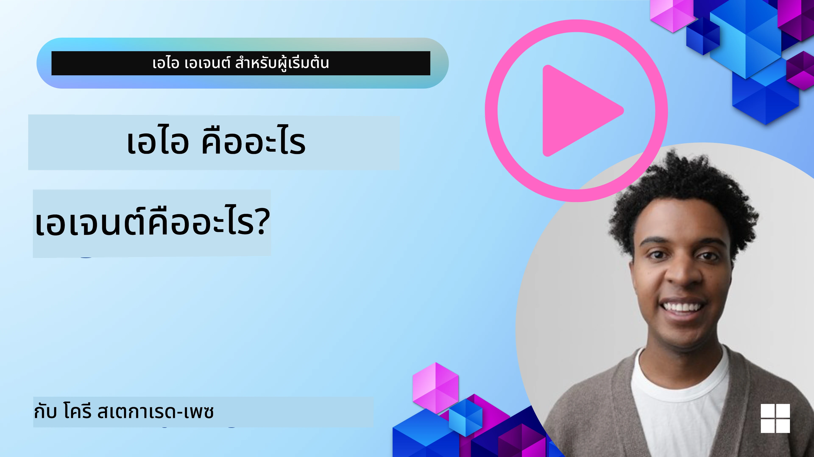
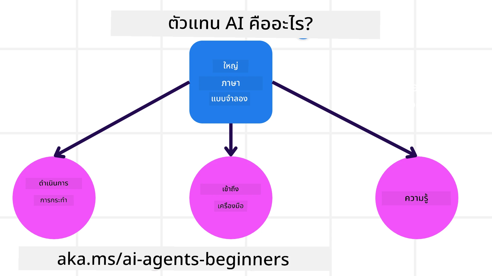
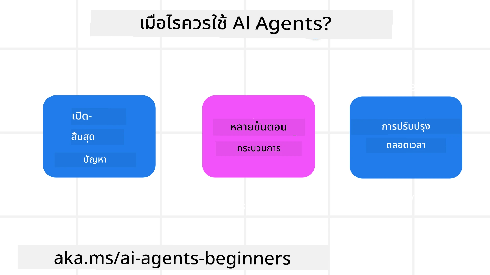

<!--
CO_OP_TRANSLATOR_METADATA:
{
  "original_hash": "cdd28bc00816d2773bb2b5968d782abc",
  "translation_date": "2025-11-11T11:17:53+00:00",
  "source_file": "01-intro-to-ai-agents/README.md",
  "language_code": "th"
}
-->

> _(คลิกที่ภาพด้านบนเพื่อดูวิดีโอของบทเรียนนี้)_

# แนะนำ AI Agents และกรณีการใช้งานของ Agent

ยินดีต้อนรับสู่คอร์ส "AI Agents สำหรับผู้เริ่มต้น"! คอร์สนี้ให้ความรู้พื้นฐานและตัวอย่างการใช้งานสำหรับการสร้าง AI Agents

เข้าร่วม <a href="https://discord.gg/kzRShWzttr" target="_blank">ชุมชน Azure AI Discord</a> เพื่อพบปะกับผู้เรียนและผู้สร้าง AI Agent และถามคำถามที่คุณมีเกี่ยวกับคอร์สนี้

เพื่อเริ่มต้นคอร์สนี้ เราจะเริ่มต้นด้วยการทำความเข้าใจว่า AI Agents คืออะไร และเราสามารถใช้มันในแอปพลิเคชันและกระบวนการทำงานที่เราสร้างขึ้นได้อย่างไร

## บทนำ

บทเรียนนี้ครอบคลุม:

- AI Agents คืออะไร และมีประเภทของ Agent อะไรบ้าง?
- กรณีการใช้งานใดที่เหมาะสมที่สุดสำหรับ AI Agents และมันช่วยเราได้อย่างไร?
- องค์ประกอบพื้นฐานบางอย่างในการออกแบบ Agentic Solutions คืออะไร?

## เป้าหมายการเรียนรู้
หลังจากจบบทเรียนนี้ คุณควรจะสามารถ:

- เข้าใจแนวคิดของ AI Agent และความแตกต่างจากโซลูชัน AI อื่น ๆ
- ใช้ AI Agents อย่างมีประสิทธิภาพ
- ออกแบบ Agentic Solutions อย่างมีประสิทธิภาพสำหรับทั้งผู้ใช้และลูกค้า

## การนิยาม AI Agents และประเภทของ AI Agents

### AI Agents คืออะไร?

AI Agents คือ **ระบบ** ที่ช่วยให้ **Large Language Models (LLMs)** สามารถ **ดำเนินการ** โดยการขยายความสามารถของ LLMs ด้วยการให้ **เข้าถึงเครื่องมือ** และ **ความรู้**

เรามาแบ่งคำจำกัดความนี้ออกเป็นส่วนย่อย ๆ:

- **ระบบ** - สิ่งสำคัญคือการคิดว่า Agent ไม่ใช่แค่ส่วนประกอบเดียว แต่เป็นระบบที่ประกอบด้วยหลายส่วนประกอบ ในระดับพื้นฐาน ส่วนประกอบของ AI Agent ได้แก่:
  - **สภาพแวดล้อม** - พื้นที่ที่กำหนดซึ่ง AI Agent ทำงาน ตัวอย่างเช่น หากเรามี AI Agent สำหรับการจองการเดินทาง สภาพแวดล้อมอาจเป็นระบบการจองการเดินทางที่ AI Agent ใช้ในการทำงาน
  - **เซ็นเซอร์** - สภาพแวดล้อมมีข้อมูลและให้ผลตอบกลับ AI Agents ใช้เซ็นเซอร์เพื่อรวบรวมและตีความข้อมูลเกี่ยวกับสถานะปัจจุบันของสภาพแวดล้อม ในตัวอย่าง Agent การจองการเดินทาง ระบบการจองการเดินทางสามารถให้ข้อมูล เช่น ความพร้อมของโรงแรมหรือราคาตั๋วเครื่องบิน
  - **แอคชูเอเตอร์** - เมื่อ AI Agent ได้รับสถานะปัจจุบันของสภาพแวดล้อม สำหรับงานปัจจุบัน Agent จะกำหนดการดำเนินการที่จะเปลี่ยนแปลงสภาพแวดล้อม สำหรับ Agent การจองการเดินทาง อาจเป็นการจองห้องพักที่ว่างสำหรับผู้ใช้

**Large Language Models** - แนวคิดของ Agent มีอยู่ก่อนการสร้าง LLMs ข้อได้เปรียบของการสร้าง AI Agents ด้วย LLMs คือความสามารถในการตีความภาษามนุษย์และข้อมูล ความสามารถนี้ช่วยให้ LLMs ตีความข้อมูลสภาพแวดล้อมและกำหนดแผนการเปลี่ยนแปลงสภาพแวดล้อม

**การดำเนินการ** - นอกระบบ AI Agent LLMs ถูกจำกัดในสถานการณ์ที่การดำเนินการคือการสร้างเนื้อหาหรือข้อมูลตามคำขอของผู้ใช้ ในระบบ AI Agent LLMs สามารถทำงานได้โดยการตีความคำขอของผู้ใช้และใช้เครื่องมือที่มีอยู่ในสภาพแวดล้อมของพวกเขา

**การเข้าถึงเครื่องมือ** - เครื่องมือที่ LLM สามารถเข้าถึงได้ถูกกำหนดโดย 1) สภาพแวดล้อมที่มันทำงาน และ 2) ผู้พัฒนา AI Agent สำหรับตัวอย่าง Agent การเดินทาง เครื่องมือของ Agent ถูกจำกัดโดยการดำเนินการที่มีอยู่ในระบบการจอง และ/หรือผู้พัฒนาสามารถจำกัดการเข้าถึงเครื่องมือของ Agent เฉพาะเที่ยวบิน

**ความจำ+ความรู้** - ความจำสามารถเป็นระยะสั้นในบริบทของการสนทนาระหว่างผู้ใช้และ Agent ในระยะยาว นอกเหนือจากข้อมูลที่ให้โดยสภาพแวดล้อม AI Agents ยังสามารถดึงความรู้จากระบบอื่น ๆ บริการ เครื่องมือ และแม้กระทั่ง Agent อื่น ๆ ในตัวอย่าง Agent การเดินทาง ความรู้นี้อาจเป็นข้อมูลเกี่ยวกับความชอบในการเดินทางของผู้ใช้ที่อยู่ในฐานข้อมูลลูกค้า

### ประเภทต่าง ๆ ของ Agent

ตอนนี้เรามีคำจำกัดความทั่วไปของ AI Agents แล้ว เรามาดูประเภทของ Agent เฉพาะและวิธีการนำไปใช้กับ Agent การจองการเดินทาง

| **ประเภทของ Agent**          | **คำอธิบาย**                                                                                                                       | **ตัวอย่าง**                                                                                                                                                                                                                   |
| ----------------------------- | ------------------------------------------------------------------------------------------------------------------------------------- | ----------------------------------------------------------------------------------------------------------------------------------------------------------------------------------------------------------------------------- |
| **Simple Reflex Agents**      | ดำเนินการทันทีตามกฎที่กำหนดไว้ล่วงหน้า                                                                                              | Agent การเดินทางตีความบริบทของอีเมลและส่งต่อข้อร้องเรียนเกี่ยวกับการเดินทางไปยังฝ่ายบริการลูกค้า                                                                                                                          |
| **Model-Based Reflex Agents** | ดำเนินการตามแบบจำลองของโลกและการเปลี่ยนแปลงในแบบจำลองนั้น                                                                          | Agent การเดินทางจัดลำดับความสำคัญของเส้นทางที่มีการเปลี่ยนแปลงราคาที่สำคัญโดยอ้างอิงจากข้อมูลราคาประวัติ                                                                                                             |
| **Goal-Based Agents**         | สร้างแผนเพื่อบรรลุเป้าหมายเฉพาะโดยตีความเป้าหมายและกำหนดการดำเนินการเพื่อไปถึงเป้าหมาย                                           | Agent การเดินทางจองการเดินทางโดยกำหนดการจัดการการเดินทางที่จำเป็น (รถ, ขนส่งสาธารณะ, เที่ยวบิน) จากตำแหน่งปัจจุบันไปยังจุดหมายปลายทาง                                                                                |
| **Utility-Based Agents**      | พิจารณาความชอบและชั่งน้ำหนักการแลกเปลี่ยนเชิงตัวเลขเพื่อกำหนดวิธีการบรรลุเป้าหมาย                                                  | Agent การเดินทางเพิ่มประโยชน์สูงสุดโดยชั่งน้ำหนักความสะดวกสบายเทียบกับค่าใช้จ่ายเมื่อจองการเดินทาง                                                                                                                                          |
| **Learning Agents**           | ปรับปรุงเมื่อเวลาผ่านไปโดยตอบสนองต่อผลตอบกลับและปรับการดำเนินการตามนั้น                                                             | Agent การเดินทางปรับปรุงโดยใช้ผลตอบรับจากลูกค้าจากแบบสำรวจหลังการเดินทางเพื่อปรับการจองในอนาคต                                                                                                               |
| **Hierarchical Agents**       | มี Agent หลายตัวในระบบแบบลำดับชั้น โดย Agent ระดับสูงแบ่งงานออกเป็นงานย่อยให้ Agent ระดับต่ำกว่าเพื่อดำเนินการให้เสร็จสิ้น            | Agent การเดินทางยกเลิกการเดินทางโดยแบ่งงานออกเป็นงานย่อย (เช่น การยกเลิกการจองเฉพาะ) และให้ Agent ระดับต่ำกว่าดำเนินการให้เสร็จสิ้น และรายงานกลับไปยัง Agent ระดับสูง                                     |
| **Multi-Agent Systems (MAS)** | Agent ดำเนินการงานอย่างอิสระ ทั้งแบบร่วมมือกันหรือแข่งขันกัน                                                                          | ร่วมมือกัน: Agent หลายตัวจองบริการการเดินทางเฉพาะ เช่น โรงแรม เที่ยวบิน และความบันเทิง แข่งขันกัน: Agent หลายตัวจัดการและแข่งขันกันในปฏิทินการจองโรงแรมที่ใช้ร่วมกันเพื่อจองลูกค้าเข้าพักในโรงแรม |

## เมื่อใดควรใช้ AI Agents

ในส่วนก่อนหน้า เราใช้กรณีการใช้งาน Agent การเดินทางเพื่ออธิบายว่าประเภทต่าง ๆ ของ Agent สามารถใช้ในสถานการณ์ต่าง ๆ ของการจองการเดินทางได้อย่างไร เราจะใช้แอปพลิเคชันนี้ต่อไปตลอดคอร์ส

มาดูประเภทของกรณีการใช้งานที่ AI Agents เหมาะสมที่สุด:

- **ปัญหาที่ไม่มีคำตอบชัดเจน** - ให้ LLM กำหนดขั้นตอนที่จำเป็นในการทำงานให้เสร็จ เนื่องจากไม่สามารถกำหนดไว้ล่วงหน้าในกระบวนการทำงานได้เสมอไป
- **กระบวนการหลายขั้นตอน** - งานที่ต้องการระดับความซับซ้อนที่ AI Agent ต้องใช้เครื่องมือหรือข้อมูลในหลายรอบแทนที่จะดึงข้อมูลเพียงครั้งเดียว  
- **การปรับปรุงเมื่อเวลาผ่านไป** - งานที่ Agent สามารถปรับปรุงเมื่อเวลาผ่านไปโดยรับผลตอบกลับจากสภาพแวดล้อมหรือผู้ใช้เพื่อให้ประโยชน์ที่ดียิ่งขึ้น

เราจะครอบคลุมการพิจารณาเพิ่มเติมเกี่ยวกับการใช้ AI Agents ในบทเรียน Building Trustworthy AI Agents

## พื้นฐานของ Agentic Solutions

### การพัฒนา Agent

ขั้นตอนแรกในการออกแบบระบบ AI Agent คือการกำหนดเครื่องมือ การดำเนินการ และพฤติกรรม ในคอร์สนี้ เรามุ่งเน้นการใช้ **Azure AI Agent Service** เพื่อกำหนด Agent ของเรา ซึ่งมีฟีเจอร์ดังนี้:

- การเลือก Open Models เช่น OpenAI, Mistral และ Llama
- การใช้ข้อมูลที่ได้รับอนุญาตผ่านผู้ให้บริการ เช่น Tripadvisor
- การใช้เครื่องมือ OpenAPI 3.0 ที่ได้มาตรฐาน

### รูปแบบ Agentic

การสื่อสารกับ LLMs ผ่านการตั้งคำถาม เนื่องจากลักษณะกึ่งอัตโนมัติของ AI Agents จึงไม่สามารถหรือไม่จำเป็นต้องตั้งคำถามใหม่กับ LLM หลังจากการเปลี่ยนแปลงในสภาพแวดล้อมเสมอไป เราใช้ **Agentic Patterns** ที่ช่วยให้เราสามารถตั้งคำถามกับ LLM ในหลายขั้นตอนได้ในวิธีที่ปรับขนาดได้มากขึ้น

คอร์สนี้แบ่งออกเป็นรูปแบบ Agentic ที่ได้รับความนิยมในปัจจุบัน

### เฟรมเวิร์ก Agentic

เฟรมเวิร์ก Agentic ช่วยให้นักพัฒนาสามารถนำรูปแบบ Agentic ไปใช้ผ่านโค้ด เฟรมเวิร์กเหล่านี้มีเทมเพลต ปลั๊กอิน และเครื่องมือสำหรับการทำงานร่วมกันของ AI Agent ที่ดีขึ้น ประโยชน์เหล่านี้ช่วยให้มีความสามารถในการสังเกตและแก้ไขปัญหาระบบ AI Agent ได้ดียิ่งขึ้น

ในคอร์สนี้ เราจะสำรวจเฟรมเวิร์ก AutoGen ที่ขับเคลื่อนด้วยการวิจัย และเฟรมเวิร์ก Agent ที่พร้อมใช้งานในระดับการผลิตจาก Semantic Kernel

## ตัวอย่างโค้ด

- Python: [Agent Framework](./code_samples/01-python-agent-framework.ipynb)
- .NET: [Agent Framework](./code_samples/01-dotnet-agent-framework.md)

## มีคำถามเพิ่มเติมเกี่ยวกับ AI Agents?

เข้าร่วม [Azure AI Foundry Discord](https://aka.ms/ai-agents/discord) เพื่อพบปะกับผู้เรียนคนอื่น ๆ เข้าร่วมชั่วโมงทำการ และรับคำตอบสำหรับคำถามเกี่ยวกับ AI Agents ของคุณ

## บทเรียนก่อนหน้า

[การตั้งค่าคอร์ส](../00-course-setup/README.md)

## บทเรียนถัดไป

[การสำรวจเฟรมเวิร์ก Agentic](../02-explore-agentic-frameworks/README.md)

---

<!-- CO-OP TRANSLATOR DISCLAIMER START -->
**ข้อจำกัดความรับผิดชอบ**:  
เอกสารนี้ได้รับการแปลโดยใช้บริการแปลภาษา AI [Co-op Translator](https://github.com/Azure/co-op-translator) แม้ว่าเราจะพยายามให้การแปลมีความถูกต้อง แต่โปรดทราบว่าการแปลโดยอัตโนมัติอาจมีข้อผิดพลาดหรือความไม่ถูกต้อง เอกสารต้นฉบับในภาษาดั้งเดิมควรถือเป็นแหล่งข้อมูลที่เชื่อถือได้ สำหรับข้อมูลที่สำคัญ ขอแนะนำให้ใช้บริการแปลภาษามืออาชีพ เราไม่รับผิดชอบต่อความเข้าใจผิดหรือการตีความผิดที่เกิดจากการใช้การแปลนี้
<!-- CO-OP TRANSLATOR DISCLAIMER END -->