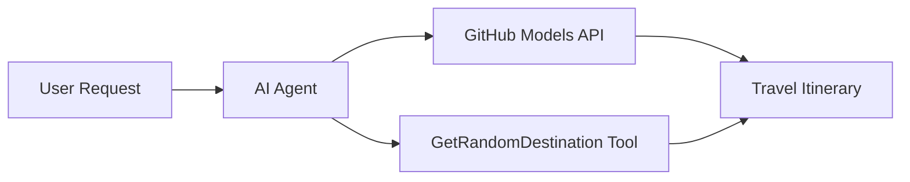

<!--
CO_OP_TRANSLATOR_METADATA:
{
  "original_hash": "5f351412e934f0833c8c821a0a60efaf",
  "translation_date": "2025-11-13T12:35:01+00:00",
  "source_file": "01-intro-to-ai-agents/code_samples/01-dotnet-agent-framework.md",
  "language_code": "th"
}
-->
# 🌍 ตัวแทนการท่องเที่ยว AI ด้วย Microsoft Agent Framework (.NET)

## 📋 ภาพรวมของสถานการณ์

ตัวอย่างนี้แสดงให้เห็นถึงวิธีการสร้างตัวแทนวางแผนการท่องเที่ยวอัจฉริยะโดยใช้ Microsoft Agent Framework สำหรับ .NET ตัวแทนนี้สามารถสร้างแผนการเดินทางแบบวันต่อวันสำหรับจุดหมายปลายทางแบบสุ่มทั่วโลกได้โดยอัตโนมัติ

### ความสามารถหลัก:

- 🎲 **การเลือกจุดหมายปลายทางแบบสุ่ม**: ใช้เครื่องมือที่กำหนดเองเพื่อเลือกสถานที่พักผ่อน
- 🗺️ **การวางแผนการเดินทางอัจฉริยะ**: สร้างแผนการเดินทางแบบละเอียดวันต่อวัน
- 🔄 **การสตรีมแบบเรียลไทม์**: รองรับทั้งการตอบสนองทันทีและการสตรีม
- 🛠️ **การผสานรวมเครื่องมือที่กำหนดเอง**: แสดงให้เห็นถึงวิธีการขยายความสามารถของตัวแทน

## 🔧 สถาปัตยกรรมทางเทคนิค

### เทคโนโลยีหลัก

- **Microsoft Agent Framework**: การใช้งาน .NET ล่าสุดสำหรับการพัฒนาตัวแทน AI
- **การผสานรวม GitHub Models**: ใช้บริการการอนุมานโมเดล AI ของ GitHub
- **ความเข้ากันได้กับ OpenAI API**: ใช้ไลบรารีไคลเอนต์ OpenAI พร้อมจุดเชื่อมต่อที่กำหนดเอง
- **การกำหนดค่าที่ปลอดภัย**: การจัดการคีย์ API ตามสภาพแวดล้อม

### ส่วนประกอบสำคัญ

1. **AIAgent**: ตัวจัดการตัวแทนหลักที่ดูแลการไหลของการสนทนา
2. **เครื่องมือที่กำหนดเอง**: ฟังก์ชัน `GetRandomDestination()` ที่ตัวแทนสามารถใช้งานได้
3. **Chat Client**: อินเทอร์เฟซการสนทนาที่สนับสนุนโดย GitHub Models
4. **การรองรับการสตรีม**: ความสามารถในการสร้างการตอบสนองแบบเรียลไทม์

### รูปแบบการผสานรวม



## 🚀 เริ่มต้นใช้งาน

### ข้อกำหนดเบื้องต้น

- [.NET 10 SDK](https://dotnet.microsoft.com/download/dotnet/10.0) หรือสูงกว่า
- [โทเค็นการเข้าถึง GitHub Models API](https://docs.github.com/github-models/github-models-at-scale/using-your-own-api-keys-in-github-models)

### ตัวแปรสภาพแวดล้อมที่จำเป็น

```bash
# zsh/bash
export GH_TOKEN=<your_github_token>
export GH_ENDPOINT=https://models.github.ai/inference
export GH_MODEL_ID=openai/gpt-5-mini
```

```powershell
# PowerShell
$env:GH_TOKEN = "<your_github_token>"
$env:GH_ENDPOINT = "https://models.github.ai/inference"
$env:GH_MODEL_ID = "openai/gpt-5-mini"
```

### ตัวอย่างโค้ด

เพื่อรันตัวอย่างโค้ด,

```bash
# zsh/bash
chmod +x ./01-dotnet-agent-framework.cs
./01-dotnet-agent-framework.cs
```

หรือใช้ dotnet CLI:

```bash
dotnet run ./01-dotnet-agent-framework.cs
```

ดู [`01-dotnet-agent-framework.cs`](../../../../01-intro-to-ai-agents/code_samples/01-dotnet-agent-framework.cs) สำหรับโค้ดทั้งหมด

```csharp
#!/usr/bin/dotnet run

#:package Microsoft.Extensions.AI@9.*
#:package Microsoft.Agents.AI.OpenAI@1.*-*

using System.ClientModel;
using System.ComponentModel;

using Microsoft.Agents.AI;
using Microsoft.Extensions.AI;

using OpenAI;

// Tool Function: Random Destination Generator
// This static method will be available to the agent as a callable tool
// The [Description] attribute helps the AI understand when to use this function
// This demonstrates how to create custom tools for AI agents
[Description("Provides a random vacation destination.")]
static string GetRandomDestination()
{
    // List of popular vacation destinations around the world
    // The agent will randomly select from these options
    var destinations = new List<string>
    {
        "Paris, France",
        "Tokyo, Japan",
        "New York City, USA",
        "Sydney, Australia",
        "Rome, Italy",
        "Barcelona, Spain",
        "Cape Town, South Africa",
        "Rio de Janeiro, Brazil",
        "Bangkok, Thailand",
        "Vancouver, Canada"
    };

    // Generate random index and return selected destination
    // Uses System.Random for simple random selection
    var random = new Random();
    int index = random.Next(destinations.Count);
    return destinations[index];
}

// Extract configuration from environment variables
// Retrieve the GitHub Models API endpoint, defaults to https://models.github.ai/inference if not specified
// Retrieve the model ID, defaults to openai/gpt-5-mini if not specified
// Retrieve the GitHub token for authentication, throws exception if not specified
var github_endpoint = Environment.GetEnvironmentVariable("GH_ENDPOINT") ?? "https://models.github.ai/inference";
var github_model_id = Environment.GetEnvironmentVariable("GH_MODEL_ID") ?? "openai/gpt-5-mini";
var github_token = Environment.GetEnvironmentVariable("GH_TOKEN") ?? throw new InvalidOperationException("GH_TOKEN is not set.");

// Configure OpenAI Client Options
// Create configuration options to point to GitHub Models endpoint
// This redirects OpenAI client calls to GitHub's model inference service
var openAIOptions = new OpenAIClientOptions()
{
    Endpoint = new Uri(github_endpoint)
};

// Initialize OpenAI Client with GitHub Models Configuration
// Create OpenAI client using GitHub token for authentication
// Configure it to use GitHub Models endpoint instead of OpenAI directly
var openAIClient = new OpenAIClient(new ApiKeyCredential(github_token), openAIOptions);

// Create AI Agent with Travel Planning Capabilities
// Initialize OpenAI client, get chat client for specified model, and create AI agent
// Configure agent with travel planning instructions and random destination tool
// The agent can now plan trips using the GetRandomDestination function
AIAgent agent = openAIClient
    .GetChatClient(github_model_id)
    .CreateAIAgent(
        instructions: "You are a helpful AI Agent that can help plan vacations for customers at random destinations",
        tools: [AIFunctionFactory.Create(GetRandomDestination)]
    );

// Execute Agent: Plan a Day Trip
// Run the agent with streaming enabled for real-time response display
// Shows the agent's thinking and response as it generates the content
// Provides better user experience with immediate feedback
await foreach (var update in agent.RunStreamingAsync("Plan me a day trip"))
{
    await Task.Delay(10);
    Console.Write(update);
}
```

## 🎓 สิ่งที่ควรทราบ

1. **สถาปัตยกรรมตัวแทน**: Microsoft Agent Framework มอบวิธีการที่สะอาดและปลอดภัยต่อประเภทในการสร้างตัวแทน AI ใน .NET
2. **การผสานรวมเครื่องมือ**: ฟังก์ชันที่ตกแต่งด้วยแอตทริบิวต์ `[Description]` จะกลายเป็นเครื่องมือที่ตัวแทนสามารถใช้งานได้
3. **การจัดการการกำหนดค่า**: ตัวแปรสภาพแวดล้อมและการจัดการข้อมูลรับรองที่ปลอดภัยเป็นไปตามแนวทางปฏิบัติที่ดีที่สุดของ .NET
4. **ความเข้ากันได้กับ OpenAI**: การผสานรวม GitHub Models ทำงานได้อย่างราบรื่นผ่าน OpenAI-compatible APIs

## 🔗 แหล่งข้อมูลเพิ่มเติม

- [เอกสาร Microsoft Agent Framework](https://learn.microsoft.com/agent-framework)
- [GitHub Models Marketplace](https://github.com/marketplace?type=models)
- [Microsoft.Extensions.AI](https://learn.microsoft.com/dotnet/ai/microsoft-extensions-ai)
- [.NET Single File Apps](https://devblogs.microsoft.com/dotnet/announcing-dotnet-run-app)

---

<!-- CO-OP TRANSLATOR DISCLAIMER START -->
**ข้อจำกัดความรับผิดชอบ**:  
เอกสารนี้ได้รับการแปลโดยใช้บริการแปลภาษา AI [Co-op Translator](https://github.com/Azure/co-op-translator) แม้ว่าเราจะพยายามให้การแปลมีความถูกต้อง แต่โปรดทราบว่าการแปลอัตโนมัติอาจมีข้อผิดพลาดหรือความไม่ถูกต้อง เอกสารต้นฉบับในภาษาต้นทางควรถือเป็นแหล่งข้อมูลที่เชื่อถือได้ สำหรับข้อมูลที่สำคัญ แนะนำให้ใช้บริการแปลภาษามนุษย์ที่เป็นมืออาชีพ เราไม่รับผิดชอบต่อความเข้าใจผิดหรือการตีความผิดที่เกิดจากการใช้การแปลนี้
<!-- CO-OP TRANSLATOR DISCLAIMER END -->