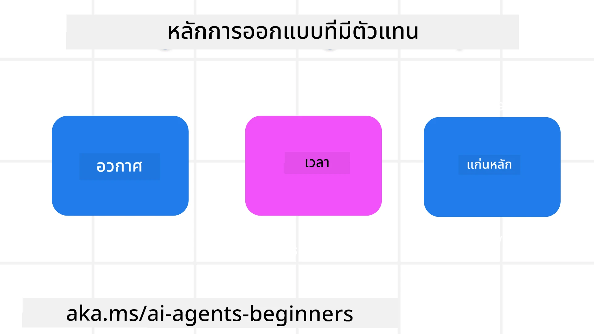

<!--
CO_OP_TRANSLATOR_METADATA:
{
  "original_hash": "d71524fe83a23829ae7a23b4031aaac8",
  "translation_date": "2025-11-13T12:40:29+00:00",
  "source_file": "03-agentic-design-patterns/README.md",
  "language_code": "th"
}
-->

> _(คลิกที่ภาพด้านบนเพื่อดูวิดีโอของบทเรียนนี้)_
# หลักการออกแบบ AI Agentic

## บทนำ

มีหลายวิธีในการคิดเกี่ยวกับการสร้างระบบ AI Agentic เนื่องจากความคลุมเครือเป็นคุณสมบัติหนึ่ง ไม่ใช่ข้อบกพร่องในงานออกแบบ Generative AI บางครั้งวิศวกรอาจพบว่ามันยากที่จะเริ่มต้น เราได้สร้างชุดหลักการออกแบบ UX ที่เน้นมนุษย์เป็นศูนย์กลางเพื่อช่วยให้นักพัฒนาสร้างระบบเอเจนต์ที่เน้นลูกค้าเพื่อตอบสนองความต้องการทางธุรกิจของพวกเขา หลักการออกแบบเหล่านี้ไม่ใช่สถาปัตยกรรมที่กำหนดไว้ล่วงหน้า แต่เป็นจุดเริ่มต้นสำหรับทีมที่กำลังนิยามและสร้างประสบการณ์ของเอเจนต์

โดยทั่วไปแล้ว เอเจนต์ควร:

- ขยายและเพิ่มขีดความสามารถของมนุษย์ (การระดมความคิด การแก้ปัญหา การทำงานอัตโนมัติ ฯลฯ)
- เติมเต็มช่องว่างของความรู้ (ช่วยให้เข้าใจในโดเมนความรู้ การแปล ฯลฯ)
- อำนวยความสะดวกและสนับสนุนการทำงานร่วมกันในวิธีที่เราชอบทำงานกับผู้อื่น
- ทำให้เราเป็นเวอร์ชันที่ดีกว่าของตัวเอง (เช่น โค้ชชีวิต/ผู้จัดการงาน ช่วยให้เราเรียนรู้การควบคุมอารมณ์และทักษะการมีสติ สร้างความยืดหยุ่น ฯลฯ)

## บทเรียนนี้จะครอบคลุม

- หลักการออกแบบ Agentic คืออะไร
- แนวทางที่ควรปฏิบัติขณะนำหลักการออกแบบเหล่านี้ไปใช้
- ตัวอย่างการใช้หลักการออกแบบ

## เป้าหมายการเรียนรู้

หลังจากจบบทเรียนนี้ คุณจะสามารถ:

1. อธิบายว่าหลักการออกแบบ Agentic คืออะไร
2. อธิบายแนวทางการใช้หลักการออกแบบ Agentic
3. เข้าใจวิธีสร้างเอเจนต์โดยใช้หลักการออกแบบ Agentic

## หลักการออกแบบ Agentic

### เอเจนต์ (พื้นที่)

นี่คือสภาพแวดล้อมที่เอเจนต์ทำงาน หลักการเหล่านี้ช่วยกำหนดวิธีการออกแบบเอเจนต์สำหรับการมีส่วนร่วมในโลกทางกายภาพและดิจิทัล

- **เชื่อมโยง ไม่ใช่ลดทอน** – ช่วยเชื่อมโยงผู้คนกับผู้อื่น เหตุการณ์ และความรู้ที่สามารถนำไปปฏิบัติได้ เพื่อส่งเสริมการทำงานร่วมกันและการเชื่อมต่อ
- เอเจนต์ช่วยเชื่อมโยงเหตุการณ์ ความรู้ และผู้คน
- เอเจนต์นำผู้คนมาใกล้ชิดกันมากขึ้น ไม่ได้ออกแบบมาเพื่อแทนที่หรือทำให้ผู้คนด้อยค่า
- **เข้าถึงได้ง่ายแต่บางครั้งก็ล่องหน** – เอเจนต์ทำงานส่วนใหญ่ในเบื้องหลังและจะเตือนเราเมื่อมีความเกี่ยวข้องและเหมาะสม
  - เอเจนต์สามารถค้นพบและเข้าถึงได้ง่ายสำหรับผู้ใช้ที่ได้รับอนุญาตบนอุปกรณ์หรือแพลตฟอร์มใด ๆ
  - เอเจนต์รองรับอินพุตและเอาต์พุตหลายรูปแบบ (เสียง ข้อความ ฯลฯ)
  - เอเจนต์สามารถเปลี่ยนระหว่างเบื้องหน้าและเบื้องหลังได้อย่างราบรื่น ระหว่างการทำงานเชิงรุกและเชิงรับ ขึ้นอยู่กับการรับรู้ความต้องการของผู้ใช้
  - เอเจนต์อาจทำงานในรูปแบบที่มองไม่เห็น แต่กระบวนการเบื้องหลังและการทำงานร่วมกับเอเจนต์อื่น ๆ นั้นโปร่งใสและสามารถควบคุมได้โดยผู้ใช้

### เอเจนต์ (เวลา)

นี่คือวิธีที่เอเจนต์ทำงานในช่วงเวลา หลักการเหล่านี้ช่วยกำหนดวิธีการออกแบบเอเจนต์ที่มีปฏิสัมพันธ์กับอดีต ปัจจุบัน และอนาคต

- **อดีต**: สะท้อนประวัติศาสตร์ที่รวมถึงสถานะและบริบท
  - เอเจนต์ให้ผลลัพธ์ที่เกี่ยวข้องมากขึ้นโดยอิงจากการวิเคราะห์ข้อมูลในอดีตที่หลากหลายกว่าแค่เหตุการณ์ ผู้คน หรือสถานะ
  - เอเจนต์สร้างการเชื่อมโยงจากเหตุการณ์ในอดีตและสะท้อนความทรงจำอย่างกระตือรือร้นเพื่อมีส่วนร่วมกับสถานการณ์ปัจจุบัน
- **ปัจจุบัน**: กระตุ้นมากกว่าการแจ้งเตือน
  - เอเจนต์มีแนวทางที่ครอบคลุมในการโต้ตอบกับผู้คน เมื่อเกิดเหตุการณ์ขึ้น เอเจนต์จะไปไกลกว่าการแจ้งเตือนแบบคงที่หรือรูปแบบทางการอื่น ๆ เอเจนต์สามารถทำให้กระบวนการง่ายขึ้นหรือสร้างคำแนะนำแบบไดนามิกเพื่อดึงดูดความสนใจของผู้ใช้ในเวลาที่เหมาะสม
  - เอเจนต์ส่งมอบข้อมูลตามสภาพแวดล้อมบริบท การเปลี่ยนแปลงทางสังคมและวัฒนธรรม และปรับให้เหมาะกับเจตนาของผู้ใช้
  - การโต้ตอบของเอเจนต์สามารถค่อยเป็นค่อยไป พัฒนา/เติบโตในความซับซ้อนเพื่อเพิ่มพลังให้ผู้ใช้ในระยะยาว
- **อนาคต**: ปรับตัวและพัฒนา
  - เอเจนต์ปรับให้เข้ากับอุปกรณ์ แพลตฟอร์ม และรูปแบบต่าง ๆ
  - เอเจนต์ปรับให้เข้ากับพฤติกรรมของผู้ใช้ ความต้องการการเข้าถึง และสามารถปรับแต่งได้อย่างอิสระ
  - เอเจนต์ถูกกำหนดโดยและพัฒนาผ่านการโต้ตอบกับผู้ใช้อย่างต่อเนื่อง

### เอเจนต์ (แกนหลัก)

นี่คือองค์ประกอบสำคัญในแกนหลักของการออกแบบเอเจนต์

- **ยอมรับความไม่แน่นอนแต่สร้างความไว้วางใจ**
  - ระดับหนึ่งของความไม่แน่นอนของเอเจนต์เป็นสิ่งที่คาดหวัง ความไม่แน่นอนเป็นองค์ประกอบสำคัญของการออกแบบเอเจนต์
  - ความไว้วางใจและความโปร่งใสเป็นชั้นพื้นฐานของการออกแบบเอเจนต์
  - มนุษย์ควบคุมได้ว่าเมื่อใดที่เอเจนต์เปิด/ปิด และสถานะของเอเจนต์จะมองเห็นได้ชัดเจนตลอดเวลา

## แนวทางการนำหลักการเหล่านี้ไปใช้

เมื่อคุณใช้หลักการออกแบบก่อนหน้านี้ ให้ใช้แนวทางดังนี้:

1. **ความโปร่งใส**: แจ้งให้ผู้ใช้ทราบว่า AI มีส่วนเกี่ยวข้องอย่างไร ทำงานอย่างไร (รวมถึงการกระทำในอดีต) และวิธีให้ข้อเสนอแนะและปรับเปลี่ยนระบบ
2. **การควบคุม**: ให้ผู้ใช้สามารถปรับแต่ง ระบุความชอบ และปรับเปลี่ยนระบบและคุณลักษณะของระบบได้ (รวมถึงความสามารถในการลืม)
3. **ความสม่ำเสมอ**: มุ่งเน้นประสบการณ์ที่สอดคล้องกันในหลายรูปแบบและอุปกรณ์ ใช้องค์ประกอบ UI/UX ที่คุ้นเคยเมื่อเป็นไปได้ (เช่น ไอคอนไมโครโฟนสำหรับการโต้ตอบด้วยเสียง) และลดภาระทางปัญญาของลูกค้าให้มากที่สุด (เช่น มุ่งเน้นการตอบสนองที่กระชับ การช่วยเหลือด้วยภาพ และเนื้อหา ‘เรียนรู้เพิ่มเติม’)

## วิธีออกแบบเอเจนต์การท่องเที่ยวโดยใช้หลักการและแนวทางเหล่านี้

ลองจินตนาการว่าคุณกำลังออกแบบเอเจนต์การท่องเที่ยว นี่คือตัวอย่างการใช้หลักการและแนวทาง:

1. **ความโปร่งใส** – แจ้งให้ผู้ใช้ทราบว่าเอเจนต์การท่องเที่ยวเป็นเอเจนต์ที่ใช้ AI ให้คำแนะนำพื้นฐานเกี่ยวกับวิธีเริ่มต้น (เช่น ข้อความ “สวัสดี” ตัวอย่างคำสั่ง) ระบุไว้อย่างชัดเจนในหน้าผลิตภัณฑ์ แสดงรายการคำสั่งที่ผู้ใช้เคยถามในอดีต ทำให้ชัดเจนว่าจะแสดงความคิดเห็นได้อย่างไร (เช่น ปุ่มยกนิ้วขึ้นและลง ปุ่มส่งความคิดเห็น ฯลฯ) ระบุอย่างชัดเจนหากเอเจนต์มีข้อจำกัดในการใช้งานหรือหัวข้อ
2. **การควบคุม** – ทำให้ชัดเจนว่าผู้ใช้สามารถปรับเปลี่ยนเอเจนต์ได้อย่างไรหลังจากที่สร้างขึ้นแล้ว เช่น การตั้งค่าระบบ ให้ผู้ใช้เลือกได้ว่าเอเจนต์จะพูดมากน้อยเพียงใด สไตล์การเขียน และข้อจำกัดใด ๆ ที่เอเจนต์ไม่ควรพูดถึง อนุญาตให้ผู้ใช้ดูและลบไฟล์หรือข้อมูล คำสั่ง และการสนทนาในอดีตที่เกี่ยวข้อง
3. **ความสม่ำเสมอ** – ตรวจสอบให้แน่ใจว่าไอคอนสำหรับการแชร์คำสั่ง การเพิ่มไฟล์หรือรูปภาพ และการแท็กใครหรือสิ่งใดเป็นมาตรฐานและจดจำได้ ใช้ไอคอนคลิปหนีบกระดาษเพื่อแสดงถึงการอัปโหลด/แชร์ไฟล์กับเอเจนต์ และไอคอนรูปภาพเพื่อแสดงถึงการอัปโหลดกราฟิก

## ตัวอย่างโค้ด

- Python: [Agent Framework](./code_samples/03-python-agent-framework.ipynb)
- .NET: [Agent Framework](./code_samples/03-dotnet-agent-framework.md)

## มีคำถามเพิ่มเติมเกี่ยวกับรูปแบบการออกแบบ AI Agentic หรือไม่?

เข้าร่วม [Azure AI Foundry Discord](https://aka.ms/ai-agents/discord) เพื่อพบปะกับผู้เรียนคนอื่น ๆ เข้าร่วมชั่วโมงทำการ และรับคำตอบสำหรับคำถามเกี่ยวกับ AI Agents ของคุณ

## แหล่งข้อมูลเพิ่มเติม

- <a href="https://openai.com" target="_blank">แนวทางปฏิบัติสำหรับการกำกับดูแลระบบ AI Agentic | OpenAI</a>
- <a href="https://microsoft.com" target="_blank">โครงการ HAX Toolkit - Microsoft Research</a>
- <a href="https://responsibleaitoolbox.ai" target="_blank">Responsible AI Toolbox</a>

## บทเรียนก่อนหน้า

[สำรวจกรอบงาน Agentic](../02-explore-agentic-frameworks/README.md)

## บทเรียนถัดไป

[รูปแบบการออกแบบการใช้เครื่องมือ](../04-tool-use/README.md)

---

<!-- CO-OP TRANSLATOR DISCLAIMER START -->
**ข้อจำกัดความรับผิดชอบ**:  
เอกสารนี้ได้รับการแปลโดยใช้บริการแปลภาษา AI [Co-op Translator](https://github.com/Azure/co-op-translator) แม้ว่าเราจะพยายามให้การแปลมีความถูกต้อง แต่โปรดทราบว่าการแปลโดยอัตโนมัติอาจมีข้อผิดพลาดหรือความไม่ถูกต้อง เอกสารต้นฉบับในภาษาดั้งเดิมควรถือเป็นแหล่งข้อมูลที่เชื่อถือได้ สำหรับข้อมูลที่สำคัญ ขอแนะนำให้ใช้บริการแปลภาษามืออาชีพ เราไม่รับผิดชอบต่อความเข้าใจผิดหรือการตีความผิดที่เกิดจากการใช้การแปลนี้
<!-- CO-OP TRANSLATOR DISCLAIMER END -->