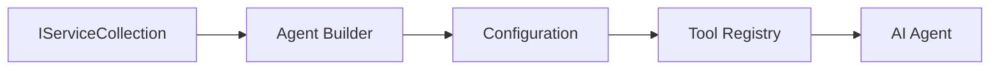

<!--
CO_OP_TRANSLATOR_METADATA:
{
  "original_hash": "bcc874e190347bd6a095aed56dc16de8",
  "translation_date": "2025-11-13T12:41:40+00:00",
  "source_file": "03-agentic-design-patterns/code_samples/03-dotnet-agent-framework.md",
  "language_code": "th"
}
-->
# 🎨 รูปแบบการออกแบบเชิงตัวแทนกับ GitHub Models (.NET)

## 📋 วัตถุประสงค์การเรียนรู้

ตัวอย่างนี้แสดงรูปแบบการออกแบบระดับองค์กรสำหรับการสร้างตัวแทนอัจฉริยะโดยใช้ Microsoft Agent Framework ใน .NET พร้อมการผสานรวม GitHub Models คุณจะได้เรียนรู้รูปแบบการออกแบบและแนวทางสถาปัตยกรรมที่ทำให้ตัวแทนพร้อมใช้งานในระดับการผลิต ดูแลรักษาได้ และขยายขนาดได้

### รูปแบบการออกแบบระดับองค์กร

- 🏭 **Factory Pattern**: การสร้างตัวแทนที่เป็นมาตรฐานด้วย dependency injection
- 🔧 **Builder Pattern**: การตั้งค่าและกำหนดค่าตัวแทนแบบ fluent
- 🧵 **Thread-Safe Patterns**: การจัดการการสนทนาแบบพร้อมกัน
- 📋 **Repository Pattern**: การจัดการเครื่องมือและความสามารถอย่างเป็นระเบียบ

## 🎯 ประโยชน์ทางสถาปัตยกรรมเฉพาะ .NET

### คุณสมบัติระดับองค์กร

- **Strong Typing**: การตรวจสอบความถูกต้องในขณะคอมไพล์และการสนับสนุน IntelliSense
- **Dependency Injection**: การผสานรวม DI container ในตัว
- **Configuration Management**: รูปแบบ IConfiguration และ Options
- **Async/Await**: การสนับสนุนการเขียนโปรแกรมแบบ asynchronous ระดับสูง

### รูปแบบที่พร้อมใช้งานในระดับการผลิต

- **Logging Integration**: การสนับสนุน ILogger และ structured logging
- **Health Checks**: การตรวจสอบและวินิจฉัยในตัว
- **Configuration Validation**: การพิมพ์ที่แข็งแกร่งด้วย data annotations
- **Error Handling**: การจัดการข้อยกเว้นที่มีโครงสร้าง

## 🔧 สถาปัตยกรรมทางเทคนิค

### ส่วนประกอบหลักของ .NET

- **Microsoft.Extensions.AI**: การย่อส่วนบริการ AI แบบรวม
- **Microsoft.Agents.AI**: เฟรมเวิร์กการจัดการตัวแทนระดับองค์กร
- **GitHub Models Integration**: รูปแบบ API client ที่มีประสิทธิภาพสูง
- **Configuration System**: การผสานรวม appsettings.json และ environment

### การนำรูปแบบการออกแบบไปใช้



## 🏗️ รูปแบบระดับองค์กรที่แสดงให้เห็น

### 1. **Creational Patterns**

- **Agent Factory**: การสร้างตัวแทนแบบรวมศูนย์ด้วยการกำหนดค่าที่สอดคล้องกัน
- **Builder Pattern**: API แบบ fluent สำหรับการกำหนดค่าตัวแทนที่ซับซ้อน
- **Singleton Pattern**: การจัดการทรัพยากรและการกำหนดค่าที่ใช้ร่วมกัน
- **Dependency Injection**: การเชื่อมโยงที่หลวมและการทดสอบได้

### 2. **Behavioral Patterns**

- **Strategy Pattern**: กลยุทธ์การดำเนินการเครื่องมือที่เปลี่ยนแปลงได้
- **Command Pattern**: การดำเนินการตัวแทนที่ถูกห่อหุ้มด้วย undo/redo
- **Observer Pattern**: การจัดการวงจรชีวิตตัวแทนแบบขับเคลื่อนด้วยเหตุการณ์
- **Template Method**: เวิร์กโฟลว์การดำเนินการตัวแทนที่เป็นมาตรฐาน

### 3. **Structural Patterns**

- **Adapter Pattern**: ชั้นการผสานรวม API ของ GitHub Models
- **Decorator Pattern**: การเพิ่มความสามารถของตัวแทน
- **Facade Pattern**: อินเทอร์เฟซการโต้ตอบตัวแทนที่ง่ายขึ้น
- **Proxy Pattern**: การโหลดแบบ lazy และการแคชเพื่อประสิทธิภาพ

## 📚 หลักการออกแบบ .NET

### หลักการ SOLID

- **Single Responsibility**: แต่ละส่วนประกอบมีวัตถุประสงค์ที่ชัดเจน
- **Open/Closed**: ขยายได้โดยไม่ต้องแก้ไข
- **Liskov Substitution**: การใช้งานเครื่องมือที่ใช้พื้นฐานจากอินเทอร์เฟซ
- **Interface Segregation**: อินเทอร์เฟซที่มุ่งเน้นและสอดคล้อง
- **Dependency Inversion**: พึ่งพาการย่อส่วน ไม่ใช่การใช้งานจริง

### สถาปัตยกรรมที่สะอาด

- **Domain Layer**: การย่อส่วนตัวแทนและเครื่องมือหลัก
- **Application Layer**: การจัดการตัวแทนและเวิร์กโฟลว์
- **Infrastructure Layer**: การผสานรวม GitHub Models และบริการภายนอก
- **Presentation Layer**: การโต้ตอบกับผู้ใช้และการจัดรูปแบบการตอบสนอง

## 🔒 ข้อควรพิจารณาระดับองค์กร

### ความปลอดภัย

- **Credential Management**: การจัดการ API key อย่างปลอดภัยด้วย IConfiguration
- **Input Validation**: การพิมพ์ที่แข็งแกร่งและการตรวจสอบด้วย data annotation
- **Output Sanitization**: การประมวลผลและกรองการตอบสนองอย่างปลอดภัย
- **Audit Logging**: การติดตามการดำเนินการอย่างครอบคลุม

### ประสิทธิภาพ

- **Async Patterns**: การดำเนินการ I/O แบบไม่บล็อก
- **Connection Pooling**: การจัดการ HTTP client อย่างมีประสิทธิภาพ
- **Caching**: การแคชการตอบสนองเพื่อปรับปรุงประสิทธิภาพ
- **Resource Management**: รูปแบบการกำจัดและการทำความสะอาดที่เหมาะสม

### การขยายขนาด

- **Thread Safety**: การสนับสนุนการดำเนินการตัวแทนแบบพร้อมกัน
- **Resource Pooling**: การใช้ทรัพยากรอย่างมีประสิทธิภาพ
- **Load Management**: การจำกัดอัตราและการจัดการ backpressure
- **Monitoring**: เมตริกประสิทธิภาพและการตรวจสอบสุขภาพ

## 🚀 การปรับใช้ในระดับการผลิต

- **Configuration Management**: การตั้งค่าที่เฉพาะเจาะจงสำหรับ environment
- **Logging Strategy**: การบันทึกแบบมีโครงสร้างพร้อม ID การเชื่อมโยง
- **Error Handling**: การจัดการข้อยกเว้นทั่วโลกพร้อมการกู้คืนที่เหมาะสม
- **Monitoring**: Application insights และตัวนับประสิทธิภาพ
- **Testing**: รูปแบบการทดสอบหน่วย การทดสอบการผสานรวม และการทดสอบโหลด

พร้อมที่จะสร้างตัวแทนอัจฉริยะระดับองค์กรด้วย .NET แล้วหรือยัง? มาสร้างสิ่งที่แข็งแกร่งกันเถอะ! 🏢✨

## 🚀 เริ่มต้นใช้งาน

### ข้อกำหนดเบื้องต้น

- [.NET 10 SDK](https://dotnet.microsoft.com/download/dotnet/10.0) หรือสูงกว่า
- [GitHub Models API access token](https://docs.github.com/github-models/github-models-at-scale/using-your-own-api-keys-in-github-models)

### ตัวแปรสภาพแวดล้อมที่จำเป็น

```bash
# zsh/bash
export GH_TOKEN=<your_github_token>
export GH_ENDPOINT=https://models.github.ai/inference
export GH_MODEL_ID=openai/gpt-5-mini
```

```powershell
# PowerShell
$env:GH_TOKEN = "<your_github_token>"
$env:GH_ENDPOINT = "https://models.github.ai/inference"
$env:GH_MODEL_ID = "openai/gpt-5-mini"
```

### ตัวอย่างโค้ด

เพื่อรันตัวอย่างโค้ด,

```bash
# zsh/bash
chmod +x ./03-dotnet-agent-framework.cs
./03-dotnet-agent-framework.cs
```

หรือใช้ dotnet CLI:

```bash
dotnet run ./03-dotnet-agent-framework.cs
```

ดู [`03-dotnet-agent-framework.cs`](../../../../03-agentic-design-patterns/code_samples/03-dotnet-agent-framework.cs) สำหรับโค้ดทั้งหมด

```csharp
#!/usr/bin/dotnet run

#:package Microsoft.Extensions.AI@10.*
#:package Microsoft.Agents.AI.OpenAI@1.*-*

using System.ClientModel;
using System.ComponentModel;

using Microsoft.Agents.AI;
using Microsoft.Extensions.AI;

using OpenAI;

// Tool Function: Random Destination Generator
// This static method will be available to the agent as a callable tool
// The [Description] attribute helps the AI understand when to use this function
// This demonstrates how to create custom tools for AI agents
[Description("Provides a random vacation destination.")]
static string GetRandomDestination()
{
    // List of popular vacation destinations around the world
    // The agent will randomly select from these options
    var destinations = new List<string>
    {
        "Paris, France",
        "Tokyo, Japan",
        "New York City, USA",
        "Sydney, Australia",
        "Rome, Italy",
        "Barcelona, Spain",
        "Cape Town, South Africa",
        "Rio de Janeiro, Brazil",
        "Bangkok, Thailand",
        "Vancouver, Canada"
    };

    // Generate random index and return selected destination
    // Uses System.Random for simple random selection
    var random = new Random();
    int index = random.Next(destinations.Count);
    return destinations[index];
}

// Extract configuration from environment variables
// Retrieve the GitHub Models API endpoint, defaults to https://models.github.ai/inference if not specified
// Retrieve the model ID, defaults to openai/gpt-5-mini if not specified
// Retrieve the GitHub token for authentication, throws exception if not specified
var github_endpoint = Environment.GetEnvironmentVariable("GH_ENDPOINT") ?? "https://models.github.ai/inference";
var github_model_id = Environment.GetEnvironmentVariable("GH_MODEL_ID") ?? "openai/gpt-5-mini";
var github_token = Environment.GetEnvironmentVariable("GH_TOKEN") ?? throw new InvalidOperationException("GH_TOKEN is not set.");

// Configure OpenAI Client Options
// Create configuration options to point to GitHub Models endpoint
// This redirects OpenAI client calls to GitHub's model inference service
var openAIOptions = new OpenAIClientOptions()
{
    Endpoint = new Uri(github_endpoint)
};

// Initialize OpenAI Client with GitHub Models Configuration
// Create OpenAI client using GitHub token for authentication
// Configure it to use GitHub Models endpoint instead of OpenAI directly
var openAIClient = new OpenAIClient(new ApiKeyCredential(github_token), openAIOptions);

// Define Agent Identity and Comprehensive Instructions
// Agent name for identification and logging purposes
var AGENT_NAME = "TravelAgent";

// Detailed instructions that define the agent's personality, capabilities, and behavior
// This system prompt shapes how the agent responds and interacts with users
var AGENT_INSTRUCTIONS = """
You are a helpful AI Agent that can help plan vacations for customers.

Important: When users specify a destination, always plan for that location. Only suggest random destinations when the user hasn't specified a preference.

When the conversation begins, introduce yourself with this message:
"Hello! I'm your TravelAgent assistant. I can help plan vacations and suggest interesting destinations for you. Here are some things you can ask me:
1. Plan a day trip to a specific location
2. Suggest a random vacation destination
3. Find destinations with specific features (beaches, mountains, historical sites, etc.)
4. Plan an alternative trip if you don't like my first suggestion

What kind of trip would you like me to help you plan today?"

Always prioritize user preferences. If they mention a specific destination like "Bali" or "Paris," focus your planning on that location rather than suggesting alternatives.
""";

// Create AI Agent with Advanced Travel Planning Capabilities
// Initialize complete agent pipeline: OpenAI client → Chat client → AI agent
// Configure agent with name, detailed instructions, and available tools
// This demonstrates the .NET agent creation pattern with full configuration
AIAgent agent = openAIClient
    .GetChatClient(github_model_id)
    .CreateAIAgent(
        name: AGENT_NAME,
        instructions: AGENT_INSTRUCTIONS,
        tools: [AIFunctionFactory.Create(GetRandomDestination)]
    );

// Create New Conversation Thread for Context Management
// Initialize a new conversation thread to maintain context across multiple interactions
// Threads enable the agent to remember previous exchanges and maintain conversational state
// This is essential for multi-turn conversations and contextual understanding
AgentThread thread = agent.GetNewThread();

// Execute Agent: First Travel Planning Request
// Run the agent with an initial request that will likely trigger the random destination tool
// The agent will analyze the request, use the GetRandomDestination tool, and create an itinerary
// Using the thread parameter maintains conversation context for subsequent interactions
await foreach (var update in agent.RunStreamingAsync("Plan me a day trip", thread))
{
    await Task.Delay(10);
    Console.Write(update);
}

Console.WriteLine();

// Execute Agent: Follow-up Request with Context Awareness
// Demonstrate contextual conversation by referencing the previous response
// The agent remembers the previous destination suggestion and will provide an alternative
// This showcases the power of conversation threads and contextual understanding in .NET agents
await foreach (var update in agent.RunStreamingAsync("I don't like that destination. Plan me another vacation.", thread))
{
    await Task.Delay(10);
    Console.Write(update);
}
```

---

<!-- CO-OP TRANSLATOR DISCLAIMER START -->
**ข้อจำกัดความรับผิดชอบ**:  
เอกสารนี้ได้รับการแปลโดยใช้บริการแปลภาษา AI [Co-op Translator](https://github.com/Azure/co-op-translator) แม้ว่าเราจะพยายามให้การแปลมีความถูกต้อง แต่โปรดทราบว่าการแปลอัตโนมัติอาจมีข้อผิดพลาดหรือความไม่ถูกต้อง เอกสารต้นฉบับในภาษาดั้งเดิมควรถือเป็นแหล่งข้อมูลที่เชื่อถือได้ สำหรับข้อมูลที่สำคัญ ขอแนะนำให้ใช้บริการแปลภาษามืออาชีพ เราไม่รับผิดชอบต่อความเข้าใจผิดหรือการตีความผิดที่เกิดจากการใช้การแปลนี้
<!-- CO-OP TRANSLATOR DISCLAIMER END -->