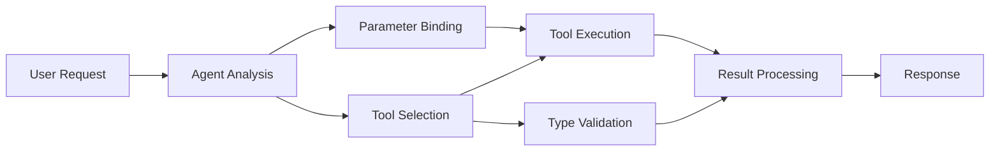

<!--
CO_OP_TRANSLATOR_METADATA:
{
  "original_hash": "91d6061e402489603f2ec8b528cae59b",
  "translation_date": "2025-11-18T17:35:27+00:00",
  "source_file": "04-tool-use/code_samples/04-dotnet-agent-framework.md",
  "language_code": "th"
}
-->
# 🛠️ การใช้งานเครื่องมือขั้นสูงกับ GitHub Models (.NET)

## 📋 วัตถุประสงค์การเรียนรู้

โน้ตบุ๊กนี้แสดงรูปแบบการผสานรวมเครื่องมือระดับองค์กรโดยใช้ Microsoft Agent Framework ใน .NET กับ GitHub Models คุณจะได้เรียนรู้การสร้างเอเจนต์ที่ซับซ้อนด้วยเครื่องมือเฉพาะทางหลายตัว โดยใช้ประโยชน์จากการพิมพ์ที่แข็งแกร่งของ C# และคุณสมบัติระดับองค์กรของ .NET

### ความสามารถของเครื่องมือขั้นสูงที่คุณจะเชี่ยวชาญ

- 🔧 **สถาปัตยกรรมหลายเครื่องมือ**: การสร้างเอเจนต์ที่มีความสามารถเฉพาะทางหลายอย่าง
- 🎯 **การดำเนินการเครื่องมือที่ปลอดภัยต่อประเภท**: ใช้ประโยชน์จากการตรวจสอบในช่วงคอมไพล์ของ C#
- 📊 **รูปแบบเครื่องมือระดับองค์กร**: การออกแบบเครื่องมือที่พร้อมใช้งานในระดับการผลิตและการจัดการข้อผิดพลาด
- 🔗 **การผสมผสานเครื่องมือ**: การรวมเครื่องมือเพื่อเวิร์กโฟลว์ทางธุรกิจที่ซับซ้อน

## 🎯 ประโยชน์ของสถาปัตยกรรมเครื่องมือ .NET

### คุณสมบัติเครื่องมือระดับองค์กร

- **การตรวจสอบในช่วงคอมไพล์**: การพิมพ์ที่แข็งแกร่งช่วยให้มั่นใจถึงความถูกต้องของพารามิเตอร์เครื่องมือ
- **Dependency Injection**: การผสานรวม IoC container สำหรับการจัดการเครื่องมือ
- **รูปแบบ Async/Await**: การดำเนินการเครื่องมือแบบไม่บล็อกด้วยการจัดการทรัพยากรที่เหมาะสม
- **การบันทึกแบบมีโครงสร้าง**: การผสานรวมการบันทึกในตัวสำหรับการติดตามการดำเนินการเครื่องมือ

### รูปแบบที่พร้อมใช้งานในระดับการผลิต

- **การจัดการข้อยกเว้น**: การจัดการข้อผิดพลาดที่ครอบคลุมด้วยข้อยกเว้นที่พิมพ์
- **การจัดการทรัพยากร**: รูปแบบการกำจัดที่เหมาะสมและการจัดการหน่วยความจำ
- **การตรวจสอบประสิทธิภาพ**: เมตริกในตัวและตัวนับประสิทธิภาพ
- **การจัดการการกำหนดค่า**: การกำหนดค่าที่ปลอดภัยต่อประเภทพร้อมการตรวจสอบ

## 🔧 สถาปัตยกรรมทางเทคนิค

### ส่วนประกอบเครื่องมือหลักของ .NET

- **Microsoft.Extensions.AI**: ชั้นนามธรรมของเครื่องมือแบบรวม
- **Microsoft.Agents.AI**: การจัดการเครื่องมือระดับองค์กร
- **การผสานรวม GitHub Models**: ไคลเอนต์ API ประสิทธิภาพสูงพร้อมการจัดการการเชื่อมต่อ

### ท่อการดำเนินการเครื่องมือ



## 🛠️ หมวดหมู่และรูปแบบของเครื่องมือ

### 1. **เครื่องมือประมวลผลข้อมูล**

- **การตรวจสอบอินพุต**: การพิมพ์ที่แข็งแกร่งด้วยคำอธิบายประกอบข้อมูล
- **การดำเนินการแปลง**: การแปลงและการจัดรูปแบบข้อมูลที่ปลอดภัยต่อประเภท
- **ตรรกะทางธุรกิจ**: เครื่องมือคำนวณและวิเคราะห์เฉพาะโดเมน
- **การจัดรูปแบบผลลัพธ์**: การสร้างการตอบสนองที่มีโครงสร้าง

### 2. **เครื่องมือการผสานรวม**

- **ตัวเชื่อมต่อ API**: การผสานรวมบริการ RESTful ด้วย HttpClient
- **เครื่องมือฐานข้อมูล**: การผสานรวม Entity Framework สำหรับการเข้าถึงข้อมูล
- **การดำเนินการไฟล์**: การดำเนินการระบบไฟล์ที่ปลอดภัยพร้อมการตรวจสอบ
- **บริการภายนอก**: รูปแบบการผสานรวมบริการของบุคคลที่สาม

### 3. **เครื่องมืออรรถประโยชน์**

- **การประมวลผลข้อความ**: การจัดการและการจัดรูปแบบสตริง
- **การดำเนินการวันที่/เวลา**: การคำนวณวันที่/เวลาที่คำนึงถึงวัฒนธรรม
- **เครื่องมือคณิตศาสตร์**: การคำนวณที่แม่นยำและการดำเนินการทางสถิติ
- **เครื่องมือตรวจสอบ**: การตรวจสอบกฎทางธุรกิจและการยืนยันข้อมูล

พร้อมที่จะสร้างเอเจนต์ระดับองค์กรด้วยความสามารถของเครื่องมือที่ทรงพลังและปลอดภัยต่อประเภทใน .NET แล้วหรือยัง? มาออกแบบโซลูชันระดับมืออาชีพกันเถอะ! 🏢⚡

## 🚀 เริ่มต้นใช้งาน

### ข้อกำหนดเบื้องต้น

- [.NET 10 SDK](https://dotnet.microsoft.com/download/dotnet/10.0) หรือสูงกว่า
- [โทเค็นการเข้าถึง GitHub Models API](https://docs.github.com/github-models/github-models-at-scale/using-your-own-api-keys-in-github-models)

### ตัวแปรสภาพแวดล้อมที่จำเป็น

```bash
# zsh/bash
export GH_TOKEN=<your_github_token>
export GH_ENDPOINT=https://models.github.ai/inference
export GH_MODEL_ID=openai/gpt-5-mini
```

```powershell
# PowerShell
$env:GH_TOKEN = "<your_github_token>"
$env:GH_ENDPOINT = "https://models.github.ai/inference"
$env:GH_MODEL_ID = "openai/gpt-5-mini"
```

### ตัวอย่างโค้ด

เพื่อรันตัวอย่างโค้ด,

```bash
# zsh/bash
chmod +x ./04-dotnet-agent-framework.cs
./04-dotnet-agent-framework.cs
```

หรือใช้ dotnet CLI:

```bash
dotnet run ./04-dotnet-agent-framework.cs
```

ดู [`04-dotnet-agent-framework.cs`](../../../../04-tool-use/code_samples/04-dotnet-agent-framework.cs) สำหรับโค้ดทั้งหมด

```csharp
#!/usr/bin/dotnet run

#:package Microsoft.Extensions.AI@10.*
#:package Microsoft.Agents.AI.OpenAI@1.*-*

using System.ClientModel;
using System.ComponentModel;

using Microsoft.Agents.AI;
using Microsoft.Extensions.AI;

using OpenAI;

// Tool Function: Random Destination Generator
// This static method will be available to the agent as a callable tool
// The [Description] attribute helps the AI understand when to use this function
// This demonstrates how to create custom tools for AI agents
[Description("Provides a random vacation destination.")]
static string GetRandomDestination()
{
    // List of popular vacation destinations around the world
    // The agent will randomly select from these options
    var destinations = new List<string>
    {
        "Paris, France",
        "Tokyo, Japan",
        "New York City, USA",
        "Sydney, Australia",
        "Rome, Italy",
        "Barcelona, Spain",
        "Cape Town, South Africa",
        "Rio de Janeiro, Brazil",
        "Bangkok, Thailand",
        "Vancouver, Canada"
    };

    // Generate random index and return selected destination
    // Uses System.Random for simple random selection
    var random = new Random();
    int index = random.Next(destinations.Count);
    return destinations[index];
}

// Extract configuration from environment variables
// Retrieve the GitHub Models API endpoint, defaults to https://models.github.ai/inference if not specified
// Retrieve the model ID, defaults to openai/gpt-5-mini if not specified
// Retrieve the GitHub token for authentication, throws exception if not specified
var github_endpoint = Environment.GetEnvironmentVariable("GH_ENDPOINT") ?? "https://models.github.ai/inference";
var github_model_id = Environment.GetEnvironmentVariable("GH_MODEL_ID") ?? "openai/gpt-5-mini";
var github_token = Environment.GetEnvironmentVariable("GH_TOKEN") ?? throw new InvalidOperationException("GH_TOKEN is not set.");

// Configure OpenAI Client Options
// Create configuration options to point to GitHub Models endpoint
// This redirects OpenAI client calls to GitHub's model inference service
var openAIOptions = new OpenAIClientOptions()
{
    Endpoint = new Uri(github_endpoint)
};

// Initialize OpenAI Client with GitHub Models Configuration
// Create OpenAI client using GitHub token for authentication
// Configure it to use GitHub Models endpoint instead of OpenAI directly
var openAIClient = new OpenAIClient(new ApiKeyCredential(github_token), openAIOptions);

// Define Agent Identity and Comprehensive Instructions
// Agent name for identification and logging purposes
var AGENT_NAME = "TravelAgent";

// Detailed instructions that define the agent's personality, capabilities, and behavior
// This system prompt shapes how the agent responds and interacts with users
var AGENT_INSTRUCTIONS = """
You are a helpful AI Agent that can help plan vacations for customers.

Important: When users specify a destination, always plan for that location. Only suggest random destinations when the user hasn't specified a preference.

When the conversation begins, introduce yourself with this message:
"Hello! I'm your TravelAgent assistant. I can help plan vacations and suggest interesting destinations for you. Here are some things you can ask me:
1. Plan a day trip to a specific location
2. Suggest a random vacation destination
3. Find destinations with specific features (beaches, mountains, historical sites, etc.)
4. Plan an alternative trip if you don't like my first suggestion

What kind of trip would you like me to help you plan today?"

Always prioritize user preferences. If they mention a specific destination like "Bali" or "Paris," focus your planning on that location rather than suggesting alternatives.
""";

// Create AI Agent with Advanced Travel Planning Capabilities
// Initialize complete agent pipeline: OpenAI client → Chat client → AI agent
// Configure agent with name, detailed instructions, and available tools
// This demonstrates the .NET agent creation pattern with full configuration
AIAgent agent = openAIClient
    .GetChatClient(github_model_id)
    .CreateAIAgent(
        name: AGENT_NAME,
        instructions: AGENT_INSTRUCTIONS,
        tools: [AIFunctionFactory.Create(GetRandomDestination)]
    );

// Create New Conversation Thread for Context Management
// Initialize a new conversation thread to maintain context across multiple interactions
// Threads enable the agent to remember previous exchanges and maintain conversational state
// This is essential for multi-turn conversations and contextual understanding
AgentThread thread = agent.GetNewThread();

// Execute Agent: First Travel Planning Request
// Run the agent with an initial request that will likely trigger the random destination tool
// The agent will analyze the request, use the GetRandomDestination tool, and create an itinerary
// Using the thread parameter maintains conversation context for subsequent interactions
await foreach (var update in agent.RunStreamingAsync("Plan me a day trip", thread))
{
    await Task.Delay(10);
    Console.Write(update);
}

Console.WriteLine();

// Execute Agent: Follow-up Request with Context Awareness
// Demonstrate contextual conversation by referencing the previous response
// The agent remembers the previous destination suggestion and will provide an alternative
// This showcases the power of conversation threads and contextual understanding in .NET agents
await foreach (var update in agent.RunStreamingAsync("I don't like that destination. Plan me another vacation.", thread))
{
    await Task.Delay(10);
    Console.Write(update);
}
```

---

<!-- CO-OP TRANSLATOR DISCLAIMER START -->
**ข้อจำกัดความรับผิดชอบ**:  
เอกสารนี้ได้รับการแปลโดยใช้บริการแปลภาษา AI [Co-op Translator](https://github.com/Azure/co-op-translator) แม้ว่าเราจะพยายามให้การแปลมีความถูกต้อง แต่โปรดทราบว่าการแปลอัตโนมัติอาจมีข้อผิดพลาดหรือความไม่ถูกต้อง เอกสารต้นฉบับในภาษาต้นทางควรถือเป็นแหล่งข้อมูลที่เชื่อถือได้ สำหรับข้อมูลที่สำคัญ แนะนำให้ใช้บริการแปลภาษามนุษย์ที่เป็นมืออาชีพ เราไม่รับผิดชอบต่อความเข้าใจผิดหรือการตีความผิดที่เกิดจากการใช้การแปลนี้
<!-- CO-OP TRANSLATOR DISCLAIMER END -->