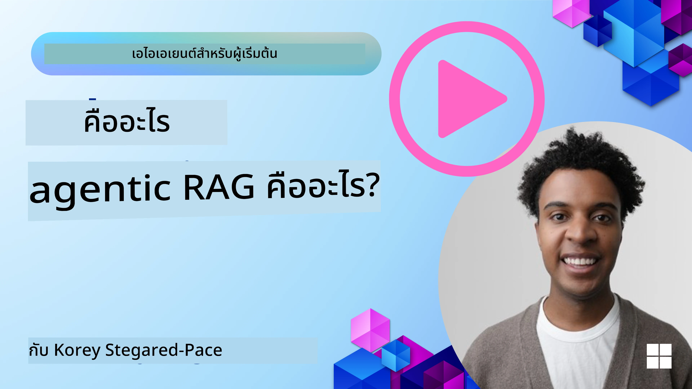
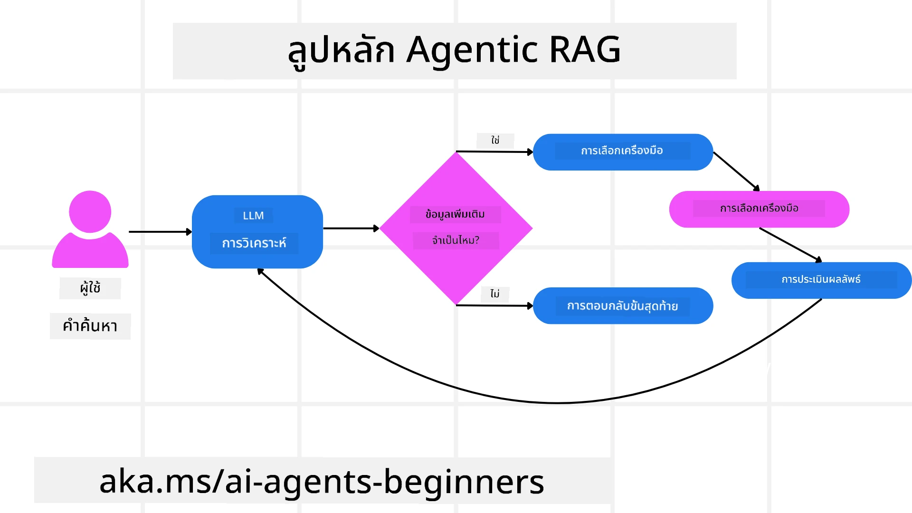
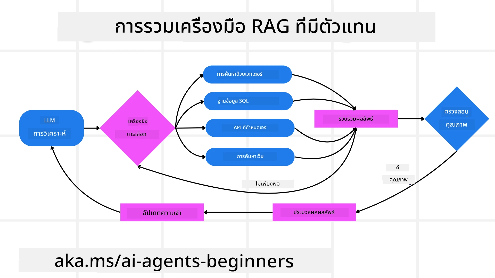
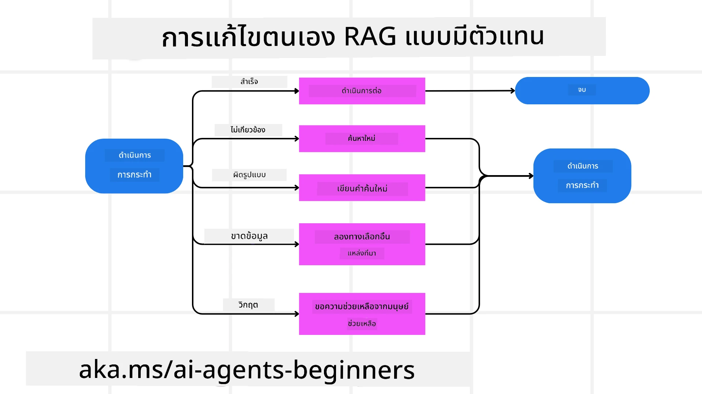

<!--
CO_OP_TRANSLATOR_METADATA:
{
  "original_hash": "0ebf6b2290db55dbf2d10cc49655523b",
  "translation_date": "2025-09-30T07:08:35+00:00",
  "source_file": "05-agentic-rag/README.md",
  "language_code": "th"
}
-->

> _(คลิกที่ภาพด้านบนเพื่อดูวิดีโอของบทเรียนนี้)_

# Agentic RAG

บทเรียนนี้ให้ภาพรวมที่ครอบคลุมเกี่ยวกับ Agentic Retrieval-Augmented Generation (Agentic RAG) ซึ่งเป็นแนวทางใหม่ใน AI ที่โมเดลภาษาขนาดใหญ่ (LLMs) สามารถวางแผนขั้นตอนต่อไปได้เองโดยดึงข้อมูลจากแหล่งภายนอก ต่างจากรูปแบบการดึงข้อมูลแบบคงที่แล้วอ่าน Agentic RAG ใช้การเรียก LLM แบบวนซ้ำ สลับกับการเรียกใช้เครื่องมือหรือฟังก์ชัน และสร้างผลลัพธ์ที่มีโครงสร้าง ระบบจะประเมินผลลัพธ์ ปรับปรุงคำค้นหา เรียกใช้เครื่องมือเพิ่มเติมหากจำเป็น และดำเนินการวนซ้ำนี้จนกว่าจะได้คำตอบที่น่าพอใจ

## บทนำ

บทเรียนนี้จะครอบคลุม

- **ทำความเข้าใจ Agentic RAG:** เรียนรู้เกี่ยวกับแนวทางใหม่ใน AI ที่โมเดลภาษาขนาดใหญ่ (LLMs) สามารถวางแผนขั้นตอนต่อไปได้เองโดยดึงข้อมูลจากแหล่งข้อมูลภายนอก
- **เข้าใจรูปแบบ Maker-Checker แบบวนซ้ำ:** เข้าใจวงจรการเรียก LLM แบบวนซ้ำ สลับกับการเรียกใช้เครื่องมือหรือฟังก์ชัน และสร้างผลลัพธ์ที่มีโครงสร้าง เพื่อปรับปรุงความถูกต้องและจัดการคำค้นหาที่ผิดพลาด
- **สำรวจการใช้งานจริง:** ระบุสถานการณ์ที่ Agentic RAG โดดเด่น เช่น สภาพแวดล้อมที่เน้นความถูกต้อง การโต้ตอบกับฐานข้อมูลที่ซับซ้อน และเวิร์กโฟลว์ที่ยาวนาน

## เป้าหมายการเรียนรู้

หลังจากจบบทเรียนนี้ คุณจะสามารถ:

- **เข้าใจ Agentic RAG:** เรียนรู้เกี่ยวกับแนวทางใหม่ใน AI ที่โมเดลภาษาขนาดใหญ่ (LLMs) สามารถวางแผนขั้นตอนต่อไปได้เองโดยดึงข้อมูลจากแหล่งข้อมูลภายนอก
- **รูปแบบ Maker-Checker แบบวนซ้ำ:** เข้าใจแนวคิดของวงจรการเรียก LLM แบบวนซ้ำ สลับกับการเรียกใช้เครื่องมือหรือฟังก์ชัน และสร้างผลลัพธ์ที่มีโครงสร้าง เพื่อปรับปรุงความถูกต้องและจัดการคำค้นหาที่ผิดพลาด
- **ควบคุมกระบวนการให้เหตุผล:** เข้าใจความสามารถของระบบในการควบคุมกระบวนการให้เหตุผลของตัวเอง โดยตัดสินใจว่าจะจัดการปัญหาอย่างไรโดยไม่ต้องพึ่งพาเส้นทางที่กำหนดไว้ล่วงหน้า
- **เวิร์กโฟลว์:** เข้าใจว่าโมเดลแบบ agentic สามารถตัดสินใจได้เองว่าจะดึงรายงานแนวโน้มตลาด ระบุข้อมูลคู่แข่ง เชื่อมโยงเมตริกการขายภายใน สังเคราะห์ผลลัพธ์ และประเมินกลยุทธ์
- **วงจรวนซ้ำ การรวมเครื่องมือ และหน่วยความจำ:** เรียนรู้เกี่ยวกับการพึ่งพารูปแบบการโต้ตอบแบบวนซ้ำของระบบ โดยรักษาสถานะและหน่วยความจำในแต่ละขั้นตอนเพื่อหลีกเลี่ยงวงจรที่ซ้ำซ้อนและตัดสินใจอย่างมีข้อมูล
- **จัดการโหมดความล้มเหลวและการแก้ไขตัวเอง:** สำรวจกลไกการแก้ไขตัวเองที่แข็งแกร่งของระบบ รวมถึงการวนซ้ำและการค้นหาใหม่ การใช้เครื่องมือวินิจฉัย และการพึ่งพาการดูแลของมนุษย์
- **ขอบเขตของความเป็นอิสระ:** เข้าใจข้อจำกัดของ Agentic RAG โดยเน้นที่ความเป็นอิสระเฉพาะโดเมน การพึ่งพาโครงสร้างพื้นฐาน และการเคารพข้อจำกัด
- **กรณีการใช้งานจริงและคุณค่า:** ระบุสถานการณ์ที่ Agentic RAG โดดเด่น เช่น สภาพแวดล้อมที่เน้นความถูกต้อง การโต้ตอบกับฐานข้อมูลที่ซับซ้อน และเวิร์กโฟลว์ที่ยาวนาน
- **การกำกับดูแล ความโปร่งใส และความไว้วางใจ:** เรียนรู้เกี่ยวกับความสำคัญของการกำกับดูแลและความโปร่งใส รวมถึงการให้เหตุผลที่อธิบายได้ การควบคุมอคติ และการดูแลของมนุษย์

## Agentic RAG คืออะไร?

Agentic Retrieval-Augmented Generation (Agentic RAG) เป็นแนวทางใหม่ใน AI ที่โมเดลภาษาขนาดใหญ่ (LLMs) สามารถวางแผนขั้นตอนต่อไปได้เองโดยดึงข้อมูลจากแหล่งภายนอก ต่างจากรูปแบบการดึงข้อมูลแบบคงที่แล้วอ่าน Agentic RAG ใช้การเรียก LLM แบบวนซ้ำ สลับกับการเรียกใช้เครื่องมือหรือฟังก์ชัน และสร้างผลลัพธ์ที่มีโครงสร้าง ระบบจะประเมินผลลัพธ์ ปรับปรุงคำค้นหา เรียกใช้เครื่องมือเพิ่มเติมหากจำเป็น และดำเนินการวนซ้ำนี้จนกว่าจะได้คำตอบที่น่าพอใจ รูปแบบ “maker-checker” แบบวนซ้ำนี้ช่วยปรับปรุงความถูกต้อง จัดการคำค้นหาที่ผิดพลาด และรับรองผลลัพธ์ที่มีคุณภาพสูง

ระบบสามารถควบคุมกระบวนการให้เหตุผลของตัวเองได้อย่างแข็งขัน โดยเขียนคำค้นหาที่ล้มเหลวใหม่ เลือกวิธีการดึงข้อมูลที่แตกต่าง และรวมเครื่องมือหลายอย่าง เช่น การค้นหาเวกเตอร์ใน Azure AI Search ฐานข้อมูล SQL หรือ API แบบกำหนดเอง ก่อนที่จะสรุปคำตอบ คุณสมบัติที่โดดเด่นของระบบ agentic คือความสามารถในการควบคุมกระบวนการให้เหตุผลของตัวเอง การใช้งาน RAG แบบดั้งเดิมพึ่งพาเส้นทางที่กำหนดไว้ล่วงหน้า แต่ระบบ agentic สามารถกำหนดลำดับขั้นตอนเองได้โดยอิงจากคุณภาพของข้อมูลที่ค้นพบ

## การนิยาม Agentic Retrieval-Augmented Generation (Agentic RAG)

Agentic Retrieval-Augmented Generation (Agentic RAG) เป็นแนวทางใหม่ในพัฒนา AI ที่ LLMs ไม่เพียงแต่ดึงข้อมูลจากแหล่งข้อมูลภายนอก แต่ยังสามารถวางแผนขั้นตอนต่อไปได้เอง ต่างจากรูปแบบการดึงข้อมูลแบบคงที่แล้วอ่านหรือการจัดลำดับ prompt ที่กำหนดไว้อย่างละเอียด Agentic RAG ใช้การเรียก LLM แบบวนซ้ำ สลับกับการเรียกใช้เครื่องมือหรือฟังก์ชัน และสร้างผลลัพธ์ที่มีโครงสร้าง ในทุกขั้นตอน ระบบจะประเมินผลลัพธ์ที่ได้รับ ตัดสินใจว่าจะปรับปรุงคำค้นหา เรียกใช้เครื่องมือเพิ่มเติมหากจำเป็น และดำเนินการวนซ้ำนี้จนกว่าจะได้คำตอบที่น่าพอใจ

รูปแบบ “maker-checker” แบบวนซ้ำนี้ออกแบบมาเพื่อปรับปรุงความถูกต้อง จัดการคำค้นหาที่ผิดพลาดในฐานข้อมูลที่มีโครงสร้าง (เช่น NL2SQL) และรับรองผลลัพธ์ที่สมดุลและมีคุณภาพสูง แทนที่จะพึ่งพา chain ของ prompt ที่ออกแบบมาอย่างละเอียด ระบบสามารถควบคุมกระบวนการให้เหตุผลของตัวเองได้อย่างแข็งขัน โดยเขียนคำค้นหาที่ล้มเหลวใหม่ เลือกวิธีการดึงข้อมูลที่แตกต่าง และรวมเครื่องมือหลายอย่าง เช่น การค้นหาเวกเตอร์ใน Azure AI Search ฐานข้อมูล SQL หรือ API แบบกำหนดเอง ก่อนที่จะสรุปคำตอบ สิ่งนี้ช่วยลดความจำเป็นในการใช้เฟรมเวิร์กการจัดลำดับที่ซับซ้อน แทนที่จะใช้วงจรที่ค่อนข้างเรียบง่ายของ “เรียก LLM → ใช้เครื่องมือ → เรียก LLM → …” ก็สามารถสร้างผลลัพธ์ที่ซับซ้อนและมีพื้นฐานที่ดีได้

## การควบคุมกระบวนการให้เหตุผล

คุณสมบัติที่โดดเด่นที่ทำให้ระบบ “agentic” คือความสามารถในการควบคุมกระบวนการให้เหตุผลของตัวเอง การใช้งาน RAG แบบดั้งเดิมมักพึ่งพามนุษย์ในการกำหนดเส้นทางให้โมเดล: chain-of-thought ที่ระบุว่าจะดึงข้อมูลอะไรและเมื่อไหร่ แต่เมื่อระบบเป็น agentic จริง ๆ มันจะตัดสินใจภายในว่าจะจัดการปัญหาอย่างไร มันไม่ได้แค่ทำตามสคริปต์ แต่กำหนดลำดับขั้นตอนเองโดยอิงจากคุณภาพของข้อมูลที่ค้นพบ

ตัวอย่างเช่น หากถูกขอให้สร้างกลยุทธ์การเปิดตัวผลิตภัณฑ์ มันจะไม่พึ่งพา prompt ที่ระบุเวิร์กโฟลว์การวิจัยและการตัดสินใจทั้งหมด แต่โมเดล agentic จะตัดสินใจเองว่า:

1. ดึงรายงานแนวโน้มตลาดปัจจุบันโดยใช้ Bing Web Grounding
2. ระบุข้อมูลคู่แข่งที่เกี่ยวข้องโดยใช้ Azure AI Search
3. เชื่อมโยงเมตริกการขายภายในในอดีตโดยใช้ Azure SQL Database
4. สังเคราะห์ผลลัพธ์เป็นกลยุทธ์ที่สอดคล้องกันผ่าน Azure OpenAI Service
5. ประเมินกลยุทธ์เพื่อหาช่องว่างหรือความไม่สอดคล้องกัน และเริ่มรอบการดึงข้อมูลใหม่หากจำเป็น

ทุกขั้นตอนเหล่านี้—การปรับปรุงคำค้นหา การเลือกแหล่งข้อมูล การวนซ้ำจนกว่าจะ “พอใจ” กับคำตอบ—ถูกตัดสินใจโดยโมเดล ไม่ได้ถูกกำหนดไว้ล่วงหน้าโดยมนุษย์

## วงจรวนซ้ำ การรวมเครื่องมือ และหน่วยความจำ

ระบบ agentic พึ่งพารูปแบบการโต้ตอบแบบวนซ้ำ:

- **การเรียกครั้งแรก:** เป้าหมายของผู้ใช้ (หรือ prompt ของผู้ใช้) ถูกนำเสนอให้กับ LLM
- **การเรียกใช้เครื่องมือ:** หากโมเดลระบุว่าข้อมูลขาดหายไปหรือคำแนะนำไม่ชัดเจน มันจะเลือกเครื่องมือหรือวิธีการดึงข้อมูล เช่น การค้นหาฐานข้อมูลเวกเตอร์ (เช่น Azure AI Search Hybrid search บนข้อมูลส่วนตัว) หรือการเรียก SQL ที่มีโครงสร้าง เพื่อรวบรวมบริบทเพิ่มเติม
- **การประเมินและปรับปรุง:** หลังจากตรวจสอบข้อมูลที่ได้รับ โมเดลจะตัดสินใจว่าข้อมูลนั้นเพียงพอหรือไม่ หากไม่เพียงพอ มันจะปรับปรุงคำค้นหา ลองใช้เครื่องมืออื่น หรือปรับเปลี่ยนวิธีการ
- **วนซ้ำจนกว่าจะพอใจ:** วงจรนี้ดำเนินต่อไปจนกว่าโมเดลจะตัดสินใจว่ามีความชัดเจนและหลักฐานเพียงพอที่จะให้คำตอบสุดท้ายที่มีเหตุผลดี
- **หน่วยความจำและสถานะ:** เนื่องจากระบบรักษาสถานะและหน่วยความจำในแต่ละขั้นตอน มันสามารถจดจำความพยายามก่อนหน้าและผลลัพธ์ของมัน หลีกเลี่ยงวงจรที่ซ้ำซ้อน และตัดสินใจอย่างมีข้อมูลมากขึ้นเมื่อดำเนินการต่อ

เมื่อเวลาผ่านไป สิ่งนี้สร้างความรู้สึกของความเข้าใจที่พัฒนา ทำให้โมเดลสามารถจัดการงานที่ซับซ้อนและหลายขั้นตอนได้โดยไม่ต้องให้มนุษย์แทรกแซงหรือปรับเปลี่ยน prompt อย่างต่อเนื่อง

## การจัดการโหมดความล้มเหลวและการแก้ไขตัวเอง

ความเป็นอิสระของ Agentic RAG ยังรวมถึงกลไกการแก้ไขตัวเองที่แข็งแกร่ง เมื่อระบบเจอทางตัน เช่น การดึงเอกสารที่ไม่เกี่ยวข้องหรือคำค้นหาที่ผิดพลาด มันสามารถ:

- **วนซ้ำและค้นหาใหม่:** แทนที่จะให้คำตอบที่มีคุณค่าน้อย โมเดลจะลองใช้กลยุทธ์การค้นหาใหม่ เขียนคำค้นหาฐานข้อมูลใหม่ หรือดูชุดข้อมูลทางเลือก
- **ใช้เครื่องมือวินิจฉัย:** ระบบอาจเรียกใช้ฟังก์ชันเพิ่มเติมที่ออกแบบมาเพื่อช่วยมันแก้ไขขั้นตอนการให้เหตุผลหรือยืนยันความถูกต้องของข้อมูลที่ดึงมา เครื่องมืออย่าง Azure AI Tracing จะมีความสำคัญในการเปิดใช้งานการสังเกตและการตรวจสอบที่แข็งแกร่ง
- **พึ่งพาการดูแลของมนุษย์:** สำหรับสถานการณ์ที่มีความเสี่ยงสูงหรือที่ล้มเหลวซ้ำ ๆ โมเดลอาจระบุความไม่แน่นอนและขอคำแนะนำจากมนุษย์ เมื่อมนุษย์ให้ข้อเสนอแนะที่ถูกต้อง โมเดลสามารถนำบทเรียนนั้นไปใช้ในอนาคต

แนวทางที่วนซ้ำและไดนามิกนี้ช่วยให้โมเดลปรับปรุงอย่างต่อเนื่อง รับรองว่ามันไม่ใช่ระบบที่ทำงานครั้งเดียว แต่เป็นระบบที่เรียนรู้จากข้อผิดพลาดในระหว่างเซสชันที่กำหนด

## ขอบเขตของความเป็นอิสระ

แม้จะมีความเป็นอิสระในงานที่ได้รับมอบหมาย Agentic RAG ไม่เหมือนกับปัญญาประดิษฐ์ทั่วไป ความสามารถ “agentic” ของมันถูกจำกัดอยู่ในเครื่องมือ แหล่งข้อมูล และนโยบายที่นักพัฒนามนุษย์จัดเตรียมไว้ มันไม่สามารถสร้างเครื่องมือของตัวเองหรือก้าวออกนอกขอบเขตโดเมนที่กำหนดไว้ได้ แต่จะโดดเด่นในด้านการจัดการทรัพยากรที่มีอยู่แบบไดนามิก

ความแตกต่างสำคัญจากรูปแบบ AI ที่ก้าวหน้ากว่ารวมถึง:

1. **ความเป็นอิสระเฉพาะโดเมน:** ระบบ Agentic RAG มุ่งเน้นไปที่การบรรลุเป้าหมายที่ผู้ใช้กำหนดภายในโดเมนที่รู้จัก โดยใช้กลยุทธ์เช่นการเขียนคำค้นหาใหม่หรือการเลือกเครื่องมือเพื่อปรับปรุงผลลัพธ์
2. **การพึ่งพาโครงสร้างพื้นฐาน:** ความสามารถของระบบขึ้นอยู่กับเครื่องมือและข้อมูลที่นักพัฒนารวมไว้ มันไม่สามารถก้าวข้ามขอบเขตเหล่านี้ได้โดยไม่มีการแทรกแซงของมนุษย์
3. **การเคารพข้อจำกัด:** แนวทางจริยธรรม กฎระเบียบการปฏิบัติตาม และนโยบายทางธุรกิจยังคงมีความสำคัญมาก อิสระของ agent ถูกจำกัดเสมอโดยมาตรการความปลอดภัยและกลไกการดูแล (หวังว่า?)

## กรณีการใช้งานจริงและคุณค่า

Agentic RAG โดดเด่นในสถานการณ์ที่ต้องการการปรับปรุงและความแม่นยำแบบวนซ้ำ:

1. **สภาพแวดล้อมที่เน้นความถูกต้อง:** ในการตรวจสอบการปฏิบัติตามกฎระเบียบ การวิเคราะห์กฎระเบียบ หรือการวิจัยทางกฎหมาย โมเดล agentic สามารถตรวจสอบข้อเท็จจริงซ้ำ ๆ ปรึกษาแหล่งข้อมูลหลายแห่ง และเขียนคำค้นหาใหม่จนกว่าจะได้คำตอบที่ผ่านการตรวจสอบอย่างละเอียด
2. **การโต้ตอบกับฐานข้อมูลที่ซับซ้อน:** เมื่อจัดการกับข้อมูลที่มีโครงสร้างซึ่งคำค้นหาอาจล้มเหลวบ่อยครั้งหรือจำเป็นต้องปรับปรุง ระบบสามารถปรับปรุงคำค้นหาได้เองโดยใช้ Azure SQL หรือ Microsoft Fabric OneLake เพื่อให้การดึงข้อมูลสุดท้ายสอดคล้องกับเจตนาของผู้ใช้
3. **เวิร์กโฟลว์ที่ยาวนาน:** เซสชันที่ดำเนินการนานขึ้นอาจพัฒนาไปตามข้อมูลใหม่ที่ปรากฏขึ้น Agentic RAG สามารถรวมข้อมูลใหม่อย่างต่อเนื่อง เปลี่ยนกลยุทธ์เมื่อเรียนรู้เพิ่มเติมเกี่ยวกับพื้นที่ปัญหา

## การกำกับดูแล ความโปร่งใส และความไว้วางใจ

เมื่อระบบเหล่านี้มีความเป็นอิสระมากขึ้นในกระบวนการให้เหตุผล การกำกับดูแลและความโปร่งใสจึงมีความสำคัญ:

- **การให้เหตุผลที่อธิบายได้:** โมเดลสามารถให้บันทึกการตรวจสอบของคำค้นหาที่ทำ แหล่งข้อมูลที่ปรึกษา และขั้นตอนการให้เหตุผลที่ใช้ในการสรุปผล เครื่องมืออย่าง Azure AI Content Safety และ Azure AI Tracing / GenAIOps สามารถช่วยรักษาความโปร่งใสและลดความเสี่ยง
- **การควบคุมอคติและการดึงข้อมูลที่สมดุล:** นักพัฒนาสามารถปรับแต่งกลยุทธ์การดึงข้อมูลเพื่อให้แน่ใจว่าแหล่งข้อมูลที่สมดุลและเป็นตัวแทนได้รับการพิจารณา และตรวจสอบผลลัพธ์เป็นประจำเพื่อค้นหาอคติหรือรูปแบบที่เบี่ยงเบนโดยใช้โมเดลแบบกำหนดเองสำหรับองค์กร
- <a href="https://ragaboutit.com/agentic-rag-a-complete-guide-to-agent-based-retrieval-augmented-generation/" target="_blank">Agentic RAG: คู่มือฉบับสมบูรณ์เกี่ยวกับการสร้าง RAG แบบใช้ตัวแทน – ข่าวจาก Generation RAG</a>
- <a href="https://huggingface.co/learn/cookbook/agent_rag" target="_blank">Agentic RAG: เพิ่มประสิทธิภาพ RAG ของคุณด้วยการปรับเปลี่ยนคำค้นหาและการค้นหาด้วยตัวเอง! Hugging Face Open-Source AI Cookbook</a>
- <a href="https://youtu.be/aQ4yQXeB1Ss?si=2HUqBzHoeB5tR04U" target="_blank">การเพิ่มชั้น Agentic ให้กับ RAG</a>
- <a href="https://www.youtube.com/watch?v=zeAyuLc_f3Q&t=244s" target="_blank">อนาคตของผู้ช่วยด้านความรู้: Jerry Liu</a>
- <a href="https://www.youtube.com/watch?v=AOSjiXP1jmQ" target="_blank">วิธีสร้างระบบ Agentic RAG</a>
- <a href="https://ignite.microsoft.com/sessions/BRK102?source=sessions" target="_blank">การใช้ Azure AI Foundry Agent Service เพื่อขยายขนาด AI Agents ของคุณ</a>

### งานวิจัยทางวิชาการ

- <a href="https://arxiv.org/abs/2303.17651" target="_blank">2303.17651 Self-Refine: การปรับปรุงซ้ำด้วยการให้ข้อเสนอแนะด้วยตัวเอง</a>
- <a href="https://arxiv.org/abs/2303.11366" target="_blank">2303.11366 Reflexion: Language Agents ที่มีการเรียนรู้แบบเสริมด้วยการพูด</a>
- <a href="https://arxiv.org/abs/2305.11738" target="_blank">2305.11738 CRITIC: โมเดลภาษาขนาดใหญ่สามารถแก้ไขตัวเองได้ด้วยการวิจารณ์แบบโต้ตอบกับเครื่องมือ</a>
- <a href="https://arxiv.org/abs/2501.09136" target="_blank">2501.09136 Agentic Retrieval-Augmented Generation: การสำรวจเกี่ยวกับ Agentic RAG</a>

## บทเรียนก่อนหน้า

[รูปแบบการออกแบบการใช้เครื่องมือ](../04-tool-use/README.md)

## บทเรียนถัดไป

[การสร้าง AI Agents ที่น่าเชื่อถือ](../06-building-trustworthy-agents/README.md)

---

**ข้อจำกัดความรับผิดชอบ**:  
เอกสารนี้ได้รับการแปลโดยใช้บริการแปลภาษา AI [Co-op Translator](https://github.com/Azure/co-op-translator) แม้ว่าเราจะพยายามให้การแปลมีความถูกต้อง แต่โปรดทราบว่าการแปลอัตโนมัติอาจมีข้อผิดพลาดหรือความไม่ถูกต้อง เอกสารต้นฉบับในภาษาดั้งเดิมควรถือเป็นแหล่งข้อมูลที่เชื่อถือได้ สำหรับข้อมูลที่สำคัญ ขอแนะนำให้ใช้บริการแปลภาษามนุษย์ที่เป็นมืออาชีพ เราไม่รับผิดชอบต่อความเข้าใจผิดหรือการตีความผิดที่เกิดจากการใช้การแปลนี้