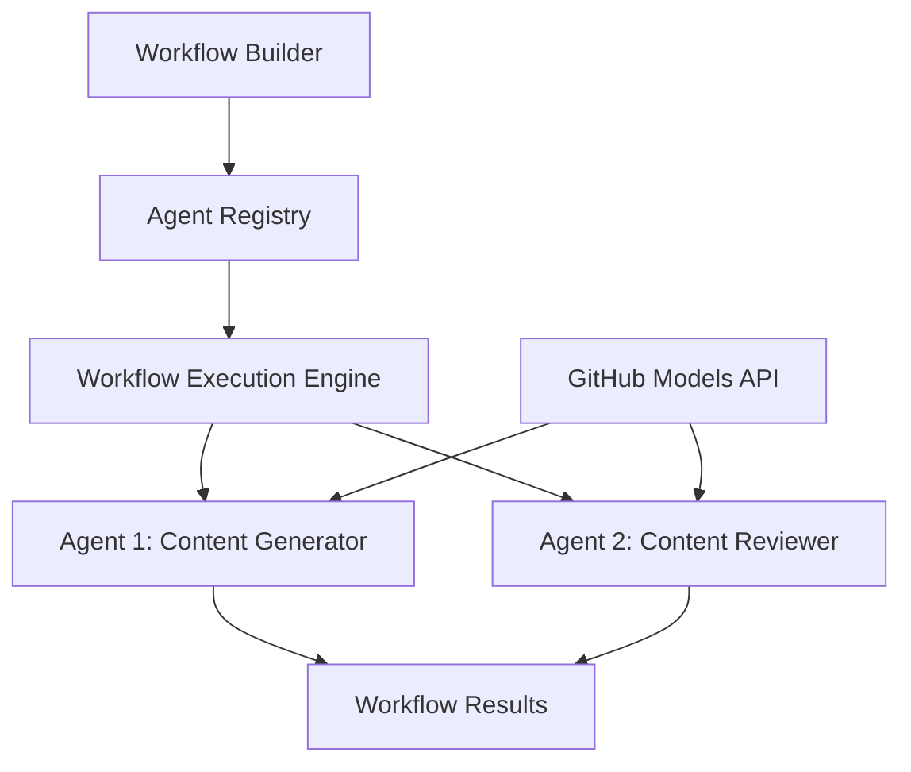

<!--
CO_OP_TRANSLATOR_METADATA:
{
  "original_hash": "034158688d0a45aae06dcbb21b0da5ae",
  "translation_date": "2025-11-11T12:50:26+00:00",
  "source_file": "08-multi-agent/code_samples/workflows-agent-framework/dotNET/01.dotnet-agent-framework-workflow-ghmodel-basic.md",
  "language_code": "th"
}
-->
# 🔄 การทำงานพื้นฐานของเอเจนต์ด้วย GitHub Models (.NET)

## 📋 บทเรียนการจัดการเวิร์กโฟลว์

โน้ตบุ๊กนี้แสดงวิธีการสร้าง **เวิร์กโฟลว์เอเจนต์** ที่ซับซ้อนโดยใช้ Microsoft Agent Framework สำหรับ .NET และ GitHub Models คุณจะได้เรียนรู้การสร้างกระบวนการธุรกิจหลายขั้นตอนที่เอเจนต์ AI ทำงานร่วมกันเพื่อบรรลุเป้าหมายที่ซับซ้อนผ่านรูปแบบการจัดการเวิร์กโฟลว์ที่มีโครงสร้าง

## 🎯 วัตถุประสงค์การเรียนรู้

### 🏗️ **พื้นฐานสถาปัตยกรรมเวิร์กโฟลว์**
- **Workflow Builder**: ออกแบบและจัดการกระบวนการ AI หลายขั้นตอนที่ซับซ้อน
- **Agent Coordination**: ประสานงานเอเจนต์เฉพาะทางหลายตัวในเวิร์กโฟลว์
- **GitHub Models Integration**: ใช้บริการการคาดการณ์โมเดล AI ของ GitHub ในเวิร์กโฟลว์
- **Visual Workflow Design**: สร้างและแสดงโครงสร้างเวิร์กโฟลว์เพื่อความเข้าใจที่ดีขึ้น

### 🔄 **รูปแบบการจัดการกระบวนการ**
- **Sequential Processing**: เชื่อมโยงงานของเอเจนต์หลายตัวในลำดับที่มีเหตุผล
- **State Management**: รักษาบริบทและการไหลของข้อมูลระหว่างขั้นตอนของเวิร์กโฟลว์
- **Error Handling**: ใช้การกู้คืนข้อผิดพลาดที่แข็งแกร่งและความยืดหยุ่นของเวิร์กโฟลว์
- **Performance Optimization**: ออกแบบเวิร์กโฟลว์ที่มีประสิทธิภาพสำหรับการดำเนินงานระดับองค์กร

### 🏢 **การใช้งานเวิร์กโฟลว์ในองค์กร**
- **Business Process Automation**: ทำให้งานเวิร์กโฟลว์องค์กรที่ซับซ้อนเป็นอัตโนมัติ
- **Content Production Pipeline**: เวิร์กโฟลว์ด้านบรรณาธิการที่มีขั้นตอนการตรวจสอบและอนุมัติ
- **Customer Service Automation**: การแก้ไขปัญหาการสอบถามลูกค้าแบบหลายขั้นตอน
- **Data Processing Workflows**: เวิร์กโฟลว์ ETL ที่มีการแปลงข้อมูลด้วย AI

## ⚙️ ข้อกำหนดเบื้องต้นและการตั้งค่า

### 📦 **แพ็กเกจ NuGet ที่จำเป็น**

การสาธิตเวิร์กโฟลว์นี้ใช้แพ็กเกจ .NET หลักหลายตัว:

```xml
<!-- Core AI Framework -->
<PackageReference Include="Microsoft.Extensions.AI" Version="9.9.0" />

<!-- Agent Framework (Local Development) -->
<!-- Microsoft.Agents.AI.dll - Core agent abstractions -->
<!-- Microsoft.Agents.AI.OpenAI.dll - OpenAI/GitHub Models integration -->

<!-- Configuration and Environment -->
<PackageReference Include="DotNetEnv" Version="3.1.1" />
```

### 🔑 **การตั้งค่า GitHub Models**

**การตั้งค่าสภาพแวดล้อม (.env file):**
```env
GITHUB_TOKEN=your_github_personal_access_token
GITHUB_ENDPOINT=https://models.inference.ai.azure.com
GITHUB_MODEL_ID=gpt-4o-mini
```

**การเข้าถึง GitHub Models:**
1. ลงทะเบียนเพื่อใช้งาน GitHub Models (ปัจจุบันอยู่ในช่วงพรีวิว)
2. สร้างโทเค็นการเข้าถึงส่วนบุคคลที่มีสิทธิ์การเข้าถึงโมเดล
3. ตั้งค่าตัวแปรสภาพแวดล้อมตามที่แสดงด้านบน

### 🏗️ **ภาพรวมสถาปัตยกรรมเวิร์กโฟลว์**



**องค์ประกอบสำคัญ:**
- **WorkflowBuilder**: เครื่องมือหลักสำหรับการออกแบบเวิร์กโฟลว์
- **AIAgent**: เอเจนต์เฉพาะทางแต่ละตัวที่มีความสามารถเฉพาะ
- **GitHub Models Client**: การรวมบริการการคาดการณ์โมเดล AI
- **Execution Context**: จัดการสถานะและการไหลของข้อมูลระหว่างขั้นตอนของเวิร์กโฟลว์

## 🎨 **รูปแบบการออกแบบเวิร์กโฟลว์ในองค์กร**

### 📝 **เวิร์กโฟลว์การผลิตเนื้อหา**
```
User Request → Content Generation → Quality Review → Final Output
```

### 🔍 **กระบวนการจัดการเอกสาร**
```
Document Input → Analysis → Extraction → Validation → Structured Output
```

### 💼 **เวิร์กโฟลว์ด้านธุรกิจอัจฉริยะ**
```
Data Collection → Processing → Analysis → Report Generation → Distribution
```

### 🤝 **การทำงานอัตโนมัติในบริการลูกค้า**
```
Customer Inquiry → Classification → Processing → Response Generation → Follow-up
```

## 🏢 **ประโยชน์สำหรับองค์กร**

### 🎯 **ความน่าเชื่อถือและความสามารถในการขยาย**
- **Deterministic Execution**: ผลลัพธ์ของเวิร์กโฟลว์ที่สม่ำเสมอและสามารถทำซ้ำได้
- **Error Recovery**: การจัดการข้อผิดพลาดอย่างราบรื่นในทุกขั้นตอนของเวิร์กโฟลว์
- **Performance Monitoring**: ติดตามเมตริกการดำเนินการและโอกาสในการปรับปรุง
- **Resource Management**: การจัดสรรและการใช้ทรัพยากรโมเดล AI อย่างมีประสิทธิภาพ

### 🔒 **ความปลอดภัยและการปฏิบัติตามข้อกำหนด**
- **Secure Authentication**: การรับรองความปลอดภัยด้วยโทเค็น GitHub สำหรับการเข้าถึง API
- **Audit Trails**: การบันทึกการดำเนินการเวิร์กโฟลว์และจุดตัดสินใจอย่างครบถ้วน
- **Access Control**: การกำหนดสิทธิ์การเข้าถึงสำหรับการดำเนินการและการตรวจสอบเวิร์กโฟลว์
- **Data Privacy**: การจัดการข้อมูลที่ละเอียดอ่อนอย่างปลอดภัยตลอดเวิร์กโฟลว์

### 📊 **การสังเกตและการจัดการ**
- **Visual Workflow Design**: การแสดงภาพกระบวนการและการพึ่งพาอย่างชัดเจน
- **Execution Monitoring**: การติดตามความคืบหน้าและประสิทธิภาพของเวิร์กโฟลว์แบบเรียลไทม์
- **Error Reporting**: การวิเคราะห์ข้อผิดพลาดและความสามารถในการแก้ไขปัญหาอย่างละเอียด
- **Performance Analytics**: เมตริกสำหรับการปรับปรุงและการวางแผนความจุ

มาเริ่มสร้างเวิร์กโฟลว์ AI ที่พร้อมใช้งานในองค์กรกันเถอะ! 🚀

## 💻 การรันโค้ด

การดำเนินการทั้งหมดมีอยู่ใน `01.dotnet-agent-framework-workflow-ghmodel-basic.cs` ไฟล์นี้แสดง:

1. **การตั้งค่าสภาพแวดล้อม** - โหลดข้อมูลรับรอง GitHub Models จากไฟล์ `.env`
2. **การตั้งค่า OpenAI Client** - การตั้งค่าคลายเอนด์พอยต์ GitHub Models
3. **การสร้างเอเจนต์** - กำหนดเอเจนต์เฉพาะทาง (Front Desk และ Concierge)
4. **Workflow Builder** - สร้างเวิร์กโฟลว์หลายเอเจนต์ด้วยการประมวลผลแบบลำดับ
5. **การดำเนินการเวิร์กโฟลว์** - รันเวิร์กโฟลว์พร้อมผลลัพธ์แบบสตรีม

### 🚀 การรันตัวอย่าง

```bash
# Make the script executable (Unix/Linux/macOS)
chmod +x 01.dotnet-agent-framework-workflow-ghmodel-basic.cs

# Run the workflow
./01.dotnet-agent-framework-workflow-ghmodel-basic.cs
```

หรือบน Windows:
```powershell
dotnet run 01.dotnet-agent-framework-workflow-ghmodel-basic.cs
```

### 📝 ผลลัพธ์ที่คาดหวัง

เวิร์กโฟลว์จะ:
1. รับคำขอปลายทางการเดินทางของคุณ ("ฉันอยากไปปารีส")
2. เอเจนต์ Front Desk ให้คำแนะนำเบื้องต้น
3. เอเจนต์ Concierge ตรวจสอบและปรับปรุงคำแนะนำ
4. ผลลัพธ์สุดท้ายแสดงการสนทนาแบบสมบูรณ์

### 🔧 การปรับแต่ง

คุณสามารถปรับแต่งเวิร์กโฟลว์ได้โดย:
- ปรับเปลี่ยนคำแนะนำของเอเจนต์เพื่อเปลี่ยนพฤติกรรมของพวกเขา
- เพิ่มเอเจนต์เพิ่มเติมเพื่อสร้างเวิร์กโฟลว์หลายขั้นตอนที่ซับซ้อน
- เปลี่ยนข้อความผู้ใช้เพื่อทดสอบสถานการณ์ต่างๆ
- ปรับแต่งขอบของเวิร์กโฟลว์เพื่อสร้างรูปแบบการดำเนินการที่แตกต่างกัน

---

<!-- CO-OP TRANSLATOR DISCLAIMER START -->
**ข้อจำกัดความรับผิดชอบ**:  
เอกสารนี้ได้รับการแปลโดยใช้บริการแปลภาษา AI [Co-op Translator](https://github.com/Azure/co-op-translator) แม้ว่าเราจะพยายามให้การแปลมีความถูกต้อง แต่โปรดทราบว่าการแปลอัตโนมัติอาจมีข้อผิดพลาดหรือความไม่ถูกต้อง เอกสารต้นฉบับในภาษาดั้งเดิมควรถือเป็นแหล่งข้อมูลที่เชื่อถือได้ สำหรับข้อมูลสำคัญ ขอแนะนำให้ใช้บริการแปลภาษามืออาชีพ เราไม่รับผิดชอบต่อความเข้าใจผิดหรือการตีความผิดที่เกิดจากการใช้การแปลนี้
<!-- CO-OP TRANSLATOR DISCLAIMER END -->