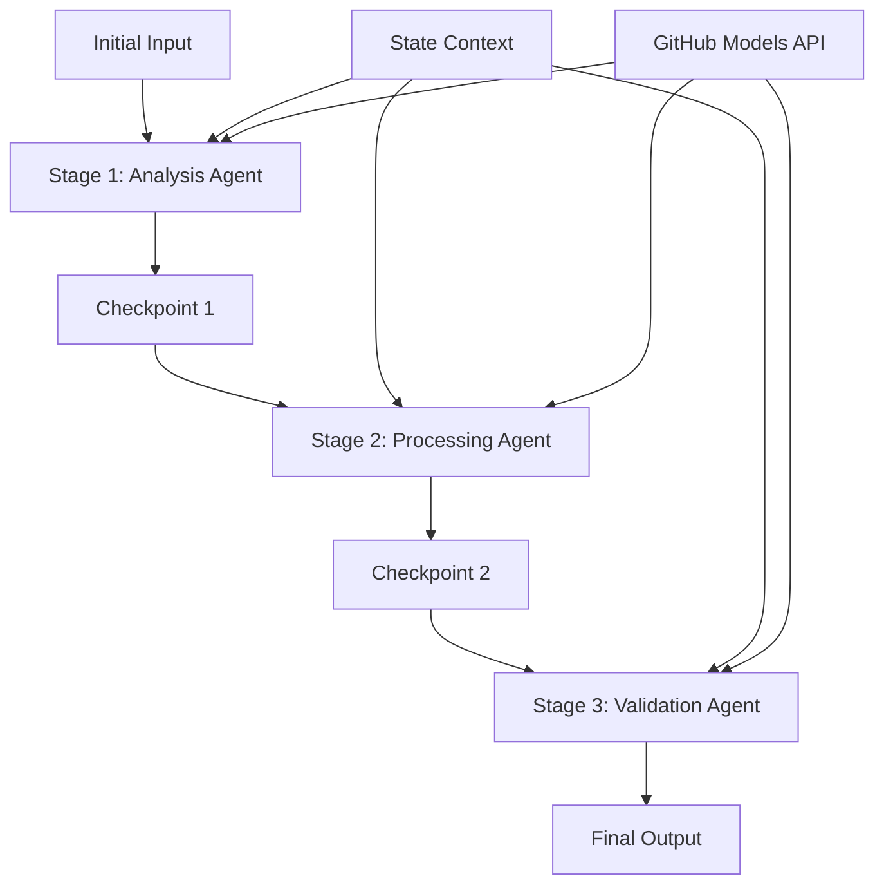

<!--
CO_OP_TRANSLATOR_METADATA:
{
  "original_hash": "1be9c8dcbd79a02d33d2c138684c1394",
  "translation_date": "2025-11-11T13:53:30+00:00",
  "source_file": "08-multi-agent/code_samples/workflows-agent-framework/dotNET/02.dotnet-agent-framework-workflow-ghmodel-sequential.md",
  "language_code": "th"
}
-->
# ⏩ ลำดับการทำงานของตัวแทนแบบต่อเนื่องด้วย GitHub Models (.NET)

## 📋 บทเรียนขั้นสูงเกี่ยวกับการประมวลผลแบบต่อเนื่อง

โน้ตบุ๊กนี้แสดงตัวอย่าง **รูปแบบการทำงานแบบต่อเนื่อง** โดยใช้ Microsoft Agent Framework สำหรับ .NET และ GitHub Models คุณจะได้เรียนรู้วิธีสร้างกระบวนการประมวลผลแบบขั้นตอนที่ซับซ้อน ซึ่งตัวแทนจะดำเนินการตามลำดับที่กำหนด โดยแต่ละขั้นตอนจะสร้างผลลัพธ์จากขั้นตอนก่อนหน้า

## 🎯 วัตถุประสงค์การเรียนรู้

### 🔄 **สถาปัตยกรรมการประมวลผลแบบต่อเนื่อง**
- **การออกแบบการทำงานแบบเชิงเส้น**: สร้างกระบวนการประมวลผลแบบขั้นตอนที่มีการพึ่งพาอย่างชัดเจน
- **การจัดการสถานะ**: รักษาบริบทและการไหลของข้อมูลระหว่างขั้นตอนการทำงานแบบต่อเนื่อง
- **การผสานรวม GitHub Models**: ใช้ประโยชน์จากโมเดล AI ของ GitHub ในการทำงานแบบหลายขั้นตอนใน .NET
- **รูปแบบการทำงานระดับองค์กร**: สร้างระบบการประมวลผลแบบต่อเนื่องที่พร้อมใช้งานในระดับการผลิต

### 🏗️ **รูปแบบขั้นสูงของการประมวลผลแบบต่อเนื่อง**
- **การประมวลผลแบบ Stage-Gate**: ใช้จุดตรวจสอบการตรวจสอบระหว่างขั้นตอนการทำงาน
- **การรักษาบริบท**: รักษาสถานะและความรู้ที่สะสมไว้ในทุกขั้นตอน
- **การส่งต่อข้อผิดพลาด**: จัดการความล้มเหลวในห่วงโซ่การประมวลผลแบบต่อเนื่องอย่างมีประสิทธิภาพ
- **การเพิ่มประสิทธิภาพการทำงาน**: การดำเนินการแบบต่อเนื่องที่มีประสิทธิภาพด้วยค่าใช้จ่ายที่น้อยที่สุด

### 🏢 **การประยุกต์ใช้งานแบบต่อเนื่องในระดับองค์กร**
- **กระบวนการประมวลผลเอกสาร**: การวิเคราะห์ การแปลง และการตรวจสอบเอกสารแบบหลายขั้นตอน
- **กระบวนการตรวจสอบคุณภาพ**: การตรวจสอบ การตรวจสอบ และการอนุมัติแบบต่อเนื่อง
- **กระบวนการผลิตเนื้อหา**: การวิจัย → การเขียน → การแก้ไข → การตรวจสอบ → การเผยแพร่
- **การทำงานอัตโนมัติในธุรกิจ**: กระบวนการธุรกิจแบบหลายขั้นตอนที่มีการพึ่งพาในแต่ละขั้นตอนอย่างชัดเจน

## ⚙️ ข้อกำหนดเบื้องต้นและการตั้งค่า

### 📦 **แพ็กเกจ NuGet ที่จำเป็น**

แพ็กเกจสำคัญสำหรับการทำงานแบบต่อเนื่องใน .NET:

```xml
<!-- Core AI Framework -->
<PackageReference Include="Microsoft.Extensions.AI" Version="9.9.0" />

<!-- Client Model Abstractions -->
<PackageReference Include="System.ClientModel" Version="1.6.1.0" />

<!-- Azure Identity and Async LINQ Support -->
<PackageReference Include="Azure.Identity" Version="1.15.0" />
<PackageReference Include="System.Linq.Async" Version="6.0.3" />

<!-- Local Agent Framework References -->
<!-- Microsoft.Agents.AI.dll - Core agent abstractions -->
<!-- Microsoft.Agents.AI.OpenAI.dll - GitHub Models integration -->
```

### 🔑 **การตั้งค่า GitHub Models**

**การตั้งค่าสภาพแวดล้อม (.env file):**
```env
GITHUB_TOKEN=your_github_personal_access_token
GITHUB_ENDPOINT=https://models.inference.ai.azure.com
GITHUB_MODEL_ID=gpt-4o-mini
```

**การจัดการการตั้งค่า:**
```csharp
// Load environment variables securely
Env.Load("../../../.env");
var githubToken = Environment.GetEnvironmentVariable("GITHUB_TOKEN");
var githubEndpoint = Environment.GetEnvironmentVariable("GITHUB_ENDPOINT");
var modelId = Environment.GetEnvironmentVariable("GITHUB_MODEL_ID");
```

### 🏗️ **สถาปัตยกรรมการทำงานแบบต่อเนื่อง**



**องค์ประกอบสำคัญ:**
- **ตัวแทนแบบต่อเนื่อง**: ตัวแทนเฉพาะสำหรับแต่ละขั้นตอนการประมวลผล
- **บริบทสถานะ**: รักษาข้อมูลและการตัดสินใจที่สะสมไว้ในทุกขั้นตอน
- **จุดตรวจสอบ**: จุดตรวจสอบการตรวจสอบระหว่างขั้นตอนเพื่อรับรองคุณภาพและความสม่ำเสมอ
- **GitHub Models Client**: การเข้าถึงโมเดล AI อย่างสม่ำเสมอในทุกขั้นตอนการทำงาน

## 🎨 **รูปแบบการออกแบบการทำงานแบบต่อเนื่อง**

### 📝 **กระบวนการประมวลผลเอกสาร**
```
Raw Document → Content Extraction → Analysis → Validation → Structured Output
```

### 🎯 **กระบวนการสร้างเนื้อหา**
```
Brief/Requirements → Research → Content Creation → Review → Final Polish
```

### 🔍 **กระบวนการตรวจสอบคุณภาพ**
```
Initial Review → Technical Validation → Compliance Check → Final Approval
```

### 💼 **กระบวนการวิเคราะห์ธุรกิจ**
```
Data Collection → Processing → Analysis → Report Generation → Distribution
```

## 🏢 **ประโยชน์ของการทำงานแบบต่อเนื่องในระดับองค์กร**

### 🎯 **ความน่าเชื่อถือและคุณภาพ**
- **การประมวลผลแบบกำหนดได้**: ผลลัพธ์ที่สม่ำเสมอและสามารถทำซ้ำได้ผ่านขั้นตอนที่มีโครงสร้าง
- **จุดตรวจสอบคุณภาพ**: จุดตรวจสอบการตรวจสอบรับรองคุณภาพในแต่ละขั้นตอน
- **การแยกข้อผิดพลาด**: ปัญหาในขั้นตอนหนึ่งจะไม่ส่งผลกระทบต่อขั้นตอนถัดไป
- **ร่องรอยการตรวจสอบ**: การติดตามการตัดสินใจและการเปลี่ยนแปลงในแต่ละขั้นตอนอย่างสมบูรณ์

### 📈 **ความสามารถในการขยายและประสิทธิภาพ**
- **การออกแบบแบบโมดูลาร์**: แต่ละขั้นตอนสามารถปรับปรุงได้อย่างอิสระ
- **การจัดการทรัพยากร**: การจัดสรรทรัพยากรโมเดล AI อย่างมีประสิทธิภาพในแต่ละขั้นตอน
- **การเพิ่มประสิทธิภาพสถานะ**: การถ่ายโอนสถานะระหว่างขั้นตอนให้น้อยที่สุดเพื่อประสิทธิภาพที่ดีที่สุด
- **กลุ่มขั้นตอนแบบขนาน**: การทำงานแบบต่อเนื่องหลายชุดสามารถดำเนินการพร้อมกันได้

### 🔒 **ความปลอดภัยและการปฏิบัติตามข้อกำหนด**
- **ความปลอดภัยระดับขั้นตอน**: นโยบายความปลอดภัยที่แตกต่างกันสำหรับแต่ละขั้นตอนการประมวลผล
- **การตรวจสอบข้อมูล**: รับรองความสมบูรณ์ของข้อมูลและการปฏิบัติตามข้อกำหนดในแต่ละจุดตรวจสอบ
- **การควบคุมการเข้าถึง**: การอนุญาตที่ละเอียดสำหรับขั้นตอนการทำงานที่แตกต่างกัน
- **การปฏิบัติตามข้อกำหนด**: ปฏิบัติตามข้อกำหนดทางกฎหมายผ่านการประมวลผลที่มีโครงสร้าง

### 📊 **การตรวจสอบและการวิเคราะห์**
- **เมตริกระดับขั้นตอน**: การตรวจสอบประสิทธิภาพสำหรับแต่ละขั้นตอนการทำงาน
- **การระบุคอขวด**: ระบุและปรับปรุงขั้นตอนที่ช้า
- **เมตริกคุณภาพ**: ติดตามคุณภาพและอัตราความสำเร็จในแต่ละขั้นตอน
- **การเพิ่มประสิทธิภาพกระบวนการ**: การปรับปรุงอย่างต่อเนื่องตามการวิเคราะห์ระดับขั้นตอน

มาสร้างกระบวนการประมวลผล AI แบบต่อเนื่องที่แข็งแกร่งกันเถอะ! 🚀

## 💻 การรันโค้ด

การดำเนินการทั้งหมดมีอยู่ใน `02.dotnet-agent-framework-workflow-ghmodel-sequential.cs` ไฟล์นี้แสดงตัวอย่าง **กระบวนการวิเคราะห์เฟอร์นิเจอร์แบบสามขั้นตอน**:

1. **ขั้นตอนที่ 1 - Sales Agent**: วิเคราะห์ภาพเฟอร์นิเจอร์และให้คำแนะนำการซื้อ
2. **ขั้นตอนที่ 2 - Price Agent**: ให้รายละเอียดการวิเคราะห์ราคาและตัวเลือกงบประมาณ
3. **ขั้นตอนที่ 3 - Quote Agent**: สร้างเอกสารใบเสนอราคาแบบมืออาชีพในรูปแบบ Markdown

### 🏗️ **สถาปัตยกรรมการทำงาน**

```
Image Input → Sales Analysis → Price Estimation → Quote Generation → Final Output
```

แต่ละตัวแทน:
- รับผลลัพธ์จากขั้นตอนก่อนหน้าเป็นบริบท
- สร้างการวิเคราะห์เพิ่มเติมด้วยความเชี่ยวชาญเฉพาะทาง
- รักษาความต่อเนื่องของการทำงานผ่านการจัดการสถานะ

### 🚀 การรันตัวอย่าง

**ข้อกำหนดเบื้องต้น:**
- วางภาพเฟอร์นิเจอร์ที่ `../imgs/home.png` (หรืออัปเดตตัวแปร `imgPath`)
- ตั้งค่าไฟล์ `.env` ของคุณด้วยข้อมูลรับรอง GitHub Models

```bash
# Make the script executable (Unix/Linux/macOS)
chmod +x 02.dotnet-agent-framework-workflow-ghmodel-sequential.cs

# Run the sequential workflow
./02.dotnet-agent-framework-workflow-ghmodel-sequential.cs
```

หรือบน Windows:
```powershell
dotnet run 02.dotnet-agent-framework-workflow-ghmodel-sequential.cs
```

### 📝 ผลลัพธ์ที่คาดหวัง

กระบวนการทำงานจะ:
1. **Sales Agent**: ระบุรายการเฟอร์นิเจอร์จากภาพและให้คำแนะนำ
2. **Price Agent**: เพิ่มการวิเคราะห์ราคาที่ละเอียดพร้อมระดับงบประมาณและคำแนะนำการซื้อ
3. **Quote Agent**: สร้างเอกสารใบเสนอราคาที่มีข้อมูลทั้งหมดที่สังเคราะห์ไว้

ผลลัพธ์สุดท้ายจะเป็นใบเสนอราคาเฟอร์นิเจอร์แบบมืออาชีพที่ครอบคลุมโดยอิงจากการวิเคราะห์ภาพ

### 🔧 ตัวเลือกการปรับแต่ง

**ปรับเปลี่ยนพฤติกรรมของตัวแทน:**
```csharp
// Adjust agent instructions to change their focus
const string SalesAgentInstructions = "Your custom instructions...";
```

**เปลี่ยนลำดับการทำงาน:**
```csharp
// Add or reorder workflow stages
var workflow = new WorkflowBuilder(salesagent)
    .AddEdge(salesagent, priceagent)
    .AddEdge(priceagent, quoteagent)
    .AddEdge(quoteagent, newAgent)  // Add another stage
    .Build();
```

**ใช้ข้อมูลนำเข้าอื่น:**
```csharp
// Process text instead of images
ChatMessage userMessage = new ChatMessage(ChatRole.User, [
    new TextContent("Analyze pricing for a modern living room set")
]);
```

### 🎯 การประยุกต์ใช้งานในโลกจริง

รูปแบบการทำงานแบบต่อเนื่องนี้เหมาะสำหรับ:
- **อีคอมเมิร์ซ**: การวิเคราะห์สินค้า → การตั้งราคา → การสร้างใบเสนอราคา
- **อสังหาริมทรัพย์**: การวิเคราะห์ทรัพย์สิน → การประเมินมูลค่า → การสร้างรายการ
- **ประกันภัย**: การวิเคราะห์การเคลม → การประเมิน → การสร้างใบเสนอราคา
- **การสร้างเนื้อหา**: การวิจัย → การเขียน → การแก้ไข → การเผยแพร่

### 🔍 การทำความเข้าใจการไหลของสถานะ

ตัวแทนแต่ละตัวในลำดับจะได้รับ:
- **ข้อมูลนำเข้าเริ่มต้น**: ข้อความผู้ใช้เริ่มต้น (ภาพ + ข้อความ)
- **ผลลัพธ์ของตัวแทนก่อนหน้า**: การตอบกลับของตัวแทนก่อนหน้าทั้งหมดในประวัติการสนทนา
- **บริบทที่สะสม**: สถานะที่สมบูรณ์ที่รักษาไว้ตลอดกระบวนการทำงาน

สิ่งนี้ช่วยให้การประมวลผลแบบหลายขั้นตอนที่ซับซ้อน ซึ่งตัวแทนแต่ละตัวสร้างขึ้นจากบริบทที่ครอบคลุมจากทุกขั้นตอนก่อนหน้า

---

<!-- CO-OP TRANSLATOR DISCLAIMER START -->
**ข้อจำกัดความรับผิดชอบ**:  
เอกสารนี้ได้รับการแปลโดยใช้บริการแปลภาษา AI [Co-op Translator](https://github.com/Azure/co-op-translator) แม้ว่าเราจะพยายามให้การแปลมีความถูกต้อง แต่โปรดทราบว่าการแปลโดยอัตโนมัติอาจมีข้อผิดพลาดหรือความไม่ถูกต้อง เอกสารต้นฉบับในภาษาดั้งเดิมควรถือเป็นแหล่งข้อมูลที่เชื่อถือได้ สำหรับข้อมูลที่สำคัญ ขอแนะนำให้ใช้บริการแปลภาษามืออาชีพ เราไม่รับผิดชอบต่อความเข้าใจผิดหรือการตีความผิดที่เกิดจากการใช้การแปลนี้
<!-- CO-OP TRANSLATOR DISCLAIMER END -->