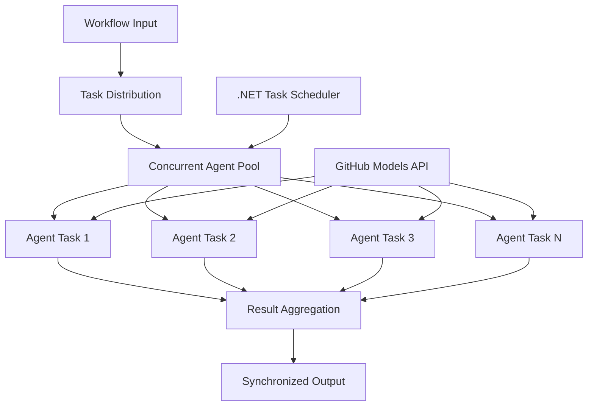

<!--
CO_OP_TRANSLATOR_METADATA:
{
  "original_hash": "b9c6e32c9b5f2fed20b6916984440d88",
  "translation_date": "2025-11-11T13:20:20+00:00",
  "source_file": "08-multi-agent/code_samples/workflows-agent-framework/dotNET/03.dotnet-agent-framework-workflow-ghmodel-concurrent.md",
  "language_code": "th"
}
-->
# ⚡ การทำงานแบบคู่ขนานของ Agent Workflow ด้วย GitHub Models (.NET)

## 📋 บทเรียนการประมวลผลแบบคู่ขนานประสิทธิภาพสูง

โน้ตบุ๊กนี้แสดงตัวอย่าง **รูปแบบการทำงานแบบคู่ขนาน** โดยใช้ Microsoft Agent Framework สำหรับ .NET และ GitHub Models คุณจะได้เรียนรู้วิธีสร้าง workflow การประมวลผลแบบคู่ขนานที่มีประสิทธิภาพสูงสุด โดยการดำเนินการ AI agents หลายตัวพร้อมกันในขณะที่ยังคงรักษาการประสานงานและความสอดคล้องของข้อมูล

## 🎯 วัตถุประสงค์การเรียนรู้

### 🚀 **พื้นฐานการประมวลผลแบบคู่ขนาน**
- **การดำเนินการ Agent แบบคู่ขนาน**: รัน AI agents หลายตัวพร้อมกันเพื่อประสิทธิภาพสูงสุด
- **รูปแบบ Async/Await**: ใช้รูปแบบการเขียนโปรแกรมแบบ async ของ .NET เพื่อการประมวลผลแบบคู่ขนานที่มีประสิทธิภาพ
- **การผสาน GitHub Models**: ประสานการเรียกใช้งานแบบคู่ขนานไปยังบริการการอนุมานโมเดล AI ของ GitHub
- **การจัดการทรัพยากร**: จัดการทรัพยากรโมเดล AI อย่างมีประสิทธิภาพในระหว่างการดำเนินการแบบคู่ขนาน

### 🏗️ **สถาปัตยกรรมการประมวลผลขั้นสูง**
- **Task-Based Parallelism**: ใช้ Task Parallel Library ของ .NET เพื่อการดำเนินการแบบคู่ขนานที่เหมาะสมที่สุด
- **รูปแบบการประสานงาน**: ประสานงาน agents แบบคู่ขนานในขณะที่หลีกเลี่ยง race conditions
- **การกระจายโหลด**: กระจายงานอย่างมีประสิทธิภาพในความสามารถการประมวลผลแบบคู่ขนานที่มีอยู่
- **ความทนทานต่อข้อผิดพลาด**: จัดการความล้มเหลวของ agent แต่ละตัวโดยไม่หยุด workflow ทั้งหมด

### 🏢 **แอปพลิเคชันการประมวลผลแบบคู่ขนานในองค์กร**
- **การประมวลผลเอกสารปริมาณมาก**: ประมวลผลเอกสารหลายฉบับพร้อมกัน
- **การวิเคราะห์เนื้อหาแบบเรียลไทม์**: วิเคราะห์ข้อมูลที่เข้ามาแบบคู่ขนาน
- **การปรับปรุงการประมวลผลแบบแบทช์**: เพิ่ม throughput สูงสุดสำหรับการประมวลผลข้อมูลขนาดใหญ่
- **การวิเคราะห์แบบหลายรูปแบบ**: ประมวลผลเนื้อหาประเภทและรูปแบบต่าง ๆ แบบคู่ขนาน

## ⚙️ ข้อกำหนดเบื้องต้นและการตั้งค่า

### 📦 **แพ็กเกจ NuGet ที่จำเป็น**

แพ็กเกจสำคัญสำหรับ workflow การประมวลผลแบบคู่ขนานประสิทธิภาพสูง:

```xml
<!-- Core AI Framework with Async Support -->
<PackageReference Include="Microsoft.Extensions.AI" Version="9.9.0" />

<!-- Client Model Abstractions for API Communication -->
<PackageReference Include="System.ClientModel" Version="1.6.1.0" />

<!-- Azure Identity and Async LINQ for Advanced Operations -->
<PackageReference Include="Azure.Identity" Version="1.15.0" />
<PackageReference Include="System.Linq.Async" Version="6.0.3" />

<!-- Local Agent Framework References -->
<!-- Microsoft.Agents.AI.dll - Core agent abstractions with async support -->
<!-- Microsoft.Agents.AI.OpenAI.dll - GitHub Models integration with concurrency -->
```

### 🔑 **การตั้งค่า GitHub Models**

**การตั้งค่าสภาพแวดล้อม (.env file):**
```env
GITHUB_TOKEN=your_github_personal_access_token
GITHUB_ENDPOINT=https://models.inference.ai.azure.com
GITHUB_MODEL_ID=gpt-4o-mini
```

**ข้อควรพิจารณาเกี่ยวกับการประมวลผลแบบคู่ขนาน:**
```csharp
// Configure for concurrent operations
var clientOptions = new OpenAIClientOptions()
{
    Endpoint = new Uri(githubEndpoint),
    // Configure connection pooling for concurrent requests
    NetworkTimeout = TimeSpan.FromMinutes(5)
};
```

### 🏗️ **สถาปัตยกรรม Workflow แบบคู่ขนาน**



**องค์ประกอบสำคัญ:**
- **Task Parallel Library**: การสนับสนุนในตัวของ .NET สำหรับการดำเนินการแบบคู่ขนาน
- **Agent Pool**: ตัวแทนหลายตัวสำหรับการประมวลผลแบบคู่ขนาน
- **การรวมผลลัพธ์**: การประสานงานและการรวมผลลัพธ์ของ agent แบบคู่ขนาน
- **จุดประสานงาน**: รับรองความสอดคล้องของข้อมูลในระหว่างการดำเนินการแบบคู่ขนาน

## 🎨 **รูปแบบการออกแบบ Workflow แบบคู่ขนาน**

### 🔍 **การวิจัยและวิเคราะห์แบบคู่ขนาน**
```
Research Topic → Concurrent Research Agents → Result Synthesis → Final Report
```

### 📊 **การประมวลผลข้อมูลจากหลายแหล่ง**
```
Data Sources → Parallel Processing Agents → Data Integration → Unified Output
```

### 🎭 **กระบวนการสร้างเนื้อหา**
```
Content Requirements → Concurrent Content Generators → Quality Review → Final Content
```

### 🔄 **การประมวลผลแบบ Fan-Out/Fan-In**
```
Single Input → Multiple Concurrent Processors → Result Aggregation → Single Output
```

## 🏢 **ประโยชน์ด้านประสิทธิภาพในองค์กร**

### ⚡ **Throughput & Scalability**
- **การปรับขนาดประสิทธิภาพแบบเชิงเส้น**: เพิ่มจำนวน agent แบบคู่ขนานเพื่อเพิ่ม throughput
- **การใช้ทรัพยากร**: ใช้ความสามารถของโมเดล AI ที่มีอยู่ให้เกิดประโยชน์สูงสุด
- **ลดเวลาในการประมวลผล**: ลดเวลาอย่างมากผ่านการดำเนินการแบบคู่ขนาน
- **การปรับขนาดแบบยืดหยุ่น**: ปรับจำนวน agent แบบคู่ขนานตามปริมาณงานแบบไดนามิก

### 🛡️ **ความน่าเชื่อถือและความยืดหยุ่น**
- **การแยกข้อผิดพลาด**: ความล้มเหลวของ agent แต่ละตัวไม่ส่งผลต่อการดำเนินการแบบคู่ขนานอื่น ๆ
- **การลดระดับอย่างมีประสิทธิภาพ**: ระบบยังคงทำงานต่อไปด้วยความสามารถของ agent ที่ลดลง
- **การกู้คืนข้อผิดพลาด**: กลไกการลองใหม่อัตโนมัติสำหรับการดำเนินการแบบคู่ขนานที่ล้มเหลว
- **การกระจายโหลด**: การกระจายงานอย่างเท่าเทียมกันใน agent ที่มีอยู่

### 📊 **การตรวจสอบประสิทธิภาพ**
- **เมตริกการดำเนินการแบบคู่ขนาน**: ติดตามประสิทธิภาพของการดำเนินการแบบคู่ขนานทั้งหมด
- **การวิเคราะห์การใช้ทรัพยากร**: ตรวจสอบการใช้งาน CPU, หน่วยความจำ และเครือข่าย
- **การวิเคราะห์ Throughput**: วัดประสิทธิภาพที่เพิ่มขึ้นจากการประมวลผลแบบคู่ขนาน
- **การตรวจจับคอขวด**: ระบุและแก้ไขข้อจำกัดด้านประสิทธิภาพ

### 🔧 **การพัฒนาและการดำเนินงาน**
- **รูปแบบการเขียนโปรแกรมแบบ Async**: ใช้รูปแบบ async/await ที่ครบถ้วนของ .NET
- **การประสานงาน Task**: ความสามารถในการจัดการและประสานงาน task ในตัว
- **การจัดการข้อยกเว้น**: การจัดการข้อผิดพลาดที่ครอบคลุมสำหรับการดำเนินการแบบคู่ขนาน
- **การสนับสนุนการดีบัก**: เครื่องมือดีบักของ Visual Studio สำหรับ workflow แบบคู่ขนาน

มาสร้าง workflow AI แบบคู่ขนานที่มีประสิทธิภาพสูงด้วย .NET กันเถอะ! 🚀

## 💻 การรันโค้ด

การดำเนินการทั้งหมดมีอยู่ใน `03.dotnet-agent-framework-workflow-ghmodel-concurrent.cs` ไฟล์นี้แสดง **Fan-Out/Fan-In concurrent workflow** สำหรับการวางแผนการเดินทาง:

### 🏗️ **สถาปัตยกรรม Workflow**

```
User Request → ConcurrentStartExecutor → [Researcher Agent || Planner Agent] → ConcurrentAggregationExecutor → Final Output
```

**องค์ประกอบสำคัญ:**

1. **ConcurrentStartExecutor**: ส่งคำขอของผู้ใช้ไปยัง agent ทั้งหมดพร้อมกัน
2. **Researcher Agent**: วิเคราะห์สถานที่และสถานที่ท่องเที่ยวแบบคู่ขนาน
3. **Planner Agent**: สร้างแผนการเดินทางโดยละเอียดแบบคู่ขนาน
4. **ConcurrentAggregationExecutor**: รวบรวมและรวมผลลัพธ์จาก agent ทั้งสอง

### 🎯 **รูปแบบ Fan-Out/Fan-In**

Workflow นี้แสดงรูปแบบ **Fan-Out/Fan-In** แบบคลาสสิก:
- **Fan-Out**: ข้อความอินพุตหนึ่งข้อความถูกส่งไปยัง agent หลายตัวพร้อมกัน
- **การประมวลผลแบบคู่ขนาน**: agent หลายตัวทำงานแบบคู่ขนานใน task เดียวกัน
- **Fan-In**: ผลลัพธ์จาก agent ทั้งหมดถูกรวบรวมและรวมเป็นผลลัพธ์เดียว

### 🚀 การรันตัวอย่าง

```bash
# Make the script executable (Unix/Linux/macOS)
chmod +x 03.dotnet-agent-framework-workflow-ghmodel-concurrent.cs

# Run the concurrent workflow
./03.dotnet-agent-framework-workflow-ghmodel-concurrent.cs
```

หรือบน Windows:
```powershell
dotnet run 03.dotnet-agent-framework-workflow-ghmodel-concurrent.cs
```

### 📝 ผลลัพธ์ที่คาดหวัง

Workflow จะ:
1. **ส่งคำขอ**: ส่ง "วางแผนการเดินทางไป Seattle ในเดือนธันวาคม" ไปยัง agent ทั้งสอง
2. **การประมวลผลแบบคู่ขนาน**: agent ทั้งสองทำงานพร้อมกัน:
   - Researcher ระบุสถานที่ท่องเที่ยวและรายละเอียด
   - Planner สร้างแผนการเดินทางและโลจิสติกส์
3. **การรวมผลลัพธ์**: รวมคำตอบทั้งสองเป็นผลลัพธ์ที่ครอบคลุม
4. **แสดงผลลัพธ์**: แสดงแผนการเดินทางที่รวมข้อมูลทั้งหมด

### 🔧 ตัวเลือกการปรับแต่ง

**เพิ่ม agent แบบคู่ขนานเพิ่มเติม:**
```csharp
// Create additional specialized agents
AIAgent budgetAgent = openAIClient.GetChatClient(github_model_id).CreateAIAgent(
    name: "Budget-Agent", instructions: "Calculate travel costs...");

// Add to fan-out
var workflow = new WorkflowBuilder(startExecutor)
    .AddFanOutEdge(startExecutor, targets: [researcherAgent, plannerAgent, budgetAgent])
    .AddFanInEdge(aggregationExecutor, sources: [researcherAgent, plannerAgent, budgetAgent])
    .WithOutputFrom(aggregationExecutor)
    .Build();

// Update aggregation count
if (this._messages.Count == 3) { ... }
```

**แก้ไขคำแนะนำของ agent:**
```csharp
const string ResearcherAgentInstructions = "Your custom instructions for research...";
const string PlanAgentInstructions = "Your custom instructions for planning...";
```

**เปลี่ยน Task:**
```csharp
StreamingRun run = await InProcessExecution.StreamAsync(
    workflow, 
    "Plan a European vacation for 2 weeks in summer"
);
```

### 🎯 แอปพลิเคชันในโลกจริง

รูปแบบการประมวลผลแบบคู่ขนานนี้เหมาะสำหรับ:
- **การสร้างเนื้อหา**: นักเขียนหลายคนสร้างส่วนต่าง ๆ พร้อมกัน
- **การตรวจสอบโค้ด**: ผู้ตรวจสอบหลายคนวิเคราะห์โค้ดจากมุมมองที่แตกต่างกัน
- **การวิจัยตลาด**: การวิเคราะห์แบบคู่ขนานของกลุ่มตลาดต่าง ๆ
- **การประมวลผลเอกสาร**: การดึงข้อมูล วิเคราะห์ และตรวจสอบแบบคู่ขนาน
- **การวิเคราะห์หลายมุมมอง**: รับมุมมองที่หลากหลายเกี่ยวกับอินพุตเดียวกัน

### 🔍 การทำความเข้าใจ Executors แบบกำหนดเอง

**ConcurrentStartExecutor:**
- ใช้ `IMessageHandler<string>` เพื่อรับอินพุตแบบ string
- ส่งข้อความไปยัง agent ที่เชื่อมต่อทั้งหมด
- ส่ง `TurnToken` เพื่อกระตุ้นการประมวลผลแบบคู่ขนาน

**ConcurrentAggregationExecutor:**
- ใช้ `IMessageHandler<ChatMessage>` เพื่อรับคำตอบของ agent
- รวบรวมข้อความในลักษณะที่ปลอดภัยต่อ thread
- รวมผลลัพธ์เมื่อได้รับคำตอบที่คาดหวังทั้งหมด
- ส่งผลลัพธ์สุดท้ายโดยใช้ `context.YieldOutputAsync()`

### ⚡ ประโยชน์ด้านประสิทธิภาพ

**การประมวลผลแบบคู่ขนาน vs แบบลำดับ:**
- แบบลำดับ: Agent1 (30s) → Agent2 (30s) = **60 วินาทีทั้งหมด**
- แบบคู่ขนาน: Agent1 (30s) || Agent2 (30s) = **30 วินาทีทั้งหมด**

**การปรับปรุง Throughput**: เร็วขึ้นถึง N× สำหรับ N agent แบบคู่ขนาน (ขึ้นอยู่กับปริมาณงานและทรัพยากร)

### 🛡️ การจัดการข้อผิดพลาด

Workflow จัดการความล้มเหลวของ agent แต่ละตัวอย่างมีประสิทธิภาพ:
- หาก agent หนึ่งล้มเหลว ตัวอื่นยังคงดำเนินการต่อ
- Aggregator สามารถใช้ตรรกะ timeout
- สามารถส่งผลลัพธ์บางส่วนได้หากจำเป็น

### 📊 ฟีเจอร์ขั้นสูง

**จำนวน agent แบบไดนามิก:**
ปรับตรรกะการรวมผลลัพธ์เพื่อรองรับจำนวน agent ที่เปลี่ยนแปลงได้:

```csharp
private int _expectedAgentCount;
private readonly List<ChatMessage> _messages = [];

public async ValueTask HandleAsync(ChatMessage message, IWorkflowContext context)
{
    this._messages.Add(message);
    if (this._messages.Count == _expectedAgentCount)
    {
        // Process aggregation
    }
}
```

รูปแบบ workflow แบบคู่ขนานนี้เป็นสิ่งสำคัญสำหรับการสร้างระบบ AI agent ที่มีประสิทธิภาพสูงและปรับขนาดได้!

---

<!-- CO-OP TRANSLATOR DISCLAIMER START -->
**ข้อจำกัดความรับผิดชอบ**:  
เอกสารนี้ได้รับการแปลโดยใช้บริการแปลภาษา AI [Co-op Translator](https://github.com/Azure/co-op-translator) แม้ว่าเราจะพยายามให้การแปลมีความถูกต้อง แต่โปรดทราบว่าการแปลโดยอัตโนมัติอาจมีข้อผิดพลาดหรือความไม่ถูกต้อง เอกสารต้นฉบับในภาษาดั้งเดิมควรถือเป็นแหล่งข้อมูลที่เชื่อถือได้ สำหรับข้อมูลที่สำคัญ ขอแนะนำให้ใช้บริการแปลภาษามืออาชีพ เราไม่รับผิดชอบต่อความเข้าใจผิดหรือการตีความผิดที่เกิดจากการใช้การแปลนี้
<!-- CO-OP TRANSLATOR DISCLAIMER END -->