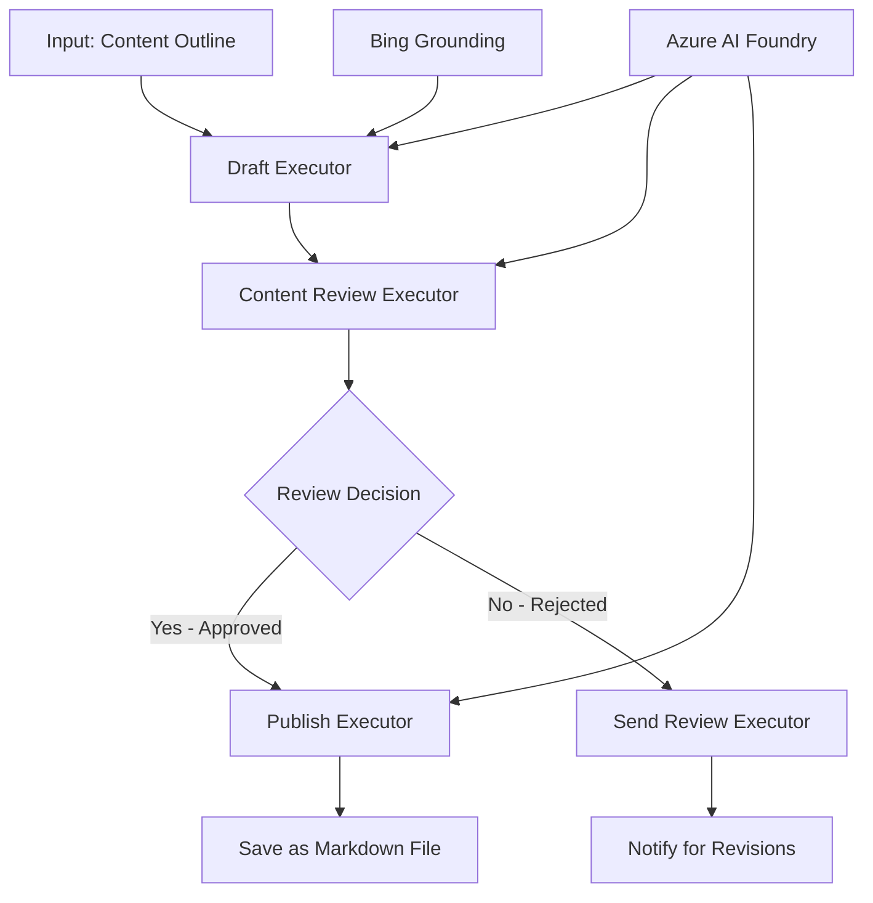

<!--
CO_OP_TRANSLATOR_METADATA:
{
  "original_hash": "8abd335151cee553293b637ee3d80d10",
  "translation_date": "2025-11-11T12:17:39+00:00",
  "source_file": "08-multi-agent/code_samples/workflows-agent-framework/dotNET/04.dotnet-agent-framework-workflow-aifoundry-condition.md",
  "language_code": "th"
}
-->
# 🔀 เวิร์กโฟลว์ตัวแทนแบบมีเงื่อนไขด้วย Azure AI Foundry (.NET)

## 📋 บทเรียนเวิร์กโฟลว์ที่ขับเคลื่อนด้วยการตัดสินใจอัจฉริยะ

โน้ตบุ๊กนี้แสดงตัวอย่าง **รูปแบบเวิร์กโฟลว์แบบมีเงื่อนไข** โดยใช้ Azure AI Foundry และ Microsoft Agent Framework สำหรับ .NET คุณจะได้เรียนรู้วิธีสร้างเวิร์กโฟลว์ที่ซับซ้อนซึ่งขับเคลื่อนด้วยการตัดสินใจที่สามารถกำหนดเส้นทางการประมวลผลอย่างชาญฉลาดโดยอิงจากการวิเคราะห์ AI กฎธุรกิจ และเงื่อนไขแบบไดนามิกเพื่อการทำงานอัตโนมัติระดับองค์กร

## 🎯 วัตถุประสงค์การเรียนรู้

### 🧠 **สถาปัตยกรรมการตัดสินใจอัจฉริยะ**
- **การใช้งานตรรกะแบบมีเงื่อนไข**: สร้างต้นไม้การตัดสินใจที่ซับซ้อนพร้อมจุดแยกหลายจุด
- **การกำหนดเส้นทางด้วย AI**: ใช้โมเดล Azure AI Foundry เพื่อการตัดสินใจเส้นทางอย่างชาญฉลาด
- **การปรับเปลี่ยนเวิร์กโฟลว์แบบไดนามิก**: ปรับเปลี่ยนพฤติกรรมเวิร์กโฟลว์ตามการวิเคราะห์และเงื่อนไขในระหว่างการทำงาน
- **การรวมกฎองค์กร**: ผสานตรรกะทางธุรกิจและข้อกำหนดการปฏิบัติตามกฎระเบียบในเวิร์กโฟลว์

### 🔀 **รูปแบบเงื่อนไขขั้นสูง**
- **การตัดสินใจหลายเกณฑ์**: ประเมินปัจจัยหลายอย่างเพื่อการตัดสินใจเส้นทาง
- **การประมวลผลที่คำนึงถึงบริบท**: ตัดสินใจโดยอิงจากบริบทและประวัติของเวิร์กโฟลว์ที่สะสมไว้
- **การปรับเปลี่ยนเวิร์กโฟลว์แบบปรับตัว**: ปรับเส้นทางการประมวลผลแบบไดนามิกตามเงื่อนไขแบบเรียลไทม์
- **การรวมเครื่องมือกฎ**: ใช้เครื่องมือกฎธุรกิจที่ซับซ้อนภายในเวิร์กโฟลว์

### 🏢 **การใช้งานเงื่อนไขในองค์กร**
- **การจัดประเภทและกำหนดเส้นทางเอกสาร**: จัดประเภทและกำหนดเส้นทางเอกสารไปยังเวิร์กโฟลว์ที่เหมาะสมโดยอัตโนมัติ
- **การจัดลำดับความสำคัญบริการลูกค้า**: กำหนดเส้นทางคำถามของลูกค้าไปยังทีมที่เชี่ยวชาญเฉพาะทางอย่างชาญฉลาด
- **การประมวลผลการปฏิบัติตามกฎระเบียบและความเสี่ยง**: ใช้กระบวนการตรวจสอบและตรวจสอบที่แตกต่างกันตามการประเมินความเสี่ยง
- **เวิร์กโฟลว์การประกันคุณภาพ**: กำหนดเส้นทางเนื้อหาไปยังกระบวนการตรวจสอบที่เหมาะสมตามตัวชี้วัดคุณภาพ

## ⚙️ ข้อกำหนดเบื้องต้นและการตั้งค่า

### 📦 **แพ็กเกจ NuGet ที่จำเป็น**

แพ็กเกจขั้นสูงสำหรับการประมวลผลเวิร์กโฟลว์แบบมีเงื่อนไข:

```xml
<!-- Core AI Framework -->
<PackageReference Include="Microsoft.Extensions.AI" Version="9.9.0" />

<!-- Azure AI Agents with Persistent State -->
<PackageReference Include="Azure.AI.Agents.Persistent" Version="1.2.0-beta.5" />

<!-- Azure Identity and Utilities -->
<PackageReference Include="Azure.Identity" Version="1.15.0" />
<PackageReference Include="System.Linq.Async" Version="6.0.3" />
<PackageReference Include="DotNetEnv" Version="3.1.1" />

<!-- Local Workflow Framework References -->
<!-- Microsoft.Agents.Workflows.dll - Advanced workflow orchestration -->
<!-- Microsoft.Agents.AI.AzureAI.dll - Azure AI Foundry integration -->
<!-- Microsoft.Agents.AI.dll - Core agent abstractions -->
```

### 🔑 **การตั้งค่า Azure AI Foundry**

**ทรัพยากร Azure ที่จำเป็น:**
- พื้นที่ทำงาน Azure AI Foundry พร้อมโมเดลการประมวลผลแบบมีเงื่อนไข
- การสมัครสมาชิก Azure พร้อมโควตาการประมวลผลและสิทธิ์ที่เหมาะสม
- โมเดล AI ที่ปรับใช้สำหรับการตัดสินใจและการวิเคราะห์เนื้อหา
- (ตัวเลือก) การเชื่อมต่อ Bing Search API สำหรับความสามารถในการอ้างอิงข้อมูล

**การตั้งค่าสภาพแวดล้อม (.env file):**
```env
# Azure AI Foundry Configuration
AZURE_AI_PROJECT_ENDPOINT=https://your-project.cognitiveservices.azure.com/
BING_CONNECTION_ID=your-bing-connection-id
```

**การตั้งค่าการรับรองความถูกต้อง:**
```csharp
// Azure CLI or Managed Identity authentication
using Azure.Identity;
var credential = new AzureCliCredential();

// Load environment configuration
DotNetEnv.Env.Load("../../../.env");
```

### 🏗️ **สถาปัตยกรรมเวิร์กโฟลว์แบบมีเงื่อนไข**



**องค์ประกอบสำคัญ:**
- **Draft Executor**: ตัวแทน AI ที่สร้างร่างเนื้อหาเริ่มต้นจากโครงร่าง
- **Content Review Executor**: ตัวแทน AI ที่ประเมินคุณภาพและการปฏิบัติตามข้อกำหนดของร่าง
- **Conditional Routing**: ตรรกะการตัดสินใจที่กำหนดเส้นทางตามผลการตรวจสอบ
- **Publish/Review Paths**: เส้นทางการประมวลผลแยกสำหรับเนื้อหาที่ได้รับการอนุมัติและถูกปฏิเสธ
- **State Management**: รักษาบริบทของเนื้อหาและการตรวจสอบตลอดเวิร์กโฟลว์

## 🎨 **รูปแบบการออกแบบเวิร์กโฟลว์แบบมีเงื่อนไข**

### 📋 **การผลิตเนื้อหาด้วยเกณฑ์คุณภาพ**
```
Outline → Draft Creation → Quality Review → {Approve: Publish | Reject: Revise}
```

### 🎯 **การประมวลผลเอกสารตามความเสี่ยง**
```
Document → Risk Assessment → {Low: Standard | High: Enhanced Review}
```

### 🔍 **การกำหนดเส้นทางบริการลูกค้าอัจฉริยะ**
```
Customer Query → Analysis → {Simple: FAQ Bot | Complex: Human Agent}
```

### 💼 **เวิร์กโฟลว์ที่ขับเคลื่อนด้วยการปฏิบัติตามกฎระเบียบ**
```
Content → Compliance Check → {Pass: Publish | Fail: Legal Review}
```

## 🏢 **ประโยชน์ของเงื่อนไขในองค์กร**

### 🎯 **การทำงานอัตโนมัติอัจฉริยะ**
- **การตัดสินใจอย่างชาญฉลาด**: การตัดสินใจเส้นทางที่ขับเคลื่อนด้วย AI โดยอิงจากการวิเคราะห์เนื้อหาและบริบท
- **การประมวลผลแบบปรับตัว**: เวิร์กโฟลว์ที่ปรับเปลี่ยนโดยอัตโนมัติตามเงื่อนไขที่เปลี่ยนแปลง
- **การบังคับใช้กฎธุรกิจ**: การใช้ตรรกะและนโยบายธุรกิจที่ซับซ้อนโดยอัตโนมัติ
- **การกำหนดเส้นทางที่คำนึงถึงบริบท**: การตัดสินใจโดยอิงจากประวัติและบริบทของเวิร์กโฟลว์ทั้งหมด

### 📈 **ความเป็นเลิศในการดำเนินงาน**
- **การจัดสรรทรัพยากรที่เหมาะสม**: กำหนดงานไปยังผู้เชี่ยวชาญและกระบวนการที่เหมาะสมที่สุด
- **ลดการแทรกแซงด้วยมือ**: การตัดสินใจอัตโนมัติช่วยลดความจำเป็นในการกำหนดเส้นทางโดยมนุษย์
- **เวลาการแก้ไขที่เร็วขึ้น**: กำหนดเส้นทางโดยตรงไปยังความเชี่ยวชาญและความสามารถในการประมวลผลที่เหมาะสม
- **การใช้งานที่สม่ำเสมอ**: การใช้กฎธุรกิจและเกณฑ์การตัดสินใจอย่างสม่ำเสมอ

### 🛡️ **การจัดการความเสี่ยงและการปฏิบัติตามกฎระเบียบ**
- **การประเมินความเสี่ยงอัตโนมัติ**: การประเมินระดับความเสี่ยงของเนื้อหาและสถานการณ์ที่ขับเคลื่อนด้วย AI
- **การบังคับใช้การปฏิบัติตามกฎระเบียบ**: การกำหนดเส้นทางโดยอัตโนมัติผ่านกระบวนการกำกับดูแลที่จำเป็น
- **การใช้โปรโตคอลความปลอดภัย**: มาตรการรักษาความปลอดภัยที่เพิ่มขึ้นตามการประเมินความเสี่ยง
- **การบำรุงรักษาเส้นทางการตรวจสอบ**: การบันทึกการตัดสินใจเส้นทางและเหตุผลอย่างครบถ้วน

### 📊 **การวิเคราะห์และการปรับปรุงอย่างต่อเนื่อง**
- **การวิเคราะห์การตัดสินใจ**: ติดตามประสิทธิภาพและความถูกต้องของการตัดสินใจเส้นทาง
- **การจดจำรูปแบบ**: ระบุแนวโน้มและรูปแบบในการตัดสินใจเส้นทางเมื่อเวลาผ่านไป
- **การเพิ่มประสิทธิภาพการทำงาน**: การปรับปรุงเกณฑ์การตัดสินใจและประสิทธิภาพการกำหนดเส้นทางอย่างต่อเนื่อง
- **ข่าวกรองธุรกิจ**: ข้อมูลเชิงลึกเกี่ยวกับลักษณะเนื้อหาและข้อกำหนดการประมวลผล

### 🔧 **ความเป็นเลิศทางเทคนิค**
- **การจัดการสถานะที่คงอยู่**: รักษาสถานะที่ซับซ้อนตลอดการดำเนินการเวิร์กโฟลว์
- **สถาปัตยกรรมที่ปรับขนาดได้**: รองรับความต้องการการประมวลผลแบบมีเงื่อนไขในปริมาณมาก
- **ความสามารถในการผสานรวม**: การผสานรวมที่ราบรื่นกับระบบและกระบวนการทางธุรกิจที่มีอยู่
- **การตรวจสอบและการสังเกตการณ์**: การติดตามประสิทธิภาพและการตัดสินใจของเวิร์กโฟลว์อย่างครอบคลุม

มาสร้างเวิร์กโฟลว์องค์กรที่ขับเคลื่อนด้วยการตัดสินใจอัจฉริยะด้วย .NET กันเถอะ! 🚀

## 💻 การรันโค้ด

การใช้งานทั้งหมดมีอยู่ใน `04.dotnet-agent-framework-workflow-aifoundry-condition.cs` ซึ่งแสดงตัวอย่าง **เวิร์กโฟลว์การผลิตเนื้อหาด้วยเกณฑ์คุณภาพ**:

### 🏗️ **สถาปัตยกรรมเวิร์กโฟลว์**

```
Content Outline → Draft Creation → Quality Review → Conditional Routing:
                                                      ├─ Approved (>200 words) → Publish
                                                      └─ Rejected (<200 words) → Review Notification
```

**ตัวแทนในเวิร์กโฟลว์:**
1. **Evangelist Agent**: สร้างร่างบทเรียนจากโครงร่างด้วย Bing grounding
2. **Content Reviewer Agent**: ประเมินคุณภาพร่าง (จำนวนคำ ความสมบูรณ์)
3. **Publisher Agent**: บันทึกเนื้อหาที่ได้รับการอนุมัติเป็นไฟล์ Markdown พร้อมการประทับเวลา

**ตัวดำเนินการที่กำหนดเอง:**
1. **DraftExecutor**: จัดการการสร้างร่าง
2. **ContentReviewExecutor**: ดำเนินการประเมินคุณภาพ
3. **PublishExecutor**: จัดการการเผยแพร่เนื้อหาที่ได้รับการอนุมัติ
4. **SendReviewExecutor**: จัดการการแจ้งเตือนเนื้อหาที่ถูกปฏิเสธ

### 🚀 การรันตัวอย่าง

**ข้อกำหนดเบื้องต้น:**
- พื้นที่ทำงาน Azure AI Foundry ที่ตั้งค่าไว้
- การรับรองความถูกต้องของ Azure CLI (`az login`)
- (ตัวเลือก) การเชื่อมต่อ Bing Search สำหรับการอ้างอิงข้อมูล

```bash
# Make the script executable (Unix/Linux/macOS)
chmod +x 04.dotnet-agent-framework-workflow-aifoundry-condition.cs

# Run the conditional workflow
./04.dotnet-agent-framework-workflow-aifoundry-condition.cs
```

หรือบน Windows:
```powershell
dotnet run 04.dotnet-agent-framework-workflow-aifoundry-condition.cs
```

### 📝 ผลลัพธ์ที่คาดหวัง

เวิร์กโฟลว์จะ:
1. **สร้างตัวแทน**: เริ่มต้นตัวแทน Azure AI Foundry เฉพาะทางสามตัว
2. **สร้างร่าง**: ตัวแทน Evangelist สร้างร่างบทเรียนจากโครงร่าง
3. **ตรวจสอบเนื้อหา**: Content Reviewer ประเมินคุณภาพร่าง
4. **การกำหนดเส้นทางแบบมีเงื่อนไข**:
   - **หากได้รับการอนุมัติ (>200 คำ)**: Publish executor บันทึกเป็นไฟล์ Markdown
   - **หากถูกปฏิเสธ (<200 คำ)**: ส่งการแจ้งเตือนการตรวจสอบ
5. **แสดงผลลัพธ์**: แสดงผลลัพธ์สุดท้ายของเวิร์กโฟลว์

### 🔧 ตัวเลือกการปรับแต่ง

**ปรับเปลี่ยนเกณฑ์การตรวจสอบ:**
```csharp
const string ContentReviewerInstructions = @"
You are a content reviewer...
1. Check if content is more than 500 words (instead of 200)
2. Verify technical accuracy
3. Ensure proper formatting
...";
```

**เพิ่มเส้นทางเงื่อนไขเพิ่มเติม:**
```csharp
var workflow = new WorkflowBuilder(draftExecutor)
    .AddEdge(draftExecutor, contentReviewerExecutor)
    .AddEdge(contentReviewerExecutor, publishExecutor, condition: GetCondition("Excellent"))
    .AddEdge(contentReviewerExecutor, editExecutor, condition: GetCondition("Good"))
    .AddEdge(contentReviewerExecutor, sendReviewerExecutor, condition: GetCondition("Poor"))
    .Build();
```

**เปลี่ยนข้อกำหนดเนื้อหา:**
```csharp
string OUTLINE_Content = @"
# Your Custom Topic
## Section 1
https://your-reference-url
## Section 2
...
";
```

### 🎯 การใช้งานในโลกจริง

รูปแบบเวิร์กโฟลว์แบบมีเงื่อนไขนี้เหมาะสำหรับ:
- **ระบบจัดการเนื้อหา**: เวิร์กโฟลว์บรรณาธิการอัตโนมัติพร้อมเกณฑ์คุณภาพ
- **การประมวลผลเอกสาร**: กำหนดเส้นทางเอกสารตามการจัดประเภทและการปฏิบัติตามกฎระเบียบ
- **การสนับสนุนลูกค้า**: การกำหนดเส้นทางตั๋วอัจฉริยะตามความซับซ้อนและความเร่งด่วน
- **การตรวจสอบทางกฎหมาย**: กำหนดเส้นทางสัญญาตามการประเมินความเสี่ยงและมูลค่า
- **กระบวนการ HR**: กำหนดเส้นทางใบสมัครผ่านเวิร์กโฟลว์การคัดกรองที่เหมาะสม

### 🔍 การทำความเข้าใจตรรกะแบบมีเงื่อนไข

**ฟังก์ชันเงื่อนไข:**
```csharp
public Func<object?, bool> GetCondition(string expectedResult) =>
    reviewResult => reviewResult is ReviewResult review && review.Result == expectedResult;
```

ฟังก์ชันนี้สร้างคำสั่งที่:
1. ตรวจสอบว่าผลลัพธ์เป็นประเภท `ReviewResult`
2. เปรียบเทียบคุณสมบัติ `Result` กับค่าที่คาดหวัง
3. ส่งคืน true/false เพื่อกำหนดเส้นทาง

**ขอบเวิร์กโฟลว์พร้อมเงื่อนไข:**
```csharp
.AddEdge(contentReviewerExecutor, publishExecutor, condition: GetCondition("Yes"))
.AddEdge(contentReviewerExecutor, sendReviewerExecutor, condition: GetCondition("No"))
```

### 📊 คุณสมบัติขั้นสูง

**การตรวจสอบความถูกต้องของ JSON Schema:**
เวิร์กโฟลว์ใช้ JSON schemas เพื่อให้แน่ใจว่าการตอบกลับมีโครงสร้าง:

```csharp
// Define response structure
public class ReviewResult
{
    [JsonPropertyName("review_result")]
    public string Result { get; set; } = string.Empty;
    
    [JsonPropertyName("reason")]
    public string Reason { get; set; } = string.Empty;
    
    [JsonPropertyName("draft_content")]
    public string DraftContent { get; set; } = string.Empty;
}

// Apply to agent
ResponseFormat = ChatResponseFormat.ForJsonSchema(
    AIJsonUtilities.CreateJsonSchema(typeof(ReviewResult)), 
    "ReviewResult", 
    "Review Result From DraftContent"
)
```

**การรวม Bing Grounding:**
ตัวแทน Evangelist ใช้ Bing grounding เพื่อเข้าถึงข้อมูลแบบเรียลไทม์:

```csharp
var bingGroundingConfig = new BingGroundingSearchConfiguration(bing_conn_id);
BingGroundingToolDefinition bingGroundingTool = new(
    new BingGroundingSearchToolParameters([bingGroundingConfig])
);
```

สิ่งนี้ช่วยให้ตัวแทนสามารถติดตาม URL ในโครงร่างและดึงข้อมูลปัจจุบัน

### 🛡️ การจัดการข้อผิดพลาด

เวิร์กโฟลว์มีการจัดการข้อผิดพลาดที่แข็งแกร่งสำหรับเนื้อหาที่ถูกปฏิเสธ:
- ความล้มเหลวในการตรวจสอบจะเรียกเส้นทางทางเลือก
- การแจ้งเตือนให้เหตุผลการปฏิเสธที่ชัดเจน
- เนื้อหาจะถูกเก็บรักษาไว้สำหรับการแก้ไข

### 🔄 การขยายเวิร์กโฟลว์

**เพิ่มวงจรการแก้ไข:**
สร้างวงจรข้อเสนอแนะที่ร่างเนื้อหาใหม่โดยอัตโนมัติ:

```csharp
.AddEdge(contentReviewerExecutor, publishExecutor, condition: GetCondition("Yes"))
.AddEdge(contentReviewerExecutor, draftExecutor, condition: GetCondition("No")) // Loop back
```

**ใช้การตรวจสอบหลายระดับ:**
เพิ่มขั้นตอนการตรวจสอบหลายขั้นตอนด้วยเกณฑ์ที่แตกต่างกัน:

```csharp
.AddEdge(draftExecutor, technicalReviewer)
.AddEdge(technicalReviewer, editorialReviewer, condition: GetCondition("TechPass"))
.AddEdge(editorialReviewer, publishExecutor, condition: GetCondition("EditPass"))
```

รูปแบบเวิร์กโฟลว์แบบมีเงื่อนไขนี้เป็นพื้นฐานสำหรับการสร้างระบบอัตโนมัติองค์กรที่ซับซ้อนและชาญฉลาด! 🚀

---

<!-- CO-OP TRANSLATOR DISCLAIMER START -->
**ข้อจำกัดความรับผิดชอบ**:  
เอกสารนี้ได้รับการแปลโดยใช้บริการแปลภาษา AI [Co-op Translator](https://github.com/Azure/co-op-translator) แม้ว่าเราจะพยายามให้การแปลมีความถูกต้อง แต่โปรดทราบว่าการแปลโดยอัตโนมัติอาจมีข้อผิดพลาดหรือความไม่ถูกต้อง เอกสารต้นฉบับในภาษาดั้งเดิมควรถือเป็นแหล่งข้อมูลที่เชื่อถือได้ สำหรับข้อมูลที่สำคัญ ขอแนะนำให้ใช้บริการแปลภาษามืออาชีพ เราไม่รับผิดชอบต่อความเข้าใจผิดหรือการตีความผิดที่เกิดจากการใช้การแปลนี้
<!-- CO-OP TRANSLATOR DISCLAIMER END -->