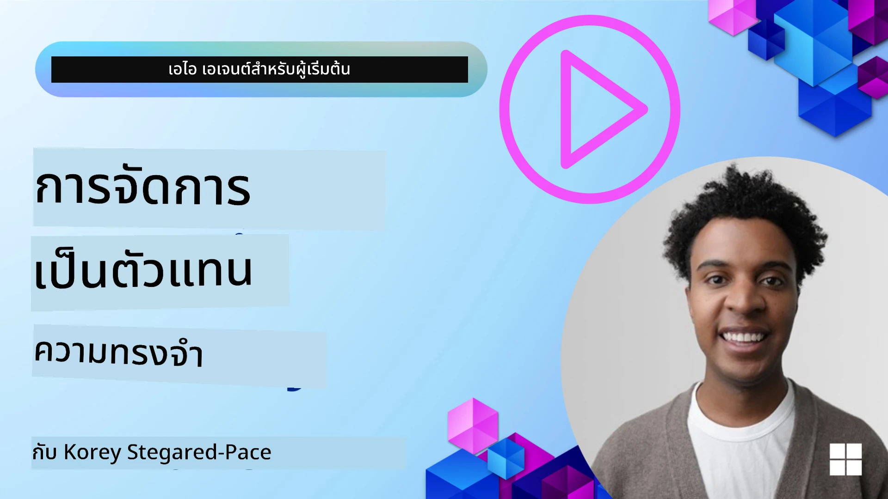

<!--
CO_OP_TRANSLATOR_METADATA:
{
  "original_hash": "a1d90991499ad697c4ad24decaf36968",
  "translation_date": "2025-12-09T12:22:55+00:00",
  "source_file": "13-agent-memory/README.md",
  "language_code": "th"
}
-->
# หน่วยความจำสำหรับ AI Agents

เมื่อพูดถึงข้อดีเฉพาะของการสร้าง AI Agents มีสองสิ่งที่มักถูกพูดถึง: ความสามารถในการเรียกใช้เครื่องมือเพื่อทำงานให้สำเร็จ และความสามารถในการพัฒนาตัวเองเมื่อเวลาผ่านไป หน่วยความจำเป็นพื้นฐานสำคัญในการสร้างเอเจนต์ที่สามารถพัฒนาตัวเองได้ เพื่อสร้างประสบการณ์ที่ดียิ่งขึ้นสำหรับผู้ใช้งานของเรา

ในบทเรียนนี้ เราจะมาดูว่าหน่วยความจำสำหรับ AI Agents คืออะไร และเราจะจัดการและใช้งานมันเพื่อประโยชน์ของแอปพลิเคชันของเราได้อย่างไร

## บทนำ

บทเรียนนี้จะครอบคลุม:

• **การทำความเข้าใจหน่วยความจำของ AI Agent**: หน่วยความจำคืออะไร และทำไมมันถึงสำคัญสำหรับเอเจนต์

• **การนำไปใช้และการจัดเก็บหน่วยความจำ**: วิธีการปฏิบัติในการเพิ่มความสามารถด้านหน่วยความจำให้กับ AI Agents โดยเน้นที่หน่วยความจำระยะสั้นและระยะยาว

• **การทำให้ AI Agents พัฒนาตัวเองได้**: วิธีที่หน่วยความจำช่วยให้เอเจนต์เรียนรู้จากการโต้ตอบในอดีตและพัฒนาตัวเองเมื่อเวลาผ่านไป

## การนำไปใช้ที่มีอยู่

บทเรียนนี้มีบทเรียนในรูปแบบโน้ตบุ๊กสองชุดที่ครอบคลุม:

• **[13-agent-memory.ipynb](./13-agent-memory.ipynb)**: ใช้หน่วยความจำผ่าน Mem0 และ Azure AI Search ด้วย Semantic Kernel framework

• **[13-agent-memory-cognee.ipynb](./13-agent-memory-cognee.ipynb)**: ใช้หน่วยความจำแบบมีโครงสร้างผ่าน Cognee สร้างกราฟความรู้โดยอัตโนมัติที่สนับสนุนด้วย embeddings, แสดงภาพกราฟ และการดึงข้อมูลอย่างชาญฉลาด

## เป้าหมายการเรียนรู้

หลังจากจบบทเรียนนี้ คุณจะสามารถ:

• **แยกแยะประเภทต่าง ๆ ของหน่วยความจำ AI Agent** รวมถึงหน่วยความจำการทำงาน, หน่วยความจำระยะสั้น, หน่วยความจำระยะยาว และรูปแบบเฉพาะ เช่น หน่วยความจำบุคลิกภาพและหน่วยความจำแบบเป็นตอน

• **นำไปใช้และจัดการหน่วยความจำระยะสั้นและระยะยาวสำหรับ AI Agents** โดยใช้ Semantic Kernel framework พร้อมเครื่องมืออย่าง Mem0, Cognee, Whiteboard memory และการผสานกับ Azure AI Search

• **เข้าใจหลักการเบื้องหลัง AI Agents ที่พัฒนาตัวเองได้** และวิธีที่ระบบการจัดการหน่วยความจำที่แข็งแกร่งช่วยให้เกิดการเรียนรู้และปรับตัวอย่างต่อเนื่อง

## การทำความเข้าใจหน่วยความจำของ AI Agent

ในแก่นแท้ของมัน **หน่วยความจำสำหรับ AI Agents หมายถึงกลไกที่ช่วยให้พวกเขาสามารถเก็บและเรียกคืนข้อมูลได้** ข้อมูลนี้อาจเป็นรายละเอียดเฉพาะเกี่ยวกับการสนทนา, ความชอบของผู้ใช้, การกระทำในอดีต หรือแม้แต่รูปแบบที่เรียนรู้มา

หากไม่มีหน่วยความจำ แอปพลิเคชัน AI มักจะไม่มีสถานะ หมายความว่าการโต้ตอบแต่ละครั้งเริ่มต้นใหม่จากศูนย์ สิ่งนี้นำไปสู่ประสบการณ์ผู้ใช้ที่ซ้ำซากและน่าหงุดหงิด ซึ่งเอเจนต์ "ลืม" บริบทหรือความชอบก่อนหน้า

### ทำไมหน่วยความจำถึงสำคัญ?

ความฉลาดของเอเจนต์นั้นเชื่อมโยงอย่างลึกซึ้งกับความสามารถในการเรียกคืนและใช้ข้อมูลในอดีต หน่วยความจำช่วยให้เอเจนต์สามารถ:

• **สะท้อนตัวเอง**: เรียนรู้จากการกระทำและผลลัพธ์ในอดีต

• **โต้ตอบ**: รักษาบริบทในระหว่างการสนทนาอย่างต่อเนื่อง

• **คาดการณ์และตอบสนอง**: คาดการณ์ความต้องการหรือตอบสนองอย่างเหมาะสมตามข้อมูลในอดีต

• **ทำงานอัตโนมัติ**: ดำเนินการอย่างอิสระมากขึ้นโดยอาศัยความรู้ที่เก็บไว้

เป้าหมายของการนำหน่วยความจำไปใช้คือการทำให้เอเจนต์มีความ **น่าเชื่อถือและมีความสามารถ** มากขึ้น

### ประเภทของหน่วยความจำ

#### หน่วยความจำการทำงาน

คิดว่ามันเหมือนกระดาษโน้ตที่เอเจนต์ใช้ในระหว่างงานหรือกระบวนการคิดที่กำลังดำเนินอยู่ มันเก็บข้อมูลทันทีที่จำเป็นสำหรับการคำนวณขั้นตอนถัดไป

สำหรับ AI Agents หน่วยความจำการทำงานมักจะจับข้อมูลที่เกี่ยวข้องที่สุดจากการสนทนา แม้ว่าประวัติการแชททั้งหมดจะยาวหรือถูกตัดทอน มันมุ่งเน้นไปที่การดึงองค์ประกอบสำคัญ เช่น ความต้องการ, ข้อเสนอ, การตัดสินใจ และการกระทำ

**ตัวอย่างหน่วยความจำการทำงาน**

ในเอเจนต์จองการเดินทาง หน่วยความจำการทำงานอาจจับคำขอปัจจุบันของผู้ใช้ เช่น "ฉันต้องการจองทริปไปปารีส" ความต้องการเฉพาะนี้จะถูกเก็บไว้ในบริบททันทีของเอเจนต์เพื่อแนะนำการโต้ตอบปัจจุบัน

#### หน่วยความจำระยะสั้น

หน่วยความจำประเภทนี้เก็บข้อมูลไว้ในระหว่างการสนทนาหรือเซสชันเดียว มันคือบริบทของการแชทปัจจุบันที่ช่วยให้เอเจนต์สามารถอ้างอิงกลับไปยังการพูดคุยก่อนหน้าในบทสนทนาได้

**ตัวอย่างหน่วยความจำระยะสั้น**

หากผู้ใช้ถามว่า "ตั๋วเครื่องบินไปปารีสราคาเท่าไหร่?" และตามด้วย "แล้วที่พักที่นั่นล่ะ?" หน่วยความจำระยะสั้นจะช่วยให้เอเจนต์รู้ว่า "ที่นั่น" หมายถึง "ปารีส" ในการสนทนาเดียวกัน

#### หน่วยความจำระยะยาว

นี่คือข้อมูลที่คงอยู่ในหลายการสนทนาหรือเซสชัน มันช่วยให้เอเจนต์สามารถจดจำความชอบของผู้ใช้, การโต้ตอบในอดีต หรือความรู้ทั่วไปในระยะเวลานาน สิ่งนี้สำคัญสำหรับการปรับแต่งเฉพาะบุคคล

**ตัวอย่างหน่วยความจำระยะยาว**

หน่วยความจำระยะยาวอาจเก็บข้อมูลว่า "เบ็นชอบเล่นสกีและกิจกรรมกลางแจ้ง, ชอบกาแฟพร้อมวิวภูเขา และต้องการหลีกเลี่ยงทางสกีขั้นสูงเนื่องจากอาการบาดเจ็บในอดีต" ข้อมูลนี้ที่เรียนรู้จากการโต้ตอบก่อนหน้า จะมีผลต่อคำแนะนำในเซสชันการวางแผนการเดินทางในอนาคต ทำให้มันปรับแต่งได้สูง

#### หน่วยความจำบุคลิกภาพ

หน่วยความจำประเภทพิเศษนี้ช่วยให้เอเจนต์พัฒนาบุคลิกภาพหรือบทบาทที่สอดคล้องกัน มันช่วยให้เอเจนต์จดจำรายละเอียดเกี่ยวกับตัวเองหรือบทบาทที่ตั้งใจไว้ ทำให้การโต้ตอบลื่นไหลและมุ่งเน้นมากขึ้น

**ตัวอย่างหน่วยความจำบุคลิกภาพ**

หากเอเจนต์การเดินทางถูกออกแบบให้เป็น "ผู้เชี่ยวชาญด้านการวางแผนสกี" หน่วยความจำบุคลิกภาพอาจเสริมบทบาทนี้ โดยมีผลต่อการตอบสนองให้สอดคล้องกับน้ำเสียงและความรู้ของผู้เชี่ยวชาญ

#### หน่วยความจำแบบเป็นตอน/ขั้นตอน

หน่วยความจำนี้เก็บลำดับขั้นตอนที่เอเจนต์ดำเนินการในระหว่างงานที่ซับซ้อน รวมถึงความสำเร็จและความล้มเหลว มันเหมือนกับการจดจำ "ตอน" หรือประสบการณ์ในอดีตเพื่อเรียนรู้จากมัน

**ตัวอย่างหน่วยความจำแบบเป็นตอน**

หากเอเจนต์พยายามจองเที่ยวบินเฉพาะแต่ล้มเหลวเนื่องจากไม่มีที่ว่าง หน่วยความจำแบบเป็นตอนสามารถบันทึกความล้มเหลวนี้ ทำให้เอเจนต์ลองเที่ยวบินทางเลือกหรือแจ้งผู้ใช้เกี่ยวกับปัญหาในวิธีที่มีข้อมูลมากขึ้นในความพยายามครั้งต่อไป

#### หน่วยความจำเอนทิตี

หน่วยความจำนี้เกี่ยวข้องกับการดึงและจดจำเอนทิตีเฉพาะ (เช่น คน, สถานที่ หรือสิ่งของ) และเหตุการณ์จากการสนทนา มันช่วยให้เอเจนต์สร้างความเข้าใจที่มีโครงสร้างเกี่ยวกับองค์ประกอบสำคัญที่ถูกพูดถึง

**ตัวอย่างหน่วยความจำเอนทิตี**

จากการสนทนาเกี่ยวกับทริปที่ผ่านมา เอเจนต์อาจดึงข้อมูล "ปารีส," "หอไอเฟล," และ "อาหารค่ำที่ร้าน Le Chat Noir" เป็นเอนทิตี ในการโต้ตอบในอนาคต เอเจนต์สามารถจดจำ "Le Chat Noir" และเสนอให้จองโต๊ะใหม่ที่นั่น

#### Structured RAG (Retrieval Augmented Generation)

ในขณะที่ RAG เป็นเทคนิคที่กว้างกว่า "Structured RAG" ถูกเน้นว่าเป็นเทคโนโลยีหน่วยความจำที่ทรงพลัง มันดึงข้อมูลที่มีโครงสร้างหนาแน่นจากแหล่งต่าง ๆ (การสนทนา, อีเมล, รูปภาพ) และใช้มันเพื่อเพิ่มความแม่นยำ, การเรียกคืน และความเร็วในการตอบสนอง แตกต่างจาก RAG แบบคลาสสิกที่อาศัยความคล้ายคลึงทางความหมายเพียงอย่างเดียว Structured RAG ทำงานกับโครงสร้างโดยธรรมชาติของข้อมูล

**ตัวอย่าง Structured RAG**

แทนที่จะจับคู่คำสำคัญ Structured RAG สามารถวิเคราะห์รายละเอียดเที่ยวบิน (ปลายทาง, วันที่, เวลา, สายการบิน) จากอีเมลและจัดเก็บในรูปแบบที่มีโครงสร้าง สิ่งนี้ช่วยให้สามารถสอบถามที่แม่นยำ เช่น "เที่ยวบินที่ฉันจองไปปารีสในวันอังคารคืออะไร?"

## การนำไปใช้และการจัดเก็บหน่วยความจำ

การนำหน่วยความจำไปใช้สำหรับ AI Agents เกี่ยวข้องกับกระบวนการที่เป็นระบบของ **การจัดการหน่วยความจำ** ซึ่งรวมถึงการสร้าง, การจัดเก็บ, การเรียกคืน, การผสาน, การอัปเดต และแม้กระทั่ง "การลืม" (หรือการลบ) ข้อมูล การเรียกคืนเป็นแง่มุมที่สำคัญโดยเฉพาะ

### เครื่องมือหน่วยความจำเฉพาะทาง

#### Mem0

วิธีหนึ่งในการจัดเก็บและจัดการหน่วยความจำของเอเจนต์คือการใช้เครื่องมือเฉพาะทางอย่าง Mem0 Mem0 ทำงานเป็นชั้นหน่วยความจำถาวร ช่วยให้เอเจนต์สามารถเรียกคืนการโต้ตอบที่เกี่ยวข้อง, จัดเก็บความชอบของผู้ใช้และบริบทข้อเท็จจริง และเรียนรู้จากความสำเร็จและความล้มเหลวเมื่อเวลาผ่านไป แนวคิดคือการเปลี่ยนเอเจนต์ที่ไม่มีสถานะให้กลายเป็นเอเจนต์ที่มีสถานะ

มันทำงานผ่าน **กระบวนการหน่วยความจำสองขั้นตอน: การสกัดและการอัปเดต** ขั้นแรก ข้อความที่เพิ่มไปยังเธรดของเอเจนต์จะถูกส่งไปยังบริการ Mem0 ซึ่งใช้ Large Language Model (LLM) เพื่อสรุปประวัติการสนทนาและสกัดหน่วยความจำใหม่ จากนั้น ขั้นตอนการอัปเดตที่ขับเคลื่อนด้วย LLM จะกำหนดว่าจะเพิ่ม, แก้ไข หรือลบหน่วยความจำเหล่านี้หรือไม่ โดยจัดเก็บไว้ในฐานข้อมูลแบบไฮบริดที่สามารถรวมฐานข้อมูลแบบเวกเตอร์, กราฟ และคีย์-ค่า ระบบนี้ยังรองรับหน่วยความจำประเภทต่าง ๆ และสามารถรวมหน่วยความจำกราฟสำหรับการจัดการความสัมพันธ์ระหว่างเอนทิตี

#### Cognee

อีกวิธีที่ทรงพลังคือการใช้ **Cognee** ซึ่งเป็นหน่วยความจำเชิงความหมายแบบโอเพ่นซอร์สสำหรับ AI Agents ที่เปลี่ยนข้อมูลที่มีโครงสร้างและไม่มีโครงสร้างให้เป็นกราฟความรู้ที่สามารถสอบถามได้โดยสนับสนุนด้วย embeddings Cognee มี **สถาปัตยกรรมการจัดเก็บแบบคู่** ที่รวมการค้นหาความคล้ายคลึงของเวกเตอร์กับความสัมพันธ์ของกราฟ ช่วยให้เอเจนต์เข้าใจไม่เพียงแค่ข้อมูลที่คล้ายกัน แต่ยังรวมถึงวิธีที่แนวคิดเกี่ยวข้องกันด้วย

มันยอดเยี่ยมใน **การดึงข้อมูลแบบไฮบริด** ที่ผสมผสานความคล้ายคลึงของเวกเตอร์, โครงสร้างกราฟ และการให้เหตุผลของ LLM - ตั้งแต่การค้นหาชิ้นส่วนดิบไปจนถึงการตอบคำถามที่รับรู้กราฟ ระบบนี้รักษา **หน่วยความจำที่มีชีวิต** ที่พัฒนาและเติบโตในขณะที่ยังคงสามารถสอบถามได้ในรูปแบบกราฟที่เชื่อมโยงกัน รองรับทั้งบริบทเซสชันระยะสั้นและหน่วยความจำถาวรระยะยาว

บทเรียนโน้ตบุ๊ก Cognee ([13-agent-memory-cognee.ipynb](./13-agent-memory-cognee.ipynb)) แสดงการสร้างชั้นหน่วยความจำแบบรวมนี้ พร้อมตัวอย่างการปฏิบัติในการนำเข้าข้อมูลจากแหล่งข้อมูลที่หลากหลาย, การแสดงภาพกราฟความรู้ และการสอบถามด้วยกลยุทธ์การค้นหาที่แตกต่างกันซึ่งปรับให้เหมาะกับความต้องการของเอเจนต์เฉพาะ

### การจัดเก็บหน่วยความจำด้วย RAG

นอกเหนือจากเครื่องมือหน่วยความจำเฉพาะทางอย่าง Mem0 คุณสามารถใช้บริการค้นหาที่แข็งแกร่งอย่าง **Azure AI Search เป็นแบ็กเอนด์สำหรับการจัดเก็บและเรียกคืนหน่วยความจำ** โดยเฉพาะสำหรับ Structured RAG

สิ่งนี้ช่วยให้คุณสามารถยึดคำตอบของเอเจนต์กับข้อมูลของคุณเอง เพื่อให้ได้คำตอบที่เกี่ยวข้องและแม่นยำยิ่งขึ้น Azure AI Search สามารถใช้เพื่อจัดเก็บหน่วยความจำการเดินทางเฉพาะผู้ใช้, แคตตาล็อกสินค้า หรือความรู้เฉพาะโดเมนอื่น ๆ

Azure AI Search รองรับความสามารถอย่าง **Structured RAG** ซึ่งยอดเยี่ยมในการสกัดและเรียกคืนข้อมูลที่มีโครงสร้างหนาแน่นจากชุดข้อมูลขนาดใหญ่ เช่น ประวัติการสนทนา, อีเมล หรือแม้แต่รูปภาพ สิ่งนี้ให้ "ความแม่นยำและการเรียกคืนระดับเหนือมนุษย์" เมื่อเทียบกับวิธีการแบ่งข้อความและการฝังแบบดั้งเดิม

## การทำให้ AI Agents พัฒนาตัวเอง

รูปแบบทั่วไปสำหรับเอเจนต์ที่พัฒนาตัวเองได้เกี่ยวข้องกับการแนะนำ **"knowledge agent"** เอเจนต์แยกนี้สังเกตการสนทนาหลักระหว่างผู้ใช้และเอเจนต์หลัก บทบาทของมันคือ:

1. **ระบุข้อมูลที่มีค่า**: กำหนดว่ามีส่วนใดของการสนทนาที่ควรบันทึกเป็นความรู้ทั่วไปหรือความชอบเฉพาะผู้ใช้หรือไม่

2. **สกัดและสรุป**: สกัดความรู้หรือความชอบที่สำคัญจากการสนทนา

3. **จัดเก็บในฐานความรู้**: บันทึกข้อมูลที่สกัดไว้ในฐานข้อมูลเวกเตอร์ เพื่อให้สามารถเรียกคืนได้ในภายหลัง

4. **เพิ่มบริบทให้กับคำถามในอนาคต**: เมื่อผู้ใช้เริ่มต้นคำถามใหม่ knowledge agent จะเรียกคืนข้อมูลที่เก็บไว้ที่เกี่ยวข้องและเพิ่มเข้าไปในคำถามของผู้ใช้ เพื่อให้บริบทสำคัญแก่เอเจนต์หลัก (คล้ายกับ RAG)

### การปรับปรุงสำหรับหน่วยความจำ

• **การจัดการความล่าช้า**: เพื่อหลีกเลี่ยงการทำให้การโต้ตอบของผู้ใช้ช้าลง สามารถใช้โมเดลที่ถูกกว่าและเร็วกว่าในตอนแรกเพื่อตรวจสอบอย่างรวดเร็วว่าข้อมูลมีค่าที่จะจัดเก็บหรือเรียกคืนหรือไม่ โดยเรียกใช้กระบวนการสกัด/เรียกคืนที่ซับซ้อนมากขึ้นเมื่อจำเป็นเท่านั้น

• **การบำรุงรักษาฐานความรู้**: สำหรับฐานความรู้ที่เติบโตขึ้น ข้อมูลที่ใช้น้อยสามารถย้ายไปยัง "cold storage" เพื่อจัดการต้นทุน

## มีคำถามเพิ่มเติมเกี่ยวกับหน่วยความจำของเอเจนต์หรือไม่?

เข้าร่วม [Azure AI Foundry Discord](https://aka.ms/ai-agents/discord) เพื่อพบปะกับผู้เรียนคนอื่น ๆ เข้าร่วมชั่วโมงทำการ และรับคำตอบสำหรับคำถามเกี่ยวกับ AI Agents ของคุณ

---

<!-- CO-OP TRANSLATOR DISCLAIMER START -->
**ข้อจำกัดความรับผิดชอบ**:  
เอกสารนี้ได้รับการแปลโดยใช้บริการแปลภาษา AI [Co-op Translator](https://github.com/Azure/co-op-translator) แม้ว่าเราจะพยายามให้การแปลมีความถูกต้อง แต่โปรดทราบว่าการแปลโดยอัตโนมัติอาจมีข้อผิดพลาดหรือความไม่ถูกต้อง เอกสารต้นฉบับในภาษาดั้งเดิมควรถือเป็นแหล่งข้อมูลที่เชื่อถือได้ สำหรับข้อมูลที่สำคัญ ขอแนะนำให้ใช้บริการแปลภาษามืออาชีพ เราไม่รับผิดชอบต่อความเข้าใจผิดหรือการตีความผิดที่เกิดจากการใช้การแปลนี้
<!-- CO-OP TRANSLATOR DISCLAIMER END -->