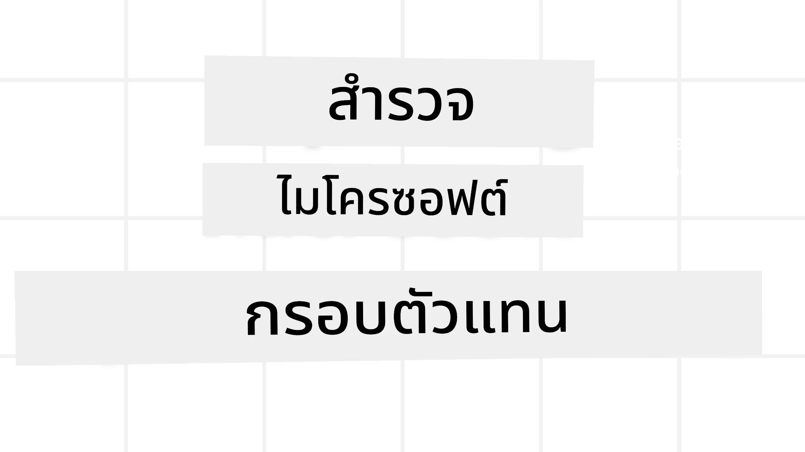
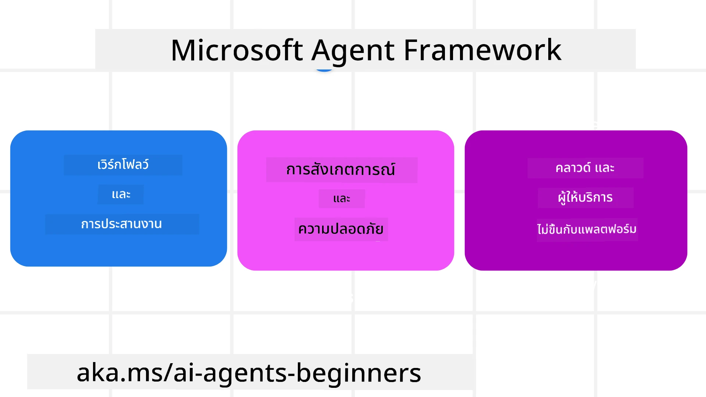
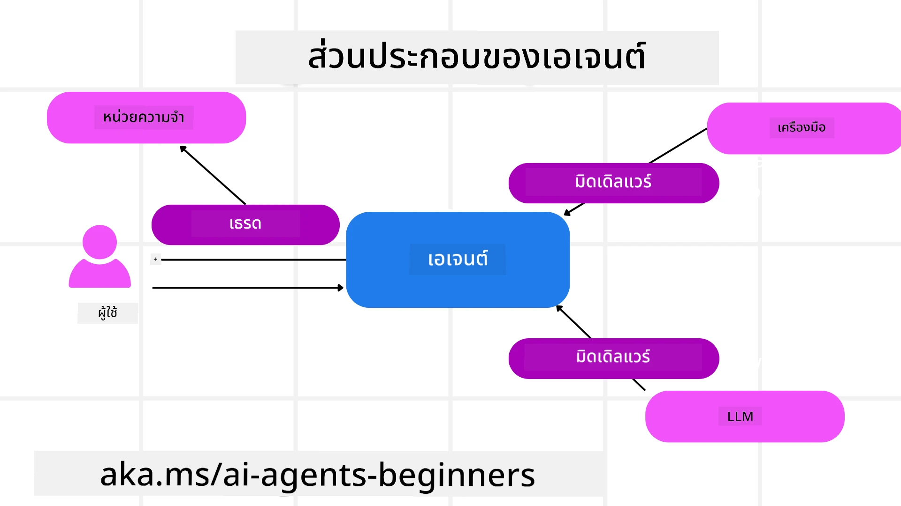

<!--
CO_OP_TRANSLATOR_METADATA:
{
  "original_hash": "19c4dab375acbc733855cc7f2f04edbc",
  "translation_date": "2025-10-02T15:42:52+00:00",
  "source_file": "14-microsoft-agent-framework/README.md",
  "language_code": "th"
}
-->
# การสำรวจ Microsoft Agent Framework



### บทนำ

บทเรียนนี้จะครอบคลุม:

- การทำความเข้าใจ Microsoft Agent Framework: คุณสมบัติสำคัญและคุณค่า  
- การสำรวจแนวคิดหลักของ Microsoft Agent Framework
- การเปรียบเทียบ MAF กับ Semantic Kernel และ AutoGen: คู่มือการย้ายข้อมูล

## เป้าหมายการเรียนรู้

หลังจากจบบทเรียนนี้ คุณจะสามารถ:

- สร้าง AI Agents ที่พร้อมใช้งานในระดับการผลิตด้วย Microsoft Agent Framework
- ใช้คุณสมบัติหลักของ Microsoft Agent Framework กับกรณีการใช้งาน Agentic ของคุณ
- ย้ายและผสานรวมเฟรมเวิร์กและเครื่องมือ Agentic ที่มีอยู่  

## ตัวอย่างโค้ด

ตัวอย่างโค้ดสำหรับ [Microsoft Agent Framework (MAF)](https://aka.ms/ai-agents-beginners/agent-framewrok) สามารถพบได้ใน repository นี้ภายใต้ไฟล์ `xx-python-agent-framework` และ `xx-dotnet-agent-framework`

## การทำความเข้าใจ Microsoft Agent Framework



[Microsoft Agent Framework (MAF)](https://aka.ms/ai-agents-beginners/agent-framewrok) ถูกพัฒนาขึ้นจากประสบการณ์และการเรียนรู้จาก Semantic Kernel และ AutoGen โดยมีความยืดหยุ่นในการตอบสนองต่อกรณีการใช้งาน Agentic ที่หลากหลายในทั้งสภาพแวดล้อมการผลิตและการวิจัย เช่น:

- **การจัดลำดับขั้นตอนของ Agent** ในสถานการณ์ที่ต้องการการทำงานแบบทีละขั้นตอน
- **การจัดลำดับพร้อมกัน** ในสถานการณ์ที่ Agent ต้องทำงานหลายอย่างในเวลาเดียวกัน
- **การจัดลำดับการสนทนากลุ่ม** ในสถานการณ์ที่ Agent สามารถร่วมมือกันทำงานในงานเดียว
- **การจัดลำดับการส่งต่อ** ในสถานการณ์ที่ Agent ส่งต่อภารกิจให้กันเมื่อเสร็จสิ้นงานย่อย
- **การจัดลำดับแบบแม่เหล็ก** ในสถานการณ์ที่ Agent ผู้จัดการสร้างและปรับเปลี่ยนรายการงานและจัดการการประสานงานของ Subagents เพื่อให้งานเสร็จสมบูรณ์

เพื่อส่งมอบ AI Agents ในระดับการผลิต MAF ยังมีคุณสมบัติที่รวมถึง:

- **การสังเกตการณ์** ผ่านการใช้ OpenTelemetry ซึ่งทุกการกระทำของ AI Agent รวมถึงการเรียกใช้เครื่องมือ ขั้นตอนการจัดลำดับ การไหลของเหตุผล และการติดตามประสิทธิภาพผ่านแดชบอร์ด Azure AI Foundry
- **ความปลอดภัย** โดยการโฮสต์ Agent บน Azure AI Foundry ซึ่งมีการควบคุมความปลอดภัย เช่น การเข้าถึงตามบทบาท การจัดการข้อมูลส่วนตัว และความปลอดภัยของเนื้อหาในตัว
- **ความทนทาน** เนื่องจากเธรดและขั้นตอนการทำงานของ Agent สามารถหยุดชั่วคราว ดำเนินการต่อ และกู้คืนจากข้อผิดพลาด ซึ่งช่วยให้กระบวนการที่ใช้เวลานานดำเนินต่อไปได้
- **การควบคุม** เนื่องจากรองรับขั้นตอนการทำงานที่มีมนุษย์เข้ามาเกี่ยวข้อง โดยงานจะถูกทำเครื่องหมายว่าต้องการการอนุมัติจากมนุษย์

Microsoft Agent Framework ยังมุ่งเน้นที่การทำงานร่วมกันได้โดย:

- **การไม่ยึดติดกับคลาวด์** - Agent สามารถทำงานในคอนเทนเนอร์ ในองค์กร และในคลาวด์ที่หลากหลาย
- **การไม่ยึดติดกับผู้ให้บริการ** - Agent สามารถสร้างผ่าน SDK ที่คุณชื่นชอบ รวมถึง Azure OpenAI และ OpenAI
- **การผสานรวมมาตรฐานเปิด** - Agent สามารถใช้โปรโตคอล เช่น Agent-to-Agent (A2A) และ Model Context Protocol (MCP) เพื่อค้นหาและใช้ Agent และเครื่องมืออื่น ๆ
- **ปลั๊กอินและตัวเชื่อมต่อ** - สามารถเชื่อมต่อกับบริการข้อมูลและหน่วยความจำ เช่น Microsoft Fabric, SharePoint, Pinecone และ Qdrant

มาดูกันว่าคุณสมบัติเหล่านี้ถูกนำไปใช้กับแนวคิดหลักของ Microsoft Agent Framework อย่างไร

## แนวคิดหลักของ Microsoft Agent Framework

### Agents



**การสร้าง Agent**

การสร้าง Agent ทำได้โดยการกำหนดบริการการอนุมาน (LLM Provider) ชุดคำสั่งที่ AI Agent ต้องปฏิบัติตาม และ `name` ที่กำหนด:

```python
agent = AzureOpenAIChatClient(credential=AzureCliCredential()).create_agent( instructions="You are good at recommending trips to customers based on their preferences.", name="TripRecommender" )
```

ตัวอย่างด้านบนใช้ `Azure OpenAI` แต่ Agent สามารถสร้างได้โดยใช้บริการหลากหลาย รวมถึง `Azure AI Foundry Agent Service`:

```python
AzureAIAgentClient(async_credential=credential).create_agent( name="HelperAgent", instructions="You are a helpful assistant." ) as agent
```

OpenAI `Responses`, `ChatCompletion` APIs

```python
agent = OpenAIResponsesClient().create_agent( name="WeatherBot", instructions="You are a helpful weather assistant.", )
```

```python
agent = OpenAIChatClient().create_agent( name="HelpfulAssistant", instructions="You are a helpful assistant.", )
```

หรือ Agent ระยะไกลโดยใช้โปรโตคอล A2A:

```python
agent = A2AAgent( name=agent_card.name, description=agent_card.description, agent_card=agent_card, url="https://your-a2a-agent-host" )
```

**การเรียกใช้งาน Agent**

Agent ถูกเรียกใช้งานโดยใช้เมธอด `.run` หรือ `.run_stream` สำหรับการตอบสนองแบบไม่สตรีมและแบบสตรีม

```python
result = await agent.run("What are good places to visit in Amsterdam?")
print(result.text)
```

```python
async for update in agent.run_stream("What are the good places to visit in Amsterdam?"):
    if update.text:
        print(update.text, end="", flush=True)

```

การเรียกใช้งาน Agent แต่ละครั้งยังสามารถปรับแต่งพารามิเตอร์ เช่น `max_tokens` ที่ Agent ใช้ `tools` ที่ Agent สามารถเรียกใช้ และแม้กระทั่ง `model` ที่ใช้สำหรับ Agent

สิ่งนี้มีประโยชน์ในกรณีที่ต้องการโมเดลหรือเครื่องมือเฉพาะสำหรับการทำงานของผู้ใช้ให้เสร็จสมบูรณ์

**Tools**

เครื่องมือสามารถกำหนดได้ทั้งเมื่อกำหนด Agent:

```python
def get_attractions( location: Annotated[str, Field(description="The location to get the top tourist attractions for")], ) -> str: """Get the top tourist attractions for a given location.""" return f"The top attractions for {location} are." 


# When creating a ChatAgent directly 

agent = ChatAgent( chat_client=OpenAIChatClient(), instructions="You are a helpful assistant", tools=[get_attractions]

```

และเมื่อเรียกใช้งาน Agent:

```python

result1 = await agent.run( "What's the best place to visit in Seattle?", tools=[get_attractions] # Tool provided for this run only )
```

**Agent Threads**

Agent Threads ถูกใช้เพื่อจัดการการสนทนาแบบหลายรอบ Threads สามารถสร้างได้โดย:

- ใช้ `get_new_thread()` ซึ่งช่วยให้ Thread ถูกบันทึกไว้ในระยะยาว
- สร้าง Thread โดยอัตโนมัติเมื่อเรียกใช้งาน Agent และมี Thread อยู่เพียงในระหว่างการเรียกใช้งานปัจจุบัน

การสร้าง Thread มีลักษณะดังนี้:

```python
# Create a new thread. 
thread = agent.get_new_thread() # Run the agent with the thread. 
response = await agent.run("Hello, I am here to help you book travel. Where would you like to go?", thread=thread)

```

จากนั้นคุณสามารถทำการ serialize Thread เพื่อบันทึกไว้ใช้ในภายหลัง:

```python
# Create a new thread. 
thread = agent.get_new_thread() 

# Run the agent with the thread. 

response = await agent.run("Hello, how are you?", thread=thread) 

# Serialize the thread for storage. 

serialized_thread = await thread.serialize() 

# Deserialize the thread state after loading from storage. 

resumed_thread = await agent.deserialize_thread(serialized_thread)
```

**Agent Middleware**

Agent โต้ตอบกับเครื่องมือและ LLMs เพื่อทำงานของผู้ใช้ให้เสร็จสมบูรณ์ ในบางสถานการณ์ เราอาจต้องการดำเนินการหรือบันทึกระหว่างการโต้ตอบเหล่านี้ Agent middleware ช่วยให้เราทำสิ่งนี้ได้ผ่าน:

*Function Middleware*

Middleware นี้ช่วยให้เราดำเนินการระหว่าง Agent และฟังก์ชัน/เครื่องมือที่มันจะเรียกใช้ ตัวอย่างของการใช้งานคือเมื่อคุณต้องการบันทึกการเรียกใช้ฟังก์ชัน

ในโค้ดด้านล่าง `next` กำหนดว่าควรเรียกใช้ middleware ถัดไปหรือฟังก์ชันจริง

```python
async def logging_function_middleware(
    context: FunctionInvocationContext,
    next: Callable[[FunctionInvocationContext], Awaitable[None]],
) -> None:
    """Function middleware that logs function execution."""
    # Pre-processing: Log before function execution
    print(f"[Function] Calling {context.function.name}")

    # Continue to next middleware or function execution
    await next(context)

    # Post-processing: Log after function execution
    print(f"[Function] {context.function.name} completed")
```

*Chat Middleware*

Middleware นี้ช่วยให้เราดำเนินการหรือบันทึกระหว่าง Agent และคำขอระหว่าง LLM

สิ่งนี้มีข้อมูลสำคัญ เช่น `messages` ที่ถูกส่งไปยังบริการ AI

```python
async def logging_chat_middleware(
    context: ChatContext,
    next: Callable[[ChatContext], Awaitable[None]],
) -> None:
    """Chat middleware that logs AI interactions."""
    # Pre-processing: Log before AI call
    print(f"[Chat] Sending {len(context.messages)} messages to AI")

    # Continue to next middleware or AI service
    await next(context)

    # Post-processing: Log after AI response
    print("[Chat] AI response received")

```

**Agent Memory**

ตามที่ครอบคลุมในบทเรียน `Agentic Memory` หน่วยความจำเป็นองค์ประกอบสำคัญที่ช่วยให้ Agent ทำงานในบริบทต่าง ๆ MAF มีหน่วยความจำหลายประเภท:

*In-Memory Storage*

นี่คือหน่วยความจำที่ถูกเก็บไว้ใน Threads ระหว่างการทำงานของแอปพลิเคชัน

```python
# Create a new thread. 
thread = agent.get_new_thread() # Run the agent with the thread. 
response = await agent.run("Hello, I am here to help you book travel. Where would you like to go?", thread=thread)
```

*Persistent Messages*

หน่วยความจำนี้ถูกใช้เมื่อเก็บประวัติการสนทนาในหลายเซสชัน มันถูกกำหนดโดยใช้ `chat_message_store_factory`:

```python
from agent_framework import ChatMessageStore

# Create a custom message store
def create_message_store():
    return ChatMessageStore()

agent = ChatAgent(
    chat_client=OpenAIChatClient(),
    instructions="You are a Travel assistant.",
    chat_message_store_factory=create_message_store
)

```

*Dynamic Memory*

หน่วยความจำนี้ถูกเพิ่มลงในบริบทก่อนที่ Agent จะถูกเรียกใช้ หน่วยความจำเหล่านี้สามารถเก็บไว้ในบริการภายนอก เช่น mem0:

```python
from agent_framework.mem0 import Mem0Provider

# Using Mem0 for advanced memory capabilities
memory_provider = Mem0Provider(
    api_key="your-mem0-api-key",
    user_id="user_123",
    application_id="my_app"
)

agent = ChatAgent(
    chat_client=OpenAIChatClient(),
    instructions="You are a helpful assistant with memory.",
    context_providers=memory_provider
)

```

**Agent Observability**

การสังเกตการณ์เป็นสิ่งสำคัญในการสร้างระบบ Agentic ที่เชื่อถือได้และดูแลรักษาได้ MAF ผสานรวมกับ OpenTelemetry เพื่อให้การติดตามและการวัดผลสำหรับการสังเกตการณ์ที่ดีขึ้น

```python
from agent_framework.observability import get_tracer, get_meter

tracer = get_tracer()
meter = get_meter()
with tracer.start_as_current_span("my_custom_span"):
    # do something
    pass
counter = meter.create_counter("my_custom_counter")
counter.add(1, {"key": "value"})
```

### Workflows

MAF มี workflows ที่เป็นขั้นตอนที่กำหนดไว้ล่วงหน้าเพื่อทำงานให้เสร็จสมบูรณ์และรวม AI Agents เป็นส่วนประกอบในขั้นตอนเหล่านั้น

Workflows ประกอบด้วยส่วนประกอบต่าง ๆ ที่ช่วยให้การควบคุมการไหลดีขึ้น Workflows ยังช่วยให้ **การจัดลำดับหลาย Agent** และ **การบันทึกสถานะ** เพื่อบันทึกสถานะ workflow

ส่วนประกอบหลักของ workflow ได้แก่:

**Executors**

Executors รับข้อความนำเข้า ดำเนินการงานที่ได้รับมอบหมาย และผลิตข้อความส่งออก ซึ่งช่วยให้ workflow ก้าวไปสู่การทำงานที่ใหญ่ขึ้นให้เสร็จสมบูรณ์ Executors สามารถเป็น AI Agent หรือ logic ที่กำหนดเอง

**Edges**

Edges ถูกใช้เพื่อกำหนดการไหลของข้อความใน workflow ซึ่งสามารถเป็น:

*Direct Edges* - การเชื่อมต่อแบบง่าย ๆ ระหว่าง Executors:

```python
from agent_framework import WorkflowBuilder

builder = WorkflowBuilder()
builder.add_edge(source_executor, target_executor)
builder.set_start_executor(source_executor)
workflow = builder.build()
```

*Conditional Edges* - ถูกเปิดใช้งานเมื่อเงื่อนไขบางอย่างถูกตอบสนอง ตัวอย่างเช่น เมื่อห้องพักโรงแรมไม่ว่าง Executor สามารถแนะนำตัวเลือกอื่น ๆ

*Switch-case Edges* - ส่งข้อความไปยัง Executors ต่าง ๆ ตามเงื่อนไขที่กำหนด ตัวอย่างเช่น หากลูกค้าการเดินทางมีสิทธิ์เข้าถึงพิเศษ งานของพวกเขาจะถูกจัดการผ่าน workflow อื่น

*Fan-out Edges* - ส่งข้อความหนึ่งไปยังเป้าหมายหลายแห่ง

*Fan-in Edges* - รวบรวมข้อความหลายข้อความจาก Executors ต่าง ๆ และส่งไปยังเป้าหมายเดียว

**Events**

เพื่อให้การสังเกตการณ์ใน workflows ดีขึ้น MAF มี events ในตัวสำหรับการดำเนินการ เช่น:

- `WorkflowStartedEvent`  - การดำเนินการ workflow เริ่มต้น
- `WorkflowOutputEvent` - Workflow ผลิตผลลัพธ์
- `WorkflowErrorEvent` - Workflow พบข้อผิดพลาด
- `ExecutorInvokeEvent`  - Executor เริ่มดำเนินการ
- `ExecutorCompleteEvent`  - Executor เสร็จสิ้นการดำเนินการ
- `RequestInfoEvent` - มีการออกคำขอ

## การย้ายจากเฟรมเวิร์กอื่น (Semantic Kernel และ AutoGen)

### ความแตกต่างระหว่าง MAF และ Semantic Kernel

**การสร้าง Agent ที่ง่ายขึ้น**

Semantic Kernel ต้องการการสร้าง Kernel instance สำหรับทุก Agent ในขณะที่ MAF ใช้แนวทางที่ง่ายขึ้นโดยใช้ extensions สำหรับผู้ให้บริการหลัก

```python
agent = AzureOpenAIChatClient(credential=AzureCliCredential()).create_agent( instructions="You are good at reccomending trips to customers based on their preferences.", name="TripRecommender" )
```

**การสร้าง Agent Thread**

Semantic Kernel ต้องการการสร้าง Threads ด้วยตนเอง ใน MAF Agent จะถูกกำหนด Thread โดยตรง

```python
thread = agent.get_new_thread() # Run the agent with the thread. 
```

**การลงทะเบียนเครื่องมือ**

ใน Semantic Kernel เครื่องมือจะถูกลงทะเบียนกับ Kernel และ Kernel จะถูกส่งต่อไปยัง Agent ใน MAF เครื่องมือจะถูกลงทะเบียนโดยตรงในระหว่างกระบวนการสร้าง Agent

```python
agent = ChatAgent( chat_client=OpenAIChatClient(), instructions="You are a helpful assistant", tools=[get_attractions]
```

### ความแตกต่างระหว่าง MAF และ AutoGen

**Teams vs Workflows**

`Teams` เป็นโครงสร้างเหตุการณ์สำหรับกิจกรรมที่ขับเคลื่อนด้วยเหตุการณ์กับ Agent ใน AutoGen ในขณะที่ MAF ใช้ `Workflows` ที่ส่งข้อมูลไปยัง Executors ผ่านสถาปัตยกรรมแบบกราฟ

**การสร้างเครื่องมือ**

AutoGen ใช้ `FunctionTool` เพื่อห่อหุ้มฟังก์ชันสำหรับ Agent ในการเรียกใช้ ในขณะที่ MAF ใช้ @ai_function ซึ่งทำงานคล้ายกันแต่ยังสามารถอนุมาน schemas โดยอัตโนมัติสำหรับแต่ละฟังก์ชัน

**พฤติกรรมของ Agent**

Agent ใน AutoGen เป็น Agent แบบรอบเดียวโดยค่าเริ่มต้น เว้นแต่ `max_tool_iterations` จะถูกตั้งค่าให้สูงกว่า ใน MAF `ChatAgent` เป็น Agent แบบหลายรอบโดยค่าเริ่มต้น ซึ่งหมายความว่ามันจะเรียกใช้เครื่องมือจนกว่างานของผู้ใช้จะเสร็จสมบูรณ์

## ตัวอย่างโค้ด

ตัวอย่างโค้ดสำหรับ Microsoft Agent Framework สามารถพบได้ใน repository นี้ภายใต้ไฟล์ `xx-python-agent-framework` และ `xx-dotnet-agent-framework`

## มีคำถามเพิ่มเติมเกี่ยวกับ Microsoft Agent Framework?

เข้าร่วม [Azure AI Foundry Discord](https://aka.ms/ai-agents/discord) เพื่อพบปะกับผู้เรียนคนอื่น ๆ เข้าร่วมชั่วโมงสำนักงาน และรับคำตอบสำหรับคำถามเกี่ยวกับ AI Agents ของคุณ

---

**ข้อจำกัดความรับผิดชอบ**:  
เอกสารนี้ได้รับการแปลโดยใช้บริการแปลภาษา AI [Co-op Translator](https://github.com/Azure/co-op-translator) แม้ว่าเราจะพยายามให้การแปลมีความถูกต้อง แต่โปรดทราบว่าการแปลอัตโนมัติอาจมีข้อผิดพลาดหรือความไม่ถูกต้อง เอกสารต้นฉบับในภาษาดั้งเดิมควรถือเป็นแหล่งข้อมูลที่เชื่อถือได้ สำหรับข้อมูลที่สำคัญ ขอแนะนำให้ใช้บริการแปลภาษามนุษย์ที่เป็นมืออาชีพ เราไม่รับผิดชอบต่อความเข้าใจผิดหรือการตีความผิดที่เกิดจากการใช้การแปลนี้