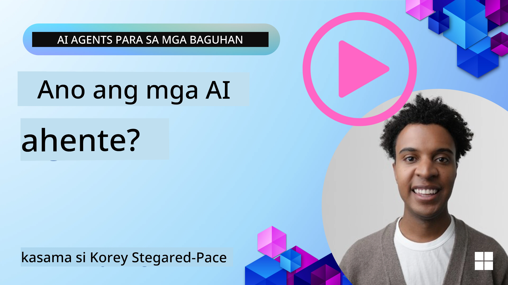
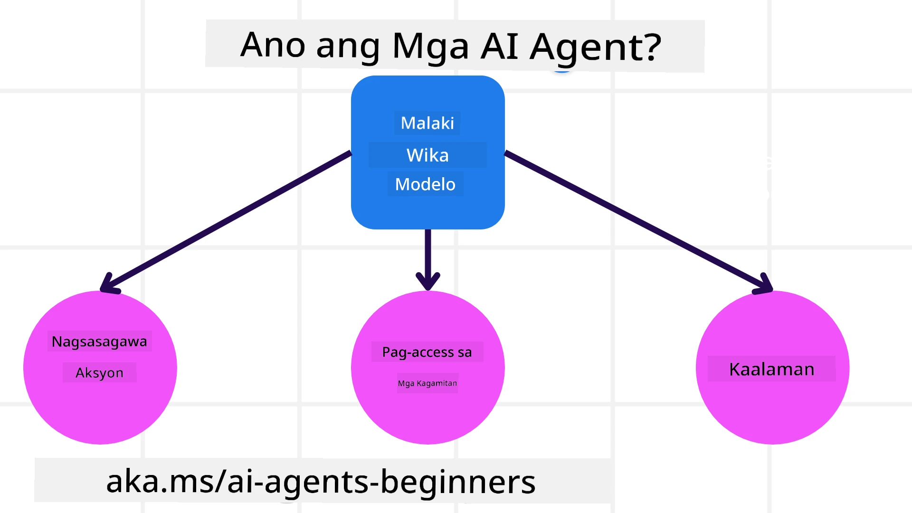
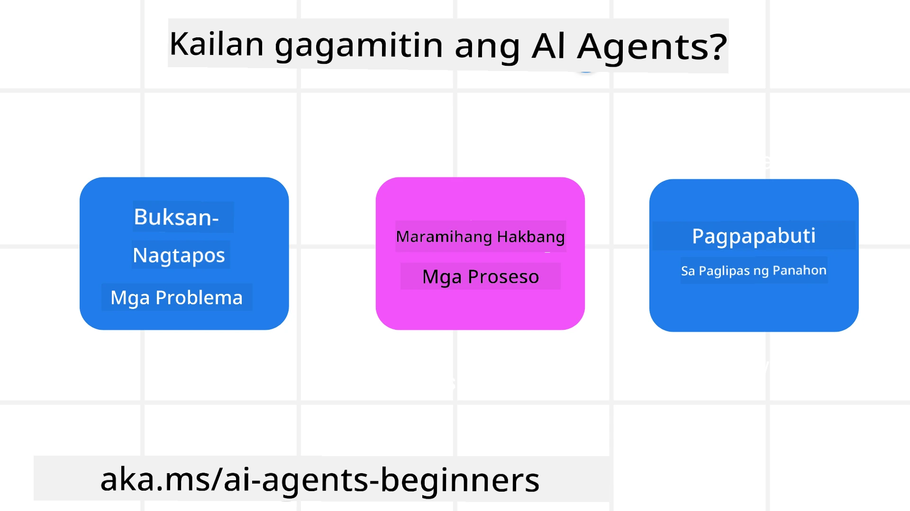

<!--
CO_OP_TRANSLATOR_METADATA:
{
  "original_hash": "cdd28bc00816d2773bb2b5968d782abc",
  "translation_date": "2025-11-11T11:30:51+00:00",
  "source_file": "01-intro-to-ai-agents/README.md",
  "language_code": "tl"
}
-->

> _(I-click ang imahe sa itaas para mapanood ang video ng araling ito)_

# Panimula sa AI Agents at Mga Gamit ng Agent

Maligayang pagdating sa kursong "AI Agents para sa mga Baguhan"! Ang kursong ito ay nagbibigay ng pangunahing kaalaman at mga halimbawa ng aplikasyon para sa paggawa ng AI Agents.

Sumali sa <a href="https://discord.gg/kzRShWzttr" target="_blank">Azure AI Discord Community</a> upang makilala ang iba pang mga nag-aaral at tagabuo ng AI Agents, at magtanong tungkol sa kursong ito.

Upang simulan ang kursong ito, magsisimula tayo sa mas malalim na pag-unawa kung ano ang AI Agents at kung paano natin sila magagamit sa mga aplikasyon at workflows na ating binubuo.

## Panimula

Ang araling ito ay sumasaklaw sa:

- Ano ang AI Agents at ano ang iba't ibang uri ng agents?
- Anong mga gamit ang pinakaangkop para sa AI Agents at paano sila makakatulong sa atin?
- Ano ang ilan sa mga pangunahing bahagi sa pagdidisenyo ng Agentic Solutions?

## Mga Layunin sa Pag-aaral
Pagkatapos makumpleto ang araling ito, dapat ay kaya mong:

- Maunawaan ang mga konsepto ng AI Agent at kung paano sila naiiba sa ibang AI solutions.
- Magamit ang AI Agents nang mas epektibo.
- Magdisenyo ng Agentic solutions nang produktibo para sa parehong mga user at customer.

## Pagpapaliwanag ng AI Agents at Mga Uri ng AI Agents

### Ano ang AI Agents?

Ang AI Agents ay **mga sistema** na nagbibigay-daan sa **Large Language Models (LLMs)** na **gumawa ng mga aksyon** sa pamamagitan ng pagpapalawak ng kanilang kakayahan sa pagbibigay sa LLMs ng **access sa mga tools** at **kaalaman**.

Himayin natin ang depinisyong ito sa mas maliliit na bahagi:

- **Sistema** - Mahalagang isipin ang agents hindi bilang isang solong bahagi lamang kundi bilang isang sistema ng maraming bahagi. Sa pinaka-basic na antas, ang mga bahagi ng isang AI Agent ay:
  - **Environment** - Ang tinukoy na espasyo kung saan gumagana ang AI Agent. Halimbawa, kung mayroon tayong travel booking AI Agent, ang environment ay maaaring ang travel booking system na ginagamit ng AI Agent upang tapusin ang mga gawain.
  - **Sensors** - Ang mga environment ay may impormasyon at nagbibigay ng feedback. Ginagamit ng AI Agents ang sensors upang mangolekta at mag-interpret ng impormasyon tungkol sa kasalukuyang estado ng environment. Sa halimbawa ng Travel Booking Agent, ang travel booking system ay maaaring magbigay ng impormasyon tulad ng availability ng hotel o presyo ng flight.
  - **Actuators** - Kapag natanggap ng AI Agent ang kasalukuyang estado ng environment, para sa kasalukuyang gawain, tinutukoy ng agent kung anong aksyon ang gagawin upang baguhin ang environment. Para sa travel booking agent, maaaring mag-book ito ng available na kuwarto para sa user.

**Large Language Models** - Ang konsepto ng agents ay umiiral na bago pa ang paglikha ng LLMs. Ang bentahe ng paggawa ng AI Agents gamit ang LLMs ay ang kanilang kakayahang mag-interpret ng human language at data. Ang kakayahang ito ay nagbibigay-daan sa LLMs na mag-interpret ng impormasyon mula sa environment at magtakda ng plano upang baguhin ang environment.

**Gumawa ng Aksyon** - Sa labas ng AI Agent systems, ang LLMs ay limitado sa mga sitwasyon kung saan ang aksyon ay ang pagbuo ng content o impormasyon batay sa prompt ng user. Sa loob ng AI Agent systems, maaaring magawa ng LLMs ang mga gawain sa pamamagitan ng pag-interpret ng kahilingan ng user at paggamit ng mga tools na available sa kanilang environment.

**Access sa Tools** - Ang mga tools na maaaring ma-access ng LLM ay tinutukoy ng 1) ang environment kung saan ito gumagana at 2) ang developer ng AI Agent. Sa halimbawa ng travel agent, ang tools ng agent ay limitado sa mga operasyon na available sa booking system, at/o maaaring limitahan ng developer ang access ng agent sa mga tools tulad ng flights.

**Memory+Knowledge** - Ang memory ay maaaring short-term sa konteksto ng pag-uusap sa pagitan ng user at ng agent. Long-term, sa labas ng impormasyon na ibinibigay ng environment, maaaring kumuha ng kaalaman ang AI Agents mula sa ibang mga sistema, serbisyo, tools, at maging sa ibang agents. Sa halimbawa ng travel agent, ang kaalaman ay maaaring impormasyon tungkol sa travel preferences ng user na matatagpuan sa customer database.

### Ang iba't ibang uri ng agents

Ngayon na mayroon na tayong pangkalahatang depinisyon ng AI Agents, tingnan natin ang ilang partikular na uri ng agents at kung paano sila maaaring gamitin sa travel booking AI agent.

| **Uri ng Agent**              | **Deskripsyon**                                                                                                                       | **Halimbawa**                                                                                                                                                                                                                   |
| ----------------------------- | ------------------------------------------------------------------------------------------------------------------------------------- | ----------------------------------------------------------------------------------------------------------------------------------------------------------------------------------------------------------------------------- |
| **Simple Reflex Agents**      | Gumagawa ng agarang aksyon batay sa mga paunang natukoy na patakaran.                                                                 | Ang travel agent ay nag-iinterpret ng konteksto ng email at ipinapasa ang mga reklamo sa customer service.                                                                                                                      |
| **Model-Based Reflex Agents** | Gumagawa ng aksyon batay sa isang modelo ng mundo at mga pagbabago sa modelong iyon.                                                   | Ang travel agent ay inuuna ang mga ruta na may malalaking pagbabago sa presyo batay sa access sa historical pricing data.                                                                                                       |
| **Goal-Based Agents**         | Gumagawa ng plano upang maabot ang partikular na layunin sa pamamagitan ng pag-interpret ng layunin at pagtukoy ng mga aksyon upang maabot ito. | Ang travel agent ay nagbu-book ng biyahe sa pamamagitan ng pagtukoy ng mga kinakailangang travel arrangements (kotse, pampublikong transportasyon, flights) mula sa kasalukuyang lokasyon patungo sa destinasyon.                                                      |
| **Utility-Based Agents**      | Isinasaalang-alang ang mga preference at tinatimbang ang mga tradeoff numerically upang matukoy kung paano maabot ang mga layunin.     | Ang travel agent ay pinapakinabangan ang utility sa pamamagitan ng pagtimbang ng convenience vs. cost kapag nagbu-book ng travel.                                                                                              |
| **Learning Agents**           | Nagpapabuti sa paglipas ng panahon sa pamamagitan ng pagtugon sa feedback at pag-aadjust ng mga aksyon nang naaayon.                                                        | Ang travel agent ay nagpapabuti sa pamamagitan ng paggamit ng feedback ng customer mula sa post-trip surveys upang gumawa ng mga adjustment sa mga susunod na bookings.                                                                 |
| **Hierarchical Agents**       | Mayroong maraming agents sa isang tiered system, kung saan ang mas mataas na antas ng agents ay naghahati ng mga gawain sa mas mababang antas ng agents upang tapusin. | Ang travel agent ay nagkakansela ng biyahe sa pamamagitan ng paghahati ng gawain sa mga subtasks (halimbawa, pagkansela ng partikular na bookings) at pinapagawa ito sa mas mababang antas ng agents, na nag-uulat pabalik sa mas mataas na antas ng agent. |
| **Multi-Agent Systems (MAS)** | Ang mga agents ay gumagawa ng mga gawain nang independyente, maaaring kooperatibo o kompetitibo.                                       | Kooperatibo: Maraming agents ang nagbu-book ng partikular na travel services tulad ng hotels, flights, at entertainment. Kompetitibo: Maraming agents ang nagma-manage at nagko-compete sa isang shared hotel booking calendar upang mag-book ng customers sa hotel. |

## Kailan Gagamitin ang AI Agents

Sa naunang seksyon, ginamit natin ang Travel Agent use-case upang ipaliwanag kung paano maaaring gamitin ang iba't ibang uri ng agents sa iba't ibang senaryo ng travel booking. Patuloy nating gagamitin ang application na ito sa buong kurso.

Tingnan natin ang mga uri ng use cases na pinakaangkop para sa AI Agents:

- **Open-Ended Problems** - Pinapayagan ang LLM na tukuyin ang mga kinakailangang hakbang upang tapusin ang isang gawain dahil hindi ito laging maaaring i-hardcode sa isang workflow.
- **Multi-Step Processes** - Mga gawain na nangangailangan ng antas ng komplikasyon kung saan ang AI Agent ay kailangang gumamit ng tools o impormasyon sa maraming turn sa halip na single shot retrieval.  
- **Improvement Over Time** - Mga gawain kung saan maaaring mag-improve ang agent sa paglipas ng panahon sa pamamagitan ng pagtanggap ng feedback mula sa environment o users upang magbigay ng mas mahusay na utility.

Tatalakayin natin ang mas maraming konsiderasyon sa paggamit ng AI Agents sa araling Building Trustworthy AI Agents.

## Mga Pangunahing Kaalaman sa Agentic Solutions

### Pagbuo ng Agent

Ang unang hakbang sa pagdidisenyo ng isang AI Agent system ay ang pagtukoy sa mga tools, aksyon, at pag-uugali. Sa kursong ito, magpo-focus tayo sa paggamit ng **Azure AI Agent Service** upang tukuyin ang ating mga Agents. Nag-aalok ito ng mga tampok tulad ng:

- Pagpili ng Open Models tulad ng OpenAI, Mistral, at Llama
- Paggamit ng Licensed Data sa pamamagitan ng mga provider tulad ng Tripadvisor
- Paggamit ng standardized OpenAPI 3.0 tools

### Agentic Patterns

Ang komunikasyon sa LLMs ay sa pamamagitan ng prompts. Dahil sa semi-autonomous na katangian ng AI Agents, hindi laging posible o kinakailangan na manu-manong i-reprompt ang LLM pagkatapos ng pagbabago sa environment. Gumagamit tayo ng **Agentic Patterns** na nagbibigay-daan sa atin na mag-prompt sa LLM sa maraming hakbang sa mas scalable na paraan.

Ang kursong ito ay hinati sa ilan sa mga kasalukuyang popular na Agentic patterns.

### Agentic Frameworks

Ang Agentic Frameworks ay nagbibigay-daan sa mga developer na magpatupad ng agentic patterns sa pamamagitan ng code. Ang mga framework na ito ay nag-aalok ng mga template, plugins, at tools para sa mas mahusay na kolaborasyon ng AI Agents. Ang mga benepisyo nito ay nagbibigay ng kakayahan para sa mas mahusay na observability at troubleshooting ng AI Agent systems.

Sa kursong ito, susuriin natin ang research-driven AutoGen framework at ang production-ready Agent framework mula sa Semantic Kernel.

## Mga Halimbawa ng Code

- Python: [Agent Framework](./code_samples/01-python-agent-framework.ipynb)
- .NET: [Agent Framework](./code_samples/01-dotnet-agent-framework.md)

## May Karagdagang Tanong Tungkol sa AI Agents?

Sumali sa [Azure AI Foundry Discord](https://aka.ms/ai-agents/discord) upang makipag-usap sa ibang mga nag-aaral, dumalo sa office hours, at masagot ang iyong mga tanong tungkol sa AI Agents.

## Nakaraang Aralin

[Course Setup](../00-course-setup/README.md)

## Susunod na Aralin

[Exploring Agentic Frameworks](../02-explore-agentic-frameworks/README.md)

---

<!-- CO-OP TRANSLATOR DISCLAIMER START -->
**Paunawa**:  
Ang dokumentong ito ay isinalin gamit ang AI translation service [Co-op Translator](https://github.com/Azure/co-op-translator). Bagama't sinisikap naming maging tumpak, mangyaring tandaan na ang mga awtomatikong pagsasalin ay maaaring maglaman ng mga pagkakamali o hindi pagkakatugma. Ang orihinal na dokumento sa kanyang katutubong wika ang dapat ituring na mapagkakatiwalaang pinagmulan. Para sa mahalagang impormasyon, inirerekomenda ang propesyonal na pagsasalin ng tao. Hindi kami mananagot sa anumang hindi pagkakaunawaan o maling interpretasyon na dulot ng paggamit ng pagsasaling ito.
<!-- CO-OP TRANSLATOR DISCLAIMER END -->