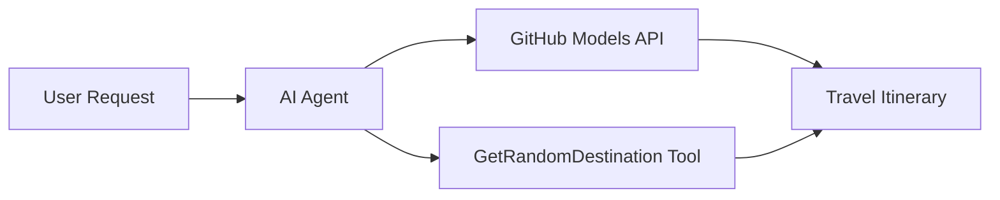

<!--
CO_OP_TRANSLATOR_METADATA:
{
  "original_hash": "5f351412e934f0833c8c821a0a60efaf",
  "translation_date": "2025-11-13T13:27:52+00:00",
  "source_file": "01-intro-to-ai-agents/code_samples/01-dotnet-agent-framework.md",
  "language_code": "tl"
}
-->
# 🌍 AI Travel Agent gamit ang Microsoft Agent Framework (.NET)

## 📋 Pangkalahatang-ideya ng Senaryo

Ang halimbawang ito ay nagpapakita kung paano bumuo ng isang matalinong travel planning agent gamit ang Microsoft Agent Framework para sa .NET. Ang agent ay kayang awtomatikong lumikha ng personalized na day-trip itineraries para sa mga random na destinasyon sa buong mundo.

### Pangunahing Kakayahan:

- 🎲 **Random na Pagpili ng Destinasyon**: Gumagamit ng custom na tool para pumili ng mga lugar na bakasyunan
- 🗺️ **Matalinong Pagpaplano ng Biyahe**: Lumilikha ng detalyadong day-by-day na itineraries
- 🔄 **Real-time Streaming**: Sinusuportahan ang parehong agarang tugon at streaming na tugon
- 🛠️ **Integrasyon ng Custom na Tool**: Ipinapakita kung paano palawakin ang kakayahan ng agent

## 🔧 Teknikal na Arkitektura

### Pangunahing Teknolohiya

- **Microsoft Agent Framework**: Pinakabagong implementasyon ng .NET para sa pagbuo ng AI agents
- **Integrasyon ng GitHub Models**: Gumagamit ng inference service ng AI model ng GitHub
- **OpenAI API Compatibility**: Umaasa sa mga OpenAI client libraries na may custom na endpoints
- **Secure Configuration**: Pamamahala ng API key batay sa environment

### Pangunahing Komponent

1. **AIAgent**: Ang pangunahing orchestrator ng agent na humahawak sa daloy ng usapan
2. **Custom Tools**: `GetRandomDestination()` function na magagamit ng agent
3. **Chat Client**: Interface ng pag-uusap na suportado ng GitHub Models
4. **Streaming Support**: Kakayahan sa real-time na pagbuo ng tugon

### Pattern ng Integrasyon



## 🚀 Pagsisimula

### Mga Kinakailangan

- [.NET 10 SDK](https://dotnet.microsoft.com/download/dotnet/10.0) o mas mataas
- [GitHub Models API access token](https://docs.github.com/github-models/github-models-at-scale/using-your-own-api-keys-in-github-models)

### Kinakailangang Environment Variables

```bash
# zsh/bash
export GH_TOKEN=<your_github_token>
export GH_ENDPOINT=https://models.github.ai/inference
export GH_MODEL_ID=openai/gpt-5-mini
```

```powershell
# PowerShell
$env:GH_TOKEN = "<your_github_token>"
$env:GH_ENDPOINT = "https://models.github.ai/inference"
$env:GH_MODEL_ID = "openai/gpt-5-mini"
```

### Halimbawang Kodigo

Upang patakbuhin ang halimbawa ng kodigo,

```bash
# zsh/bash
chmod +x ./01-dotnet-agent-framework.cs
./01-dotnet-agent-framework.cs
```

O gamit ang dotnet CLI:

```bash
dotnet run ./01-dotnet-agent-framework.cs
```

Tingnan ang [`01-dotnet-agent-framework.cs`](../../../../01-intro-to-ai-agents/code_samples/01-dotnet-agent-framework.cs) para sa kumpletong kodigo.

```csharp
#!/usr/bin/dotnet run

#:package Microsoft.Extensions.AI@9.*
#:package Microsoft.Agents.AI.OpenAI@1.*-*

using System.ClientModel;
using System.ComponentModel;

using Microsoft.Agents.AI;
using Microsoft.Extensions.AI;

using OpenAI;

// Tool Function: Random Destination Generator
// This static method will be available to the agent as a callable tool
// The [Description] attribute helps the AI understand when to use this function
// This demonstrates how to create custom tools for AI agents
[Description("Provides a random vacation destination.")]
static string GetRandomDestination()
{
    // List of popular vacation destinations around the world
    // The agent will randomly select from these options
    var destinations = new List<string>
    {
        "Paris, France",
        "Tokyo, Japan",
        "New York City, USA",
        "Sydney, Australia",
        "Rome, Italy",
        "Barcelona, Spain",
        "Cape Town, South Africa",
        "Rio de Janeiro, Brazil",
        "Bangkok, Thailand",
        "Vancouver, Canada"
    };

    // Generate random index and return selected destination
    // Uses System.Random for simple random selection
    var random = new Random();
    int index = random.Next(destinations.Count);
    return destinations[index];
}

// Extract configuration from environment variables
// Retrieve the GitHub Models API endpoint, defaults to https://models.github.ai/inference if not specified
// Retrieve the model ID, defaults to openai/gpt-5-mini if not specified
// Retrieve the GitHub token for authentication, throws exception if not specified
var github_endpoint = Environment.GetEnvironmentVariable("GH_ENDPOINT") ?? "https://models.github.ai/inference";
var github_model_id = Environment.GetEnvironmentVariable("GH_MODEL_ID") ?? "openai/gpt-5-mini";
var github_token = Environment.GetEnvironmentVariable("GH_TOKEN") ?? throw new InvalidOperationException("GH_TOKEN is not set.");

// Configure OpenAI Client Options
// Create configuration options to point to GitHub Models endpoint
// This redirects OpenAI client calls to GitHub's model inference service
var openAIOptions = new OpenAIClientOptions()
{
    Endpoint = new Uri(github_endpoint)
};

// Initialize OpenAI Client with GitHub Models Configuration
// Create OpenAI client using GitHub token for authentication
// Configure it to use GitHub Models endpoint instead of OpenAI directly
var openAIClient = new OpenAIClient(new ApiKeyCredential(github_token), openAIOptions);

// Create AI Agent with Travel Planning Capabilities
// Initialize OpenAI client, get chat client for specified model, and create AI agent
// Configure agent with travel planning instructions and random destination tool
// The agent can now plan trips using the GetRandomDestination function
AIAgent agent = openAIClient
    .GetChatClient(github_model_id)
    .CreateAIAgent(
        instructions: "You are a helpful AI Agent that can help plan vacations for customers at random destinations",
        tools: [AIFunctionFactory.Create(GetRandomDestination)]
    );

// Execute Agent: Plan a Day Trip
// Run the agent with streaming enabled for real-time response display
// Shows the agent's thinking and response as it generates the content
// Provides better user experience with immediate feedback
await foreach (var update in agent.RunStreamingAsync("Plan me a day trip"))
{
    await Task.Delay(10);
    Console.Write(update);
}
```

## 🎓 Mahahalagang Aral

1. **Arkitektura ng Agent**: Ang Microsoft Agent Framework ay nagbibigay ng malinis at type-safe na paraan sa pagbuo ng AI agents sa .NET
2. **Integrasyon ng Tool**: Ang mga function na may `[Description]` na attribute ay nagiging magagamit na tools para sa agent
3. **Pamamahala ng Konfigurasyon**: Ang mga environment variable at secure na paghawak ng kredensyal ay sumusunod sa pinakamahusay na kasanayan ng .NET
4. **OpenAI Compatibility**: Ang integrasyon ng GitHub Models ay gumagana nang maayos sa pamamagitan ng OpenAI-compatible APIs

## 🔗 Karagdagang Mga Mapagkukunan

- [Microsoft Agent Framework Documentation](https://learn.microsoft.com/agent-framework)
- [GitHub Models Marketplace](https://github.com/marketplace?type=models)
- [Microsoft.Extensions.AI](https://learn.microsoft.com/dotnet/ai/microsoft-extensions-ai)
- [.NET Single File Apps](https://devblogs.microsoft.com/dotnet/announcing-dotnet-run-app)

---

<!-- CO-OP TRANSLATOR DISCLAIMER START -->
**Paunawa**:  
Ang dokumentong ito ay isinalin gamit ang AI translation service na [Co-op Translator](https://github.com/Azure/co-op-translator). Bagama't sinisikap naming maging tumpak, pakitandaan na ang mga awtomatikong pagsasalin ay maaaring maglaman ng mga pagkakamali o hindi pagkakatugma. Ang orihinal na dokumento sa orihinal nitong wika ang dapat ituring na opisyal na sanggunian. Para sa mahalagang impormasyon, inirerekomenda ang propesyonal na pagsasalin ng tao. Hindi kami mananagot sa anumang hindi pagkakaunawaan o maling interpretasyon na dulot ng paggamit ng pagsasaling ito.
<!-- CO-OP TRANSLATOR DISCLAIMER END -->