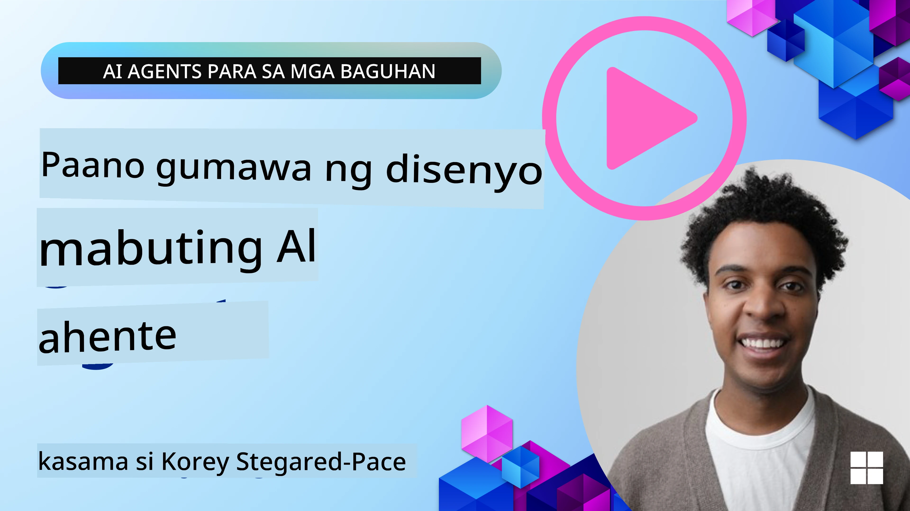
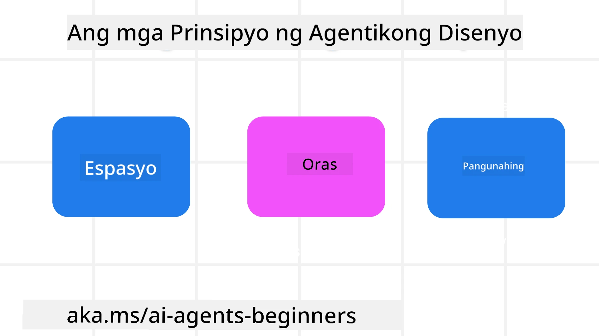

<!--
CO_OP_TRANSLATOR_METADATA:
{
  "original_hash": "d71524fe83a23829ae7a23b4031aaac8",
  "translation_date": "2025-11-13T13:30:28+00:00",
  "source_file": "03-agentic-design-patterns/README.md",
  "language_code": "tl"
}
-->

> _(I-click ang imahe sa itaas para mapanood ang video ng araling ito)_
# Prinsipyo sa Disenyo ng AI Agentic

## Panimula

Maraming paraan para mag-isip tungkol sa pagbuo ng AI Agentic Systems. Dahil ang kalabuan ay isang tampok at hindi isang problema sa disenyo ng Generative AI, minsan mahirap para sa mga inhinyero na malaman kung saan magsisimula. Nilikha namin ang isang hanay ng mga prinsipyo sa disenyo ng UX na nakatuon sa tao upang tulungan ang mga developer na bumuo ng mga sistemang agentic na nakatuon sa customer upang matugunan ang kanilang mga pangangailangan sa negosyo. Ang mga prinsipyo sa disenyo na ito ay hindi isang tiyak na arkitektura ngunit isang panimulang punto para sa mga koponan na nagde-define at bumubuo ng mga karanasan sa agent.

Sa pangkalahatan, ang mga agent ay dapat:

- Palawakin at sukatin ang kakayahan ng tao (pag-iisip, paglutas ng problema, awtomasyon, atbp.)
- Punan ang mga puwang sa kaalaman (bigyan ako ng kaalaman sa mga domain, pagsasalin, atbp.)
- Magbigay-daan at sumuporta sa pakikipagtulungan sa mga paraan kung paano natin gustong makipagtulungan sa iba
- Gawin tayong mas mabuting bersyon ng ating sarili (hal., life coach/task master, pagtulong sa atin na matutunan ang mga kasanayan sa emosyonal na regulasyon at mindfulness, pagbuo ng katatagan, atbp.)

## Saklaw ng Araling Ito

- Ano ang mga Prinsipyo sa Disenyo ng Agentic
- Ano ang mga alituntunin na dapat sundin habang ipinatutupad ang mga prinsipyo sa disenyo na ito
- Ano ang mga halimbawa ng paggamit ng mga prinsipyo sa disenyo

## Mga Layunin sa Pagkatuto

Pagkatapos makumpleto ang araling ito, magagawa mo:

1. Ipaliwanag kung ano ang Prinsipyo sa Disenyo ng Agentic
2. Ipaliwanag ang mga alituntunin para sa paggamit ng Prinsipyo sa Disenyo ng Agentic
3. Maunawaan kung paano bumuo ng isang agent gamit ang Prinsipyo sa Disenyo ng Agentic

## Ang Prinsipyo sa Disenyo ng Agentic

### Agent (Space)

Ito ang kapaligiran kung saan gumagana ang agent. Ang mga prinsipyong ito ay nagbibigay ng gabay kung paano natin idinisenyo ang mga agent para makipag-ugnayan sa pisikal at digital na mundo.

- **Pagkonekta, hindi pagwawalang-bahala** – tumulong na ikonekta ang mga tao sa iba pang tao, mga kaganapan, at actionable na kaalaman upang magbigay-daan sa pakikipagtulungan at koneksyon.
- Ang mga agent ay tumutulong na ikonekta ang mga kaganapan, kaalaman, at mga tao.
- Ang mga agent ay nagdadala ng mga tao na mas malapit sa isa't isa. Hindi sila idinisenyo upang palitan o maliitin ang mga tao.
- **Madaling ma-access ngunit paminsan-minsang hindi nakikita** – ang agent ay pangunahing gumagana sa background at nagbibigay lamang ng paalala kapag ito ay may kaugnayan at naaangkop.
  - Ang agent ay madaling mahanap at ma-access para sa mga awtorisadong user sa anumang device o platform.
  - Ang agent ay sumusuporta sa multimodal na input at output (tunog, boses, teksto, atbp.).
  - Ang agent ay maaaring seamless na mag-transition sa pagitan ng foreground at background; sa pagitan ng proactive at reactive, depende sa sensing ng pangangailangan ng user.
  - Ang agent ay maaaring gumana sa hindi nakikitang anyo, ngunit ang proseso nito sa background at pakikipagtulungan sa iba pang mga agent ay transparent at kontrolado ng user.

### Agent (Time)

Ito ang paraan kung paano gumagana ang agent sa paglipas ng panahon. Ang mga prinsipyong ito ay nagbibigay ng gabay kung paano natin idinisenyo ang mga agent na nakikipag-ugnayan sa nakaraan, kasalukuyan, at hinaharap.

- **Nakaraan**: Pagmumuni-muni sa kasaysayan na kinabibilangan ng estado at konteksto.
  - Ang agent ay nagbibigay ng mas may kaugnayang resulta batay sa pagsusuri ng mas mayamang makasaysayang data lampas sa kaganapan, tao, o estado lamang.
  - Ang agent ay lumilikha ng koneksyon mula sa mga nakaraang kaganapan at aktibong nagmumuni-muni sa memorya upang makipag-ugnayan sa kasalukuyang sitwasyon.
- **Ngayon**: Pagbibigay ng paalala higit sa notipikasyon.
  - Ang agent ay nagtataglay ng komprehensibong diskarte sa pakikipag-ugnayan sa mga tao. Kapag may nangyari, ang agent ay lumalampas sa static na notipikasyon o iba pang static na pormalidad. Ang agent ay maaaring mag-simplify ng mga daloy o dynamic na bumuo ng mga cue upang idirekta ang atensyon ng user sa tamang sandali.
  - Ang agent ay naghahatid ng impormasyon batay sa kontekstwal na kapaligiran, mga pagbabago sa lipunan at kultura, at iniangkop sa intensyon ng user.
  - Ang pakikipag-ugnayan ng agent ay maaaring unti-unti, umuunlad/nagiging mas kumplikado upang bigyang kapangyarihan ang mga user sa pangmatagalang panahon.
- **Hinaharap**: Pag-aangkop at pag-unlad.
  - Ang agent ay umaangkop sa iba't ibang device, platform, at modality.
  - Ang agent ay umaangkop sa pag-uugali ng user, mga pangangailangan sa accessibility, at malayang nako-customize.
  - Ang agent ay hinuhubog at umuunlad sa pamamagitan ng tuloy-tuloy na pakikipag-ugnayan ng user.

### Agent (Core)

Ito ang mga pangunahing elemento sa disenyo ng isang agent.

- **Yakapin ang kawalan ng katiyakan ngunit magtatag ng tiwala**.
  - Ang isang tiyak na antas ng kawalan ng katiyakan sa agent ay inaasahan. Ang kawalan ng katiyakan ay isang pangunahing elemento ng disenyo ng agent.
  - Ang tiwala at transparency ay mga pundasyon ng disenyo ng agent.
  - Ang mga tao ang may kontrol kung kailan naka-on/off ang agent at ang status ng agent ay malinaw na nakikita sa lahat ng oras.

## Mga Alituntunin sa Pagpapatupad ng Mga Prinsipyong Ito

Kapag ginagamit ang mga naunang prinsipyo sa disenyo, sundin ang mga sumusunod na alituntunin:

1. **Transparency**: Ipaalam sa user na may AI na kasangkot, kung paano ito gumagana (kasama ang mga nakaraang aksyon), at kung paano magbigay ng feedback at baguhin ang sistema.
2. **Control**: Bigyan ang user ng kakayahang mag-customize, magtakda ng mga kagustuhan, mag-personalize, at magkaroon ng kontrol sa sistema at mga katangian nito (kasama ang kakayahang maglimot).
3. **Consistency**: Maghangad ng pare-pareho, multimodal na karanasan sa iba't ibang device at endpoint. Gumamit ng mga pamilyar na elemento ng UI/UX kung maaari (hal., icon ng mikropono para sa voice interaction) at bawasan ang cognitive load ng customer hangga't maaari (hal., maghangad ng maikli ngunit malinaw na mga sagot, visual aids, at ‘Learn More’ na content).

## Paano Magdisenyo ng Travel Agent gamit ang Mga Prinsipyo at Alituntunin na Ito

Isipin na nagdidisenyo ka ng Travel Agent, ganito mo maaaring isipin ang paggamit ng Prinsipyo sa Disenyo at Alituntunin:

1. **Transparency** – Ipaalam sa user na ang Travel Agent ay isang AI-enabled Agent. Magbigay ng ilang pangunahing instruksyon kung paano magsimula (hal., isang “Hello” na mensahe, mga sample na prompt). Malinaw na idokumento ito sa pahina ng produkto. Ipakita ang listahan ng mga prompt na tinanong ng user sa nakaraan. Gawing malinaw kung paano magbigay ng feedback (thumbs up at down, Send Feedback button, atbp.). Malinaw na ipahayag kung ang Agent ay may mga limitasyon sa paggamit o paksa.
2. **Control** – Siguraduhing malinaw kung paano maaaring baguhin ng user ang Agent pagkatapos itong malikha gamit ang mga bagay tulad ng System Prompt. Bigyan ang user ng kakayahang pumili kung gaano kadetalye ang Agent, ang istilo ng pagsusulat nito, at anumang caveats kung ano ang hindi dapat pag-usapan ng Agent. Payagan ang user na tingnan at tanggalin ang anumang kaugnay na file o data, mga prompt, at mga nakaraang pag-uusap.
3. **Consistency** – Siguraduhing ang mga icon para sa Share Prompt, magdagdag ng file o larawan, at mag-tag ng tao o bagay ay pamantayan at madaling makilala. Gumamit ng icon ng paperclip upang ipahiwatig ang pag-upload/pagbabahagi ng file sa Agent, at isang icon ng imahe upang ipahiwatig ang pag-upload ng graphics.

## Mga Halimbawang Code

- Python: [Agent Framework](./code_samples/03-python-agent-framework.ipynb)
- .NET: [Agent Framework](./code_samples/03-dotnet-agent-framework.md)

## May Karagdagang Tanong Tungkol sa AI Agentic Design Patterns?

Sumali sa [Azure AI Foundry Discord](https://aka.ms/ai-agents/discord) upang makipagtagpo sa iba pang mga nag-aaral, dumalo sa office hours, at makakuha ng sagot sa iyong mga tanong tungkol sa AI Agents.

## Karagdagang Mga Mapagkukunan

- <a href="https://openai.com" target="_blank">Mga Praktika para sa Pamamahala ng Agentic AI Systems | OpenAI</a>
- <a href="https://microsoft.com" target="_blank">Ang HAX Toolkit Project - Microsoft Research</a>
- <a href="https://responsibleaitoolbox.ai" target="_blank">Responsible AI Toolbox</a>

## Nakaraang Aralin

[Paggalugad ng Agentic Frameworks](../02-explore-agentic-frameworks/README.md)

## Susunod na Aralin

[Tool Use Design Pattern](../04-tool-use/README.md)

---

<!-- CO-OP TRANSLATOR DISCLAIMER START -->
**Paunawa**:  
Ang dokumentong ito ay isinalin gamit ang AI translation service [Co-op Translator](https://github.com/Azure/co-op-translator). Bagamat sinisikap naming maging tumpak, mangyaring tandaan na ang mga awtomatikong pagsasalin ay maaaring maglaman ng mga pagkakamali o hindi pagkakatugma. Ang orihinal na dokumento sa kanyang katutubong wika ang dapat ituring na mapagkakatiwalaang pinagmulan. Para sa mahalagang impormasyon, inirerekomenda ang propesyonal na pagsasalin ng tao. Hindi kami mananagot sa anumang hindi pagkakaunawaan o maling interpretasyon na dulot ng paggamit ng pagsasaling ito.
<!-- CO-OP TRANSLATOR DISCLAIMER END -->