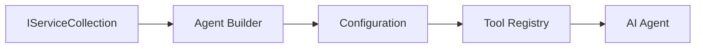

<!--
CO_OP_TRANSLATOR_METADATA:
{
  "original_hash": "bcc874e190347bd6a095aed56dc16de8",
  "translation_date": "2025-11-13T13:31:36+00:00",
  "source_file": "03-agentic-design-patterns/code_samples/03-dotnet-agent-framework.md",
  "language_code": "tl"
}
-->
# 🎨 Mga Pattern ng Disenyo para sa Agentic gamit ang GitHub Models (.NET)

## 📋 Mga Layunin sa Pag-aaral

Ang halimbawang ito ay nagpapakita ng mga design pattern na pang-enterprise para sa paggawa ng mga intelligent na ahente gamit ang Microsoft Agent Framework sa .NET na may integrasyon sa GitHub Models. Matututuhan mo ang mga propesyonal na pattern at mga disenyong arkitektura na ginagawang handa para sa produksyon, madaling mapanatili, at nasusukat ang mga ahente.

### Mga Pattern ng Disenyo para sa Enterprise

- 🏭 **Factory Pattern**: Standardisadong paggawa ng ahente gamit ang dependency injection
- 🔧 **Builder Pattern**: Fluent na pag-configure at pag-setup ng ahente
- 🧵 **Thread-Safe Patterns**: Pamamahala ng sabay-sabay na mga pag-uusap
- 📋 **Repository Pattern**: Organisadong pamamahala ng mga tool at kakayahan

## 🎯 Mga Benepisyo ng Arkitektura sa .NET

### Mga Tampok para sa Enterprise

- **Strong Typing**: Pag-validate sa compile-time at suporta sa IntelliSense
- **Dependency Injection**: Built-in na integrasyon ng DI container
- **Configuration Management**: IConfiguration at Options patterns
- **Async/Await**: Suporta para sa asynchronous programming

### Mga Pattern na Handa para sa Produksyon

- **Logging Integration**: Suporta sa ILogger at structured logging
- **Health Checks**: Built-in na monitoring at diagnostics
- **Configuration Validation**: Strong typing gamit ang data annotations
- **Error Handling**: Structured na pamamahala ng mga exception

## 🔧 Arkitekturang Teknikal

### Mga Pangunahing Komponent ng .NET

- **Microsoft.Extensions.AI**: Unified na mga abstraction ng AI service
- **Microsoft.Agents.AI**: Framework para sa enterprise agent orchestration
- **GitHub Models Integration**: Mga high-performance na pattern ng API client
- **Configuration System**: Integrasyon ng appsettings.json at environment

### Implementasyon ng Design Pattern



## 🏗️ Mga Pattern ng Enterprise na Ipinakita

### 1. **Creational Patterns**

- **Agent Factory**: Sentralisadong paggawa ng ahente na may pare-parehong configuration
- **Builder Pattern**: Fluent na API para sa komplikadong configuration ng ahente
- **Singleton Pattern**: Pamamahala ng shared resources at configuration
- **Dependency Injection**: Loose coupling at testability

### 2. **Behavioral Patterns**

- **Strategy Pattern**: Napapalitang mga estratehiya sa pagpapatupad ng tool
- **Command Pattern**: Encapsulated na mga operasyon ng ahente na may undo/redo
- **Observer Pattern**: Pamamahala ng lifecycle ng ahente na nakabatay sa event
- **Template Method**: Standardisadong mga workflow ng pagpapatupad ng ahente

### 3. **Structural Patterns**

- **Adapter Pattern**: Layer ng integrasyon sa GitHub Models API
- **Decorator Pattern**: Pagpapahusay ng kakayahan ng ahente
- **Facade Pattern**: Pinadaling mga interface para sa interaksyon ng ahente
- **Proxy Pattern**: Lazy loading at caching para sa performance

## 📚 Mga Prinsipyo ng Disenyo sa .NET

### SOLID Principles

- **Single Responsibility**: Ang bawat komponent ay may malinaw na layunin
- **Open/Closed**: Maaaring palawakin nang hindi binabago
- **Liskov Substitution**: Implementasyon ng tool na nakabatay sa interface
- **Interface Segregation**: Nakatuon at cohesive na mga interface
- **Dependency Inversion**: Umaasa sa mga abstraction, hindi sa mga konkretong bagay

### Clean Architecture

- **Domain Layer**: Mga pangunahing abstraction ng ahente at tool
- **Application Layer**: Orkestrasyon ng ahente at mga workflow
- **Infrastructure Layer**: Integrasyon sa GitHub Models at mga panlabas na serbisyo
- **Presentation Layer**: Interaksyon ng user at pag-format ng tugon

## 🔒 Mga Pagsasaalang-alang para sa Enterprise

### Seguridad

- **Credential Management**: Secure na paghawak ng API key gamit ang IConfiguration
- **Input Validation**: Strong typing at pag-validate gamit ang data annotations
- **Output Sanitization**: Secure na pagproseso at pag-filter ng tugon
- **Audit Logging**: Komprehensibong pagsubaybay sa mga operasyon

### Performance

- **Async Patterns**: Non-blocking na mga operasyon ng I/O
- **Connection Pooling**: Mahusay na pamamahala ng HTTP client
- **Caching**: Pag-cache ng tugon para sa mas mahusay na performance
- **Resource Management**: Wastong disposal at mga pattern ng cleanup

### Scalability

- **Thread Safety**: Suporta para sa sabay-sabay na pagpapatupad ng ahente
- **Resource Pooling**: Mahusay na paggamit ng mga resource
- **Load Management**: Rate limiting at backpressure handling
- **Monitoring**: Mga metric ng performance at health checks

## 🚀 Deployment para sa Produksyon

- **Configuration Management**: Mga setting na partikular sa environment
- **Logging Strategy**: Structured logging na may correlation IDs
- **Error Handling**: Global na pamamahala ng exception na may wastong recovery
- **Monitoring**: Application insights at performance counters
- **Testing**: Mga pattern para sa unit tests, integration tests, at load testing

Handa ka na bang gumawa ng mga intelligent na ahente na pang-enterprise gamit ang .NET? Magdisenyo tayo ng isang bagay na matibay! 🏢✨

## 🚀 Pagsisimula

### Mga Kinakailangan

- [.NET 10 SDK](https://dotnet.microsoft.com/download/dotnet/10.0) o mas mataas
- [GitHub Models API access token](https://docs.github.com/github-models/github-models-at-scale/using-your-own-api-keys-in-github-models)

### Mga Kinakailangang Environment Variable

```bash
# zsh/bash
export GH_TOKEN=<your_github_token>
export GH_ENDPOINT=https://models.github.ai/inference
export GH_MODEL_ID=openai/gpt-5-mini
```

```powershell
# PowerShell
$env:GH_TOKEN = "<your_github_token>"
$env:GH_ENDPOINT = "https://models.github.ai/inference"
$env:GH_MODEL_ID = "openai/gpt-5-mini"
```

### Halimbawang Code

Upang patakbuhin ang halimbawa ng code,

```bash
# zsh/bash
chmod +x ./03-dotnet-agent-framework.cs
./03-dotnet-agent-framework.cs
```

O gamit ang dotnet CLI:

```bash
dotnet run ./03-dotnet-agent-framework.cs
```

Tingnan ang [`03-dotnet-agent-framework.cs`](../../../../03-agentic-design-patterns/code_samples/03-dotnet-agent-framework.cs) para sa kumpletong code.

```csharp
#!/usr/bin/dotnet run

#:package Microsoft.Extensions.AI@10.*
#:package Microsoft.Agents.AI.OpenAI@1.*-*

using System.ClientModel;
using System.ComponentModel;

using Microsoft.Agents.AI;
using Microsoft.Extensions.AI;

using OpenAI;

// Tool Function: Random Destination Generator
// This static method will be available to the agent as a callable tool
// The [Description] attribute helps the AI understand when to use this function
// This demonstrates how to create custom tools for AI agents
[Description("Provides a random vacation destination.")]
static string GetRandomDestination()
{
    // List of popular vacation destinations around the world
    // The agent will randomly select from these options
    var destinations = new List<string>
    {
        "Paris, France",
        "Tokyo, Japan",
        "New York City, USA",
        "Sydney, Australia",
        "Rome, Italy",
        "Barcelona, Spain",
        "Cape Town, South Africa",
        "Rio de Janeiro, Brazil",
        "Bangkok, Thailand",
        "Vancouver, Canada"
    };

    // Generate random index and return selected destination
    // Uses System.Random for simple random selection
    var random = new Random();
    int index = random.Next(destinations.Count);
    return destinations[index];
}

// Extract configuration from environment variables
// Retrieve the GitHub Models API endpoint, defaults to https://models.github.ai/inference if not specified
// Retrieve the model ID, defaults to openai/gpt-5-mini if not specified
// Retrieve the GitHub token for authentication, throws exception if not specified
var github_endpoint = Environment.GetEnvironmentVariable("GH_ENDPOINT") ?? "https://models.github.ai/inference";
var github_model_id = Environment.GetEnvironmentVariable("GH_MODEL_ID") ?? "openai/gpt-5-mini";
var github_token = Environment.GetEnvironmentVariable("GH_TOKEN") ?? throw new InvalidOperationException("GH_TOKEN is not set.");

// Configure OpenAI Client Options
// Create configuration options to point to GitHub Models endpoint
// This redirects OpenAI client calls to GitHub's model inference service
var openAIOptions = new OpenAIClientOptions()
{
    Endpoint = new Uri(github_endpoint)
};

// Initialize OpenAI Client with GitHub Models Configuration
// Create OpenAI client using GitHub token for authentication
// Configure it to use GitHub Models endpoint instead of OpenAI directly
var openAIClient = new OpenAIClient(new ApiKeyCredential(github_token), openAIOptions);

// Define Agent Identity and Comprehensive Instructions
// Agent name for identification and logging purposes
var AGENT_NAME = "TravelAgent";

// Detailed instructions that define the agent's personality, capabilities, and behavior
// This system prompt shapes how the agent responds and interacts with users
var AGENT_INSTRUCTIONS = """
You are a helpful AI Agent that can help plan vacations for customers.

Important: When users specify a destination, always plan for that location. Only suggest random destinations when the user hasn't specified a preference.

When the conversation begins, introduce yourself with this message:
"Hello! I'm your TravelAgent assistant. I can help plan vacations and suggest interesting destinations for you. Here are some things you can ask me:
1. Plan a day trip to a specific location
2. Suggest a random vacation destination
3. Find destinations with specific features (beaches, mountains, historical sites, etc.)
4. Plan an alternative trip if you don't like my first suggestion

What kind of trip would you like me to help you plan today?"

Always prioritize user preferences. If they mention a specific destination like "Bali" or "Paris," focus your planning on that location rather than suggesting alternatives.
""";

// Create AI Agent with Advanced Travel Planning Capabilities
// Initialize complete agent pipeline: OpenAI client → Chat client → AI agent
// Configure agent with name, detailed instructions, and available tools
// This demonstrates the .NET agent creation pattern with full configuration
AIAgent agent = openAIClient
    .GetChatClient(github_model_id)
    .CreateAIAgent(
        name: AGENT_NAME,
        instructions: AGENT_INSTRUCTIONS,
        tools: [AIFunctionFactory.Create(GetRandomDestination)]
    );

// Create New Conversation Thread for Context Management
// Initialize a new conversation thread to maintain context across multiple interactions
// Threads enable the agent to remember previous exchanges and maintain conversational state
// This is essential for multi-turn conversations and contextual understanding
AgentThread thread = agent.GetNewThread();

// Execute Agent: First Travel Planning Request
// Run the agent with an initial request that will likely trigger the random destination tool
// The agent will analyze the request, use the GetRandomDestination tool, and create an itinerary
// Using the thread parameter maintains conversation context for subsequent interactions
await foreach (var update in agent.RunStreamingAsync("Plan me a day trip", thread))
{
    await Task.Delay(10);
    Console.Write(update);
}

Console.WriteLine();

// Execute Agent: Follow-up Request with Context Awareness
// Demonstrate contextual conversation by referencing the previous response
// The agent remembers the previous destination suggestion and will provide an alternative
// This showcases the power of conversation threads and contextual understanding in .NET agents
await foreach (var update in agent.RunStreamingAsync("I don't like that destination. Plan me another vacation.", thread))
{
    await Task.Delay(10);
    Console.Write(update);
}
```

---

<!-- CO-OP TRANSLATOR DISCLAIMER START -->
**Paunawa**:  
Ang dokumentong ito ay isinalin gamit ang AI translation service [Co-op Translator](https://github.com/Azure/co-op-translator). Bagamat sinisikap naming maging tumpak, mangyaring tandaan na ang mga awtomatikong pagsasalin ay maaaring maglaman ng mga pagkakamali o hindi pagkakatugma. Ang orihinal na dokumento sa kanyang katutubong wika ang dapat ituring na mapagkakatiwalaang pinagmulan. Para sa mahalagang impormasyon, inirerekomenda ang propesyonal na pagsasalin ng tao. Hindi kami mananagot sa anumang hindi pagkakaunawaan o maling interpretasyon na dulot ng paggamit ng pagsasaling ito.
<!-- CO-OP TRANSLATOR DISCLAIMER END -->