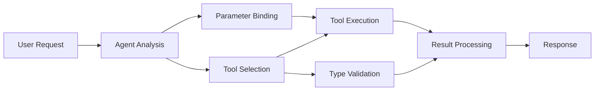

<!--
CO_OP_TRANSLATOR_METADATA:
{
  "original_hash": "91d6061e402489603f2ec8b528cae59b",
  "translation_date": "2025-11-18T18:02:54+00:00",
  "source_file": "04-tool-use/code_samples/04-dotnet-agent-framework.md",
  "language_code": "tl"
}
-->
# 🛠️ Advanced Tool Use with GitHub Models (.NET)

## 📋 Mga Layunin sa Pag-aaral

Ipinapakita ng notebook na ito ang mga pattern ng enterprise-grade tool integration gamit ang Microsoft Agent Framework sa .NET kasama ang GitHub Models. Matututo kang bumuo ng mga sopistikadong agent na may maraming espesyal na tool, gamit ang malakas na typing ng C# at mga enterprise feature ng .NET.

### Mga Advanced na Kakayahan ng Tool na Iyong Matututuhan

- 🔧 **Multi-Tool Architecture**: Pagbuo ng mga agent na may maraming espesyal na kakayahan
- 🎯 **Type-Safe Tool Execution**: Paggamit ng compile-time validation ng C#
- 📊 **Enterprise Tool Patterns**: Disenyo ng tool na handa para sa produksyon at paghawak ng error
- 🔗 **Tool Composition**: Pagsasama-sama ng mga tool para sa masalimuot na mga workflow ng negosyo

## 🎯 Mga Benepisyo ng .NET Tool Architecture

### Mga Tampok ng Enterprise Tool

- **Compile-Time Validation**: Tinitiyak ng malakas na typing ang tamang mga parameter ng tool
- **Dependency Injection**: IoC container integration para sa pamamahala ng tool
- **Async/Await Patterns**: Non-blocking na pagpapatupad ng tool na may tamang pamamahala ng mga resources
- **Structured Logging**: Built-in logging integration para sa pagsubaybay sa pagpapatupad ng tool

### Mga Pattern na Handa para sa Produksyon

- **Exception Handling**: Komprehensibong pamamahala ng error gamit ang typed exceptions
- **Resource Management**: Tamang mga pattern ng disposal at pamamahala ng memorya
- **Performance Monitoring**: Built-in metrics at performance counters
- **Configuration Management**: Type-safe na configuration na may validation

## 🔧 Teknikal na Arkitektura

### Mga Pangunahing Komponent ng .NET Tool

- **Microsoft.Extensions.AI**: Unified abstraction layer para sa tool
- **Microsoft.Agents.AI**: Enterprise-grade na orchestration ng tool
- **GitHub Models Integration**: High-performance API client na may connection pooling

### Tool Execution Pipeline



## 🛠️ Mga Kategorya at Pattern ng Tool

### 1. **Mga Tool sa Pagpoproseso ng Data**

- **Input Validation**: Malakas na typing gamit ang data annotations
- **Transform Operations**: Type-safe na conversion at formatting ng data
- **Business Logic**: Mga tool para sa domain-specific na kalkulasyon at pagsusuri
- **Output Formatting**: Structured na pagbuo ng tugon

### 2. **Mga Integration Tool**

- **API Connectors**: RESTful service integration gamit ang HttpClient
- **Database Tools**: Entity Framework integration para sa pag-access ng data
- **File Operations**: Secure na mga operasyon sa file system na may validation
- **External Services**: Mga pattern ng integration para sa third-party na serbisyo

### 3. **Mga Utility Tool**

- **Text Processing**: Mga utility para sa string manipulation at formatting
- **Date/Time Operations**: Culture-aware na mga kalkulasyon ng petsa/oras
- **Mathematical Tools**: Mga kalkulasyon na may precision at statistical operations
- **Validation Tools**: Pag-verify ng mga business rule at data

Handa ka na bang bumuo ng mga enterprise-grade agent na may makapangyarihan at type-safe na kakayahan ng tool sa .NET? Tara't magdisenyo ng mga solusyong propesyonal! 🏢⚡

## 🚀 Pagsisimula

### Mga Kinakailangan

- [.NET 10 SDK](https://dotnet.microsoft.com/download/dotnet/10.0) o mas mataas
- [GitHub Models API access token](https://docs.github.com/github-models/github-models-at-scale/using-your-own-api-keys-in-github-models)

### Kinakailangang Environment Variables

```bash
# zsh/bash
export GH_TOKEN=<your_github_token>
export GH_ENDPOINT=https://models.github.ai/inference
export GH_MODEL_ID=openai/gpt-5-mini
```

```powershell
# PowerShell
$env:GH_TOKEN = "<your_github_token>"
$env:GH_ENDPOINT = "https://models.github.ai/inference"
$env:GH_MODEL_ID = "openai/gpt-5-mini"
```

### Halimbawang Code

Upang patakbuhin ang halimbawa ng code,

```bash
# zsh/bash
chmod +x ./04-dotnet-agent-framework.cs
./04-dotnet-agent-framework.cs
```

O gamit ang dotnet CLI:

```bash
dotnet run ./04-dotnet-agent-framework.cs
```

Tingnan ang [`04-dotnet-agent-framework.cs`](../../../../04-tool-use/code_samples/04-dotnet-agent-framework.cs) para sa kumpletong code.

```csharp
#!/usr/bin/dotnet run

#:package Microsoft.Extensions.AI@10.*
#:package Microsoft.Agents.AI.OpenAI@1.*-*

using System.ClientModel;
using System.ComponentModel;

using Microsoft.Agents.AI;
using Microsoft.Extensions.AI;

using OpenAI;

// Tool Function: Random Destination Generator
// This static method will be available to the agent as a callable tool
// The [Description] attribute helps the AI understand when to use this function
// This demonstrates how to create custom tools for AI agents
[Description("Provides a random vacation destination.")]
static string GetRandomDestination()
{
    // List of popular vacation destinations around the world
    // The agent will randomly select from these options
    var destinations = new List<string>
    {
        "Paris, France",
        "Tokyo, Japan",
        "New York City, USA",
        "Sydney, Australia",
        "Rome, Italy",
        "Barcelona, Spain",
        "Cape Town, South Africa",
        "Rio de Janeiro, Brazil",
        "Bangkok, Thailand",
        "Vancouver, Canada"
    };

    // Generate random index and return selected destination
    // Uses System.Random for simple random selection
    var random = new Random();
    int index = random.Next(destinations.Count);
    return destinations[index];
}

// Extract configuration from environment variables
// Retrieve the GitHub Models API endpoint, defaults to https://models.github.ai/inference if not specified
// Retrieve the model ID, defaults to openai/gpt-5-mini if not specified
// Retrieve the GitHub token for authentication, throws exception if not specified
var github_endpoint = Environment.GetEnvironmentVariable("GH_ENDPOINT") ?? "https://models.github.ai/inference";
var github_model_id = Environment.GetEnvironmentVariable("GH_MODEL_ID") ?? "openai/gpt-5-mini";
var github_token = Environment.GetEnvironmentVariable("GH_TOKEN") ?? throw new InvalidOperationException("GH_TOKEN is not set.");

// Configure OpenAI Client Options
// Create configuration options to point to GitHub Models endpoint
// This redirects OpenAI client calls to GitHub's model inference service
var openAIOptions = new OpenAIClientOptions()
{
    Endpoint = new Uri(github_endpoint)
};

// Initialize OpenAI Client with GitHub Models Configuration
// Create OpenAI client using GitHub token for authentication
// Configure it to use GitHub Models endpoint instead of OpenAI directly
var openAIClient = new OpenAIClient(new ApiKeyCredential(github_token), openAIOptions);

// Define Agent Identity and Comprehensive Instructions
// Agent name for identification and logging purposes
var AGENT_NAME = "TravelAgent";

// Detailed instructions that define the agent's personality, capabilities, and behavior
// This system prompt shapes how the agent responds and interacts with users
var AGENT_INSTRUCTIONS = """
You are a helpful AI Agent that can help plan vacations for customers.

Important: When users specify a destination, always plan for that location. Only suggest random destinations when the user hasn't specified a preference.

When the conversation begins, introduce yourself with this message:
"Hello! I'm your TravelAgent assistant. I can help plan vacations and suggest interesting destinations for you. Here are some things you can ask me:
1. Plan a day trip to a specific location
2. Suggest a random vacation destination
3. Find destinations with specific features (beaches, mountains, historical sites, etc.)
4. Plan an alternative trip if you don't like my first suggestion

What kind of trip would you like me to help you plan today?"

Always prioritize user preferences. If they mention a specific destination like "Bali" or "Paris," focus your planning on that location rather than suggesting alternatives.
""";

// Create AI Agent with Advanced Travel Planning Capabilities
// Initialize complete agent pipeline: OpenAI client → Chat client → AI agent
// Configure agent with name, detailed instructions, and available tools
// This demonstrates the .NET agent creation pattern with full configuration
AIAgent agent = openAIClient
    .GetChatClient(github_model_id)
    .CreateAIAgent(
        name: AGENT_NAME,
        instructions: AGENT_INSTRUCTIONS,
        tools: [AIFunctionFactory.Create(GetRandomDestination)]
    );

// Create New Conversation Thread for Context Management
// Initialize a new conversation thread to maintain context across multiple interactions
// Threads enable the agent to remember previous exchanges and maintain conversational state
// This is essential for multi-turn conversations and contextual understanding
AgentThread thread = agent.GetNewThread();

// Execute Agent: First Travel Planning Request
// Run the agent with an initial request that will likely trigger the random destination tool
// The agent will analyze the request, use the GetRandomDestination tool, and create an itinerary
// Using the thread parameter maintains conversation context for subsequent interactions
await foreach (var update in agent.RunStreamingAsync("Plan me a day trip", thread))
{
    await Task.Delay(10);
    Console.Write(update);
}

Console.WriteLine();

// Execute Agent: Follow-up Request with Context Awareness
// Demonstrate contextual conversation by referencing the previous response
// The agent remembers the previous destination suggestion and will provide an alternative
// This showcases the power of conversation threads and contextual understanding in .NET agents
await foreach (var update in agent.RunStreamingAsync("I don't like that destination. Plan me another vacation.", thread))
{
    await Task.Delay(10);
    Console.Write(update);
}
```

---

<!-- CO-OP TRANSLATOR DISCLAIMER START -->
**Paunawa**:  
Ang dokumentong ito ay isinalin gamit ang AI translation service na [Co-op Translator](https://github.com/Azure/co-op-translator). Bagama't sinisikap naming maging tumpak, pakitandaan na ang mga awtomatikong pagsasalin ay maaaring maglaman ng mga pagkakamali o hindi pagkakatugma. Ang orihinal na dokumento sa orihinal nitong wika ang dapat ituring na opisyal na sanggunian. Para sa mahalagang impormasyon, inirerekomenda ang propesyonal na pagsasalin ng tao. Hindi kami mananagot sa anumang hindi pagkakaunawaan o maling interpretasyon na dulot ng paggamit ng pagsasaling ito.
<!-- CO-OP TRANSLATOR DISCLAIMER END -->