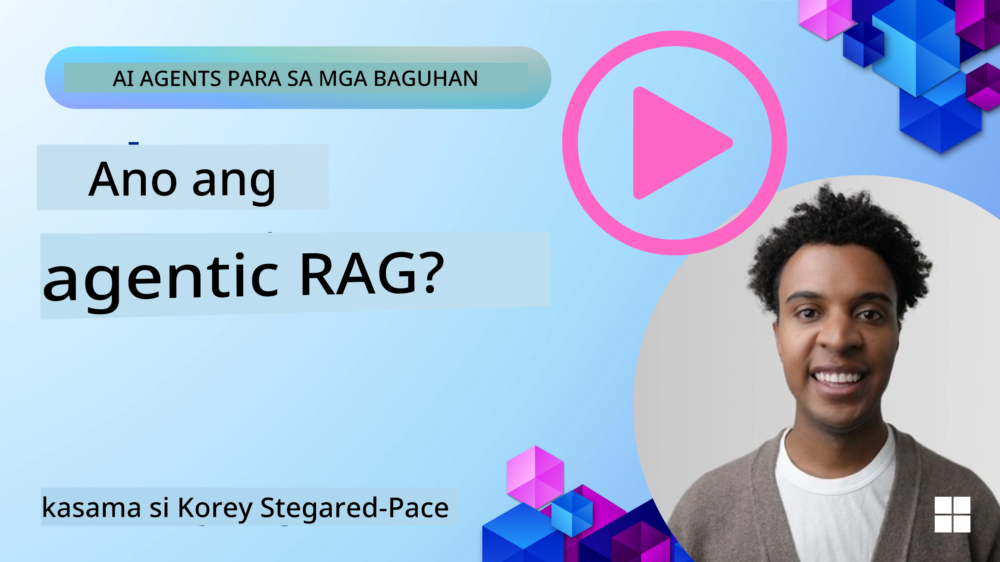
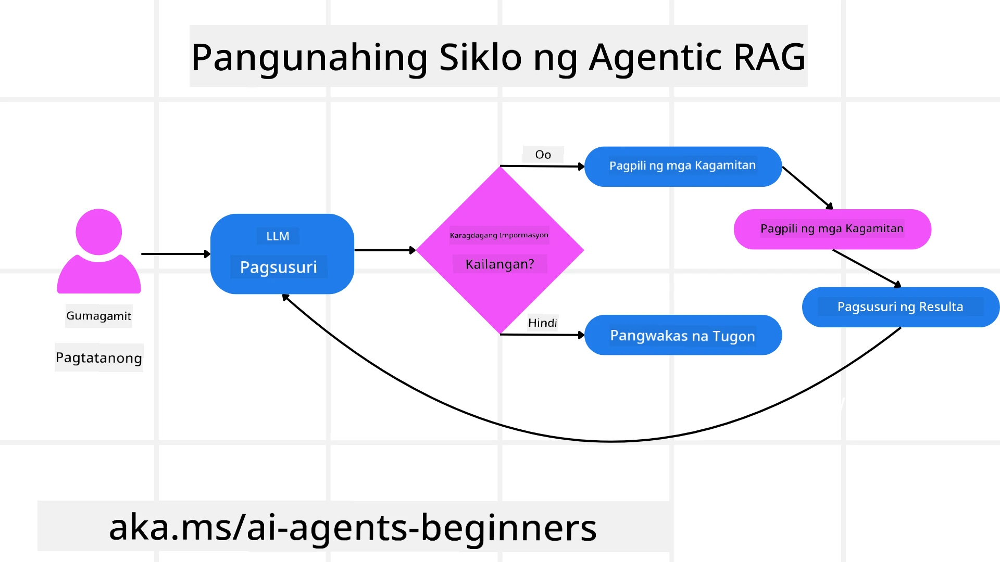
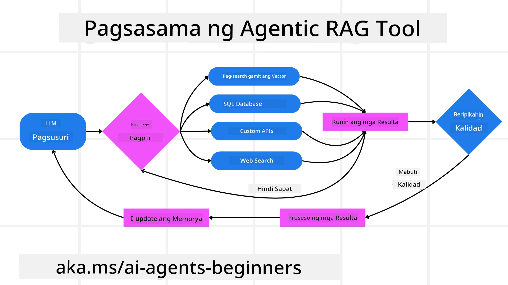

<!--
CO_OP_TRANSLATOR_METADATA:
{
  "original_hash": "0ebf6b2290db55dbf2d10cc49655523b",
  "translation_date": "2025-09-30T07:33:28+00:00",
  "source_file": "05-agentic-rag/README.md",
  "language_code": "tl"
}
-->

> _(I-click ang larawan sa itaas para mapanood ang video ng araling ito)_

# Agentic RAG

Ang araling ito ay nagbibigay ng malawak na pagpapaliwanag tungkol sa Agentic Retrieval-Augmented Generation (Agentic RAG), isang umuusbong na paradigma sa AI kung saan ang malalaking language models (LLMs) ay awtomatikong nagpaplano ng kanilang susunod na hakbang habang kumukuha ng impormasyon mula sa mga panlabas na mapagkukunan. Hindi tulad ng mga static na retrieval-then-read na pattern, ang Agentic RAG ay gumagamit ng paulit-ulit na tawag sa LLM, na sinisingitan ng mga tawag sa tool o function at mga naka-istrukturang output. Sinusuri ng sistema ang mga resulta, pinapabuti ang mga query, tumatawag ng karagdagang mga tool kung kinakailangan, at ipinagpapatuloy ang siklo na ito hanggang sa makamit ang kasiya-siyang solusyon.

## Panimula

Ang araling ito ay tatalakay sa:

- **Pag-unawa sa Agentic RAG:** Alamin ang umuusbong na paradigma sa AI kung saan ang malalaking language models (LLMs) ay awtomatikong nagpaplano ng kanilang susunod na hakbang habang kumukuha ng impormasyon mula sa mga panlabas na mapagkukunan ng data.
- **Pag-unawa sa Iterative Maker-Checker Style:** Unawain ang loop ng paulit-ulit na tawag sa LLM, na sinisingitan ng mga tawag sa tool o function at mga naka-istrukturang output, na idinisenyo upang mapabuti ang katumpakan at harapin ang mga maling query.
- **Paggalugad ng Praktikal na Aplikasyon:** Tukuyin ang mga sitwasyon kung saan nagiging kapaki-pakinabang ang Agentic RAG, tulad ng mga kapaligirang inuuna ang katumpakan, kumplikadong interaksyon sa database, at pinalawig na mga workflow.

## Mga Layunin sa Pagkatuto

Pagkatapos makumpleto ang araling ito, malalaman mo kung paano/maiintindihan:

- **Pag-unawa sa Agentic RAG:** Alamin ang umuusbong na paradigma sa AI kung saan ang malalaking language models (LLMs) ay awtomatikong nagpaplano ng kanilang susunod na hakbang habang kumukuha ng impormasyon mula sa mga panlabas na mapagkukunan ng data.
- **Iterative Maker-Checker Style:** Unawain ang konsepto ng loop ng paulit-ulit na tawag sa LLM, na sinisingitan ng mga tawag sa tool o function at mga naka-istrukturang output, na idinisenyo upang mapabuti ang katumpakan at harapin ang mga maling query.
- **Pagmamay-ari ng Proseso ng Pangangatwiran:** Unawain ang kakayahan ng sistema na magmay-ari ng proseso ng pangangatwiran nito, gumagawa ng mga desisyon kung paano lapitan ang mga problema nang hindi umaasa sa mga paunang natukoy na landas.
- **Workflow:** Unawain kung paano ang isang agentic na modelo ay awtonomong nagpapasya na kumuha ng mga ulat sa trend ng merkado, tukuyin ang data ng mga kakumpitensya, iugnay ang panloob na mga sukatan ng benta, sintetisahin ang mga natuklasan, at suriin ang estratehiya.
- **Iterative Loops, Tool Integration, at Memory:** Alamin ang pag-asa ng sistema sa pattern ng looped interaction, na nagpapanatili ng estado at memorya sa bawat hakbang upang maiwasan ang paulit-ulit na mga loop at gumawa ng mas may kaalamang desisyon.
- **Pagharap sa Failure Modes at Self-Correction:** Galugarin ang matatag na mekanismo ng self-correction ng sistema, kabilang ang pag-ulit at muling pag-query, paggamit ng mga diagnostic tool, at pag-asa sa pangangasiwa ng tao.
- **Mga Hangganan ng Agency:** Unawain ang mga limitasyon ng Agentic RAG, na nakatuon sa domain-specific autonomy, pag-asa sa imprastraktura, at paggalang sa mga guardrails.
- **Praktikal na Mga Gamit at Halaga:** Tukuyin ang mga sitwasyon kung saan nagiging kapaki-pakinabang ang Agentic RAG, tulad ng mga kapaligirang inuuna ang katumpakan, kumplikadong interaksyon sa database, at pinalawig na mga workflow.
- **Pamamahala, Transparency, at Tiwala:** Alamin ang kahalagahan ng pamamahala at transparency, kabilang ang maipapaliwanag na pangangatwiran, kontrol sa bias, at pangangasiwa ng tao.

## Ano ang Agentic RAG?

Ang Agentic Retrieval-Augmented Generation (Agentic RAG) ay isang umuusbong na paradigma sa AI kung saan ang malalaking language models (LLMs) ay awtomatikong nagpaplano ng kanilang susunod na hakbang habang kumukuha ng impormasyon mula sa mga panlabas na mapagkukunan. Hindi tulad ng mga static na retrieval-then-read na pattern, ang Agentic RAG ay gumagamit ng paulit-ulit na tawag sa LLM, na sinisingitan ng mga tawag sa tool o function at mga naka-istrukturang output. Sinusuri ng sistema ang mga resulta, pinapabuti ang mga query, tumatawag ng karagdagang mga tool kung kinakailangan, at ipinagpapatuloy ang siklo na ito hanggang sa makamit ang kasiya-siyang solusyon. Ang iterative na “maker-checker” na istilo ay nagpapabuti sa katumpakan, humaharap sa mga maling query, at tinitiyak ang mataas na kalidad na mga resulta.

Ang sistema ay aktibong nagmamay-ari ng proseso ng pangangatwiran nito, muling isinusulat ang mga nabigong query, pumipili ng iba't ibang retrieval methods, at nag-iintegrate ng maraming tool—tulad ng vector search sa Azure AI Search, SQL databases, o custom APIs—bago tapusin ang sagot nito. Ang natatanging katangian ng isang agentic na sistema ay ang kakayahan nitong magmay-ari ng proseso ng pangangatwiran nito. Ang mga tradisyunal na implementasyon ng RAG ay umaasa sa mga paunang natukoy na landas, ngunit ang isang agentic na sistema ay awtonomong tinutukoy ang pagkakasunod-sunod ng mga hakbang batay sa kalidad ng impormasyong natagpuan nito.

## Pagpapakahulugan sa Agentic Retrieval-Augmented Generation (Agentic RAG)

Ang Agentic Retrieval-Augmented Generation (Agentic RAG) ay isang umuusbong na paradigma sa pag-develop ng AI kung saan ang LLMs ay hindi lamang kumukuha ng impormasyon mula sa mga panlabas na mapagkukunan ng data kundi awtonomong nagpaplano ng kanilang susunod na hakbang. Hindi tulad ng mga static na retrieval-then-read na pattern o maingat na scripted na prompt sequences, ang Agentic RAG ay gumagamit ng loop ng paulit-ulit na tawag sa LLM, na sinisingitan ng mga tawag sa tool o function at mga naka-istrukturang output. Sa bawat hakbang, sinusuri ng sistema ang mga resulta na nakuha nito, nagpapasya kung kailangang pinuhin ang mga query, tumatawag ng karagdagang mga tool kung kinakailangan, at ipinagpapatuloy ang siklo na ito hanggang sa makamit ang kasiya-siyang solusyon.

Ang iterative na “maker-checker” na istilo ng operasyon ay idinisenyo upang mapabuti ang katumpakan, harapin ang mga maling query sa mga naka-istrukturang database (hal. NL2SQL), at tiyakin ang balanseng, mataas na kalidad na mga resulta. Sa halip na umasa lamang sa maingat na engineered na prompt chains, ang sistema ay aktibong nagmamay-ari ng proseso ng pangangatwiran nito. Maaari nitong muling isulat ang mga nabigong query, pumili ng iba't ibang retrieval methods, at mag-integrate ng maraming tool—tulad ng vector search sa Azure AI Search, SQL databases, o custom APIs—bago tapusin ang sagot nito. Inaalis nito ang pangangailangan para sa sobrang kumplikadong orchestration frameworks. Sa halip, isang medyo simpleng loop ng “LLM call → tool use → LLM call → …” ang maaaring magbunga ng sopistikado at maayos na mga output.

## Pagmamay-ari ng Proseso ng Pangangatwiran

Ang natatanging katangian na gumagawa sa isang sistema na “agentic” ay ang kakayahan nitong magmay-ari ng proseso ng pangangatwiran nito. Ang mga tradisyunal na implementasyon ng RAG ay madalas na umaasa sa mga tao na paunang tukuyin ang landas para sa modelo: isang chain-of-thought na nagbabalangkas kung ano ang kukunin at kailan.
Ngunit kapag ang isang sistema ay tunay na agentic, ito mismo ang nagpapasya kung paano lapitan ang problema. Hindi lamang ito sumusunod sa isang script; awtonomo nitong tinutukoy ang pagkakasunod-sunod ng mga hakbang batay sa kalidad ng impormasyong natagpuan nito.
Halimbawa, kung ito ay inatasang gumawa ng estratehiya para sa paglulunsad ng produkto, hindi ito umaasa lamang sa isang prompt na nagdedetalye ng buong proseso ng pananaliksik at paggawa ng desisyon. Sa halip, ang agentic na modelo ay awtonomong nagpapasya na:

1. Kunin ang mga ulat sa kasalukuyang trend ng merkado gamit ang Bing Web Grounding.
2. Tukuyin ang kaugnay na data ng mga kakumpitensya gamit ang Azure AI Search.
3. Iugnay ang makasaysayang panloob na mga sukatan ng benta gamit ang Azure SQL Database.
4. Sintetisahin ang mga natuklasan sa isang magkakaugnay na estratehiya na pinamamahalaan sa pamamagitan ng Azure OpenAI Service.
5. Suriin ang estratehiya para sa mga puwang o hindi pagkakapare-pareho, na nag-uudyok ng isa pang round ng retrieval kung kinakailangan.
Ang lahat ng mga hakbang na ito—pagpapabuti ng mga query, pagpili ng mga mapagkukunan, pag-ulit hanggang sa “masiyahan” sa sagot—ay pinapasya ng modelo, hindi paunang scripted ng tao.

## Iterative Loops, Tool Integration, at Memory

Ang isang agentic na sistema ay umaasa sa isang pattern ng looped interaction:

- **Paunang Tawag:** Ang layunin ng user (aka. user prompt) ay ipinapakita sa LLM.
- **Pagtawag sa Tool:** Kung natukoy ng modelo ang nawawalang impormasyon o hindi malinaw na mga tagubilin, pumipili ito ng tool o retrieval method—tulad ng query sa vector database (hal. Azure AI Search Hybrid search sa pribadong data) o isang naka-istrukturang SQL call—upang makakuha ng mas maraming konteksto.
- **Pagsusuri at Pagpapabuti:** Pagkatapos suriin ang nakuha na data, nagpapasya ang modelo kung sapat na ang impormasyon. Kung hindi, pinapabuti nito ang query, sinusubukan ang ibang tool, o ina-adjust ang diskarte nito.
- **Ulitin Hanggang Masiyahan:** Ang siklo na ito ay nagpapatuloy hanggang sa matukoy ng modelo na mayroon itong sapat na kalinawan at ebidensya upang maghatid ng panghuling, maayos na sagot.
- **Memorya at Estado:** Dahil ang sistema ay nagpapanatili ng estado at memorya sa bawat hakbang, maaari nitong alalahanin ang mga naunang pagtatangka at ang kanilang mga resulta, na iniiwasan ang mga paulit-ulit na loop at gumagawa ng mas may kaalamang desisyon habang nagpapatuloy.

Sa paglipas ng panahon, ito ay lumilikha ng pakiramdam ng umuunlad na pag-unawa, na nagbibigay-daan sa modelo na mag-navigate sa mga kumplikado, multi-step na gawain nang hindi kinakailangang patuloy na makialam o baguhin ng tao ang prompt.

## Pagharap sa Failure Modes at Self-Correction

Ang awtonomiya ng Agentic RAG ay kinabibilangan din ng matatag na mekanismo ng self-correction. Kapag ang sistema ay nakakaranas ng mga dead ends—tulad ng pagkuha ng hindi kaugnay na mga dokumento o pagharap sa mga maling query—maaari itong:

- **Mag-ulit at Muling Mag-query:** Sa halip na magbalik ng mababang halaga na mga sagot, sinusubukan ng modelo ang mga bagong estratehiya sa paghahanap, muling isinusulat ang mga query sa database, o tumitingin sa mga alternatibong set ng data.
- **Gumamit ng Diagnostic Tools:** Maaaring tawagin ng sistema ang mga karagdagang function na idinisenyo upang tulungan itong i-debug ang mga hakbang sa pangangatwiran nito o kumpirmahin ang katumpakan ng nakuha na data. Ang mga tool tulad ng Azure AI Tracing ay magiging mahalaga upang paganahin ang matatag na observability at monitoring.
- **Fallback sa Pangangasiwa ng Tao:** Para sa mga high-stakes o paulit-ulit na nabibigo na mga sitwasyon, maaaring i-flag ng modelo ang kawalan ng katiyakan at humiling ng gabay mula sa tao. Kapag nagbigay ang tao ng corrective feedback, maaaring isama ng modelo ang aral na iyon sa hinaharap.

Ang iterative at dynamic na diskarte na ito ay nagbibigay-daan sa modelo na patuloy na mag-improve, na tinitiyak na hindi lamang ito isang one-shot system kundi isang sistema na natututo mula sa mga pagkakamali nito sa isang partikular na session.

## Mga Hangganan ng Agency

Sa kabila ng awtonomiya nito sa loob ng isang gawain, ang Agentic RAG ay hindi katumbas ng Artificial General Intelligence. Ang “agentic” na kakayahan nito ay limitado sa mga tool, mapagkukunan ng data, at mga patakaran na ibinigay ng mga human developer. Hindi nito kayang mag-imbento ng sarili nitong mga tool o lumampas sa mga hangganan ng domain na itinakda. Sa halip, ito ay mahusay sa dynamic na pag-oorganisa ng mga mapagkukunan na nasa kamay.

Ang mga pangunahing pagkakaiba mula sa mas advanced na mga anyo ng AI ay kinabibilangan ng:

1. **Domain-Specific Autonomy:** Ang mga sistema ng Agentic RAG ay nakatuon sa pagkamit ng mga layunin na tinukoy ng user sa loob ng isang kilalang domain, na gumagamit ng mga estratehiya tulad ng query rewriting o tool selection upang mapabuti ang mga resulta.
2. **Pag-asa sa Imprastraktura:** Ang kakayahan ng sistema ay nakasalalay sa mga tool at data na isinama ng mga developer. Hindi nito kayang lampasan ang mga hangganang ito nang walang interbensyon ng tao.
3. **Paggalang sa Guardrails:** Ang mga etikal na alituntunin, mga panuntunan sa pagsunod, at mga patakaran sa negosyo ay nananatiling napakahalaga. Ang kalayaan ng agent ay palaging limitado ng mga safety measures at oversight mechanisms (sana?).

## Praktikal na Mga Gamit at Halaga

Ang Agentic RAG ay nagiging kapaki-pakinabang sa mga sitwasyong nangangailangan ng iterative refinement at precision:

1. **Mga Kapaligirang Inuuna ang Katumpakan:** Sa mga compliance check, regulatory analysis, o legal na pananaliksik, ang agentic na modelo ay maaaring paulit-ulit na i-verify ang mga katotohanan, kumonsulta sa maraming mapagkukunan, at muling isulat ang mga query hanggang sa makabuo ng lubos na nasuri na sagot.
2. **Kumplikadong Interaksyon sa Database:** Kapag nakikitungo sa naka-istrukturang data kung saan ang mga query ay madalas na nabibigo o nangangailangan ng adjustment, ang sistema ay maaaring awtonomong pinuhin ang mga query nito gamit ang Azure SQL o Microsoft Fabric OneLake, na tinitiyak na ang panghuling retrieval ay naaayon sa layunin ng user.
3. **Pinalawig na Mga Workflow:** Ang mas mahabang session ay maaaring umunlad habang lumilitaw ang bagong impormasyon. Ang Agentic RAG ay maaaring patuloy na isama ang bagong data, baguhin ang mga estratehiya habang natututo pa tungkol sa problem space.

## Pamamahala, Transparency, at Tiwala

Habang ang mga sistemang ito ay nagiging mas awtonomo sa kanilang pangangatwiran, ang pamamahala at transparency ay mahalaga:

- **Maipapaliwanag na Pangangatwiran:** Ang modelo ay maaaring magbigay ng audit trail ng mga query na ginawa nito, ang mga mapagkukunan na kinonsulta nito, at ang mga hakbang sa pangangatwiran na ginawa nito upang maabot ang konklusyon. Ang mga tool tulad ng Azure AI Content Safety at Azure AI Tracing / GenAIOps ay maaaring makatulong na mapanatili ang transparency at mabawasan ang mga panganib.
- **Kontrol sa Bias at Balanseng Retrieval:** Maaaring i-tune ng mga developer ang mga estratehiya sa retrieval upang matiyak na ang mga balanseng, representatibong mapagkukunan ng data ay isinasaalang-alang, at regular na i-audit ang mga output upang matukoy ang bias o skewed patterns gamit ang mga custom na modelo para sa advanced na data science organizations gamit ang Azure Machine Learning.
- **Pangangasiwa ng Tao at Pagsunod:** Para sa mga sensitibong gawain, ang pagsusuri ng tao ay nananatiling mahalaga. Ang Agentic RAG ay hindi pumapalit sa paghatol ng tao sa mga high-stakes na desisyon—ito ay nagdaragdag dito sa pamamagitan ng paghahatid ng mas lubos na nasuri na mga opsyon.

Ang pagkakaroon ng mga tool na nagbibigay ng malinaw na talaan ng mga aksyon ay mahalaga. Kung wala ang mga ito, ang pag-debug ng isang multi-step na proseso ay maaaring maging napakahirap. Tingnan ang
- <a href="https://ragaboutit.com/agentic-rag-a-complete-guide-to-agent-based-retrieval-augmented-generation/" target="_blank">Agentic RAG: Isang Kumpletong Gabay sa Agent-Based Retrieval Augmented Generation – Balita mula sa generation RAG</a>
- <a href="https://huggingface.co/learn/cookbook/agent_rag" target="_blank">Agentic RAG: Pabilisin ang iyong RAG gamit ang query reformulation at self-query! Hugging Face Open-Source AI Cookbook</a>
- <a href="https://youtu.be/aQ4yQXeB1Ss?si=2HUqBzHoeB5tR04U" target="_blank">Pagdaragdag ng Agentic Layers sa RAG</a>
- <a href="https://www.youtube.com/watch?v=zeAyuLc_f3Q&t=244s" target="_blank">Ang Hinaharap ng Knowledge Assistants: Jerry Liu</a>
- <a href="https://www.youtube.com/watch?v=AOSjiXP1jmQ" target="_blank">Paano Bumuo ng Agentic RAG Systems</a>
- <a href="https://ignite.microsoft.com/sessions/BRK102?source=sessions" target="_blank">Paggamit ng Azure AI Foundry Agent Service para palawakin ang iyong AI agents</a>

### Mga Akademikong Papel

- <a href="https://arxiv.org/abs/2303.17651" target="_blank">2303.17651 Self-Refine: Iterative Refinement with Self-Feedback</a>
- <a href="https://arxiv.org/abs/2303.11366" target="_blank">2303.11366 Reflexion: Language Agents with Verbal Reinforcement Learning</a>
- <a href="https://arxiv.org/abs/2305.11738" target="_blank">2305.11738 CRITIC: Malalaking Language Models ay Maaaring Mag-Self-Correct gamit ang Tool-Interactive Critiquing</a>
- <a href="https://arxiv.org/abs/2501.09136" target="_blank">2501.09136 Agentic Retrieval-Augmented Generation: Isang Survey sa Agentic RAG</a>

## Nakaraang Aralin

[Tool Use Design Pattern](../04-tool-use/README.md)

## Susunod na Aralin

[Pagbuo ng Mapagkakatiwalaang AI Agents](../06-building-trustworthy-agents/README.md)

---

**Paunawa**:  
Ang dokumentong ito ay isinalin gamit ang AI translation service na [Co-op Translator](https://github.com/Azure/co-op-translator). Bagama't sinisikap naming maging tumpak, mangyaring tandaan na ang mga awtomatikong pagsasalin ay maaaring maglaman ng mga pagkakamali o hindi pagkakatugma. Ang orihinal na dokumento sa kanyang katutubong wika ang dapat ituring na opisyal na sanggunian. Para sa mahalagang impormasyon, inirerekomenda ang propesyonal na pagsasalin ng tao. Hindi kami mananagot sa anumang hindi pagkakaunawaan o maling interpretasyon na dulot ng paggamit ng pagsasaling ito.