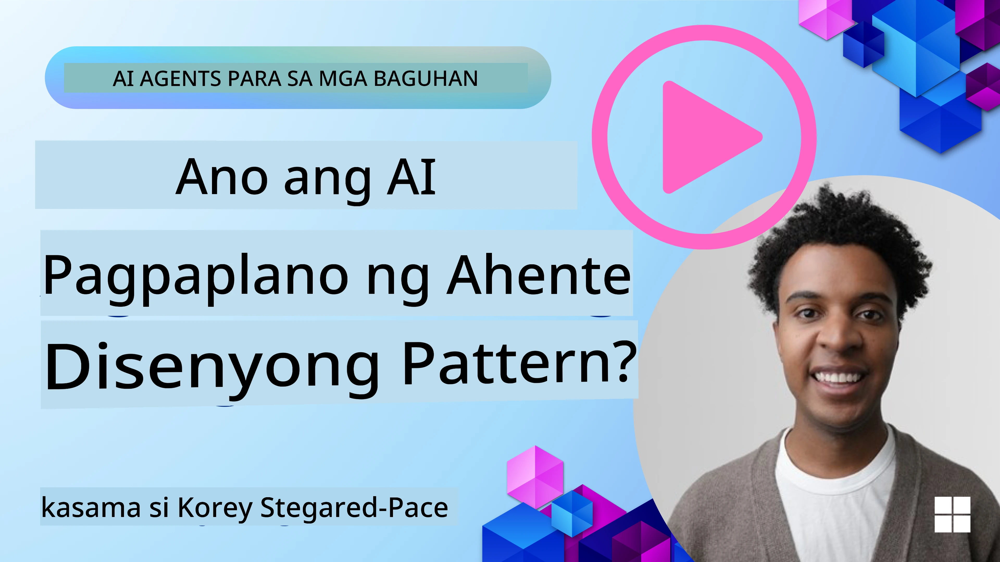
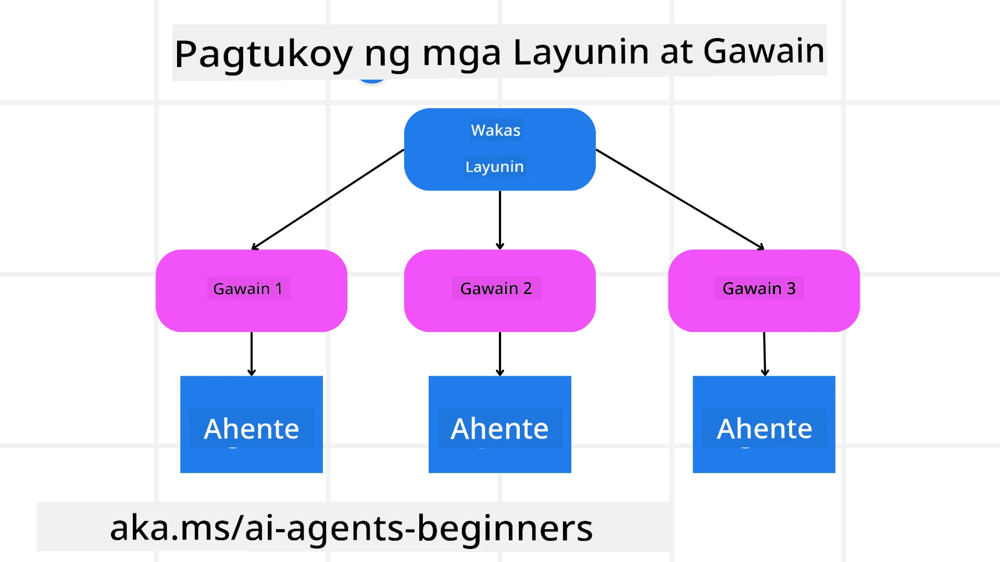

<!--
CO_OP_TRANSLATOR_METADATA:
{
  "original_hash": "43069833a0412210ad5c3cc93d9c2146",
  "translation_date": "2025-09-18T15:23:15+00:00",
  "source_file": "07-planning-design/README.md",
  "language_code": "tl"
}
-->
[](https://youtu.be/kPfJ2BrBCMY?si=9pYpPXp0sSbK91Dr)

> _(I-click ang imahe sa itaas para mapanood ang video ng araling ito)_

# Disenyo ng Pagpaplano

## Panimula

Ang araling ito ay tatalakay sa:

* Pagpapakahulugan ng malinaw na layunin at paghahati ng masalimuot na gawain sa mas madaling pamahalaang mga gawain.
* Paggamit ng structured output para sa mas maaasahan at machine-readable na mga sagot.
* Paglalapat ng event-driven na diskarte upang harapin ang mga dynamic na gawain at hindi inaasahang input.

## Mga Layunin sa Pagkatuto

Pagkatapos makumpleto ang araling ito, magkakaroon ka ng kaalaman tungkol sa:

* Pagkilala at pagtatakda ng pangkalahatang layunin para sa isang AI agent, upang matiyak na malinaw nitong alam kung ano ang kailangang makamit.
* Paghahati ng masalimuot na gawain sa mas madaling pamahalaang mga subtask at pag-aayos ng mga ito sa lohikal na pagkakasunod-sunod.
* Pagbibigay ng tamang mga tool sa mga agent (hal., mga search tool o data analytics tool), pagpapasya kung kailan at paano ito gagamitin, at pagharap sa mga hindi inaasahang sitwasyon.
* Pagsusuri sa mga resulta ng subtask, pagsukat ng performance, at pag-ulit ng mga aksyon upang mapabuti ang panghuling output.

## Pagpapakahulugan ng Pangkalahatang Layunin at Paghahati ng Gawain



Karamihan sa mga gawain sa totoong mundo ay masyadong masalimuot upang harapin sa isang hakbang lamang. Ang isang AI agent ay nangangailangan ng malinaw na layunin upang gabayan ang pagpaplano at mga aksyon nito. Halimbawa, isaalang-alang ang layunin:

    "Gumawa ng 3-araw na travel itinerary."

Bagama't simple itong ipahayag, kailangan pa rin itong linawin. Kapag mas malinaw ang layunin, mas mahusay ang agent (at ang sinumang human collaborators) sa pagtutok sa tamang resulta, tulad ng paggawa ng komprehensibong itinerary na may mga opsyon sa flight, rekomendasyon sa hotel, at mga mungkahi sa aktibidad.

### Paghahati ng Gawain

Ang malalaki o masalimuot na gawain ay nagiging mas madaling pamahalaan kapag hinati sa mas maliliit, layunin-oriented na mga subtask. Para sa halimbawa ng travel itinerary, maaari mong hatiin ang layunin sa:

* Pag-book ng Flight
* Pag-book ng Hotel
* Pag-upa ng Sasakyan
* Personalization

Ang bawat subtask ay maaaring harapin ng mga dedikadong agent o proseso. Ang isang agent ay maaaring magpakadalubhasa sa paghahanap ng pinakamahusay na flight deals, ang isa pa ay nakatuon sa pag-book ng hotel, at iba pa. Ang isang coordinating o “downstream” agent ay maaaring magtipon ng mga resulta na ito sa isang cohesive na itinerary para sa end user.

Ang ganitong modular na diskarte ay nagbibigay-daan din para sa incremental na mga pagpapabuti. Halimbawa, maaari kang magdagdag ng mga specialized agent para sa Food Recommendations o Local Activity Suggestions at pinuhin ang itinerary sa paglipas ng panahon.

### Structured Output

Ang mga Large Language Models (LLMs) ay maaaring bumuo ng structured output (hal., JSON) na mas madaling i-parse at i-process ng mga downstream agent o serbisyo. Ito ay partikular na kapaki-pakinabang sa isang multi-agent na konteksto, kung saan maaari nating i-action ang mga gawain pagkatapos matanggap ang output ng pagpaplano. Tingnan ang sumusunod na halimbawa para sa mabilisang overview.

Ang sumusunod na Python snippet ay nagpapakita ng simpleng planning agent na naghahati ng layunin sa mga subtask at bumubuo ng structured na plano:

```python
from pydantic import BaseModel
from enum import Enum
from typing import List, Optional, Union
import json
import os
from typing import Optional
from pprint import pprint
from autogen_core.models import UserMessage, SystemMessage, AssistantMessage
from autogen_ext.models.azure import AzureAIChatCompletionClient
from azure.core.credentials import AzureKeyCredential

class AgentEnum(str, Enum):
    FlightBooking = "flight_booking"
    HotelBooking = "hotel_booking"
    CarRental = "car_rental"
    ActivitiesBooking = "activities_booking"
    DestinationInfo = "destination_info"
    DefaultAgent = "default_agent"
    GroupChatManager = "group_chat_manager"

# Travel SubTask Model
class TravelSubTask(BaseModel):
    task_details: str
    assigned_agent: AgentEnum  # we want to assign the task to the agent

class TravelPlan(BaseModel):
    main_task: str
    subtasks: List[TravelSubTask]
    is_greeting: bool

client = AzureAIChatCompletionClient(
    model="gpt-4o-mini",
    endpoint="https://models.inference.ai.azure.com",
    # To authenticate with the model you will need to generate a personal access token (PAT) in your GitHub settings.
    # Create your PAT token by following instructions here: https://docs.github.com/en/authentication/keeping-your-account-and-data-secure/managing-your-personal-access-tokens
    credential=AzureKeyCredential(os.environ["GITHUB_TOKEN"]),
    model_info={
        "json_output": False,
        "function_calling": True,
        "vision": True,
        "family": "unknown",
    },
)

# Define the user message
messages = [
    SystemMessage(content="""You are an planner agent.
    Your job is to decide which agents to run based on the user's request.
                      Provide your response in JSON format with the following structure:
{'main_task': 'Plan a family trip from Singapore to Melbourne.',
 'subtasks': [{'assigned_agent': 'flight_booking',
               'task_details': 'Book round-trip flights from Singapore to '
                               'Melbourne.'}
    Below are the available agents specialised in different tasks:
    - FlightBooking: For booking flights and providing flight information
    - HotelBooking: For booking hotels and providing hotel information
    - CarRental: For booking cars and providing car rental information
    - ActivitiesBooking: For booking activities and providing activity information
    - DestinationInfo: For providing information about destinations
    - DefaultAgent: For handling general requests""", source="system"),
    UserMessage(
        content="Create a travel plan for a family of 2 kids from Singapore to Melboune", source="user"),
]

response = await client.create(messages=messages, extra_create_args={"response_format": 'json_object'})

response_content: Optional[str] = response.content if isinstance(
    response.content, str) else None
if response_content is None:
    raise ValueError("Response content is not a valid JSON string" )

pprint(json.loads(response_content))

# # Ensure the response content is a valid JSON string before loading it
# response_content: Optional[str] = response.content if isinstance(
#     response.content, str) else None
# if response_content is None:
#     raise ValueError("Response content is not a valid JSON string")

# # Print the response content after loading it as JSON
# pprint(json.loads(response_content))

# Validate the response content with the MathReasoning model
# TravelPlan.model_validate(json.loads(response_content))
```

### Planning Agent na may Multi-Agent Orchestration

Sa halimbawang ito, ang isang Semantic Router Agent ay tumatanggap ng user request (hal., "Kailangan ko ng plano sa hotel para sa aking biyahe.").

Ang planner ay:

* Tumanggap ng Hotel Plan: Ang planner ay kumukuha ng mensahe ng user at, batay sa system prompt (kasama ang mga detalye ng available na agent), bumubuo ng structured na travel plan.
* Naglilista ng Mga Agent at Kanilang Mga Tool: Ang agent registry ay nagtataglay ng listahan ng mga agent (hal., para sa flight, hotel, car rental, at mga aktibidad) kasama ang mga function o tool na kanilang inaalok.
* Nagre-route ng Plano sa Kaukulang Mga Agent: Depende sa bilang ng mga subtask, ang planner ay maaaring direktang magpadala ng mensahe sa dedikadong agent (para sa single-task scenarios) o mag-coordinate sa pamamagitan ng group chat manager para sa multi-agent collaboration.
* Nagbubuod ng Resulta: Sa wakas, binubuod ng planner ang nabuo na plano para sa kalinawan.

Ang sumusunod na Python code sample ay naglalarawan ng mga hakbang na ito:

```python

from pydantic import BaseModel

from enum import Enum
from typing import List, Optional, Union

class AgentEnum(str, Enum):
    FlightBooking = "flight_booking"
    HotelBooking = "hotel_booking"
    CarRental = "car_rental"
    ActivitiesBooking = "activities_booking"
    DestinationInfo = "destination_info"
    DefaultAgent = "default_agent"
    GroupChatManager = "group_chat_manager"

# Travel SubTask Model

class TravelSubTask(BaseModel):
    task_details: str
    assigned_agent: AgentEnum # we want to assign the task to the agent

class TravelPlan(BaseModel):
    main_task: str
    subtasks: List[TravelSubTask]
    is_greeting: bool
import json
import os
from typing import Optional

from autogen_core.models import UserMessage, SystemMessage, AssistantMessage
from autogen_ext.models.openai import AzureOpenAIChatCompletionClient

# Create the client with type-checked environment variables

client = AzureOpenAIChatCompletionClient(
    azure_deployment=os.getenv("AZURE_OPENAI_DEPLOYMENT_NAME"),
    model=os.getenv("AZURE_OPENAI_DEPLOYMENT_NAME"),
    api_version=os.getenv("AZURE_OPENAI_API_VERSION"),
    azure_endpoint=os.getenv("AZURE_OPENAI_ENDPOINT"),
    api_key=os.getenv("AZURE_OPENAI_API_KEY"),
)

from pprint import pprint

# Define the user message

messages = [
    SystemMessage(content="""You are an planner agent.
    Your job is to decide which agents to run based on the user's request.
    Below are the available agents specialized in different tasks:
    - FlightBooking: For booking flights and providing flight information
    - HotelBooking: For booking hotels and providing hotel information
    - CarRental: For booking cars and providing car rental information
    - ActivitiesBooking: For booking activities and providing activity information
    - DestinationInfo: For providing information about destinations
    - DefaultAgent: For handling general requests""", source="system"),
    UserMessage(content="Create a travel plan for a family of 2 kids from Singapore to Melbourne", source="user"),
]

response = await client.create(messages=messages, extra_create_args={"response_format": TravelPlan})

# Ensure the response content is a valid JSON string before loading it

response_content: Optional[str] = response.content if isinstance(response.content, str) else None
if response_content is None:
    raise ValueError("Response content is not a valid JSON string")

# Print the response content after loading it as JSON

pprint(json.loads(response_content))
```

Ang sumusunod ay ang output mula sa nakaraang code at maaari mong gamitin ang structured output na ito upang i-route sa `assigned_agent` at ibuod ang travel plan para sa end user.

```json
{
    "is_greeting": "False",
    "main_task": "Plan a family trip from Singapore to Melbourne.",
    "subtasks": [
        {
            "assigned_agent": "flight_booking",
            "task_details": "Book round-trip flights from Singapore to Melbourne."
        },
        {
            "assigned_agent": "hotel_booking",
            "task_details": "Find family-friendly hotels in Melbourne."
        },
        {
            "assigned_agent": "car_rental",
            "task_details": "Arrange a car rental suitable for a family of four in Melbourne."
        },
        {
            "assigned_agent": "activities_booking",
            "task_details": "List family-friendly activities in Melbourne."
        },
        {
            "assigned_agent": "destination_info",
            "task_details": "Provide information about Melbourne as a travel destination."
        }
    ]
}
```

Ang isang halimbawa ng notebook na may nakaraang code sample ay makukuha [dito](07-autogen.ipynb).

### Iterative Planning

Ang ilang mga gawain ay nangangailangan ng paulit-ulit na pagpaplano, kung saan ang resulta ng isang subtask ay nakakaapekto sa susunod. Halimbawa, kung ang agent ay makakita ng hindi inaasahang data format habang nagbo-book ng mga flight, maaaring kailanganin nitong iangkop ang diskarte nito bago magpatuloy sa pag-book ng hotel.

Bukod dito, ang feedback ng user (hal., isang tao na magpapasya na mas gusto nila ang mas maagang flight) ay maaaring mag-trigger ng partial re-plan. Ang ganitong dynamic, iterative na diskarte ay nagsisiguro na ang panghuling solusyon ay naaayon sa mga totoong mundo na limitasyon at nagbabagong kagustuhan ng user.

Halimbawa ng code:

```python
from autogen_core.models import UserMessage, SystemMessage, AssistantMessage
#.. same as previous code and pass on the user history, current plan
messages = [
    SystemMessage(content="""You are a planner agent to optimize the
    Your job is to decide which agents to run based on the user's request.
    Below are the available agents specialized in different tasks:
    - FlightBooking: For booking flights and providing flight information
    - HotelBooking: For booking hotels and providing hotel information
    - CarRental: For booking cars and providing car rental information
    - ActivitiesBooking: For booking activities and providing activity information
    - DestinationInfo: For providing information about destinations
    - DefaultAgent: For handling general requests""", source="system"),
    UserMessage(content="Create a travel plan for a family of 2 kids from Singapore to Melbourne", source="user"),
    AssistantMessage(content=f"Previous travel plan - {TravelPlan}", source="assistant")
]
# .. re-plan and send the tasks to respective agents
```

Para sa mas komprehensibong pagpaplano, tingnan ang Magnetic One para sa paglutas ng masalimuot na mga gawain.

## Buod

Sa artikulong ito, tiningnan natin ang isang halimbawa kung paano tayo makakalikha ng planner na maaaring dynamic na pumili ng mga available na agent na tinukoy. Ang output ng Planner ay naghahati ng mga gawain at nag-a-assign ng mga agent upang maisagawa ang mga ito. Ipinapalagay na ang mga agent ay may access sa mga function/tool na kinakailangan upang maisagawa ang gawain. Bukod sa mga agent, maaari kang magdagdag ng iba pang mga pattern tulad ng reflection, summarizer, at round robin chat upang higit pang i-customize.

## Karagdagang Mga Mapagkukunan

AutoGen Magnetic One - Isang Generalist multi-agent system para sa paglutas ng masalimuot na mga gawain at nakamit ang kahanga-hangang resulta sa maraming hamon na agentic benchmarks. Sanggunian:

Sa implementasyong ito, ang orchestrator ay lumilikha ng task-specific na plano at iniaatas ang mga gawain sa mga available na agent. Bukod sa pagpaplano, ang orchestrator ay gumagamit din ng tracking mechanism upang subaybayan ang progreso ng gawain at mag-replan kung kinakailangan.

### May Karagdagang Tanong Tungkol sa Planning Design Pattern?

Sumali sa [Azure AI Foundry Discord](https://aka.ms/ai-agents/discord) upang makipagkita sa ibang mga nag-aaral, dumalo sa office hours, at makuha ang mga sagot sa iyong mga tanong tungkol sa AI Agents.

## Nakaraang Aralin

[Pagbuo ng Mapagkakatiwalaang AI Agents](../06-building-trustworthy-agents/README.md)

## Susunod na Aralin

[Multi-Agent Design Pattern](../08-multi-agent/README.md)

---

**Paunawa**:  
Ang dokumentong ito ay isinalin gamit ang AI translation service na [Co-op Translator](https://github.com/Azure/co-op-translator). Bagama't sinisikap naming maging tumpak, pakitandaan na ang mga awtomatikong pagsasalin ay maaaring maglaman ng mga pagkakamali o hindi pagkakatugma. Ang orihinal na dokumento sa kanyang katutubong wika ang dapat ituring na opisyal na sanggunian. Para sa mahalagang impormasyon, inirerekomenda ang propesyonal na pagsasalin ng tao. Hindi kami mananagot sa anumang hindi pagkakaunawaan o maling interpretasyon na dulot ng paggamit ng pagsasaling ito.