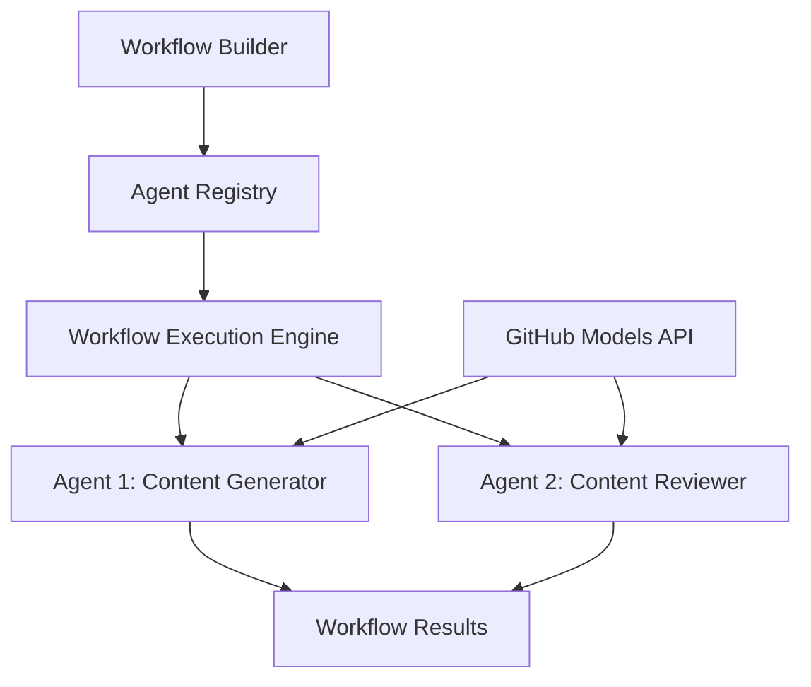

<!--
CO_OP_TRANSLATOR_METADATA:
{
  "original_hash": "034158688d0a45aae06dcbb21b0da5ae",
  "translation_date": "2025-11-11T12:55:23+00:00",
  "source_file": "08-multi-agent/code_samples/workflows-agent-framework/dotNET/01.dotnet-agent-framework-workflow-ghmodel-basic.md",
  "language_code": "tl"
}
-->
# 🔄 Mga Pangunahing Daloy ng Trabaho ng Agent gamit ang GitHub Models (.NET)

## 📋 Tutorial sa Workflow Orchestration

Ipinapakita ng notebook na ito kung paano bumuo ng mas sopistikadong **daloy ng trabaho ng agent** gamit ang Microsoft Agent Framework para sa .NET at GitHub Models. Matututo kang lumikha ng mga multi-step na proseso ng negosyo kung saan nagtutulungan ang mga AI agent upang maisakatuparan ang mga kumplikadong gawain sa pamamagitan ng mga nakabalangkas na pattern ng orkestrasyon.

## 🎯 Mga Layunin sa Pag-aaral

### 🏗️ **Mga Pangunahing Kaalaman sa Arkitektura ng Workflow**
- **Workflow Builder**: Magdisenyo at mag-orkestra ng mga kumplikadong multi-step na proseso ng AI
- **Agent Coordination**: Mag-coordinate ng maraming espesyal na agent sa loob ng mga workflow
- **GitHub Models Integration**: Gamitin ang serbisyo ng inference ng AI model ng GitHub sa mga workflow
- **Visual Workflow Design**: Lumikha at mag-visualize ng mga istruktura ng workflow para sa mas mahusay na pag-unawa

### 🔄 **Mga Pattern ng Orkestrasyon ng Proseso**
- **Sequential Processing**: Ikabit ang maraming gawain ng agent sa lohikal na pagkakasunod-sunod
- **State Management**: Panatilihin ang konteksto at daloy ng data sa mga yugto ng workflow
- **Error Handling**: Magpatupad ng matibay na pag-recover sa error at katatagan ng workflow
- **Performance Optimization**: Magdisenyo ng mga mahusay na workflow para sa mga operasyon sa antas ng enterprise

### 🏢 **Mga Aplikasyon ng Workflow sa Enterprise**
- **Business Process Automation**: I-automate ang mga kumplikadong workflow ng organisasyon
- **Content Production Pipeline**: Mga editorial workflow na may mga yugto ng pagsusuri at pag-apruba
- **Customer Service Automation**: Multi-step na resolusyon ng mga tanong ng customer
- **Data Processing Workflows**: Mga ETL workflow na may AI-powered na pagbabago

## ⚙️ Mga Kinakailangan at Setup

### 📦 **Mga Kinakailangang NuGet Package**

Ang demonstrasyon ng workflow na ito ay gumagamit ng ilang mahahalagang .NET package:

```xml
<!-- Core AI Framework -->
<PackageReference Include="Microsoft.Extensions.AI" Version="9.9.0" />

<!-- Agent Framework (Local Development) -->
<!-- Microsoft.Agents.AI.dll - Core agent abstractions -->
<!-- Microsoft.Agents.AI.OpenAI.dll - OpenAI/GitHub Models integration -->

<!-- Configuration and Environment -->
<PackageReference Include="DotNetEnv" Version="3.1.1" />
```

### 🔑 **Konfigurasyon ng GitHub Models**

**Setup ng Environment (.env file):**
```env
GITHUB_TOKEN=your_github_personal_access_token
GITHUB_ENDPOINT=https://models.inference.ai.azure.com
GITHUB_MODEL_ID=gpt-4o-mini
```

**Access sa GitHub Models:**
1. Mag-sign up para sa GitHub Models (kasalukuyang nasa preview)
2. Bumuo ng personal access token na may mga pahintulot sa access ng model
3. I-configure ang mga environment variable tulad ng ipinakita sa itaas

### 🏗️ **Pangkalahatang-ideya ng Arkitektura ng Workflow**



**Mga Pangunahing Komponent:**
- **WorkflowBuilder**: Pangunahing engine ng orkestrasyon para sa pagdidisenyo ng mga workflow
- **AIAgent**: Indibidwal na espesyal na agent na may partikular na kakayahan
- **GitHub Models Client**: Integrasyon ng serbisyo ng inference ng AI model
- **Execution Context**: Pinamamahalaan ang estado at daloy ng data sa pagitan ng mga yugto ng workflow

## 🎨 **Mga Pattern ng Disenyo ng Workflow sa Enterprise**

### 📝 **Workflow sa Produksyon ng Nilalaman**
```
User Request → Content Generation → Quality Review → Final Output
```

### 🔍 **Pipeline sa Pagproseso ng Dokumento**
```
Document Input → Analysis → Extraction → Validation → Structured Output
```

### 💼 **Workflow sa Business Intelligence**
```
Data Collection → Processing → Analysis → Report Generation → Distribution
```

### 🤝 **Automation ng Serbisyo sa Customer**
```
Customer Inquiry → Classification → Processing → Response Generation → Follow-up
```

## 🏢 **Mga Benepisyo sa Enterprise**

### 🎯 **Katatagan at Scalability**
- **Deterministic Execution**: Pare-pareho, maulit na resulta ng workflow
- **Error Recovery**: Maayos na paghawak ng mga pagkabigo sa anumang yugto ng workflow
- **Performance Monitoring**: Subaybayan ang mga sukatan ng pagpapatupad at mga pagkakataon sa pag-optimize
- **Resource Management**: Mahusay na alokasyon at paggamit ng mga mapagkukunan ng AI model

### 🔒 **Seguridad at Pagsunod**
- **Secure Authentication**: Authentication na batay sa token ng GitHub para sa access sa API
- **Audit Trails**: Kumpletong pag-log ng pagpapatupad ng workflow at mga punto ng desisyon
- **Access Control**: Detalyadong mga pahintulot para sa pagpapatupad at pagsubaybay ng workflow
- **Data Privacy**: Ligtas na paghawak ng sensitibong impormasyon sa buong workflow

### 📊 **Observability at Pamamahala**
- **Visual Workflow Design**: Malinaw na representasyon ng mga daloy ng proseso at dependencies
- **Execution Monitoring**: Real-time na pagsubaybay sa progreso at performance ng workflow
- **Error Reporting**: Detalyadong pagsusuri ng error at kakayahan sa pag-debug
- **Performance Analytics**: Mga sukatan para sa pag-optimize at pagpaplano ng kapasidad

Simulan na ang paggawa ng iyong unang enterprise-ready na AI workflow! 🚀

## 💻 Pagpapatakbo ng Code

Ang kumpletong implementasyon ay makikita sa `01.dotnet-agent-framework-workflow-ghmodel-basic.cs`. Ipinapakita ng file na ito:

1. **Konfigurasyon ng Environment** - Pag-load ng mga kredensyal ng GitHub Models mula sa `.env` file
2. **Setup ng OpenAI Client** - Pag-configure ng client upang gamitin ang endpoint ng GitHub Models
3. **Paglikha ng Agent** - Pagde-define ng mga espesyal na agent (Front Desk at Concierge)
4. **Workflow Builder** - Paglikha ng multi-agent workflow na may sequential processing
5. **Pagpapatakbo ng Workflow** - Pagpapatakbo ng workflow na may streaming na resulta

### 🚀 Pagpapatakbo ng Halimbawa

```bash
# Make the script executable (Unix/Linux/macOS)
chmod +x 01.dotnet-agent-framework-workflow-ghmodel-basic.cs

# Run the workflow
./01.dotnet-agent-framework-workflow-ghmodel-basic.cs
```

O sa Windows:
```powershell
dotnet run 01.dotnet-agent-framework-workflow-ghmodel-basic.cs
```

### 📝 Inaasahang Output

Ang workflow ay:
1. Tatanggap ng iyong kahilingan sa destinasyon ng paglalakbay ("Gusto kong pumunta sa Paris")
2. Magbibigay ang Front Desk agent ng paunang rekomendasyon
3. Susuriin at pagagandahin ng Concierge agent ang rekomendasyon
4. Ang huling output ay magpapakita ng kumpletong stream ng pag-uusap

### 🔧 Pag-customize

Maaari mong i-customize ang workflow sa pamamagitan ng:
- Pagbabago ng mga instruksyon ng agent upang baguhin ang kanilang pag-uugali
- Pagdaragdag ng mas maraming agent upang lumikha ng mas kumplikadong multi-step na workflow
- Pagbabago ng mensahe ng user upang subukan ang iba't ibang senaryo
- Pag-aadjust ng mga gilid ng workflow upang lumikha ng iba't ibang pattern ng pagpapatupad

---

<!-- CO-OP TRANSLATOR DISCLAIMER START -->
**Paunawa**:  
Ang dokumentong ito ay isinalin gamit ang AI translation service na [Co-op Translator](https://github.com/Azure/co-op-translator). Bagamat sinisikap naming maging tumpak, mangyaring tandaan na ang mga awtomatikong pagsasalin ay maaaring maglaman ng mga pagkakamali o hindi pagkakatugma. Ang orihinal na dokumento sa kanyang katutubong wika ang dapat ituring na opisyal na pinagmulan. Para sa mahalagang impormasyon, inirerekomenda ang propesyonal na pagsasalin ng tao. Hindi kami mananagot sa anumang hindi pagkakaunawaan o maling interpretasyon na dulot ng paggamit ng pagsasaling ito.
<!-- CO-OP TRANSLATOR DISCLAIMER END -->