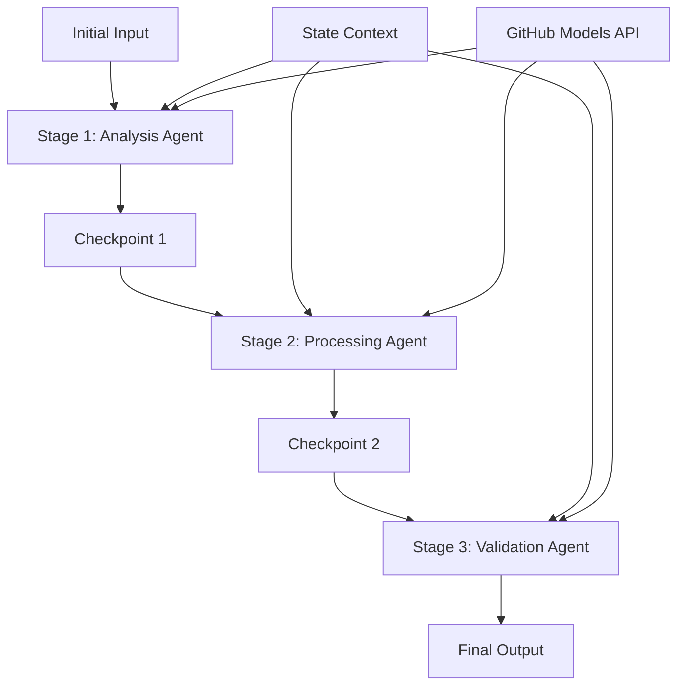

<!--
CO_OP_TRANSLATOR_METADATA:
{
  "original_hash": "1be9c8dcbd79a02d33d2c138684c1394",
  "translation_date": "2025-11-11T13:59:35+00:00",
  "source_file": "08-multi-agent/code_samples/workflows-agent-framework/dotNET/02.dotnet-agent-framework-workflow-ghmodel-sequential.md",
  "language_code": "tl"
}
-->
# ⏩ Sunud-sunod na Workflow ng Ahente gamit ang GitHub Models (.NET)

## 📋 Advanced na Tutorial sa Sunud-sunod na Pagproseso

Ipinapakita ng notebook na ito ang mga **pattern ng sunud-sunod na workflow** gamit ang Microsoft Agent Framework para sa .NET at GitHub Models. Matutunan mo kung paano bumuo ng mga sopistikadong pipeline ng pagproseso na hakbang-hakbang kung saan ang mga ahente ay gumaganap sa isang tiyak na pagkakasunod-sunod, na ang bawat yugto ay nakabatay sa resulta ng naunang yugto.

## 🎯 Mga Layunin sa Pag-aaral

### 🔄 **Arkitektura ng Sunud-sunod na Pagproseso**
- **Disenyo ng Linear Workflow**: Gumawa ng mga pipeline ng pagproseso na hakbang-hakbang na may malinaw na mga dependency
- **Pamamahala ng Estado**: Panatilihin ang konteksto at daloy ng data sa mga yugto ng sunud-sunod na workflow
- **Pagsasama ng GitHub Models**: Gamitin ang mga AI model ng GitHub sa mga multi-stage na workflow ng .NET
- **Mga Pattern ng Enterprise Pipeline**: Bumuo ng mga handa sa produksyon na sistema ng sunud-sunod na pagproseso

### 🏗️ **Mga Advanced na Pattern ng Sunud-sunod**
- **Stage-Gate Processing**: Magpatupad ng mga validation checkpoint sa pagitan ng mga yugto ng workflow
- **Pagpapanatili ng Konteksto**: Panatilihin ang estado at naipon na kaalaman sa lahat ng yugto
- **Pagpapalaganap ng Error**: Mahusay na pamahalaan ang mga pagkabigo sa mga sunud-sunod na chain ng pagproseso
- **Pag-optimize ng Performance**: Mabilis na sunud-sunod na pagpapatupad na may minimal na overhead

### 🏢 **Mga Sunud-sunod na Aplikasyon sa Enterprise**
- **Pipeline ng Pagproseso ng Dokumento**: Multi-stage na pagsusuri, pagbabago, at pag-validate ng dokumento
- **Mga Workflow ng Quality Assurance**: Sunud-sunod na pagsusuri, pag-validate, at proseso ng pag-apruba
- **Pipeline ng Produksyon ng Nilalaman**: Pananaliksik → Pagsulat → Pag-edit → Pagsusuri → Pag-publish
- **Pag-aautomat ng Proseso ng Negosyo**: Multi-step na workflow ng negosyo na may malinaw na mga dependency sa yugto

## ⚙️ Mga Kinakailangan at Setup

### 📦 **Mga Kinakailangang NuGet Package**

Mga mahahalagang package para sa mga sunud-sunod na workflow ng .NET:

```xml
<!-- Core AI Framework -->
<PackageReference Include="Microsoft.Extensions.AI" Version="9.9.0" />

<!-- Client Model Abstractions -->
<PackageReference Include="System.ClientModel" Version="1.6.1.0" />

<!-- Azure Identity and Async LINQ Support -->
<PackageReference Include="Azure.Identity" Version="1.15.0" />
<PackageReference Include="System.Linq.Async" Version="6.0.3" />

<!-- Local Agent Framework References -->
<!-- Microsoft.Agents.AI.dll - Core agent abstractions -->
<!-- Microsoft.Agents.AI.OpenAI.dll - GitHub Models integration -->
```

### 🔑 **Konfigurasyon ng GitHub Models**

**Setup ng Kapaligiran (.env file):**
```env
GITHUB_TOKEN=your_github_personal_access_token
GITHUB_ENDPOINT=https://models.inference.ai.azure.com
GITHUB_MODEL_ID=gpt-4o-mini
```

**Pamamahala ng Konfigurasyon:**
```csharp
// Load environment variables securely
Env.Load("../../../.env");
var githubToken = Environment.GetEnvironmentVariable("GITHUB_TOKEN");
var githubEndpoint = Environment.GetEnvironmentVariable("GITHUB_ENDPOINT");
var modelId = Environment.GetEnvironmentVariable("GITHUB_MODEL_ID");
```

### 🏗️ **Arkitektura ng Sunud-sunod na Workflow**



**Mga Pangunahing Komponent:**
- **Sunud-sunod na mga Ahente**: Mga espesyal na ahente para sa bawat yugto ng pagproseso
- **State Context**: Pinapanatili ang naipon na data at mga desisyon sa mga yugto
- **Mga Checkpoint**: Mga validation point sa pagitan ng mga yugto upang matiyak ang kalidad at pagkakapare-pareho
- **GitHub Models Client**: Pare-parehong access sa AI model sa lahat ng yugto ng workflow

## 🎨 **Mga Pattern ng Disenyo ng Sunud-sunod na Workflow**

### 📝 **Pipeline ng Pagproseso ng Dokumento**
```
Raw Document → Content Extraction → Analysis → Validation → Structured Output
```

### 🎯 **Workflow ng Paglikha ng Nilalaman**
```
Brief/Requirements → Research → Content Creation → Review → Final Polish
```

### 🔍 **Pipeline ng Quality Assurance**
```
Initial Review → Technical Validation → Compliance Check → Final Approval
```

### 💼 **Workflow ng Business Intelligence**
```
Data Collection → Processing → Analysis → Report Generation → Distribution
```

## 🏢 **Mga Benepisyo ng Sunud-sunod na Enterprise**

### 🎯 **Kahusayan at Kalidad**
- **Deterministic Processing**: Pare-pareho, maaasahang resulta sa pamamagitan ng istrukturadong mga yugto
- **Quality Gates**: Ang mga validation checkpoint ay nagsisiguro ng kalidad sa bawat yugto
- **Error Isolation**: Ang mga problema sa isang yugto ay hindi nakakaapekto sa mga susunod na yugto
- **Audit Trails**: Kumpletong pagsubaybay sa mga desisyon at pagbabago sa bawat yugto

### 📈 **Scalability at Performance**
- **Disenyong Modular**: Ang bawat yugto ay maaaring i-optimize nang independyente
- **Pamamahala ng Resource**: Mahusay na alokasyon ng mga resource ng AI model sa mga yugto
- **Pag-optimize ng Estado**: Minimal na paglipat ng estado sa pagitan ng mga yugto para sa pinakamainam na performance
- **Mga Parallel Stage Group**: Maraming sunud-sunod na workflow ang maaaring tumakbo nang sabay-sabay

### 🔒 **Seguridad at Pagsunod**
- **Seguridad sa Antas ng Yugto**: Iba't ibang patakaran sa seguridad para sa iba't ibang yugto ng pagproseso
- **Pag-validate ng Data**: Tiyakin ang integridad ng data at pagsunod sa bawat checkpoint
- **Kontrol sa Access**: Granular na mga pahintulot para sa iba't ibang yugto ng workflow
- **Pagsunod sa Regulasyon**: Matugunan ang mga kinakailangan sa regulasyon sa pamamagitan ng istrukturadong pagproseso

### 📊 **Pagsubaybay at Analytics**
- **Mga Sukatan sa Antas ng Yugto**: Pagsubaybay sa performance para sa bawat yugto ng workflow
- **Pagkilala sa Bottleneck**: Tukuyin at i-optimize ang mga mabagal na yugto
- **Mga Sukatan ng Kalidad**: Subaybayan ang kalidad at mga rate ng tagumpay sa bawat yugto
- **Pag-optimize ng Proseso**: Patuloy na pagpapabuti batay sa analytics sa antas ng yugto

Bumuo tayo ng matibay na sunud-sunod na AI processing pipelines! 🚀

## 💻 Pagpapatakbo ng Code

Ang kumpletong implementasyon ay makikita sa `02.dotnet-agent-framework-workflow-ghmodel-sequential.cs`. Ipinapakita ng file na ito ang **tatlong-yugtong workflow ng pagsusuri ng kasangkapan**:

1. **Yugto 1 - Sales Agent**: Sinusuri ang mga larawan ng kasangkapan at nagbibigay ng mga mungkahi sa pagbili
2. **Yugto 2 - Price Agent**: Nagbibigay ng detalyadong breakdown ng presyo at mga opsyon sa badyet
3. **Yugto 3 - Quote Agent**: Gumagawa ng propesyonal na dokumento ng quote sa format na Markdown

### 🏗️ **Arkitektura ng Workflow**

```
Image Input → Sales Analysis → Price Estimation → Quote Generation → Final Output
```

Ang bawat ahente:
- Tumanggap ng output mula sa naunang yugto bilang konteksto
- Bumubuo sa naunang pagsusuri gamit ang espesyal na kadalubhasaan
- Pinapanatili ang tuloy-tuloy na workflow sa pamamagitan ng pamamahala ng estado

### 🚀 Pagpapatakbo ng Halimbawa

**Mga Kinakailangan:**
- Maglagay ng larawan ng kasangkapan sa `../imgs/home.png` (o i-update ang variable na `imgPath`)
- I-configure ang iyong `.env` file gamit ang mga kredensyal ng GitHub Models

```bash
# Make the script executable (Unix/Linux/macOS)
chmod +x 02.dotnet-agent-framework-workflow-ghmodel-sequential.cs

# Run the sequential workflow
./02.dotnet-agent-framework-workflow-ghmodel-sequential.cs
```

O sa Windows:
```powershell
dotnet run 02.dotnet-agent-framework-workflow-ghmodel-sequential.cs
```

### 📝 Inaasahang Output

Ang workflow ay:
1. **Sales Agent**: Tukuyin ang mga item ng kasangkapan mula sa larawan at magbigay ng mga rekomendasyon
2. **Price Agent**: Magdagdag ng detalyadong pagsusuri ng presyo na may mga tier ng badyet at mga rekomendasyon sa pamimili
3. **Quote Agent**: Gumawa ng naka-format na dokumento ng quote na may lahat ng impormasyon na synthesized

Ang huling output ay magiging isang komprehensibo, propesyonal na furniture quote batay sa pagsusuri ng larawan.

### 🔧 Mga Opsyon sa Pag-customize

**Baguhin ang Pag-uugali ng Ahente:**
```csharp
// Adjust agent instructions to change their focus
const string SalesAgentInstructions = "Your custom instructions...";
```

**Baguhin ang Sunud-sunod na Daloy:**
```csharp
// Add or reorder workflow stages
var workflow = new WorkflowBuilder(salesagent)
    .AddEdge(salesagent, priceagent)
    .AddEdge(priceagent, quoteagent)
    .AddEdge(quoteagent, newAgent)  // Add another stage
    .Build();
```

**Gumamit ng Ibang Input:**
```csharp
// Process text instead of images
ChatMessage userMessage = new ChatMessage(ChatRole.User, [
    new TextContent("Analyze pricing for a modern living room set")
]);
```

### 🎯 Mga Aplikasyon sa Totoong Mundo

Ang sunud-sunod na pattern na ito ay perpekto para sa:
- **E-commerce**: Pagsusuri ng produkto → Pagpepresyo → Pagbuo ng quote
- **Real Estate**: Pagsusuri ng ari-arian → Pagtatasa ng halaga → Paglikha ng listahan
- **Insurance**: Pagsusuri ng claim → Pagtatasa → Pagbuo ng quote
- **Paglikha ng Nilalaman**: Pananaliksik → Pagsulat → Pag-edit → Pag-publish

### 🔍 Pag-unawa sa Daloy ng Estado

Ang bawat ahente sa sequence ay tumatanggap ng:
- **Orihinal na Input**: Ang paunang mensahe ng user (larawan + teksto)
- **Mga Output ng Naunang Ahente**: Lahat ng naunang tugon ng ahente sa kasaysayan ng pag-uusap
- **Naipon na Konteksto**: Kumpletong estado na pinapanatili sa buong workflow

Pinapagana nito ang sopistikadong multi-stage na pagproseso kung saan ang bawat ahente ay bumubuo sa komprehensibong konteksto mula sa lahat ng naunang yugto.

---

<!-- CO-OP TRANSLATOR DISCLAIMER START -->
**Paunawa**:  
Ang dokumentong ito ay isinalin gamit ang AI translation service na [Co-op Translator](https://github.com/Azure/co-op-translator). Bagama't sinisikap naming maging tumpak, mangyaring tandaan na ang mga awtomatikong pagsasalin ay maaaring maglaman ng mga pagkakamali o hindi pagkakatugma. Ang orihinal na dokumento sa kanyang katutubong wika ang dapat ituring na mapagkakatiwalaang pinagmulan. Para sa mahalagang impormasyon, inirerekomenda ang propesyonal na pagsasalin ng tao. Hindi kami mananagot sa anumang hindi pagkakaunawaan o maling interpretasyon na dulot ng paggamit ng pagsasaling ito.
<!-- CO-OP TRANSLATOR DISCLAIMER END -->