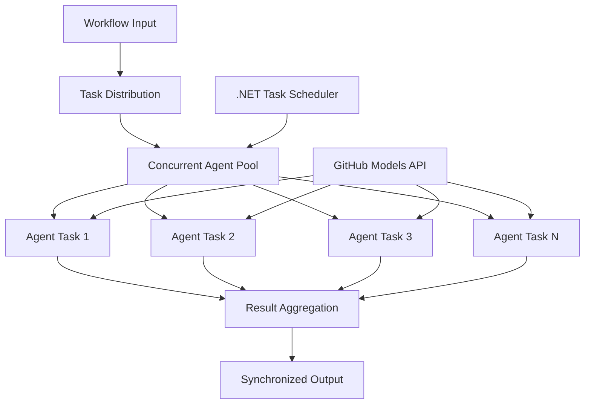

<!--
CO_OP_TRANSLATOR_METADATA:
{
  "original_hash": "b9c6e32c9b5f2fed20b6916984440d88",
  "translation_date": "2025-11-11T13:26:54+00:00",
  "source_file": "08-multi-agent/code_samples/workflows-agent-framework/dotNET/03.dotnet-agent-framework-workflow-ghmodel-concurrent.md",
  "language_code": "tl"
}
-->
# ⚡ Mga Sabay-sabay na Workflow ng Ahente gamit ang GitHub Models (.NET)

## 📋 Tutorial sa Mataas na Pagganap ng Parallel Processing

Ipinapakita ng notebook na ito ang **mga pattern ng sabay-sabay na workflow** gamit ang Microsoft Agent Framework para sa .NET at GitHub Models. Matututuhan mo kung paano bumuo ng mga high-performance, parallel processing workflows na nagpapataas ng throughput sa pamamagitan ng sabay-sabay na pagpapatakbo ng maraming AI agents habang pinapanatili ang koordinasyon at pagkakapare-pareho ng data.

## 🎯 Mga Layunin sa Pag-aaral

### 🚀 **Mga Pangunahing Kaalaman sa Sabay-sabay na Pagproseso**
- **Sabay-sabay na Pagpapatakbo ng Ahente**: Patakbuhin ang maraming AI agents nang sabay-sabay para sa pinakamataas na pagganap
- **Async/Await Patterns**: Gamitin ang async programming model ng .NET para sa epektibong sabay-sabay na pagproseso
- **Integrasyon ng GitHub Models**: I-coordinate ang maraming sabay-sabay na tawag sa inference service ng AI model ng GitHub
- **Pamamahala ng Resources**: Epektibong pamahalaan ang mga resources ng AI model sa sabay-sabay na operasyon

### 🏗️ **Advanced na Arkitektura ng Sabay-sabay na Pagproseso**
- **Task-Based Parallelism**: Gamitin ang Task Parallel Library ng .NET para sa optimal na sabay-sabay na pagpapatakbo
- **Mga Pattern ng Synchronization**: I-coordinate ang sabay-sabay na mga ahente habang iniiwasan ang race conditions
- **Load Balancing**: Epektibong ipamahagi ang trabaho sa available na kapasidad ng sabay-sabay na pagproseso
- **Fault Tolerance**: Pamahalaan ang mga pagkabigo ng indibidwal na ahente nang hindi pinapatigil ang buong workflow

### 🏢 **Mga Sabay-sabay na Aplikasyon para sa Enterprise**
- **Pagproseso ng Mataas na Dami ng Dokumento**: Sabay-sabay na pagproseso ng maraming dokumento
- **Real-Time na Pagsusuri ng Nilalaman**: Sabay-sabay na pagsusuri ng mga papasok na data stream
- **Pag-optimize ng Batch Processing**: Pataasin ang throughput para sa malakihang pagproseso ng data
- **Multi-Modal Analysis**: Sabay-sabay na pagproseso ng iba't ibang uri at format ng nilalaman

## ⚙️ Mga Kinakailangan at Setup

### 📦 **Mga Kinakailangang NuGet Packages**

Mga mahahalagang package para sa sabay-sabay na workflows na may mataas na pagganap:

```xml
<!-- Core AI Framework with Async Support -->
<PackageReference Include="Microsoft.Extensions.AI" Version="9.9.0" />

<!-- Client Model Abstractions for API Communication -->
<PackageReference Include="System.ClientModel" Version="1.6.1.0" />

<!-- Azure Identity and Async LINQ for Advanced Operations -->
<PackageReference Include="Azure.Identity" Version="1.15.0" />
<PackageReference Include="System.Linq.Async" Version="6.0.3" />

<!-- Local Agent Framework References -->
<!-- Microsoft.Agents.AI.dll - Core agent abstractions with async support -->
<!-- Microsoft.Agents.AI.OpenAI.dll - GitHub Models integration with concurrency -->
```

### 🔑 **Konfigurasyon ng GitHub Models**

**Setup ng Environment (.env file):**
```env
GITHUB_TOKEN=your_github_personal_access_token
GITHUB_ENDPOINT=https://models.inference.ai.azure.com
GITHUB_MODEL_ID=gpt-4o-mini
```

**Mga Pagsasaalang-alang sa Sabay-sabay na Pagproseso:**
```csharp
// Configure for concurrent operations
var clientOptions = new OpenAIClientOptions()
{
    Endpoint = new Uri(githubEndpoint),
    // Configure connection pooling for concurrent requests
    NetworkTimeout = TimeSpan.FromMinutes(5)
};
```

### 🏗️ **Arkitektura ng Sabay-sabay na Workflow**



**Mga Pangunahing Komponent:**
- **Task Parallel Library**: Built-in na suporta ng .NET para sa sabay-sabay na operasyon
- **Agent Pool**: Maramihang instance ng ahente para sa parallel processing
- **Result Aggregation**: Koordinasyon at pagsasama-sama ng mga resulta ng sabay-sabay na ahente
- **Synchronization Points**: Siguraduhin ang pagkakapare-pareho ng data sa sabay-sabay na operasyon

## 🎨 **Mga Pattern ng Disenyo ng Sabay-sabay na Workflow**

### 🔍 **Parallel Research & Analysis**
```
Research Topic → Concurrent Research Agents → Result Synthesis → Final Report
```

### 📊 **Multi-Source Data Processing**
```
Data Sources → Parallel Processing Agents → Data Integration → Unified Output
```

### 🎭 **Content Generation Pipeline**
```
Content Requirements → Concurrent Content Generators → Quality Review → Final Content
```

### 🔄 **Fan-Out/Fan-In Processing**
```
Single Input → Multiple Concurrent Processors → Result Aggregation → Single Output
```

## 🏢 **Mga Benepisyo ng Enterprise Performance**

### ⚡ **Throughput & Scalability**
- **Linear Performance Scaling**: Magdagdag ng mas maraming sabay-sabay na ahente para pataasin ang throughput
- **Resource Utilization**: Pinakamataas na kahusayan ng available na kapasidad ng AI model
- **Pagbawas ng Oras ng Pagproseso**: Malaking pagbawas ng oras sa pamamagitan ng parallel execution
- **Elastic Scaling**: Dinamikong ayusin ang bilang ng sabay-sabay na ahente batay sa workload

### 🛡️ **Kahusayan at Resilience**
- **Fault Isolation**: Ang mga pagkabigo ng indibidwal na ahente ay hindi nakakaapekto sa iba pang sabay-sabay na operasyon
- **Graceful Degradation**: Patuloy na gumagana ang sistema na may nabawasang kapasidad ng ahente
- **Error Recovery**: Awtomatikong retry mechanisms para sa mga nabigong sabay-sabay na operasyon
- **Load Distribution**: Pantay na pamamahagi ng trabaho sa mga available na ahente

### 📊 **Pag-monitor ng Performance**
- **Mga Sukatan ng Sabay-sabay na Pagpapatakbo**: Subaybayan ang performance ng lahat ng parallel operations
- **Analytics ng Paggamit ng Resources**: I-monitor ang CPU, memory, at network utilization
- **Throughput Analysis**: Sukatin ang mga benepisyo ng kahusayan mula sa sabay-sabay na pagproseso
- **Pag-detect ng Bottleneck**: Tukuyin at resolbahin ang mga limitasyon sa performance

### 🔧 **Pag-develop at Operasyon**
- **Async Programming Model**: Gamitin ang mature async/await patterns ng .NET
- **Task Coordination**: Built-in na pamamahala at koordinasyon ng task
- **Exception Handling**: Komprehensibong paghawak ng error para sa sabay-sabay na operasyon
- **Debugging Support**: Mga tool sa Visual Studio para sa pag-debug ng sabay-sabay na workflows

Simulan na ang paggawa ng high-performance concurrent AI workflows gamit ang .NET! 🚀

## 💻 Pagpapatakbo ng Code

Ang kumpletong implementasyon ay makikita sa `03.dotnet-agent-framework-workflow-ghmodel-concurrent.cs`. Ipinapakita ng file na ito ang **Fan-Out/Fan-In concurrent workflow** para sa pagpaplano ng paglalakbay:

### 🏗️ **Arkitektura ng Workflow**

```
User Request → ConcurrentStartExecutor → [Researcher Agent || Planner Agent] → ConcurrentAggregationExecutor → Final Output
```

**Mga Pangunahing Komponent:**

1. **ConcurrentStartExecutor**: Ipinapadala ang kahilingan ng user sa lahat ng ahente nang sabay-sabay
2. **Researcher Agent**: Sabay-sabay na sinusuri ang mga destinasyon at atraksyon
3. **Planner Agent**: Gumagawa ng detalyadong plano ng paglalakbay nang sabay-sabay
4. **ConcurrentAggregationExecutor**: Kinokolekta at pinagsasama-sama ang mga resulta mula sa parehong ahente

### 🎯 **Fan-Out/Fan-In Pattern**

Ipinapakita ng workflow na ito ang klasikong **Fan-Out/Fan-In** pattern:
- **Fan-Out**: Ang isang input message ay ipinapadala sa maraming ahente nang sabay-sabay
- **Concurrent Processing**: Maraming ahente ang sabay-sabay na nagtatrabaho sa parehong task
- **Fan-In**: Ang mga resulta mula sa lahat ng ahente ay kinokolekta at pinagsasama-sama sa isang output

### 🚀 Pagpapatakbo ng Halimbawa

```bash
# Make the script executable (Unix/Linux/macOS)
chmod +x 03.dotnet-agent-framework-workflow-ghmodel-concurrent.cs

# Run the concurrent workflow
./03.dotnet-agent-framework-workflow-ghmodel-concurrent.cs
```

O sa Windows:
```powershell
dotnet run 03.dotnet-agent-framework-workflow-ghmodel-concurrent.cs
```

### 📝 Inaasahang Output

Ang workflow ay:
1. **Pagpapadala ng Kahilingan**: Ipadala ang "Planuhin ang paglalakbay sa Seattle sa Disyembre" sa parehong ahente
2. **Sabay-sabay na Pagproseso**: Ang parehong ahente ay sabay-sabay na nagtatrabaho:
   - Ang Researcher ay tumutukoy sa mga atraksyon at detalye
   - Ang Planner ay gumagawa ng itinerary at logistics
3. **Pagsasama-sama**: Pagsamahin ang parehong mga tugon sa komprehensibong output
4. **Pagpapakita ng Resulta**: Ipakita ang pinagsama-samang plano ng paglalakbay na may lahat ng impormasyon

### 🔧 Mga Opsyon sa Pag-customize

**Magdagdag ng Mas Maraming Sabay-sabay na Ahente:**
```csharp
// Create additional specialized agents
AIAgent budgetAgent = openAIClient.GetChatClient(github_model_id).CreateAIAgent(
    name: "Budget-Agent", instructions: "Calculate travel costs...");

// Add to fan-out
var workflow = new WorkflowBuilder(startExecutor)
    .AddFanOutEdge(startExecutor, targets: [researcherAgent, plannerAgent, budgetAgent])
    .AddFanInEdge(aggregationExecutor, sources: [researcherAgent, plannerAgent, budgetAgent])
    .WithOutputFrom(aggregationExecutor)
    .Build();

// Update aggregation count
if (this._messages.Count == 3) { ... }
```

**Baguhin ang Mga Instruksyon ng Ahente:**
```csharp
const string ResearcherAgentInstructions = "Your custom instructions for research...";
const string PlanAgentInstructions = "Your custom instructions for planning...";
```

**Baguhin ang Task:**
```csharp
StreamingRun run = await InProcessExecution.StreamAsync(
    workflow, 
    "Plan a European vacation for 2 weeks in summer"
);
```

### 🎯 Mga Aplikasyon sa Totoong Mundo

Ang sabay-sabay na pattern na ito ay perpekto para sa:
- **Paglikha ng Nilalaman**: Maraming manunulat ang sabay-sabay na gumagawa ng iba't ibang seksyon
- **Code Review**: Maraming reviewer ang sabay-sabay na sinusuri ang code mula sa iba't ibang perspektibo
- **Market Research**: Sabay-sabay na pagsusuri ng iba't ibang segment ng merkado
- **Pagproseso ng Dokumento**: Sabay-sabay na pagkuha, pagsusuri, at pag-validate
- **Multi-Perspective Analysis**: Pagkuha ng iba't ibang pananaw sa parehong input

### 🔍 Pag-unawa sa Custom Executors

**ConcurrentStartExecutor:**
- Nagpapatupad ng `IMessageHandler<string>` para tumanggap ng string input
- Ipinapadala ang mga mensahe sa lahat ng konektadong ahente
- Nagpapadala ng `TurnToken` para mag-trigger ng sabay-sabay na pagproseso

**ConcurrentAggregationExecutor:**
- Nagpapatupad ng `IMessageHandler<ChatMessage>` para tumanggap ng mga tugon ng ahente
- Kinokolekta ang mga mensahe sa thread-safe na paraan
- Pinagsasama-sama kapag dumating na ang lahat ng inaasahang tugon
- Nagbibigay ng final output gamit ang `context.YieldOutputAsync()`

### ⚡ Mga Benepisyo sa Performance

**Sabay-sabay vs Sunod-sunod:**
- Sunod-sunod: Agent1 (30s) → Agent2 (30s) = **60 segundo kabuuan**
- Sabay-sabay: Agent1 (30s) || Agent2 (30s) = **30 segundo kabuuan**

**Pagpapabuti ng Throughput**: Hanggang N× mas mabilis para sa N sabay-sabay na ahente (depende sa workload at resources)

### 🛡️ Paghawak ng Error

Ang workflow ay maayos na humahawak sa mga pagkabigo ng indibidwal na ahente:
- Kung nabigo ang isang ahente, ang iba ay patuloy na nagpoproseso
- Ang aggregator ay maaaring magpatupad ng timeout logic
- Ang partial results ay maaaring ibalik kung kinakailangan

### 📊 Mga Advanced na Tampok

**Dynamic Agent Count:**
Baguhin ang logic ng aggregation para suportahan ang variable na bilang ng ahente:

```csharp
private int _expectedAgentCount;
private readonly List<ChatMessage> _messages = [];

public async ValueTask HandleAsync(ChatMessage message, IWorkflowContext context)
{
    this._messages.Add(message);
    if (this._messages.Count == _expectedAgentCount)
    {
        // Process aggregation
    }
}
```

Ang pattern ng sabay-sabay na workflow na ito ay mahalaga para sa paggawa ng high-performance, scalable AI agent systems!

---

<!-- CO-OP TRANSLATOR DISCLAIMER START -->
**Paunawa**:  
Ang dokumentong ito ay isinalin gamit ang AI translation service [Co-op Translator](https://github.com/Azure/co-op-translator). Bagamat sinisikap naming maging tumpak, mangyaring tandaan na ang mga awtomatikong pagsasalin ay maaaring maglaman ng mga pagkakamali o hindi pagkakatugma. Ang orihinal na dokumento sa kanyang katutubong wika ang dapat ituring na opisyal na pinagmulan. Para sa mahalagang impormasyon, inirerekomenda ang propesyonal na pagsasalin ng tao. Hindi kami mananagot sa anumang hindi pagkakaunawaan o maling interpretasyon na dulot ng paggamit ng pagsasaling ito.
<!-- CO-OP TRANSLATOR DISCLAIMER END -->