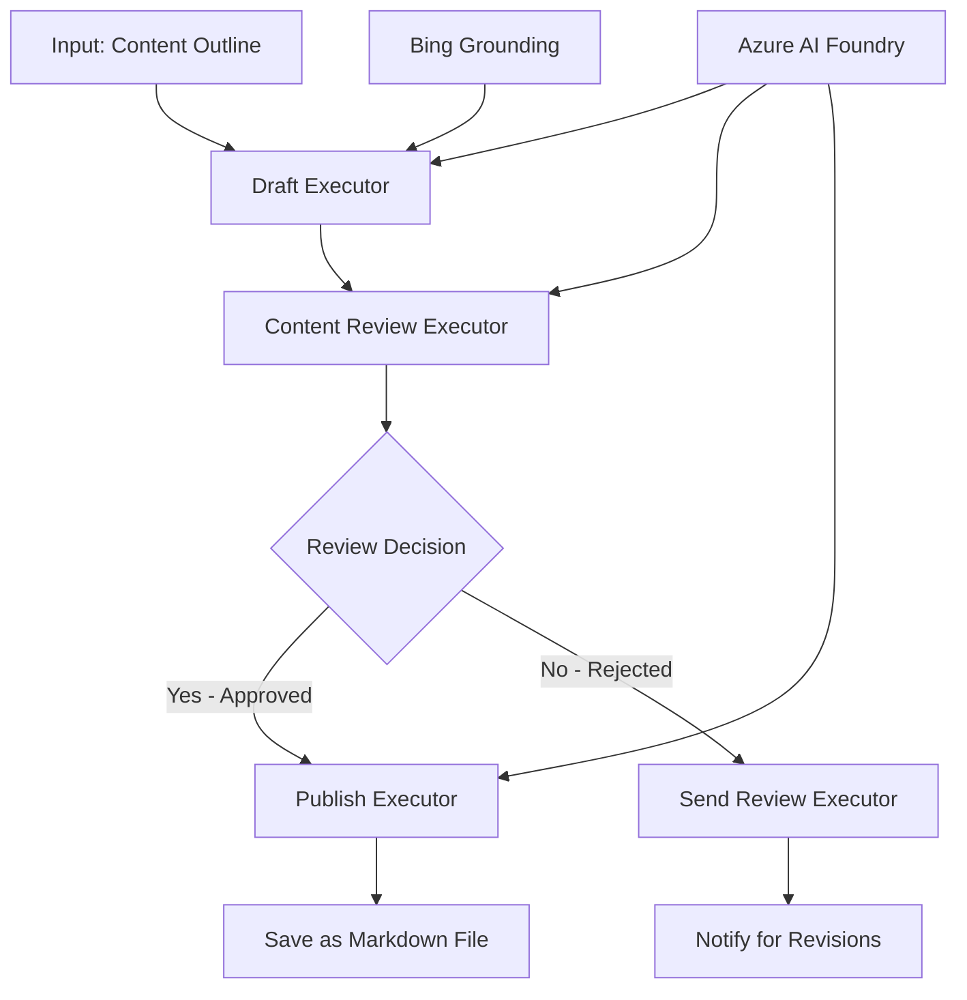

<!--
CO_OP_TRANSLATOR_METADATA:
{
  "original_hash": "8abd335151cee553293b637ee3d80d10",
  "translation_date": "2025-11-11T12:25:07+00:00",
  "source_file": "08-multi-agent/code_samples/workflows-agent-framework/dotNET/04.dotnet-agent-framework-workflow-aifoundry-condition.md",
  "language_code": "tl"
}
-->
# 🔀 Mga Kondisyunal na Daloy ng Trabaho ng Ahente gamit ang Azure AI Foundry (.NET)

## 📋 Tutorial sa Matalinong Daloy ng Trabaho Batay sa Desisyon

Ipinapakita ng notebook na ito ang **mga pattern ng kondisyunal na daloy ng trabaho** gamit ang Azure AI Foundry at ang Microsoft Agent Framework para sa .NET. Matututuhan mo kung paano bumuo ng mga sopistikado, desisyon-driven na daloy ng trabaho na matalinong nagruruta ng pagproseso batay sa pagsusuri ng AI, mga panuntunan sa negosyo, at mga dinamikong kondisyon para sa automation na pang-enterprise.

## 🎯 Mga Layunin sa Pag-aaral

### 🧠 **Arkitektura ng Matalinong Desisyon**
- **Pagpapatupad ng Kondisyunal na Lohika**: Bumuo ng mga kumplikadong puno ng desisyon na may maraming sangay
- **AI-Powered Routing**: Gamitin ang mga modelo ng Azure AI Foundry para sa matalinong desisyon sa pag-ruta
- **Dynamic Workflow Adaptation**: Baguhin ang pag-uugali ng daloy ng trabaho batay sa pagsusuri at kondisyon sa runtime
- **Enterprise Rule Integration**: Isama ang lohika ng negosyo at mga kinakailangan sa pagsunod sa mga daloy ng trabaho

### 🔀 **Mga Advanced na Pattern ng Kondisyunal**
- **Multi-Criteria Decision Making**: Suriin ang maraming salik para sa mga desisyon sa pag-ruta
- **Context-Aware Processing**: Gumawa ng mga desisyon batay sa naipon na konteksto ng daloy ng trabaho at kasaysayan
- **Adaptive Workflow Modification**: Dinamikong ayusin ang mga landas ng pagproseso batay sa mga kondisyon sa real-time
- **Rule Engine Integration**: Magpatupad ng sopistikadong mga makina ng panuntunan sa negosyo sa loob ng mga daloy ng trabaho

### 🏢 **Mga Kondisyunal na Aplikasyon sa Enterprise**
- **Pag-uuri at Pag-ruta ng Dokumento**: Awtomatikong uriin at i-ruta ang mga dokumento sa naaangkop na mga daloy ng trabaho
- **Customer Service Triage**: Matalinong pag-ruta ng mga tanong ng customer sa mga dalubhasang koponan
- **Pagproseso ng Pagsunod at Panganib**: Mag-apply ng iba't ibang proseso ng pagpapatunay at pagsusuri batay sa pagtatasa ng panganib
- **Mga Daloy ng Trabaho sa Quality Assurance**: I-ruta ang nilalaman sa naaangkop na mga proseso ng pagsusuri batay sa mga sukatan ng kalidad

## ⚙️ Mga Kinakailangan at Setup

### 📦 **Mga Kinakailangang NuGet Package**

Mga advanced na package para sa kondisyunal na pagproseso ng daloy ng trabaho:

```xml
<!-- Core AI Framework -->
<PackageReference Include="Microsoft.Extensions.AI" Version="9.9.0" />

<!-- Azure AI Agents with Persistent State -->
<PackageReference Include="Azure.AI.Agents.Persistent" Version="1.2.0-beta.5" />

<!-- Azure Identity and Utilities -->
<PackageReference Include="Azure.Identity" Version="1.15.0" />
<PackageReference Include="System.Linq.Async" Version="6.0.3" />
<PackageReference Include="DotNetEnv" Version="3.1.1" />

<!-- Local Workflow Framework References -->
<!-- Microsoft.Agents.Workflows.dll - Advanced workflow orchestration -->
<!-- Microsoft.Agents.AI.AzureAI.dll - Azure AI Foundry integration -->
<!-- Microsoft.Agents.AI.dll - Core agent abstractions -->
```

### 🔑 **Konpigurasyon ng Azure AI Foundry**

**Mga Kinakailangang Azure Resources:**
- Workspace ng Azure AI Foundry na may mga modelo ng kondisyunal na pagproseso
- Subscription sa Azure na may naaangkop na compute quotas at mga pahintulot
- Na-deploy na mga modelo ng AI para sa paggawa ng desisyon at pagsusuri ng nilalaman
- (Opsyonal) Koneksyon sa Bing Search API para sa grounding capabilities

**Konpigurasyon ng Kapaligiran (.env file):**
```env
# Azure AI Foundry Configuration
AZURE_AI_PROJECT_ENDPOINT=https://your-project.cognitiveservices.azure.com/
BING_CONNECTION_ID=your-bing-connection-id
```

**Setup ng Authentication:**
```csharp
// Azure CLI or Managed Identity authentication
using Azure.Identity;
var credential = new AzureCliCredential();

// Load environment configuration
DotNetEnv.Env.Load("../../../.env");
```

### 🏗️ **Arkitektura ng Kondisyunal na Daloy ng Trabaho**



**Mga Pangunahing Komponent:**
- **Draft Executor**: AI agent na gumagawa ng mga paunang draft ng nilalaman mula sa mga outline
- **Content Review Executor**: AI agent na sumusuri sa kalidad ng draft at pagsunod
- **Conditional Routing**: Lohika ng desisyon na nagruruta batay sa mga resulta ng pagsusuri
- **Publish/Review Paths**: Magkahiwalay na mga landas ng pagproseso para sa naaprubahan vs tinanggihan na nilalaman
- **State Management**: Pinapanatili ang konteksto ng nilalaman at pagsusuri sa buong daloy ng trabaho

## 🎨 **Mga Pattern ng Disenyo ng Kondisyunal na Daloy ng Trabaho**

### 📋 **Produksyon ng Nilalaman na may Quality Gates**
```
Outline → Draft Creation → Quality Review → {Approve: Publish | Reject: Revise}
```

### 🎯 **Pagproseso ng Dokumento Batay sa Panganib**
```
Document → Risk Assessment → {Low: Standard | High: Enhanced Review}
```

### 🔍 **Matalinong Pag-ruta ng Customer Service**
```
Customer Query → Analysis → {Simple: FAQ Bot | Complex: Human Agent}
```

### 💼 **Mga Daloy ng Trabaho Batay sa Pagsunod**
```
Content → Compliance Check → {Pass: Publish | Fail: Legal Review}
```

## 🏢 **Mga Benepisyo ng Kondisyunal na Enterprise**

### 🎯 **Matalinong Automation**
- **Matalinong Paggawa ng Desisyon**: Mga desisyon sa pag-ruta na pinapagana ng AI batay sa pagsusuri ng nilalaman at konteksto
- **Adaptive Processing**: Mga daloy ng trabaho na awtomatikong ina-adjust batay sa mga nagbabagong kondisyon
- **Pagpapatupad ng Panuntunan sa Negosyo**: Awtomatikong aplikasyon ng mga kumplikadong lohika ng negosyo at mga patakaran
- **Context-Aware Routing**: Mga desisyon batay sa buong kasaysayan ng daloy ng trabaho at naipon na konteksto

### 📈 **Operational Excellence**
- **Na-optimize na Alokasyon ng Resource**: I-ruta ang trabaho sa pinaka-angkop na mga espesyalista at proseso
- **Pinababang Manu-manong Interbensyon**: Ang awtomatikong paggawa ng desisyon ay binabawasan ang pangangailangan para sa manu-manong pag-ruta
- **Mas Mabilis na Oras ng Resolusyon**: Direktang pag-ruta sa naaangkop na kadalubhasaan at kakayahan sa pagproseso
- **Pare-parehong Aplikasyon**: Uniform na aplikasyon ng mga panuntunan sa negosyo at pamantayan sa paggawa ng desisyon

### 🛡️ **Pamamahala ng Panganib at Pagsunod**
- **Awtomatikong Pagtatasa ng Panganib**: Pagsusuri ng AI sa nilalaman at mga antas ng panganib ng sitwasyon
- **Pagpapatupad ng Pagsunod**: Awtomatikong pag-ruta sa mga kinakailangang proseso ng regulasyon
- **Aplikasyon ng Security Protocol**: Pinahusay na mga hakbang sa seguridad na inilapat batay sa pagtatasa ng panganib
- **Pagpapanatili ng Audit Trail**: Kumpletong dokumentasyon ng mga desisyon sa pag-ruta at mga dahilan

### 📊 **Analytics at Patuloy na Pagpapabuti**
- **Decision Analytics**: Subaybayan ang bisa at katumpakan ng mga desisyon sa pag-ruta
- **Pattern Recognition**: Tukuyin ang mga trend at pattern sa mga desisyon sa pag-ruta sa paglipas ng panahon
- **Performance Optimization**: Patuloy na pagpapabuti ng mga pamantayan sa paggawa ng desisyon at kahusayan sa pag-ruta
- **Business Intelligence**: Mga insight sa mga katangian ng nilalaman at mga kinakailangan sa pagproseso

### 🔧 **Technical Excellence**
- **Persistent State Management**: Panatilihin ang kumplikadong estado sa buong pagpapatupad ng daloy ng trabaho
- **Scalable Architecture**: Pangasiwaan ang mataas na dami ng mga kinakailangang kondisyunal na pagproseso
- **Integration Capabilities**: Seamless na integrasyon sa umiiral na mga sistema at proseso ng negosyo
- **Monitoring & Observability**: Komprehensibong pagsubaybay sa performance ng daloy ng trabaho at mga desisyon

Bumuo tayo ng matalinong, desisyon-driven na mga daloy ng trabaho sa enterprise gamit ang .NET! 🚀

## 💻 Pagpapatakbo ng Code

Ang kumpletong implementasyon ay makikita sa `04.dotnet-agent-framework-workflow-aifoundry-condition.cs`. Ipinapakita nito ang isang **daloy ng trabaho sa produksyon ng nilalaman na may quality gates**:

### 🏗️ **Arkitektura ng Daloy ng Trabaho**

```
Content Outline → Draft Creation → Quality Review → Conditional Routing:
                                                      ├─ Approved (>200 words) → Publish
                                                      └─ Rejected (<200 words) → Review Notification
```

**Mga Ahente sa Daloy ng Trabaho:**
1. **Evangelist Agent**: Gumagawa ng mga draft ng tutorial mula sa mga outline gamit ang Bing grounding
2. **Content Reviewer Agent**: Sinusuri ang kalidad ng draft (bilang ng salita, pagiging kumpleto)
3. **Publisher Agent**: Nagse-save ng naaprubahang nilalaman bilang mga timestamped na Markdown file

**Custom Executors:**
1. **DraftExecutor**: Nag-oorganisa ng paggawa ng draft
2. **ContentReviewExecutor**: Gumagawa ng pagsusuri sa kalidad
3. **PublishExecutor**: Naghahandle ng publikasyon ng naaprubahang nilalaman
4. **SendReviewExecutor**: Namamahala sa mga abiso ng tinanggihan na nilalaman

### 🚀 Pagpapatakbo ng Halimbawa

**Mga Kinakailangan:**
- Nakakonpigurang workspace ng Azure AI Foundry
- Authentication sa Azure CLI (`az login`)
- (Opsyonal) Koneksyon sa Bing Search para sa grounding

```bash
# Make the script executable (Unix/Linux/macOS)
chmod +x 04.dotnet-agent-framework-workflow-aifoundry-condition.cs

# Run the conditional workflow
./04.dotnet-agent-framework-workflow-aifoundry-condition.cs
```

O sa Windows:
```powershell
dotnet run 04.dotnet-agent-framework-workflow-aifoundry-condition.cs
```

### 📝 Inaasahang Output

Ang daloy ng trabaho ay:
1. **Gumawa ng Mga Ahente**: I-initialize ang tatlong espesyal na Azure AI Foundry agents
2. **Gumawa ng Draft**: Gumawa ang Evangelist agent ng draft ng tutorial mula sa outline
3. **Suriin ang Nilalaman**: Sinusuri ng Content Reviewer ang kalidad ng draft
4. **Kondisyunal na Pag-ruta**:
   - **Kung naaprubahan (>200 salita)**: Sine-save ng Publish executor bilang Markdown file
   - **Kung tinanggihan (<200 salita)**: Nagpapadala ng abiso sa pagsusuri
5. **Ipakita ang Resulta**: Ipakita ang huling resulta ng daloy ng trabaho

### 🔧 Mga Opsyon sa Pag-customize

**Baguhin ang Pamantayan sa Pagsusuri:**
```csharp
const string ContentReviewerInstructions = @"
You are a content reviewer...
1. Check if content is more than 500 words (instead of 200)
2. Verify technical accuracy
3. Ensure proper formatting
...";
```

**Magdagdag ng Higit pang Kondisyunal na Landas:**
```csharp
var workflow = new WorkflowBuilder(draftExecutor)
    .AddEdge(draftExecutor, contentReviewerExecutor)
    .AddEdge(contentReviewerExecutor, publishExecutor, condition: GetCondition("Excellent"))
    .AddEdge(contentReviewerExecutor, editExecutor, condition: GetCondition("Good"))
    .AddEdge(contentReviewerExecutor, sendReviewerExecutor, condition: GetCondition("Poor"))
    .Build();
```

**Baguhin ang Mga Kinakailangan sa Nilalaman:**
```csharp
string OUTLINE_Content = @"
# Your Custom Topic
## Section 1
https://your-reference-url
## Section 2
...
";
```

### 🎯 Mga Aplikasyon sa Tunay na Mundo

Ang pattern ng kondisyunal na daloy ng trabaho na ito ay perpekto para sa:
- **Mga Sistema ng Pamamahala ng Nilalaman**: Awtomatikong mga editorial workflow na may quality gates
- **Pagproseso ng Dokumento**: I-ruta ang mga dokumento batay sa pag-uuri at pagsunod
- **Suporta sa Customer**: Matalinong pag-ruta ng ticket batay sa pagiging kumplikado at pagkaapurahan
- **Legal na Pagsusuri**: I-ruta ang mga kontrata batay sa pagtatasa ng panganib at halaga
- **Mga Proseso ng HR**: I-ruta ang mga aplikasyon sa naaangkop na mga screening workflow

### 🔍 Pag-unawa sa Kondisyunal na Lohika

**Function ng Kondisyon:**
```csharp
public Func<object?, bool> GetCondition(string expectedResult) =>
    reviewResult => reviewResult is ReviewResult review && review.Result == expectedResult;
```

Ang function na ito ay lumilikha ng predicate na:
1. Sinusuri kung ang resulta ay uri ng `ReviewResult`
2. Inihahambing ang property na `Result` sa inaasahang halaga
3. Nagbabalik ng true/false upang matukoy ang pag-ruta

**Mga Edge ng Daloy ng Trabaho na may Mga Kondisyon:**
```csharp
.AddEdge(contentReviewerExecutor, publishExecutor, condition: GetCondition("Yes"))
.AddEdge(contentReviewerExecutor, sendReviewerExecutor, condition: GetCondition("No"))
```

### 📊 Mga Advanced na Tampok

**JSON Schema Validation:**
Ginagamit ng daloy ng trabaho ang mga JSON schema upang matiyak ang mga structured na tugon:

```csharp
// Define response structure
public class ReviewResult
{
    [JsonPropertyName("review_result")]
    public string Result { get; set; } = string.Empty;
    
    [JsonPropertyName("reason")]
    public string Reason { get; set; } = string.Empty;
    
    [JsonPropertyName("draft_content")]
    public string DraftContent { get; set; } = string.Empty;
}

// Apply to agent
ResponseFormat = ChatResponseFormat.ForJsonSchema(
    AIJsonUtilities.CreateJsonSchema(typeof(ReviewResult)), 
    "ReviewResult", 
    "Review Result From DraftContent"
)
```

**Bing Grounding Integration:**
Gumagamit ang Evangelist agent ng Bing grounding upang ma-access ang real-time na impormasyon:

```csharp
var bingGroundingConfig = new BingGroundingSearchConfiguration(bing_conn_id);
BingGroundingToolDefinition bingGroundingTool = new(
    new BingGroundingSearchToolParameters([bingGroundingConfig])
);
```

Pinapayagan nito ang ahente na sundan ang mga URL sa outline at kunin ang kasalukuyang impormasyon.

### 🛡️ Paghawak ng Error

Kasama sa daloy ng trabaho ang matibay na paghawak ng error para sa tinanggihan na nilalaman:
- Ang mga pagkabigo sa pagsusuri ay nagti-trigger ng alternatibong landas
- Ang mga abiso ay nagbibigay ng malinaw na mga dahilan ng pagtanggi
- Ang nilalaman ay pinapanatili para sa rebisyon

### 🔄 Pagpapalawak ng Daloy ng Trabaho

**Magdagdag ng Revision Loop:**
Lumikha ng feedback loop na awtomatikong nagre-redraft ng nilalaman:

```csharp
.AddEdge(contentReviewerExecutor, publishExecutor, condition: GetCondition("Yes"))
.AddEdge(contentReviewerExecutor, draftExecutor, condition: GetCondition("No")) // Loop back
```

**Magpatupad ng Multi-Level Review:**
Magdagdag ng maraming yugto ng pagsusuri na may iba't ibang pamantayan:

```csharp
.AddEdge(draftExecutor, technicalReviewer)
.AddEdge(technicalReviewer, editorialReviewer, condition: GetCondition("TechPass"))
.AddEdge(editorialReviewer, publishExecutor, condition: GetCondition("EditPass"))
```

Ang pattern ng kondisyunal na daloy ng trabaho na ito ay nagbibigay ng pundasyon para sa pagbuo ng sopistikado, matalinong mga sistema ng automation sa enterprise! 🚀

---

<!-- CO-OP TRANSLATOR DISCLAIMER START -->
**Paunawa**:  
Ang dokumentong ito ay isinalin gamit ang AI translation service na [Co-op Translator](https://github.com/Azure/co-op-translator). Bagama't sinisikap naming maging tumpak, mangyaring tandaan na ang mga awtomatikong pagsasalin ay maaaring maglaman ng mga pagkakamali o hindi pagkakatugma. Ang orihinal na dokumento sa kanyang katutubong wika ang dapat ituring na mapagkakatiwalaang pinagmulan. Para sa mahalagang impormasyon, inirerekomenda ang propesyonal na pagsasalin ng tao. Hindi kami mananagot sa anumang hindi pagkakaunawaan o maling interpretasyon na dulot ng paggamit ng pagsasaling ito.
<!-- CO-OP TRANSLATOR DISCLAIMER END -->