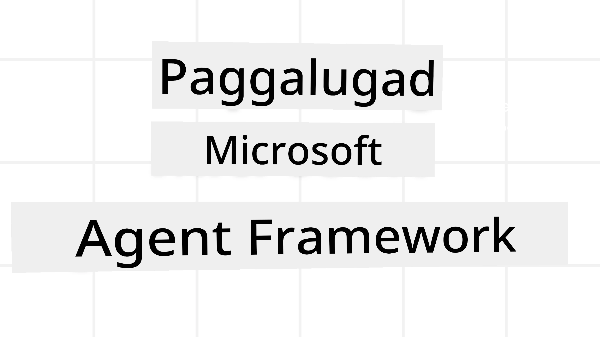
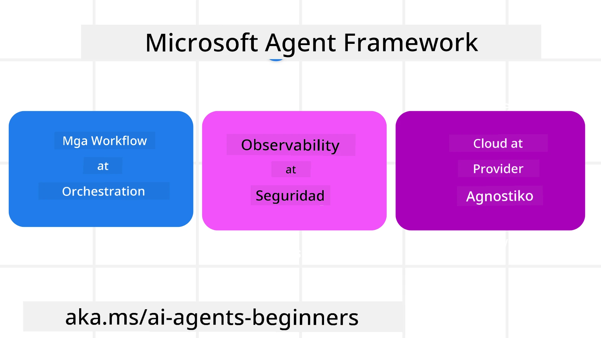
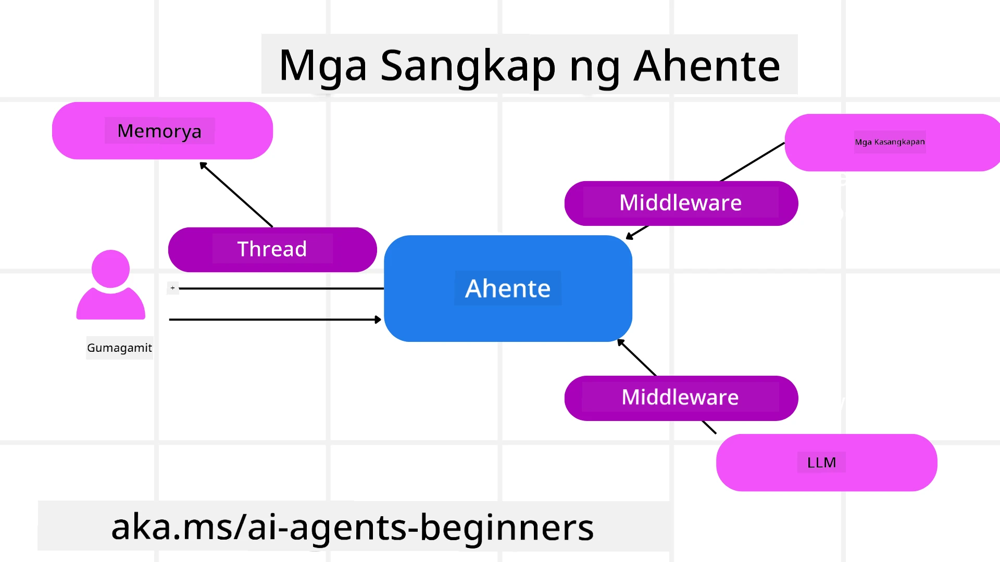

<!--
CO_OP_TRANSLATOR_METADATA:
{
  "original_hash": "19c4dab375acbc733855cc7f2f04edbc",
  "translation_date": "2025-10-02T11:14:51+00:00",
  "source_file": "14-microsoft-agent-framework/README.md",
  "language_code": "tl"
}
-->
# Paggalugad sa Microsoft Agent Framework



### Panimula

Ang araling ito ay tatalakay sa:

- Pag-unawa sa Microsoft Agent Framework: Mga Pangunahing Tampok at Halaga  
- Paggalugad sa Mga Pangunahing Konsepto ng Microsoft Agent Framework
- Paghahambing ng MAF sa Semantic Kernel at AutoGen: Gabay sa Paglipat

## Mga Layunin sa Pagkatuto

Pagkatapos makumpleto ang araling ito, malalaman mo kung paano:

- Bumuo ng Production Ready AI Agents gamit ang Microsoft Agent Framework
- I-apply ang mga pangunahing tampok ng Microsoft Agent Framework sa iyong Agentic Use Cases
- Maglipat at mag-integrate ng umiiral na mga Agentic framework at tools  

## Mga Halimbawa ng Code

Ang mga halimbawa ng code para sa [Microsoft Agent Framework (MAF)](https://aka.ms/ai-agents-beginners/agent-framewrok) ay matatagpuan sa repository na ito sa ilalim ng mga file na `xx-python-agent-framework` at `xx-dotnet-agent-framework`.

## Pag-unawa sa Microsoft Agent Framework



Ang [Microsoft Agent Framework (MAF)](https://aka.ms/ai-agents-beginners/agent-framewrok) ay binuo batay sa karanasan at mga natutunan mula sa Semantic Kernel at AutoGen. Nag-aalok ito ng kakayahang umangkop upang matugunan ang iba't ibang uri ng agentic use cases na makikita sa parehong production at research environments kabilang ang:

- **Sequential Agent orchestration** sa mga sitwasyon kung saan kinakailangan ang step-by-step na workflows.
- **Concurrent orchestration** sa mga sitwasyon kung saan kailangang sabay-sabay na tapusin ng mga agents ang mga gawain.
- **Group chat orchestration** sa mga sitwasyon kung saan maaaring magtulungan ang mga agents sa isang gawain.
- **Handoff Orchestration** sa mga sitwasyon kung saan ipinapasa ng mga agents ang gawain sa isa't isa kapag natapos na ang mga subtasks.
- **Magnetic Orchestration** sa mga sitwasyon kung saan ang isang manager agent ay lumilikha at nagbabago ng listahan ng mga gawain at humahawak sa koordinasyon ng mga subagents upang tapusin ang gawain.

Upang maihatid ang AI Agents sa Production, ang MAF ay may mga tampok na:

- **Observability** sa pamamagitan ng paggamit ng OpenTelemetry kung saan ang bawat aksyon ng AI Agent kabilang ang tool invocation, orchestration steps, reasoning flows, at performance monitoring ay makikita sa Azure AI Foundry dashboards.
- **Security** sa pamamagitan ng pag-host ng mga agents nang native sa Azure AI Foundry na may kasamang mga security controls tulad ng role-based access, private data handling, at built-in content safety.
- **Durability** dahil ang mga Agent threads at workflows ay maaaring mag-pause, mag-resume, at mag-recover mula sa mga error na nagbibigay-daan sa mas mahabang proseso.
- **Control** dahil sinusuportahan ang human-in-the-loop workflows kung saan ang mga gawain ay minamarkahan bilang nangangailangan ng pag-apruba ng tao.

Ang Microsoft Agent Framework ay nakatuon din sa pagiging interoperable sa pamamagitan ng:

- **Pagiging Cloud-agnostic** - Ang mga agents ay maaaring tumakbo sa containers, on-prem, at sa iba't ibang ulap.
- **Pagiging Provider-agnostic** - Ang mga agents ay maaaring malikha gamit ang iyong preferred SDK kabilang ang Azure OpenAI at OpenAI.
- **Pag-integrate ng Open Standards** - Ang mga agents ay maaaring gumamit ng mga protocol tulad ng Agent-to-Agent (A2A) at Model Context Protocol (MCP) upang matuklasan at magamit ang iba pang mga agents at tools.
- **Plugins at Connectors** - Ang mga koneksyon ay maaaring gawin sa data at memory services tulad ng Microsoft Fabric, SharePoint, Pinecone, at Qdrant.

Tingnan natin kung paano ginagamit ang mga tampok na ito sa ilang pangunahing konsepto ng Microsoft Agent Framework.

## Mga Pangunahing Konsepto ng Microsoft Agent Framework

### Mga Agents



**Paglikha ng Mga Agents**

Ang paglikha ng agent ay ginagawa sa pamamagitan ng pagde-define ng inference service (LLM Provider), isang set ng mga instruksyon para sundin ng AI Agent, at isang itinalagang `name`:

```python
agent = AzureOpenAIChatClient(credential=AzureCliCredential()).create_agent( instructions="You are good at recommending trips to customers based on their preferences.", name="TripRecommender" )
```

Ang nasa itaas ay gumagamit ng `Azure OpenAI` ngunit ang mga agents ay maaaring malikha gamit ang iba't ibang serbisyo kabilang ang `Azure AI Foundry Agent Service`:

```python
AzureAIAgentClient(async_credential=credential).create_agent( name="HelperAgent", instructions="You are a helpful assistant." ) as agent
```

Mga OpenAI `Responses`, `ChatCompletion` APIs

```python
agent = OpenAIResponsesClient().create_agent( name="WeatherBot", instructions="You are a helpful weather assistant.", )
```

```python
agent = OpenAIChatClient().create_agent( name="HelpfulAssistant", instructions="You are a helpful assistant.", )
```

o mga remote agents gamit ang A2A protocol:

```python
agent = A2AAgent( name=agent_card.name, description=agent_card.description, agent_card=agent_card, url="https://your-a2a-agent-host" )
```

**Pagpapatakbo ng Mga Agents**

Ang mga agents ay pinapatakbo gamit ang `.run` o `.run_stream` methods para sa non-streaming o streaming responses.

```python
result = await agent.run("What are good places to visit in Amsterdam?")
print(result.text)
```

```python
async for update in agent.run_stream("What are the good places to visit in Amsterdam?"):
    if update.text:
        print(update.text, end="", flush=True)

```

Ang bawat pagpapatakbo ng agent ay maaari ring magkaroon ng mga opsyon upang i-customize ang mga parameter tulad ng `max_tokens` na ginagamit ng agent, `tools` na maaaring tawagin ng agent, at maging ang `model` mismo na ginagamit para sa agent.

Ito ay kapaki-pakinabang sa mga sitwasyon kung saan kinakailangan ang partikular na mga modelo o tools para sa pagtapos ng gawain ng user.

**Mga Tools**

Ang mga tools ay maaaring idefine parehong sa pagde-define ng agent:

```python
def get_attractions( location: Annotated[str, Field(description="The location to get the top tourist attractions for")], ) -> str: """Get the top tourist attractions for a given location.""" return f"The top attractions for {location} are." 


# When creating a ChatAgent directly 

agent = ChatAgent( chat_client=OpenAIChatClient(), instructions="You are a helpful assistant", tools=[get_attractions]

```

at sa pagpapatakbo ng agent:

```python

result1 = await agent.run( "What's the best place to visit in Seattle?", tools=[get_attractions] # Tool provided for this run only )
```

**Agent Threads**

Ang Agent Threads ay ginagamit upang hawakan ang multi-turn na mga pag-uusap. Ang mga threads ay maaaring malikha sa pamamagitan ng:

- Paggamit ng `get_new_thread()` na nagbibigay-daan sa thread na ma-save sa paglipas ng panahon
- Paglikha ng thread nang awtomatiko kapag pinapatakbo ang agent at ang thread ay tumatagal lamang sa kasalukuyang run.

Upang lumikha ng thread, ganito ang code:

```python
# Create a new thread. 
thread = agent.get_new_thread() # Run the agent with the thread. 
response = await agent.run("Hello, I am here to help you book travel. Where would you like to go?", thread=thread)

```

Maaari mo ring i-serialize ang thread upang ma-store para sa paggamit sa hinaharap:

```python
# Create a new thread. 
thread = agent.get_new_thread() 

# Run the agent with the thread. 

response = await agent.run("Hello, how are you?", thread=thread) 

# Serialize the thread for storage. 

serialized_thread = await thread.serialize() 

# Deserialize the thread state after loading from storage. 

resumed_thread = await agent.deserialize_thread(serialized_thread)
```

**Agent Middleware**

Ang mga agents ay nakikipag-ugnayan sa mga tools at LLMs upang tapusin ang mga gawain ng user. Sa ilang mga sitwasyon, nais nating magpatupad o mag-track sa pagitan ng mga interaksyong ito. Ang agent middleware ay nagbibigay-daan sa atin na gawin ito sa pamamagitan ng:

*Function Middleware*

Ang middleware na ito ay nagbibigay-daan sa atin na magpatupad ng isang aksyon sa pagitan ng agent at isang function/tool na tatawagin nito. Isang halimbawa kung kailan ito gagamitin ay kapag nais mong mag-log ng function call.

Sa code sa ibaba, ang `next` ay nagde-define kung ang susunod na middleware o ang aktwal na function ang tatawagin.

```python
async def logging_function_middleware(
    context: FunctionInvocationContext,
    next: Callable[[FunctionInvocationContext], Awaitable[None]],
) -> None:
    """Function middleware that logs function execution."""
    # Pre-processing: Log before function execution
    print(f"[Function] Calling {context.function.name}")

    # Continue to next middleware or function execution
    await next(context)

    # Post-processing: Log after function execution
    print(f"[Function] {context.function.name} completed")
```

*Chat Middleware*

Ang middleware na ito ay nagbibigay-daan sa atin na magpatupad o mag-log ng isang aksyon sa pagitan ng agent at ng mga request sa pagitan ng LLM.

Naglalaman ito ng mahalagang impormasyon tulad ng `messages` na ipinapadala sa AI service.

```python
async def logging_chat_middleware(
    context: ChatContext,
    next: Callable[[ChatContext], Awaitable[None]],
) -> None:
    """Chat middleware that logs AI interactions."""
    # Pre-processing: Log before AI call
    print(f"[Chat] Sending {len(context.messages)} messages to AI")

    # Continue to next middleware or AI service
    await next(context)

    # Post-processing: Log after AI response
    print("[Chat] AI response received")

```

**Agent Memory**

Tulad ng tinalakay sa `Agentic Memory` na aralin, ang memory ay isang mahalagang elemento upang mag-operate ang agent sa iba't ibang konteksto. Ang MAF ay nag-aalok ng iba't ibang uri ng mga memory:

*In-Memory Storage*

Ito ang memory na naka-store sa threads sa runtime ng application.

```python
# Create a new thread. 
thread = agent.get_new_thread() # Run the agent with the thread. 
response = await agent.run("Hello, I am here to help you book travel. Where would you like to go?", thread=thread)
```

*Persistent Messages*

Ang memory na ito ay ginagamit kapag nag-store ng conversation history sa iba't ibang session. Ito ay idefine gamit ang `chat_message_store_factory`:

```python
from agent_framework import ChatMessageStore

# Create a custom message store
def create_message_store():
    return ChatMessageStore()

agent = ChatAgent(
    chat_client=OpenAIChatClient(),
    instructions="You are a Travel assistant.",
    chat_message_store_factory=create_message_store
)

```

*Dynamic Memory*

Ang memory na ito ay idinadagdag sa konteksto bago patakbuhin ang mga agents. Ang mga memory na ito ay maaaring i-store sa mga external services tulad ng mem0:

```python
from agent_framework.mem0 import Mem0Provider

# Using Mem0 for advanced memory capabilities
memory_provider = Mem0Provider(
    api_key="your-mem0-api-key",
    user_id="user_123",
    application_id="my_app"
)

agent = ChatAgent(
    chat_client=OpenAIChatClient(),
    instructions="You are a helpful assistant with memory.",
    context_providers=memory_provider
)

```

**Agent Observability**

Ang observability ay mahalaga sa pagbuo ng maaasahan at ma-maintain na agentic systems. Ang MAF ay nag-iintegrate sa OpenTelemetry upang magbigay ng tracing at meters para sa mas mahusay na observability.

```python
from agent_framework.observability import get_tracer, get_meter

tracer = get_tracer()
meter = get_meter()
with tracer.start_as_current_span("my_custom_span"):
    # do something
    pass
counter = meter.create_counter("my_custom_counter")
counter.add(1, {"key": "value"})
```

### Workflows

Ang MAF ay nag-aalok ng workflows na mga pre-defined na hakbang upang tapusin ang isang gawain at kasama ang mga AI agents bilang mga bahagi sa mga hakbang na iyon.

Ang workflows ay binubuo ng iba't ibang mga bahagi na nagbibigay-daan sa mas mahusay na control flow. Ang workflows ay nagbibigay-daan din sa **multi-agent orchestration** at **checkpointing** upang ma-save ang estado ng workflow.

Ang mga pangunahing bahagi ng isang workflow ay:

**Executors**

Ang mga Executors ay tumatanggap ng input messages, gumagawa ng kanilang itinalagang gawain, at pagkatapos ay gumagawa ng output message. Ito ay nagdadala ng workflow patungo sa pagtapos ng mas malaking gawain. Ang mga Executors ay maaaring AI agent o custom logic.

**Edges**

Ang mga Edges ay ginagamit upang idefine ang daloy ng mga mensahe sa isang workflow. Ang mga ito ay maaaring:

*Direct Edges* - Simpleng one-to-one na koneksyon sa pagitan ng mga executors:

```python
from agent_framework import WorkflowBuilder

builder = WorkflowBuilder()
builder.add_edge(source_executor, target_executor)
builder.set_start_executor(source_executor)
workflow = builder.build()
```

*Conditional Edges* - Na-activate pagkatapos matugunan ang isang kondisyon. Halimbawa, kapag walang available na hotel rooms, maaaring magmungkahi ang isang executor ng ibang opsyon.

*Switch-case Edges* - Nagre-route ng mga mensahe sa iba't ibang executors batay sa mga idefine na kondisyon. Halimbawa, kung ang travel customer ay may priority access, ang kanilang mga gawain ay hahawakan sa pamamagitan ng ibang workflow.

*Fan-out Edges* - Nagpapadala ng isang mensahe sa maraming target.

*Fan-in Edges* - Kinokolekta ang maraming mensahe mula sa iba't ibang executors at ipinapadala sa isang target.

**Events**

Upang magbigay ng mas mahusay na observability sa workflows, ang MAF ay nag-aalok ng built-in na mga events para sa execution kabilang ang:

- `WorkflowStartedEvent`  - Nagsisimula ang execution ng workflow
- `WorkflowOutputEvent` - Gumagawa ng output ang workflow
- `WorkflowErrorEvent` - Nakakaranas ng error ang workflow
- `ExecutorInvokeEvent`  - Nagsisimula ang processing ng executor
- `ExecutorCompleteEvent`  - Natatapos ang processing ng executor
- `RequestInfoEvent` - Isang request ang na-issue

## Paglipat Mula sa Ibang Frameworks (Semantic Kernel at AutoGen)

### Mga Pagkakaiba sa pagitan ng MAF at Semantic Kernel

**Pinadaling Paglikha ng Agent**

Ang Semantic Kernel ay umaasa sa paglikha ng isang Kernel instance para sa bawat agent. Ang MAF ay gumagamit ng pinadaling approach sa pamamagitan ng paggamit ng extensions para sa mga pangunahing provider.

```python
agent = AzureOpenAIChatClient(credential=AzureCliCredential()).create_agent( instructions="You are good at reccomending trips to customers based on their preferences.", name="TripRecommender" )
```

**Paglikha ng Agent Thread**

Ang Semantic Kernel ay nangangailangan ng manual na paglikha ng threads. Sa MAF, ang agent ay direktang ina-assign sa isang thread.

```python
thread = agent.get_new_thread() # Run the agent with the thread. 
```

**Pagrehistro ng Tool**

Sa Semantic Kernel, ang mga tools ay nire-rehistro sa Kernel at ang Kernel ay ipinapasa sa agent. Sa MAF, ang mga tools ay direktang nire-rehistro sa proseso ng paglikha ng agent.

```python
agent = ChatAgent( chat_client=OpenAIChatClient(), instructions="You are a helpful assistant", tools=[get_attractions]
```

### Mga Pagkakaiba sa pagitan ng MAF at AutoGen

**Teams vs Workflows**

Ang `Teams` ay ang event structure para sa event-driven na aktibidad ng mga agents sa AutoGen. Ang MAF ay gumagamit ng `Workflows` na nagre-route ng data sa mga executors sa pamamagitan ng graph-based na arkitektura.

**Paglikha ng Tool**

Ang AutoGen ay gumagamit ng `FunctionTool` upang i-wrap ang mga function para tawagin ng mga agents. Ang MAF ay gumagamit ng @ai_function na gumagana nang katulad ngunit awtomatikong nag-iinfer ng mga schemas para sa bawat function.

**Pag-uugali ng Agent**

Ang mga agents ay single-turn agents bilang default sa AutoGen maliban kung ang `max_tool_iterations` ay itinakda sa mas mataas. Sa MAF, ang `ChatAgent` ay multi-turn bilang default na nangangahulugang patuloy itong tatawag ng tools hanggang sa matapos ang gawain ng user.

## Mga Halimbawa ng Code

Ang mga halimbawa ng code para sa Microsoft Agent Framework ay matatagpuan sa repository na ito sa ilalim ng mga file na `xx-python-agent-framework` at `xx-dotnet-agent-framework`.

## May Mas Marami Pang Tanong Tungkol sa Microsoft Agent Framework?

Sumali sa [Azure AI Foundry Discord](https://aka.ms/ai-agents/discord) upang makipagtagpo sa ibang mga nag-aaral, dumalo sa office hours, at makuha ang sagot sa iyong mga tanong tungkol sa AI Agents.

---

**Paunawa**:  
Ang dokumentong ito ay isinalin gamit ang AI translation service na [Co-op Translator](https://github.com/Azure/co-op-translator). Bagama't sinisikap naming maging tumpak, mangyaring tandaan na ang mga awtomatikong pagsasalin ay maaaring maglaman ng mga pagkakamali o hindi pagkakatugma. Ang orihinal na dokumento sa kanyang katutubong wika ang dapat ituring na opisyal na sanggunian. Para sa mahalagang impormasyon, inirerekomenda ang propesyonal na pagsasalin ng tao. Hindi kami mananagot sa anumang hindi pagkakaunawaan o maling interpretasyon na dulot ng paggamit ng pagsasaling ito.