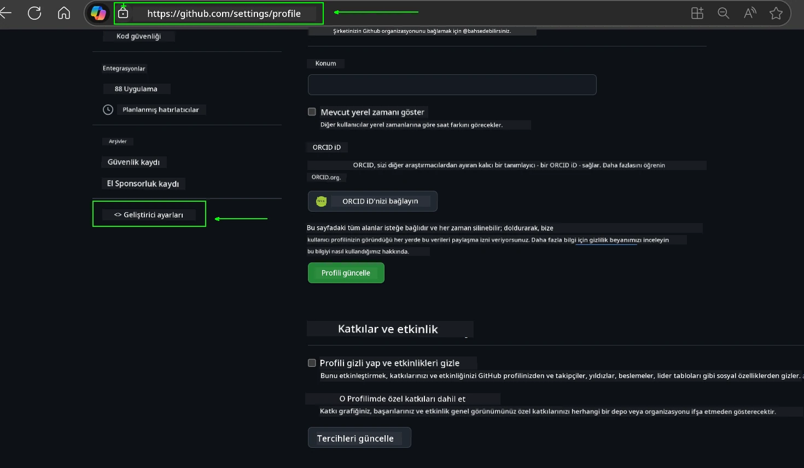
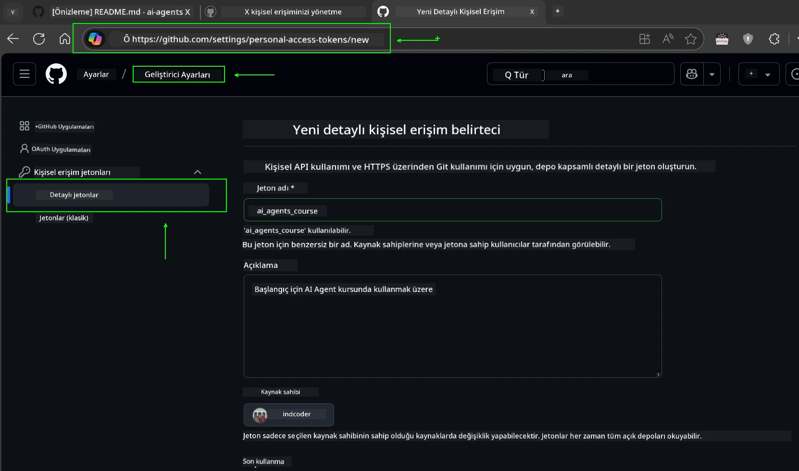
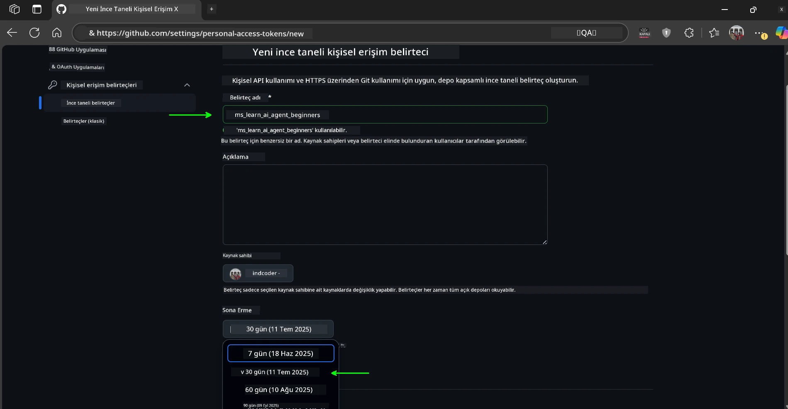
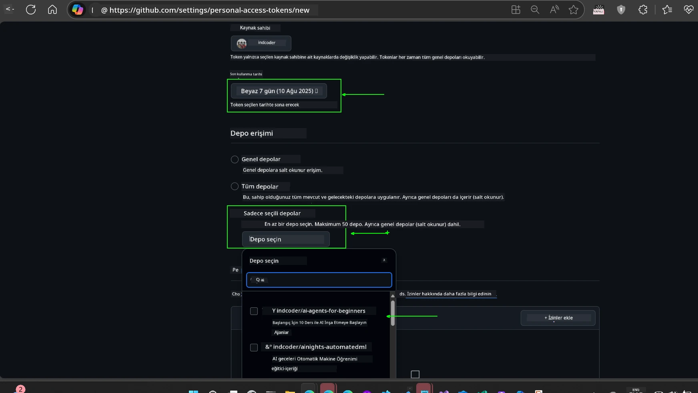
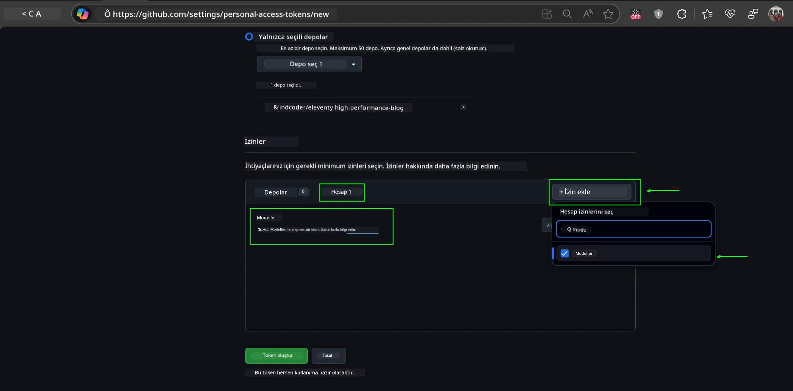
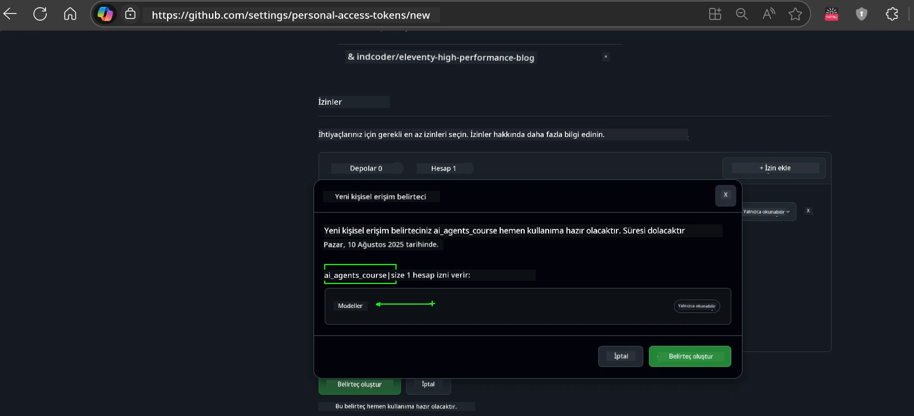
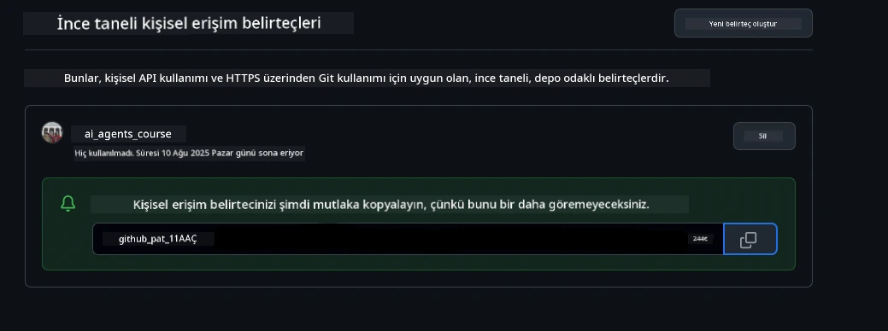
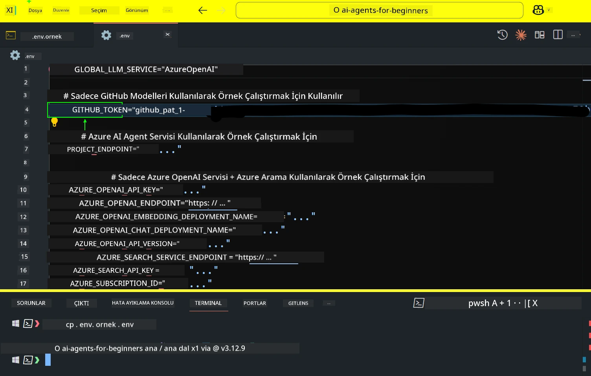
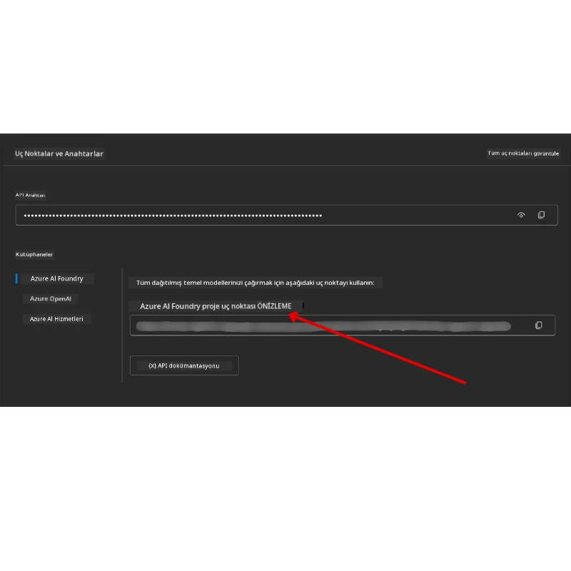

<!--
CO_OP_TRANSLATOR_METADATA:
{
  "original_hash": "63b1a8f6e840df15934935b728e569f0",
  "translation_date": "2025-12-03T14:24:11+00:00",
  "source_file": "00-course-setup/README.md",
  "language_code": "tr"
}
-->
# Kurs Kurulumu

## Giriş

Bu ders, bu kursun kod örneklerini nasıl çalıştıracağınızı kapsayacaktır.

## Diğer Öğrencilere Katılın ve Yardım Alın

Depoyu klonlamaya başlamadan önce, kurulumla ilgili yardım almak, kursla ilgili sorular sormak veya diğer öğrencilerle bağlantı kurmak için [AI Agents For Beginners Discord kanalına](https://aka.ms/ai-agents/discord) katılın.

## Bu Depoyu Klonlayın veya Çatallayın

Başlamak için lütfen GitHub Deposunu klonlayın veya çatallayın. Bu, kurs materyalinin kendi versiyonunuzu oluşturmanızı sağlar, böylece kodu çalıştırabilir, test edebilir ve üzerinde değişiklik yapabilirsiniz!

Bunu yapmak için <a href="https://github.com/microsoft/ai-agents-for-beginners/fork" target="_blank">depo çatallama</a> bağlantısına tıklayın.

Artık bu kursun çatallanmış kendi versiyonuna aşağıdaki bağlantıdan sahip olmalısınız:


### Yüzeysel Klonlama (atölye çalışması / Codespaces için önerilir)

  >Tam depo, tüm geçmişi ve dosyaları indirirken büyük (~3 GB) olabilir. Sadece atölye çalışmasına katılıyorsanız veya yalnızca birkaç ders klasörüne ihtiyacınız varsa, yüzeysel klonlama (veya seyrek klonlama), geçmişi kısaltarak ve/veya blobları atlayarak bu indirmenin çoğunu önler.

#### Hızlı yüzeysel klonlama — minimum geçmiş, tüm dosyalar

Aşağıdaki komutlarda `<your-username>` kısmını çatallama URL'nizle (veya tercih ederseniz yukarı akış URL'siyle) değiştirin.

Sadece en son commit geçmişini klonlamak için (küçük indirme):

```bash|powershell
git clone --depth 1 https://github.com/<your-username>/ai-agents-for-beginners.git
```

Belirli bir dalı klonlamak için:

```bash|powershell
git clone --depth 1 --branch <branch-name> https://github.com/<your-username>/ai-agents-for-beginners.git
```

#### Kısmi (seyrek) klonlama — minimum bloblar + yalnızca seçilen klasörler

Bu, kısmi klonlama ve seyrek-checkout kullanır (Git 2.25+ gerektirir ve kısmi klonlama desteği olan modern Git önerilir):

```bash|powershell
git clone --depth 1 --filter=blob:none --sparse https://github.com/<your-username>/ai-agents-for-beginners.git
```

Depo klasörüne geçin:

```bash|powershell
cd ai-agents-for-beginners
```

Sonra hangi klasörleri istediğinizi belirtin (aşağıdaki örnek iki klasörü gösterir):

```bash|powershell
git sparse-checkout set 00-course-setup 01-intro-to-ai-agents
```

Dosyaları klonladıktan ve doğruladıktan sonra, yalnızca dosyalara ihtiyacınız varsa ve alan boşaltmak istiyorsanız (git geçmişi olmadan), depo meta verilerini silin (💀geri dönüşü olmayan — tüm Git işlevselliğini kaybedersiniz: commit, çekme, itme veya geçmiş erişimi yok).

```bash
# zsh/bash
rm -rf .git
```

```powershell
# PowerShell
Remove-Item -Recurse -Force .git
```

#### GitHub Codespaces Kullanımı (yerel büyük indirmelerden kaçınmak için önerilir)

- [GitHub UI](https://github.com/codespaces) aracılığıyla bu depo için yeni bir Codespace oluşturun.  

- Yeni oluşturulan Codespace'in terminalinde, yalnızca ihtiyacınız olan ders klasörlerini Codespace çalışma alanına getirmek için yukarıdaki yüzeysel/seyrek klonlama komutlarından birini çalıştırın.
- İsteğe bağlı: Codespaces içinde klonladıktan sonra, ekstra alan kazanmak için .git'i kaldırın (yukarıdaki kaldırma komutlarına bakın).
- Not: Depoyu doğrudan Codespaces içinde açmayı tercih ederseniz (ekstra klonlama olmadan), Codespaces devcontainer ortamını oluşturacak ve yine de ihtiyacınızdan fazlasını sağlayabilir. Taze bir Codespace içinde yüzeysel bir kopya klonlamak, disk kullanımını daha iyi kontrol etmenizi sağlar.

#### İpuçları

- Düzenleme/commit yapmak istiyorsanız her zaman klon URL'sini çatallamanızla değiştirin.
- Daha sonra daha fazla geçmişe veya dosyaya ihtiyacınız olursa, bunları alabilir veya seyrek-checkout'u ek klasörleri içerecek şekilde ayarlayabilirsiniz.

## Kod Çalıştırma

Bu kurs, AI Agent'lar oluşturmayı öğrenmek için pratik yapabileceğiniz bir dizi Jupyter Notebooks sunar.

Kod örnekleri şu seçenekleri kullanır:

**GitHub Hesabı Gerektirir - Ücretsiz**:

1) Semantic Kernel Agent Framework + GitHub Models Marketplace. (semantic-kernel.ipynb olarak etiketlenmiştir)
2) AutoGen Framework + GitHub Models Marketplace. (autogen.ipynb olarak etiketlenmiştir)

**Azure Aboneliği Gerektirir**:

3) Azure AI Foundry + Azure AI Agent Service. (azureaiagent.ipynb olarak etiketlenmiştir)

Üç tür örneği de denemenizi öneririz, böylece hangisinin sizin için en iyi çalıştığını görebilirsiniz.

Hangi seçeneği seçerseniz seçin, aşağıdaki kurulum adımlarını belirleyecektir:

## Gereksinimler

- Python 3.12+
  - **NOT**: Python3.12 yüklü değilse, yüklediğinizden emin olun. Ardından requirements.txt dosyasından doğru sürümlerin yüklendiğinden emin olmak için python3.12 kullanarak venv oluşturun.
  
    >Örnek

    Python venv dizini oluşturun:

    ```bash|powershell
    python -m venv venv
    ```

    Ardından venv ortamını etkinleştirin:

    ```bash
    # zsh/bash
    source venv/bin/activate
    ```
  
    ```dos
    # Command Prompt for Windows
    venv\Scripts\activate
    ```

- .NET 10+: .NET kullanan örnek kodlar için, [.NET 10 SDK](https://dotnet.microsoft.com/download/dotnet/10.0) veya daha yeni bir sürüm yüklediğinizden emin olun. Ardından, yüklü .NET SDK sürümünüzü kontrol edin:

    ```bash|powershell
    dotnet --list-sdks
    ```

- Bir GitHub Hesabı - GitHub Models Marketplace'e erişim için
- Azure Aboneliği - Azure AI Foundry'e erişim için
- Azure AI Foundry Hesabı - Azure AI Agent Service'e erişim için

Bu depoda, kod örneklerini çalıştırmak için gereken tüm Python paketlerini içeren bir `requirements.txt` dosyası bulunmaktadır.

Bunları, depo kökündeki terminalinizde aşağıdaki komutu çalıştırarak yükleyebilirsiniz:

```bash|powershell
pip install -r requirements.txt
```

Herhangi bir çakışma ve sorun yaşamamak için bir Python sanal ortamı oluşturmanızı öneririz.

## VSCode Kurulumu

VSCode'da doğru Python sürümünü kullandığınızdan emin olun.


## GitHub Modellerini Kullanarak Örnekler için Kurulum 

### Adım 1: GitHub Kişisel Erişim Jetonunuzu (PAT) Alın

Bu kurs, GitHub Models Marketplace'i kullanır ve AI Agent'lar oluşturmak için kullanacağınız Büyük Dil Modellerine (LLM'ler) ücretsiz erişim sağlar.

GitHub Modellerini kullanmak için bir [GitHub Kişisel Erişim Jetonu](https://docs.github.com/en/authentication/keeping-your-account-and-data-secure/managing-your-personal-access-tokens) oluşturmanız gerekecek.

Bu, GitHub Hesabınızdaki <a href="https://github.com/settings/personal-access-tokens" target="_blank">Kişisel Erişim Jetonları ayarları</a> sayfasına giderek yapılabilir.

Jetonunuzu oluştururken [En Az Ayrıcalık İlkesi](https://docs.github.com/en/get-started/learning-to-code/storing-your-secrets-safely) ilkesini takip edin. Bu, jetona yalnızca bu kurstaki kod örneklerini çalıştırmak için gereken izinleri vermeniz gerektiği anlamına gelir.

1. **Geliştirici ayarları**na giderek ekranın sol tarafındaki `İnce Ayarlı Jetonlar` seçeneğini seçin.

   

   Ardından `Yeni jeton oluştur` seçeneğini seçin.

   

2. Jetonun amacını yansıtan açıklayıcı bir ad girin, böylece daha sonra kolayca tanımlayabilirsiniz.

    🔐 Jeton Süresi Önerisi

    Önerilen süre: 30 gün
    Daha güvenli bir duruş için daha kısa bir süre seçebilirsiniz—örneğin 7 gün 🛡️
    Bu, kişisel bir hedef belirlemek ve öğrenme ivmeniz yüksekken kursu tamamlamak için harika bir yoldur 🚀.

    

3. Jetonun kapsamını bu deponun çatallanmış versiyonuyla sınırlayın.

    

4. Jetonun izinlerini kısıtlayın: **İzinler** altında, **Hesap** sekmesine tıklayın ve "+ İzin ekle" düğmesine tıklayın. Bir açılır menü görünecektir. Lütfen **Modeller**i arayın ve kutuyu işaretleyin.

    

5. Jetonu oluşturmadan önce gereken izinleri doğrulayın. 

6. Jetonu oluşturmadan önce, jetonu bir şifre yöneticisi kasası gibi güvenli bir yerde saklamaya hazır olduğunuzdan emin olun, çünkü oluşturduktan sonra tekrar gösterilmeyecektir. 

Yeni oluşturduğunuz jetonu kopyalayın. Şimdi bu jetonu bu kursa dahil edilen `.env` dosyasına ekleyeceksiniz.

### Adım 2: `.env` Dosyanızı Oluşturun

`.env` dosyanızı oluşturmak için terminalinizde aşağıdaki komutu çalıştırın.

```bash
# zsh/bash
cp .env.example .env
```

```powershell
# PowerShell
Copy-Item .env.example .env
```

Bu, örnek dosyayı kopyalayacak ve dizininizde bir `.env` dosyası oluşturacaktır. Çevre değişkenleri için değerleri buraya doldurun.

Jetonunuzu kopyalayarak, favori metin düzenleyicinizi açın ve jetonunuzu `.env` dosyasındaki `GITHUB_TOKEN` alanına yapıştırın.



Artık bu kursun kod örneklerini çalıştırabilirsiniz.

## Azure AI Foundry ve Azure AI Agent Service Kullanarak Örnekler için Kurulum

### Adım 1: Azure Proje Uç Noktanızı Alın

Azure AI Foundry'de bir hub ve proje oluşturma adımlarını buradan takip edin: [Hub kaynakları genel bakış](https://learn.microsoft.com/azure/ai-foundry/concepts/ai-resources)

Projenizi oluşturduktan sonra, projenizin bağlantı dizgesini almanız gerekecek.

Bu, Azure AI Foundry portalındaki projenizin **Genel Bakış** sayfasına giderek yapılabilir.



### Adım 2: `.env` Dosyanızı Oluşturun

`.env` dosyanızı oluşturmak için terminalinizde aşağıdaki komutu çalıştırın.

```bash
# zsh/bash
cp .env.example .env
```

```powershell
# PowerShell
Copy-Item .env.example .env
```

Bu, örnek dosyayı kopyalayacak ve dizininizde bir `.env` dosyası oluşturacaktır. Çevre değişkenleri için değerleri buraya doldurun.

Jetonunuzu kopyalayarak, favori metin düzenleyicinizi açın ve jetonunuzu `.env` dosyasındaki `PROJECT_ENDPOINT` alanına yapıştırın.

### Adım 3: Azure'a Giriş Yapın

Bir güvenlik en iyi uygulaması olarak, Azure OpenAI'ye Microsoft Entra ID ile [anahtarsız kimlik doğrulama](https://learn.microsoft.com/azure/developer/ai/keyless-connections?tabs=csharp%2Cazure-cli?WT.mc_id=academic-105485-koreyst) kullanacağız.

Sonraki adımda, bir terminal açın ve Azure hesabınıza giriş yapmak için `az login --use-device-code` komutunu çalıştırın.

Giriş yaptıktan sonra, terminalde aboneliğinizi seçin.

## Ek Çevre Değişkenleri - Azure Search ve Azure OpenAI 

Agentic RAG Dersi - Ders 5 - Azure Search ve Azure OpenAI kullanan örnekler içerir.

Bu örnekleri çalıştırmak istiyorsanız, `.env` dosyanıza aşağıdaki çevre değişkenlerini eklemeniz gerekecek:

### Genel Bakış Sayfası (Proje)

- `AZURE_SUBSCRIPTION_ID` - Projenizin **Genel Bakış** sayfasındaki **Proje detayları**na bakın.

- `AZURE_AI_PROJECT_NAME` - Projenizin **Genel Bakış** sayfasının üst kısmına bakın.

- `AZURE_OPENAI_SERVICE` - **Genel Bakış** sayfasındaki **Azure OpenAI Service** için **Dahil edilen yetenekler** sekmesinde bulun.

### Yönetim Merkezi

- `AZURE_OPENAI_RESOURCE_GROUP` - **Yönetim Merkezi**nin **Genel Bakış** sayfasındaki **Proje özellikleri**ne gidin.

- `GLOBAL_LLM_SERVICE` - **Bağlı kaynaklar** altında, **Azure AI Services** bağlantı adını bulun. Listelenmemişse, kaynak grubunuzdaki AI Services kaynak adını **Azure portalı**nda kontrol edin.

### Modeller + Uç Noktalar Sayfası

- `AZURE_OPENAI_EMBEDDING_DEPLOYMENT_NAME` - Gömme modelinizi seçin (örneğin, `text-embedding-ada-002`) ve model detaylarından **Dağıtım adını** not edin.

- `AZURE_OPENAI_CHAT_DEPLOYMENT_NAME` - Sohbet modelinizi seçin (örneğin, `gpt-4o-mini`) ve model detaylarından **Dağıtım adını** not edin.

### Azure Portalı

- `AZURE_OPENAI_ENDPOINT` - **Azure AI services**'ı arayın, üzerine tıklayın, ardından **Kaynak Yönetimi**, **Anahtarlar ve Uç Nokta**ya gidin, "Azure OpenAI uç noktaları"na kadar aşağı kaydırın ve "Dil API'leri" yazanını kopyalayın.

- `AZURE_OPENAI_API_KEY` - Aynı ekrandan, ANAHTAR 1 veya ANAHTAR 2'yi kopyalayın.

- `AZURE_SEARCH_SERVICE_ENDPOINT` - **Azure AI Search** kaynağınızı bulun, üzerine tıklayın ve **Genel Bakış**a bakın.

- `AZURE_SEARCH_API_KEY` - Ardından **Ayarlar** ve ardından **Anahtarlar**a giderek birincil veya ikincil yönetici anahtarını kopyalayın.

### Harici Web Sayfası

- `AZURE_OPENAI_API_VERSION` - [API sürüm yaşam döngüsü](https://learn.microsoft.com/azure/ai-services/openai/api-version-deprecation#latest-ga-api-release) sayfasını **En Son GA API sürümü** altında ziyaret edin.

### Anahtarsız kimlik doğrulama kurulum

Kimlik bilgilerinizi kodlamak yerine, Azure OpenAI ile anahtarsız bir bağlantı kullanacağız. Bunu yapmak için `DefaultAzureCredential`'ı içe aktaracağız ve daha sonra kimlik bilgilerini almak için `DefaultAzureCredential` işlevini çağıracağız.

```python
# Python
from azure.identity import DefaultAzureCredential, InteractiveBrowserCredential
```

## Bir Yerde Takıldınız mı?
Eğer bu kurulumu çalıştırırken herhangi bir sorun yaşarsanız, <a href="https://discord.gg/kzRShWzttr" target="_blank">Azure AI Topluluğu Discord</a>'una katılabilir veya <a href="https://github.com/microsoft/ai-agents-for-beginners/issues?WT.mc_id=academic-105485-koreyst" target="_blank">bir sorun oluşturabilirsiniz</a>.

## Sonraki Ders

Artık bu kursun kodlarını çalıştırmaya hazırsınız. AI Ajanları dünyası hakkında daha fazla şey öğrenirken iyi eğlenceler!

[Yapay Zeka Ajanlarına Giriş ve Ajan Kullanım Durumları](../01-intro-to-ai-agents/README.md)

---

<!-- CO-OP TRANSLATOR DISCLAIMER START -->
**Feragatname**:  
Bu belge, AI çeviri hizmeti [Co-op Translator](https://github.com/Azure/co-op-translator) kullanılarak çevrilmiştir. Doğruluk için çaba göstersek de, otomatik çevirilerin hata veya yanlışlıklar içerebileceğini lütfen unutmayın. Belgenin orijinal dili, yetkili kaynak olarak kabul edilmelidir. Kritik bilgiler için profesyonel insan çevirisi önerilir. Bu çevirinin kullanımından kaynaklanan yanlış anlama veya yanlış yorumlamalardan sorumlu değiliz.
<!-- CO-OP TRANSLATOR DISCLAIMER END -->