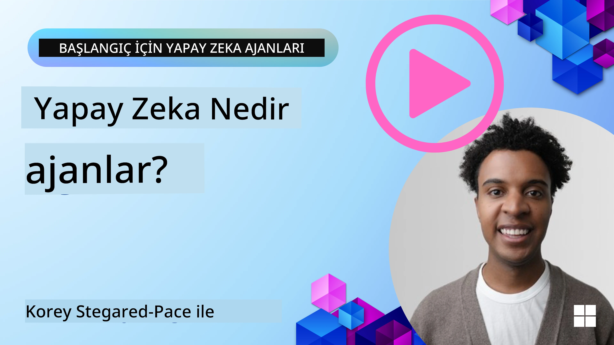
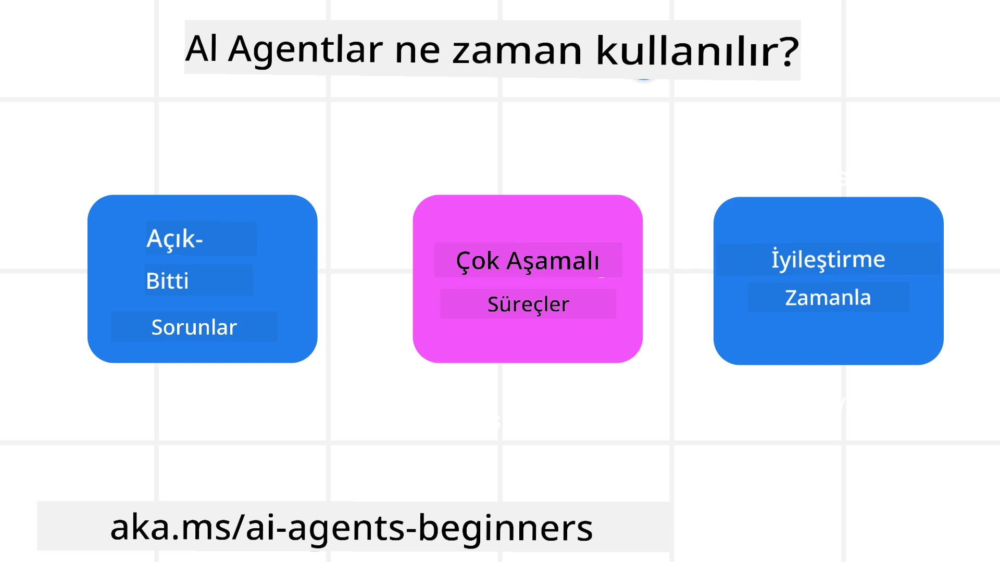

<!--
CO_OP_TRANSLATOR_METADATA:
{
  "original_hash": "cdd28bc00816d2773bb2b5968d782abc",
  "translation_date": "2025-11-11T11:14:25+00:00",
  "source_file": "01-intro-to-ai-agents/README.md",
  "language_code": "tr"
}
-->

> _(Bu dersin videosunu izlemek için yukarıdaki görsele tıklayın)_

# AI Ajanlarına ve Ajan Kullanım Alanlarına Giriş

"Yeni Başlayanlar için AI Ajanları" kursuna hoş geldiniz! Bu kurs, AI Ajanları oluşturmak için temel bilgiler ve uygulamalı örnekler sunar.

<a href="https://discord.gg/kzRShWzttr" target="_blank">Azure AI Discord Topluluğuna</a> katılarak diğer öğrenenlerle ve AI Ajan geliştiricileriyle tanışabilir ve bu kursla ilgili sorularınızı sorabilirsiniz.

Bu kursa başlamak için, AI Ajanlarının ne olduğunu ve oluşturduğumuz uygulamalarda ve iş akışlarında nasıl kullanılabileceğini daha iyi anlamakla başlıyoruz.

## Giriş

Bu ders şunları kapsar:

- AI Ajanları nedir ve farklı ajan türleri nelerdir?
- AI Ajanları için en uygun kullanım alanları nelerdir ve bize nasıl yardımcı olabilirler?
- Ajan çözümleri tasarlarken temel yapı taşları nelerdir?

## Öğrenme Hedefleri
Bu dersi tamamladıktan sonra:

- AI Ajan kavramlarını ve diğer AI çözümlerinden nasıl farklılaştığını anlayabileceksiniz.
- AI Ajanlarını en verimli şekilde uygulayabileceksiniz.
- Hem kullanıcılar hem de müşteriler için üretken bir şekilde ajan çözümleri tasarlayabileceksiniz.

## AI Ajanlarını Tanımlama ve Türleri

### AI Ajanları Nedir?

AI Ajanları, **Büyük Dil Modelleri (LLM)**'nin **eylem gerçekleştirmesini** sağlayan, LLM'lere **araçlara erişim** ve **bilgi** vererek yeteneklerini genişleten **sistemlerdir**.

Bu tanımı daha küçük parçalara ayıralım:

- **Sistem** - Ajanları sadece tek bir bileşen olarak değil, birçok bileşenden oluşan bir sistem olarak düşünmek önemlidir. AI Ajanlarının temel bileşenleri şunlardır:
  - **Ortam** - AI Ajanının çalıştığı tanımlı alan. Örneğin, bir seyahat rezervasyonu AI Ajanımız olsaydı, ortam, AI Ajanının görevleri tamamlamak için kullandığı seyahat rezervasyon sistemi olabilir.
  - **Sensörler** - Ortamlar bilgi sağlar ve geri bildirimde bulunur. AI Ajanları, ortamın mevcut durumu hakkında bilgi toplamak ve yorumlamak için sensörleri kullanır. Seyahat rezervasyonu ajanı örneğinde, seyahat rezervasyon sistemi otel müsaitliği veya uçuş fiyatları gibi bilgiler sağlayabilir.
  - **Eyleyiciler** - AI Ajanı, ortamın mevcut durumunu aldıktan sonra, mevcut görev için ortamı değiştirmek üzere hangi eylemi gerçekleştireceğine karar verir. Seyahat rezervasyonu ajanı için bu, kullanıcı için uygun bir oda rezervasyonu yapmak olabilir.

**Büyük Dil Modelleri** - Ajan kavramı, LLM'lerin oluşturulmasından önce de vardı. LLM'lerle AI Ajanları oluşturmanın avantajı, insan dilini ve veriyi yorumlama yetenekleridir. Bu yetenek, LLM'lerin çevresel bilgiyi yorumlamasını ve ortamı değiştirmek için bir plan tanımlamasını sağlar.

**Eylem Gerçekleştirme** - AI Ajan sistemleri dışında, LLM'ler yalnızca bir kullanıcının talebine dayalı olarak içerik veya bilgi üretme gibi durumlarla sınırlıdır. AI Ajan sistemleri içinde, LLM'ler kullanıcının talebini yorumlayarak ve ortamlarında mevcut araçları kullanarak görevleri yerine getirebilir.

**Araçlara Erişim** - LLM'nin erişebileceği araçlar, 1) çalıştığı ortam ve 2) AI Ajanının geliştiricisi tarafından tanımlanır. Seyahat ajanı örneğimizde, ajanın araçları, rezervasyon sisteminde mevcut işlemlerle sınırlıdır ve/veya geliştirici, ajanın araç erişimini uçuşlarla sınırlayabilir.

**Hafıza+Bilgi** - Hafıza, kullanıcı ile ajan arasındaki konuşma bağlamında kısa vadeli olabilir. Uzun vadede, ortam tarafından sağlanan bilginin dışında, AI Ajanları diğer sistemlerden, hizmetlerden, araçlardan ve hatta diğer ajanlardan bilgi alabilir. Seyahat ajanı örneğinde, bu bilgi, bir müşteri veritabanında bulunan kullanıcının seyahat tercihleri olabilir.

### Farklı Ajan Türleri

Artık AI Ajanlarının genel bir tanımına sahip olduğumuza göre, bazı özel ajan türlerine ve bunların seyahat rezervasyonu AI ajanına nasıl uygulanabileceğine bakalım.

| **Ajan Türü**                | **Açıklama**                                                                                                                       | **Örnek**                                                                                                                                                                                                                   |
| ----------------------------- | ------------------------------------------------------------------------------------------------------------------------------------- | ----------------------------------------------------------------------------------------------------------------------------------------------------------------------------------------------------------------------------- |
| **Basit Refleks Ajanlar**      | Önceden tanımlanmış kurallara dayalı olarak anında eylemler gerçekleştirir.                                                                                  | Seyahat ajanı, e-postanın bağlamını yorumlar ve seyahat şikayetlerini müşteri hizmetlerine yönlendirir.                                                                                                                          |
| **Model Tabanlı Refleks Ajanlar** | Dünyanın bir modeline ve bu modeldeki değişikliklere dayalı olarak eylemler gerçekleştirir.                                                              | Seyahat ajanı, geçmiş fiyatlandırma verilerine erişime dayalı olarak önemli fiyat değişiklikleri olan rotaları önceliklendirir.                                                                                                             |
| **Hedef Tabanlı Ajanlar**         | Belirli hedeflere ulaşmak için planlar oluşturur, hedefi yorumlar ve ona ulaşmak için yapılması gereken eylemleri belirler.                                  | Seyahat ajanı, mevcut konumdan varış noktasına gerekli seyahat düzenlemelerini (araba, toplu taşıma, uçuşlar) belirleyerek bir yolculuk rezervasyonu yapar.                                                                                |
| **Fayda Tabanlı Ajanlar**      | Tercihleri dikkate alır ve hedeflere ulaşmak için nasıl bir yol izleneceğini belirlemek üzere sayısal olarak ödünleşimleri değerlendirir.                                               | Seyahat ajanı, seyahat rezervasyonu yaparken kolaylık ve maliyet arasında ödünleşimleri değerlendirerek faydayı en üst düzeye çıkarır.                                                                                                                                          |
| **Öğrenen Ajanlar**           | Geri bildirimlere yanıt vererek ve eylemleri buna göre ayarlayarak zamanla gelişir.                                                        | Seyahat ajanı, müşteri geri bildirimlerini seyahat sonrası anketlerden kullanarak gelecekteki rezervasyonlarda ayarlamalar yaparak gelişir.                                                                                                               |
| **Hiyerarşik Ajanlar**       | Birden fazla ajanı katmanlı bir sistemde içerir, üst düzey ajanlar görevleri alt düzey ajanların tamamlaması için alt görevlere böler. | Seyahat ajanı, belirli rezervasyonları iptal etmek gibi görevleri alt görevlere bölerek bir seyahati iptal eder ve alt düzey ajanların bunları tamamlamasını sağlar, ardından üst düzey ajana rapor verir.                                     |
| **Çoklu Ajan Sistemleri (MAS)** | Ajanlar görevleri bağımsız olarak, işbirlikçi veya rekabetçi bir şekilde tamamlar.                                                           | İşbirlikçi: Birden fazla ajan, oteller, uçuşlar ve eğlence gibi belirli seyahat hizmetlerini rezerve eder. Rekabetçi: Birden fazla ajan, müşterileri otele yerleştirmek için paylaşılan bir otel rezervasyon takvimini yönetir ve rekabet eder. |

## AI Ajanları Ne Zaman Kullanılır?

Önceki bölümde, seyahat ajanı kullanım senaryosunu kullanarak farklı ajan türlerinin seyahat rezervasyonu senaryolarında nasıl kullanılabileceğini açıkladık. Bu uygulamayı kurs boyunca kullanmaya devam edeceğiz.

AI Ajanlarının en iyi şekilde kullanılabileceği kullanım alanlarına bir göz atalım:

- **Açık Uçlu Problemler** - LLM'nin bir görevi tamamlamak için gereken adımları belirlemesine izin vermek, çünkü bu her zaman bir iş akışına sabitlenemez.
- **Çok Adımlı Süreçler** - AI Ajanının tek seferlik bilgi alma yerine araçları veya bilgiyi birden fazla turda kullanması gereken karmaşıklık düzeyine sahip görevler.  
- **Zamanla Gelişim** - Ajanın, ortamından veya kullanıcılarından geri bildirim alarak zamanla gelişebileceği ve daha iyi fayda sağlayabileceği görevler.

AI Ajanlarını kullanma konusundaki daha fazla hususu Güvenilir AI Ajanları Oluşturma dersinde ele alıyoruz.

## Ajan Çözümlerinin Temelleri

### Ajan Geliştirme

Bir AI Ajan sistemi tasarlamanın ilk adımı, araçları, eylemleri ve davranışları tanımlamaktır. Bu kursta, ajanlarımızı tanımlamak için **Azure AI Agent Service**'i kullanmaya odaklanıyoruz. Bu hizmet şu özellikleri sunar:

- OpenAI, Mistral ve Llama gibi Açık Modellerin seçimi
- Tripadvisor gibi sağlayıcılar aracılığıyla Lisanslı Veri kullanımı
- Standartlaştırılmış OpenAPI 3.0 araçlarının kullanımı

### Ajanik Kalıplar

LLM'lerle iletişim, istemler aracılığıyla gerçekleşir. AI Ajanlarının yarı otonom doğası göz önüne alındığında, ortamda bir değişiklikten sonra LLM'yi manuel olarak yeniden istemek her zaman mümkün veya gerekli değildir. LLM'yi daha ölçeklenebilir bir şekilde birden fazla adımda istememize olanak tanıyan **Ajanik Kalıplar** kullanıyoruz.

Bu kurs, mevcut popüler ajanik kalıplardan bazılarına ayrılmıştır.

### Ajanik Çerçeveler

Ajanik Çerçeveler, geliştiricilerin ajanik kalıpları kod aracılığıyla uygulamalarına olanak tanır. Bu çerçeveler, daha iyi AI Ajan işbirliği için şablonlar, eklentiler ve araçlar sunar. Bu avantajlar, AI Ajan sistemlerinin daha iyi gözlemlenmesi ve sorun giderilmesi yeteneklerini sağlar.

Bu kursta, araştırma odaklı AutoGen çerçevesini ve üretime hazır Semantic Kernel'den Agent çerçevesini keşfedeceğiz.

## Örnek Kodlar

- Python: [Ajan Çerçevesi](./code_samples/01-python-agent-framework.ipynb)
- .NET: [Ajan Çerçevesi](./code_samples/01-dotnet-agent-framework.md)

## AI Ajanları Hakkında Daha Fazla Sorunuz mu Var?

[Azure AI Foundry Discord](https://aka.ms/ai-agents/discord)'a katılarak diğer öğrenenlerle tanışabilir, ofis saatlerine katılabilir ve AI Ajanları hakkındaki sorularınızı yanıtlatabilirsiniz.

## Önceki Ders

[Kurs Kurulumu](../00-course-setup/README.md)

## Sonraki Ders

[Ajanik Çerçeveleri Keşfetmek](../02-explore-agentic-frameworks/README.md)

---

<!-- CO-OP TRANSLATOR DISCLAIMER START -->
**Feragatname**:  
Bu belge, AI çeviri hizmeti [Co-op Translator](https://github.com/Azure/co-op-translator) kullanılarak çevrilmiştir. Doğruluk için çaba göstersek de, otomatik çeviriler hata veya yanlışlıklar içerebilir. Belgenin orijinal dili, yetkili kaynak olarak kabul edilmelidir. Kritik bilgiler için profesyonel insan çevirisi önerilir. Bu çevirinin kullanımından kaynaklanan yanlış anlamalar veya yanlış yorumlamalardan sorumlu değiliz.
<!-- CO-OP TRANSLATOR DISCLAIMER END -->