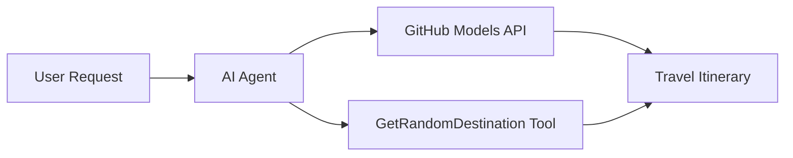

<!--
CO_OP_TRANSLATOR_METADATA:
{
  "original_hash": "5f351412e934f0833c8c821a0a60efaf",
  "translation_date": "2025-11-13T12:24:33+00:00",
  "source_file": "01-intro-to-ai-agents/code_samples/01-dotnet-agent-framework.md",
  "language_code": "tr"
}
-->
# 🌍 Microsoft Agent Framework (.NET) ile AI Seyahat Acentesi

## 📋 Senaryo Özeti

Bu örnek, Microsoft Agent Framework for .NET kullanarak akıllı bir seyahat planlama acentesi oluşturmayı gösterir. Acenta, dünya çapında rastgele destinasyonlar için kişiselleştirilmiş günlük gezi planları otomatik olarak oluşturabilir.

### Temel Özellikler:

- 🎲 **Rastgele Destinasyon Seçimi**: Tatil yerlerini seçmek için özel bir araç kullanır
- 🗺️ **Akıllı Gezi Planlama**: Ayrıntılı günlük planlar oluşturur
- 🔄 **Gerçek Zamanlı Akış**: Hem anlık hem de akış yanıtlarını destekler
- 🛠️ **Özel Araç Entegrasyonu**: Acenta yeteneklerini genişletmeyi gösterir

## 🔧 Teknik Mimari

### Temel Teknolojiler

- **Microsoft Agent Framework**: AI acente geliştirme için en son .NET uygulaması
- **GitHub Modelleri Entegrasyonu**: GitHub'ın AI model çıkarım hizmetini kullanır
- **OpenAI API Uyumluluğu**: Özel uç noktalarla OpenAI istemci kütüphanelerinden yararlanır
- **Güvenli Yapılandırma**: Çevreye dayalı API anahtarı yönetimi

### Ana Bileşenler

1. **AIAgent**: Konuşma akışını yöneten ana acente düzenleyicisi
2. **Özel Araçlar**: Acenta için kullanılabilir `GetRandomDestination()` fonksiyonu
3. **Sohbet İstemcisi**: GitHub Modelleri destekli konuşma arayüzü
4. **Akış Desteği**: Gerçek zamanlı yanıt oluşturma yetenekleri

### Entegrasyon Modeli



## 🚀 Başlarken

### Ön Koşullar

- [.NET 10 SDK](https://dotnet.microsoft.com/download/dotnet/10.0) veya üstü
- [GitHub Modelleri API erişim anahtarı](https://docs.github.com/github-models/github-models-at-scale/using-your-own-api-keys-in-github-models)

### Gerekli Çevre Değişkenleri

```bash
# zsh/bash
export GH_TOKEN=<your_github_token>
export GH_ENDPOINT=https://models.github.ai/inference
export GH_MODEL_ID=openai/gpt-5-mini
```

```powershell
# PowerShell
$env:GH_TOKEN = "<your_github_token>"
$env:GH_ENDPOINT = "https://models.github.ai/inference"
$env:GH_MODEL_ID = "openai/gpt-5-mini"
```

### Örnek Kod

Kod örneğini çalıştırmak için,

```bash
# zsh/bash
chmod +x ./01-dotnet-agent-framework.cs
./01-dotnet-agent-framework.cs
```

Ya da dotnet CLI kullanarak:

```bash
dotnet run ./01-dotnet-agent-framework.cs
```

Tam kod için [`01-dotnet-agent-framework.cs`](../../../../01-intro-to-ai-agents/code_samples/01-dotnet-agent-framework.cs) dosyasına bakın.

```csharp
#!/usr/bin/dotnet run

#:package Microsoft.Extensions.AI@9.*
#:package Microsoft.Agents.AI.OpenAI@1.*-*

using System.ClientModel;
using System.ComponentModel;

using Microsoft.Agents.AI;
using Microsoft.Extensions.AI;

using OpenAI;

// Tool Function: Random Destination Generator
// This static method will be available to the agent as a callable tool
// The [Description] attribute helps the AI understand when to use this function
// This demonstrates how to create custom tools for AI agents
[Description("Provides a random vacation destination.")]
static string GetRandomDestination()
{
    // List of popular vacation destinations around the world
    // The agent will randomly select from these options
    var destinations = new List<string>
    {
        "Paris, France",
        "Tokyo, Japan",
        "New York City, USA",
        "Sydney, Australia",
        "Rome, Italy",
        "Barcelona, Spain",
        "Cape Town, South Africa",
        "Rio de Janeiro, Brazil",
        "Bangkok, Thailand",
        "Vancouver, Canada"
    };

    // Generate random index and return selected destination
    // Uses System.Random for simple random selection
    var random = new Random();
    int index = random.Next(destinations.Count);
    return destinations[index];
}

// Extract configuration from environment variables
// Retrieve the GitHub Models API endpoint, defaults to https://models.github.ai/inference if not specified
// Retrieve the model ID, defaults to openai/gpt-5-mini if not specified
// Retrieve the GitHub token for authentication, throws exception if not specified
var github_endpoint = Environment.GetEnvironmentVariable("GH_ENDPOINT") ?? "https://models.github.ai/inference";
var github_model_id = Environment.GetEnvironmentVariable("GH_MODEL_ID") ?? "openai/gpt-5-mini";
var github_token = Environment.GetEnvironmentVariable("GH_TOKEN") ?? throw new InvalidOperationException("GH_TOKEN is not set.");

// Configure OpenAI Client Options
// Create configuration options to point to GitHub Models endpoint
// This redirects OpenAI client calls to GitHub's model inference service
var openAIOptions = new OpenAIClientOptions()
{
    Endpoint = new Uri(github_endpoint)
};

// Initialize OpenAI Client with GitHub Models Configuration
// Create OpenAI client using GitHub token for authentication
// Configure it to use GitHub Models endpoint instead of OpenAI directly
var openAIClient = new OpenAIClient(new ApiKeyCredential(github_token), openAIOptions);

// Create AI Agent with Travel Planning Capabilities
// Initialize OpenAI client, get chat client for specified model, and create AI agent
// Configure agent with travel planning instructions and random destination tool
// The agent can now plan trips using the GetRandomDestination function
AIAgent agent = openAIClient
    .GetChatClient(github_model_id)
    .CreateAIAgent(
        instructions: "You are a helpful AI Agent that can help plan vacations for customers at random destinations",
        tools: [AIFunctionFactory.Create(GetRandomDestination)]
    );

// Execute Agent: Plan a Day Trip
// Run the agent with streaming enabled for real-time response display
// Shows the agent's thinking and response as it generates the content
// Provides better user experience with immediate feedback
await foreach (var update in agent.RunStreamingAsync("Plan me a day trip"))
{
    await Task.Delay(10);
    Console.Write(update);
}
```

## 🎓 Temel Çıkarımlar

1. **Acenta Mimarisi**: Microsoft Agent Framework, .NET'te AI acentaları oluşturmak için temiz ve tür güvenli bir yaklaşım sunar
2. **Araç Entegrasyonu**: `[Description]` öznitelikleriyle süslenmiş fonksiyonlar acenta için kullanılabilir araçlar haline gelir
3. **Yapılandırma Yönetimi**: Çevre değişkenleri ve güvenli kimlik bilgisi yönetimi .NET en iyi uygulamalarını takip eder
4. **OpenAI Uyumluluğu**: GitHub Modelleri entegrasyonu OpenAI uyumlu API'ler aracılığıyla sorunsuz çalışır

## 🔗 Ek Kaynaklar

- [Microsoft Agent Framework Belgeleri](https://learn.microsoft.com/agent-framework)
- [GitHub Modelleri Pazarı](https://github.com/marketplace?type=models)
- [Microsoft.Extensions.AI](https://learn.microsoft.com/dotnet/ai/microsoft-extensions-ai)
- [.NET Tek Dosya Uygulamaları](https://devblogs.microsoft.com/dotnet/announcing-dotnet-run-app)

---

<!-- CO-OP TRANSLATOR DISCLAIMER START -->
**Feragatname**:  
Bu belge, AI çeviri hizmeti [Co-op Translator](https://github.com/Azure/co-op-translator) kullanılarak çevrilmiştir. Doğruluk için çaba göstersek de, otomatik çevirilerin hata veya yanlışlıklar içerebileceğini lütfen unutmayın. Belgenin orijinal dili, yetkili kaynak olarak kabul edilmelidir. Kritik bilgiler için profesyonel insan çevirisi önerilir. Bu çevirinin kullanımından kaynaklanan yanlış anlamalar veya yanlış yorumlamalardan sorumlu değiliz.
<!-- CO-OP TRANSLATOR DISCLAIMER END -->