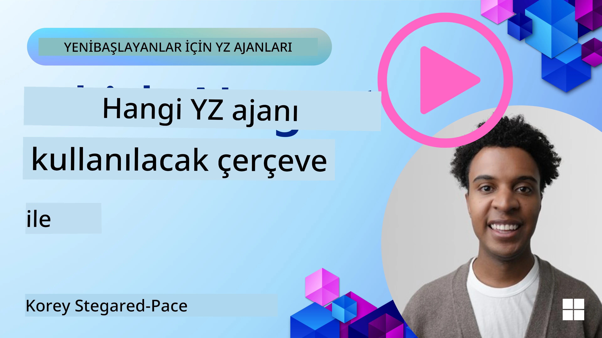

<!--
CO_OP_TRANSLATOR_METADATA:
{
  "original_hash": "7120197753abacc827b64ac2d5d6966f",
  "translation_date": "2025-11-13T12:24:45+00:00",
  "source_file": "02-explore-agentic-frameworks/README.md",
  "language_code": "tr"
}
-->
[](https://youtu.be/ODwF-EZo_O8?si=1xoy_B9RNQfrYdF7)

> _(Bu dersin videosunu izlemek için yukarıdaki görsele tıklayın)_

# AI Aracı Çerçevelerini Keşfetmek

AI aracı çerçeveleri, AI araçlarının oluşturulmasını, dağıtılmasını ve yönetilmesini kolaylaştırmak için tasarlanmış yazılım platformlarıdır. Bu çerçeveler, geliştiricilere karmaşık AI sistemlerinin geliştirilmesini kolaylaştıran önceden oluşturulmuş bileşenler, soyutlamalar ve araçlar sunar.

Bu çerçeveler, AI aracı geliştirmedeki yaygın zorluklara standart yaklaşımlar sağlayarak geliştiricilerin uygulamalarının benzersiz yönlerine odaklanmalarına yardımcı olur. AI sistemleri oluştururken ölçeklenebilirlik, erişilebilirlik ve verimliliği artırırlar.

## Giriş 

Bu derste ele alınacak konular:

- AI Aracı Çerçeveleri nedir ve geliştiricilerin neler başarmasını sağlar?
- Takımlar bu çerçeveleri kullanarak araçlarının yeteneklerini hızlıca nasıl prototipleyebilir, geliştirebilir ve iyileştirebilir?
- Microsoft tarafından oluşturulan <a href="https://aka.ms/ai-agents/autogen" target="_blank">AutoGen</a>, <a href="https://aka.ms/ai-agents-beginners/semantic-kernel" target="_blank">Semantic Kernel</a> ve <a href="https://aka.ms/ai-agents-beginners/ai-agent-service" target="_blank">Azure AI Agent Service</a> çerçeveleri ve araçları arasındaki farklar nelerdir?
- Mevcut Azure ekosistem araçlarımı doğrudan entegre edebilir miyim yoksa bağımsız çözümlere mi ihtiyacım var?
- Azure AI Agents hizmeti nedir ve bana nasıl yardımcı oluyor?

## Öğrenme hedefleri

Bu dersin hedefleri şunları anlamanıza yardımcı olmaktır:

- AI Aracı Çerçevelerinin AI geliştirmedeki rolü.
- AI Aracı Çerçevelerini kullanarak akıllı araçlar oluşturma.
- AI Aracı Çerçevelerinin sağladığı temel yetenekler.
- AutoGen, Semantic Kernel ve Azure AI Agent Service arasındaki farklar.

## AI Aracı Çerçeveleri nedir ve geliştiricilere neler yapma imkanı sağlar?

Geleneksel AI Çerçeveleri, AI'yi uygulamalarınıza entegre etmenize ve bu uygulamaları aşağıdaki şekillerde iyileştirmenize yardımcı olabilir:

- **Kişiselleştirme**: AI, kullanıcı davranışlarını ve tercihlerini analiz ederek kişiselleştirilmiş öneriler, içerikler ve deneyimler sunabilir.
Örnek: Netflix gibi yayın hizmetleri, izleme geçmişine dayalı olarak film ve dizi önerileri sunarak kullanıcı etkileşimini ve memnuniyetini artırır.
- **Otomasyon ve Verimlilik**: AI, tekrarlayan görevleri otomatikleştirebilir, iş akışlarını düzenleyebilir ve operasyonel verimliliği artırabilir.
Örnek: Müşteri hizmeti uygulamaları, yaygın soruları yanıtlamak için AI destekli sohbet botlarını kullanarak yanıt sürelerini kısaltır ve insan temsilcilerin daha karmaşık sorunlara odaklanmasını sağlar.
- **Geliştirilmiş Kullanıcı Deneyimi**: AI, ses tanıma, doğal dil işleme ve tahmin metni gibi akıllı özellikler sunarak genel kullanıcı deneyimini iyileştirebilir.
Örnek: Siri ve Google Assistant gibi sanal asistanlar, sesli komutları anlayıp yanıtlayarak kullanıcıların cihazlarıyla daha kolay etkileşim kurmasını sağlar.

### Bunlar harika görünüyor, peki neden AI Aracı Çerçevesine ihtiyacımız var?

AI Aracı çerçeveleri, yalnızca AI çerçevelerinden daha fazlasını temsil eder. Kullanıcılarla, diğer araçlarla ve çevreyle etkileşim kurarak belirli hedeflere ulaşabilen akıllı araçların oluşturulmasını sağlarlar. Bu araçlar, otonom davranış sergileyebilir, kararlar alabilir ve değişen koşullara uyum sağlayabilir. AI Aracı Çerçevelerinin sağladığı bazı temel yeteneklere bakalım:

- **Araç İşbirliği ve Koordinasyonu**: Birden fazla AI aracının birlikte çalışmasını, iletişim kurmasını ve karmaşık görevleri çözmek için koordinasyon sağlamasını mümkün kılar.
- **Görev Otomasyonu ve Yönetimi**: Çok adımlı iş akışlarını otomatikleştirmek, görevleri devretmek ve araçlar arasında dinamik görev yönetimi için mekanizmalar sağlar.
- **Bağlamsal Anlama ve Uyarlama**: Araçların bağlamı anlamasını, değişen ortamlara uyum sağlamasını ve gerçek zamanlı bilgilere dayanarak kararlar almasını sağlar.

Özetle, araçlar daha fazlasını yapmanıza, otomasyonu bir sonraki seviyeye taşımanıza ve çevresinden öğrenip uyum sağlayabilen daha akıllı sistemler oluşturmanıza olanak tanır.

## Aracın yeteneklerini hızlıca prototiplemek, geliştirmek ve iyileştirmek nasıl mümkün olur?

Bu hızla değişen bir alan, ancak çoğu AI Aracı Çerçevesinde ortak olan bazı şeyler var: modüler bileşenler, işbirlikçi araçlar ve gerçek zamanlı öğrenme. Bunlara daha yakından bakalım:

- **Modüler Bileşenler Kullanma**: AI SDK'ları, AI ve Bellek bağlayıcıları, doğal dil veya kod eklentileri kullanarak işlev çağrısı, istem şablonları ve daha fazlası gibi önceden oluşturulmuş bileşenler sunar.
- **İşbirlikçi Araçlardan Yararlanma**: Belirli rollere ve görevlere sahip araçlar tasarlayarak işbirlikçi iş akışlarını test etmeyi ve iyileştirmeyi mümkün kılar.
- **Gerçek Zamanlı Öğrenme**: Araçların etkileşimlerden öğrenip davranışlarını dinamik olarak ayarladığı geri bildirim döngüleri uygulayın.

### Modüler Bileşenler Kullanma

Microsoft Semantic Kernel ve LangChain gibi SDK'lar, AI bağlayıcıları, istem şablonları ve bellek yönetimi gibi önceden oluşturulmuş bileşenler sunar.

**Takımlar bunları nasıl kullanabilir**: Takımlar, sıfırdan başlamadan işlevsel bir prototip oluşturmak için bu bileşenleri hızla bir araya getirebilir, böylece hızlı deney ve iterasyon yapabilir.

**Pratikte nasıl çalışır**: Kullanıcı girdisinden bilgi çıkarmak için önceden oluşturulmuş bir ayrıştırıcı, veri depolamak ve geri almak için bir bellek modülü ve kullanıcılarla etkileşim kurmak için bir istem oluşturucu kullanabilirsiniz; bunların hepsini sıfırdan oluşturmanıza gerek kalmaz.

**Kod örneği**. Semantic Kernel Python ve .Net ile önceden oluşturulmuş bir AI Bağlayıcı kullanarak modelin kullanıcı girdisine yanıt vermesini sağlayan bir örneğe bakalım:

``` python
# Semantic Kernel Python Example

import asyncio
from typing import Annotated

from semantic_kernel.connectors.ai import FunctionChoiceBehavior
from semantic_kernel.connectors.ai.open_ai import AzureChatCompletion, AzureChatPromptExecutionSettings
from semantic_kernel.contents import ChatHistory
from semantic_kernel.functions import kernel_function
from semantic_kernel.kernel import Kernel

# Define a ChatHistory object to hold the conversation's context
chat_history = ChatHistory()
chat_history.add_user_message("I'd like to go to New York on January 1, 2025")


# Define a sample plugin that contains the function to book travel
class BookTravelPlugin:
    """A Sample Book Travel Plugin"""

    @kernel_function(name="book_flight", description="Book travel given location and date")
    async def book_flight(
        self, date: Annotated[str, "The date of travel"], location: Annotated[str, "The location to travel to"]
    ) -> str:
        return f"Travel was booked to {location} on {date}"

# Create the Kernel
kernel = Kernel()

# Add the sample plugin to the Kernel object
kernel.add_plugin(BookTravelPlugin(), plugin_name="book_travel")

# Define the Azure OpenAI AI Connector
chat_service = AzureChatCompletion(
    deployment_name="YOUR_DEPLOYMENT_NAME", 
    api_key="YOUR_API_KEY", 
    endpoint="https://<your-resource>.azure.openai.com/",
)

# Define the request settings to configure the model with auto-function calling
request_settings = AzureChatPromptExecutionSettings(function_choice_behavior=FunctionChoiceBehavior.Auto())


async def main():
    # Make the request to the model for the given chat history and request settings
    # The Kernel contains the sample that the model will request to invoke
    response = await chat_service.get_chat_message_content(
        chat_history=chat_history, settings=request_settings, kernel=kernel
    )
    assert response is not None

    """
    Note: In the auto function calling process, the model determines it can invoke the 
    `BookTravelPlugin` using the `book_flight` function, supplying the necessary arguments. 
    
    For example:

    "tool_calls": [
        {
            "id": "call_abc123",
            "type": "function",
            "function": {
                "name": "BookTravelPlugin-book_flight",
                "arguments": "{'location': 'New York', 'date': '2025-01-01'}"
            }
        }
    ]

    Since the location and date arguments are required (as defined by the kernel function), if the 
    model lacks either, it will prompt the user to provide them. For instance:

    User: Book me a flight to New York.
    Model: Sure, I'd love to help you book a flight. Could you please specify the date?
    User: I want to travel on January 1, 2025.
    Model: Your flight to New York on January 1, 2025, has been successfully booked. Safe travels!
    """

    print(f"`{response}`")
    # Example AI Model Response: `Your flight to New York on January 1, 2025, has been successfully booked. Safe travels! ✈️🗽`

    # Add the model's response to our chat history context
    chat_history.add_assistant_message(response.content)


if __name__ == "__main__":
    asyncio.run(main())
```
```csharp
// Semantic Kernel C# example

using Microsoft.SemanticKernel;
using Microsoft.SemanticKernel.ChatCompletion;
using System.ComponentModel;
using Microsoft.SemanticKernel.Connectors.AzureOpenAI;

ChatHistory chatHistory = [];
chatHistory.AddUserMessage("I'd like to go to New York on January 1, 2025");

var kernelBuilder = Kernel.CreateBuilder();
kernelBuilder.AddAzureOpenAIChatCompletion(
    deploymentName: "NAME_OF_YOUR_DEPLOYMENT",
    apiKey: "YOUR_API_KEY",
    endpoint: "YOUR_AZURE_ENDPOINT"
);
kernelBuilder.Plugins.AddFromType<BookTravelPlugin>("BookTravel"); 
var kernel = kernelBuilder.Build();

var settings = new AzureOpenAIPromptExecutionSettings()
{
    FunctionChoiceBehavior = FunctionChoiceBehavior.Auto()
};

var chatCompletion = kernel.GetRequiredService<IChatCompletionService>();

var response = await chatCompletion.GetChatMessageContentAsync(chatHistory, settings, kernel);

/*
Behind the scenes, the model recognizes the tool to call, what arguments it already has (location) and (date)
{

"tool_calls": [
    {
        "id": "call_abc123",
        "type": "function",
        "function": {
            "name": "BookTravelPlugin-book_flight",
            "arguments": "{'location': 'New York', 'date': '2025-01-01'}"
        }
    }
]
*/

Console.WriteLine(response.Content);
chatHistory.AddMessage(response!.Role, response!.Content!);

// Example AI Model Response: Your flight to New York on January 1, 2025, has been successfully booked. Safe travels! ✈️🗽

// Define a plugin that contains the function to book travel
public class BookTravelPlugin
{
    [KernelFunction("book_flight")]
    [Description("Book travel given location and date")]
    public async Task<string> BookFlight(DateTime date, string location)
    {
        return await Task.FromResult( $"Travel was booked to {location} on {date}");
    }
}
```

Bu örnekten görebileceğiniz şey, kullanıcı girdisinden uçuş rezervasyon talebinin çıkış noktası, varış noktası ve tarihi gibi önemli bilgileri çıkarmak için önceden oluşturulmuş bir ayrıştırıcıdan nasıl yararlanabileceğinizdir. Bu modüler yaklaşım, yüksek seviyeli mantığa odaklanmanıza olanak tanır.

### İşbirlikçi Araçlardan Yararlanma

CrewAI, Microsoft AutoGen ve Semantic Kernel gibi çerçeveler, birlikte çalışabilen birden fazla araç oluşturmayı kolaylaştırır.

**Takımlar bunları nasıl kullanabilir**: Takımlar, belirli rollere ve görevlere sahip araçlar tasarlayarak işbirlikçi iş akışlarını test etmeyi ve iyileştirmeyi, genel sistem verimliliğini artırmayı mümkün kılar.

**Pratikte nasıl çalışır**: Her bir aracın veri alma, analiz veya karar verme gibi özel bir işlevi olduğu bir araç ekibi oluşturabilirsiniz. Bu araçlar, kullanıcı sorgusuna yanıt vermek veya bir görevi tamamlamak gibi ortak bir hedefe ulaşmak için iletişim kurabilir ve bilgi paylaşabilir.

**Kod örneği (AutoGen)**:

```python
# creating agents, then create a round robin schedule where they can work together, in this case in order

# Data Retrieval Agent
# Data Analysis Agent
# Decision Making Agent

agent_retrieve = AssistantAgent(
    name="dataretrieval",
    model_client=model_client,
    tools=[retrieve_tool],
    system_message="Use tools to solve tasks."
)

agent_analyze = AssistantAgent(
    name="dataanalysis",
    model_client=model_client,
    tools=[analyze_tool],
    system_message="Use tools to solve tasks."
)

# conversation ends when user says "APPROVE"
termination = TextMentionTermination("APPROVE")

user_proxy = UserProxyAgent("user_proxy", input_func=input)

team = RoundRobinGroupChat([agent_retrieve, agent_analyze, user_proxy], termination_condition=termination)

stream = team.run_stream(task="Analyze data", max_turns=10)
# Use asyncio.run(...) when running in a script.
await Console(stream)
```

Önceki kodda, birden fazla aracın veri analizini içeren bir görevi gerçekleştirmek için birlikte çalıştığı bir görev oluşturmanın nasıl mümkün olduğunu görebilirsiniz. Her araç belirli bir işlevi yerine getirir ve görev, istenen sonuca ulaşmak için araçların koordinasyonu ile yürütülür. Özel rollere sahip araçlar oluşturarak görev verimliliğini ve performansını artırabilirsiniz.

### Gerçek Zamanlı Öğrenme

Gelişmiş çerçeveler, gerçek zamanlı bağlam anlama ve uyarlama yetenekleri sağlar.

**Takımlar bunları nasıl kullanabilir**: Takımlar, araçların etkileşimlerden öğrenip davranışlarını dinamik olarak ayarladığı geri bildirim döngüleri uygulayabilir, bu da yeteneklerin sürekli iyileştirilmesine ve geliştirilmesine yol açar.

**Pratikte nasıl çalışır**: Araçlar, kullanıcı geri bildirimlerini, çevresel verileri ve görev sonuçlarını analiz ederek bilgi tabanlarını güncelleyebilir, karar verme algoritmalarını ayarlayabilir ve zamanla performanslarını iyileştirebilir. Bu yinelemeli öğrenme süreci, araçların değişen koşullara ve kullanıcı tercihlerine uyum sağlamasını mümkün kılar, genel sistem etkinliğini artırır.

## AutoGen, Semantic Kernel ve Azure AI Agent Service çerçeveleri arasındaki farklar nelerdir?

Bu çerçeveleri karşılaştırmanın birçok yolu var, ancak tasarım, yetenekler ve hedef kullanım durumları açısından bazı temel farklara bakalım:

## AutoGen

AutoGen, Microsoft Research'ün AI Frontiers Lab tarafından geliştirilen açık kaynaklı bir çerçevedir. Olay odaklı, dağıtılmış *aracı* uygulamalara odaklanır ve birden fazla LLM ve SLM, araçlar ve gelişmiş çoklu araç tasarım desenlerini mümkün kılar.

AutoGen, çevresini algılayabilen, kararlar alabilen ve belirli hedeflere ulaşmak için eylemler gerçekleştirebilen otonom varlıklar olan araçlar temelinde oluşturulmuştur. Araçlar, asenkron mesajlar aracılığıyla iletişim kurar, bu da bağımsız ve paralel çalışarak sistem ölçeklenebilirliğini ve yanıt verebilirliğini artırmalarını sağlar.

<a href="https://en.wikipedia.org/wiki/Actor_model" target="_blank">Araçlar aktör modeli temelinde oluşturulmuştur</a>. Wikipedia'ya göre, bir aktör _eşzamanlı hesaplamanın temel yapı taşıdır. Aldığı bir mesaja yanıt olarak bir aktör şunları yapabilir: yerel kararlar almak, daha fazla aktör oluşturmak, daha fazla mesaj göndermek ve aldığı bir sonraki mesaja nasıl yanıt vereceğini belirlemek_.

**Kullanım Durumları**: Kod üretimini otomatikleştirme, veri analizi görevleri ve planlama ve araştırma işlevleri için özel araçlar oluşturma.

AutoGen'in bazı önemli temel kavramları şunlardır:

- **Araçlar**. Bir araç, şu özelliklere sahip bir yazılım varlığıdır:
  - **Mesajlar aracılığıyla iletişim kurar**, bu mesajlar senkron veya asenkron olabilir.
  - **Kendi durumunu korur**, bu durum gelen mesajlarla değiştirilebilir.
  - **Eylemler gerçekleştirir**, bu eylemler aracın durumunu değiştirebilir ve mesaj günlüklerini güncelleme, yeni mesajlar gönderme, kod yürütme veya API çağrıları yapma gibi dış etkiler üretebilir.

  İşte Sohbet yeteneklerine sahip kendi aracınızı oluşturduğunuz kısa bir kod örneği:

    ```python
    from autogen_agentchat.agents import AssistantAgent
    from autogen_agentchat.messages import TextMessage
    from autogen_ext.models.openai import OpenAIChatCompletionClient


    class MyAgent(RoutedAgent):
        def __init__(self, name: str) -> None:
            super().__init__(name)
            model_client = OpenAIChatCompletionClient(model="gpt-4o")
            self._delegate = AssistantAgent(name, model_client=model_client)
    
        @message_handler
        async def handle_my_message_type(self, message: MyMessageType, ctx: MessageContext) -> None:
            print(f"{self.id.type} received message: {message.content}")
            response = await self._delegate.on_messages(
                [TextMessage(content=message.content, source="user")], ctx.cancellation_token
            )
            print(f"{self.id.type} responded: {response.chat_message.content}")
    ```
    
    Önceki kodda, `MyAgent` oluşturulmuş ve `RoutedAgent` sınıfından türetilmiştir. Mesaj içeriğini yazdıran ve ardından `AssistantAgent` delegesi kullanarak bir yanıt gönderen bir mesaj işleyicisine sahiptir. Özellikle `self._delegate`'e `AssistantAgent` örneği atadığımızı unutmayın; bu, sohbet tamamlama işlemlerini yönetebilen önceden oluşturulmuş bir araçtır.

    AutoGen'e bu araç türü hakkında bilgi verelim ve programı başlatalım:

    ```python
    
    # main.py
    runtime = SingleThreadedAgentRuntime()
    await MyAgent.register(runtime, "my_agent", lambda: MyAgent())

    runtime.start()  # Start processing messages in the background.
    await runtime.send_message(MyMessageType("Hello, World!"), AgentId("my_agent", "default"))
    ```

    Önceki kodda, araçlar çalışma zamanı ile kaydedilir ve ardından araca bir mesaj gönderilir, bu da aşağıdaki çıktıyı üretir:

    ```text
    # Output from the console:
    my_agent received message: Hello, World!
    my_assistant received message: Hello, World!
    my_assistant responded: Hello! How can I assist you today?
    ```

- **Çoklu araçlar**. AutoGen, birden fazla aracın birlikte çalışarak karmaşık görevleri gerçekleştirmesini destekler. Araçlar iletişim kurabilir, bilgi paylaşabilir ve eylemlerini daha verimli bir şekilde koordine edebilir. Çoklu araç sistemi oluşturmak için veri alma, analiz, karar verme ve kullanıcı etkileşimi gibi özel işlevlere ve rollere sahip farklı türde araçlar tanımlayabilirsiniz. Böyle bir oluşturmanın nasıl göründüğüne bir bakalım:

    ```python
    editor_description = "Editor for planning and reviewing the content."

    # Example of declaring an Agent
    editor_agent_type = await EditorAgent.register(
    runtime,
    editor_topic_type,  # Using topic type as the agent type.
    lambda: EditorAgent(
        description=editor_description,
        group_chat_topic_type=group_chat_topic_type,
        model_client=OpenAIChatCompletionClient(
            model="gpt-4o-2024-08-06",
            # api_key="YOUR_API_KEY",
        ),
        ),
    )

    # remaining declarations shortened for brevity

    # Group chat
    group_chat_manager_type = await GroupChatManager.register(
    runtime,
    "group_chat_manager",
    lambda: GroupChatManager(
        participant_topic_types=[writer_topic_type, illustrator_topic_type, editor_topic_type, user_topic_type],
        model_client=OpenAIChatCompletionClient(
            model="gpt-4o-2024-08-06",
            # api_key="YOUR_API_KEY",
        ),
        participant_descriptions=[
            writer_description, 
            illustrator_description, 
            editor_description, 
            user_description
        ],
        ),
    )
    ```

    Önceki kodda, farklı türde araçların etkileşimlerini koordine etmekten sorumlu olan `GroupChatManager` çalışma zamanı ile kaydedilmiştir. Bu yöneticinin yazarlar, illüstratörler, editörler ve kullanıcılar gibi farklı türdeki araçlar arasındaki etkileşimleri koordine etme görevi vardır.

- **Araç Çalışma Zamanı**. Çerçeve, araçlar arasında iletişimi sağlayan, kimliklerini ve yaşam döngülerini yöneten ve güvenlik ve gizlilik sınırlarını uygulayan bir çalışma zamanı ortamı sağlar. Bu, araçlarınızı güvenli ve kontrollü bir ortamda çalıştırmanızı, güvenli ve verimli bir şekilde etkileşim kurmalarını sağlar. İlgili iki çalışma zamanı vardır:
  - **Bağımsız çalışma zamanı**. Tüm araçların aynı programlama dilinde uygulandığı ve aynı süreçte çalıştığı tek süreçli uygulamalar için iyi bir seçimdir. İşte nasıl çalıştığını gösteren bir illüstrasyon:
  
    <a href="https://microsoft.github.io/autogen/stable/_images/architecture-standalone.svg" target="_blank">Bağımsız çalışma zamanı</a>   
Uygulama yığını

    *araçlar çalışma zamanı aracılığıyla mesajlar yoluyla iletişim kurar ve çalışma zamanı araçların yaşam döngüsünü yönetir*

  - **Dağıtılmış araç çalışma zamanı**, araçların farklı programlama dillerinde uygulanabileceği ve farklı makinelerde çalışabileceği çok süreçli uygulamalar için uygundur. İşte nasıl çalıştığını gösteren bir illüstrasyon:
  
    <a href="https://microsoft.github.io/autogen/stable/_images/architecture-distributed.svg" target="_blank">Dağıtılmış çalışma zamanı</a>

## Semantic Kernel + Araç Çerçevesi

Semantic Kernel, kurumsal düzeyde bir AI Orkestrasyon SDK'sıdır. AI ve bellek bağlayıcılarının yanı sıra bir Araç Çerçevesi içerir.

Öncelikle bazı temel bileşenleri ele alalım:

- **AI Bağlayıcıları**: Hem Python hem de C# için harici AI hizmetleri ve veri kaynaklarıyla bir arayüz sağlar.

  ```python
  # Semantic Kernel Python
  from semantic_kernel.connectors.ai.open_ai import AzureChatCompletion
  from semantic_kernel.kernel import Kernel

  kernel = Kernel()
  kernel.add_service(
    AzureChatCompletion(
        deployment_name="your-deployment-name",
        api_key="your-api-key",
        endpoint="your-endpoint",
    )
  )
  ```  

    ```csharp
    // Semantic Kernel C#
    using Microsoft.SemanticKernel;

    // Create kernel
    var builder = Kernel.CreateBuilder();
    
    // Add a chat completion service:
    builder.Services.AddAzureOpenAIChatCompletion(
        "your-resource-name",
        "your-endpoint",
        "your-resource-key",
        "deployment-model");
    var kernel = builder.Build();
    ```

    Burada, bir çekirdek oluşturup bir sohbet tamamlama hizmeti eklemenin basit bir örneğini görüyorsunuz. Semantic Kernel, harici bir AI hizmetine, bu durumda Azure OpenAI Chat Completion'a bir bağlantı oluşturur.

- **Eklentiler**: Uygulamanın kullanabileceği işlevleri kapsar. Hem hazır eklentiler hem de oluşturabileceğiniz özel eklentiler vardır. İlgili bir kavram "istem işlevleri"dir. İşlev çağrısı için doğal dil ipuçları sağlamak yerine, belirli işlevleri modele yayınlarsınız. Mevcut sohbet bağlamına göre model, bir isteği veya sorguyu tamamlamak için bu işlevlerden birini çağırmayı seçebilir. İşte bir örnek:

  ```python
  from semantic_kernel.connectors.ai.open_ai.services.azure_chat_completion import AzureChatCompletion


  async def main():
      from semantic_kernel.functions import KernelFunctionFromPrompt
      from semantic_kernel.kernel import Kernel

      kernel = Kernel()
      kernel.add_service(AzureChatCompletion())

      user_input = input("User Input:> ")

      kernel_function = KernelFunctionFromPrompt(
          function_name="SummarizeText",
          prompt="""
          Summarize the provided unstructured text in a sentence that is easy to understand.
          Text to summarize: {{$user_input}}
          """,
      )

      response = await kernel_function.invoke(kernel=kernel, user_input=user_input)
      print(f"Model Response: {response}")

      """
      Sample Console Output:

      User Input:> I like dogs
      Model Response: The text expresses a preference for dogs.
      """


  if __name__ == "__main__":
    import asyncio
    asyncio.run(main())
  ```

    ```csharp
    var userInput = Console.ReadLine();

    // Define semantic function inline.
    string skPrompt = @"Summarize the provided unstructured text in a sentence that is easy to understand.
                        Text to summarize: {{$userInput}}";
    
    // create the function from the prompt
    KernelFunction summarizeFunc = kernel.CreateFunctionFromPrompt(
        promptTemplate: skPrompt,
        functionName: "SummarizeText"
    );

    //then import into the current kernel
    kernel.ImportPluginFromFunctions("SemanticFunctions", [summarizeFunc]);

    ```

    Burada, önce `$userInput` kullanıcı girdisi için yer bırakan bir şablon istem `skPrompt` oluşturuyorsunuz. Ardından `SummarizeText` çekirdek işlevini oluşturup `SemanticFunctions` eklenti adıyla çekirdeğe aktarıyorsunuz. İşlevin adı, Semantic Kernel'in işlevin ne yaptığını ve ne zaman çağrılması gerektiğini anlamasına yardımcı olur.

- **Yerel işlev**: Çerçeve, görevi yerine getirmek için doğrudan çağırabileceği yerel işlevler de sunar. İşte bir dosyadan içerik alan böyle bir işlevin örneği:

    ```csharp
    public class NativeFunctions {

        [SKFunction, Description("Retrieve content from local file")]
        public async Task<string> RetrieveLocalFile(string fileName, int maxSize = 5000)
        {
            string content = await File.ReadAllTextAsync(fileName);
            if (content.Length <= maxSize) return content;
            return content.Substring(0, maxSize);
        }
    }
    
    //Import native function
    string plugInName = "NativeFunction";
    string functionName = "RetrieveLocalFile";

   //To add the functions to a kernel use the following function
    kernel.ImportPluginFromType<NativeFunctions>();

    ```

- **Bellek**: AI uygulamaları için bağlam yönetimini soyutlar ve basitleştirir. Bellek fikri, bunun LLM'nin bilmesi gereken bir şey olmasıdır. Bu bilgiyi bir vektör deposunda saklayabilirsiniz, bu da bir bellek içi veritabanı veya bir vektör veritabanı veya benzeri bir şey olur. İşte *bilgilerin* belleğe eklendiği çok basitleştirilmiş bir senaryonun örneği:

    ```csharp
    var facts = new Dictionary<string,string>();
    facts.Add(
        "Azure Machine Learning; https://learn.microsoft.com/azure/machine-learning/",
        @"Azure Machine Learning is a cloud service for accelerating and
        managing the machine learning project lifecycle. Machine learning professionals,
        data scientists, and engineers can use it in their day-to-day workflows"
    );
    
    facts.Add(
        "Azure SQL Service; https://learn.microsoft.com/azure/azure-sql/",
        @"Azure SQL is a family of managed, secure, and intelligent products
        that use the SQL Server database engine in the Azure cloud."
    );
    
    string memoryCollectionName = "SummarizedAzureDocs";
    
    foreach (var fact in facts) {
        await memoryBuilder.SaveReferenceAsync(
            collection: memoryCollectionName,
            description: fact.Key.Split(";")[1].Trim(),
            text: fact.Value,
            externalId: fact.Key.Split(";")[2].Trim(),
            externalSourceName: "Azure Documentation"
        );
    }
    ```

Bu bilgiler daha sonra `SummarizedAzureDocs` adlı hafıza koleksiyonunda saklanır. Bu oldukça basitleştirilmiş bir örnek, ancak LLM'nin kullanması için bilgiyi hafızada nasıl saklayabileceğinizi görebilirsiniz.

Semantic Kernel framework'ünün temelleri bu kadar, peki ya Agent Framework?

## Azure AI Agent Hizmeti

Azure AI Agent Hizmeti, Microsoft Ignite 2024'te tanıtılan daha yeni bir eklemedir. Llama 3, Mistral ve Cohere gibi açık kaynaklı LLM'leri doğrudan çağırmak gibi daha esnek modellerle AI ajanları geliştirme ve dağıtma imkanı sunar.

Azure AI Agent Hizmeti, kurumsal uygulamalar için uygun olan daha güçlü güvenlik mekanizmaları ve veri depolama yöntemleri sağlar.

AutoGen ve Semantic Kernel gibi çoklu ajan orkestrasyon framework'leriyle kutudan çıktığı gibi çalışır.

Bu hizmet şu anda Genel Önizleme aşamasındadır ve Python ve C# ile ajanlar oluşturmayı destekler.

Semantic Kernel Python kullanarak, kullanıcı tanımlı bir eklenti ile bir Azure AI Agent oluşturabiliriz:

```python
import asyncio
from typing import Annotated

from azure.identity.aio import DefaultAzureCredential

from semantic_kernel.agents import AzureAIAgent, AzureAIAgentSettings, AzureAIAgentThread
from semantic_kernel.contents import ChatMessageContent
from semantic_kernel.contents import AuthorRole
from semantic_kernel.functions import kernel_function


# Define a sample plugin for the sample
class MenuPlugin:
    """A sample Menu Plugin used for the concept sample."""

    @kernel_function(description="Provides a list of specials from the menu.")
    def get_specials(self) -> Annotated[str, "Returns the specials from the menu."]:
        return """
        Special Soup: Clam Chowder
        Special Salad: Cobb Salad
        Special Drink: Chai Tea
        """

    @kernel_function(description="Provides the price of the requested menu item.")
    def get_item_price(
        self, menu_item: Annotated[str, "The name of the menu item."]
    ) -> Annotated[str, "Returns the price of the menu item."]:
        return "$9.99"


async def main() -> None:
    ai_agent_settings = AzureAIAgentSettings.create()

    async with (
        DefaultAzureCredential() as creds,
        AzureAIAgent.create_client(
            credential=creds,
            conn_str=ai_agent_settings.project_connection_string.get_secret_value(),
        ) as client,
    ):
        # Create agent definition
        agent_definition = await client.agents.create_agent(
            model=ai_agent_settings.model_deployment_name,
            name="Host",
            instructions="Answer questions about the menu.",
        )

        # Create the AzureAI Agent using the defined client and agent definition
        agent = AzureAIAgent(
            client=client,
            definition=agent_definition,
            plugins=[MenuPlugin()],
        )

        # Create a thread to hold the conversation
        # If no thread is provided, a new thread will be
        # created and returned with the initial response
        thread: AzureAIAgentThread | None = None

        user_inputs = [
            "Hello",
            "What is the special soup?",
            "How much does that cost?",
            "Thank you",
        ]

        try:
            for user_input in user_inputs:
                print(f"# User: '{user_input}'")
                # Invoke the agent for the specified thread
                response = await agent.get_response(
                    messages=user_input,
                    thread_id=thread,
                )
                print(f"# {response.name}: {response.content}")
                thread = response.thread
        finally:
            await thread.delete() if thread else None
            await client.agents.delete_agent(agent.id)


if __name__ == "__main__":
    asyncio.run(main())
```

### Temel Kavramlar

Azure AI Agent Hizmeti'nin aşağıdaki temel kavramları vardır:

- **Ajan**. Azure AI Agent Hizmeti, Azure AI Foundry ile entegre çalışır. AI Foundry içinde bir AI Ajanı, soruları yanıtlamak (RAG), eylemleri gerçekleştirmek veya iş akışlarını tamamen otomatikleştirmek için kullanılabilen "akıllı" bir mikro hizmet olarak hareket eder. Bunu, üretken AI modellerinin gücünü gerçek dünya veri kaynaklarına erişim ve etkileşim sağlayan araçlarla birleştirerek başarır. İşte bir ajan örneği:

    ```python
    agent = project_client.agents.create_agent(
        model="gpt-4o-mini",
        name="my-agent",
        instructions="You are helpful agent",
        tools=code_interpreter.definitions,
        tool_resources=code_interpreter.resources,
    )
    ```

    Bu örnekte, `gpt-4o-mini` modeli, `my-agent` adı ve `You are helpful agent` talimatları ile bir ajan oluşturulmuştur. Ajan, kod yorumlama görevlerini gerçekleştirmek için araçlar ve kaynaklarla donatılmıştır.

- **Thread ve mesajlar**. Thread başka bir önemli kavramdır. Bir ajan ile kullanıcı arasındaki bir konuşmayı veya etkileşimi temsil eder. Thread'ler bir konuşmanın ilerlemesini takip etmek, bağlam bilgilerini saklamak ve etkileşimin durumunu yönetmek için kullanılabilir. İşte bir thread örneği:

    ```python
    thread = project_client.agents.create_thread()
    message = project_client.agents.create_message(
        thread_id=thread.id,
        role="user",
        content="Could you please create a bar chart for the operating profit using the following data and provide the file to me? Company A: $1.2 million, Company B: $2.5 million, Company C: $3.0 million, Company D: $1.8 million",
    )
    
    # Ask the agent to perform work on the thread
    run = project_client.agents.create_and_process_run(thread_id=thread.id, agent_id=agent.id)
    
    # Fetch and log all messages to see the agent's response
    messages = project_client.agents.list_messages(thread_id=thread.id)
    print(f"Messages: {messages}")
    ```

    Önceki kodda bir thread oluşturulmuştur. Daha sonra, thread'e bir mesaj gönderilmiştir. `create_and_process_run` çağrılarak, ajandan thread üzerinde çalışma yapması istenmiştir. Son olarak, mesajlar alınır ve ajanın yanıtını görmek için kaydedilir. Mesajlar, kullanıcı ile ajan arasındaki konuşmanın ilerlemesini gösterir. Ayrıca mesajların metin, resim veya dosya gibi farklı türlerde olabileceğini anlamak önemlidir; örneğin ajanın çalışması bir resim veya metin yanıtı ile sonuçlanabilir. Bir geliştirici olarak, bu bilgiyi yanıtı daha fazla işlemek veya kullanıcıya sunmak için kullanabilirsiniz.

- **Diğer AI framework'leriyle entegrasyon**. Azure AI Agent Hizmeti, AutoGen ve Semantic Kernel gibi diğer framework'lerle etkileşim kurabilir, bu da uygulamanızın bir kısmını bu framework'lerden birinde oluşturabileceğiniz ve örneğin Agent hizmetini bir orkestratör olarak kullanabileceğiniz veya her şeyi Agent hizmetinde oluşturabileceğiniz anlamına gelir.

**Kullanım Alanları**: Azure AI Agent Hizmeti, güvenli, ölçeklenebilir ve esnek AI ajan dağıtımı gerektiren kurumsal uygulamalar için tasarlanmıştır.

## Bu framework'ler arasındaki fark nedir?

Bu framework'ler arasında çok fazla örtüşme var gibi görünüyor, ancak tasarım, yetenekler ve hedef kullanım alanları açısından bazı önemli farklılıklar var:

- **AutoGen**: Çoklu ajan sistemleri üzerinde ileri düzey araştırmalar için odaklanmış bir deney framework'üdür. Karmaşık çoklu ajan sistemlerini denemek ve prototip oluşturmak için en iyi yerdir.
- **Semantic Kernel**: Kurumsal ajan uygulamaları oluşturmak için üretime hazır bir ajan kütüphanesidir. Olay odaklı, dağıtılmış ajan uygulamalarına odaklanır ve birden fazla LLM ve SLM, araçlar ve tekli/çoklu ajan tasarım desenlerini etkinleştirir.
- **Azure AI Agent Hizmeti**: Azure Foundry'de ajanlar için bir platform ve dağıtım hizmetidir. Azure OpenAI, Azure AI Search, Bing Search ve kod yürütme gibi Azure Foundry tarafından desteklenen hizmetlere bağlantı kurmayı sağlar.

Hala hangisini seçeceğinizden emin değil misiniz?

### Kullanım Alanları

Bazı yaygın kullanım alanlarını gözden geçirerek size yardımcı olmaya çalışalım:

> S: Deney yapıyorum, öğreniyorum ve kavram kanıtı ajan uygulamaları oluşturuyorum ve hızlı bir şekilde oluşturup denemek istiyorum
>

> C: AutoGen bu senaryo için iyi bir seçim olacaktır, çünkü olay odaklı, dağıtılmış ajan uygulamalarına odaklanır ve gelişmiş çoklu ajan tasarım desenlerini destekler.

> S: AutoGen'i bu kullanım alanı için Semantic Kernel ve Azure AI Agent Hizmeti'nden daha iyi yapan nedir?
>
> C: AutoGen, olay odaklı, dağıtılmış ajan uygulamaları için özel olarak tasarlanmıştır, bu da onu kod üretimi ve veri analizi görevlerini otomatikleştirmek için uygun hale getirir. Karmaşık çoklu ajan sistemlerini verimli bir şekilde oluşturmak için gerekli araçları ve yetenekleri sağlar.

> S: Burada Azure AI Agent Hizmeti de işe yarayabilir gibi görünüyor, kod üretimi ve daha fazlası için araçlara sahip değil mi?
>
> C: Evet, Azure AI Agent Hizmeti bir ajan platform hizmetidir ve birden fazla model, Azure AI Search, Bing Search ve Azure Functions için yerleşik yetenekler ekler. Ajanlarınızı Foundry Portal'da kolayca oluşturup ölçekli bir şekilde dağıtmanızı sağlar.

> S: Hala kafam karışık, bana tek bir seçenek verin
>
> C: Uygulamanızı önce Semantic Kernel'de oluşturmak ve ardından Azure AI Agent Hizmeti'ni kullanarak ajanınızı dağıtmak harika bir seçimdir. Bu yaklaşım, ajanlarınızı kolayca kalıcı hale getirmenizi sağlarken, Semantic Kernel'de çoklu ajan sistemleri oluşturma gücünden yararlanmanızı sağlar. Ayrıca, Semantic Kernel'in AutoGen'de bir bağlayıcısı vardır, bu da her iki framework'ü birlikte kullanmayı kolaylaştırır.

Anahtar farkları bir tabloda özetleyelim:

| Framework | Odak | Temel Kavramlar | Kullanım Alanları |
| --- | --- | --- | --- |
| AutoGen | Olay odaklı, dağıtılmış ajan uygulamaları | Ajanlar, Kişilikler, Fonksiyonlar, Veri | Kod üretimi, veri analizi görevleri |
| Semantic Kernel | İnsan benzeri metin içeriğini anlama ve üretme | Ajanlar, Modüler Bileşenler, İşbirliği | Doğal dil anlama, içerik üretimi |
| Azure AI Agent Hizmeti | Esnek modeller, kurumsal güvenlik, Kod üretimi, Araç çağırma | Modülerlik, İşbirliği, Süreç Orkestrasyonu | Güvenli, ölçeklenebilir ve esnek AI ajan dağıtımı |

Bu framework'lerin ideal kullanım alanları nelerdir?

## Mevcut Azure ekosistem araçlarımı doğrudan entegre edebilir miyim yoksa bağımsız çözümler mi kullanmam gerekiyor?

Cevap evet, mevcut Azure ekosistem araçlarınızı özellikle Azure AI Agent Hizmeti ile doğrudan entegre edebilirsiniz, çünkü diğer Azure hizmetleriyle sorunsuz çalışacak şekilde tasarlanmıştır. Örneğin Bing, Azure AI Search ve Azure Functions'ı entegre edebilirsiniz. Ayrıca Azure AI Foundry ile derin bir entegrasyon vardır.

AutoGen ve Semantic Kernel için de Azure hizmetleriyle entegrasyon yapabilirsiniz, ancak bu, Azure hizmetlerini kodunuzdan çağırmanızı gerektirebilir. Bir diğer entegrasyon yöntemi, ajanlarınızdan Azure hizmetleriyle etkileşim kurmak için Azure SDK'larını kullanmaktır. Ayrıca, bahsedildiği gibi, AutoGen veya Semantic Kernel'de oluşturulan ajanlarınız için bir orkestratör olarak Azure AI Agent Hizmeti'ni kullanabilirsiniz, bu da Azure ekosistemine kolay erişim sağlar.

## Örnek Kodlar

- Python: [Agent Framework](./code_samples/02-python-agent-framework.ipynb)
- .NET: [Agent Framework](./code_samples/02-dotnet-agent-framework.md)

## AI Agent Framework'leri hakkında daha fazla sorunuz mu var?

[Azure AI Foundry Discord](https://aka.ms/ai-agents/discord) kanalına katılarak diğer öğrenicilerle tanışabilir, ofis saatlerine katılabilir ve AI Agent'lar hakkındaki sorularınızı yanıtlayabilirsiniz.

## Referanslar

- <a href="https://techcommunity.microsoft.com/blog/azure-ai-services-blog/introducing-azure-ai-agent-service/4298357" target="_blank">Azure Agent Hizmeti</a>
- <a href="https://devblogs.microsoft.com/semantic-kernel/microsofts-agentic-ai-frameworks-autogen-and-semantic-kernel/" target="_blank">Semantic Kernel ve AutoGen</a>
- <a href="https://learn.microsoft.com/semantic-kernel/frameworks/agent/?pivots=programming-language-python" target="_blank">Semantic Kernel Python Agent Framework</a>
- <a href="https://learn.microsoft.com/semantic-kernel/frameworks/agent/?pivots=programming-language-csharp" target="_blank">Semantic Kernel .Net Agent Framework</a>
- <a href="https://learn.microsoft.com/azure/ai-services/agents/overview" target="_blank">Azure AI Agent Hizmeti</a>
- <a href="https://techcommunity.microsoft.com/blog/educatordeveloperblog/using-azure-ai-agent-service-with-autogen--semantic-kernel-to-build-a-multi-agen/4363121" target="_blank">AutoGen / Semantic Kernel ile Azure AI Agent Hizmeti kullanarak çoklu ajan çözümü oluşturma</a>

## Önceki Ders

[AI Agent'lara Giriş ve Kullanım Alanları](../01-intro-to-ai-agents/README.md)

## Sonraki Ders

[Ajan Tasarım Desenlerini Anlama](../03-agentic-design-patterns/README.md)

---

<!-- CO-OP TRANSLATOR DISCLAIMER START -->
**Feragatname**:  
Bu belge, [Co-op Translator](https://github.com/Azure/co-op-translator) adlı yapay zeka çeviri hizmeti kullanılarak çevrilmiştir. Doğruluk için çaba göstersek de, otomatik çevirilerin hata veya yanlışlıklar içerebileceğini lütfen unutmayın. Belgenin orijinal dilindeki hali yetkili kaynak olarak kabul edilmelidir. Kritik bilgiler için profesyonel insan çevirisi önerilir. Bu çevirinin kullanımından kaynaklanan yanlış anlamalar veya yanlış yorumlamalardan sorumlu değiliz.
<!-- CO-OP TRANSLATOR DISCLAIMER END -->