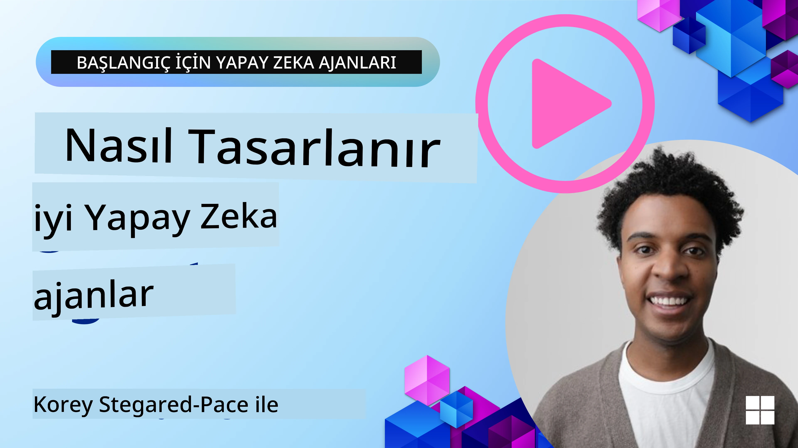
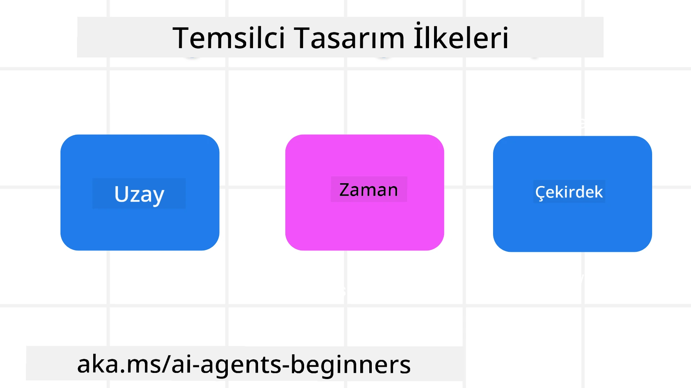

<!--
CO_OP_TRANSLATOR_METADATA:
{
  "original_hash": "d71524fe83a23829ae7a23b4031aaac8",
  "translation_date": "2025-11-13T12:26:50+00:00",
  "source_file": "03-agentic-design-patterns/README.md",
  "language_code": "tr"
}
-->

> _(Bu dersin videosunu izlemek için yukarıdaki görsele tıklayın)_
# AI Ajanik Tasarım İlkeleri

## Giriş

AI Ajanik Sistemleri oluşturmayı düşünmenin birçok yolu vardır. Üretken AI tasarımında belirsizliğin bir hata değil, bir özellik olduğu göz önüne alındığında, mühendislerin nereden başlayacaklarını anlamaları bazen zor olabilir. Geliştiricilerin, iş ihtiyaçlarını çözmek için müşteri odaklı ajanik sistemler oluşturmalarını sağlamak amacıyla insan merkezli bir UX Tasarım İlkeleri seti oluşturduk. Bu tasarım ilkeleri, kesin bir mimari değil, ajan deneyimlerini tanımlayan ve geliştiren ekipler için bir başlangıç noktasıdır.

Genel olarak, ajanlar şunları yapmalıdır:

- İnsan kapasitesini genişletmek ve ölçeklendirmek (beyin fırtınası, problem çözme, otomasyon vb.)
- Bilgi boşluklarını doldurmak (bilgi alanlarında hız kazandırmak, çeviri vb.)
- Bireyler olarak başkalarıyla çalışma tercihlerimize uygun şekilde iş birliğini kolaylaştırmak ve desteklemek
- Bizi daha iyi versiyonlarımız haline getirmek (örneğin, yaşam koçu/görev yöneticisi, duygusal düzenleme ve farkındalık becerilerini öğrenmemize yardımcı olmak, dayanıklılık oluşturmak vb.)

## Bu Derste Ele Alınacaklar

- Ajanik Tasarım İlkeleri nelerdir
- Bu tasarım ilkelerini uygularken izlenecek bazı yönergeler nelerdir
- Tasarım ilkelerinin kullanımına dair bazı örnekler nelerdir

## Öğrenme Hedefleri

Bu dersi tamamladıktan sonra şunları yapabileceksiniz:

1. Ajanik Tasarım İlkelerinin ne olduğunu açıklamak
2. Ajanik Tasarım İlkelerinin kullanımına yönelik yönergeleri açıklamak
3. Ajanik Tasarım İlkelerini kullanarak bir ajan oluşturmayı anlamak

## Ajanik Tasarım İlkeleri

### Ajan (Mekan)

Bu, ajanın çalıştığı ortamdır. Bu ilkeler, ajanların fiziksel ve dijital dünyalarda nasıl tasarlanacağını bilgilendirir.

- **Bağlantı kurmak, çökertmek değil** – insanları diğer insanlara, etkinliklere ve eyleme geçirilebilir bilgilere bağlayarak iş birliğini ve bağlantıyı mümkün kılmak.
  - Ajanlar olayları, bilgileri ve insanları birbirine bağlar.
  - Ajanlar insanları birbirine yakınlaştırır. İnsanların yerini almak veya onları küçümsemek için tasarlanmamıştır.
- **Kolay erişilebilir ama bazen görünmez** – ajan genellikle arka planda çalışır ve yalnızca ilgili ve uygun olduğunda bizi uyarır.
  - Ajan, yetkili kullanıcılar için herhangi bir cihaz veya platformda kolayca keşfedilebilir ve erişilebilir olmalıdır.
  - Ajan, çok modlu giriş ve çıkışları destekler (ses, konuşma, metin vb.).
  - Ajan, kullanıcı ihtiyaçlarını algılamasına bağlı olarak ön plan ve arka plan arasında; proaktif ve reaktif arasında sorunsuz geçiş yapabilir.
  - Ajan görünmez bir formda çalışabilir, ancak arka plan işlem yolu ve diğer Ajanlarla iş birliği kullanıcıya şeffaf ve kontrol edilebilir olmalıdır.

### Ajan (Zaman)

Bu, ajanın zaman içinde nasıl çalıştığını ifade eder. Bu ilkeler, ajanların geçmiş, şimdi ve gelecekte nasıl etkileşimde bulunacağını bilgilendirir.

- **Geçmiş**: Durum ve bağlamı içeren geçmişe yansımak.
  - Ajan, yalnızca olay, insanlar veya durumların ötesinde daha zengin tarihsel verilerin analiziyle daha alakalı sonuçlar sağlar.
  - Ajan, geçmiş olaylardan bağlantılar kurar ve mevcut durumlarla etkileşimde bulunmak için hafızayı aktif olarak yansıtır.
- **Şimdi**: Bildirimden çok yönlendirme.
  - Ajan, insanlarla etkileşimde kapsamlı bir yaklaşımı benimser. Bir olay meydana geldiğinde, Ajan statik bir bildirim veya diğer statik formalitelerin ötesine geçer. Ajan, kullanıcı dikkatini doğru anda yönlendirmek için akışları basitleştirebilir veya dinamik olarak ipuçları oluşturabilir.
  - Ajan, bağlamsal çevreye, sosyal ve kültürel değişimlere dayalı ve kullanıcı niyetine göre uyarlanmış bilgiler sunar.
  - Ajan etkileşimi kademeli olabilir, uzun vadede kullanıcıları güçlendirmek için karmaşıklıkta evrilir/büyür.
- **Gelecek**: Uyum sağlamak ve evrilmek.
  - Ajan, çeşitli cihazlara, platformlara ve modlara uyum sağlar.
  - Ajan, kullanıcı davranışlarına, erişilebilirlik ihtiyaçlarına uyum sağlar ve serbestçe özelleştirilebilir.
  - Ajan, sürekli kullanıcı etkileşimi yoluyla şekillenir ve evrilir.

### Ajan (Çekirdek)

Bunlar, bir ajanın tasarımının temel unsurlarıdır.

- **Belirsizliği kucaklayın ama güven oluşturun**.
  - Belirli bir düzeyde Ajan belirsizliği beklenir. Belirsizlik, ajan tasarımının temel bir unsurudur.
  - Güven ve şeffaflık, Ajan tasarımının temel katmanlarıdır.
  - Ajanın ne zaman açık/kapalı olduğuna insanlar karar verir ve Ajan durumu her zaman açıkça görülebilir.

## Bu İlkeleri Uygulama Yönergeleri

Yukarıdaki tasarım ilkelerini kullanırken şu yönergeleri izleyin:

1. **Şeffaflık**: Kullanıcıya AI'nın dahil olduğunu, nasıl çalıştığını (geçmiş eylemler dahil) ve nasıl geri bildirim verip sistemi değiştirebileceğini bildirin.
2. **Kontrol**: Kullanıcının sistemi ve özelliklerini özelleştirmesine, tercihlerini belirtmesine ve kişiselleştirmesine olanak tanıyın (unutma yeteneği dahil).
3. **Tutarlılık**: Cihazlar ve uç noktalar arasında tutarlı, çok modlu deneyimler hedefleyin. Mümkün olduğunda tanıdık UI/UX öğelerini kullanın (örneğin, sesli etkileşim için mikrofon simgesi) ve müşterinin bilişsel yükünü mümkün olduğunca azaltın (örneğin, özlü yanıtlar, görsel yardımcılar ve 'Daha Fazla Bilgi' içeriği hedefleyin).

## Bu İlkeler ve Yönergeler Kullanılarak Bir Seyahat Ajanı Nasıl Tasarlanır?

Bir Seyahat Ajanı tasarladığınızı hayal edin, işte Tasarım İlkeleri ve Yönergeleri kullanmayı nasıl düşünebileceğiniz:

1. **Şeffaflık** – Kullanıcıya Seyahat Ajanının bir AI destekli Ajan olduğunu bildirin. Başlamak için bazı temel talimatlar sağlayın (örneğin, bir “Merhaba” mesajı, örnek istemler). Bunu ürün sayfasında açıkça belgeleyin. Kullanıcının geçmişte sorduğu istemlerin listesini gösterin. Geri bildirim vermenin nasıl yapılacağını netleştirin (beğenme ve beğenmeme, Geri Bildirim Gönder düğmesi vb.). Ajanın kullanım veya konu kısıtlamaları varsa bunu açıkça ifade edin.
2. **Kontrol** – Kullanıcının, Sistem İstemi gibi şeylerle Ajanı oluşturduktan sonra nasıl değiştirebileceğini netleştirin. Kullanıcının Ajanın ne kadar ayrıntılı olduğunu, yazı stilini ve Ajanın konuşmaması gereken konuları seçmesine olanak tanıyın. Kullanıcının ilişkili dosyaları veya verileri, istemleri ve geçmiş konuşmaları görüntülemesine ve silmesine izin verin.
3. **Tutarlılık** – Paylaş İstemi, bir dosya veya fotoğraf ekleme ve birini veya bir şeyi etiketleme simgelerinin standart ve tanınabilir olduğundan emin olun. Ajan ile dosya yükleme/paylaşımı için ataş simgesini ve grafik yükleme için bir resim simgesini kullanın.

## Örnek Kodlar

- Python: [Ajan Çerçevesi](./code_samples/03-python-agent-framework.ipynb)
- .NET: [Ajan Çerçevesi](./code_samples/03-dotnet-agent-framework.md)

## AI Ajanik Tasarım Modelleri Hakkında Daha Fazla Sorunuz mu Var?

[Azure AI Foundry Discord](https://aka.ms/ai-agents/discord) topluluğuna katılarak diğer öğrenenlerle tanışabilir, ofis saatlerine katılabilir ve AI Ajanları hakkındaki sorularınıza yanıt alabilirsiniz.

## Ek Kaynaklar

- <a href="https://openai.com" target="_blank">Ajanik AI Sistemlerini Yönetme Uygulamaları | OpenAI</a>
- <a href="https://microsoft.com" target="_blank">HAX Toolkit Projesi - Microsoft Araştırma</a>
- <a href="https://responsibleaitoolbox.ai" target="_blank">Sorumlu AI Araç Kutusu</a>

## Önceki Ders

[Ajanik Çerçeveleri Keşfetmek](../02-explore-agentic-frameworks/README.md)

## Sonraki Ders

[Aracın Kullanımı Tasarım Modeli](../04-tool-use/README.md)

---

<!-- CO-OP TRANSLATOR DISCLAIMER START -->
**Feragatname**:  
Bu belge, AI çeviri hizmeti [Co-op Translator](https://github.com/Azure/co-op-translator) kullanılarak çevrilmiştir. Doğruluk için çaba göstersek de, otomatik çevirilerin hata veya yanlışlıklar içerebileceğini lütfen unutmayın. Belgenin orijinal dili, yetkili kaynak olarak kabul edilmelidir. Kritik bilgiler için profesyonel insan çevirisi önerilir. Bu çevirinin kullanımından kaynaklanan yanlış anlama veya yanlış yorumlamalardan sorumlu değiliz.
<!-- CO-OP TRANSLATOR DISCLAIMER END -->