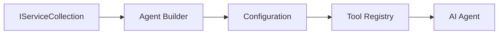

<!--
CO_OP_TRANSLATOR_METADATA:
{
  "original_hash": "bcc874e190347bd6a095aed56dc16de8",
  "translation_date": "2025-11-13T12:27:44+00:00",
  "source_file": "03-agentic-design-patterns/code_samples/03-dotnet-agent-framework.md",
  "language_code": "tr"
}
-->
# 🎨 GitHub Modelleri (.NET) ile Etken Tasarım Kalıpları

## 📋 Öğrenme Hedefleri

Bu örnek, Microsoft Agent Framework'ü .NET ile GitHub Modelleri entegrasyonu kullanarak akıllı ajanlar oluşturmak için kurumsal düzeyde tasarım kalıplarını gösterir. Ajanları üretime hazır, sürdürülebilir ve ölçeklenebilir hale getiren profesyonel kalıpları ve mimari yaklaşımları öğreneceksiniz.

### Kurumsal Tasarım Kalıpları

- 🏭 **Factory Pattern**: Bağımlılık enjeksiyonu ile standartlaştırılmış ajan oluşturma
- 🔧 **Builder Pattern**: Akıcı ajan yapılandırma ve kurulum
- 🧵 **Thread-Safe Patterns**: Eşzamanlı konuşma yönetimi
- 📋 **Repository Pattern**: Düzenli araç ve yetenek yönetimi

## 🎯 .NET'e Özgü Mimari Avantajlar

### Kurumsal Özellikler

- **Güçlü Tipleme**: Derleme zamanı doğrulama ve IntelliSense desteği
- **Bağımlılık Enjeksiyonu**: Dahili DI konteyner entegrasyonu
- **Yapılandırma Yönetimi**: IConfiguration ve Options kalıpları
- **Async/Await**: Birinci sınıf asenkron programlama desteği

### Üretime Hazır Kalıplar

- **Günlük Entegrasyonu**: ILogger ve yapılandırılmış günlük kaydı desteği
- **Sağlık Kontrolleri**: Dahili izleme ve tanılama
- **Yapılandırma Doğrulama**: Veri açıklamaları ile güçlü tipleme
- **Hata Yönetimi**: Yapılandırılmış istisna yönetimi

## 🔧 Teknik Mimari

### Temel .NET Bileşenleri

- **Microsoft.Extensions.AI**: Birleşik AI hizmet soyutlamaları
- **Microsoft.Agents.AI**: Kurumsal ajan orkestrasyon çerçevesi
- **GitHub Modelleri Entegrasyonu**: Yüksek performanslı API istemci kalıpları
- **Yapılandırma Sistemi**: appsettings.json ve ortam entegrasyonu

### Tasarım Kalıbı Uygulaması



## 🏗️ Gösterilen Kurumsal Kalıplar

### 1. **Oluşturma Kalıpları**

- **Agent Factory**: Tutarlı yapılandırma ile merkezi ajan oluşturma
- **Builder Pattern**: Karmaşık ajan yapılandırması için akıcı API
- **Singleton Pattern**: Paylaşılan kaynaklar ve yapılandırma yönetimi
- **Bağımlılık Enjeksiyonu**: Gevşek bağlama ve test edilebilirlik

### 2. **Davranışsal Kalıplar**

- **Strategy Pattern**: Değiştirilebilir araç yürütme stratejileri
- **Command Pattern**: Geri alma/yeniden yapma ile kapsüllenmiş ajan işlemleri
- **Observer Pattern**: Olay odaklı ajan yaşam döngüsü yönetimi
- **Template Method**: Standartlaştırılmış ajan yürütme iş akışları

### 3. **Yapısal Kalıplar**

- **Adapter Pattern**: GitHub Modelleri API entegrasyon katmanı
- **Decorator Pattern**: Ajan yeteneklerini geliştirme
- **Facade Pattern**: Basitleştirilmiş ajan etkileşim arayüzleri
- **Proxy Pattern**: Performans için tembel yükleme ve önbellekleme

## 📚 .NET Tasarım İlkeleri

### SOLID İlkeleri

- **Tek Sorumluluk**: Her bileşenin net bir amacı vardır
- **Açık/Kapalı**: Değiştirilmeden genişletilebilir
- **Liskov Yerine Geçme**: Arayüz tabanlı araç uygulamaları
- **Arayüz Ayrımı**: Odaklanmış, uyumlu arayüzler
- **Bağımlılık Tersine Çevirme**: Somutlamalara değil soyutlamalara bağlılık

### Temiz Mimari

- **Domain Katmanı**: Temel ajan ve araç soyutlamaları
- **Uygulama Katmanı**: Ajan orkestrasyonu ve iş akışları
- **Altyapı Katmanı**: GitHub Modelleri entegrasyonu ve harici hizmetler
- **Sunum Katmanı**: Kullanıcı etkileşimi ve yanıt biçimlendirme

## 🔒 Kurumsal Hususlar

### Güvenlik

- **Kimlik Bilgisi Yönetimi**: IConfiguration ile güvenli API anahtarı işleme
- **Girdi Doğrulama**: Güçlü tipleme ve veri açıklaması doğrulama
- **Çıktı Temizleme**: Güvenli yanıt işleme ve filtreleme
- **Denetim Günlüğü**: Kapsamlı işlem takibi

### Performans

- **Asenkron Kalıplar**: Engellemeyen I/O işlemleri
- **Bağlantı Havuzu**: Verimli HTTP istemci yönetimi
- **Önbellekleme**: Performansı artırmak için yanıt önbellekleme
- **Kaynak Yönetimi**: Uygun imha ve temizlik kalıpları

### Ölçeklenebilirlik

- **İş Parçacığı Güvenliği**: Eşzamanlı ajan yürütme desteği
- **Kaynak Havuzu**: Verimli kaynak kullanımı
- **Yük Yönetimi**: Hız sınırlama ve geri basınç işleme
- **İzleme**: Performans metrikleri ve sağlık kontrolleri

## 🚀 Üretim Dağıtımı

- **Yapılandırma Yönetimi**: Ortama özgü ayarlar
- **Günlük Stratejisi**: Korelasyon kimlikleri ile yapılandırılmış günlük kaydı
- **Hata Yönetimi**: Uygun kurtarma ile genel istisna yönetimi
- **İzleme**: Uygulama içgörüleri ve performans sayaçları
- **Test**: Birim testleri, entegrasyon testleri ve yük testi kalıpları

.NET ile kurumsal düzeyde akıllı ajanlar oluşturmaya hazır mısınız? Hadi sağlam bir şey tasarlayalım! 🏢✨

## 🚀 Başlarken

### Ön Koşullar

- [.NET 10 SDK](https://dotnet.microsoft.com/download/dotnet/10.0) veya daha yüksek
- [GitHub Modelleri API erişim anahtarı](https://docs.github.com/github-models/github-models-at-scale/using-your-own-api-keys-in-github-models)

### Gerekli Ortam Değişkenleri

```bash
# zsh/bash
export GH_TOKEN=<your_github_token>
export GH_ENDPOINT=https://models.github.ai/inference
export GH_MODEL_ID=openai/gpt-5-mini
```

```powershell
# PowerShell
$env:GH_TOKEN = "<your_github_token>"
$env:GH_ENDPOINT = "https://models.github.ai/inference"
$env:GH_MODEL_ID = "openai/gpt-5-mini"
```

### Örnek Kod

Kod örneğini çalıştırmak için,

```bash
# zsh/bash
chmod +x ./03-dotnet-agent-framework.cs
./03-dotnet-agent-framework.cs
```

Ya da dotnet CLI kullanarak:

```bash
dotnet run ./03-dotnet-agent-framework.cs
```

Tam kod için [`03-dotnet-agent-framework.cs`](../../../../03-agentic-design-patterns/code_samples/03-dotnet-agent-framework.cs) dosyasına bakın.

```csharp
#!/usr/bin/dotnet run

#:package Microsoft.Extensions.AI@10.*
#:package Microsoft.Agents.AI.OpenAI@1.*-*

using System.ClientModel;
using System.ComponentModel;

using Microsoft.Agents.AI;
using Microsoft.Extensions.AI;

using OpenAI;

// Tool Function: Random Destination Generator
// This static method will be available to the agent as a callable tool
// The [Description] attribute helps the AI understand when to use this function
// This demonstrates how to create custom tools for AI agents
[Description("Provides a random vacation destination.")]
static string GetRandomDestination()
{
    // List of popular vacation destinations around the world
    // The agent will randomly select from these options
    var destinations = new List<string>
    {
        "Paris, France",
        "Tokyo, Japan",
        "New York City, USA",
        "Sydney, Australia",
        "Rome, Italy",
        "Barcelona, Spain",
        "Cape Town, South Africa",
        "Rio de Janeiro, Brazil",
        "Bangkok, Thailand",
        "Vancouver, Canada"
    };

    // Generate random index and return selected destination
    // Uses System.Random for simple random selection
    var random = new Random();
    int index = random.Next(destinations.Count);
    return destinations[index];
}

// Extract configuration from environment variables
// Retrieve the GitHub Models API endpoint, defaults to https://models.github.ai/inference if not specified
// Retrieve the model ID, defaults to openai/gpt-5-mini if not specified
// Retrieve the GitHub token for authentication, throws exception if not specified
var github_endpoint = Environment.GetEnvironmentVariable("GH_ENDPOINT") ?? "https://models.github.ai/inference";
var github_model_id = Environment.GetEnvironmentVariable("GH_MODEL_ID") ?? "openai/gpt-5-mini";
var github_token = Environment.GetEnvironmentVariable("GH_TOKEN") ?? throw new InvalidOperationException("GH_TOKEN is not set.");

// Configure OpenAI Client Options
// Create configuration options to point to GitHub Models endpoint
// This redirects OpenAI client calls to GitHub's model inference service
var openAIOptions = new OpenAIClientOptions()
{
    Endpoint = new Uri(github_endpoint)
};

// Initialize OpenAI Client with GitHub Models Configuration
// Create OpenAI client using GitHub token for authentication
// Configure it to use GitHub Models endpoint instead of OpenAI directly
var openAIClient = new OpenAIClient(new ApiKeyCredential(github_token), openAIOptions);

// Define Agent Identity and Comprehensive Instructions
// Agent name for identification and logging purposes
var AGENT_NAME = "TravelAgent";

// Detailed instructions that define the agent's personality, capabilities, and behavior
// This system prompt shapes how the agent responds and interacts with users
var AGENT_INSTRUCTIONS = """
You are a helpful AI Agent that can help plan vacations for customers.

Important: When users specify a destination, always plan for that location. Only suggest random destinations when the user hasn't specified a preference.

When the conversation begins, introduce yourself with this message:
"Hello! I'm your TravelAgent assistant. I can help plan vacations and suggest interesting destinations for you. Here are some things you can ask me:
1. Plan a day trip to a specific location
2. Suggest a random vacation destination
3. Find destinations with specific features (beaches, mountains, historical sites, etc.)
4. Plan an alternative trip if you don't like my first suggestion

What kind of trip would you like me to help you plan today?"

Always prioritize user preferences. If they mention a specific destination like "Bali" or "Paris," focus your planning on that location rather than suggesting alternatives.
""";

// Create AI Agent with Advanced Travel Planning Capabilities
// Initialize complete agent pipeline: OpenAI client → Chat client → AI agent
// Configure agent with name, detailed instructions, and available tools
// This demonstrates the .NET agent creation pattern with full configuration
AIAgent agent = openAIClient
    .GetChatClient(github_model_id)
    .CreateAIAgent(
        name: AGENT_NAME,
        instructions: AGENT_INSTRUCTIONS,
        tools: [AIFunctionFactory.Create(GetRandomDestination)]
    );

// Create New Conversation Thread for Context Management
// Initialize a new conversation thread to maintain context across multiple interactions
// Threads enable the agent to remember previous exchanges and maintain conversational state
// This is essential for multi-turn conversations and contextual understanding
AgentThread thread = agent.GetNewThread();

// Execute Agent: First Travel Planning Request
// Run the agent with an initial request that will likely trigger the random destination tool
// The agent will analyze the request, use the GetRandomDestination tool, and create an itinerary
// Using the thread parameter maintains conversation context for subsequent interactions
await foreach (var update in agent.RunStreamingAsync("Plan me a day trip", thread))
{
    await Task.Delay(10);
    Console.Write(update);
}

Console.WriteLine();

// Execute Agent: Follow-up Request with Context Awareness
// Demonstrate contextual conversation by referencing the previous response
// The agent remembers the previous destination suggestion and will provide an alternative
// This showcases the power of conversation threads and contextual understanding in .NET agents
await foreach (var update in agent.RunStreamingAsync("I don't like that destination. Plan me another vacation.", thread))
{
    await Task.Delay(10);
    Console.Write(update);
}
```

---

<!-- CO-OP TRANSLATOR DISCLAIMER START -->
**Feragatname**:  
Bu belge, [Co-op Translator](https://github.com/Azure/co-op-translator) adlı yapay zeka çeviri hizmeti kullanılarak çevrilmiştir. Doğruluk için çaba göstersek de, otomatik çevirilerin hata veya yanlışlıklar içerebileceğini lütfen unutmayın. Belgenin orijinal dilindeki hali yetkili kaynak olarak kabul edilmelidir. Kritik bilgiler için profesyonel insan çevirisi önerilir. Bu çevirinin kullanımından kaynaklanan yanlış anlamalar veya yanlış yorumlamalar için sorumluluk kabul edilmez.
<!-- CO-OP TRANSLATOR DISCLAIMER END -->