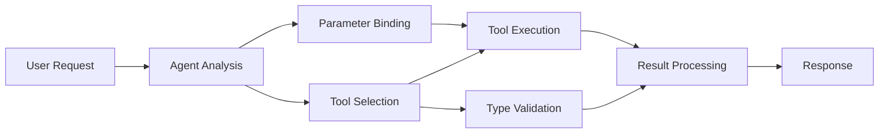

<!--
CO_OP_TRANSLATOR_METADATA:
{
  "original_hash": "91d6061e402489603f2ec8b528cae59b",
  "translation_date": "2025-11-18T17:28:43+00:00",
  "source_file": "04-tool-use/code_samples/04-dotnet-agent-framework.md",
  "language_code": "tr"
}
-->
# 🛠️ GitHub Modelleri ile Gelişmiş Araç Kullanımı (.NET)

## 📋 Öğrenme Hedefleri

Bu not defteri, Microsoft Agent Framework'ü kullanarak GitHub Modelleri ile kurumsal düzeyde araç entegrasyon desenlerini göstermektedir. C#'ın güçlü tip yapısını ve .NET'in kurumsal özelliklerini kullanarak birden fazla özel araca sahip gelişmiş ajanlar oluşturmayı öğreneceksiniz.

### Öğreneceğiniz Gelişmiş Araç Yetkinlikleri

- 🔧 **Çoklu Araç Mimarisi**: Birden fazla özel yeteneğe sahip ajanlar oluşturma
- 🎯 **Tip Güvenli Araç Çalıştırma**: C#'ın derleme zamanı doğrulamasından yararlanma
- 📊 **Kurumsal Araç Desenleri**: Üretime hazır araç tasarımı ve hata yönetimi
- 🔗 **Araç Bileşimi**: Karmaşık iş akışları için araçları birleştirme

## 🎯 .NET Araç Mimarisi Avantajları

### Kurumsal Araç Özellikleri

- **Derleme Zamanı Doğrulama**: Güçlü tip yapısı, araç parametrelerinin doğruluğunu sağlar
- **Bağımlılık Enjeksiyonu**: IoC konteyner entegrasyonu ile araç yönetimi
- **Async/Await Desenleri**: Kaynak yönetimi ile engellemeyen araç çalıştırma
- **Yapılandırılmış Günlükleme**: Araç çalıştırma izleme için yerleşik günlükleme entegrasyonu

### Üretime Hazır Desenler

- **Hata Yönetimi**: Tiplenmiş istisnalarla kapsamlı hata yönetimi
- **Kaynak Yönetimi**: Doğru imha desenleri ve bellek yönetimi
- **Performans İzleme**: Yerleşik metrikler ve performans sayaçları
- **Yapılandırma Yönetimi**: Doğrulama ile tip güvenli yapılandırma

## 🔧 Teknik Mimari

### Temel .NET Araç Bileşenleri

- **Microsoft.Extensions.AI**: Birleşik araç soyutlama katmanı
- **Microsoft.Agents.AI**: Kurumsal düzeyde araç orkestrasyonu
- **GitHub Modelleri Entegrasyonu**: Bağlantı havuzlaması ile yüksek performanslı API istemcisi

### Araç Çalıştırma Boru Hattı



## 🛠️ Araç Kategorileri ve Desenler

### 1. **Veri İşleme Araçları**

- **Girdi Doğrulama**: Veri açıklamaları ile güçlü tip yapısı
- **Dönüşüm İşlemleri**: Tip güvenli veri dönüştürme ve biçimlendirme
- **İş Mantığı**: Alan spesifik hesaplama ve analiz araçları
- **Çıktı Biçimlendirme**: Yapılandırılmış yanıt oluşturma

### 2. **Entegrasyon Araçları**

- **API Bağlayıcıları**: HttpClient ile RESTful servis entegrasyonu
- **Veritabanı Araçları**: Veri erişimi için Entity Framework entegrasyonu
- **Dosya İşlemleri**: Doğrulama ile güvenli dosya sistemi işlemleri
- **Harici Servisler**: Üçüncü taraf servis entegrasyon desenleri

### 3. **Yardımcı Araçlar**

- **Metin İşleme**: Dize manipülasyonu ve biçimlendirme araçları
- **Tarih/Saat İşlemleri**: Kültür duyarlı tarih/saat hesaplamaları
- **Matematiksel Araçlar**: Hassas hesaplamalar ve istatistiksel işlemler
- **Doğrulama Araçları**: İş kurallarının doğrulanması ve veri kontrolü

Kurumsal düzeyde ajanlar oluşturmak için güçlü, tip güvenli araç yetenekleriyle .NET'te profesyonel çözümler tasarlamaya hazır mısınız? 🏢⚡

## 🚀 Başlarken

### Ön Koşullar

- [.NET 10 SDK](https://dotnet.microsoft.com/download/dotnet/10.0) veya daha yüksek
- [GitHub Modelleri API erişim tokeni](https://docs.github.com/github-models/github-models-at-scale/using-your-own-api-keys-in-github-models)

### Gerekli Ortam Değişkenleri

```bash
# zsh/bash
export GH_TOKEN=<your_github_token>
export GH_ENDPOINT=https://models.github.ai/inference
export GH_MODEL_ID=openai/gpt-5-mini
```

```powershell
# PowerShell
$env:GH_TOKEN = "<your_github_token>"
$env:GH_ENDPOINT = "https://models.github.ai/inference"
$env:GH_MODEL_ID = "openai/gpt-5-mini"
```

### Örnek Kod

Kod örneğini çalıştırmak için,

```bash
# zsh/bash
chmod +x ./04-dotnet-agent-framework.cs
./04-dotnet-agent-framework.cs
```

Ya da dotnet CLI kullanarak:

```bash
dotnet run ./04-dotnet-agent-framework.cs
```

Tam kod için [`04-dotnet-agent-framework.cs`](../../../../04-tool-use/code_samples/04-dotnet-agent-framework.cs) dosyasına bakın.

```csharp
#!/usr/bin/dotnet run

#:package Microsoft.Extensions.AI@10.*
#:package Microsoft.Agents.AI.OpenAI@1.*-*

using System.ClientModel;
using System.ComponentModel;

using Microsoft.Agents.AI;
using Microsoft.Extensions.AI;

using OpenAI;

// Tool Function: Random Destination Generator
// This static method will be available to the agent as a callable tool
// The [Description] attribute helps the AI understand when to use this function
// This demonstrates how to create custom tools for AI agents
[Description("Provides a random vacation destination.")]
static string GetRandomDestination()
{
    // List of popular vacation destinations around the world
    // The agent will randomly select from these options
    var destinations = new List<string>
    {
        "Paris, France",
        "Tokyo, Japan",
        "New York City, USA",
        "Sydney, Australia",
        "Rome, Italy",
        "Barcelona, Spain",
        "Cape Town, South Africa",
        "Rio de Janeiro, Brazil",
        "Bangkok, Thailand",
        "Vancouver, Canada"
    };

    // Generate random index and return selected destination
    // Uses System.Random for simple random selection
    var random = new Random();
    int index = random.Next(destinations.Count);
    return destinations[index];
}

// Extract configuration from environment variables
// Retrieve the GitHub Models API endpoint, defaults to https://models.github.ai/inference if not specified
// Retrieve the model ID, defaults to openai/gpt-5-mini if not specified
// Retrieve the GitHub token for authentication, throws exception if not specified
var github_endpoint = Environment.GetEnvironmentVariable("GH_ENDPOINT") ?? "https://models.github.ai/inference";
var github_model_id = Environment.GetEnvironmentVariable("GH_MODEL_ID") ?? "openai/gpt-5-mini";
var github_token = Environment.GetEnvironmentVariable("GH_TOKEN") ?? throw new InvalidOperationException("GH_TOKEN is not set.");

// Configure OpenAI Client Options
// Create configuration options to point to GitHub Models endpoint
// This redirects OpenAI client calls to GitHub's model inference service
var openAIOptions = new OpenAIClientOptions()
{
    Endpoint = new Uri(github_endpoint)
};

// Initialize OpenAI Client with GitHub Models Configuration
// Create OpenAI client using GitHub token for authentication
// Configure it to use GitHub Models endpoint instead of OpenAI directly
var openAIClient = new OpenAIClient(new ApiKeyCredential(github_token), openAIOptions);

// Define Agent Identity and Comprehensive Instructions
// Agent name for identification and logging purposes
var AGENT_NAME = "TravelAgent";

// Detailed instructions that define the agent's personality, capabilities, and behavior
// This system prompt shapes how the agent responds and interacts with users
var AGENT_INSTRUCTIONS = """
You are a helpful AI Agent that can help plan vacations for customers.

Important: When users specify a destination, always plan for that location. Only suggest random destinations when the user hasn't specified a preference.

When the conversation begins, introduce yourself with this message:
"Hello! I'm your TravelAgent assistant. I can help plan vacations and suggest interesting destinations for you. Here are some things you can ask me:
1. Plan a day trip to a specific location
2. Suggest a random vacation destination
3. Find destinations with specific features (beaches, mountains, historical sites, etc.)
4. Plan an alternative trip if you don't like my first suggestion

What kind of trip would you like me to help you plan today?"

Always prioritize user preferences. If they mention a specific destination like "Bali" or "Paris," focus your planning on that location rather than suggesting alternatives.
""";

// Create AI Agent with Advanced Travel Planning Capabilities
// Initialize complete agent pipeline: OpenAI client → Chat client → AI agent
// Configure agent with name, detailed instructions, and available tools
// This demonstrates the .NET agent creation pattern with full configuration
AIAgent agent = openAIClient
    .GetChatClient(github_model_id)
    .CreateAIAgent(
        name: AGENT_NAME,
        instructions: AGENT_INSTRUCTIONS,
        tools: [AIFunctionFactory.Create(GetRandomDestination)]
    );

// Create New Conversation Thread for Context Management
// Initialize a new conversation thread to maintain context across multiple interactions
// Threads enable the agent to remember previous exchanges and maintain conversational state
// This is essential for multi-turn conversations and contextual understanding
AgentThread thread = agent.GetNewThread();

// Execute Agent: First Travel Planning Request
// Run the agent with an initial request that will likely trigger the random destination tool
// The agent will analyze the request, use the GetRandomDestination tool, and create an itinerary
// Using the thread parameter maintains conversation context for subsequent interactions
await foreach (var update in agent.RunStreamingAsync("Plan me a day trip", thread))
{
    await Task.Delay(10);
    Console.Write(update);
}

Console.WriteLine();

// Execute Agent: Follow-up Request with Context Awareness
// Demonstrate contextual conversation by referencing the previous response
// The agent remembers the previous destination suggestion and will provide an alternative
// This showcases the power of conversation threads and contextual understanding in .NET agents
await foreach (var update in agent.RunStreamingAsync("I don't like that destination. Plan me another vacation.", thread))
{
    await Task.Delay(10);
    Console.Write(update);
}
```

---

<!-- CO-OP TRANSLATOR DISCLAIMER START -->
**Feragatname**:  
Bu belge, [Co-op Translator](https://github.com/Azure/co-op-translator) adlı yapay zeka çeviri hizmeti kullanılarak çevrilmiştir. Doğruluk için çaba göstersek de, otomatik çevirilerin hata veya yanlışlıklar içerebileceğini lütfen unutmayın. Belgenin orijinal dili, yetkili kaynak olarak kabul edilmelidir. Kritik bilgiler için profesyonel insan çevirisi önerilir. Bu çevirinin kullanımından kaynaklanan yanlış anlamalar veya yanlış yorumlamalar için sorumluluk kabul edilmez.
<!-- CO-OP TRANSLATOR DISCLAIMER END -->