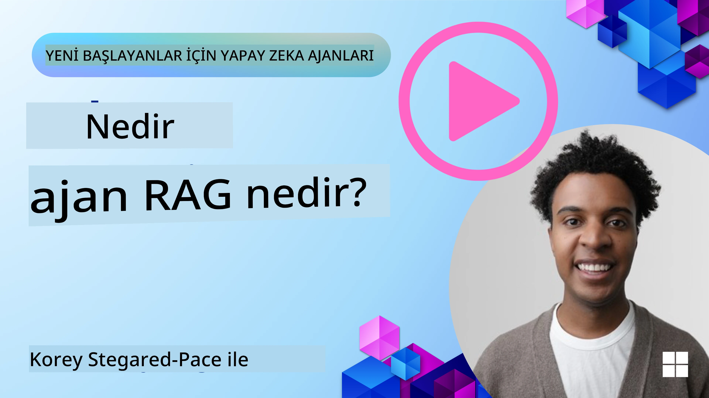
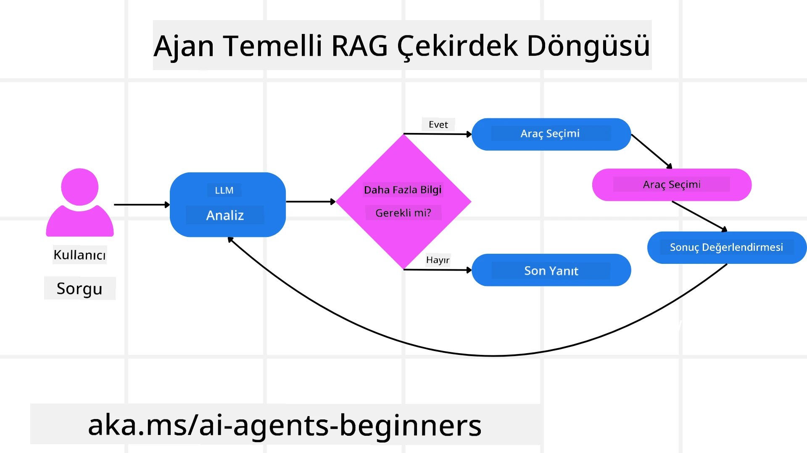
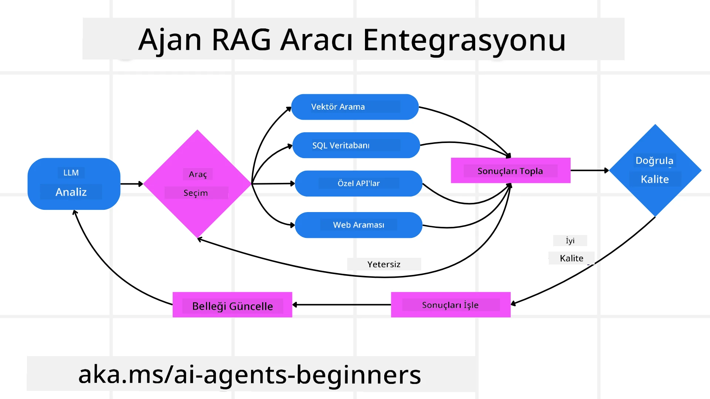
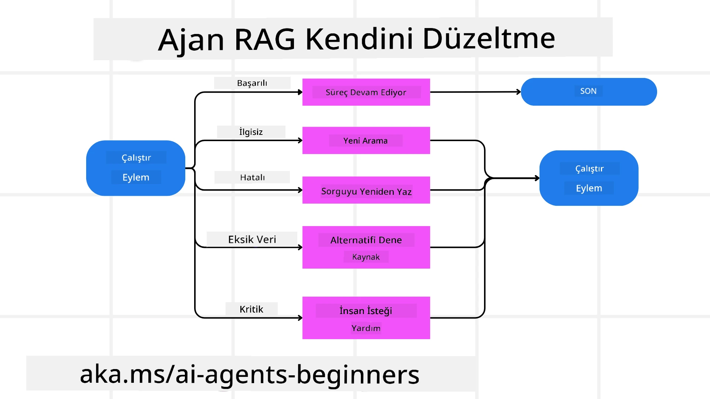
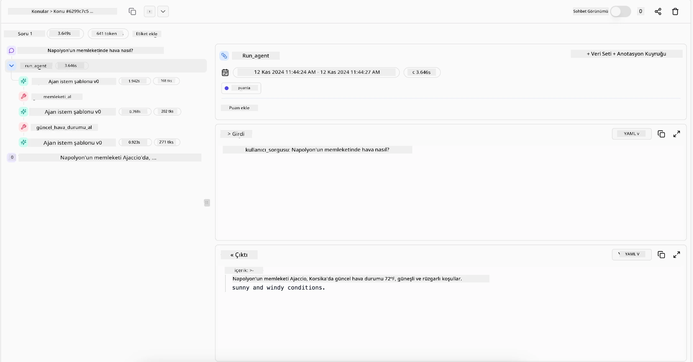

<!--
CO_OP_TRANSLATOR_METADATA:
{
  "original_hash": "0ebf6b2290db55dbf2d10cc49655523b",
  "translation_date": "2025-09-30T07:02:16+00:00",
  "source_file": "05-agentic-rag/README.md",
  "language_code": "tr"
}
-->

> _(Bu dersin videosunu izlemek için yukarıdaki görsele tıklayın)_

# Agentic RAG

Bu ders, Agentic Retrieval-Augmented Generation (Agentic RAG) hakkında kapsamlı bir genel bakış sunar. Bu, büyük dil modellerinin (LLM'ler) dış kaynaklardan bilgi çekerken bir sonraki adımlarını bağımsız olarak planladığı yeni bir yapay zeka paradigmasıdır. Statik "bilgi çekme ve okuma" modellerinden farklı olarak, Agentic RAG, araç veya fonksiyon çağrıları ve yapılandırılmış çıktılarla kesintiye uğrayan yinelemeli LLM çağrılarını içerir. Sistem sonuçları değerlendirir, sorguları iyileştirir, gerekirse ek araçlar kullanır ve tatmin edici bir çözüme ulaşana kadar bu döngüyü sürdürür.

## Giriş

Bu derste şunlar ele alınacak:

- **Agentic RAG'ı Anlamak:** Büyük dil modellerinin (LLM'ler) dış veri kaynaklarından bilgi çekerken bir sonraki adımlarını bağımsız olarak planladığı yeni yapay zeka paradigmasını öğrenin.
- **Yinelemeli Maker-Checker Tarzını Kavramak:** Doğruluğu artırmak ve hatalı sorguları ele almak için tasarlanmış, araç veya fonksiyon çağrıları ve yapılandırılmış çıktılarla kesintiye uğrayan yinelemeli LLM çağrıları döngüsünü anlayın.
- **Pratik Uygulamaları Keşfetmek:** Agentic RAG'ın doğruluk odaklı ortamlar, karmaşık veri tabanı etkileşimleri ve uzun süreçlerde nasıl öne çıktığını belirleyin.

## Öğrenme Hedefleri

Bu dersi tamamladıktan sonra şunları öğreneceksiniz:

- **Agentic RAG'ı Anlamak:** Büyük dil modellerinin (LLM'ler) dış veri kaynaklarından bilgi çekerken bir sonraki adımlarını bağımsız olarak planladığı yeni yapay zeka paradigmasını öğrenin.
- **Yinelemeli Maker-Checker Tarzı:** Doğruluğu artırmak ve hatalı sorguları ele almak için tasarlanmış, araç veya fonksiyon çağrıları ve yapılandırılmış çıktılarla kesintiye uğrayan yinelemeli LLM çağrıları döngüsünü kavrayın.
- **Akıl Yürütme Sürecine Sahip Olmak:** Sistemin, önceden tanımlanmış yollar olmadan sorunlara nasıl yaklaşacağına karar verme yeteneğini anlayın.
- **İş Akışı:** Agentic modelin bağımsız olarak piyasa trend raporlarını çekme, rakip verilerini belirleme, iç satış metriklerini ilişkilendirme, bulguları sentezleme ve stratejiyi değerlendirme kararlarını nasıl verdiğini öğrenin.
- **Yinelemeli Döngüler, Araç Entegrasyonu ve Bellek:** Sistemin, tekrarlayan döngülerden kaçınmak ve bilinçli kararlar almak için adımlar arasında durumu ve belleği koruyan döngüsel etkileşim modeline nasıl güvendiğini öğrenin.
- **Hata Modlarını Yönetme ve Kendini Düzeltme:** Tanı araçlarını kullanma, yeniden sorgulama ve insan denetimine başvurma gibi sistemin sağlam kendini düzeltme mekanizmalarını keşfedin.
- **Ajansın Sınırları:** Alan spesifik özerklik, altyapı bağımlılığı ve güvenlik önlemlerine saygı odaklı Agentic RAG'ın sınırlamalarını anlayın.
- **Pratik Kullanım Alanları ve Değer:** Agentic RAG'ın doğruluk odaklı ortamlar, karmaşık veri tabanı etkileşimleri ve uzun süreçlerde nasıl öne çıktığını belirleyin.
- **Yönetim, Şeffaflık ve Güven:** Açıklanabilir akıl yürütme, önyargı kontrolü ve insan denetimi dahil olmak üzere yönetim ve şeffaflığın önemini öğrenin.

## Agentic RAG Nedir?

Agentic Retrieval-Augmented Generation (Agentic RAG), büyük dil modellerinin (LLM'ler) dış kaynaklardan bilgi çekerken bir sonraki adımlarını bağımsız olarak planladığı yeni bir yapay zeka paradigmasıdır. Statik "bilgi çekme ve okuma" modellerinden farklı olarak, Agentic RAG, araç veya fonksiyon çağrıları ve yapılandırılmış çıktılarla kesintiye uğrayan yinelemeli LLM çağrılarını içerir. Sistem sonuçları değerlendirir, sorguları iyileştirir, gerekirse ek araçlar kullanır ve tatmin edici bir çözüme ulaşana kadar bu döngüyü sürdürür. Bu yinelemeli “maker-checker” tarzı doğruluğu artırır, hatalı sorguları ele alır ve yüksek kaliteli sonuçlar sağlar.

Sistem, başarısız sorguları yeniden yazar, farklı bilgi çekme yöntemleri seçer ve yanıtını tamamlamadan önce Azure AI Search'teki vektör arama, SQL veri tabanları veya özel API'ler gibi birden fazla aracı entegre eder. Agentic bir sistemin ayırt edici özelliği, akıl yürütme sürecine sahip olma yeteneğidir. Geleneksel RAG uygulamaları önceden tanımlanmış yolları kullanırken, agentic bir sistem, bulduğu bilginin kalitesine dayanarak adımların sırasını bağımsız olarak belirler.

## Agentic Retrieval-Augmented Generation (Agentic RAG) Tanımı

Agentic Retrieval-Augmented Generation (Agentic RAG), büyük dil modellerinin (LLM'ler) dış veri kaynaklarından bilgi çekmekle kalmayıp bir sonraki adımlarını bağımsız olarak planladığı yeni bir yapay zeka geliştirme paradigmasıdır. Statik "bilgi çekme ve okuma" modellerinden veya dikkatlice yazılmış istem dizilerinden farklı olarak, Agentic RAG, araç veya fonksiyon çağrıları ve yapılandırılmış çıktılarla kesintiye uğrayan yinelemeli LLM çağrıları döngüsünü içerir. Her adımda, sistem elde ettiği sonuçları değerlendirir, sorgularını iyileştirip iyileştirmeyeceğine karar verir, gerekirse ek araçlar kullanır ve tatmin edici bir çözüme ulaşana kadar bu döngüyü sürdürür.

Bu yinelemeli “maker-checker” çalışma tarzı, doğruluğu artırmak, yapılandırılmış veri tabanlarına (ör. NL2SQL) yönelik hatalı sorguları ele almak ve dengeli, yüksek kaliteli sonuçlar sağlamak için tasarlanmıştır. Sadece dikkatlice tasarlanmış istem zincirlerine güvenmek yerine, sistem akıl yürütme sürecine aktif olarak sahip olur. Başarısız olan sorguları yeniden yazabilir, farklı bilgi çekme yöntemleri seçebilir ve yanıtını tamamlamadan önce Azure AI Search'teki vektör arama, SQL veri tabanları veya özel API'ler gibi birden fazla aracı entegre edebilir. Bu, aşırı karmaşık orkestrasyon çerçevelerine olan ihtiyacı ortadan kaldırır. Bunun yerine, nispeten basit bir “LLM çağrısı → araç kullanımı → LLM çağrısı → …” döngüsü, sofistike ve iyi temellendirilmiş çıktılar sağlayabilir.

## Akıl Yürütme Sürecine Sahip Olmak

Bir sistemi “agentic” yapan ayırt edici özellik, akıl yürütme sürecine sahip olma yeteneğidir. Geleneksel RAG uygulamaları genellikle model için bir yol önceden tanımlayan insanlara bağlıdır: ne zaman neyin çekileceğini ve nasıl yapılacağını belirten bir düşünce zinciri.
Ancak bir sistem gerçekten agentic olduğunda, soruna nasıl yaklaşacağına içsel olarak karar verir. Sadece bir senaryoyu yürütmekle kalmaz; bulduğu bilginin kalitesine dayanarak adımların sırasını bağımsız olarak belirler.
Örneğin, bir ürün lansman stratejisi oluşturması istendiğinde, tüm araştırma ve karar verme iş akışını açıklayan bir isteme tamamen güvenmez. Bunun yerine, agentic model bağımsız olarak şu kararları verir:

1. Bing Web Grounding kullanarak mevcut piyasa trend raporlarını çeker.
2. Azure AI Search kullanarak ilgili rakip verilerini belirler.
3. Azure SQL Database kullanarak geçmiş iç satış metriklerini ilişkilendirir.
4. Azure OpenAI Service aracılığıyla bulguları uyumlu bir stratejiye sentezler.
5. Stratejiyi boşluklar veya tutarsızlıklar açısından değerlendirir ve gerekirse başka bir bilgi çekme turunu başlatır.
Tüm bu adımlar—sorguları iyileştirme, kaynakları seçme, yanıtından “memnun” olana kadar yineleme—model tarafından belirlenir, bir insan tarafından önceden yazılmaz.

## Yinelemeli Döngüler, Araç Entegrasyonu ve Bellek

Agentic bir sistem, döngüsel bir etkileşim modeline dayanır:

- **İlk Çağrı:** Kullanıcının hedefi (kullanıcı istemi) LLM'ye sunulur.
- **Araç Kullanımı:** Model, eksik bilgi veya belirsiz talimatlar tespit ederse, daha fazla bağlam toplamak için bir araç veya bilgi çekme yöntemi seçer—örneğin, bir vektör veri tabanı sorgusu (ör. Azure AI Search Hybrid arama özel veriler üzerinde) veya yapılandırılmış bir SQL çağrısı.
- **Değerlendirme ve İyileştirme:** Dönen veriyi gözden geçirdikten sonra, model bilginin yeterli olup olmadığına karar verir. Eğer değilse, sorguyu iyileştirir, farklı bir araç dener veya yaklaşımını ayarlar.
- **Tatmin Olana Kadar Tekrarla:** Bu döngü, model yeterli netlik ve kanıta sahip olduğunu düşündüğü ve nihai, iyi temellendirilmiş bir yanıt sunabileceği ana kadar devam eder.
- **Bellek ve Durum:** Sistem adımlar arasında durumu ve belleği koruduğu için, önceki girişimleri ve sonuçlarını hatırlayabilir, tekrarlayan döngülerden kaçınabilir ve ilerledikçe daha bilinçli kararlar alabilir.

Zamanla, bu, modelin karmaşık, çok adımlı görevleri insanın sürekli müdahale etmesine veya istemi yeniden şekillendirmesine gerek kalmadan yönlendirmesini sağlayan bir gelişen anlayış hissi yaratır.

## Hata Modlarını Yönetme ve Kendini Düzeltme

Agentic RAG’ın özerkliği, aynı zamanda sağlam kendini düzeltme mekanizmalarını da içerir. Sistem çıkmazlara ulaştığında—örneğin, alakasız belgeler çektiğinde veya hatalı sorgularla karşılaştığında—şunları yapabilir:

- **Yineleme ve Yeniden Sorgulama:** Düşük değerli yanıtlar döndürmek yerine, model yeni arama stratejileri dener, veri tabanı sorgularını yeniden yazar veya alternatif veri setlerine bakar.
- **Tanı Araçlarını Kullanma:** Sistem, akıl yürütme adımlarını hata ayıklamasına veya çekilen verilerin doğruluğunu doğrulamasına yardımcı olmak için ek işlevler çağırabilir. Azure AI Tracing gibi araçlar, sağlam gözlemlenebilirlik ve izleme sağlamak için önemli olacaktır.
- **İnsan Denetimine Başvurma:** Yüksek riskli veya tekrar eden başarısız senaryolar için model belirsizliği işaretleyebilir ve insan rehberliği talep edebilir. İnsan düzeltici geri bildirim sağladıktan sonra, model bu dersi ileriye dönük olarak dahil edebilir.

Bu yinelemeli ve dinamik yaklaşım, modelin sürekli olarak gelişmesini sağlar, sadece tek seferlik bir sistem değil, verilen bir oturum sırasında hatalarından öğrenen bir sistem olmasını sağlar.

## Ajansın Sınırları

Bir görev içindeki özerkliğine rağmen, Agentic RAG, Yapay Genel Zeka ile eşdeğer değildir. “Agentic” yetenekleri, insan geliştiriciler tarafından sağlanan araçlar, veri kaynakları ve politikalara bağlıdır. Kendi araçlarını icat edemez veya belirlenen alan sınırlarının dışına çıkamaz. Bunun yerine, mevcut kaynakları dinamik bir şekilde düzenlemede mükemmeldir.
Daha gelişmiş yapay zeka formlarından temel farklılıklar şunları içerir:

1. **Alan-Specifik Özerklik:** Agentic RAG sistemleri, kullanıcı tanımlı hedeflere bilinen bir alan içinde ulaşmaya odaklanır ve sorgu yeniden yazma veya araç seçimi gibi stratejiler kullanarak sonuçları iyileştirir.
2. **Altyapıya Bağımlılık:** Sistemin yetenekleri, geliştiriciler tarafından entegre edilen araçlara ve verilere bağlıdır. İnsan müdahalesi olmadan bu sınırları aşamaz.
3. **Güvenlik Önlemlerine Saygı:** Etik yönergeler, uyumluluk kuralları ve iş politikaları çok önemlidir. Ajansın özgürlüğü her zaman güvenlik önlemleri ve denetim mekanizmaları ile sınırlıdır (umarız?).

## Pratik Kullanım Alanları ve Değer

Agentic RAG, yinelemeli iyileştirme ve hassasiyet gerektiren senaryolarda öne çıkar:

1. **Doğruluk Odaklı Ortamlar:** Uyumluluk kontrolleri, düzenleyici analiz veya hukuki araştırmalarda, agentic model gerçekleri tekrar tekrar doğrulayabilir, birden fazla kaynağa danışabilir ve tamamen doğrulanmış bir yanıt üretene kadar sorguları yeniden yazabilir.
2. **Karmaşık Veri Tabanı Etkileşimleri:** Sorguların sık sık başarısız olabileceği veya ayarlama gerektirebileceği yapılandırılmış verilerle çalışırken, sistem Azure SQL veya Microsoft Fabric OneLake kullanarak sorgularını bağımsız olarak iyileştirebilir ve nihai bilgi çekme işleminin kullanıcının niyetiyle uyumlu olmasını sağlar.
3. **Uzun Süreçler:** Yeni bilgiler ortaya çıktıkça uzun süreli oturumlar gelişebilir. Agentic RAG, sürekli olarak yeni verileri dahil edebilir ve problem alanı hakkında daha fazla bilgi edindikçe stratejilerini değiştirebilir.

## Yönetim, Şeffaflık ve Güven

Bu sistemler akıl yürütmede daha özerk hale geldikçe, yönetim ve şeffaflık çok önemlidir:

- **Açıklanabilir Akıl Yürütme:** Model, yaptığı sorguların, danıştığı kaynakların ve sonuca ulaşmak için attığı akıl yürütme adımlarının bir denetim izini sağlayabilir. Azure AI Content Safety ve Azure AI Tracing / GenAIOps gibi araçlar, şeffaflığı korumaya ve riskleri azaltmaya yardımcı olabilir.
- **Önyargı Kontrolü ve Dengeli Bilgi Çekme:** Geliştiriciler, dengeli ve temsilci veri kaynaklarının dikkate alınmasını sağlamak için bilgi çekme stratejilerini ayarlayabilir ve çıktıları düzenli olarak denetleyerek önyargı veya eğilimleri tespit edebilir. Bu, Azure Machine Learning kullanan gelişmiş veri bilimi organizasyonları için özel modellerle yapılabilir.
- **İnsan Denetimi ve Uyumluluk:** Hassas görevler için insan incelemesi hala gereklidir. Agentic RAG, yüksek riskli kararlarda insan yargısının yerini almaz—daha kapsamlı bir şekilde doğrulanmış seçenekler sunarak onu destekler.

Eylemlerin net bir kaydını sağlayan araçlara sahip olmak çok önemlidir. Bunlar olmadan, çok adımlı bir süreci hata ayıklamak çok zor olabilir. Chainlit'in arkasındaki Literal AI'dan bir Agent çalıştırma örneğine bakın:

## Sonuç

Agentic RAG, yapay zeka sistemlerinin karmaşık, veri yoğun görevleri nasıl ele aldığı konusunda doğal bir evrimi temsil eder. Döngüsel bir etkileşim modelini benimseyerek, araçları bağımsız olarak seçerek ve yüksek kaliteli bir sonuca ulaşana kadar sorguları iyileştirerek, sistem statik istem takibinin ötesine geçerek daha uyumlu, bağlam farkında bir karar verici haline gelir. Hala insan tarafından tanımlanmış altyapılar ve etik yönergelerle sınırlı olsa da, bu agentic yetenekler, hem işletmeler hem de son kullanıcılar için daha zengin, daha dinamik ve nihayetinde daha faydalı yapay zeka etkileşimlerini mümkün kılar.

### Agentic RAG hakkında daha fazla sorunuz mu var?

[Azure AI Foundry Discord](https://aka.ms/ai-agents/discord) kanalına katılarak diğer öğrenicilerle tanışabilir, ofis saatlerine katılabilir ve AI Agents ile ilgili sorularınızı yanıtlayabilirsiniz.

## Ek Kaynaklar

- <a href="https://learn.microsoft.com/training/modules/use-own-data-azure-openai" target="_blank">Azure OpenAI Service ile Retrieval Augmented Generation (RAG) uygulayın: Azure OpenAI Service ile kendi verilerinizi nasıl kullanacağınızı öğrenin. Bu Microsoft Learn modülü, RAG uygulaması hakkında kapsamlı bir rehber sunar</a>
- <a href="https://learn.microsoft.com/azure/ai-studio/concepts/evaluation-approach-gen-ai" target="_blank">Azure AI Foundry ile üretken yapay zeka uygulamalarının değerlendirilmesi: Bu makale, Agentic AI uygulamaları ve RAG mimarileri dahil olmak üzere modellerin halka açık veri setlerinde değerlendirilmesini ve karşılaştırılmasını ele alır</a>
- <a href="https://weaviate.io/blog/what-is-agentic-rag" target="_blank">Agentic RAG Nedir | Weaviate</a>
- <a href="https://ragaboutit.com/agentic-rag-a-complete-guide-to-agent-based-retrieval-augmented-generation/" target="_blank">Agentic RAG: Temsilci Tabanlı Bilgi Erişim ve Üretim Artırımı için Kapsamlı Rehber – generation RAG'den haberler</a>
- <a href="https://huggingface.co/learn/cookbook/agent_rag" target="_blank">Agentic RAG: Sorgu yeniden biçimlendirme ve kendi kendine sorgu ile RAG'ınızı hızlandırın! Hugging Face Açık Kaynaklı AI Tarif Kitabı</a>
- <a href="https://youtu.be/aQ4yQXeB1Ss?si=2HUqBzHoeB5tR04U" target="_blank">RAG'e Temsilci Katmanları Eklemek</a>
- <a href="https://www.youtube.com/watch?v=zeAyuLc_f3Q&t=244s" target="_blank">Bilgi Asistanlarının Geleceği: Jerry Liu</a>
- <a href="https://www.youtube.com/watch?v=AOSjiXP1jmQ" target="_blank">Agentic RAG Sistemleri Nasıl Kurulur</a>
- <a href="https://ignite.microsoft.com/sessions/BRK102?source=sessions" target="_blank">Azure AI Foundry Agent Hizmetini Kullanarak AI Temsilcilerinizi Ölçeklendirme</a>

### Akademik Makaleler

- <a href="https://arxiv.org/abs/2303.17651" target="_blank">2303.17651 Self-Refine: Kendi Kendine Geri Bildirim ile Tekrarlamalı İyileştirme</a>
- <a href="https://arxiv.org/abs/2303.11366" target="_blank">2303.11366 Reflexion: Sözel Pekiştirmeli Öğrenme ile Dil Temsilcileri</a>
- <a href="https://arxiv.org/abs/2305.11738" target="_blank">2305.11738 CRITIC: Büyük Dil Modelleri Araçlarla Etkileşimli Eleştiri ile Kendi Kendini Düzeltebilir</a>
- <a href="https://arxiv.org/abs/2501.09136" target="_blank">2501.09136 Agentic Retrieval-Augmented Generation: Agentic RAG Üzerine Bir Araştırma</a>

## Önceki Ders

[Araç Kullanımı Tasarım Deseni](../04-tool-use/README.md)

## Sonraki Ders

[Güvenilir AI Temsilcileri Oluşturma](../06-building-trustworthy-agents/README.md)

---

**Feragatname**:  
Bu belge, AI çeviri hizmeti [Co-op Translator](https://github.com/Azure/co-op-translator) kullanılarak çevrilmiştir. Doğruluk için çaba göstersek de, otomatik çevirilerin hata veya yanlışlıklar içerebileceğini lütfen unutmayın. Belgenin orijinal dili, yetkili kaynak olarak kabul edilmelidir. Kritik bilgiler için profesyonel insan çevirisi önerilir. Bu çevirinin kullanımından kaynaklanan yanlış anlamalar veya yanlış yorumlamalar için sorumluluk kabul etmiyoruz.