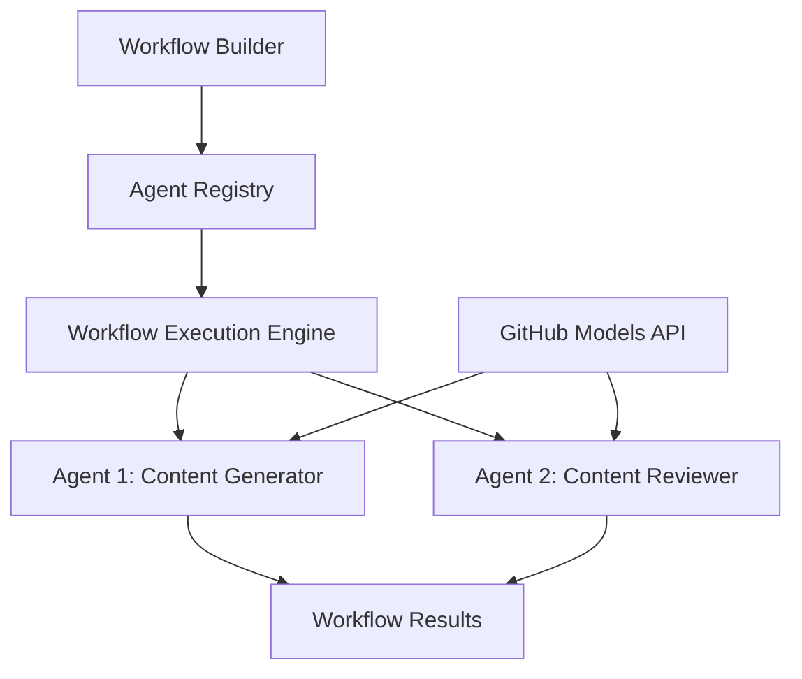

<!--
CO_OP_TRANSLATOR_METADATA:
{
  "original_hash": "034158688d0a45aae06dcbb21b0da5ae",
  "translation_date": "2025-11-11T12:49:16+00:00",
  "source_file": "08-multi-agent/code_samples/workflows-agent-framework/dotNET/01.dotnet-agent-framework-workflow-ghmodel-basic.md",
  "language_code": "tr"
}
-->
# 🔄 GitHub Modelleri ile Temel Agent İş Akışları (.NET)

## 📋 İş Akışı Orkestrasyonu Eğitimi

Bu not defteri, Microsoft Agent Framework for .NET ve GitHub Modelleri kullanarak gelişmiş **agent iş akışları** oluşturmayı gösterir. Yapılandırılmış orkestrasyon desenleri aracılığıyla AI ajanlarının iş birliği yaparak karmaşık görevleri tamamladığı çok adımlı iş süreçleri oluşturmayı öğreneceksiniz.

## 🎯 Öğrenme Hedefleri

### 🏗️ **İş Akışı Mimarisinin Temelleri**
- **İş Akışı Oluşturucu**: Karmaşık çok adımlı AI süreçlerini tasarlayın ve yönetin
- **Agent Koordinasyonu**: İş akışlarında birden fazla uzmanlaşmış ajanı koordine edin
- **GitHub Modelleri Entegrasyonu**: İş akışlarında GitHub'ın AI model çıkarım hizmetinden yararlanın
- **Görsel İş Akışı Tasarımı**: İş akışı yapılarını daha iyi anlamak için oluşturun ve görselleştirin

### 🔄 **Süreç Orkestrasyonu Desenleri**
- **Sıralı İşleme**: Birden fazla ajan görevini mantıksal sırayla zincirleyin
- **Durum Yönetimi**: İş akışı aşamaları arasında bağlam ve veri akışını koruyun
- **Hata Yönetimi**: Güçlü hata kurtarma ve iş akışı dayanıklılığı uygulayın
- **Performans Optimizasyonu**: Kurumsal ölçekli operasyonlar için verimli iş akışları tasarlayın

### 🏢 **Kurumsal İş Akışı Uygulamaları**
- **İş Süreci Otomasyonu**: Karmaşık organizasyonel iş akışlarını otomatikleştirin
- **İçerik Üretim Hattı**: İnceleme ve onay aşamaları içeren editoryal iş akışları
- **Müşteri Hizmetleri Otomasyonu**: Çok adımlı müşteri sorgusu çözümü
- **Veri İşleme İş Akışları**: AI destekli dönüşüm ile ETL iş akışları

## ⚙️ Ön Koşullar ve Kurulum

### 📦 **Gerekli NuGet Paketleri**

Bu iş akışı gösterimi birkaç önemli .NET paketini kullanır:

```xml
<!-- Core AI Framework -->
<PackageReference Include="Microsoft.Extensions.AI" Version="9.9.0" />

<!-- Agent Framework (Local Development) -->
<!-- Microsoft.Agents.AI.dll - Core agent abstractions -->
<!-- Microsoft.Agents.AI.OpenAI.dll - OpenAI/GitHub Models integration -->

<!-- Configuration and Environment -->
<PackageReference Include="DotNetEnv" Version="3.1.1" />
```

### 🔑 **GitHub Modelleri Yapılandırması**

**Ortam Kurulumu (.env dosyası):**
```env
GITHUB_TOKEN=your_github_personal_access_token
GITHUB_ENDPOINT=https://models.inference.ai.azure.com
GITHUB_MODEL_ID=gpt-4o-mini
```

**GitHub Modellerine Erişim:**
1. GitHub Modellerine kaydolun (şu anda önizleme aşamasında)
2. Model erişim izinleriyle kişisel erişim token'ı oluşturun
3. Yukarıda gösterildiği gibi ortam değişkenlerini yapılandırın

### 🏗️ **İş Akışı Mimari Genel Bakış**



**Ana Bileşenler:**
- **WorkflowBuilder**: İş akışlarını tasarlamak için ana orkestrasyon motoru
- **AIAgent**: Belirli yeteneklere sahip bireysel uzmanlaşmış ajanlar
- **GitHub Models Client**: AI model çıkarım hizmeti entegrasyonu
- **Execution Context**: İş akışı aşamaları arasında durum ve veri akışını yönetir

## 🎨 **Kurumsal İş Akışı Tasarım Desenleri**

### 📝 **İçerik Üretim İş Akışı**
```
User Request → Content Generation → Quality Review → Final Output
```

### 🔍 **Belge İşleme Hattı**
```
Document Input → Analysis → Extraction → Validation → Structured Output
```

### 💼 **İş Zekası İş Akışı**
```
Data Collection → Processing → Analysis → Report Generation → Distribution
```

### 🤝 **Müşteri Hizmetleri Otomasyonu**
```
Customer Inquiry → Classification → Processing → Response Generation → Follow-up
```

## 🏢 **Kurumsal Faydalar**

### 🎯 **Güvenilirlik ve Ölçeklenebilirlik**
- **Deterministik Yürütme**: Tutarlı, tekrarlanabilir iş akışı sonuçları
- **Hata Kurtarma**: İş akışının herhangi bir aşamasında hataların zarif bir şekilde ele alınması
- **Performans İzleme**: Yürütme metriklerini ve optimizasyon fırsatlarını takip edin
- **Kaynak Yönetimi**: AI model kaynaklarının verimli tahsisi ve kullanımı

### 🔒 **Güvenlik ve Uyumluluk**
- **Güvenli Kimlik Doğrulama**: API erişimi için GitHub token tabanlı kimlik doğrulama
- **Denetim İzleri**: İş akışı yürütme ve karar noktalarının tam kaydı
- **Erişim Kontrolü**: İş akışı yürütme ve izleme için ayrıntılı izinler
- **Veri Gizliliği**: İş akışları boyunca hassas bilgilerin güvenli bir şekilde işlenmesi

### 📊 **Gözlemlenebilirlik ve Yönetim**
- **Görsel İş Akışı Tasarımı**: Süreç akışlarının ve bağımlılıkların net bir şekilde temsil edilmesi
- **Yürütme İzleme**: İş akışı ilerlemesinin ve performansının gerçek zamanlı takibi
- **Hata Raporlama**: Ayrıntılı hata analizi ve hata ayıklama yetenekleri
- **Performans Analitiği**: Optimizasyon ve kapasite planlaması için metrikler

Haydi, ilk kurumsal düzeyde AI iş akışınızı oluşturalım! 🚀

## 💻 Kodun Çalıştırılması

Tam uygulama `01.dotnet-agent-framework-workflow-ghmodel-basic.cs` dosyasında mevcuttur. Bu dosya şunları gösterir:

1. **Ortam Yapılandırması** - GitHub Modelleri kimlik bilgilerini `.env` dosyasından yükleme
2. **OpenAI İstemci Kurulumu** - GitHub Modelleri uç noktasını kullanacak şekilde istemciyi yapılandırma
3. **Agent Oluşturma** - Uzmanlaşmış ajanları tanımlama (Resepsiyon ve Concierge)
4. **İş Akışı Oluşturucu** - Sıralı işlem ile çok ajanlı bir iş akışı oluşturma
5. **İş Akışı Yürütme** - Akış sonuçlarıyla iş akışını çalıştırma

### 🚀 Örneği Çalıştırma

```bash
# Make the script executable (Unix/Linux/macOS)
chmod +x 01.dotnet-agent-framework-workflow-ghmodel-basic.cs

# Run the workflow
./01.dotnet-agent-framework-workflow-ghmodel-basic.cs
```

Windows'da:
```powershell
dotnet run 01.dotnet-agent-framework-workflow-ghmodel-basic.cs
```

### 📝 Beklenen Çıktı

İş akışı şunları yapacaktır:
1. Seyahat hedefi talebinizi kabul eder ("Paris'e gitmek istiyorum")
2. Resepsiyon ajanı ilk öneriyi sunar
3. Concierge ajanı öneriyi gözden geçirir ve geliştirir
4. Nihai çıktı, tam konuşma akışını gösterir

### 🔧 Özelleştirme

İş akışını şu şekilde özelleştirebilirsiniz:
- Ajan talimatlarını değiştirerek davranışlarını değiştirme
- Daha karmaşık çok adımlı iş akışları oluşturmak için daha fazla ajan ekleme
- Farklı senaryoları test etmek için kullanıcı mesajını değiştirme
- Farklı yürütme desenleri oluşturmak için iş akışı kenarlarını ayarlama

---

<!-- CO-OP TRANSLATOR DISCLAIMER START -->
**Feragatname**:  
Bu belge, AI çeviri hizmeti [Co-op Translator](https://github.com/Azure/co-op-translator) kullanılarak çevrilmiştir. Doğruluk için çaba göstersek de, otomatik çevirilerin hata veya yanlışlıklar içerebileceğini lütfen unutmayın. Belgenin orijinal dili, yetkili kaynak olarak kabul edilmelidir. Kritik bilgiler için profesyonel insan çevirisi önerilir. Bu çevirinin kullanımından kaynaklanan yanlış anlamalar veya yanlış yorumlamalar için sorumluluk kabul etmiyoruz.
<!-- CO-OP TRANSLATOR DISCLAIMER END -->