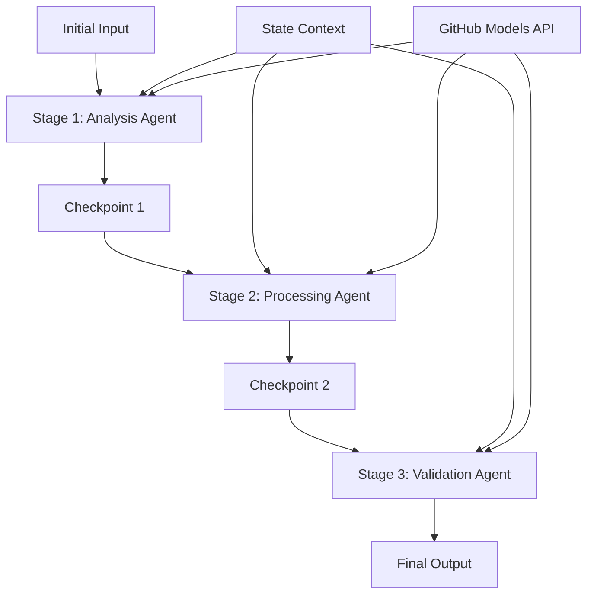

<!--
CO_OP_TRANSLATOR_METADATA:
{
  "original_hash": "1be9c8dcbd79a02d33d2c138684c1394",
  "translation_date": "2025-11-11T13:52:03+00:00",
  "source_file": "08-multi-agent/code_samples/workflows-agent-framework/dotNET/02.dotnet-agent-framework-workflow-ghmodel-sequential.md",
  "language_code": "tr"
}
-->
# ⏩ GitHub Modelleri ile Sıralı Ajan İş Akışları (.NET)

## 📋 Gelişmiş Sıralı İşleme Eğitimi

Bu doküman, Microsoft Agent Framework for .NET ve GitHub Modellerini kullanarak **sıralı iş akışı modellerini** göstermektedir. Ajanların belirli bir sırayla çalıştığı, her aşamanın bir önceki aşamanın sonuçlarına dayandığı karmaşık, adım adım işleme boru hatları oluşturmayı öğreneceksiniz.

## 🎯 Öğrenme Hedefleri

### 🔄 **Sıralı İşleme Mimarisi**
- **Doğrusal İş Akışı Tasarımı**: Net bağımlılıklarla adım adım işleme boru hatları oluşturma
- **Durum Yönetimi**: Sıralı iş akışı aşamaları boyunca bağlam ve veri akışını koruma
- **GitHub Modelleri Entegrasyonu**: GitHub'ın yapay zeka modellerini çok aşamalı .NET iş akışlarında kullanma
- **Kurumsal Boru Hattı Modelleri**: Üretime hazır sıralı işleme sistemleri oluşturma

### 🏗️ **Gelişmiş Sıralı Modeller**
- **Aşama-Kapı İşleme**: İş akışı aşamaları arasında doğrulama kontrol noktaları uygulama
- **Bağlam Koruma**: Tüm aşamalar boyunca durumu ve birikmiş bilgiyi koruma
- **Hata Yayılımı**: Sıralı işleme zincirlerinde hataları zarif bir şekilde ele alma
- **Performans Optimizasyonu**: Minimum ek yükle verimli sıralı yürütme

### 🏢 **Kurumsal Sıralı Uygulamalar**
- **Doküman İşleme Boru Hattı**: Çok aşamalı doküman analizi, dönüştürme ve doğrulama
- **Kalite Güvence İş Akışları**: Sıralı inceleme, doğrulama ve onay süreçleri
- **İçerik Üretim Boru Hattı**: Araştırma → Yazma → Düzenleme → İnceleme → Yayınlama
- **İş Süreci Otomasyonu**: Net aşama bağımlılıkları ile çok adımlı iş akışları

## ⚙️ Gereksinimler ve Kurulum

### 📦 **Gerekli NuGet Paketleri**

.NET sıralı iş akışları için gerekli paketler:

```xml
<!-- Core AI Framework -->
<PackageReference Include="Microsoft.Extensions.AI" Version="9.9.0" />

<!-- Client Model Abstractions -->
<PackageReference Include="System.ClientModel" Version="1.6.1.0" />

<!-- Azure Identity and Async LINQ Support -->
<PackageReference Include="Azure.Identity" Version="1.15.0" />
<PackageReference Include="System.Linq.Async" Version="6.0.3" />

<!-- Local Agent Framework References -->
<!-- Microsoft.Agents.AI.dll - Core agent abstractions -->
<!-- Microsoft.Agents.AI.OpenAI.dll - GitHub Models integration -->
```

### 🔑 **GitHub Modelleri Yapılandırması**

**Ortam Ayarları (.env dosyası):**
```env
GITHUB_TOKEN=your_github_personal_access_token
GITHUB_ENDPOINT=https://models.inference.ai.azure.com
GITHUB_MODEL_ID=gpt-4o-mini
```

**Yapılandırma Yönetimi:**
```csharp
// Load environment variables securely
Env.Load("../../../.env");
var githubToken = Environment.GetEnvironmentVariable("GITHUB_TOKEN");
var githubEndpoint = Environment.GetEnvironmentVariable("GITHUB_ENDPOINT");
var modelId = Environment.GetEnvironmentVariable("GITHUB_MODEL_ID");
```

### 🏗️ **Sıralı İş Akışı Mimarisi**



**Ana Bileşenler:**
- **Sıralı Ajanlar**: Her işleme aşaması için özelleşmiş ajanlar
- **Durum Bağlamı**: Aşamalar boyunca birikmiş veri ve kararları korur
- **Kontrol Noktaları**: Her aşamada kalite ve tutarlılığı sağlamak için doğrulama noktaları
- **GitHub Modelleri İstemcisi**: Tüm iş akışı aşamalarında tutarlı yapay zeka modeli erişimi

## 🎨 **Sıralı İş Akışı Tasarım Modelleri**

### 📝 **Doküman İşleme Boru Hattı**
```
Raw Document → Content Extraction → Analysis → Validation → Structured Output
```

### 🎯 **İçerik Üretim İş Akışı**
```
Brief/Requirements → Research → Content Creation → Review → Final Polish
```

### 🔍 **Kalite Güvence Boru Hattı**
```
Initial Review → Technical Validation → Compliance Check → Final Approval
```

### 💼 **İş Zekası İş Akışı**
```
Data Collection → Processing → Analysis → Report Generation → Distribution
```

## 🏢 **Kurumsal Sıralı İş Akışlarının Avantajları**

### 🎯 **Güvenilirlik ve Kalite**
- **Deterministik İşleme**: Yapılandırılmış aşamalarla tutarlı ve tekrarlanabilir sonuçlar
- **Kalite Kontrol Noktaları**: Her aşamada kaliteyi sağlayan doğrulama noktaları
- **Hata İzolasyonu**: Bir aşamadaki sorunlar sonraki aşamalara yayılmaz
- **Denetim İzleri**: Her aşamada alınan kararların ve dönüşümlerin tam takibi

### 📈 **Ölçeklenebilirlik ve Performans**
- **Modüler Tasarım**: Her aşama bağımsız olarak optimize edilebilir
- **Kaynak Yönetimi**: Aşamalar arasında yapay zeka modeli kaynaklarının verimli tahsisi
- **Durum Optimizasyonu**: Optimal performans için aşamalar arasında minimum durum aktarımı
- **Paralel Aşama Grupları**: Birden fazla sıralı iş akışı paralel olarak çalışabilir

### 🔒 **Güvenlik ve Uyumluluk**
- **Aşama Düzeyinde Güvenlik**: Farklı işleme aşamaları için farklı güvenlik politikaları
- **Veri Doğrulama**: Her kontrol noktasında veri bütünlüğünü ve uyumluluğunu sağlama
- **Erişim Kontrolü**: Farklı iş akışı aşamaları için ayrıntılı izinler
- **Yasal Uyumluluk**: Yapılandırılmış işleme ile yasal gereklilikleri karşılama

### 📊 **İzleme ve Analitik**
- **Aşama Düzeyinde Metrikler**: Her iş akışı aşaması için performans izleme
- **Darboğaz Tespiti**: Yavaş aşamaları belirleme ve optimize etme
- **Kalite Metrikleri**: Her aşamada kalite ve başarı oranlarını izleme
- **Süreç Optimizasyonu**: Aşama düzeyinde analitiklere dayalı sürekli iyileştirme

Hadi, sağlam sıralı yapay zeka işleme boru hatları oluşturalım! 🚀

## 💻 Kodun Çalıştırılması

Tam uygulama `02.dotnet-agent-framework-workflow-ghmodel-sequential.cs` dosyasında mevcuttur. Bu dosya, **üç aşamalı bir mobilya analizi iş akışını** göstermektedir:

1. **1. Aşama - Satış Ajanı**: Mobilya resimlerini analiz eder ve satın alma önerileri sunar
2. **2. Aşama - Fiyat Ajanı**: Detaylı fiyat dökümü ve bütçe seçenekleri sunar
3. **3. Aşama - Teklif Ajanı**: Tüm bilgileri sentezleyerek Markdown formatında profesyonel bir teklif dokümanı oluşturur

### 🏗️ **İş Akışı Mimarisi**

```
Image Input → Sales Analysis → Price Estimation → Quote Generation → Final Output
```

Her bir ajan:
- Önceki aşamadan gelen çıktıyı bağlam olarak alır
- Önceki analizlere kendi uzmanlığını ekler
- Durum yönetimi yoluyla iş akışı sürekliliğini sağlar

### 🚀 Örneği Çalıştırma

**Gereksinimler:**
- `../imgs/home.png` konumuna bir mobilya resmi yerleştirin (veya `imgPath` değişkenini güncelleyin)
- GitHub Modelleri kimlik bilgileriyle `.env` dosyanızı yapılandırın

```bash
# Make the script executable (Unix/Linux/macOS)
chmod +x 02.dotnet-agent-framework-workflow-ghmodel-sequential.cs

# Run the sequential workflow
./02.dotnet-agent-framework-workflow-ghmodel-sequential.cs
```

Veya Windows'ta:
```powershell
dotnet run 02.dotnet-agent-framework-workflow-ghmodel-sequential.cs
```

### 📝 Beklenen Çıktı

İş akışı şunları yapacaktır:
1. **Satış Ajanı**: Resimden mobilya öğelerini tanımlar ve öneriler sunar
2. **Fiyat Ajanı**: Detaylı fiyat analizi ekler, bütçe seviyeleri ve alışveriş önerileri sunar
3. **Teklif Ajanı**: Görüntü analizi temelinde tüm bilgileri sentezleyerek biçimlendirilmiş bir teklif dokümanı oluşturur

Sonuç, görüntü analizi temelinde hazırlanmış kapsamlı ve profesyonel bir mobilya teklifi olacaktır.

### 🔧 Özelleştirme Seçenekleri

**Ajan Davranışını Değiştirin:**
```csharp
// Adjust agent instructions to change their focus
const string SalesAgentInstructions = "Your custom instructions...";
```

**Sıralı Akışı Değiştirin:**
```csharp
// Add or reorder workflow stages
var workflow = new WorkflowBuilder(salesagent)
    .AddEdge(salesagent, priceagent)
    .AddEdge(priceagent, quoteagent)
    .AddEdge(quoteagent, newAgent)  // Add another stage
    .Build();
```

**Farklı Girdi Kullanın:**
```csharp
// Process text instead of images
ChatMessage userMessage = new ChatMessage(ChatRole.User, [
    new TextContent("Analyze pricing for a modern living room set")
]);
```

### 🎯 Gerçek Hayatta Kullanım Alanları

Bu sıralı model şu durumlar için idealdir:
- **E-ticaret**: Ürün analizi → Fiyatlandırma → Teklif oluşturma
- **Gayrimenkul**: Emlak analizi → Değerleme → İlan oluşturma
- **Sigorta**: Hasar analizi → Değerlendirme → Teklif oluşturma
- **İçerik Üretimi**: Araştırma → Yazma → Düzenleme → Yayınlama

### 🔍 Durum Akışını Anlama

Sıradaki her ajan:
- **Orijinal Girdi**: İlk kullanıcı mesajını (resim + metin) alır
- **Önceki Ajan Çıktıları**: Konuşma geçmişindeki tüm önceki ajan yanıtlarını alır
- **Birikmiş Bağlam**: İş akışı boyunca korunan tam durumu alır

Bu, her bir ajanın önceki tüm aşamalardan gelen kapsamlı bağlam üzerine inşa ettiği karmaşık çok aşamalı bir işleme olanak tanır.

---

<!-- CO-OP TRANSLATOR DISCLAIMER START -->
**Feragatname**:  
Bu belge, AI çeviri hizmeti [Co-op Translator](https://github.com/Azure/co-op-translator) kullanılarak çevrilmiştir. Doğruluk için çaba göstersek de, otomatik çevirilerin hata veya yanlışlıklar içerebileceğini lütfen unutmayın. Belgenin orijinal dili, yetkili kaynak olarak kabul edilmelidir. Kritik bilgiler için profesyonel insan çevirisi önerilir. Bu çevirinin kullanımından kaynaklanan yanlış anlamalar veya yanlış yorumlamalar için sorumluluk kabul etmiyoruz.
<!-- CO-OP TRANSLATOR DISCLAIMER END -->