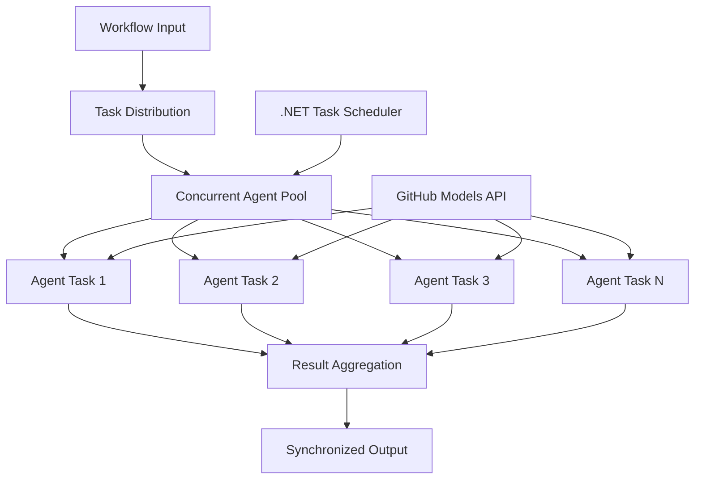

<!--
CO_OP_TRANSLATOR_METADATA:
{
  "original_hash": "b9c6e32c9b5f2fed20b6916984440d88",
  "translation_date": "2025-11-11T13:18:45+00:00",
  "source_file": "08-multi-agent/code_samples/workflows-agent-framework/dotNET/03.dotnet-agent-framework-workflow-ghmodel-concurrent.md",
  "language_code": "tr"
}
-->
# ⚡ GitHub Modelleri ile Eşzamanlı Agent İş Akışları (.NET)

## 📋 Yüksek Performanslı Paralel İşleme Eğitimi

Bu not defteri, Microsoft Agent Framework for .NET ve GitHub Modelleri kullanarak **eşzamanlı iş akışı modellerini** gösterir. Birden fazla yapay zeka ajanını aynı anda çalıştırarak, koordinasyonu ve veri tutarlılığını korurken maksimum verimlilik sağlayan yüksek performanslı, paralel işleme iş akışları oluşturmayı öğreneceksiniz.

## 🎯 Öğrenme Hedefleri

### 🚀 **Eşzamanlı İşleme Temelleri**
- **Paralel Ajan Çalıştırma**: Maksimum performans için birden fazla yapay zeka ajanını aynı anda çalıştırma
- **Async/Await Modelleri**: .NET'in async programlama modelini kullanarak verimli eşzamanlılık sağlama
- **GitHub Modelleri Entegrasyonu**: GitHub'ın yapay zeka model çıkarım hizmetine eşzamanlı çağrıları koordine etme
- **Kaynak Yönetimi**: Eşzamanlı işlemler arasında yapay zeka model kaynaklarını verimli bir şekilde yönetme

### 🏗️ **Gelişmiş Eşzamanlılık Mimarisi**
- **Görev Tabanlı Paralellik**: .NET Task Parallel Library kullanarak optimal eşzamanlı çalıştırma
- **Senkronizasyon Modelleri**: Yarış koşullarından kaçınarak eşzamanlı ajanları koordine etme
- **Yük Dengeleme**: Mevcut eşzamanlı işleme kapasitesini verimli bir şekilde dağıtma
- **Hata Toleransı**: Bireysel ajan hatalarını tüm iş akışını durdurmadan yönetme

### 🏢 **Kurumsal Eşzamanlı Uygulamalar**
- **Yüksek Hacimli Belge İşleme**: Birden fazla belgeyi aynı anda işleme
- **Gerçek Zamanlı İçerik Analizi**: Gelen veri akışlarının eşzamanlı analizi
- **Toplu İşleme Optimizasyonu**: Büyük ölçekli veri işleme operasyonları için verimliliği artırma
- **Çok Modlu Analiz**: Farklı içerik türlerini ve formatlarını paralel olarak işleme

## ⚙️ Ön Koşullar ve Kurulum

### 📦 **Gerekli NuGet Paketleri**

Yüksek performanslı eşzamanlı iş akışları için gerekli paketler:

```xml
<!-- Core AI Framework with Async Support -->
<PackageReference Include="Microsoft.Extensions.AI" Version="9.9.0" />

<!-- Client Model Abstractions for API Communication -->
<PackageReference Include="System.ClientModel" Version="1.6.1.0" />

<!-- Azure Identity and Async LINQ for Advanced Operations -->
<PackageReference Include="Azure.Identity" Version="1.15.0" />
<PackageReference Include="System.Linq.Async" Version="6.0.3" />

<!-- Local Agent Framework References -->
<!-- Microsoft.Agents.AI.dll - Core agent abstractions with async support -->
<!-- Microsoft.Agents.AI.OpenAI.dll - GitHub Models integration with concurrency -->
```

### 🔑 **GitHub Modelleri Yapılandırması**

**Ortam Kurulumu (.env dosyası):**
```env
GITHUB_TOKEN=your_github_personal_access_token
GITHUB_ENDPOINT=https://models.inference.ai.azure.com
GITHUB_MODEL_ID=gpt-4o-mini
```

**Eşzamanlı İşleme Düşünceleri:**
```csharp
// Configure for concurrent operations
var clientOptions = new OpenAIClientOptions()
{
    Endpoint = new Uri(githubEndpoint),
    // Configure connection pooling for concurrent requests
    NetworkTimeout = TimeSpan.FromMinutes(5)
};
```

### 🏗️ **Eşzamanlı İş Akışı Mimarisi**



**Ana Bileşenler:**
- **Task Parallel Library**: .NET'in yerleşik eşzamanlı işlem desteği
- **Ajan Havuzu**: Paralel işleme için birden fazla ajan örneği
- **Sonuç Toplama**: Eşzamanlı ajan sonuçlarının koordinasyonu ve birleştirilmesi
- **Senkronizasyon Noktaları**: Eşzamanlı işlemler arasında veri tutarlılığını sağlama

## 🎨 **Eşzamanlı İş Akışı Tasarım Modelleri**

### 🔍 **Paralel Araştırma ve Analiz**
```
Research Topic → Concurrent Research Agents → Result Synthesis → Final Report
```

### 📊 **Çok Kaynaklı Veri İşleme**
```
Data Sources → Parallel Processing Agents → Data Integration → Unified Output
```

### 🎭 **İçerik Üretim Hattı**
```
Content Requirements → Concurrent Content Generators → Quality Review → Final Content
```

### 🔄 **Fan-Out/Fan-In İşleme**
```
Single Input → Multiple Concurrent Processors → Result Aggregation → Single Output
```

## 🏢 **Kurumsal Performans Faydaları**

### ⚡ **Verimlilik ve Ölçeklenebilirlik**
- **Doğrusal Performans Ölçekleme**: Daha fazla eşzamanlı ajan ekleyerek verimliliği artırma
- **Kaynak Kullanımı**: Mevcut yapay zeka model kapasitesinin maksimum verimliliği
- **Azaltılmış İşleme Süresi**: Paralel çalıştırma ile önemli zaman tasarrufu
- **Esnek Ölçekleme**: İş yüküne bağlı olarak eşzamanlı ajan sayısını dinamik olarak ayarlama

### 🛡️ **Güvenilirlik ve Dayanıklılık**
- **Hata İzolasyonu**: Bireysel ajan hataları diğer eşzamanlı işlemleri etkilemez
- **Kademeli Bozulma**: Sistem, azaltılmış ajan kapasitesiyle çalışmaya devam eder
- **Hata Kurtarma**: Başarısız eşzamanlı işlemler için otomatik yeniden deneme mekanizmaları
- **Yük Dağıtımı**: Mevcut ajanlar arasında işin eşit dağılımı

### 📊 **Performans İzleme**
- **Eşzamanlı Çalıştırma Metrikleri**: Tüm paralel işlemlerin performansını izleme
- **Kaynak Kullanımı Analitiği**: CPU, bellek ve ağ kullanımını izleme
- **Verimlilik Analizi**: Eşzamanlı işlemden elde edilen verimlilik kazançlarını ölçme
- **Darboğaz Tespiti**: Performans kısıtlamalarını belirleme ve çözme

### 🔧 **Geliştirme ve Operasyonlar**
- **Async Programlama Modeli**: .NET'in olgun async/await modellerinden yararlanma
- **Görev Koordinasyonu**: Yerleşik görev yönetimi ve koordinasyon yetenekleri
- **Hata Yönetimi**: Eşzamanlı işlemler için kapsamlı hata yönetimi
- **Hata Ayıklama Desteği**: Eşzamanlı iş akışları için Visual Studio hata ayıklama araçları

Haydi, .NET ile yüksek performanslı eşzamanlı yapay zeka iş akışları oluşturalım! 🚀

## 💻 Kodun Çalıştırılması

Tam uygulama `03.dotnet-agent-framework-workflow-ghmodel-concurrent.cs` dosyasında mevcuttur. Bu dosya, seyahat planlaması için **Fan-Out/Fan-In eşzamanlı iş akışını** gösterir:

### 🏗️ **İş Akışı Mimarisi**

```
User Request → ConcurrentStartExecutor → [Researcher Agent || Planner Agent] → ConcurrentAggregationExecutor → Final Output
```

**Ana Bileşenler:**

1. **ConcurrentStartExecutor**: Kullanıcı isteğini tüm ajanlara aynı anda iletir
2. **Araştırmacı Ajan**: Hedefleri ve cazibe merkezlerini eşzamanlı olarak analiz eder
3. **Planlayıcı Ajan**: Ayrıntılı seyahat planlarını eşzamanlı olarak oluşturur
4. **ConcurrentAggregationExecutor**: Her iki ajanın sonuçlarını toplar ve birleştirir

### 🎯 **Fan-Out/Fan-In Modeli**

Bu iş akışı klasik **Fan-Out/Fan-In** modelini gösterir:
- **Fan-Out**: Bir giriş mesajı aynı anda birden fazla ajana iletilir
- **Eşzamanlı İşleme**: Birden fazla ajan aynı görevi paralel olarak yürütür
- **Fan-In**: Tüm ajanlardan gelen sonuçlar toplanır ve tek bir çıktıya dönüştürülür

### 🚀 Örneği Çalıştırma

```bash
# Make the script executable (Unix/Linux/macOS)
chmod +x 03.dotnet-agent-framework-workflow-ghmodel-concurrent.cs

# Run the concurrent workflow
./03.dotnet-agent-framework-workflow-ghmodel-concurrent.cs
```

Windows'ta:
```powershell
dotnet run 03.dotnet-agent-framework-workflow-ghmodel-concurrent.cs
```

### 📝 Beklenen Çıktı

İş akışı şunları yapacaktır:
1. **İsteği Yayma**: "Aralık ayında Seattle'a bir gezi planla" mesajını her iki ajana gönderir
2. **Eşzamanlı İşleme**: Her iki ajan aynı anda çalışır:
   - Araştırmacı cazibe merkezlerini ve ayrıntıları belirler
   - Planlayıcı güzergah ve lojistik oluşturur
3. **Birleştirme**: Her iki yanıtı kapsamlı bir çıktıya dönüştürür
4. **Sonuçları Gösterme**: Tüm bilgileri içeren birleşik seyahat planını gösterir

### 🔧 Özelleştirme Seçenekleri

**Daha Fazla Eşzamanlı Ajan Ekleyin:**
```csharp
// Create additional specialized agents
AIAgent budgetAgent = openAIClient.GetChatClient(github_model_id).CreateAIAgent(
    name: "Budget-Agent", instructions: "Calculate travel costs...");

// Add to fan-out
var workflow = new WorkflowBuilder(startExecutor)
    .AddFanOutEdge(startExecutor, targets: [researcherAgent, plannerAgent, budgetAgent])
    .AddFanInEdge(aggregationExecutor, sources: [researcherAgent, plannerAgent, budgetAgent])
    .WithOutputFrom(aggregationExecutor)
    .Build();

// Update aggregation count
if (this._messages.Count == 3) { ... }
```

**Ajan Talimatlarını Değiştirin:**
```csharp
const string ResearcherAgentInstructions = "Your custom instructions for research...";
const string PlanAgentInstructions = "Your custom instructions for planning...";
```

**Görevi Değiştirin:**
```csharp
StreamingRun run = await InProcessExecution.StreamAsync(
    workflow, 
    "Plan a European vacation for 2 weeks in summer"
);
```

### 🎯 Gerçek Dünya Uygulamaları

Bu eşzamanlı model şunlar için idealdir:
- **İçerik Üretimi**: Farklı bölümleri aynı anda oluşturan birden fazla yazar
- **Kod İncelemesi**: Kodun farklı perspektiflerden analiz edilmesi
- **Pazar Araştırması**: Farklı pazar segmentlerinin paralel analizi
- **Belge İşleme**: Eşzamanlı çıkarım, analiz ve doğrulama
- **Çok Perspektifli Analiz**: Aynı giriş üzerinde farklı bakış açıları elde etme

### 🔍 Özel Yürütücüler Anlama

**ConcurrentStartExecutor:**
- `IMessageHandler<string>` uygular ve string giriş kabul eder
- Mesajları tüm bağlı ajanlara iletir
- Eşzamanlı işlemeyi tetiklemek için `TurnToken` gönderir

**ConcurrentAggregationExecutor:**
- `IMessageHandler<ChatMessage>` uygular ve ajan yanıtlarını alır
- Mesajları thread-safe bir şekilde toplar
- Beklenen tüm yanıtlar geldiğinde birleştirme yapar
- Nihai çıktıyı `context.YieldOutputAsync()` kullanarak sağlar

### ⚡ Performans Faydaları

**Eşzamanlı vs Sıralı:**
- Sıralı: Agent1 (30s) → Agent2 (30s) = **Toplam 60 saniye**
- Eşzamanlı: Agent1 (30s) || Agent2 (30s) = **Toplam 30 saniye**

**Verimlilik artışı**: İş yüküne ve kaynaklara bağlı olarak N eşzamanlı ajan için N× daha hızlı

### 🛡️ Hata Yönetimi

İş akışı bireysel ajan hatalarını zarif bir şekilde yönetir:
- Bir ajan başarısız olursa, diğerleri işlemeye devam eder
- Birleştirici zaman aşımı mantığını uygulayabilir
- Gerekirse kısmi sonuçlar döndürülebilir

### 📊 Gelişmiş Özellikler

**Dinamik Ajan Sayısı:**
Birleştirme mantığını değişken ajan sayılarını destekleyecek şekilde düzenleyin:

```csharp
private int _expectedAgentCount;
private readonly List<ChatMessage> _messages = [];

public async ValueTask HandleAsync(ChatMessage message, IWorkflowContext context)
{
    this._messages.Add(message);
    if (this._messages.Count == _expectedAgentCount)
    {
        // Process aggregation
    }
}
```

Bu eşzamanlı iş akışı modeli, yüksek performanslı, ölçeklenebilir yapay zeka ajan sistemleri oluşturmak için gereklidir!

---

<!-- CO-OP TRANSLATOR DISCLAIMER START -->
**Feragatname**:  
Bu belge, AI çeviri hizmeti [Co-op Translator](https://github.com/Azure/co-op-translator) kullanılarak çevrilmiştir. Doğruluk için çaba göstersek de, otomatik çevirilerin hata veya yanlışlıklar içerebileceğini lütfen unutmayın. Belgenin orijinal dili, yetkili kaynak olarak kabul edilmelidir. Kritik bilgiler için profesyonel insan çevirisi önerilir. Bu çevirinin kullanımından kaynaklanan yanlış anlamalar veya yanlış yorumlamalar için sorumluluk kabul edilmemektedir.
<!-- CO-OP TRANSLATOR DISCLAIMER END -->