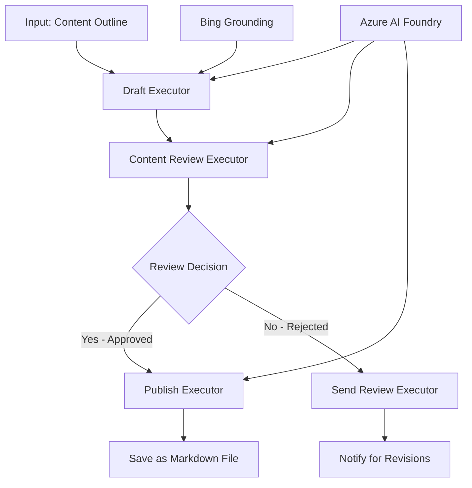

<!--
CO_OP_TRANSLATOR_METADATA:
{
  "original_hash": "8abd335151cee553293b637ee3d80d10",
  "translation_date": "2025-11-11T12:15:41+00:00",
  "source_file": "08-multi-agent/code_samples/workflows-agent-framework/dotNET/04.dotnet-agent-framework-workflow-aifoundry-condition.md",
  "language_code": "tr"
}
-->
# 🔀 Azure AI Foundry (.NET) ile Koşullu Ajan İş Akışları

## 📋 Akıllı Karar Tabanlı İş Akışı Eğitimi

Bu notebook, Azure AI Foundry ve Microsoft Agent Framework for .NET kullanarak **koşullu iş akışı modellerini** nasıl oluşturacağınızı gösterir. AI analizi, iş kuralları ve dinamik koşullara dayalı olarak işlemleri akıllıca yönlendiren, karar odaklı iş akışları oluşturmayı öğreneceksiniz.

## 🎯 Öğrenme Hedefleri

### 🧠 **Akıllı Karar Mimarisi**
- **Koşullu Mantık Uygulaması**: Birden fazla dallanma noktası içeren karmaşık karar ağaçları oluşturun
- **AI Destekli Yönlendirme**: Azure AI Foundry modellerini kullanarak akıllı yönlendirme kararları alın
- **Dinamik İş Akışı Uyarlaması**: Çalışma zamanı analizi ve koşullara göre iş akışı davranışını değiştirin
- **Kurumsal Kural Entegrasyonu**: İş mantığını ve uyumluluk gereksinimlerini iş akışlarına dahil edin

### 🔀 **Gelişmiş Koşullu Modeller**
- **Çok Kriterli Karar Verme**: Yönlendirme kararları için birden fazla faktörü değerlendirin
- **Bağlam Bilinçli İşleme**: Birikmiş iş akışı bağlamı ve geçmişine dayalı kararlar alın
- **Uyarlanabilir İş Akışı Değişikliği**: Gerçek zamanlı koşullara göre işleme yollarını dinamik olarak ayarlayın
- **Kural Motoru Entegrasyonu**: İş akışlarında gelişmiş iş kuralı motorlarını uygulayın

### 🏢 **Kurumsal Koşullu Uygulamalar**
- **Belge Sınıflandırma ve Yönlendirme**: Belgeleri otomatik olarak uygun iş akışlarına sınıflandırın ve yönlendirin
- **Müşteri Hizmetleri Ayırma**: Müşteri taleplerini uzman ekiplere akıllıca yönlendirin
- **Uyumluluk ve Risk İşleme**: Risk değerlendirmesine dayalı olarak farklı doğrulama ve inceleme süreçlerini uygulayın
- **Kalite Güvencesi İş Akışları**: İçeriği kalite metriklerine dayalı olarak uygun inceleme süreçlerinden geçirin

## ⚙️ Ön Koşullar ve Kurulum

### 📦 **Gerekli NuGet Paketleri**

Koşullu iş akışı işleme için gelişmiş paketler:

```xml
<!-- Core AI Framework -->
<PackageReference Include="Microsoft.Extensions.AI" Version="9.9.0" />

<!-- Azure AI Agents with Persistent State -->
<PackageReference Include="Azure.AI.Agents.Persistent" Version="1.2.0-beta.5" />

<!-- Azure Identity and Utilities -->
<PackageReference Include="Azure.Identity" Version="1.15.0" />
<PackageReference Include="System.Linq.Async" Version="6.0.3" />
<PackageReference Include="DotNetEnv" Version="3.1.1" />

<!-- Local Workflow Framework References -->
<!-- Microsoft.Agents.Workflows.dll - Advanced workflow orchestration -->
<!-- Microsoft.Agents.AI.AzureAI.dll - Azure AI Foundry integration -->
<!-- Microsoft.Agents.AI.dll - Core agent abstractions -->
```

### 🔑 **Azure AI Foundry Yapılandırması**

**Gerekli Azure Kaynakları:**
- Koşullu işleme modelleri içeren Azure AI Foundry çalışma alanı
- Uygun hesaplama kotaları ve izinlere sahip Azure aboneliği
- Karar verme ve içerik analizi için dağıtılmış AI modelleri
- (Opsiyonel) Bing Search API bağlantısı için temel oluşturma yetenekleri

**Ortam Yapılandırması (.env dosyası):**
```env
# Azure AI Foundry Configuration
AZURE_AI_PROJECT_ENDPOINT=https://your-project.cognitiveservices.azure.com/
BING_CONNECTION_ID=your-bing-connection-id
```

**Kimlik Doğrulama Ayarları:**
```csharp
// Azure CLI or Managed Identity authentication
using Azure.Identity;
var credential = new AzureCliCredential();

// Load environment configuration
DotNetEnv.Env.Load("../../../.env");
```

### 🏗️ **Koşullu İş Akışı Mimarisi**



**Ana Bileşenler:**
- **Taslak Yürütücü**: Taslakları ana hatlardan oluşturan AI ajanı
- **İçerik İnceleme Yürütücü**: Taslak kalitesini ve uyumluluğunu değerlendiren AI ajanı
- **Koşullu Yönlendirme**: İnceleme sonuçlarına dayalı karar mantığı
- **Yayınlama/İnceleme Yolları**: Onaylanmış ve reddedilmiş içerik için ayrı işleme yolları
- **Durum Yönetimi**: İş akışı boyunca içerik ve inceleme bağlamını korur

## 🎨 **Koşullu İş Akışı Tasarım Modelleri**

### 📋 **Kalite Kontrol Noktaları ile İçerik Üretimi**
```
Outline → Draft Creation → Quality Review → {Approve: Publish | Reject: Revise}
```

### 🎯 **Risk Tabanlı Belge İşleme**
```
Document → Risk Assessment → {Low: Standard | High: Enhanced Review}
```

### 🔍 **Akıllı Müşteri Hizmetleri Yönlendirme**
```
Customer Query → Analysis → {Simple: FAQ Bot | Complex: Human Agent}
```

### 💼 **Uyumluluk Odaklı İş Akışları**
```
Content → Compliance Check → {Pass: Publish | Fail: Legal Review}
```

## 🏢 **Kurumsal Koşullu Faydalar**

### 🎯 **Akıllı Otomasyon**
- **Akıllı Karar Verme**: İçerik analizi ve bağlama dayalı AI destekli yönlendirme kararları
- **Uyarlanabilir İşleme**: Değişen koşullara göre otomatik olarak ayarlanan iş akışları
- **İş Kuralı Uygulaması**: Karmaşık iş mantığı ve politikaların otomatik uygulanması
- **Bağlam Bilinçli Yönlendirme**: Tam iş akışı geçmişi ve birikmiş bağlama dayalı kararlar

### 📈 **Operasyonel Mükemmellik**
- **Kaynak Tahsisini Optimize Etme**: Çalışmayı en uygun uzmanlara ve süreçlere yönlendirin
- **Azaltılmış Manuel Müdahale**: Otomatik karar verme, insan yönlendirme ihtiyacını en aza indirir
- **Daha Hızlı Çözüm Süreleri**: Uygun uzmanlık ve işleme yeteneklerine doğrudan yönlendirme
- **Tutarlı Uygulama**: İş kuralları ve karar kriterlerinin standart uygulanması

### 🛡️ **Risk Yönetimi ve Uyumluluk**
- **Otomatik Risk Değerlendirmesi**: İçerik ve durum risk seviyelerinin AI destekli değerlendirmesi
- **Uyumluluk Uygulaması**: Gerekli düzenleyici süreçlerden otomatik yönlendirme
- **Güvenlik Protokolü Uygulaması**: Risk değerlendirmesine dayalı olarak gelişmiş güvenlik önlemleri
- **Denetim İzleme Bakımı**: Yönlendirme kararlarının ve gerekçelerinin tam belgelenmesi

### 📊 **Analitik ve Sürekli İyileştirme**
- **Karar Analitiği**: Yönlendirme kararlarının etkinliğini ve doğruluğunu izleyin
- **Desen Tanıma**: Zaman içinde yönlendirme kararlarındaki eğilimleri ve desenleri belirleyin
- **Performans Optimizasyonu**: Karar kriterlerinin ve yönlendirme verimliliğinin sürekli iyileştirilmesi
- **İş Zekası**: İçerik özellikleri ve işleme gereksinimleri hakkında içgörüler

### 🔧 **Teknik Mükemmellik**
- **Kalıcı Durum Yönetimi**: İş akışı yürütme boyunca karmaşık durumu koruyun
- **Ölçeklenebilir Mimari**: Yüksek hacimli koşullu işleme gereksinimlerini karşılayın
- **Entegrasyon Yetenekleri**: Mevcut iş sistemleri ve süreçleriyle sorunsuz entegrasyon
- **İzleme ve Gözlemlenebilirlik**: İş akışı performansı ve kararlarının kapsamlı takibi

Haydi, .NET ile akıllı, karar odaklı kurumsal iş akışları oluşturalım! 🚀

## 💻 Kodun Çalıştırılması

Tam uygulama `04.dotnet-agent-framework-workflow-aifoundry-condition.cs` dosyasında mevcuttur. Bu, **kalite kontrol noktaları ile içerik üretim iş akışını** gösterir:

### 🏗️ **İş Akışı Mimarisi**

```
Content Outline → Draft Creation → Quality Review → Conditional Routing:
                                                      ├─ Approved (>200 words) → Publish
                                                      └─ Rejected (<200 words) → Review Notification
```

**İş Akışındaki Ajanlar:**
1. **Evangelist Ajanı**: Bing temel oluşturma ile ana hatlardan eğitim taslakları oluşturur
2. **İçerik İnceleme Ajanı**: Taslak kalitesini değerlendirir (kelime sayısı, tamlık)
3. **Yayıncı Ajanı**: Onaylanmış içeriği zaman damgalı Markdown dosyaları olarak kaydeder

**Özel Yürütücüler:**
1. **DraftExecutor**: Taslak oluşturmayı düzenler
2. **ContentReviewExecutor**: Kalite değerlendirmesi yapar
3. **PublishExecutor**: Onaylanmış içeriğin yayınlanmasını yönetir
4. **SendReviewExecutor**: Reddedilen içerik bildirimlerini yönetir

### 🚀 Örneği Çalıştırma

**Ön Koşullar:**
- Azure AI Foundry çalışma alanı yapılandırılmış
- Azure CLI kimlik doğrulaması (`az login`)
- (Opsiyonel) Bing Search bağlantısı için temel oluşturma

```bash
# Make the script executable (Unix/Linux/macOS)
chmod +x 04.dotnet-agent-framework-workflow-aifoundry-condition.cs

# Run the conditional workflow
./04.dotnet-agent-framework-workflow-aifoundry-condition.cs
```

Windows'ta:
```powershell
dotnet run 04.dotnet-agent-framework-workflow-aifoundry-condition.cs
```

### 📝 Beklenen Çıktı

İş akışı şunları yapacaktır:
1. **Ajanları Oluştur**: Üç özel Azure AI Foundry ajanını başlatır
2. **Taslak Oluştur**: Evangelist ajanı ana hatlardan eğitim taslağı oluşturur
3. **İçeriği İncele**: İçerik İnceleme Ajanı taslak kalitesini değerlendirir
4. **Koşullu Yönlendirme**:
   - **Eğer onaylanırsa (>200 kelime)**: Yayın yürütücü Markdown dosyası olarak kaydeder
   - **Eğer reddedilirse (<200 kelime)**: İnceleme bildirimini gönderir
5. **Sonuçları Göster**: Nihai iş akışı sonucunu gösterir

### 🔧 Özelleştirme Seçenekleri

**İnceleme Kriterlerini Değiştirin:**
```csharp
const string ContentReviewerInstructions = @"
You are a content reviewer...
1. Check if content is more than 500 words (instead of 200)
2. Verify technical accuracy
3. Ensure proper formatting
...";
```

**Daha Fazla Koşullu Yol Ekleyin:**
```csharp
var workflow = new WorkflowBuilder(draftExecutor)
    .AddEdge(draftExecutor, contentReviewerExecutor)
    .AddEdge(contentReviewerExecutor, publishExecutor, condition: GetCondition("Excellent"))
    .AddEdge(contentReviewerExecutor, editExecutor, condition: GetCondition("Good"))
    .AddEdge(contentReviewerExecutor, sendReviewerExecutor, condition: GetCondition("Poor"))
    .Build();
```

**İçerik Gereksinimlerini Değiştirin:**
```csharp
string OUTLINE_Content = @"
# Your Custom Topic
## Section 1
https://your-reference-url
## Section 2
...
";
```

### 🎯 Gerçek Dünya Uygulamaları

Bu koşullu iş akışı modeli şunlar için idealdir:
- **İçerik Yönetim Sistemleri**: Kalite kontrol noktaları ile otomatik editoryal iş akışları
- **Belge İşleme**: Belgeleri sınıflandırma ve uyumluluğa göre yönlendirme
- **Müşteri Destek**: Karmaşıklık ve aciliyete göre akıllı bilet yönlendirme
- **Hukuki İnceleme**: Risk değerlendirmesi ve değere göre sözleşmeleri yönlendirme
- **İK Süreçleri**: Başvuruları uygun tarama iş akışlarından geçirme

### 🔍 Koşullu Mantığı Anlama

**Koşul Fonksiyonu:**
```csharp
public Func<object?, bool> GetCondition(string expectedResult) =>
    reviewResult => reviewResult is ReviewResult review && review.Result == expectedResult;
```

Bu fonksiyon bir predikat oluşturur:
1. Sonucun `ReviewResult` türünde olup olmadığını kontrol eder
2. `Result` özelliğini beklenen değerle karşılaştırır
3. Yönlendirmeyi belirlemek için true/false döndürür

**Koşullu İş Akışı Kenarları:**
```csharp
.AddEdge(contentReviewerExecutor, publishExecutor, condition: GetCondition("Yes"))
.AddEdge(contentReviewerExecutor, sendReviewerExecutor, condition: GetCondition("No"))
```

### 📊 Gelişmiş Özellikler

**JSON Şema Doğrulaması:**
İş akışı yapılandırılmış yanıtları sağlamak için JSON şemalarını kullanır:

```csharp
// Define response structure
public class ReviewResult
{
    [JsonPropertyName("review_result")]
    public string Result { get; set; } = string.Empty;
    
    [JsonPropertyName("reason")]
    public string Reason { get; set; } = string.Empty;
    
    [JsonPropertyName("draft_content")]
    public string DraftContent { get; set; } = string.Empty;
}

// Apply to agent
ResponseFormat = ChatResponseFormat.ForJsonSchema(
    AIJsonUtilities.CreateJsonSchema(typeof(ReviewResult)), 
    "ReviewResult", 
    "Review Result From DraftContent"
)
```

**Bing Temel Oluşturma Entegrasyonu:**
Evangelist ajanı Bing temel oluşturmayı kullanarak gerçek zamanlı bilgilere erişir:

```csharp
var bingGroundingConfig = new BingGroundingSearchConfiguration(bing_conn_id);
BingGroundingToolDefinition bingGroundingTool = new(
    new BingGroundingSearchToolParameters([bingGroundingConfig])
);
```

Bu, ajanın ana hattaki URL'leri takip etmesini ve güncel bilgileri çıkarmasını sağlar.

### 🛡️ Hata Yönetimi

İş akışı reddedilen içerik için sağlam hata yönetimi içerir:
- İnceleme hataları alternatif yolu tetikler
- Bildirimler açık reddetme nedenleri sağlar
- İçerik revizyon için korunur

### 🔄 İş Akışını Genişletme

**Revizyon Döngüsü Ekleyin:**
İçeriği otomatik olarak yeniden taslak haline getiren bir geri bildirim döngüsü oluşturun:

```csharp
.AddEdge(contentReviewerExecutor, publishExecutor, condition: GetCondition("Yes"))
.AddEdge(contentReviewerExecutor, draftExecutor, condition: GetCondition("No")) // Loop back
```

**Çok Seviyeli İnceleme Uygulayın:**
Farklı kriterlere sahip birden fazla inceleme aşaması ekleyin:

```csharp
.AddEdge(draftExecutor, technicalReviewer)
.AddEdge(technicalReviewer, editorialReviewer, condition: GetCondition("TechPass"))
.AddEdge(editorialReviewer, publishExecutor, condition: GetCondition("EditPass"))
```

Bu koşullu iş akışı modeli, karmaşık, akıllı kurumsal otomasyon sistemleri oluşturmak için temel sağlar! 🚀

---

<!-- CO-OP TRANSLATOR DISCLAIMER START -->
**Feragatname**:  
Bu belge, AI çeviri hizmeti [Co-op Translator](https://github.com/Azure/co-op-translator) kullanılarak çevrilmiştir. Doğruluk için çaba göstersek de, otomatik çevirilerin hata veya yanlışlıklar içerebileceğini lütfen unutmayın. Belgenin orijinal dili, yetkili kaynak olarak kabul edilmelidir. Kritik bilgiler için profesyonel insan çevirisi önerilir. Bu çevirinin kullanımından kaynaklanan yanlış anlamalar veya yanlış yorumlamalar için sorumluluk kabul etmiyoruz.
<!-- CO-OP TRANSLATOR DISCLAIMER END -->