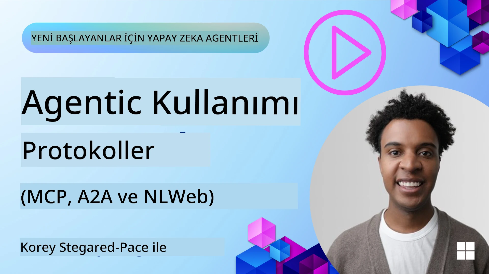
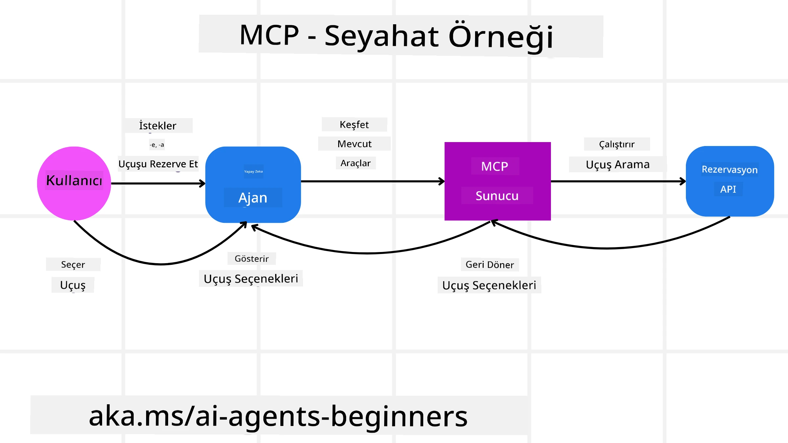
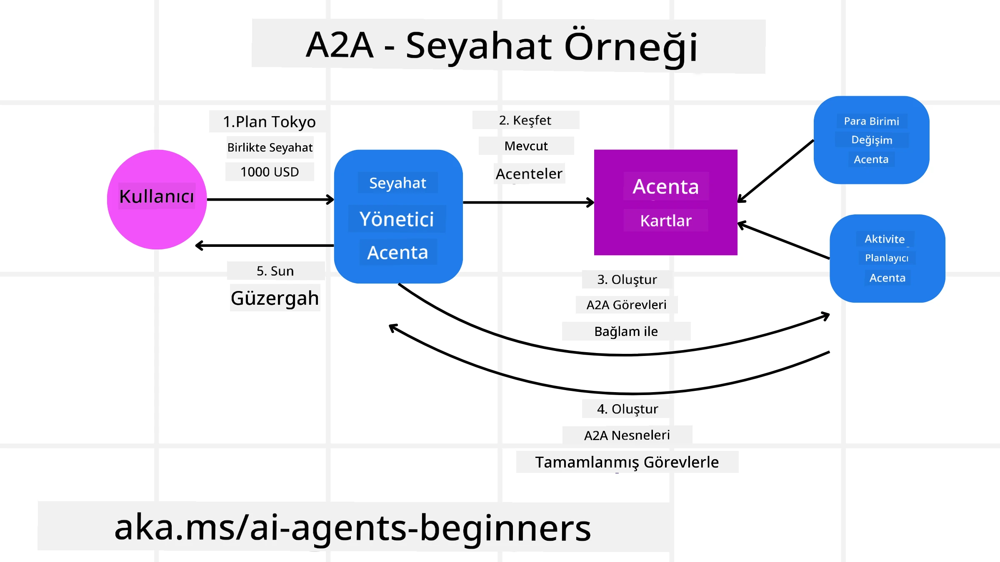

<!--
CO_OP_TRANSLATOR_METADATA:
{
  "original_hash": "aff92c6f019b4627ca9399c6e3882e17",
  "translation_date": "2025-09-18T14:53:08+00:00",
  "source_file": "11-agentic-protocols/README.md",
  "language_code": "tr"
}
-->
# Agentik Protokolleri Kullanma (MCP, A2A ve NLWeb)

> _(Bu dersin videosunu izlemek için yukarıdaki görsele tıklayın)_

AI ajanlarının kullanımı arttıkça, standartlaşmayı, güvenliği ve açık inovasyonu destekleyen protokollere olan ihtiyaç da artıyor. Bu derste, bu ihtiyacı karşılamayı hedefleyen üç protokolü ele alacağız: Model Context Protocol (MCP), Agent to Agent (A2A) ve Natural Language Web (NLWeb).

## Giriş

Bu derste şunları ele alacağız:

• **MCP**'nin AI ajanlarının kullanıcı görevlerini tamamlamak için harici araçlara ve verilere erişmesini nasıl sağladığını.

• **A2A**'nın farklı AI ajanları arasında iletişim ve iş birliğini nasıl mümkün kıldığını.

• **NLWeb**'in herhangi bir web sitesine doğal dil arayüzleri getirerek AI ajanlarının içerikleri keşfetmesini ve etkileşimde bulunmasını nasıl sağladığını.

## Öğrenme Hedefleri

• MCP, A2A ve NLWeb'in AI ajanları bağlamındaki temel amaçlarını ve faydalarını **tanımlayın**.

• Her bir protokolün LLM'ler, araçlar ve diğer ajanlar arasındaki iletişimi ve etkileşimi nasıl kolaylaştırdığını **açıklayın**.

• Karmaşık agentik sistemler oluştururken her bir protokolün oynadığı farklı rolleri **tanıyın**.

## Model Context Protocol

**Model Context Protocol (MCP)**, uygulamaların LLM'lere bağlam ve araç sağlaması için standart bir yöntem sunan açık bir standarttır. Bu, AI ajanlarının farklı veri kaynaklarına ve araçlara tutarlı bir şekilde bağlanmasını sağlayan "evrensel bir adaptör" işlevi görür.

MCP'nin bileşenlerine, doğrudan API kullanımına kıyasla sağladığı faydalara ve AI ajanlarının bir MCP sunucusunu nasıl kullanabileceğine dair bir örneğe bakalım.

### MCP Temel Bileşenleri

MCP, bir **istemci-sunucu mimarisi** üzerinde çalışır ve temel bileşenleri şunlardır:

• **Hostlar**, bir MCP sunucusuna bağlantı başlatan LLM uygulamalarıdır (örneğin, VSCode gibi bir kod editörü).

• **İstemciler**, host uygulama içindeki bileşenlerdir ve sunucularla birebir bağlantıları sürdürür.

• **Sunucular**, belirli yetenekleri ortaya çıkaran hafif programlardır.

Protokol, bir MCP sunucusunun yeteneklerini oluşturan üç temel ilkeyi içerir:

• **Araçlar**: AI ajanlarının bir eylemi gerçekleştirmek için çağırabileceği ayrık eylemler veya işlevlerdir. Örneğin, bir hava durumu servisi "hava durumu al" aracını veya bir e-ticaret sunucusu "ürün satın al" aracını sunabilir. MCP sunucuları, her aracın adını, açıklamasını ve giriş/çıkış şemasını yetenek listelerinde belirtir.

• **Kaynaklar**: MCP sunucusunun sağlayabileceği ve istemcilerin talep üzerine alabileceği salt okunur veri öğeleri veya belgelerdir. Örnekler arasında dosya içerikleri, veritabanı kayıtları veya günlük dosyaları bulunur. Kaynaklar metin (kod veya JSON gibi) veya ikili (görüntüler veya PDF'ler gibi) olabilir.

• **İstekler**: Daha karmaşık iş akışlarını mümkün kılan önerilen istekleri sağlayan önceden tanımlanmış şablonlardır.

### MCP'nin Faydaları

MCP, AI ajanları için önemli avantajlar sunar:

• **Dinamik Araç Keşfi**: Ajanlar, bir sunucudan mevcut araçların listesini ve ne yaptıklarına dair açıklamaları dinamik olarak alabilir. Bu, geleneksel API'lerin genellikle statik kodlama gerektirdiği entegrasyonlara kıyasla daha esnektir. MCP, "bir kez entegre et" yaklaşımı sunarak daha fazla uyarlanabilirlik sağlar.

• **LLM'ler Arasında Uyumluluk**: MCP, farklı LLM'ler arasında çalışır ve daha iyi performans için temel modelleri değiştirme esnekliği sağlar.

• **Standartlaştırılmış Güvenlik**: MCP, ek MCP sunucularına erişim eklerken ölçeklenebilirliği artıran standart bir kimlik doğrulama yöntemi içerir. Bu, çeşitli geleneksel API'ler için farklı anahtarlar ve kimlik doğrulama türlerini yönetmekten daha basittir.

### MCP Örneği

Bir kullanıcının MCP destekli bir AI asistanı kullanarak uçak bileti rezervasyonu yapmak istediğini hayal edin.

1. **Bağlantı**: AI asistanı (MCP istemcisi), bir havayolu tarafından sağlanan MCP sunucusuna bağlanır.

2. **Araç Keşfi**: İstemci, havayolunun MCP sunucusuna "Hangi araçlarınız var?" diye sorar. Sunucu, "uçuş ara" ve "uçuş rezervasyonu yap" gibi araçlarla yanıt verir.

3. **Araç Çağrısı**: Kullanıcı AI asistanına "Lütfen Portland'dan Honolulu'ya bir uçuş ara" der. AI asistanı, LLM'ini kullanarak "uçuş ara" aracını çağırması gerektiğini belirler ve ilgili parametreleri (kalkış, varış) MCP sunucusuna iletir.

4. **İşlem ve Yanıt**: MCP sunucusu, havayolunun dahili rezervasyon API'sine gerçek çağrıyı yapar. Uçuş bilgilerini (örneğin, JSON verisi) alır ve AI asistanına geri gönderir.

5. **İleri Etkileşim**: AI asistanı uçuş seçeneklerini sunar. Kullanıcı bir uçuş seçtiğinde, asistan aynı MCP sunucusundaki "uçuş rezervasyonu yap" aracını çağırarak rezervasyonu tamamlayabilir.

## Agent-to-Agent Protokolü (A2A)

MCP, LLM'leri araçlara bağlamaya odaklanırken, **Agent-to-Agent (A2A) protokolü** bunu bir adım ileriye taşıyarak farklı AI ajanları arasında iletişim ve iş birliğini mümkün kılar. A2A, farklı organizasyonlar, ortamlar ve teknoloji yığınları arasında AI ajanlarını bir araya getirerek ortak bir görevi tamamlamalarını sağlar.

A2A'nın bileşenlerini ve faydalarını inceleyeceğiz ve seyahat uygulamamızda nasıl uygulanabileceğine dair bir örnek vereceğiz.

### A2A Temel Bileşenleri

A2A, ajanlar arasında iletişimi ve kullanıcı alt görevlerini tamamlamak için iş birliğini mümkün kılmaya odaklanır. Protokolün her bir bileşeni buna katkıda bulunur:

#### Ajan Kartı

Bir MCP sunucusunun araç listesini paylaşmasına benzer şekilde, bir Ajan Kartı şunları içerir:
- Ajanın adı.
- Tamamladığı genel görevlerin **açıklaması**.
- Diğer ajanların (veya insan kullanıcıların) bu ajanı ne zaman ve neden çağırmak isteyeceğini anlamalarına yardımcı olmak için **belirli becerilerin listesi** ve açıklamaları.
- Ajanın **mevcut Endpoint URL'si**.
- Ajanın **versiyonu** ve **yetenekleri** (örneğin, akış yanıtları ve push bildirimleri).

#### Ajan Yürütücüsü

Ajan Yürütücüsü, **kullanıcı sohbetinin bağlamını uzak ajana iletmekten** sorumludur. Uzak ajan, tamamlanması gereken görevi anlamak için bu bağlama ihtiyaç duyar. Bir A2A sunucusunda, bir ajan gelen istekleri ayrıştırmak ve kendi dahili araçlarını kullanarak görevleri yerine getirmek için kendi Büyük Dil Modelini (LLM) kullanır.

#### Artefakt

Bir uzak ajan istenen görevi tamamladıktan sonra, çalışmasının ürünü bir artefakt olarak oluşturulur. Artefakt, **ajanın çalışmasının sonucunu**, **tamamlanan şeyin açıklamasını** ve protokol aracılığıyla gönderilen **metin bağlamını** içerir. Artefakt gönderildikten sonra, uzak ajanla bağlantı bir sonraki ihtiyaç duyulana kadar kapatılır.

#### Olay Kuyruğu

Bu bileşen, **güncellemeleri işlemek ve mesajları iletmek** için kullanılır. Özellikle üretimde, ajanik sistemler için, görev tamamlanma sürelerinin daha uzun sürebileceği durumlarda ajanlar arasındaki bağlantının görev tamamlanmadan önce kapanmasını önlemek açısından önemlidir.

### A2A'nın Faydaları

• **Gelişmiş İş Birliği**: Farklı satıcılar ve platformlardan ajanların etkileşimde bulunmasını, bağlam paylaşmasını ve birlikte çalışmasını sağlar, geleneksel olarak bağlantısız sistemler arasında sorunsuz otomasyonu kolaylaştırır.

• **Model Seçim Esnekliği**: Her A2A ajanı, isteklerini yerine getirmek için hangi LLM'i kullanacağına karar verebilir, bu da MCP senaryolarındaki tek bir LLM bağlantısına kıyasla optimize edilmiş veya ince ayar yapılmış modelleri mümkün kılar.

• **Yerleşik Kimlik Doğrulama**: Kimlik doğrulama doğrudan A2A protokolüne entegre edilmiştir, ajan etkileşimleri için sağlam bir güvenlik çerçevesi sağlar.

### A2A Örneği

Seyahat rezervasyonu senaryomuzu genişletelim, ancak bu kez A2A kullanarak.

1. **Kullanıcıdan Çoklu Ajan Talebi**: Bir kullanıcı, "Seyahat Ajanı" A2A istemcisi/ajanıyla etkileşimde bulunur ve şöyle der: "Lütfen önümüzdeki hafta için Honolulu'ya bir gezi rezervasyonu yap, uçuşlar, otel ve kiralık araba dahil."

2. **Seyahat Ajanı Tarafından Orkestrasyon**: Seyahat Ajanı bu karmaşık talebi alır. Görevi anlamak ve diğer uzman ajanlarla etkileşimde bulunması gerektiğini belirlemek için LLM'ini kullanır.

3. **Ajanlar Arası İletişim**: Seyahat Ajanı, A2A protokolünü kullanarak "Havayolu Ajanı," "Otel Ajanı" ve "Araba Kiralama Ajanı" gibi farklı şirketler tarafından oluşturulan alt ajanlara bağlanır.

4. **Delege Edilmiş Görev İcrası**: Seyahat Ajanı, bu uzman ajanlara belirli görevler gönderir (örneğin, "Honolulu'ya uçuş bul," "Otel rezervasyonu yap," "Araba kirala"). Bu uzman ajanların her biri, kendi LLM'lerini çalıştırır ve kendi araçlarını kullanır (bunlar MCP sunucuları olabilir) ve rezervasyonun belirli kısmını gerçekleştirir.

5. **Birleştirilmiş Yanıt**: Tüm alt ajanlar görevlerini tamamladıktan sonra, Seyahat Ajanı sonuçları (uçuş detayları, otel onayı, araba kiralama rezervasyonu) derler ve kullanıcıya kapsamlı, sohbet tarzı bir yanıt gönderir.

## Natural Language Web (NLWeb)

Web siteleri, uzun zamandır kullanıcıların internet üzerinden bilgi ve verilere erişmesi için birincil yol olmuştur.

NLWeb'in farklı bileşenlerine, NLWeb'in faydalarına ve seyahat uygulamamıza bakarak NLWeb'in nasıl çalıştığına dair bir örneğe bakalım.

### NLWeb Bileşenleri

- **NLWeb Uygulaması (Çekirdek Hizmet Kodu)**: Doğal dil sorularını işleyen sistemdir. Platformun farklı parçalarını bağlayarak yanıtlar oluşturur. Bunu bir web sitesinin doğal dil özelliklerini çalıştıran **motor** olarak düşünebilirsiniz.

- **NLWeb Protokolü**: Bir web sitesiyle doğal dil etkileşimi için **temel bir kurallar setidir**. Yanıtları JSON formatında gönderir (genellikle Schema.org kullanarak). Amacı, HTML'in çevrimiçi belgeleri paylaşmayı mümkün kıldığı gibi, "AI Web" için basit bir temel oluşturmaktır.

- **MCP Sunucusu (Model Context Protocol Endpoint)**: Her NLWeb kurulumu aynı zamanda bir **MCP sunucusu** olarak çalışır. Bu, diğer AI sistemleriyle **araçlar (örneğin, "sorma" yöntemi) ve veri paylaşmasını** sağlar. Pratikte, bu web sitesinin içeriğini ve yeteneklerini AI ajanları tarafından kullanılabilir hale getirir ve siteyi daha geniş "ajan ekosisteminin" bir parçası haline getirir.

- **Gömülü Modeller**: Bu modeller, web sitesi içeriğini **vektörler** (gömüler) adı verilen sayısal temsillere dönüştürmek için kullanılır. Bu vektörler, bilgisayarların anlamı karşılaştırmasını ve aramasını sağlar. Özel bir veritabanında saklanır ve kullanıcılar hangi gömülü modeli kullanmak istediklerini seçebilir.

- **Vektör Veritabanı (Geri Alma Mekanizması)**: Bu veritabanı, **web sitesi içeriğinin gömülerini** saklar. Birisi bir soru sorduğunda, NLWeb vektör veritabanını kontrol eder ve en alakalı bilgiyi hızlıca bulur. En uygun yanıtların bir listesini benzerlik sırasına göre verir. NLWeb, Qdrant, Snowflake, Milvus, Azure AI Search ve Elasticsearch gibi farklı vektör depolama sistemleriyle çalışır.

### NLWeb Örneği

Seyahat rezervasyon web sitemizi tekrar ele alalım, ancak bu kez NLWeb tarafından destekleniyor.

1. **Veri Alımı**: Seyahat web sitesinin mevcut ürün katalogları (örneğin, uçuş listeleri, otel açıklamaları, tur paketleri) Schema.org kullanılarak biçimlendirilir veya RSS beslemeleri aracılığıyla yüklenir. NLWeb'in araçları bu yapılandırılmış veriyi alır, gömüler oluşturur ve bunları yerel veya uzak bir vektör veritabanında saklar.

2. **Doğal Dil Sorgusu (İnsan)**: Bir kullanıcı web sitesini ziyaret eder ve menülerde gezinmek yerine bir sohbet arayüzüne şunu yazar: "Honolulu'da havuzlu, aile dostu bir otel bul."

3. **NLWeb İşleme**: NLWeb uygulaması bu sorguyu alır. Sorguyu anlamak için bir LLM'e gönderir ve aynı anda vektör veritabanında ilgili otel listelerini arar.

4. **Doğru Sonuçlar**: LLM, veritabanından gelen arama sonuçlarını yorumlamaya, "aile dostu," "havuz" ve "Honolulu" kriterlerine göre en iyi eşleşmeleri belirlemeye ve ardından doğal dilde bir yanıt oluşturmaya yardımcı olur. Önemli olan, yanıtın web sitesinin katalogundaki gerçek otellere atıfta bulunması ve uydurma bilgilerden kaçınmasıdır.

5. **AI Ajan Etkileşimi**: NLWeb bir MCP sunucusu olarak hizmet verdiğinden, harici bir AI seyahat ajanı da bu web sitesinin NLWeb örneğine bağlanabilir. AI ajanı, web sitesine doğrudan şu şekilde sorgu gönderebilir: `ask("Honolulu bölgesinde otelin önerdiği vegan dostu restoranlar var mı?")`. NLWeb örneği bunu işler, restoran bilgileri (eğer yüklendiyse) veritabanını kullanarak sorguyu işler ve yapılandırılmış bir JSON yanıtı döndürür.

### MCP/A2A/NLWeb Hakkında Daha Fazla Sorunuz mu Var?

Diğer öğrenicilerle tanışmak, ofis saatlerine katılmak ve AI ajanlarıyla ilgili sorularınızı yanıtlamak için [Azure AI Foundry Discord](https://aka.ms/ai-agents/discord) topluluğuna katılın.

## Kaynaklar

- [MCP için Başlangıç Kılavuzu](https://aka.ms/mcp-for-beginners)  
- [MCP Dokümantasyonu](https://github.com/microsoft/semantic-kernel/tree/main/python/semantic-kernel/semantic_kernel/connectors/mcp)
- [NLWeb Repo](https://github.com/nlweb-ai/NLWeb)
- [Semantic Kernel Kılavuzları](https://learn.microsoft.com/semantic-kernel/)

---

**Feragatname**:  
Bu belge, AI çeviri hizmeti [Co-op Translator](https://github.com/Azure/co-op-translator) kullanılarak çevrilmiştir. Doğruluğu sağlamak için çaba göstersek de, otomatik çevirilerin hata veya yanlışlık içerebileceğini lütfen unutmayın. Belgenin orijinal dili, yetkili kaynak olarak kabul edilmelidir. Kritik bilgiler için profesyonel insan çevirisi önerilir. Bu çevirinin kullanımından kaynaklanan yanlış anlamalar veya yanlış yorumlamalar için sorumluluk kabul etmiyoruz.