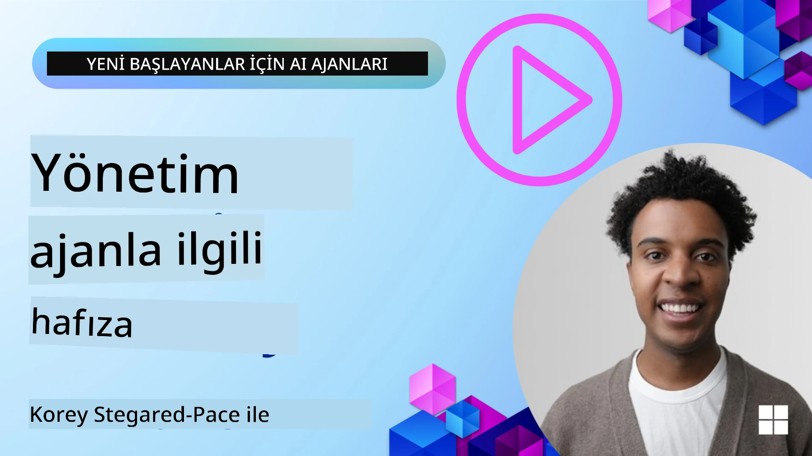

<!--
CO_OP_TRANSLATOR_METADATA:
{
  "original_hash": "a1d90991499ad697c4ad24decaf36968",
  "translation_date": "2025-12-09T12:20:29+00:00",
  "source_file": "13-agent-memory/README.md",
  "language_code": "tr"
}
-->
# AI Ajanları için Bellek

AI ajanları oluşturmanın benzersiz faydalarını tartışırken, genellikle iki şey öne çıkar: görevleri tamamlamak için araçları çağırma yeteneği ve zamanla gelişme yeteneği. Bellek, kullanıcılarımıza daha iyi deneyimler sunabilecek kendini geliştiren ajanlar oluşturmanın temelinde yer alır.

Bu derste, AI ajanları için belleğin ne olduğunu, nasıl yönetileceğini ve uygulamalarımızın yararına nasıl kullanılacağını inceleyeceğiz.

## Giriş

Bu derste şunlar ele alınacaktır:

• **AI Ajan Belleğini Anlamak**: Belleğin ne olduğu ve ajanlar için neden önemli olduğu.

• **Belleği Uygulama ve Depolama**: AI ajanlarınıza bellek özellikleri eklemek için pratik yöntemler, kısa vadeli ve uzun vadeli belleğe odaklanarak.

• **AI Ajanlarını Kendini Geliştiren Hale Getirmek**: Belleğin ajanların geçmiş etkileşimlerden öğrenmesini ve zamanla gelişmesini nasıl sağladığı.

## Mevcut Uygulamalar

Bu ders, iki kapsamlı notebook öğreticisini içerir:

• **[13-agent-memory.ipynb](./13-agent-memory.ipynb)**: Belleği Mem0 ve Azure AI Search ile Semantic Kernel çerçevesi kullanarak uygular.

• **[13-agent-memory-cognee.ipynb](./13-agent-memory-cognee.ipynb)**: Yapılandırılmış belleği Cognee kullanarak uygular, gömülü bilgilerle desteklenen bilgi grafiği oluşturur, grafiği görselleştirir ve akıllı sorgulama sağlar.

## Öğrenme Hedefleri

Bu dersi tamamladıktan sonra şunları öğrenmiş olacaksınız:

• **AI ajan belleğinin farklı türlerini ayırt etmek**, çalışma belleği, kısa vadeli ve uzun vadeli bellek, ayrıca kişilik ve epizodik bellek gibi özel türler dahil.

• **AI ajanları için kısa vadeli ve uzun vadeli belleği uygulamak ve yönetmek**, Semantic Kernel çerçevesini kullanarak Mem0, Cognee, Beyaz Tahta belleği gibi araçlardan yararlanmak ve Azure AI Search ile entegrasyon sağlamak.

• **Kendini geliştiren AI ajanlarının arkasındaki prensipleri anlamak** ve sağlam bellek yönetim sistemlerinin sürekli öğrenme ve adaptasyona nasıl katkıda bulunduğunu görmek.

## AI Ajan Belleğini Anlamak

Temelde, **AI ajanları için bellek, bilgiyi saklama ve hatırlama mekanizmalarını ifade eder**. Bu bilgi, bir konuşma hakkında spesifik detaylar, kullanıcı tercihleri, geçmiş eylemler veya öğrenilen kalıplar olabilir.

Bellek olmadan, AI uygulamaları genellikle durumsuzdur, yani her etkileşim sıfırdan başlar. Bu, ajanın önceki bağlamı veya tercihleri "unutması" nedeniyle tekrarlayan ve hayal kırıklığı yaratan bir kullanıcı deneyimine yol açar.

### Bellek Neden Önemlidir?

Bir ajanın zekası, geçmiş bilgileri hatırlama ve kullanma yeteneğiyle yakından ilişkilidir. Bellek, ajanların şu özelliklere sahip olmasını sağlar:

• **Düşünceli**: Geçmiş eylemlerden ve sonuçlardan öğrenme.

• **Etkileşimli**: Süregelen bir konuşma boyunca bağlamı koruma.

• **Proaktif ve Tepkisel**: Geçmiş verilere dayanarak ihtiyaçları tahmin etme veya uygun şekilde yanıt verme.

• **Otonom**: Saklanan bilgileri kullanarak daha bağımsız çalışabilme.

Bellek uygulamanın amacı, ajanları daha **güvenilir ve yetenekli** hale getirmektir.

### Bellek Türleri

#### Çalışma Belleği

Bunu, bir ajanın tek bir görev veya düşünce süreci sırasında kullandığı bir tür "karalama kağıdı" olarak düşünebilirsiniz. Bir sonraki adımı hesaplamak için gerekli olan anlık bilgileri tutar.

AI ajanları için çalışma belleği genellikle bir konuşmadan en alakalı bilgileri yakalar, tam sohbet geçmişi uzun veya kısaltılmış olsa bile. Gereksinimler, öneriler, kararlar ve eylemler gibi temel unsurları çıkarmaya odaklanır.

**Çalışma Belleği Örneği**

Bir seyahat rezervasyon ajanında, çalışma belleği kullanıcının mevcut talebini, örneğin "Paris'e bir gezi rezervasyonu yapmak istiyorum" gibi, yakalayabilir. Bu spesifik gereklilik, mevcut etkileşimi yönlendirmek için ajanın anlık bağlamında tutulur.

#### Kısa Vadeli Bellek

Bu tür bellek, tek bir konuşma veya oturum süresince bilgiyi tutar. Mevcut sohbetin bağlamıdır ve ajanın diyaloğun önceki dönüşlerine atıfta bulunmasını sağlar.

**Kısa Vadeli Bellek Örneği**

Bir kullanıcı "Paris'e bir uçuş ne kadar tutar?" diye sorar ve ardından "Oradaki konaklama ne kadar?" diye devam ederse, kısa vadeli bellek ajanın "orada" kelimesinin aynı konuşma içinde "Paris" anlamına geldiğini bilmesini sağlar.

#### Uzun Vadeli Bellek

Bu, birden fazla konuşma veya oturum boyunca devam eden bilgidir. Ajanların kullanıcı tercihlerini, geçmiş etkileşimleri veya genel bilgileri uzun süre boyunca hatırlamasını sağlar. Kişiselleştirme için önemlidir.

**Uzun Vadeli Bellek Örneği**

Uzun vadeli bellek, "Ben kayak yapmayı ve açık hava aktivitelerini seven, dağ manzaralı kahveyi tercih eden ve geçmişteki bir yaralanma nedeniyle ileri seviye kayak pistlerinden kaçınmak isteyen biri" gibi bilgileri saklayabilir. Bu bilgiler, önceki etkileşimlerden öğrenilir ve gelecekteki seyahat planlama oturumlarında önerileri son derece kişiselleştirilmiş hale getirir.

#### Kişilik Belleği

Bu özel bellek türü, bir ajanın tutarlı bir "kişilik" veya "rol" geliştirmesine yardımcı olur. Ajana kendisi veya amaçlanan rolü hakkında detayları hatırlama imkanı verir, böylece etkileşimler daha akıcı ve odaklı hale gelir.

**Kişilik Belleği Örneği**

Eğer seyahat ajanı "uzman bir kayak planlayıcısı" olarak tasarlanmışsa, kişilik belleği bu rolü güçlendirebilir ve yanıtlarının bir uzmanın tonu ve bilgisiyle uyumlu olmasını sağlayabilir.

#### İş Akışı/Epizodik Bellek

Bu bellek, bir ajanın karmaşık bir görev sırasında attığı adımların sırasını, başarılarını ve başarısızlıklarını saklar. Geçmiş "bölümleri" veya deneyimleri hatırlayarak öğrenmek gibidir.

**Epizodik Bellek Örneği**

Eğer ajan belirli bir uçuşu rezerve etmeye çalışmış ancak müsaitlik nedeniyle başarısız olmuşsa, epizodik bellek bu başarısızlığı kaydedebilir ve ajanın alternatif uçuşlar denemesine veya sonraki bir girişimde kullanıcıyı daha bilgilendirici bir şekilde bilgilendirmesine olanak tanır.

#### Varlık Belleği

Bu, konuşmalardan belirli varlıkları (insanlar, yerler veya şeyler) ve olayları çıkarıp hatırlamayı içerir. Ajana tartışılan temel unsurların yapılandırılmış bir anlayışını oluşturma imkanı verir.

**Varlık Belleği Örneği**

Geçmiş bir seyahat hakkında yapılan bir konuşmadan, ajan "Paris", "Eiffel Kulesi" ve "Le Chat Noir restoranında akşam yemeği" gibi varlıkları çıkarabilir. Gelecekteki bir etkileşimde, ajan "Le Chat Noir"i hatırlayabilir ve orada yeni bir rezervasyon yapmayı teklif edebilir.

#### Yapılandırılmış RAG (Retrieval Augmented Generation)

RAG daha geniş bir teknik olsa da, "Yapılandırılmış RAG" güçlü bir bellek teknolojisi olarak öne çıkar. Konuşmalar, e-postalar, görüntüler gibi çeşitli kaynaklardan yoğun, yapılandırılmış bilgileri çıkarır ve yanıtların hassasiyetini, hatırlama yeteneğini ve hızını artırır. Klasik RAG yalnızca anlamsal benzerliğe dayanırken, Yapılandırılmış RAG bilgilerin iç yapısıyla çalışır.

**Yapılandırılmış RAG Örneği**

Sadece anahtar kelimeleri eşleştirmek yerine, Yapılandırılmış RAG bir e-postadan uçuş detaylarını (varış yeri, tarih, saat, havayolu) ayrıştırabilir ve yapılandırılmış bir şekilde saklayabilir. Bu, "Salı günü Paris'e hangi uçuşu rezerve ettim?" gibi kesin sorgulara olanak tanır.

## Belleği Uygulama ve Depolama

AI ajanları için bellek uygulamak, **bellek yönetimi** sürecini içerir. Bu süreç, bilgiyi oluşturma, depolama, geri çağırma, entegre etme, güncelleme ve hatta "unutma" (veya silme) işlemlerini kapsar. Geri çağırma özellikle kritik bir unsurdur.

### Özel Bellek Araçları

#### Mem0

Ajan belleğini depolamak ve yönetmek için Mem0 gibi özel araçlar kullanılabilir. Mem0, ajanların ilgili etkileşimleri hatırlamasına, kullanıcı tercihlerini ve gerçek bağlamı saklamasına ve zamanla başarı ve başarısızlıklardan öğrenmesine olanak tanıyan kalıcı bir bellek katmanı olarak çalışır. Buradaki fikir, durumsuz ajanların durumlu hale gelmesidir.

Mem0, **iki aşamalı bellek hattı: çıkarma ve güncelleme** ile çalışır. Öncelikle, bir ajanın dizisine eklenen mesajlar Mem0 hizmetine gönderilir, bu hizmet Büyük Dil Modeli (LLM) kullanarak sohbet geçmişini özetler ve yeni anıları çıkarır. Daha sonra, LLM destekli güncelleme aşaması bu anıları ekleyip eklememeye, değiştirmeye veya silmeye karar verir ve bunları vektör, grafik ve anahtar-değer veri tabanlarını içerebilen hibrit bir veri deposunda saklar. Bu sistem ayrıca çeşitli bellek türlerini destekler ve varlıklar arasındaki ilişkileri yönetmek için grafik belleği içerebilir.

#### Cognee

Bir diğer güçlü yaklaşım, **Cognee** kullanmaktır. Cognee, yapılandırılmış ve yapılandırılmamış verileri gömülü bilgilerle desteklenen sorgulanabilir bilgi grafiğine dönüştüren açık kaynaklı bir semantik bellek sistemidir. Cognee, vektör benzerlik aramasını grafik ilişkileriyle birleştiren **çift depolama mimarisi** sunar ve ajanların sadece hangi bilginin benzer olduğunu değil, kavramların birbirleriyle nasıl ilişkili olduğunu anlamasını sağlar.

Cognee, **hibrit sorgulama** konusunda mükemmeldir; vektör benzerliği, grafik yapısı ve LLM akıl yürütmesini birleştirir - ham veri aramasından grafik farkındalıklı soru yanıtlamaya kadar. Sistem, kısa vadeli oturum bağlamını ve uzun vadeli kalıcı belleği destekleyen, tek bir bağlı grafik olarak sorgulanabilir bir şekilde evrimleşen ve büyüyen **canlı bellek** sağlar.

Cognee notebook öğreticisi ([13-agent-memory-cognee.ipynb](./13-agent-memory-cognee.ipynb)), bu birleşik bellek katmanını oluşturmayı, çeşitli veri kaynaklarını içermeyi, bilgi grafiğini görselleştirmeyi ve belirli ajan ihtiyaçlarına uygun farklı arama stratejileriyle sorgulamayı pratik örneklerle gösterir.

### RAG ile Bellek Depolama

Mem0 gibi özel bellek araçlarının ötesinde, **Azure AI Search gibi güçlü arama hizmetlerini bellekleri depolamak ve geri çağırmak için bir arka uç olarak kullanabilirsiniz**, özellikle yapılandırılmış RAG için.

Bu, ajanın yanıtlarını kendi verilerinizle temellendirmenize olanak tanır, daha alakalı ve doğru cevaplar sağlar. Azure AI Search, kullanıcıya özel seyahat anılarını, ürün kataloglarını veya herhangi bir alanla ilgili bilgiyi depolamak için kullanılabilir.

Azure AI Search, konuşma geçmişleri, e-postalar veya hatta görüntüler gibi büyük veri setlerinden yoğun, yapılandırılmış bilgileri çıkarma ve geri çağırma konusunda mükemmel olan **Yapılandırılmış RAG** gibi özellikleri destekler. Bu, geleneksel metin parçalama ve gömme yaklaşımlarına kıyasla "insanüstü hassasiyet ve hatırlama" sağlar.

## AI Ajanlarını Kendini Geliştiren Hale Getirmek

Kendini geliştiren ajanlar için yaygın bir model, bir **"bilgi ajanı"** tanıtmayı içerir. Bu ayrı ajan, kullanıcı ile birincil ajan arasındaki ana konuşmayı gözlemler. Rolü şunları içerir:

1. **Değerli bilgiyi belirleme**: Konuşmanın herhangi bir kısmının genel bilgi veya belirli bir kullanıcı tercihi olarak kaydedilmeye değer olup olmadığını belirleme.

2. **Çıkarma ve özetleme**: Konuşmadan temel öğrenmeyi veya tercihi damıtma.

3. **Bilgi tabanında saklama**: Çıkarılan bilgiyi, genellikle bir vektör veri tabanında, daha sonra geri çağırılabilmesi için kalıcı hale getirme.

4. **Gelecek sorguları artırma**: Kullanıcı yeni bir sorgu başlattığında, bilgi ajanı ilgili saklanan bilgiyi geri çağırır ve kullanıcı istemine ekler, birincil ajana kritik bağlam sağlar (RAG'ye benzer şekilde).

### Bellek için Optimizasyonlar

• **Gecikme Yönetimi**: Kullanıcı etkileşimlerini yavaşlatmamak için, bilgilerin saklanmaya veya geri çağırılmaya değer olup olmadığını hızlıca kontrol etmek için daha ucuz ve hızlı bir model kullanılabilir, yalnızca daha karmaşık çıkarma/geri çağırma süreci gerektiğinde devreye girer.

• **Bilgi Tabanı Bakımı**: Büyüyen bir bilgi tabanı için, daha az sıklıkla kullanılan bilgiler "soğuk depolama"ya taşınabilir, böylece maliyetler yönetilebilir.

## Ajan Belleği Hakkında Daha Fazla Sorunuz mu Var?

[Azure AI Foundry Discord](https://aka.ms/ai-agents/discord) adresine katılarak diğer öğrenenlerle tanışabilir, ofis saatlerine katılabilir ve AI ajanlarıyla ilgili sorularınızı yanıtlayabilirsiniz.

---

<!-- CO-OP TRANSLATOR DISCLAIMER START -->
**Feragatname**:  
Bu belge, AI çeviri hizmeti [Co-op Translator](https://github.com/Azure/co-op-translator) kullanılarak çevrilmiştir. Doğruluk için çaba göstersek de, otomatik çeviriler hata veya yanlışlıklar içerebilir. Belgenin orijinal dili, yetkili kaynak olarak kabul edilmelidir. Kritik bilgiler için profesyonel insan çevirisi önerilir. Bu çevirinin kullanımından kaynaklanan yanlış anlamalar veya yanlış yorumlamalardan sorumlu değiliz.
<!-- CO-OP TRANSLATOR DISCLAIMER END -->