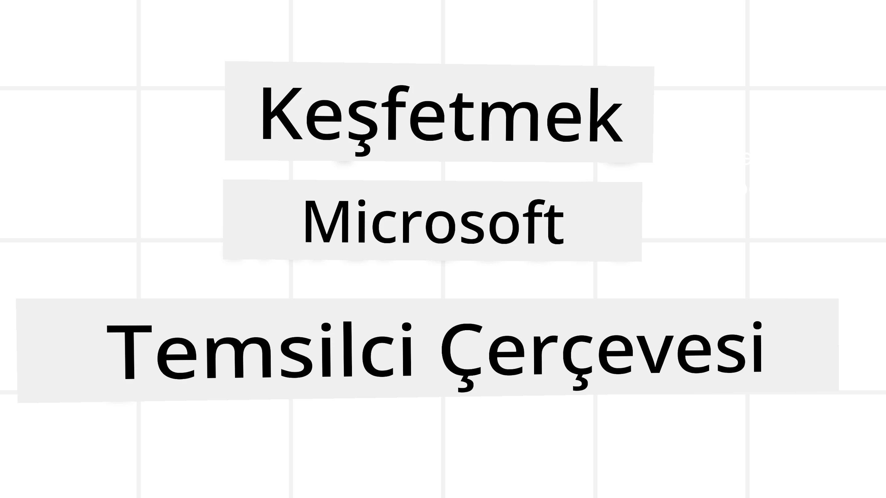
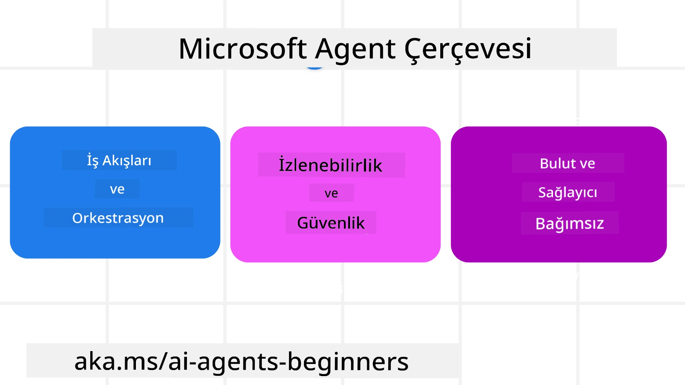
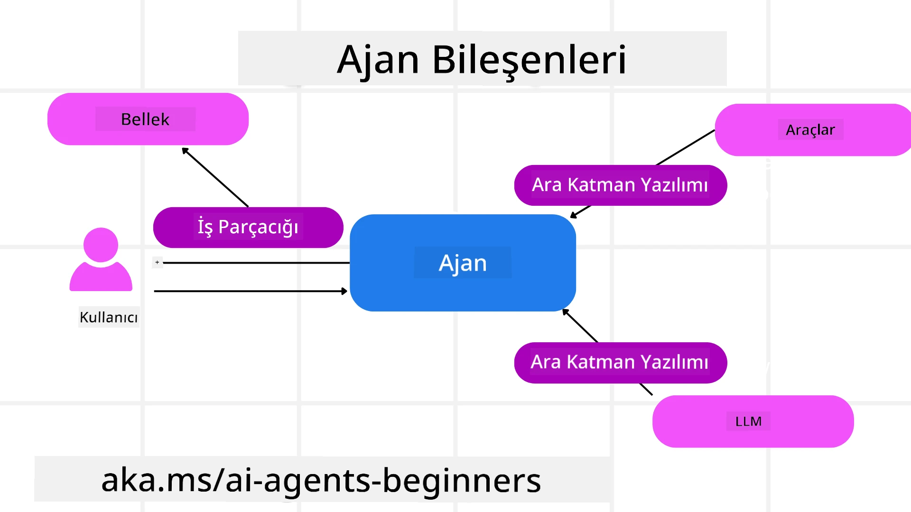

<!--
CO_OP_TRANSLATOR_METADATA:
{
  "original_hash": "19c4dab375acbc733855cc7f2f04edbc",
  "translation_date": "2025-10-02T14:05:43+00:00",
  "source_file": "14-microsoft-agent-framework/README.md",
  "language_code": "tr"
}
-->
# Microsoft Agent Framework'ü Keşfetmek



### Giriş

Bu ders şunları kapsayacak:

- Microsoft Agent Framework'ü Anlamak: Temel Özellikler ve Değer  
- Microsoft Agent Framework'ün Temel Kavramlarını Keşfetmek
- MAF'ı Semantic Kernel ve AutoGen ile Karşılaştırmak: Geçiş Rehberi

## Öğrenme Hedefleri

Bu dersi tamamladıktan sonra şunları yapmayı öğreneceksiniz:

- Microsoft Agent Framework kullanarak üretime hazır AI ajanları oluşturmak
- Microsoft Agent Framework'ün temel özelliklerini ajan kullanım senaryolarınıza uygulamak
- Mevcut ajan çerçevelerini ve araçlarını taşımak ve entegre etmek  

## Kod Örnekleri 

[Microsoft Agent Framework (MAF)](https://aka.ms/ai-agents-beginners/agent-framewrok) için kod örneklerini bu depoda `xx-python-agent-framework` ve `xx-dotnet-agent-framework` dosyaları altında bulabilirsiniz.

## Microsoft Agent Framework'ü Anlamak



[Microsoft Agent Framework (MAF)](https://aka.ms/ai-agents-beginners/agent-framewrok), Semantic Kernel ve AutoGen'den elde edilen deneyim ve öğrenimlerin üzerine inşa edilmiştir. Hem üretim hem de araştırma ortamlarında görülen geniş çeşitlilikteki ajan kullanım senaryolarını ele almak için esneklik sunar, bunlar arasında:

- **Sıralı Ajan Orkestrasyonu**, adım adım iş akışlarının gerektiği senaryolar.
- **Eşzamanlı Orkestrasyon**, ajanların aynı anda görevleri tamamlaması gereken senaryolar.
- **Grup Sohbet Orkestrasyonu**, ajanların bir görev üzerinde birlikte çalışabileceği senaryolar.
- **Görev Devri Orkestrasyonu**, ajanların alt görevler tamamlandıkça görevleri birbirine devrettiği senaryolar.
- **Manyetik Orkestrasyon**, bir yönetici ajanın görev listesini oluşturduğu ve düzenlediği, alt ajanların koordinasyonunu sağlayarak görevi tamamladığı senaryolar.

Üretimde AI ajanları sunmak için MAF ayrıca şu özellikleri içerir:

- **Gözlemlenebilirlik**, OpenTelemetry kullanımıyla AI ajanının her eylemini, araç çağrısını, orkestrasyon adımlarını, akıl yürütme akışlarını ve Azure AI Foundry panoları üzerinden performans izlemeyi içerir.
- **Güvenlik**, ajanların Azure AI Foundry üzerinde yerel olarak barındırılmasıyla sağlanır; bu, rol tabanlı erişim, özel veri işleme ve yerleşik içerik güvenliği gibi güvenlik kontrollerini içerir.
- **Dayanıklılık**, ajan iş parçacıkları ve iş akışlarının duraklatılmasını, devam ettirilmesini ve hatalardan kurtarılmasını sağlar, bu da daha uzun süreli işlemleri mümkün kılar.
- **Kontrol**, insan müdahalesi gerektiren iş akışlarını destekler, burada görevler insan onayı gerektirecek şekilde işaretlenir.

Microsoft Agent Framework ayrıca şu yollarla birlikte çalışabilir olmaya odaklanmıştır:

- **Bulut Bağımsızlığı** - Ajanlar konteynerlerde, şirket içinde ve farklı bulutlar arasında çalışabilir.
- **Sağlayıcı Bağımsızlığı** - Ajanlar, Azure OpenAI ve OpenAI dahil olmak üzere tercih ettiğiniz SDK aracılığıyla oluşturulabilir.
- **Açık Standartlarla Entegrasyon** - Ajanlar, diğer ajanları ve araçları keşfetmek ve kullanmak için Agent-to-Agent (A2A) ve Model Context Protocol (MCP) gibi protokolleri kullanabilir.
- **Eklentiler ve Bağlayıcılar** - Microsoft Fabric, SharePoint, Pinecone ve Qdrant gibi veri ve bellek hizmetlerine bağlantılar yapılabilir.

Şimdi bu özelliklerin Microsoft Agent Framework'ün bazı temel kavramlarına nasıl uygulandığına bakalım.

## Microsoft Agent Framework'ün Temel Kavramları

### Ajanlar



**Ajan Oluşturma**

Ajan oluşturma, çıkarım hizmetini (LLM Sağlayıcı), AI ajanın takip etmesi gereken bir dizi talimatı ve atanmış bir `name` tanımlayarak yapılır:

```python
agent = AzureOpenAIChatClient(credential=AzureCliCredential()).create_agent( instructions="You are good at recommending trips to customers based on their preferences.", name="TripRecommender" )
```

Yukarıdaki örnek `Azure OpenAI` kullanıyor, ancak ajanlar `Azure AI Foundry Agent Service` dahil olmak üzere çeşitli hizmetler kullanılarak oluşturulabilir:

```python
AzureAIAgentClient(async_credential=credential).create_agent( name="HelperAgent", instructions="You are a helpful assistant." ) as agent
```

OpenAI `Responses`, `ChatCompletion` API'leri

```python
agent = OpenAIResponsesClient().create_agent( name="WeatherBot", instructions="You are a helpful weather assistant.", )
```

```python
agent = OpenAIChatClient().create_agent( name="HelpfulAssistant", instructions="You are a helpful assistant.", )
```

veya A2A protokolü kullanılarak uzak ajanlar:

```python
agent = A2AAgent( name=agent_card.name, description=agent_card.description, agent_card=agent_card, url="https://your-a2a-agent-host" )
```

**Ajanları Çalıştırma**

Ajanlar, ya akışsız ya da akışlı yanıtlar için `.run` veya `.run_stream` yöntemleri kullanılarak çalıştırılır.

```python
result = await agent.run("What are good places to visit in Amsterdam?")
print(result.text)
```

```python
async for update in agent.run_stream("What are the good places to visit in Amsterdam?"):
    if update.text:
        print(update.text, end="", flush=True)

```

Her ajan çalıştırması, ajan tarafından kullanılan `max_tokens`, ajan tarafından çağrılabilecek `tools` ve hatta ajan için kullanılan `model` gibi parametreleri özelleştirme seçeneklerine sahip olabilir.

Bu, belirli modellerin veya araçların bir kullanıcının görevini tamamlamak için gerekli olduğu durumlarda faydalıdır.

**Araçlar**

Araçlar hem ajan tanımlanırken:

```python
def get_attractions( location: Annotated[str, Field(description="The location to get the top tourist attractions for")], ) -> str: """Get the top tourist attractions for a given location.""" return f"The top attractions for {location} are." 


# When creating a ChatAgent directly 

agent = ChatAgent( chat_client=OpenAIChatClient(), instructions="You are a helpful assistant", tools=[get_attractions]

```

hem de ajan çalıştırılırken tanımlanabilir:

```python

result1 = await agent.run( "What's the best place to visit in Seattle?", tools=[get_attractions] # Tool provided for this run only )
```

**Ajan İş Parçacıkları**

Ajan iş parçacıkları, çoklu dönüş konuşmalarını yönetmek için kullanılır. İş parçacıkları şu yollarla oluşturulabilir:

- `get_new_thread()` kullanılarak, iş parçacığının zaman içinde kaydedilmesini sağlar.
- Bir ajan çalıştırıldığında otomatik olarak bir iş parçacığı oluşturulur ve iş parçacığı yalnızca mevcut çalıştırma sırasında geçerli olur.

Bir iş parçacığı oluşturmak için kod şu şekilde görünür:

```python
# Create a new thread. 
thread = agent.get_new_thread() # Run the agent with the thread. 
response = await agent.run("Hello, I am here to help you book travel. Where would you like to go?", thread=thread)

```

Daha sonra iş parçacığını daha sonra kullanmak üzere saklamak için serileştirebilirsiniz:

```python
# Create a new thread. 
thread = agent.get_new_thread() 

# Run the agent with the thread. 

response = await agent.run("Hello, how are you?", thread=thread) 

# Serialize the thread for storage. 

serialized_thread = await thread.serialize() 

# Deserialize the thread state after loading from storage. 

resumed_thread = await agent.deserialize_thread(serialized_thread)
```

**Ajan Ara Yazılımı**

Ajanlar, kullanıcıların görevlerini tamamlamak için araçlar ve LLM'lerle etkileşimde bulunur. Belirli senaryolarda, bu etkileşimler arasında bir işlem gerçekleştirmek veya izlemek isteyebiliriz. Ajan ara yazılımı bunu yapmamıza olanak tanır:

*Fonksiyon Ara Yazılımı*

Bu ara yazılım, ajan ile çağıracağı bir fonksiyon/araç arasında bir işlem gerçekleştirmemize olanak tanır. Bunun kullanılacağı bir örnek, fonksiyon çağrısında bazı günlük kaydı yapmak istediğinizde olabilir.

Aşağıdaki kodda `next`, bir sonraki ara yazılımın mı yoksa gerçek fonksiyonun mu çağrılacağını tanımlar.

```python
async def logging_function_middleware(
    context: FunctionInvocationContext,
    next: Callable[[FunctionInvocationContext], Awaitable[None]],
) -> None:
    """Function middleware that logs function execution."""
    # Pre-processing: Log before function execution
    print(f"[Function] Calling {context.function.name}")

    # Continue to next middleware or function execution
    await next(context)

    # Post-processing: Log after function execution
    print(f"[Function] {context.function.name} completed")
```

*Sohbet Ara Yazılımı*

Bu ara yazılım, ajan ile LLM arasındaki istekler arasında bir işlem gerçekleştirmemize veya bir işlem kaydetmemize olanak tanır.

Bu, AI hizmetine gönderilen `messages` gibi önemli bilgileri içerir.

```python
async def logging_chat_middleware(
    context: ChatContext,
    next: Callable[[ChatContext], Awaitable[None]],
) -> None:
    """Chat middleware that logs AI interactions."""
    # Pre-processing: Log before AI call
    print(f"[Chat] Sending {len(context.messages)} messages to AI")

    # Continue to next middleware or AI service
    await next(context)

    # Post-processing: Log after AI response
    print("[Chat] AI response received")

```

**Ajan Belleği**

`Agentic Memory` dersinde ele alındığı gibi, bellek, ajanın farklı bağlamlar üzerinde çalışmasını sağlamak için önemli bir unsurdur. MAF, birkaç farklı bellek türü sunar:

*Bellek Depolama*

Bu, uygulama çalışma süresi boyunca iş parçacıklarında saklanan bellektir.

```python
# Create a new thread. 
thread = agent.get_new_thread() # Run the agent with the thread. 
response = await agent.run("Hello, I am here to help you book travel. Where would you like to go?", thread=thread)
```

*Kalıcı Mesajlar*

Bu bellek, farklı oturumlar arasında konuşma geçmişini saklamak için kullanılır. `chat_message_store_factory` kullanılarak tanımlanır:

```python
from agent_framework import ChatMessageStore

# Create a custom message store
def create_message_store():
    return ChatMessageStore()

agent = ChatAgent(
    chat_client=OpenAIChatClient(),
    instructions="You are a Travel assistant.",
    chat_message_store_factory=create_message_store
)

```

*Dinamik Bellek*

Bu bellek, ajanlar çalıştırılmadan önce bağlama eklenir. Bu bellekler mem0 gibi harici hizmetlerde saklanabilir:

```python
from agent_framework.mem0 import Mem0Provider

# Using Mem0 for advanced memory capabilities
memory_provider = Mem0Provider(
    api_key="your-mem0-api-key",
    user_id="user_123",
    application_id="my_app"
)

agent = ChatAgent(
    chat_client=OpenAIChatClient(),
    instructions="You are a helpful assistant with memory.",
    context_providers=memory_provider
)

```

**Ajan Gözlemlenebilirliği**

Gözlemlenebilirlik, güvenilir ve sürdürülebilir ajan sistemleri oluşturmak için önemlidir. MAF, daha iyi gözlemlenebilirlik sağlamak için OpenTelemetry ile izleme ve ölçüm entegrasyonu sunar.

```python
from agent_framework.observability import get_tracer, get_meter

tracer = get_tracer()
meter = get_meter()
with tracer.start_as_current_span("my_custom_span"):
    # do something
    pass
counter = meter.create_counter("my_custom_counter")
counter.add(1, {"key": "value"})
```

### İş Akışları

MAF, bir görevi tamamlamak için önceden tanımlanmış adımları sunar ve bu adımlarda AI ajanlarını bileşen olarak içerir.

İş akışları, daha iyi kontrol akışı sağlayan farklı bileşenlerden oluşur. İş akışları ayrıca **çoklu ajan orkestrasyonu** ve **kontrol noktası oluşturma** ile iş akışı durumlarını kaydetmeyi mümkün kılar.

Bir iş akışının temel bileşenleri şunlardır:

**Yürütücüler**

Yürütücüler, giriş mesajlarını alır, atanmış görevlerini yerine getirir ve ardından bir çıkış mesajı üretir. Bu, iş akışını daha büyük görevi tamamlamaya doğru ilerletir. Yürütücüler AI ajanı veya özel mantık olabilir.

**Kenarlar**

Kenarlar, bir iş akışındaki mesajların akışını tanımlamak için kullanılır. Bunlar şunlar olabilir:

*Doğrudan Kenarlar* - Yürütücüler arasında basit bire bir bağlantılar:

```python
from agent_framework import WorkflowBuilder

builder = WorkflowBuilder()
builder.add_edge(source_executor, target_executor)
builder.set_start_executor(source_executor)
workflow = builder.build()
```

*Koşullu Kenarlar* - Belirli bir koşul karşılandığında etkinleştirilir. Örneğin, otel odaları mevcut olmadığında bir yürütücü diğer seçenekleri önerebilir.

*Switch-case Kenarlar* - Mesajları tanımlı koşullara göre farklı yürütücülere yönlendirir. Örneğin, seyahat müşterisinin öncelikli erişimi varsa, görevleri başka bir iş akışı üzerinden ele alınır.

*Fan-out Kenarlar* - Bir mesajı birden fazla hedefe gönderir.

*Fan-in Kenarlar* - Farklı yürütücülerden birden fazla mesajı toplayarak bir hedefe gönderir.

**Olaylar**

İş akışlarına daha iyi gözlemlenebilirlik sağlamak için MAF, yürütme için yerleşik olaylar sunar:

- `WorkflowStartedEvent`  - İş akışı yürütmesi başlar
- `WorkflowOutputEvent` - İş akışı bir çıktı üretir
- `WorkflowErrorEvent` - İş akışı bir hata ile karşılaşır
- `ExecutorInvokeEvent`  - Yürütücü işlemeye başlar
- `ExecutorCompleteEvent`  - Yürütücü işlemeyi tamamlar
- `RequestInfoEvent` - Bir istek yapılır

## Diğer Çerçevelerden Geçiş (Semantic Kernel ve AutoGen)

### MAF ve Semantic Kernel Arasındaki Farklar

**Basitleştirilmiş Ajan Oluşturma**

Semantic Kernel, her ajan için bir Kernel örneği oluşturulmasını gerektirir. MAF, ana sağlayıcılar için uzantılar kullanarak daha basitleştirilmiş bir yaklaşım sunar.

```python
agent = AzureOpenAIChatClient(credential=AzureCliCredential()).create_agent( instructions="You are good at reccomending trips to customers based on their preferences.", name="TripRecommender" )
```

**Ajan İş Parçacığı Oluşturma**

Semantic Kernel, iş parçacıklarının manuel olarak oluşturulmasını gerektirir. MAF'da ajan doğrudan bir iş parçacığına atanır.

```python
thread = agent.get_new_thread() # Run the agent with the thread. 
```

**Araç Kaydı**

Semantic Kernel'de araçlar Kernel'e kaydedilir ve Kernel daha sonra ajana iletilir. MAF'da araçlar doğrudan ajan oluşturma sürecinde kaydedilir.

```python
agent = ChatAgent( chat_client=OpenAIChatClient(), instructions="You are a helpful assistant", tools=[get_attractions]
```

### MAF ve AutoGen Arasındaki Farklar

**Takımlar vs İş Akışları**

`Takımlar`, AutoGen'deki ajanlarla olay odaklı etkinlik yapısıdır. MAF, verileri yürütücülere grafik tabanlı bir mimari aracılığıyla yönlendiren `İş Akışları` kullanır.

**Araç Oluşturma**

AutoGen, ajanların çağırması için fonksiyonları sarmak amacıyla `FunctionTool` kullanır. MAF, benzer şekilde çalışan ancak her fonksiyon için şemaları otomatik olarak çıkaran @ai_function kullanır.

**Ajan Davranışı**

AutoGen'deki ajanlar varsayılan olarak tek dönüşlü ajanlardır, `max_tool_iterations` daha yüksek bir değere ayarlanmadıkça. MAF'daki `ChatAgent` varsayılan olarak çok dönüşlüdür, yani kullanıcının görevi tamamlanana kadar araçları çağırmaya devam eder.

## Kod Örnekleri 

Microsoft Agent Framework için kod örneklerini bu depoda `xx-python-agent-framework` ve `xx-dotnet-agent-framework` dosyaları altında bulabilirsiniz.

## Microsoft Agent Framework Hakkında Daha Fazla Sorunuz mu Var?

Diğer öğrenicilerle tanışmak, ofis saatlerine katılmak ve AI ajanlarıyla ilgili sorularınızı yanıtlamak için [Azure AI Foundry Discord](https://aka.ms/ai-agents/discord) topluluğuna katılın.

---

**Feragatname**:  
Bu belge, AI çeviri hizmeti [Co-op Translator](https://github.com/Azure/co-op-translator) kullanılarak çevrilmiştir. Doğruluk için çaba göstersek de, otomatik çevirilerin hata veya yanlışlık içerebileceğini lütfen unutmayın. Belgenin orijinal dili, yetkili kaynak olarak kabul edilmelidir. Kritik bilgiler için profesyonel insan çevirisi önerilir. Bu çevirinin kullanımından kaynaklanan yanlış anlamalar veya yanlış yorumlamalar için sorumluluk kabul etmiyoruz.