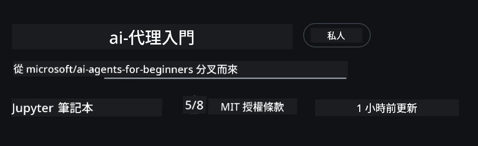
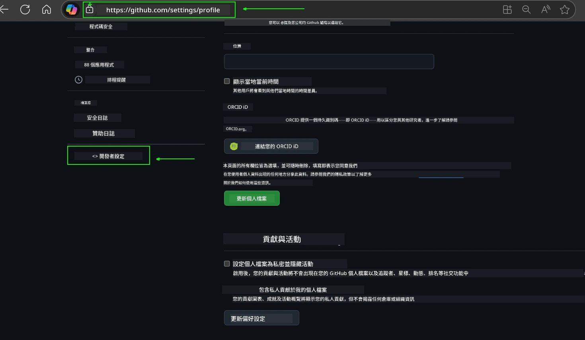
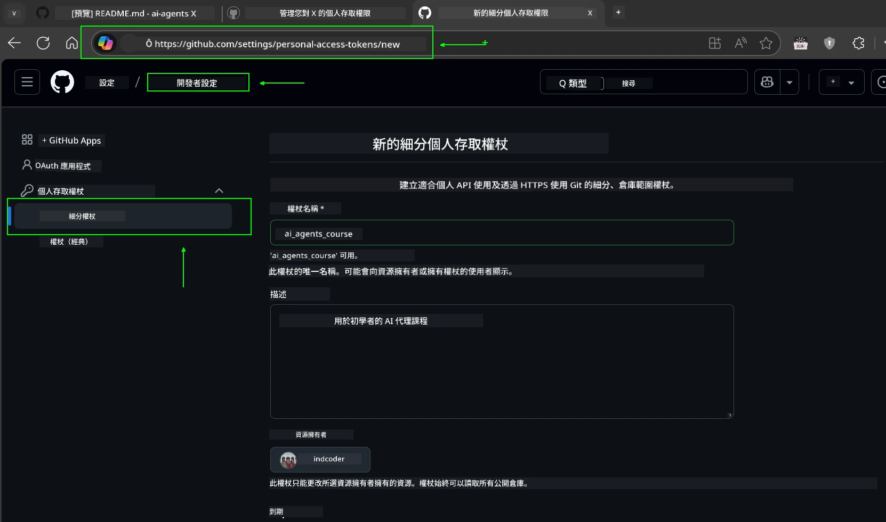
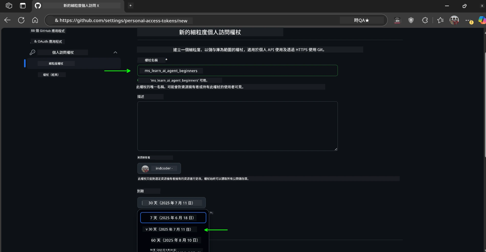
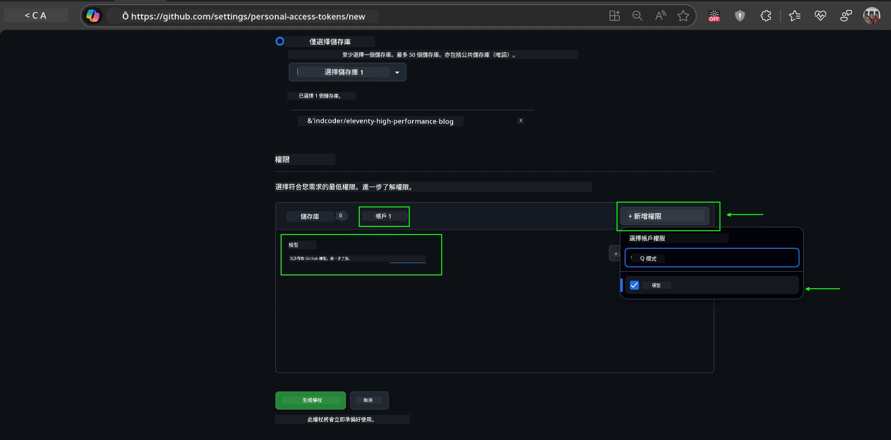
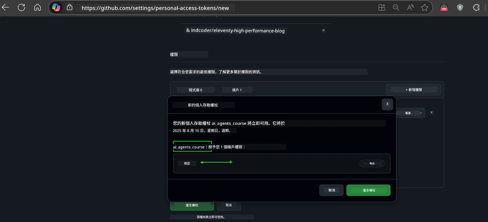
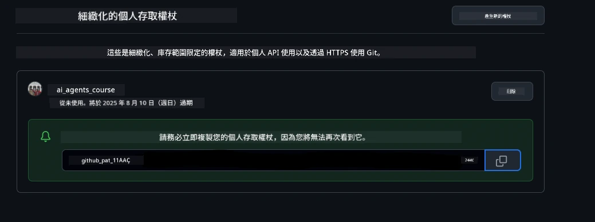
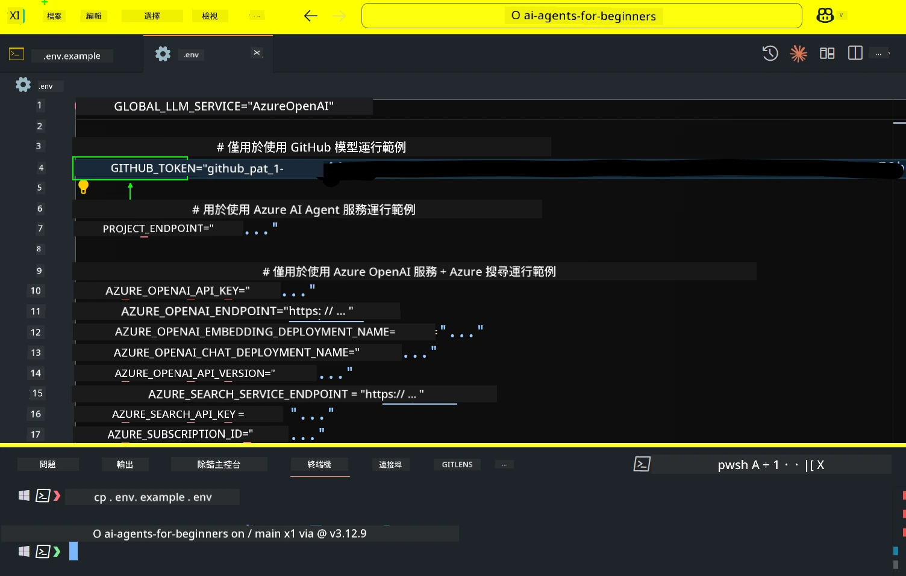

<!--
CO_OP_TRANSLATOR_METADATA:
{
  "original_hash": "63b1a8f6e840df15934935b728e569f0",
  "translation_date": "2025-12-03T13:59:16+00:00",
  "source_file": "00-course-setup/README.md",
  "language_code": "tw"
}
-->
# 課程設定

## 簡介

本課程將教您如何執行課程中的程式碼範例。

## 加入其他學習者並獲得幫助

在您開始複製您的倉庫之前，請加入 [AI Agents For Beginners Discord 頻道](https://aka.ms/ai-agents/discord)，以獲得設定上的幫助、課程相關問題的解答，或與其他學習者交流。

## 複製或分叉此倉庫

首先，請複製或分叉 GitHub 倉庫。這將建立您自己的課程材料版本，讓您可以執行、測試及調整程式碼！

您可以點擊以下連結來 <a href="https://github.com/microsoft/ai-agents-for-beginners/fork" target="_blank">分叉倉庫</a>

現在，您應該擁有此課程的分叉版本，連結如下：



### 淺層複製（建議用於工作坊 / Codespaces）

  >完整的倉庫可能很大（約 3 GB），當您下載完整的歷史記錄和所有檔案時。如果您只參加工作坊或只需要幾個課程資料夾，淺層複製（或稀疏複製）可以避免大部分的下載，僅保留最新的歷史記錄或跳過部分檔案。

#### 快速淺層複製 — 最小的歷史記錄，所有檔案

在以下指令中，將 `<your-username>` 替換為您的分叉 URL（或如果您偏好，使用上游 URL）。

若只複製最新的提交歷史記錄（下載量小）：

```bash|powershell
git clone --depth 1 https://github.com/<your-username>/ai-agents-for-beginners.git
```

若要複製特定分支：

```bash|powershell
git clone --depth 1 --branch <branch-name> https://github.com/<your-username>/ai-agents-for-beginners.git
```

#### 部分（稀疏）複製 — 最小的檔案 + 只選擇特定資料夾

此方法使用部分複製和稀疏檢出（需要 Git 2.25+，建議使用支援部分複製的現代 Git）：

```bash|powershell
git clone --depth 1 --filter=blob:none --sparse https://github.com/<your-username>/ai-agents-for-beginners.git
```

進入倉庫資料夾：

```bash|powershell
cd ai-agents-for-beginners
```

然後指定您需要的資料夾（以下範例顯示兩個資料夾）：

```bash|powershell
git sparse-checkout set 00-course-setup 01-intro-to-ai-agents
```

複製並驗證檔案後，如果您只需要檔案並希望釋放空間（不需要 git 歷史記錄），請刪除倉庫的元數據（💀不可逆 — 您將失去所有 Git 功能：無法提交、拉取、推送或存取歷史記錄）。

```bash
# zsh/bash
rm -rf .git
```

```powershell
# PowerShell
Remove-Item -Recurse -Force .git
```

#### 使用 GitHub Codespaces（建議避免本地大型下載）

- 通過 [GitHub UI](https://github.com/codespaces) 為此倉庫建立新的 Codespace。

- 在新建立的 Codespace 的終端中，執行上述的淺層/稀疏複製指令，僅將您需要的課程資料夾帶入 Codespace 工作區。
- 選擇性：在 Codespaces 中複製後，移除 .git 以釋放額外空間（請參考上述移除指令）。
- 注意：如果您偏好直接在 Codespaces 中開啟倉庫（不額外複製），請注意 Codespaces 會構建開發容器環境，可能仍會配置超出您需求的內容。在新的 Codespace 中複製淺層版本可讓您更好地控制磁碟使用量。

#### 提示

- 如果您想編輯/提交，請始終替換為您的分叉 URL。
- 如果您之後需要更多的歷史記錄或檔案，您可以拉取它們或調整稀疏檢出以包含其他資料夾。

## 執行程式碼

本課程提供一系列 Jupyter Notebook，讓您能夠親身體驗如何建立 AI Agents。

程式碼範例使用以下方式：

**需要 GitHub 帳號 - 免費**：

1) Semantic Kernel Agent Framework + GitHub Models Marketplace。標記為 (semantic-kernel.ipynb)
2) AutoGen Framework + GitHub Models Marketplace。標記為 (autogen.ipynb)

**需要 Azure 訂閱**：

3) Azure AI Foundry + Azure AI Agent Service。標記為 (azureaiagent.ipynb)

我們鼓勵您嘗試所有三種類型的範例，看看哪一種最適合您。

無論您選擇哪一種，都將決定您需要遵循的設定步驟：

## 系統需求

- Python 3.12+
  - **注意**：如果您尚未安裝 Python3.12，請確保安裝它。然後使用 python3.12 建立您的 venv，以確保從 requirements.txt 檔案中安裝正確的版本。
  
    >範例

    建立 Python venv 目錄：

    ```bash|powershell
    python -m venv venv
    ```

    然後啟動 venv 環境：

    ```bash
    # zsh/bash
    source venv/bin/activate
    ```
  
    ```dos
    # Command Prompt for Windows
    venv\Scripts\activate
    ```

- .NET 10+: 對於使用 .NET 的範例程式碼，請確保安裝 [.NET 10 SDK](https://dotnet.microsoft.com/download/dotnet/10.0) 或更新版本。然後檢查您已安裝的 .NET SDK 版本：

    ```bash|powershell
    dotnet --list-sdks
    ```

- GitHub 帳號 - 用於存取 GitHub Models Marketplace
- Azure 訂閱 - 用於存取 Azure AI Foundry
- Azure AI Foundry 帳號 - 用於存取 Azure AI Agent Service

我們在此倉庫的根目錄中包含了一個 `requirements.txt` 檔案，其中列出了執行程式碼範例所需的所有 Python 套件。

您可以在終端中於倉庫根目錄執行以下指令來安裝它們：

```bash|powershell
pip install -r requirements.txt
```

我們建議建立 Python 虛擬環境以避免任何衝突和問題。

## 設定 VSCode

確保您在 VSCode 中使用正確版本的 Python。


## 使用 GitHub Models 的範例設定 

### 步驟 1：取得您的 GitHub 個人存取權杖 (PAT)

本課程利用 GitHub Models Marketplace，提供免費存取大型語言模型 (LLMs)，您將使用這些模型來建立 AI Agents。

要使用 GitHub Models，您需要建立 [GitHub 個人存取權杖](https://docs.github.com/en/authentication/keeping-your-account-and-data-secure/managing-your-personal-access-tokens)。

您可以前往您的 GitHub 帳號中的 <a href="https://github.com/settings/personal-access-tokens" target="_blank">個人存取權杖設定</a> 來完成此操作。

請遵循 [最低權限原則](https://docs.github.com/en/get-started/learning-to-code/storing-your-secrets-safely) 建立您的權杖。這意味著您應僅賦予權杖執行本課程程式碼範例所需的權限。

1. 在螢幕左側選擇 `Fine-grained tokens` 選項，進入 **開發者設定**。

   

   然後選擇 `Generate new token`。

   

2. 為您的權杖輸入一個描述性名稱，反映其用途，方便日後識別。

    🔐 權杖有效期建議

    建議有效期：30 天
    為了更安全，您可以選擇更短的期限，例如 7 天 🛡️
    這是一個很好的方式來設定個人目標，並在學習動力高漲時完成課程 🚀。

    

3. 將權杖的範圍限制在此倉庫的分叉版本。

    

4. 限制權杖的權限：在 **Permissions** 下，點擊 **Account** 標籤，然後點擊 "+ Add permissions" 按鈕。下拉選單會出現。請搜尋 **Models** 並勾選它。

    

5. 在生成權杖之前，請確認所需的權限。 

6. 在生成權杖之前，請確保您已準備好將權杖存放在安全的地方，例如密碼管理器保險庫，因為生成後將無法再次查看。 

複製您剛剛建立的新權杖。您現在需要將此權杖添加到本課程包含的 `.env` 檔案中。

### 步驟 2：建立您的 `.env` 檔案

要建立 `.env` 檔案，請在終端中執行以下指令。

```bash
# zsh/bash
cp .env.example .env
```

```powershell
# PowerShell
Copy-Item .env.example .env
```

這將複製範例檔案並在您的目錄中建立 `.env`，您需要在其中填寫環境變數的值。

複製您的權杖後，使用您喜愛的文字編輯器打開 `.env` 檔案，並將您的權杖貼到 `GITHUB_TOKEN` 欄位中。



現在，您應該可以執行本課程的程式碼範例。

## 使用 Azure AI Foundry 和 Azure AI Agent Service 的範例設定

### 步驟 1：取得您的 Azure 專案端點

請按照此處的步驟建立 Azure AI Foundry 中的 hub 和專案：[Hub 資源概述](https://learn.microsoft.com/azure/ai-foundry/concepts/ai-resources)

建立專案後，您需要取得專案的連接字串。

您可以在 Azure AI Foundry 入口網站的專案 **概述** 頁面找到此資訊。


### 步驟 2：建立您的 `.env` 檔案

要建立 `.env` 檔案，請在終端中執行以下指令。

```bash
# zsh/bash
cp .env.example .env
```

```powershell
# PowerShell
Copy-Item .env.example .env
```

這將複製範例檔案並在您的目錄中建立 `.env`，您需要在其中填寫環境變數的值。

複製您的權杖後，使用您喜愛的文字編輯器打開 `.env` 檔案，並將您的權杖貼到 `PROJECT_ENDPOINT` 欄位中。

### 步驟 3：登入 Azure

作為安全最佳實踐，我們將使用 [無密鑰認證](https://learn.microsoft.com/azure/developer/ai/keyless-connections?tabs=csharp%2Cazure-cli?WT.mc_id=academic-105485-koreyst) 來使用 Microsoft Entra ID 認證登入 Azure OpenAI。

接下來，打開終端並執行 `az login --use-device-code` 以登入您的 Azure 帳號。

登入後，在終端中選擇您的訂閱。

## 額外的環境變數 - Azure Search 和 Azure OpenAI 

針對 Agentic RAG 課程 - 第 5 課 - 有些範例使用 Azure Search 和 Azure OpenAI。

如果您想執行這些範例，您需要在 `.env` 檔案中添加以下環境變數：

### 概述頁面（專案）

- `AZURE_SUBSCRIPTION_ID` - 在專案 **概述** 頁面的 **專案詳細資訊** 中檢查。

- `AZURE_AI_PROJECT_NAME` - 查看專案 **概述** 頁面頂部。

- `AZURE_OPENAI_SERVICE` - 在 **概述** 頁面的 **包含的功能** 標籤中找到 **Azure OpenAI Service**。

### 管理中心

- `AZURE_OPENAI_RESOURCE_GROUP` - 在 **管理中心** 的 **概述** 頁面中，前往 **專案屬性**。

- `GLOBAL_LLM_SERVICE` - 在 **連接的資源** 下，找到 **Azure AI Services** 連接名稱。如果未列出，請檢查 **Azure 入口網站** 中的資源群組以找到 AI Services 資源名稱。

### 模型 + 端點頁面

- `AZURE_OPENAI_EMBEDDING_DEPLOYMENT_NAME` - 選擇您的嵌入模型（例如 `text-embedding-ada-002`），並記下模型詳細資訊中的 **部署名稱**。

- `AZURE_OPENAI_CHAT_DEPLOYMENT_NAME` - 選擇您的聊天模型（例如 `gpt-4o-mini`），並記下模型詳細資訊中的 **部署名稱**。

### Azure 入口網站

- `AZURE_OPENAI_ENDPOINT` - 找到 **Azure AI services**，點擊它，然後前往 **資源管理**，**金鑰和端點**，向下滾動到 "Azure OpenAI endpoints"，複製標記為 "Language APIs" 的端點。

- `AZURE_OPENAI_API_KEY` - 在同一頁面中，複製 KEY 1 或 KEY 2。

- `AZURE_SEARCH_SERVICE_ENDPOINT` - 找到您的 **Azure AI Search** 資源，點擊它，然後查看 **概述**。

- `AZURE_SEARCH_API_KEY` - 然後前往 **設定**，再到 **金鑰**，複製主要或次要管理金鑰。

### 外部網頁

- `AZURE_OPENAI_API_VERSION` - 訪問 [API 版本生命週期](https://learn.microsoft.com/azure/ai-services/openai/api-version-deprecation#latest-ga-api-release) 頁面，查看 **最新 GA API 發佈**。

### 設定無密鑰認證

我們將使用 Azure OpenAI 的無密鑰連接，而不是硬編碼您的憑證。為此，我們將匯入 `DefaultAzureCredential`，稍後調用 `DefaultAzureCredential` 函數以獲取憑證。

```python
# Python
from azure.identity import DefaultAzureCredential, InteractiveBrowserCredential
```

## 卡住了嗎？
如果您在執行此設置時遇到任何問題，請加入我們的 <a href="https://discord.gg/kzRShWzttr" target="_blank">Azure AI 社群 Discord</a> 或 <a href="https://github.com/microsoft/ai-agents-for-beginners/issues?WT.mc_id=academic-105485-koreyst" target="_blank">建立一個問題</a>。

## 下一課

您現在已準備好運行本課程的程式碼。祝您在學習 AI Agents 的世界中收穫滿滿！

[AI Agents 簡介與應用案例](../01-intro-to-ai-agents/README.md)

---

<!-- CO-OP TRANSLATOR DISCLAIMER START -->
**免責聲明**：  
本文件使用 AI 翻譯服務 [Co-op Translator](https://github.com/Azure/co-op-translator) 進行翻譯。雖然我們致力於提供準確的翻譯，但請注意，自動翻譯可能包含錯誤或不準確之處。原始文件的母語版本應被視為權威來源。對於重要資訊，建議使用專業人工翻譯。我們對因使用此翻譯而引起的任何誤解或誤釋不承擔責任。
<!-- CO-OP TRANSLATOR DISCLAIMER END -->