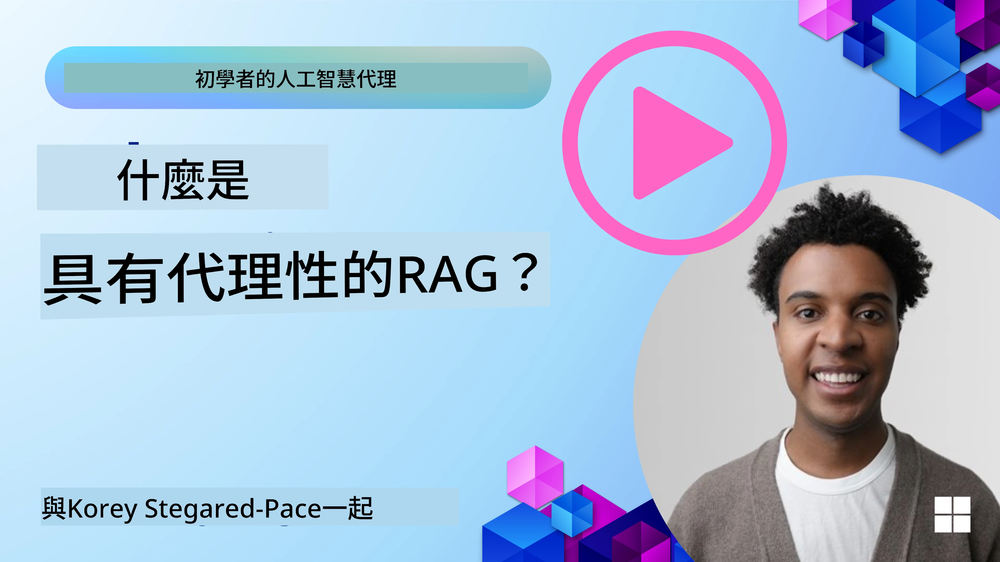
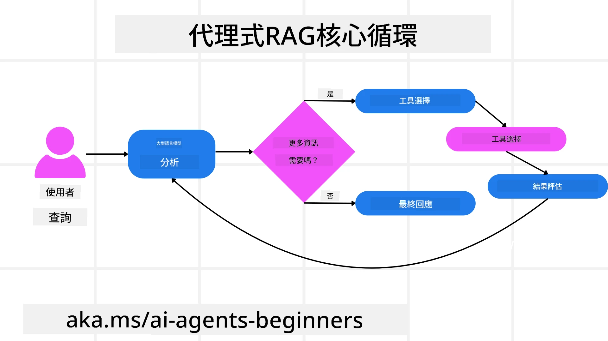
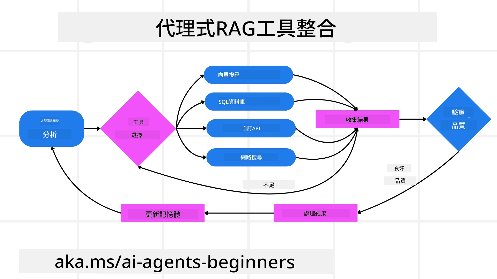
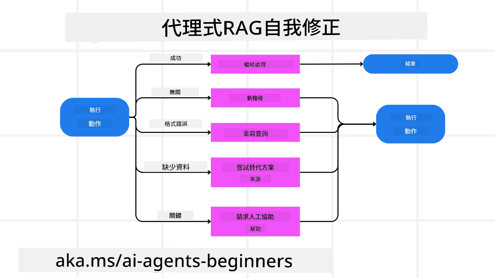
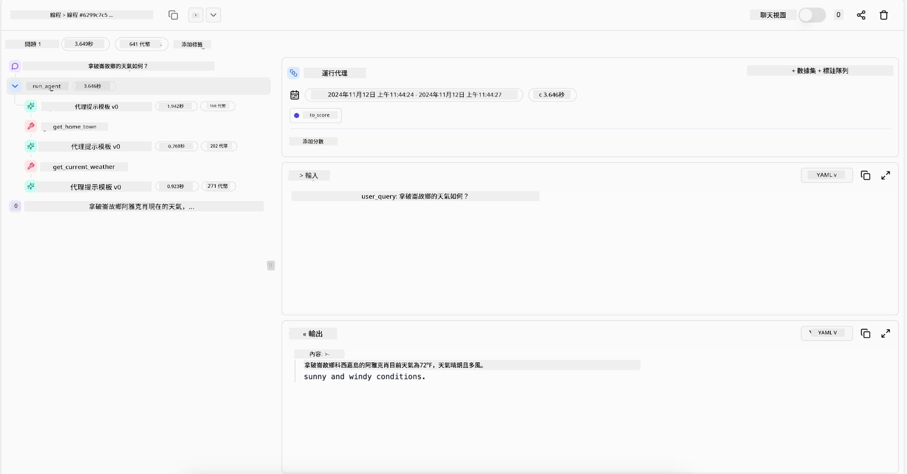

<!--
CO_OP_TRANSLATOR_METADATA:
{
  "original_hash": "0ebf6b2290db55dbf2d10cc49655523b",
  "translation_date": "2025-09-30T06:30:26+00:00",
  "source_file": "05-agentic-rag/README.md",
  "language_code": "tw"
}
-->

> _(點擊上方圖片觀看本課程影片)_

# Agentic RAG

本課程全面介紹了「Agentic Retrieval-Augmented Generation (Agentic RAG)」，這是一種新興的人工智慧範式，透過大型語言模型 (LLMs) 自主規劃下一步行動，同時從外部資源中提取資訊。與靜態的「檢索後閱讀」模式不同，Agentic RAG 涉及 LLM 的多次迭代調用，並穿插工具或函數調用以及結構化輸出。系統會評估結果、改進查詢、在必要時調用額外工具，並持續此循環直到達成令人滿意的解決方案。

## 課程介紹

本課程將涵蓋以下內容：

- **了解 Agentic RAG：** 探索 AI 中的新興範式，透過大型語言模型 (LLMs) 自主規劃下一步行動，同時從外部數據源中提取資訊。
- **掌握迭代式 Maker-Checker 模式：** 理解 LLM 的迭代調用循環，穿插工具或函數調用以及結構化輸出，旨在提高正確性並處理不良查詢。
- **探索實際應用：** 確定 Agentic RAG 的適用場景，例如以正確性為優先的環境、複雜的數據庫交互以及延展性工作流程。

## 學習目標

完成本課程後，您將能夠了解以下內容：

- **理解 Agentic RAG：** 探索 AI 中的新興範式，透過大型語言模型 (LLMs) 自主規劃下一步行動，同時從外部數據源中提取資訊。
- **迭代式 Maker-Checker 模式：** 掌握 LLM 的迭代調用循環，穿插工具或函數調用以及結構化輸出，旨在提高正確性並處理不良查詢。
- **掌控推理過程：** 理解系統如何掌控其推理過程，決定如何解決問題，而不依賴預定的路徑。
- **工作流程：** 了解代理模型如何自主決定檢索市場趨勢報告、識別競爭者數據、關聯內部銷售指標、綜合分析結果並評估策略。
- **迭代循環、工具整合與記憶：** 探索系統如何依賴迴圈式交互模式，跨步驟保持狀態和記憶，避免重複循環並做出明智決策。
- **處理失敗模式與自我修正：** 探索系統的強大自我修正機制，包括迭代和重新查詢、使用診斷工具以及依賴人類監督。
- **代理的界限：** 理解 Agentic RAG 的限制，聚焦於特定領域的自主性、基礎設施依賴以及遵守安全規範。
- **實際應用場景與價值：** 確定 Agentic RAG 的適用場景，例如以正確性為優先的環境、複雜的數據庫交互以及延展性工作流程。
- **治理、透明性與信任：** 探索治理與透明性的重要性，包括可解釋的推理、偏差控制以及人類監督。

## 什麼是 Agentic RAG？

Agentic Retrieval-Augmented Generation (Agentic RAG) 是一種新興的人工智慧範式，透過大型語言模型 (LLMs) 自主規劃下一步行動，同時從外部資源中提取資訊。與靜態的「檢索後閱讀」模式不同，Agentic RAG 涉及 LLM 的多次迭代調用，並穿插工具或函數調用以及結構化輸出。系統會評估結果、改進查詢、在必要時調用額外工具，並持續此循環直到達成令人滿意的解決方案。這種迭代的「Maker-Checker」模式能提高正確性、處理不良查詢並確保高品質結果。

系統主動掌控其推理過程，重寫失敗的查詢、選擇不同的檢索方法並整合多種工具，例如 Azure AI Search 的向量搜索、SQL 數據庫或自定義 API，然後再最終確定答案。代理系統的獨特之處在於其能掌控推理過程。傳統的 RAG 實現依賴預定的路徑，而代理系統則根據所獲得資訊的質量自主決定步驟順序。

## 定義 Agentic Retrieval-Augmented Generation (Agentic RAG)

Agentic Retrieval-Augmented Generation (Agentic RAG) 是人工智慧開發中的新興範式，LLMs 不僅能從外部數據源中提取資訊，還能自主規劃下一步行動。與靜態的「檢索後閱讀」模式或精心設計的提示序列不同，Agentic RAG 涉及 LLM 的迭代調用循環，穿插工具或函數調用以及結構化輸出。在每一步，系統都會評估所獲得的結果，決定是否改進查詢、調用額外工具，並持續此循環直到達成令人滿意的解決方案。

這種迭代的「Maker-Checker」操作模式旨在提高正確性、處理結構化數據庫（例如 NL2SQL）的不良查詢並確保平衡且高品質的結果。系統不僅依賴精心設計的提示鏈，還能主動掌控其推理過程。它能重寫失敗的查詢、選擇不同的檢索方法並整合多種工具，例如 Azure AI Search 的向量搜索、SQL 數據庫或自定義 API，然後再最終確定答案。這樣就不需要過於複雜的編排框架，而是透過相對簡單的「LLM 調用 → 工具使用 → LLM 調用 → …」循環即可產生精緻且有根據的輸出。

## 掌控推理過程

使系統具備「代理性」的區別特質在於其能掌控推理過程。傳統的 RAG 實現通常依賴人類預定模型的路徑：一個思維鏈，概述需要檢索的內容及時間。
但真正的代理系統能內部決定如何解決問題。它不僅僅執行腳本，而是根據所獲得資訊的質量自主決定步驟順序。
例如，當被要求制定產品上市策略時，它不僅僅依賴提示來詳細說明整個研究和決策工作流程。相反，代理模型會自主決定：

1. 使用 Bing Web Grounding 檢索當前市場趨勢報告。
2. 使用 Azure AI Search 識別相關競爭者數據。
3. 使用 Azure SQL Database 關聯歷史內部銷售指標。
4. 透過 Azure OpenAI Service 綜合分析結果形成連貫的策略。
5. 評估策略是否存在漏洞或不一致，必要時進行另一輪檢索。
所有這些步驟——改進查詢、選擇資源、迭代直到對答案「滿意」——均由模型決定，而非由人類預先編寫腳本。

## 迭代循環、工具整合與記憶

代理系統依賴迴圈式交互模式：

- **初始調用：** 使用者的目標（即使用者提示）呈現給 LLM。
- **工具調用：** 如果模型識別出缺失資訊或指令模糊，它會選擇工具或檢索方法，例如向量數據庫查詢（例如 Azure AI Search Hybrid search 對私有數據進行檢索）或結構化 SQL 調用，以獲取更多上下文。
- **評估與改進：** 在審查返回的數據後，模型決定資訊是否足夠。如果不足，它會改進查詢、嘗試不同工具或調整方法。
- **重複直到滿意：** 此循環持續進行，直到模型認為已獲得足夠的清晰度和證據，能提供最終的、經過充分推理的回應。
- **記憶與狀態：** 系統能跨步驟保持狀態和記憶，能回憶之前的嘗試及其結果，避免重複循環並在過程中做出更明智的決策。

隨著時間推移，這種模式能創造出一種逐步演進的理解，使模型能夠在不需要人類不斷介入或重塑提示的情況下，完成複雜的多步驟任務。

## 處理失敗模式與自我修正

Agentic RAG 的自主性還包括強大的自我修正機制。當系統遇到瓶頸，例如檢索到無關文件或遇到不良查詢時，它能：

- **迭代與重新查詢：** 模型不會返回低價值的回應，而是嘗試新的搜索策略、重寫數據庫查詢或查看替代數據集。
- **使用診斷工具：** 系統可能調用額外的函數，幫助其調試推理步驟或確認檢索數據的正確性。像 Azure AI Tracing 這樣的工具對於實現強大的可觀察性和監控非常重要。
- **依賴人類監督：** 對於高風險或反覆失敗的場景，模型可能會標記不確定性並請求人類指導。一旦人類提供了糾正性反饋，模型能在後續過程中吸收該教訓。

這種迭代且動態的方式使模型能夠持續改進，確保它不僅僅是一個一次性系統，而是一個能在特定會話中從錯誤中學習的系統。

## 代理的界限

儘管在任務中具備自主性，Agentic RAG 並不等同於人工通用智慧。其「代理性」能力僅限於人類開發者提供的工具、數據源和政策。它無法自行創建工具或超越既定的領域界限。相反，它擅長於動態編排現有資源。
與更高級的 AI 形式相比，主要差異包括：

1. **特定領域的自主性：** Agentic RAG 系統專注於在已知領域內實現使用者定義的目標，採用查詢重寫或工具選擇等策略來改善結果。
2. **基礎設施依賴：** 系統的能力取決於開發者整合的工具和數據。它無法在沒有人工干預的情況下超越這些界限。
3. **遵守安全規範：** 道德準則、合規規則和業務政策仍然非常重要。代理的自由度始終受到安全措施和監督機制的限制（希望如此？）。

## 實際應用場景與價值

Agentic RAG 在需要迭代改進和精確性的場景中表現出色：

1. **以正確性為優先的環境：** 在合規檢查、法規分析或法律研究中，代理模型能反覆驗證事實、查詢多個來源並重寫查詢，直到產生經過徹底審核的答案。
2. **複雜的數據庫交互：** 在處理結構化數據時，查詢可能經常失敗或需要調整，系統能自主使用 Azure SQL 或 Microsoft Fabric OneLake 改進查詢，確保最終檢索符合使用者意圖。
3. **延展性工作流程：** 隨著新資訊的出現，長時間運行的會話可能會演變。Agentic RAG 能持續整合新數據，隨著對問題空間的了解加深而調整策略。

## 治理、透明性與信任

隨著這些系統在推理中變得更加自主，治理和透明性至關重要：

- **可解釋的推理：** 模型能提供其所做查詢、所檢索來源以及推理步驟的審計記錄。像 Azure AI Content Safety 和 Azure AI Tracing / GenAIOps 這樣的工具能幫助維持透明性並降低風險。
- **偏差控制與平衡檢索：** 開發者能調整檢索策略，確保考慮平衡且具代表性的數據來源，並定期審核輸出以檢測偏差或不平衡模式，使用 Azure Machine Learning 的自定義模型進行高級數據科學分析。
- **人類監督與合規：** 對於敏感任務，人類審查仍然必不可少。Agentic RAG 並不取代人類在高風險決策中的判斷，而是透過提供經過更徹底審核的選項來輔助人類。

擁有能提供清晰行動記錄的工具至關重要。沒有這些工具，調試多步驟過程可能非常困難。以下是 Literal AI（Chainlit 背後的公司）提供的代理運行示例：

## 結論

Agentic RAG 代表了 AI 系統在處理複雜且數據密集型任務方面的自然演進。透過採用迴圈式交互模式、自主選擇工具並改進查詢直到達成高品質結果，系統超越了靜態的提示執行，成為更具適應性和上下文感知的決策者。儘管仍受限於人類定義的基礎設施和道德準則，這些代理能力使企業和終端使用者能享受到更豐富、更動態且更有價值的 AI 交互。

### 對 Agentic RAG 有更多疑問？

加入 [Azure AI Foundry Discord](https://aka.ms/ai-agents/discord)，與其他學習者交流，參加辦公時間並解答您的 AI Agents 問題。

## 其他資源

- <a href="https://learn.microsoft.com/training/modules/use-own-data-azure-openai" target="_blank">使用 Azure OpenAI Service 實現檢索增強生成 (RAG)：了解如何使用您自己的數據與 Azure OpenAI Service。此 Microsoft Learn 模組提供了實現 RAG 的全面指南</a>
- <a href="https://learn.microsoft.com/azure/ai-studio/concepts/evaluation-approach-gen-ai" target="_blank">使用 Azure AI Foundry 評估生成式 AI 應用：本文涵蓋了基於公開數據集的模型評估與比較，包括代理 AI 應用和 RAG 架構</a>
- <a href="https://weaviate.io/blog/what-is-agentic-rag" target="_blank">什麼是 Agentic RAG | Weaviate</a>
- <a href="https://ragaboutit.com/agentic-rag-a-complete-guide-to-agent-based-retrieval-augmented-generation/" target="_blank">Agentic RAG：基於代理的檢索增強生成完整指南 – 來自 RAG 的最新消息</a>
- <a href="https://huggingface.co/learn/cookbook/agent_rag" target="_blank">Agentic RAG：透過查詢重構和自我查詢提升你的 RAG！Hugging Face 開源 AI 食譜</a>
- <a href="https://youtu.be/aQ4yQXeB1Ss?si=2HUqBzHoeB5tR04U" target="_blank">為 RAG 添加代理層</a>
- <a href="https://www.youtube.com/watch?v=zeAyuLc_f3Q&t=244s" target="_blank">知識助手的未來：Jerry Liu</a>
- <a href="https://www.youtube.com/watch?v=AOSjiXP1jmQ" target="_blank">如何構建 Agentic RAG 系統</a>
- <a href="https://ignite.microsoft.com/sessions/BRK102?source=sessions" target="_blank">使用 Azure AI Foundry Agent Service 擴展你的 AI 代理</a>

### 學術論文

- <a href="https://arxiv.org/abs/2303.17651" target="_blank">2303.17651 Self-Refine：透過自我反饋進行迭代改進</a>
- <a href="https://arxiv.org/abs/2303.11366" target="_blank">2303.11366 Reflexion：具有語言增強學習的語言代理</a>
- <a href="https://arxiv.org/abs/2305.11738" target="_blank">2305.11738 CRITIC：大型語言模型可透過工具交互批判進行自我修正</a>
- <a href="https://arxiv.org/abs/2501.09136" target="_blank">2501.09136 Agentic Retrieval-Augmented Generation：關於 Agentic RAG 的調查</a>

## 上一課

[工具使用設計模式](../04-tool-use/README.md)

## 下一課

[構建值得信賴的 AI 代理](../06-building-trustworthy-agents/README.md)

---

**免責聲明**：  
本文件已使用 AI 翻譯服務 [Co-op Translator](https://github.com/Azure/co-op-translator) 進行翻譯。儘管我們致力於提供準確的翻譯，請注意自動翻譯可能包含錯誤或不準確之處。原始文件的母語版本應被視為權威來源。對於關鍵資訊，建議使用專業人工翻譯。我們對因使用此翻譯而引起的任何誤解或錯誤解釋不承擔責任。